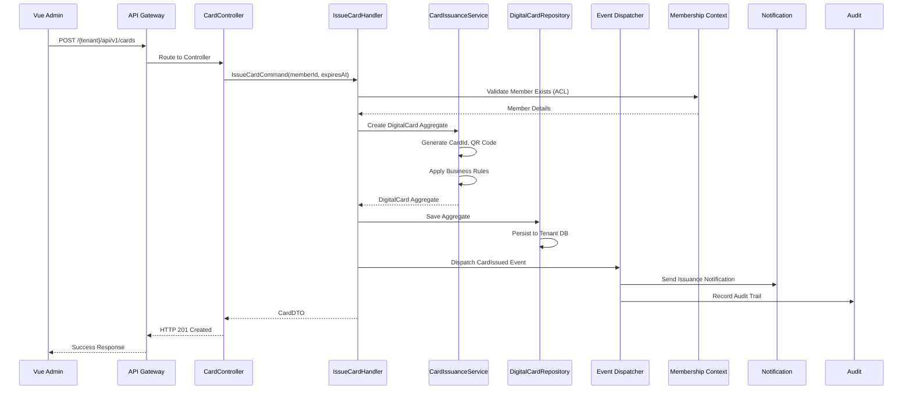
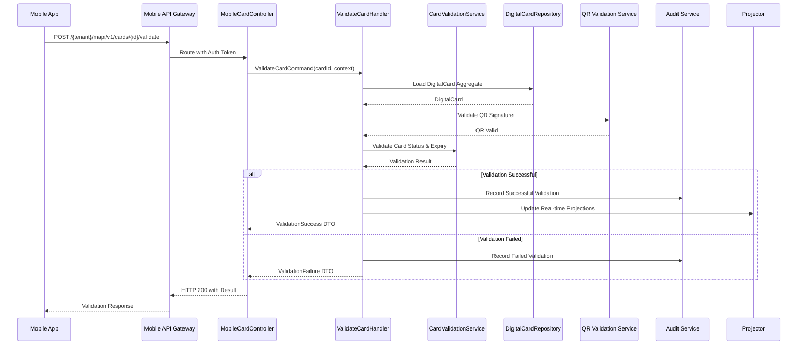
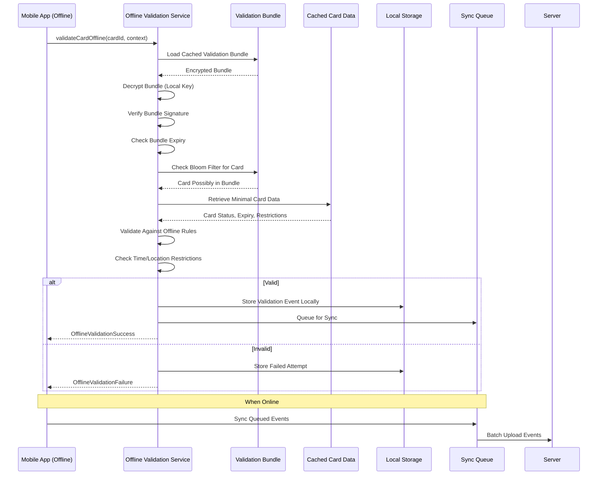
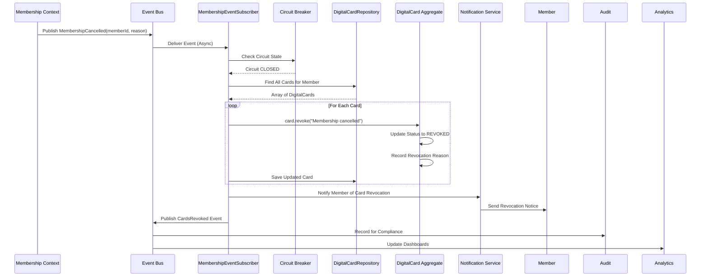

# **DIGITALCARD CONTEXT - ENTERPRISE ARCHITECTURE DIAGRAM**

## **📊 COMPLETE SYSTEM ARCHITECTURE**

```mermaid
graph TB
    subgraph "EXTERNAL SYSTEMS & CLIENTS"
        VUE[Vue 3 Desktop Admin<br/>Inertia.js]
        ANG[Angular Mobile App<br/>Ionic/Capacitor]
        WALL[Apple/Google Wallet<br/>Mobile Wallets]
        API[External APIs<br/>Partners/Integrations]
    end

    subgraph "GATEWAY LAYER<br/>6-Case Routing"
        GW1[API Gateway<br/>Case 4: /{tenant}/api/v1/*<br/>Desktop Admin]
        GW2[API Gateway<br/>Case 2: /{tenant}/mapi/v1/*<br/>Mobile API]
        GW3[WebSocket Gateway<br/>Real-time Updates]
    end

    subgraph "DIGITALCARD BOUNDED CONTEXT<br/>Core Business Logic"
        subgraph "DOMAIN LAYER<br/>Pure Business Logic"
            AGG1[DigitalCard Aggregate<br/>Member Identity Card]
            AGG2[GuestCard Aggregate<br/>Temporary Guest Access]
            VO1[Value Objects<br/>CardId, MemberId, QRCode]
            ENUM1[Enums<br/>CardStatus, GuestCardType]
            EVT[Domain Events<br/>CardIssued, CardValidated, etc.]
            
            AGG1 -->|contains| VO1
            AGG2 -->|contains| VO1
            AGG1 -->|publishes| EVT
            AGG2 -->|publishes| EVT
        end

        subgraph "APPLICATION LAYER<br/>Use Case Orchestration"
            CMD1[Commands<br/>IssueCard, ValidateCard, RevokeCard]
            CMD2[Commands<br/>IssueGuestCard, ValidateGuest]
            HAND1[Command Handlers<br/>Business Logic Orchestration]
            QRY1[Queries<br/>GetMemberCard, GetCardHistory]
            DTO1[DTOs<br/>Data Transfer Objects]
            
            CMD1 -->|processed by| HAND1
            CMD2 -->|processed by| HAND1
            HAND1 -->|returns| DTO1
        end

        subgraph "DOMAIN SERVICES<br/>Cross-Aggregate Logic"
            DS1[CardValidationService<br/>Online/Offline Validation]
            DS2[CardIssuanceService<br/>Card Creation Logic]
            DS3[GuestCardPolicyEngine<br/>Guest Card Rules]
            DS4[OfflineValidationSystem<br/>Bundle Generation]
            DS5[DigitalWalletIntegration<br/>Wallet Pass Creation]
        end
    end

    subgraph "INFRASTRUCTURE LAYER<br/>Technical Implementation"
        subgraph "PERSISTENCE"
            REPO1[DigitalCardRepository<br/>Aggregate Persistence]
            REPO2[GuestCardRepository<br/>Guest Card Storage]
            REPO3[AuditRepository<br/>Compliance & Audit]
            PROJ1[RealTimeProjector<br/>CQRS Projections]
            PROJ2[EventProjector<br/>Read Model Updates]
            
            REPO1 -->|implements| AGG1
            REPO2 -->|implements| AGG2
            EVT -->|consumed by| PROJ1
            EVT -->|consumed by| PROJ2
        end

        subgraph "EXTERNAL INTEGRATIONS"
            ACL1[MembershipEventSubscriber<br/>Anti-Corruption Layer]
            ACL2[CircuitBreaker<br/>Resilience Pattern]
            INT1[SignedQRCodeGenerator<br/>HMAC Signatures]
            INT2[WalletService<br/>Apple/Google Wallet]
            INT3[PushNotificationService<br/>Mobile Notifications]
            
            ACL1 -->|listens to| MEMBERSHIP_EVENTS
            ACL2 -->|protects| EXTERNAL_CALLS
        end

        subgraph "API LAYER"
            CTRL1[DigitalCardController<br/>Desktop Admin API]
            CTRL2[MobileCardController<br/>Mobile API]
            CTRL3[GuestCardController<br/>Guest Card API]
            MID1[ApiVersionNegotiation<br/>Version Management]
            MID2[TenantIsolation<br/>Multi-tenancy]
            
            CTRL1 -->|uses| HAND1
            CTRL2 -->|uses| HAND1
            CTRL3 -->|uses| HAND1
        end
    end

    subgraph "SUPPORTING INFRASTRUCTURE"
        subgraph "OBSERVABILITY"
            OBS1[DistributedTracer<br/>OpenTelemetry]
            OBS2[MetricsCollector<br/>Prometheus Metrics]
            OBS3[HealthCheckService<br/>K8s Readiness/Liveness]
            OBS4[LoggingPipeline<br/>Structured Logging]
        end

        subgraph "RESILIENCE"
            RES1[IdempotentEventProcessor<br/>Exactly-Once Processing]
            RES2[RateLimiter<br/>API Protection]
            RES3[CircuitBreaker<br/>Failure Isolation]
            RES4[RetryMechanism<br/>Transient Failure Handling]
        end

        subgraph "SECURITY"
            SEC1[JWT/Sanctum Auth<br/>Authentication]
            SEC2[TenantIsolation<br/>Data Separation]
            SEC3[AuditLogger<br/>Compliance Trail]
            SEC4[EncryptionService<br/>Data at Rest/Transit]
        end
    end

    subgraph "DATA STORES"
        subgraph "WRITE STORE<br/>Tenant Databases"
            TDB1[(Tenant DB 1<br/>Digital Cards)]
            TDB2[(Tenant DB 2<br/>Guest Cards)]
            TDB3[(Tenant DB 3<br/>Audit Logs)]
        end

        subgraph "READ STORE<br/>Optimized for Queries"
            RDB1[(Materialized Views<br/>Dashboards)]
            RDB2[(Time-Series DB<br/>Analytics)]
            RDB3[(Redis Cache<br/>Real-time Data)]
        end

        subgraph "EVENT STORE"
            ES1[(Event Store<br/>Domain Events)]
            ES2[(Message Queue<br/>Async Processing)]
        end
    end

    subgraph "EXTERNAL BOUNDED CONTEXTS<br/>Via Published Language"
        MEMBERSHIP[Membership Context<br/>Member Management]
        ELECTION[Election Context<br/>Voting & Elections]
        GEOGRAPHY[Geography Context<br/>Location Services]
        NOTIFICATION[Notification Context<br/>Messaging]
    end

    %% CONNECTIONS BETWEEN COMPONENTS

    %% External Clients to Gateway
    VUE -->|HTTP/HTTPS| GW1
    ANG -->|HTTP/HTTPS| GW2
    WALL -->|Push Notifications| GW3
    
    %% Gateway to API Layer
    GW1 -->|Routes to| CTRL1
    GW2 -->|Routes to| CTRL2
    
    %% API Layer to Application
    CTRL1 -->|Executes| CMD1
    CTRL2 -->|Executes| CMD1
    CTRL3 -->|Executes| CMD2
    
    %% Application to Domain
    HAND1 -->|Orchestrates| DS1
    HAND1 -->|Orchestrates| DS2
    HAND1 -->|Creates| AGG1
    HAND1 -->|Creates| AGG2
    
    %% Domain Services to External
    DS4 -->|Generates| OFFLINE_BUNDLES[Offline Validation Bundles]
    DS5 -->|Integrates with| WALL
    
    %% Persistence Connections
    REPO1 -->|Stores in| TDB1
    REPO2 -->|Stores in| TDB2
    REPO3 -->|Stores in| TDB3
    PROJ1 -->|Updates| RDB1
    PROJ2 -->|Updates| RDB2
    
    %% Event Flow
    EVT -->|Published to| ES2
    ES2 -->|Consumed by| PROJ1
    ES2 -->|Consumed by| PROJ2
    ES2 -->|Consumed by| ACL1
    
    %% Cross-Context Communication
    ACL1 -->|Listens to| MEMBERSHIP
    DS1 -->|Validates against| GEOGRAPHY
    EVT -->|Notifies| NOTIFICATION
    
    %% Infrastructure Services
    OBS1 -->|Traces| ALL_COMPONENTS[All Components]
    OBS2 -->|Collects from| ALL_COMPONENTS
    OBS3 -->|Monitors| ALL_COMPONENTS
    SEC1 -->|Protects| GW1
    SEC1 -->|Protects| GW2
    SEC2 -->|Enforces| TDB1
    SEC2 -->|Enforces| TDB2
    
    %% Resilience Patterns
    RES1 -->|Processes| EVT
    RES2 -->|Protects| CTRL1
    RES2 -->|Protects| CTRL2
    RES3 -->|Protects| ACL1
    RES4 -->|Handles| EXTERNAL_CALLS

    classDef external fill:#e1f5fe,stroke:#01579b
    classDef gateway fill:#f3e5f5,stroke:#4a148c
    classDef domain fill:#e8f5e8,stroke:#1b5e20
    classDef application fill:#fff3e0,stroke:#e65100
    classDef infrastructure fill:#fce4ec,stroke:#880e4f
    classDef persistence fill:#e0f2f1,stroke:#004d40
    classDef observability fill:#fff8e1,stroke:#ff6f00
    classDef resilience fill:#e8eaf6,stroke:#283593
    classDef security fill:#ffebee,stroke:#b71c1c
    classDef datastore fill:#f5f5f5,stroke:#212121
    classDef externalcontext fill:#f1f8e9,stroke:#33691e
    
    class VUE,ANG,WALL,API external
    class GW1,GW2,GW3 gateway
    class AGG1,AGG2,VO1,ENUM1,EVT domain
    class CMD1,CMD2,HAND1,QRY1,DTO1 application
    class DS1,DS2,DS3,DS4,DS5 domain
    class CTRL1,CTRL2,CTRL3,MID1,MID2 infrastructure
    class REPO1,REPO2,REPO3,PROJ1,PROJ2 persistence
    class ACL1,ACL2,INT1,INT2,INT3 infrastructure
    class OBS1,OBS2,OBS3,OBS4 observability
    class RES1,RES2,RES3,RES4 resilience
    class SEC1,SEC2,SEC3,SEC4 security
    class TDB1,TDB2,TDB3,RDB1,RDB2,RDB3,ES1,ES2 datastore
    class MEMBERSHIP,ELECTION,GEOGRAPHY,NOTIFICATION externalcontext
```

## **🔄 DATA FLOW SEQUENCE DIAGRAMS**

### **1. Card Issuance Flow**


### **2. Mobile Validation Flow (Online)**


### **3. Offline Validation Flow**


### **4. Cross-Context Event Flow (Membership Cancellation)**


## **🏗️ ARCHITECTURAL DECISION RECORDS (ADRs)**

### **ADR-001: Separate Bounded Context**
```yaml
Title: DigitalCard as Separate Bounded Context
Status: Accepted
Context: Need to manage digital membership cards with own lifecycle
Decision: Create separate DigitalCardContext independent from Membership
Consequences:
  Pros:
    - Clear separation of concerns
    - Independent scaling
    - Specialized domain logic
    - Future extensibility (guest cards, wallets)
  Cons:
    - Increased complexity
    - Cross-context communication needed
    - Data consistency challenges
```

### **ADR-002: CQRS with Event Sourcing**
```yaml
Title: CQRS Pattern for Read/Write Separation
Status: Implemented in Phase 3
Context: Need real-time dashboards and complex queries
Decision: Implement Command-Query Responsibility Segregation
Consequences:
  Pros:
    - Optimized read performance
    - Real-time projections
    - Scalable query side
    - Audit trail via events
  Cons:
    - Eventual consistency
    - Increased infrastructure
    - Complex error handling
```

### **ADR-003: Multi-tenant Database Isolation**
```yaml
Title: Database-per-Tenant Pattern
Status: Mandatory (Platform Constraint)
Context: Strict tenant data isolation required
Decision: Physical database separation per tenant
Consequences:
  Pros:
    - Maximum data isolation
    - Independent backup/restore
    - Custom per-tenant schemas
    - Simplified data governance
  Cons:
    - Database connection overhead
    - Migration complexity
    - Higher operational cost
```

### **ADR-004: Offline-First Mobile Strategy**
```yaml
Title: Offline Validation Capability
Status: Implemented in Phase 4
Context: Mobile apps need to work in low-connectivity areas
Decision: Implement secure offline validation bundles
Consequences:
  Pros:
    - Operational resilience
    - Better user experience
    - Reduced server load
    - Bandwidth optimization
  Cons:
    - Security complexity
    - Bundle management
    - Sync conflict resolution
    - Increased mobile app size
```

## **📈 SCALABILITY CONSIDERATIONS**

### **Horizontal Scaling Plan**
```
┌─────────────────────────────────────────────────────┐
│                   Load Balancer                      │
├─────────────────────────────────────────────────────┤
│  ┌──────────┐  ┌──────────┐  ┌──────────┐         │
│  │   API    │  │   API    │  │   API    │         │
│  │  Node 1  │  │  Node 2  │  │  Node N  │         │
│  └──────────┘  └──────────┘  └──────────┘         │
├─────────────────────────────────────────────────────┤
│  ┌──────────┐  ┌──────────┐  ┌──────────┐         │
│  │  Worker  │  │  Worker  │  │  Worker  │         │
│  │  Pool 1  │  │  Pool 2  │  │  Pool N  │         │
│  └──────────┘  └──────────┘  └──────────┘         │
├─────────────────────────────────────────────────────┤
│           Redis Cluster (Cache & Queue)             │
├─────────────────────────────────────────────────────┤
│       ┌────────────┐         ┌────────────┐        │
│       │  Read      │         │  Write     │        │
│       │  Replicas  │◄───────►│  Primary   │        │
│       │ (x5)       │         │  Database  │        │
│       └────────────┘         └────────────┘        │
└─────────────────────────────────────────────────────┘
```

### **Database Partitioning Strategy**
```sql
-- Tenant-level partitioning
CREATE TABLE digital_cards (
    id UUID PRIMARY KEY,
    tenant_id BIGINT NOT NULL,
    member_id UUID NOT NULL,
    -- ... other columns
    PARTITION BY LIST (tenant_id)
);

-- Time-based partitioning for audit tables
CREATE TABLE card_validation_audit (
    id UUID PRIMARY KEY,
    occurred_at TIMESTAMPTZ NOT NULL,
    -- ... other columns
    PARTITION BY RANGE (occurred_at)
);
```

## **🔐 SECURITY ARCHITECTURE**

```
┌─────────────────────────────────────────────────────┐
│                SECURITY LAYERS                      │
├─────────────────────────────────────────────────────┤
│  7. BUSINESS LOGIC                                  │
│     • Card validation rules                         │
│     • Access restrictions                           │
│     • Usage quotas                                  │
├─────────────────────────────────────────────────────┤
│  6. DATA LEVEL                                      │
│     • Row-level security                            │
│     • Column encryption                             │
│     • Audit logging                                 │
├─────────────────────────────────────────────────────┤
│  5. APPLICATION LEVEL                               │
│     • Input validation                              │
│     • Output encoding                               │
│     • CSRF protection                               │
├─────────────────────────────────────────────────────┤
│  4. API GATEWAY                                     │
│     • Rate limiting                                 │
│     • DDoS protection                               │
│     • API key management                            │
├─────────────────────────────────────────────────────┤
│  3. NETWORK LEVEL                                   │
│     • VPC isolation                                 │
│     • Security groups                               │
│     • WAF rules                                     │
├─────────────────────────────────────────────────────┤
│  2. INFRASTRUCTURE                                  │
│     • TLS 1.3 everywhere                            │
│     • Secret management                             │
│     • HSM for keys                                  │
├─────────────────────────────────────────────────────┤
│  1. PHYSICAL                                        │
│     • Data center security                          │
│     • Disk encryption                               │
│     • Backup encryption                             │
└─────────────────────────────────────────────────────┘
```

## **🎯 KEY PERFORMANCE INDICATORS**

| Layer | KPI | Target | Measurement |
|-------|-----|--------|-------------|
| **API** | P95 Response Time | < 200ms | APM Tooling |
| **Database** | Query Latency | < 50ms | DB Monitoring |
| **Cache** | Hit Rate | > 95% | Redis Metrics |
| **Queue** | Processing Lag | < 1s | Queue Monitoring |
| **Mobile** | Offline Success | > 99% | App Analytics |
| **Business** | Validation Success | > 99.5% | Business Metrics |

---

This architecture represents a **production-grade, enterprise-ready DigitalCardContext** that:
1. **Scales horizontally** to support millions of cards
2. **Maintains data isolation** across thousands of tenants  
3. **Provides real-time insights** through CQRS and projections
4. **Ensures resilience** with circuit breakers and retry logic
5. **Supports mobile-first** with offline capabilities
6. **Integrates seamlessly** with external systems via published language
7. **Maintains compliance** with comprehensive audit trails

The architecture respects all DDD principles while meeting the strict multi-tenancy, routing, and security requirements of your platform.