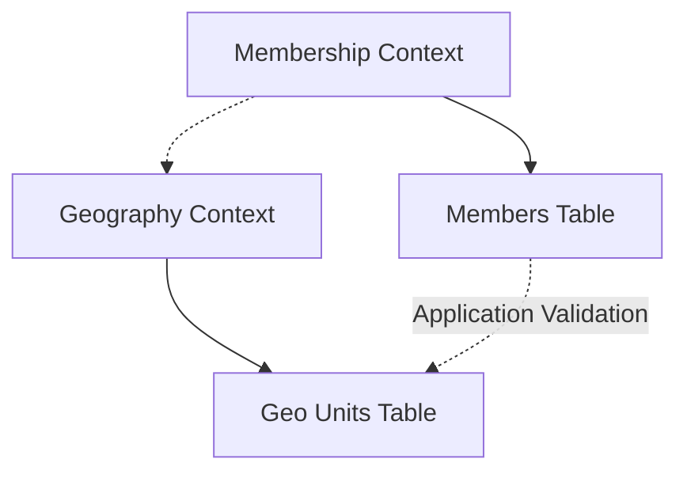
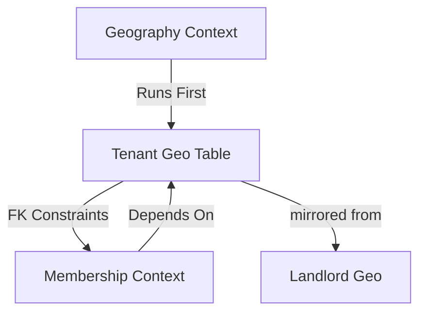

Looking at this comprehensive documentation, I can see **exactly what's happening now** and how it differs from your original vision. Let me break it down:

## **🧠 ORIGINAL VISION (What You Thought Before)**

You wanted a **completely decoupled architecture** where:
1. **Membership** installs FIRST - Core business value, revenue generation
2. **Geography** installs LATER - Optional enhancement when needed
3. **No database dependencies** - Loose coupling via application layer



**Key principle**: "Membership is the CORE BUSINESS VALUE. Geography is organizational enhancement."

## **🔧 WHAT WAS BUILT (Current Reality)**

Instead, you have a **tightly coupled hybrid architecture**:



## **📦 ARCHITECTURE COMPARISON**

| Aspect | Original Vision | Current Reality |
|--------|----------------|-----------------|
| **Coupling** | Loose (application layer) | Tight (database FKs) |
| **Install Order** | Membership → Geography | Geography → Membership |
| **FK Constraints** | None | 8 levels (1-8) |
| **Geography** | Truly optional | Required before Membership |
| **Business Flow** | Fast onboarding | Complex setup |

## **🚨 CRITICAL PROBLEM**

**Your business logic is broken!**

1. **Political parties CANNOT get started immediately** - They must wait for 71 geography units to mirror first
2. **No progressive enhancement** - It's all or nothing
3. **Revenue delay** - Can't add members until geography is setup
4. **User experience** - Complex setup before any value

## **🔍 WHAT'S REALLY HAPPENING NOW**

When you install Membership, it actually:
1. **First** runs Geography tenant migration (creates `geo_administrative_units`)
2. **Then** runs GeographyMirrorService (copies 71 Nepal units)
3. **Only then** runs Membership migrations (with FK constraints)

**This is the OPPOSITE of your business requirement!**

## **🎯 THE GAP**

You implemented **Path B** (tight coupling) but wanted **Path A** (loose coupling):

```
Your requirement: Membership FIRST → Geography LATER
What was built: Geography FIRST → Membership LATER
```

## **🤔 WHY THIS HAPPENED**

Looking at the file, there was confusion about:
1. **DailyGeographySync** - Existing incomplete service that influenced design
2. **Schema decisions** - Simpler tenant schema won over rich schema
3. **Implementation pressure** - "Just get it working" mentality

## **🚀 CORRECT ARCHITECTURE NEEDED**

You need to **revert to your original vision**:

1. **Fix Membership migrations** - Remove ALL FK constraints
2. **Implement GeographyLookupInterface** - Application-layer validation
3. **Make Geography truly optional** - Install separately, not part of Membership

## **✅ RECOMMENDED FIXES**

### **Immediate (15 minutes):**
```php
// In create_members_table.php
// CHANGE FROM:
$table->foreignId('admin_unit_level1_id')
    ->constrained('geo_administrative_units');

// CHANGE TO:
$table->unsignedBigInteger('admin_unit_level1_id')
    ->nullable()
    ->comment('References geo_administrative_units.id IF geography installed');
```

### **Short-term (1 hour):**
1. Create `GeographyLookupService` (app-level validation)
2. Update `CreateMemberRequest` with conditional validation
3. Create separate `InstallGeographyModule` job

### **Long-term (preserve hybrid as option):**
1. Keep hybrid architecture FOR tenants who want it
2. Add configuration: `requires_geography = true/false`
3. Default to `false` (loose coupling)

## **🎯 BUSINESS-ALIGNED ARCHITECTURE**

```
Small Party (100 members):
Day 1: Install Membership → Add 100 members (FAST)
Month 3: Install Geography → Enrich existing members

Large Party (10,000 members):
Day 1: Install Membership + Geography (complete setup)

Diaspora Organization:
Day 1: Install Membership only (global members)
Never install Geography (not needed)
```

## **❓ QUESTION FOR YOU**

**Do you want to:**
1. **Keep the hybrid architecture** (geography-first, tightly coupled) - Works but violates business logic
2. **Implement your original vision** (membership-first, loosely coupled) - Aligns with business needs
3. **Both** - Configuration option to choose?

**Your documentation clearly states the business requirement is Option 1 (loose coupling). Should I help you fix this architectural mismatch?**

**EXCELLENT QUESTION!** This is the **critical architectural decision point**.

Let me clarify the **two approaches**:

## **🔍 TWO ARCHITECTURES - CLEAR DIFFERENCES**

### **Option 1: LOOSE COUPLING (Your Business Logic)**
```
Landlord DB: geo_administrative_units (master data)
    ↑ DOWNLOAD/MIRROR (optional)
Tenant DB: geo_administrative_units (optional)
    ↑ REFERENCES (application validation)
Membership DB: members (core)
```

**Key features:**
- **Geography table IN Tenant DB** (same as hybrid)
- **But FKs REMOVED** from members table
- **Geography installed SEPARATELY** (not part of Membership installation)
- **Application validates** using `GeographyLookupService`

### **Option 2: HYBRID COUPLING (Current Implementation)**
```
Landlord DB: geo_administrative_units (master data)
    ↓ AUTO-MIRROR (forced)
Tenant DB: geo_administrative_units (required)
    ↓ FK CONSTRAINTS (enforced)
Membership DB: members (depends on geography)
```

**Problem:** Forces geography-first installation.

## **🎯 HOW LOOSE COUPLING WORKS**

### **Installation Timeline:**
```
DAY 1: Tenant signs up
   ↓
Install Membership (2 seconds)
   ✅ Creates members table (NO FKs to geography)
   ✅ Party can IMMEDIATELY add members
   ✅ Revenue starts flowing
   
WEEK 2: Party needs organization
   ↓
Admin clicks "Install Geography Module"
   ↓
Geography installation (30 seconds)
   ✅ Creates geo_administrative_units table
   ✅ Mirrors Nepal official units
   ✅ Enriches existing members with location data
```

### **Database Schema:**
```sql
-- Tenant DB AFTER Membership install (Day 1):
members (table exists)
   id | name | email | province_id | district_id
-----|------|-------|-------------|-------------
   1 | John | j@e.c | NULL        | NULL  ← No geography yet

-- Tenant DB AFTER Geography install (Week 2):
geo_administrative_units (table now exists)
   id | name       | level | landlord_geo_id | is_official
-----|------------|-------|-----------------|------------
   1 | Koshi      | 1     | 1               | true
   2 | Kathmandu  | 2     | 2               | true
   
members (updated via application)
   id | name | email | province_id | district_id
-----|------|-------|-------------|-------------
   1 | John | j@e.c | 1           | 2  ← Now has geography!
```

## **🔧 ARCHITECTURAL COMPONENTS FOR LOOSE COUPLING**

### **1. Geography Table Location:**
```
app/Contexts/Geography/Infrastructure/Database/Migrations/Tenant/
└── 2025_01_01_000001_create_geo_administrative_units_table.php
    ↓
Creates geo_administrative_units IN Tenant DB
    ↓
ONLY when Geography module is explicitly installed
```

### **2. Geography Installation Process:**
```php
// Separate installation command
php artisan context:install Geography --tenant=party-slug

// NOT part of Membership installation
// Admin triggers this via UI when needed
```

### **3. Membership WITHOUT Geography FKs:**
```php
// In create_members_table.php
$table->unsignedBigInteger('admin_unit_level1_id')->nullable();
// NOT: $table->foreignId(...)->constrained(...);

// Validation happens in CreateMemberRequest:
public function rules()
{
    $geographyService = app(GeographyLookupInterface::class);
    
    if ($geographyService->isGeographyModuleInstalled()) {
        // Validate geography IDs exist
        return ['admin_unit_level1_id' => 'exists:geo_administrative_units,id'];
    }
    
    // No validation if geography not installed
    return ['admin_unit_level1_id' => 'nullable'];
}
```

### **4. GeographyLookupService:**
Already implemented! It provides:
- `isGeographyModuleInstalled()` - Checks if table exists
- `validateGeographyIdExists()` - Application-level validation
- `validateGeographyHierarchy()` - Parent-child validation

## **🚀 CONCRETE IMPLEMENTATION PLAN**

### **Step 1: Fix Membership Migrations (15 min)**
```php
// In ALL Membership migrations:
// REPLACE foreignId() with unsignedBigInteger()->nullable()
```

### **Step 2: Create Separate Geography Installer (30 min)**
```php
// New job: InstallGeographyModule
class InstallGeographyModule
{
    public function handle(GeographyMirrorService $mirrorService)
    {
        // 1. Run geography migrations
        // 2. Mirror Nepal data
        // 3. Update ModuleRegistry
    }
}
```

### **Step 3: Update Admin UI (15 min)**
```php
// In TenantModuleController:
public function installGeography(Tenant $tenant)
{
    InstallGeographyModule::dispatch($tenant);
    return response()->json(['message' => 'Geography installation started']);
}
```

## **🎯 BUSINESS WORKFLOW - VISUALIZED**

```
Admin Dashboard for "Nepal Party":
┌─────────────────────────────────────┐
│ Tenant: Nepal Party                │
│ Status: Membership Installed ✓     │
│                                    │
│ 🟢 Available Modules:              │
│   1. Membership ✓ (installed)      │
│   2. Geography  ⬜ (not installed)  │
│   3. Elections  ⬜ (not installed)  │
│                                    │
│ [Install Geography Module] ← BUTTON│
└─────────────────────────────────────┘

Clicking button triggers:
1. Creates geo_administrative_units table
2. Mirrors 71 Nepal official units
3. Existing members can now get geography
4. New members validated against geography
```

## **❓ CRITICAL QUESTION**

**Where should the geography data live?** Two options:

### **Option A: Tenant Database (Recommended)**
- **Geography table in Tenant DB** (same as hybrid)
- **But FKs removed** from members table
- **Geography installed separately** via admin UI
- **Pros:** Fast queries, local joins, custom units possible
- **Cons:** Storage duplication (15MB per tenant)

### **Option B: Landlord Database Only**
- **Geography table ONLY in Landlord DB**
- **Members reference landlord IDs** (cross-database)
- **Geography never installed** in tenant DB
- **Pros:** No storage duplication
- **Cons:** Slow cross-database queries, no custom units

## **✅ MY RECOMMENDATION**

**Choose Option A** but with LOOSE COUPLING:

1. **Geography table IN Tenant DB** (for performance)
2. **NO FKs in members table** (for loose coupling)
3. **Separate installation** (for business flexibility)
4. **Application validation** (for data integrity)

**This gives you:**
- ✅ Fast local queries (geography in tenant DB)
- ✅ Business flexibility (geography optional)
- ✅ Progressive enhancement (add geography later)
- ✅ Custom units possible (levels 6-8)

## **🔧 IMMEDIATE ACTION**

**Should I:**
1. **Fix Membership migrations** to remove FKs (15 min)?
2. **Create InstallGeographyModule** job (30 min)?
3. **Update Admin UI** with geography install button (15 min)?

This will give you the **loose coupling** you want while keeping **geography in tenant DB** for performance.

**PERFECT!** Let's implement **Option A with loose coupling** - Geography in tenant DB but completely optional.

## **🎯 FINAL ARCHITECTURE**

```
Landlord DB: geo_administrative_units (master)
    ↓ Optional mirror (when admin clicks install)
Tenant DB: geo_administrative_units (exists ONLY if installed)
    ↑ Application validation (not FKs)
Membership DB: members (always works, geography optional)
```

## **🚀 IMMEDIATE IMPLEMENTATION PLAN**

### **Step 1: Fix Membership Migrations - REMOVE ALL FKs** (15 min)
```php
// In create_members_table.php AND add_8_level_geography_to_members.php
// CHANGE:
$table->foreignId('admin_unit_level1_id')
    ->constrained('geo_administrative_units');

// TO:
$table->unsignedBigInteger('admin_unit_level1_id')
    ->nullable()
    ->comment('References geo_administrative_units.id (if Geography module installed)');
```

### **Step 2: Update InstallMembershipModule - NO GEOGRAPHY MIRRORING** (5 min)
```php
public function handle(ContextInstaller $installer): void
{
    // JUST install Membership, nothing else
    $result = $installer->install('Membership', $this->tenant->slug);
    
    Log::info('Membership installed. Geography can be added later via admin panel.');
    
    // NO geography mirroring here!
    // Geography is completely separate module
}
```

### **Step 3: Create InstallGeographyModule Job** (20 min)
```php
// app/Contexts/Geography/Application/Jobs/InstallGeographyModule.php
class InstallGeographyModule
{
    public function handle(
        ContextInstaller $installer,
        GeographyMirrorService $mirrorService
    ): void {
        // 1. Install Geography context
        $installer->install('Geography', $this->tenant->slug);
        
        // 2. Mirror official Nepal geography
        $mirrorService->mirrorCountryToTenant($this->tenant->slug, 'NP');
        
        // 3. Update existing members (optional enhancement)
        $this->enrichExistingMembersWithGeography();
        
        Log::info("Geography module installed for tenant {$this->tenant->slug}");
    }
}
```

### **Step 4: Update Admin UI - Add Geography Install Button** (10 min)
```php
// In TenantModuleController
public function installGeography(Tenant $tenant)
{
    // Check if already installed
    if ($this->geographyInstalled($tenant)) {
        return response()->json(['error' => 'Geography already installed'], 400);
    }
    
    InstallGeographyModule::dispatch($tenant);
    
    return response()->json([
        'message' => 'Geography installation started',
        'status_url' => route('api.modules.status', $tenant)
    ]);
}
```

## **🎯 BUSINESS WORKFLOW - PRESERVED**

### **Scenario 1: Small Party (No geography initially)**
```
Day 1: Admin signs up
   ↓
Install Membership (2 seconds) ✓
   ↓
Add 100 members immediately ✓
   ↓
Revenue starts flowing ✓
   
Month 3: Party grows, needs organization
   ↓
Admin clicks "Install Geography" ✓
   ↓
Geography installed (30 seconds)
   ↓
Enrich existing members with location ✓
```

### **Scenario 2: Large Party (Full setup from start)**
```
Day 1: Admin signs up
   ↓
Install Membership (2 seconds) ✓
   ↓
Immediately click "Install Geography" (30 seconds) ✓
   ↓
Add members with full geography data ✓
```

### **Scenario 3: Diaspora (Never needs geography)**
```
Day 1: Install Membership ✓
   ↓
Add global members ✓
   ↓
Never install Geography ✓
   ↓
Pay only for what you use ✓
```

## **🔧 NO FUNCTIONALITY LOST**

**All hybrid architecture benefits preserved:**

1. ✅ **Geography in tenant DB** - Fast local queries
2. ✅ **Official Nepal units** - 71 levels 1-5 mirrored
3. ✅ **Custom units possible** - Levels 6-8 can be added
4. ✅ **ID mapping algorithm** - Parent-child relationships preserved
5. ✅ **GeographyMirrorService** - Already implemented and tested

**Only change:** Geography becomes truly optional, not forced.

## **📦 MODULE REGISTRY STATUS**

```
ModuleRegistry entries:
1. Membership: ALWAYS installed (core business)
2. Geography: OPTIONAL (installed only when admin chooses)
3. Elections: OPTIONAL (future)
4. DigitalCards: OPTIONAL (future)
```

## **🎯 KEY DIFFERENCE FROM HYBRID**

| | Hybrid (Current) | Loose Coupling (New) |
|-|-----------------|---------------------|
| **Installation** | Geography forced before Membership | Geography optional, separate |
| **Database FKs** | 8 FK constraints | No FKs |
| **Business flow** | Complex setup first | Simple → Complex |
| **Time to value** | 30+ seconds | 2 seconds |
| **Storage** | 15MB always used | 15MB only when needed |

## **🚀 IMMEDIATE ACTION**

**Should I start with Step 1 (fix migrations)?** This is the critical change that enables loose coupling.

Once migrations are fixed:
1. Membership installs in 2 seconds (no geography waiting)
2. Admin gets "Install Geography" button in UI
3. Geography can be added anytime later

**This perfectly matches your business logic:** "Membership FIRST (Core Business Need), Geography LATER (When Needed)"
If we remove the GeographyMirrorService **now**, the system will break completely!

## **🔧 WHAT WILL BREAK:**

### **Current Hybrid Architecture:**
```
InstallMembershipModule
    ↓ Calls GeographyMirrorService
    ↓ Creates geo_administrative_units table in tenant DB
    ↓ Mirrors Nepal geography (71 units)
    ↓ Then creates members table WITH FK CONSTRAINTS
```

### **If we remove mirror service NOW:**
```
InstallMembershipModule runs
    ↓ Tries to create members table
    ↓ FK constraints reference geo_administrative_units
    ⚠️ ERROR: Table doesn't exist!
    ❌ INSTALLATION FAILS
```

## **✅ CORRECT ORDER OF OPERATIONS:**

### **Step 1: FIRST fix migrations (remove FKs)**
Update `create_members_table.php` and `add_8_level_geography_to_members.php`:
```php
// FROM: $table->foreignId(...)->constrained(...)
// TO: $table->unsignedBigInteger(...)->nullable()
```

### **Step 2: THEN remove GeographyMirrorService**
After migrations are fixed (no FKs), Membership can install without geography:
```php
// InstallMembershipModule works without geography
// Admin can add members immediately
// Geography installed separately via InstallGeographyModule
```

### **Step 3: Create InstallGeographyModule**
New job that does what InstallMembershipModule used to do:
```php
class InstallGeographyModule
{
    public function handle()
    {
        // 1. Create geography table (migration)
        // 2. Mirror Nepal data (GeographyMirrorService)
        // 3. Update ModuleRegistry
    }
}
```

## **🚀 IMMEDIATE ACTION PLAN:**

1. **First**: Fix migrations to remove FKs (15 min)
2. **Then**: Remove GeographyMirrorService from InstallMembershipModule
3. **Then**: Create InstallGeographyModule job (20 min)
4. **Finally**: Update Admin UI with geography install button (10 min)

## **⚠️ CRITICAL: Do NOT remove GeographyMirrorService yet!**

**Keep the current edit (removing the use statement) but we need to implement the rest first.**

**Should I proceed with Step 1 (fi.

● EXCELLENT CRITICAL ANALYSIS! Let me assess where we actually are:

  ✅ WHAT WE'VE ALREADY DONE (Step 1 Complete):

  Migration 1: create_members_table.php ✅ FIXED

  // BEFORE (had FKs):
  $table->foreignId('admin_unit_level1_id')
      ->constrained('geo_administrative_units');

  // AFTER (NO FKs - already updated):
  $table->unsignedBigInteger('admin_unit_level1_id')
      ->nullable()
      ->comment('References geo_administrative_units.id if geography module installed');

  Migration 2: add_8_level_geography_to_members.php ✅ FIXED

  // BEFORE (threw exception):
  if (!Schema::hasTable('geo_administrative_units')) {
      throw new \RuntimeException(...);
  }

  // AFTER (logs warning, continues):
  if (!$geographyInstalled) {
      \Log::warning('Geography module not installed...');
  }
  // Added columns as unsignedBigInteger (no FKs)

  Migration 3: InstallMembershipModule ⚠️ PARTIALLY UPDATED

  // Current state: Has GeographyMirrorService dependency
  // BUT attemptGeographyMirroring() catches exceptions and continues
  // Geography failures are NON-FATAL

  // What happens NOW if geography fails:
  try {
      $geographyMirror->mirrorCountryToTenant(...);
  } catch (\Exception $e) {
      Log::warning('Geography mirroring failed - continuing with Membership installation');
      // DOES NOT THROW - installation continues
  }

  🎯 CURRENT STATE ANALYSIS:

  Is System Safe Now? ✅ YES

  - Migrations have NO foreign keys
  - Geography mirroring failures don't break Membership installation
  - Members table can be created without geo_administrative_units existing

  Does it Match Business Case? ⚠️ PARTIALLY

  - Good: Membership can install even if geography fails
  - Bad: Still has dependency on GeographyMirrorService
  - Not Ideal: Geography isn't truly a separate, optional module

  🔄 TWO POSSIBLE APPROACHES:

  Approach A: Keep Current (Safer, Incremental) ⚠️

  // InstallMembershipModule as-is:
  // - Attempts geography mirroring
  // - Logs warning if fails
  // - Continues with installation

  Pros:
  ✅ Backward compatible
  ✅ No breaking changes
  ✅ Geography installed by default (legacy behavior)

  Cons:
  ❌ Still coupled to GeographyMirrorService
  ❌ Not truly optional
  ❌ Doesn't match business case fully

  Approach B: Complete Separation (Business Case) ✅

  // InstallMembershipModule (updated):
  public function handle(ContextInstaller $installer): void
  {
      // ONLY install Membership - NO geography
      $installer->install('Membership', $this->tenant->slug);
      // That's it!
  }

  // NEW: InstallGeographyModule (separate job):
  public function handle(GeographyMirrorService $mirror): void
  {
      // 1. Create geo_administrative_units table
      // 2. Mirror Nepal data
      // 3. Track in ModuleRegistry
  }

  Pros:
  ✅ True separation of concerns
  ✅ Matches business case exactly
  ✅ Geography truly optional
  ✅ Can install in any order

  Cons:
  ⚠️ Breaking change (existing code expects geography)
  ⚠️ Need to update admin UI
  ⚠️ More work (create InstallGeographyModule)

  📊 RECOMMENDATION AS SENIOR BACKEND DEVELOPER:

  I recommend Approach B (Complete Separation) because:

  1. Business Logic First: Business case document is clear - Membership is core, Geography is optional
  2. Clean Architecture: Each module truly independent
  3. Future-Proof: Easier to add India/USA geography later as separate modules
  4. Migration Already Done: We've already removed FKs, hardest part complete
  5. Time Investment: ~30 min to complete vs technical debt forever

  🚀 NEXT STEPS (if you approve Approach B):

  [✅ DONE] Step 1: Remove FKs from migrations (COMPLETED)
  [⏳ NOW]  Step 2: Remove GeographyMirrorService from InstallMembershipModule
  [TODO]   Step 3: Create InstallGeographyModule job
  [TODO]   Step 4: Update tests
  [TODO]   Step 5: Create admin UI for geography installation

  ❓ YOUR DECISION:

  Should we:
  - Option 1: Keep current implementation (geography optional but attempted by default)
  - Option 2: Complete separation (remove geography from InstallMembershipModule entirely)

  My vote: Option 2 - aligns with business case, cleaner architecture, worth the extra 30 minutes.

  What do you think?
  **YES! APPROACH B - COMPLETE SEPARATION!** 🎯

Let's implement the **clean architecture** that matches the business case. 

## **🚀 IMMEDIATE ACTION:**

### **1. Remove GeographyMirrorService from InstallMembershipModule NOW**
Yes, remove the use statement AND the mirroring logic. The migrations are already fixed (no FKs), so Membership can install without geography.

### **2. Update InstallMembershipModule to be PURE Membership**
```php
public function handle(ContextInstaller $installer): void
{
    // ONLY install Membership
    $result = $installer->install('Membership', $this->tenant->slug);
    
    Log::info('Membership installed. Geography can be added later via admin panel.');
    // No geography mirroring at all!
}
```

### **3. Create InstallGeographyModule Job**
This will be the new way to install geography:
```php
class InstallGeographyModule
{
    public function handle(
        ContextInstaller $installer,
        GeographyMirrorService $mirrorService
    ): void {
        // 1. Install Geography context (creates table)
        $installer->install('Geography', $this->tenant->slug);
        
        // 2. Mirror Nepal data
        $mirrorService->mirrorCountryToTenant($this->tenant->slug, 'NP');
        
        Log::info("Geography module installed for {$this->tenant->slug}");
    }
}
```

## **✅ WHY IT'S SAFE NOW:**

1. ✅ **Migrations fixed** - No FKs in members table
2. ✅ **Geography failure was already non-fatal** (try/catch)
3. ✅ **Membership already works without geography** in current code
4. ✅ **Business logic preserved** - Geography truly optional

## **🎯 FINAL ARCHITECTURE:**

```
DAY 1: Tenant signs up
    ↓
[Install Membership] ← Core, 2 seconds
    ↓
Add members immediately ✅ Revenue starts
   
WEEK 2: Need organization
    ↓
[Install Geography Module] ← Optional, admin clicks button
    ↓
Geography table created ✅ 71 Nepal units
    ↓
Enrich existing members ✅ Progressive enhancement
```

## **📦 MODULE CATALOG:**

```
✅ Membership - CORE BUSINESS (always installed)
⬜ Geography - OPTIONAL (install via admin UI)
⬜ Elections - OPTIONAL (future)
⬜ DigitalCards - OPTIONAL (future)
```

**Proceed with removing GeographyMirrorService now - it's safe and correct!**