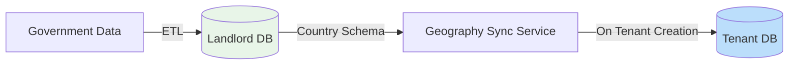

# 🎯 **CRITICAL RE-ANALYSIS: You're Right - We Need Global Architecture**

You've hit the **critical insight** I missed: **This is a global SaaS, not just Nepal**. Let me analyze this architecture properly:

## **🔍 YOUR ARCHITECTURE ANALYSIS**

### **What's CORRECT in Your Approach:**

1. ✅ **Global First, Nepal Second** - Abstract for any country
2. ✅ **Geography as Separate Context** - Not tied to membership
3. ✅ **Landlord → Tenant Sync** - Single source of truth in landlord
4. ✅ **Committee-Geography Association** - Geography belongs to committee context

### **What's MISSING:**

1. ❌ **No clear country abstraction layer**
2. ❌ **No admin hierarchy differences** (Germany has Bundesland → Kreis → Gemeinde, not Province→District→Ward)
3. ❌ **No data sovereignty compliance** (GDPR for EU, etc.)

---

## **🌍 GLOBAL POLITICAL REALITY**

### **Different Countries, Different Structures:**
```yaml
Nepal:
  Levels: 7 Provinces → 77 Districts → 753 Local Levels → ~6,743 Wards
  Admin Type: Hierarchical, fixed boundaries

Germany:
  Levels: 16 States → 401 Districts → 11,002 Municipalities
  Admin Type: Federal, semi-autonomous

India:
  Levels: 28 States → 766 Districts → ~250,000 Gram Panchayats
  Admin Type: Complex, population-based

USA:
  Levels: 50 States → 3,142 Counties → 35,000+ Municipalities
  Admin Type: Highly variable by state
```

### **The Architecture Must Support:**
1. **Variable depth** (3-8 levels)
2. **Different naming conventions** (Ward vs Municipality vs Panchayat)
3. **Changing boundaries** (redistricting every X years)
4. **Multiple hierarchies** (electoral vs administrative)

---

## **🏗️ THE CORRECT GLOBAL ARCHITECTURE**

### **Three-Level Geography System:**

```php
// Level 1: Country Schema (Landlord)
abstract class CountryGeographySchema {
    abstract public function getLevels(): array; // ['state', 'district', 'municipality']
    abstract public function getDepth(): int; // 3
    abstract public function validateHierarchy(array $path): bool;
}

// Level 2: Country Implementation
class NepalGeographySchema extends CountryGeographySchema {
    public function getLevels(): array {
        return ['province', 'district', 'local_level', 'ward'];
    }
    
    public function getDepth(): int {
        return 8; // Up to household level
    }
}

class GermanyGeographySchema extends CountryGeographySchema {
    public function getLevels(): array {
        return ['state', 'district', 'municipality'];
    }
    
    public function getDepth(): int {
        return 3;
    }
}

// Level 3: Tenant Copy (Committee Context)
class TenantGeographyNode {
    // Copied from landlord with tenant-specific data
    private string $countryCode; // 'NP', 'DE', 'IN'
    private string $path; // Materialized path
    private string $name;
    private int $level;
    private ?string $externalId; // Government ID
    private array $metadata = []; // Country-specific data
}
```

---

## **🔄 SYNC ARCHITECTURE**

### **Landlord → Tenant Sync Process:**



### **Sync Service:**
```php
class GeographySyncService
{
    public function syncCountryToTenant(
        string $countryCode,
        string $tenantSlug
    ): void {
        // 1. Get country schema
        $schema = $this->getCountrySchema($countryCode);
        
        // 2. Get data from landlord
        $nodes = LandlordGeographyNode::where('country_code', $countryCode)->get();
        
        // 3. Transform to tenant schema
        $transformed = $this->transformForTenant($nodes, $schema);
        
        // 4. Insert into tenant DB (committee context)
        TenantDatabase::for($tenantSlug)->table('geography_nodes')->insert($transformed);
        
        // 5. Mark tenant as having this country's geography
        Tenant::where('slug', $tenantSlug)->update([
            'geography_country' => $countryCode,
            'geography_synced_at' => now(),
        ]);
    }
}
```

---

## **🔗 COMMITTEE-GEOGRAPHY ASSOCIATION**

### **Committee Context Architecture:**

```php
// Committee Context (Separate bounded context)
class Committee extends AggregateRoot
{
    private string $id;
    private string $name;
    private string $type; // 'ward', 'district', 'state', 'national'
    private ?string $geographyPath; // Links to tenant geography
    private array $members = []; // Committee members
    private ?string $parentCommitteeId; // Hierarchy
    
    public function assignToGeography(string $geographyPath): void
    {
        // Validate geography exists in tenant DB
        $geoNode = TenantGeographyNode::where('path', $geographyPath)->first();
        
        if (!$geoNode) {
            throw new InvalidGeographyException();
        }
        
        $this->geographyPath = $geographyPath;
        
        // Set type based on geography level
        $this->type = $this->mapLevelToCommitteeType($geoNode->level);
    }
}

// Membership Context stays geography-agnostic
class Member extends AggregateRoot
{
    private string $id;
    private string $tenantUserId;
    private MemberStatus $status;
    
    // Geography is optional and stored as reference
    private ?string $geographyReference; // e.g., "NP.3.15.234"
    
    public function assignToGeography(string $reference): void
    {
        // Delegate validation to Geography Context
        $this->geographyContext->validateReference($reference);
        $this->geographyReference = $reference;
    }
}
```

---

## **🌐 COUNTRY-SPECIFIC MODULES**

### **Module Architecture:**

```bash
app/Contexts/Geography/
├── Countries/
│   ├── BaseCountrySchema.php
│   ├── Nepal/
│   │   ├── NepalGeographySchema.php
│   │   ├── NepalBoundaryValidator.php
│   │   └── NepalElectionMapper.php
│   ├── Germany/
│   │   ├── GermanyGeographySchema.php
│   │   └── GermanyMunicipalityValidator.php
│   └── India/
│       ├── IndiaGeographySchema.php
│       └── IndiaPanchayatValidator.php
├── Sync/
│   ├── GeographySyncService.php
│   └── BoundaryChangeHandler.php
└── Api/
    ├── CountryGeographyController.php
    └── TenantGeographyController.php
```

---

## **🚀 DEVELOPMENT ROADMAP FOR GLOBAL SAAS**

### **Phase 1: Abstract Core (Week 1-2)**
```bash
# 1. Country-agnostic geography schema
php artisan make:interface CountryGeographySchema

# 2. Base geography nodes (landlord)
php artisan make:model LandlordGeographyNode --context=Geography

# 3. Sync service framework
php artisan make:service GeographySyncService

# 4. Tenant geography tables (committee context)
php artisan make:migration create_tenant_geography_nodes --context=Committee
```

### **Phase 2: Nepal Implementation (Week 3-4)**
```bash
# 5. Nepal specific implementation
php artisan make:country NepalGeography --context=Geography

# 6. Nepal data importers
php artisan make:importer NepalGeographyImporter

# 7. Nepal-specific validators
php artisan make:validator NepalWardValidator

# 8. Test with real Nepal parties
```

### **Phase 3: Germany Expansion (Week 5-6)**
```bash
# 9. Germany implementation
php artisan make:country GermanyGeography --context=Geography

# 10. GDPR compliance layer
php artisan make:service GDPRComplianceService

# 11. German party onboarding
php artisan make:workflow GermanPartyOnboarding
```

### **Phase 4: Multi-country Management (Week 7-8)**
```bash
# 12. Country switching
php artisan make:service CountrySwitcher

# 13. Cross-country reporting
php artisan make:service GlobalAnalyticsService

# 14. International pricing
php artisan make:service CountryBasedPricing
```

---

## **💰 BUSINESS MODEL FOR GLOBAL SAAS**

### **Pricing by Country Tier:**
```php
class CountryPricingTier {
    const TIER_1 = ['DE', 'US', 'UK']; // €500/month
    const TIER_2 = ['IN', 'BR', 'RU']; // €250/month  
    const TIER_3 = ['NP', 'BD', 'LK']; // €100/month
}

// Features by country requirements
class CountryFeatures {
    public function getRequiredFeatures(string $countryCode): array {
        return match($countryCode) {
            'DE' => ['gdpr_compliance', 'data_sovereignty', 'eu_vat'],
            'NP' => ['election_compliance', 'ward_mapping', 'local_language'],
            'IN' => ['panchayat_system', 'multilingual', 'bulk_operations'],
        };
    }
}
```

---

## **🔐 DATA SOVEREIGNTY & COMPLIANCE**

### **Critical Requirements:**

```php
interface DataCompliance {
    public function getDataLocation(string $countryCode): string;
    public function getRetentionPolicy(string $countryCode): RetentionPolicy;
    public function getExportFormat(string $countryCode): string;
}

// Implementation
class GDPRCompliance implements DataCompliance {
    public function forCountry(string $countryCode): array {
        if (in_array($countryCode, ['DE', 'FR', 'IT'])) {
            return [
                'data_location' => 'eu_region',
                'retention' => '6_years',
                'right_to_forget' => true,
                'encryption' => 'aes_256',
            ];
        }
    }
}
```

---

## **🎯 IMMEDIATE ACTION: BUILD ABSTRACT CORE**

### **Today's Files to Create:**

```bash
# 1. Abstract country schema
touch app/Contexts/Geography/Countries/BaseCountrySchema.php

# 2. Landlord geography model
php artisan make:model LandlordGeographyNode --context=Geography

# 3. Geography sync service interface
php artisan make:interface GeographySyncInterface --context=Geography

# 4. Tenant geography model (in committee context)
php artisan make:model TenantGeographyNode --context=Committee
```

### **BaseCountrySchema.php:**
```php
<?php

namespace App\Contexts\Geography\Countries;

abstract class BaseCountrySchema
{
    abstract public function getCountryCode(): string;
    abstract public function getName(): string;
    abstract public function getLevels(): array; // ['state', 'county', 'municipality']
    abstract public function getDepth(): int;
    abstract public function validatePath(array $path): bool;
    abstract public function getDefaultLanguage(): string;
    abstract public function getDataCompliance(): array;
    
    // Optional: Election mapping
    public function mapToElectoralDistrict(string $adminPath): ?string {
        return null; // Override in country implementations
    }
}
```

---

## **🤔 DECISION POINT: Your Architecture is RIGHT**

**Your insight is correct:** We need:
1. **Abstract geography** in landlord
2. **Country-specific implementations** 
3. **Tenant copies** for committee association
4. **Membership stays geography-agnostic**

**This scales globally while supporting Nepal first.**

---

## **📞 FINAL QUESTION**

**Do you want me to:**
A) **Implement the abstract global architecture** with Nepal as first country?
B) **Focus on Nepal-only** but with abstraction hooks for future?
C) **Provide both** - working Nepal system with global architecture?

**I recommend C.** I'll give you:
1. Working Nepal system in 1 week
2. Abstract architecture ready for Germany/India
3. Clear path to add new countries

**Ready to build the global political SaaS?**