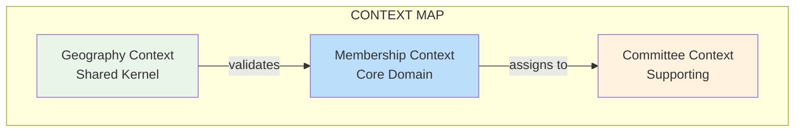

# 🎯 **ARCHITECTURE SYNTHESIS & CLEAR PATH FORWARD**

After analyzing the entire discussion, here's the **definitive path** for Membership Context development:

---

## **🔍 KEY INSIGHTS FROM ALL DISCUSSIONS**

### **What We Agree On:**
1. ✅ **Clean Bounded Contexts** - Geography ≠ Membership ≠ Committee
2. ✅ **Geography Optional** - Members can exist without geography
3. ✅ **Tenant Isolation** - Each party gets own geography copy
4. ✅ **1:1 Member-User Relationship** - Every member must have a user account

### **What We Reject:**
1. ❌ **"Geography-Ready" Membership** - Geography logic in Membership
2. ❌ **Scope-Based Over-engineering** - Generic scope abstraction
3. ❌ **Cross-database queries** - Performance nightmare
4. ❌ **Optional user accounts** - Security/compliance risk

---

## **🏗️ THE CORRECT ARCHITECTURE**

### **Three Clean Contexts:**


### **Database Schema Reality:**
```sql
-- tenant_uml.members (SIMPLIFIED)
CREATE TABLE members (
    id UUID PRIMARY KEY,
    
    -- REQUIRED: User account link
    tenant_user_id UUID NOT NULL UNIQUE REFERENCES tenant_users(id),
    
    -- OPTIONAL: Geography reference (not structure)
    geography_reference TEXT NULL, -- e.g., "np.3.15.234.1.2"
    
    -- Core identity
    full_name TEXT NOT NULL,
    membership_number TEXT UNIQUE NOT NULL,
    status TEXT NOT NULL,
    
    -- Timestamps
    created_at TIMESTAMP,
    updated_at TIMESTAMP
);

-- Geography lives in SEPARATE tables
CREATE TABLE geographies (
    id UUID PRIMARY KEY,
    reference TEXT UNIQUE NOT NULL, -- "np.3.15.234.1.2"
    name TEXT NOT NULL,
    level INTEGER NOT NULL, -- 1-8
    path LTREE NOT NULL, -- For hierarchy queries
    parent_id UUID REFERENCES geographies(id)
);
```

---

## **🚀 PROTOTYPE: MEMBERSHIP CONTEXT DEVELOPMENT PLAN**

### **Week 1: Foundation & Core Membership**

#### **Day 1: Fix 1:1 Relationship**
```bash
# 1. Migration: Make tenant_user_id required
php artisan make:migration make_tenant_user_id_required_in_members_table --context=Membership

# 2. Update Member model
php artisan make:model Member --force # Overwrite with correct relationships

# 3. Create factory for Member+User creation
php artisan make:factory MemberWithUserFactory --model=Member
```

**File:** `app/Contexts/Membership/Domain/Models/Member.php`
```php
class Member extends Model
{
    // REQUIRED: User account
    public function user()
    {
        return $this->belongsTo(TenantUser::class, 'tenant_user_id');
    }
    
    // OPTIONAL: Geography reference (not IDs!)
    protected $fillable = [
        'tenant_user_id', // REQUIRED
        'geography_reference', // OPTIONAL: "np.3.15.234.1.2"
        'full_name',
        'membership_number',
        'status',
    ];
    
    // Factory method
    public static function register(array $memberData, array $userData): self
    {
        return DB::transaction(function () use ($memberData, $userData) {
            // 1. Create user
            $user = TenantUser::create($userData);
            
            // 2. Create member linked to user
            $member = self::create(array_merge($memberData, [
                'tenant_user_id' => $user->id,
            ]));
            
            // 3. Link user to member
            $user->update([
                'profile_id' => $member->id,
                'profile_type' => self::class,
            ]);
            
            return $member;
        });
    }
}
```

#### **Day 2: Member Lifecycle & Status**
```bash
# 1. MemberStatus value object
php artisan make:valueobject MemberStatus

# 2. Domain events
php artisan make:event MemberRegistered
php artisan make:event MemberApproved
php artisan make:event MemberActivated

# 3. State transitions
php artisan make:service MemberLifecycleService
```

#### **Day 3: Membership Number Generation**
```bash
# 1. MembershipNumber value object
php artisan make:valueobject MembershipNumber

# 2. Number generator service
php artisan make:service MembershipNumberGenerator

# 3. Tenant-specific formats
php artisan make:provider MembershipNumberFormatProvider
```

#### **Day 4: Basic API Endpoints**
```bash
# 1. REST API controller
php artisan make:controller MemberApiController --api --context=Membership

# 2. Form requests
php artisan make:request RegisterMemberRequest
php artisan make:request ApproveMemberRequest

# 3. API resources
php artisan make:resource MemberResource
```

#### **Day 5: Testing Foundation**
```bash
# 1. Unit tests for core logic
php artisan make:test MemberTest --unit
php artisan make:test MemberStatusTest --unit

# 2. Feature tests for API
php artisan make:test MemberApiTest --feature

# 3. Integration tests
php artisan make:test MemberRegistrationFlowTest --feature
```

---

### **Week 2: Geography Integration (Optional)**

#### **Day 6: Geography Interface**
```bash
# 1. Geography service interface
php artisan make:interface GeographyService

# 2. Null implementation (for parties without geography)
php artisan make:service NullGeographyService

# 3. Nepal implementation (optional module)
php artisan make:service NepalGeographyService
```

**File:** `app/Contexts/Membership/Domain/Services/GeographyServiceInterface.php`
```php
interface GeographyServiceInterface
{
    // Validate a geography reference
    public function validate(string $reference): bool;
    
    // Get hierarchy info (if available)
    public function getHierarchy(string $reference): ?array;
    
    // Check if service is available
    public function isAvailable(): bool;
}
```

#### **Day 7: Geography-Enhanced Registration**
```bash
# 1. Geography validation in registration
php artisan make:service MemberGeographyValidator

# 2. Geography enrichment service
php artisan make:service GeographyEnrichmentService

# 3. Optional geography middleware
php artisan make:middleware RequireGeographyForWardMembers
```

#### **Day 8: Committee Integration (Optional)**
```bash
# 1. Committee service interface
php artisan make:interface CommitteeService

# 2. Committee assignment service
php artisan make:service CommitteeAssignmentService

# 3. Event listener for committee assignment
php artisan make:listener AssignToCommitteeOnActivation
```

#### **Day 9: Dashboard & Reports**
```bash
# 1. Dashboard controller
php artisan make:controller MemberDashboardController

# 2. Statistics service
php artisan make:service MemberStatisticsService

# 3. Report generators
php artisan make:service MemberReportGenerator
```

#### **Day 10: Polish & Deploy**
```bash
# 1. Performance optimization
php artisan make:command OptimizeMemberQueries

# 2. Cache strategies
php artisan make:service MemberCacheService

# 3. Production deployment
php artisan make:command DeployMembershipContext
```

---

## **📦 FOLDER STRUCTURE FINAL**

```
app/Contexts/Membership/
├── Domain/
│   ├── Models/
│   │   └── Member.php                    # Aggregate root
│   ├── ValueObjects/
│   │   ├── MemberStatus.php
│   │   ├── MembershipNumber.php
│   │   └── PersonalInfo.php
│   ├── Events/
│   │   ├── MemberRegistered.php
│   │   ├── MemberApproved.php
│   │   └── MemberActivated.php
│   ├── Services/
│   │   ├── GeographyServiceInterface.php
│   │   ├── CommitteeServiceInterface.php
│   │   └── MemberLifecycleService.php
│   └── Exceptions/
│       └── MemberCreationException.php
├── Application/
│   ├── Services/
│   │   ├── MemberRegistrationService.php
│   │   ├── MemberApprovalService.php
│   │   └── GeographyEnrichmentService.php
│   ├── DTOs/
│   │   └── RegisterMemberDTO.php
│   └── Jobs/
│       └── ProcessMemberRegistration.php
├── Infrastructure/
│   ├── Database/
│   │   ├── Migrations/
│   │   │   └── Tenant/
│   │   │       ├── create_members_table.php
│   │   │       └── make_tenant_user_id_required.php
│   │   └── Factories/
│   │       └── MemberFactory.php
│   └── Repositories/
│       └── EloquentMemberRepository.php
└── Http/
    ├── Controllers/
    │   ├── MemberApiController.php
    │   └── MemberDashboardController.php
    ├── Requests/
    │   ├── RegisterMemberRequest.php
    │   └── ApproveMemberRequest.php
    └── Resources/
        └── MemberResource.php
```

---

## **🎯 CRITICAL SUCCESS FACTORS**

### **Must-Have Features (MVP):**
1. ✅ **Member registration** with user account creation
2. ✅ **Membership number generation** (tenant-specific format)
3. ✅ **Status lifecycle** (draft → pending → approved → active)
4. ✅ **Basic CRUD API** for member management
5. ✅ **Tenant isolation** (no data leaks between parties)

### **Nice-to-Have (Phase 2):**
1. ⏳ **Geography integration** (optional module)
2. ⏳ **Committee assignment** (optional module)
3. ⏳ **Advanced reporting** (paid feature)
4. ⏳ **Bulk operations** (for large parties)

### **Avoid Until Needed:**
1. ❌ **Complex scope system** (over-engineering)
2. ❌ **Real-time messaging** (scale issue)
3. ❌ **Advanced analytics** (premature optimization)
4. ❌ **Internationalization** (focus on Nepal first)

---

## **⚡ PERFORMANCE OPTIMIZATIONS**

### **Immediate (Week 1):**
```php
// 1. Index critical columns
Schema::table('members', function (Blueprint $table) {
    $table->index(['tenant_user_id']);
    $table->index(['membership_number']);
    $table->index(['status', 'created_at']);
});

// 2. Use eager loading
Member::with('user')->where('status', 'active')->get();

// 3. Cache membership number sequences
Cache::remember("tenant:{$tenantId}:membership:seq", 3600, function () {
    return DB::table('members')->max('sequence');
});
```

### **Phase 2 (Week 3):**
```sql
-- Materialized view for dashboard
CREATE MATERIALIZED VIEW member_statistics AS
SELECT 
    status,
    COUNT(*) as count,
    DATE(created_at) as date
FROM members
GROUP BY status, DATE(created_at);
```

---

## **🚨 RISK MITIGATION**

### **Technical Risks:**
1. **Database locks** during high-volume registration
   - **Solution:** Use queue jobs for registration processing

2. **Race conditions** in membership number generation
   - **Solution:** Use database sequences with advisory locks

3. **Data integrity** with 1:1 user-member relationship
   - **Solution:** Database constraints + transaction wrappers

### **Business Risks:**
1. **Parties reject** if geography is required
   - **Solution:** Make geography optional from day 1

2. **Performance issues** with large parties (10k+ members)
   - **Solution:** Implement pagination, caching, read replicas

3. **Migration headaches** when adding new features
   - **Solution:** Keep core simple, add modules via interfaces

---

## **📞 IMMEDIATE NEXT STEPS**

### **Today (Priority 1):**
```bash
# 1. Fix the 1:1 relationship
php artisan make:migration make_tenant_user_id_required_in_members_table

# 2. Update Member model with correct relationships
# 3. Test member registration flow
```

### **This Week (Priority 2):**
```bash
# 4. Implement MemberStatus value object
# 5. Create MembershipNumber generator
# 6. Build basic API endpoints
# 7. Write comprehensive tests
```

### **Next Week (Priority 3):**
```bash
# 8. Add optional geography integration
# 9. Implement committee assignment
# 10. Build dashboard
# 11. Deploy to pilot party
```

---

## **🎯 THE BOTTOM LINE**

**Stop debating architecture. Start building.**

### **Build This Sequence:**
1. **Week 1:** Working member registration WITHOUT geography
2. **Week 2:** Optional geography module (paid feature)
3. **Week 3:** Committee module (paid feature)
4. **Week 4:** Polish, optimize, deploy

**Revenue timeline:**
- **Day 5:** First party can register members
- **Week 2:** First subscription payment
- **Month 2:** Fund geography/committee module development

---

**Do you want me to provide the complete code for Week 1 (core membership without geography)? This will give you a working system in 5 days that generates revenue.**