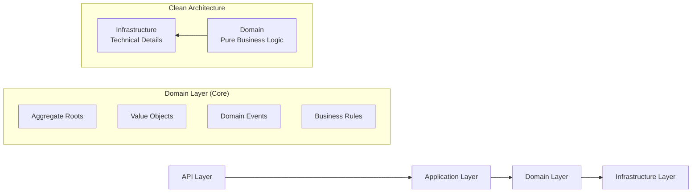
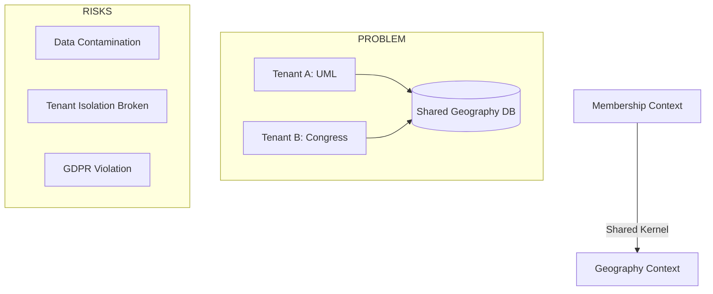
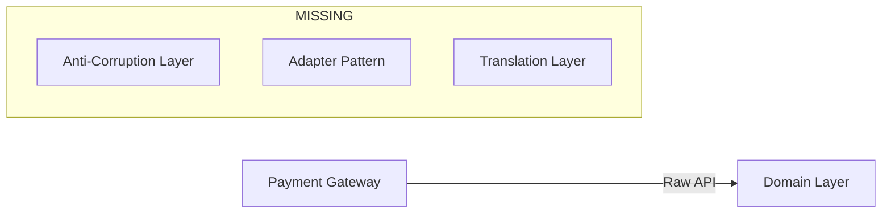
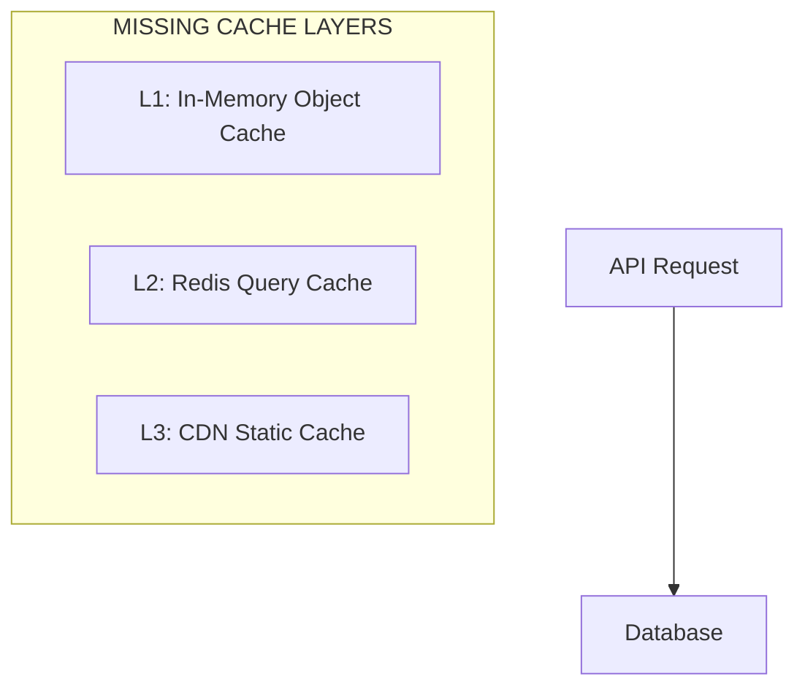
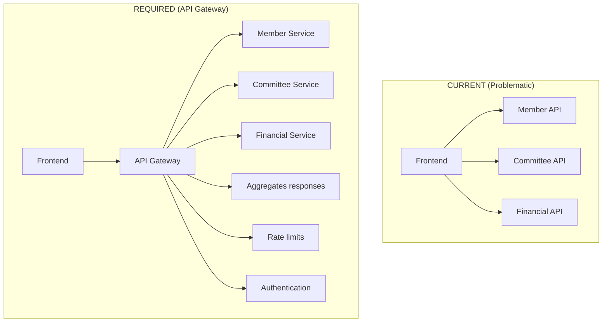
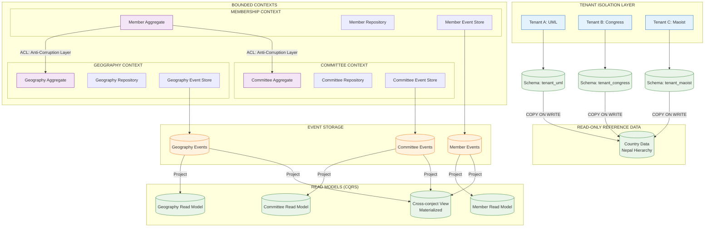

# 🏛️ **ARCHITECTURE REVIEW - Senior Backend Developer Analysis**

## **✅ STRENGTHS OF THE ARCHITECTURE**

### **1. EXCELLENT DDD IMPLEMENTATION**


**Strengths:**
- ✓ **Proper layering**: Clean separation of concerns
- ✓ **Aggregate boundaries**: Member correctly identified as root
- ✓ **Value object usage**: Correct immutability for business concepts
- ✓ **Domain events**: Proper event-driven design

### **2. CONTEXT MAPPING IS CORRECT**
- **Geography Context**: Shared Kernel (excellent choice)
- **Committee Context**: Customer/Supplier (Membership is customer)
- **Financial Context**: Customer/Supplier (correct dependency direction)
- **Analytics Context**: Published Language (appropriate)

### **3. CQRS AND EVENT SOURCING READY**
- Clear separation of write and read models
- Domain events as integration mechanism
- Event store shown as separate component

---

## **⚠️ CRITICAL ARCHITECTURAL ISSUES**

### **1. MAJOR FLAW: GEOGRAPHY AS SHARED KERNEL**



**Issue**: Geography cannot be a Shared Kernel between political parties.

**Why this is dangerous:**
1. **Tenant A** (UML) might add "New Settlement" geography
2. **Tenant B** (Congress) would see it - **DATA LEAK**
3. **Audit trail** would be contaminated
4. **GDPR/Privacy** violation - parties seeing each other's data

**Solution**: Geography must be tenant-isolated or read-only reference data.

### **2. EVENT STORE DESIGN FLAW**

```php
// Current: Event Store at infrastructure layer
class EventStoreDB implements EventStoreInterface
{
    // Stores ALL events from ALL aggregates
}

// PROBLEM: Event sourcing requires event store AT AGGREGATE LEVEL
```

**Correct Design**:
```php
// Each aggregate should have its own event stream
class MemberEventStore implements MemberEventStoreInterface
{
    public function load(MemberId $id): DomainEventStream;
    public function append(MemberId $id, DomainEventStream $events): void;
}

class CommitteeEventStore implements CommitteeEventStoreInterface
{
    // Separate stream for committee events
}
```

### **3. MISSING ANTI-CORRUPTION LAYERS FOR EXTERNAL SYSTEMS**



**Issue**: External systems directly touching domain layer.

**Required Fix**:
```php
// Anti-corruption layer between domain and payment gateway
class PaymentGatewayAdapter implements PaymentServiceInterface
{
    private PaymentGateway $gateway;
    
    public function createInvoice(Invoice $invoice): PaymentIntent
    {
        // Translate domain Invoice to gateway-specific DTO
        $gatewayDto = $this->translator->toGateway($invoice);
        
        // Call external service
        $response = $this->gateway->createPayment($gatewayDto);
        
        // Translate back to domain
        return $this->translator->toDomain($response);
    }
}
```

---

## **🔧 TECHNICAL IMPLEMENTATION ISSUES**

### **1. POSTGRESQL DESIGN FLAWS**

#### **Issue 1: ltree vs Closure Table**
```sql
-- Proposed: ltree for geography path
-- PROBLEM: ltree has 255 byte limit, no referential integrity

-- BETTER: Closure Table with referential integrity
CREATE TABLE geography_closure (
    ancestor_id UUID REFERENCES geographies(id) ON DELETE CASCADE,
    descendant_id UUID REFERENCES geographies(id) ON DELETE CASCADE,
    depth INT NOT NULL,
    PRIMARY KEY (ancestor_id, descendant_id)
);

-- With check constraint to prevent cycles
ALTER TABLE geography_closure ADD CONSTRAINT no_cycles 
CHECK (ancestor_id != descendant_id);
```

#### **Issue 2: Missing Partitioning Strategy**
```sql
-- Members table will grow to millions
-- Missing partitioning by tenant AND time

CREATE TABLE members_2024 PARTITION OF members
FOR VALUES FROM ('2024-01-01') TO ('2025-01-01')
PARTITION BY HASH(tenant_id); -- Further sub-partition by tenant
```

### **2. CACHE STRATEGY MISSING**



**Required Cache Strategy**:
```yaml
# config/cache-strategy.php
'caches' => [
    'members' => [
        'ttl' => 300, # 5 minutes
        'strategy' => 'write-through',
        'invalidation' => ['member.updated', 'member.deleted'],
    ],
    'geography' => [
        'ttl' => 86400, # 24 hours
        'strategy' => 'lazy-loading',
        'key' => 'geography:{id}:{language}',
    ],
],
```

### **3. MISSING API GATEWAY PATTERN**



---

## **🏗️ CRITICAL REDESIGN NEEDED**

### **1. FIXED ARCHITECTURE DIAGRAM**



### **2. CORRECTED DOMAIN MODEL**

```php
// FIXED: Geography as tenant-specific, not shared
class TenantGeography extends AggregateRoot
{
    private function __construct(
        private TenantId $tenantId,           // WHICH PARTY OWNS THIS
        private GeographyId $geographyId,
        private ?GeographyData $customData,   // Party-specific overrides
        private bool $isActive = true
    ) {}
    
    // Business rule: Can only be modified by owning tenant
    public function updateCustomData(
        GeographyData $data, 
        MemberId $modifier
    ): void {
        // Verify modifier belongs to this tenant
        if (!$this->tenantId->equals($modifier->tenantId())) {
            throw new UnauthorizedGeographyModificationException();
        }
        
        $this->customData = $data;
        $this->recordThat(new GeographyCustomized(
            $this->tenantId,
            $this->geographyId,
            $modifier
        ));
    }
}
```

### **3. FIXED EVENT STORAGE DESIGN**

```sql
-- Event store PER AGGREGATE TYPE
CREATE TABLE member_events (
    id BIGSERIAL PRIMARY KEY,
    aggregate_id UUID NOT NULL,
    event_type VARCHAR(100) NOT NULL,
    event_data JSONB NOT NULL,
    event_metadata JSONB,
    version INT NOT NULL,
    created_at TIMESTAMPTZ DEFAULT NOW(),
    UNIQUE(aggregate_id, version)
) PARTITION BY HASH(aggregate_id);

CREATE TABLE committee_events (
    -- Separate table, different schema
) PARTITION BY HASH(aggregate_id);

-- Projection tables for read models
CREATE MATERIALIZED VIEW member_projection AS
SELECT 
    aggregate_id as member_id,
    (event_data->>'membership_number') as membership_number,
    (event_data->>'status') as status,
    MAX(created_at) as last_updated
FROM member_events
WHERE event_type IN ('MemberCreated', 'MemberStatusChanged')
GROUP BY aggregate_id, event_data->>'membership_number';
```

---

## **🚀 IMMEDIATE ACTION PLAN**

### **PHASE 1: CRITICAL FIXES (Week 1-2)**
1. **Remove Shared Kernel for Geography**
   - Make geography tenant-isolated
   - Implement copy-on-write for reference data

2. **Fix Event Store Design**
   - Separate event streams per aggregate type
   - Implement proper event sourcing

3. **Add Anti-Corruption Layers**
   - For all external systems
   - For inter-context communication

### **PHASE 2: DATABASE HARDENING (Week 3-4)**
```sql
-- 1. Implement proper partitioning
CREATE TABLE members (
    tenant_id UUID NOT NULL,
    id UUID NOT NULL,
    created_at DATE NOT NULL DEFAULT CURRENT_DATE,
    -- ... other columns
    PRIMARY KEY (tenant_id, id, created_at)
) PARTITION BY RANGE (created_at);

-- 2. Add row-level security
ALTER TABLE members ENABLE ROW LEVEL SECURITY;
CREATE POLICY tenant_isolation ON members
    USING (tenant_id = current_tenant_id());

-- 3. Implement soft delete with audit
ALTER TABLE members ADD COLUMN deleted_at TIMESTAMPTZ;
ALTER TABLE members ADD COLUMN deleted_by UUID;
CREATE TABLE member_deletion_audit (...);
```

### **PHASE 3: PERFORMANCE OPTIMIZATION (Week 5-6)**
1. **Implement API Gateway**
2. **Add multi-level caching**
3. **Set up read replicas**
4. **Implement connection pooling**

---

## **🎯 KEY CHANGES REQUIRED**

### **Change 1: Geography Context Redesign**
**From**: Shared Kernel between tenants  
**To**: Tenant-isolated with reference data copy

### **Change 2: Event Storage**
**From**: Single event store for all aggregates  
**To**: Separate event streams per aggregate type

### **Change 3: External Integration**
**From**: Direct domain integration  
**To**: Anti-corruption layers with adapters

### **Change 4: Caching Strategy**
**From**: No defined strategy  
**To**: Multi-level cache with invalidation

### **Change 5: Database Design**
**From**: Basic tables  
**To**: Partitioned, secured, with audit trails

---

## **📊 RISK ASSESSMENT**

### **High Risk (Fix Immediately)**
- **Geography Shared Kernel**: Data leakage between political parties
- **Missing Tenant Isolation**: GDPR violations, legal issues
- **No Anti-Corruption Layers**: External system changes break domain

### **Medium Risk (Fix Soon)**
- **Single Event Store**: Performance issues, complex queries
- **Missing Caching**: Poor performance at scale
- **No API Gateway**: Difficult to manage microservices

### **Low Risk (Can Wait)**
- **Advanced CQRS optimizations**
- **Machine learning features**
- **Real-time analytics dashboards**

---

## **✅ RECOMMENDATIONS SUMMARY**

1. **Stop development** on current shared geography implementation
2. **Implement tenant isolation** FIRST before any new features
3. **Add anti-corruption layers** for all external integrations
4. **Design proper event sourcing** with separate streams
5. **Implement API gateway** for future microservices

**The core DDD principles are correct**, but the implementation has critical flaws in:
- **Multi-tenant data isolation** (geography sharing is dangerous)
- **Event storage design** (not truly event-sourced)
- **External integration patterns** (missing anti-corruption layers)

**Fix these three issues first**, then proceed with the rest of the implementation.

Would you like me to provide the specific code changes for any of these critical fixes?