# 🏛️ **Membership Context - Complete Architecture Diagram (Mermaid)**

```mermaid
graph TB
    %% ====================== LAYER SEPARATION ======================
    subgraph "API LAYER (Interface)"
        direction LR
        REST_API[REST API Controllers]
        GraphQL[GraphQL Endpoints]
        WebSocket[WebSocket Gateway]
        CLI[CLI Commands]
    end

    subgraph "APPLICATION LAYER (Use Cases)"
        direction LR
        CQRS[Command/Query Handlers]
        EventHandlers[Event Listeners]
        Services[Application Services]
        Validators[Input Validators]
    end

    subgraph "DOMAIN LAYER (Business Logic)"
        direction TB
        AR[Aggregate Roots]
        VO[Value Objects]
        DE[Domain Events]
        DS[Domain Services]
        Invariants[Business Rules]
    end

    subgraph "INFRASTRUCTURE LAYER (Technical)"
        direction LR
        Repos[Repositories]
        External[External Services]
        EventStore[Event Store]
        Cache[Cache Layer]
    end

    %% ====================== CONNECTIONS BETWEEN LAYERS ======================
    REST_API --> CQRS
    GraphQL --> CQRS
    CQRS --> AR
    CQRS --> Repos
    EventHandlers --> DE
    DE --> External
    
    %% ====================== MEMBER AGGREGATE DETAIL ======================
    subgraph "MEMBER AGGREGATE ROOT"
        Member[Member Aggregate]
        
        subgraph "VALUE OBJECTS (Immutable)"
            MembershipNumber[MembershipNumber]
            PersonalInfo[PersonalInfo]
            ContactInfo[ContactInfo]
            GeographyRef[Geography Reference]
            Status[MemberStatus]
            AuditInfo[AuditInfo]
        end
        
        subgraph "ENTITY: MemberLifecycle"
            Registration[Registration Info]
            Approval[Approval Info]
            Activation[Activation Info]
            Suspension[Suspension Info]
        end
        
        subgraph "ENTITY: MemberRoles"
            CommitteeRole[Committee Role]
            GeographyRole[Geography Role]
            Permissions[Permission Set]
        end
        
        subgraph "DOMAIN EVENTS"
            MemberCreated[MemberCreated]
            MemberApproved[MemberApproved]
            MemberActivated[MemberActivated]
            MemberSuspended[MemberSuspended]
            MemberGeographyUpdated[MemberGeographyUpdated]
            MemberStatusChanged[MemberStatusChanged]
        end
    end

    Member --> MembershipNumber
    Member --> PersonalInfo
    Member --> ContactInfo
    Member --> GeographyRef
    Member --> Status
    Member --> Registration
    Member --> Approval
    Member --> Activation
    Member --> CommitteeRole
    Member --> MemberCreated
    Member --> MemberApproved

    %% ====================== MEMBER LIFECYCLE STATE MACHINE ======================
    subgraph "MEMBER LIFECYCLE (State Pattern)"
        direction LR
        Draft[Draft State]
        Pending[Pending Approval]
        Approved[Approved]
        Active[Active]
        Suspended[Suspended]
        Terminated[Terminated]
        
        Draft -->|register| Pending
        Pending -->|approve| Approved
        Approved -->|activate| Active
        Active -->|suspend| Suspended
        Suspended -->|reinstate| Active
        Active -->|terminate| Terminated
        Suspended -->|terminate| Terminated
    end

    Status --> Draft
    Status --> Pending
    Status --> Active
    Status --> Suspended

    %% ====================== GEOGRAPHY CONTEXT INTEGRATION ======================
    subgraph "GEOGRAPHY CONTEXT (Shared Kernel)"
        Geography[Geography Aggregate]
        
        subgraph "Geography Hierarchy"
            Country[Country]
            Province[Province]
            District[District]
            Municipality[Municipality]
            Ward[Ward]
        end
        
        subgraph "Geography Value Objects"
            GeoPath[Geography Path]
            Boundary[Geo Boundary]
            LocalizedName[Localized Name]
            GeoCode[Geography Code]
        end
    end

    GeographyRef --> Geography
    Country --> Province
    Province --> District
    District --> Municipality
    Municipality --> Ward
    Geography --> GeoPath
    Geography --> Boundary
    Geography --> LocalizedName

    %% ====================== COMMITTEE CONTEXT INTEGRATION ======================
    subgraph "COMMITTEE CONTEXT"
        Committee[Committee Aggregate]
        
        subgraph "Committee Structure"
            CentralCommittee[Central Committee]
            ProvinceCommittee[Province Committee]
            DistrictCommittee[District Committee]
            WardCommittee[Ward Committee]
        end
        
        subgraph "Committee Roles"
            Chairperson[Chairperson]
            Secretary[Secretary]
            Treasurer[Treasurer]
            MemberRole[Committee Member]
        end
    end

    CommitteeRole --> Committee
    CentralCommittee --> ProvinceCommittee
    ProvinceCommittee --> DistrictCommittee
    DistrictCommittee --> WardCommittee
    Committee --> Chairperson
    Committee --> Secretary
    Committee --> Treasurer

    %% ====================== FINANCIAL CONTEXT INTEGRATION ======================
    subgraph "FINANCIAL CONTEXT"
        Invoice[Invoice Aggregate]
        Payment[Payment Aggregate]
        
        subgraph "Invoice States"
            InvoiceDraft[Invoice Draft]
            InvoiceSent[Invoice Sent]
            InvoicePaid[Invoice Paid]
            InvoiceOverdue[Invoice Overdue]
        end
        
        subgraph "Payment Methods"
            Cash[Cash Payment]
            Digital[Digital Payment]
            BankTransfer[Bank Transfer]
        end
    end

    Member --> Invoice
    Invoice --> InvoiceDraft
    Invoice --> InvoiceSent
    Invoice --> Payment
    Payment --> Cash
    Payment --> Digital
    Payment --> BankTransfer
    MemberActivated --> InvoicePaid

    %% ====================== REPOSITORY PATTERN ======================
    subgraph "REPOSITORY LAYER"
        MemberRepo[Member Repository]
        GeographyRepo[Geography Repository]
        CommitteeRepo[Committee Repository]
        InvoiceRepo[Invoice Repository]
        
        subgraph "QUERY MODELS (CQRS)"
            MemberRead[Member Read Model]
            StatsRead[Statistics Read Model]
            GeographyRead[Geography Read Model]
            SearchIndex[Search Index]
        end
    end

    Repos --> MemberRepo
    Repos --> GeographyRepo
    Repos --> CommitteeRepo
    MemberRepo --> MemberRead
    MemberRepo --> StatsRead
    GeographyRepo --> GeographyRead
    MemberRepo --> SearchIndex

    %% ====================== EVENT FLOW ======================
    subgraph "EVENT-DRIVEN FLOW"
        EventBus[Domain Event Bus]
        
        subgraph "EVENT LISTENERS"
            EmailListener[Send Email]
            SMSListener[Send SMS]
            NotificationListener[Send Notification]
            AuditListener[Log to Audit Trail]
            AnalyticsListener[Update Analytics]
            IntegrationListener[External Integrations]
        end
        
        subgraph "PROJECTIONS"
            MemberProjection[Member Projection]
            GeographyProjection[Geography Projection]
            FinancialProjection[Financial Projection]
            LeadershipProjection[Leadership Score]
        end
    end

    MemberCreated --> EventBus
    MemberApproved --> EventBus
    MemberActivated --> EventBus
    EventBus --> EmailListener
    EventBus --> SMSListener
    EventBus --> NotificationListener
    EventBus --> AnalyticsListener
    AnalyticsListener --> MemberProjection
    AnalyticsListener --> LeadershipProjection

    %% ====================== INFRASTRUCTURE ======================
    subgraph "DATABASE LAYER"
        subgraph "WRITE DATABASE (DDD Aggregates)"
            WriteDB[(PostgreSQL<br/>Tenant Schema)]
        end
        
        subgraph "READ DATABASE (CQRS)"
            ReadDB[(PostgreSQL<br/>Read Replica)]
            CacheDB[(Redis Cache)]
            SearchDB[(ElasticSearch)]
        end
        
        subgraph "EVENT STORE"
            EventDB[(EventStoreDB)]
        end
    end

    MemberRepo --> WriteDB
    GeographyRepo --> WriteDB
    CommitteeRepo --> WriteDB
    MemberRead --> ReadDB
    StatsRead --> ReadDB
    SearchIndex --> SearchDB
    EventStore --> EventDB
    Cache --> CacheDB

    %% ====================== EXTERNAL SYSTEMS ======================
    subgraph "EXTERNAL SYSTEMS"
        PaymentGateway[Payment Gateway]
        SMSService[SMS Service]
        EmailService[Email Service]
        StorageService[File Storage]
        AnalyticsService[Analytics Platform]
    end

    External --> PaymentGateway
    External --> SMSService
    External --> EmailService
    External --> StorageService
    AnalyticsListener --> AnalyticsService

    %% ====================== API ENDPOINTS ======================
    subgraph "API ENDPOINTS"
        MemberAPI[POST /api/members<br/>GET /api/members/{id}]
        ApprovalAPI[PUT /api/members/{id}/approve]
        GeographyAPI[PUT /api/members/{id}/geography]
        CommitteeAPI[GET /api/committees/{id}/members]
        SearchAPI[GET /api/members?search=]
        DashboardAPI[GET /api/dashboard/stats]
    end

    REST_API --> MemberAPI
    REST_API --> ApprovalAPI
    REST_API --> GeographyAPI
    REST_API --> CommitteeAPI
    GraphQL --> SearchAPI
    GraphQL --> DashboardAPI

    %% ====================== BUSINESS RULES ======================
    subgraph "KEY BUSINESS RULES"
        BR1[1. Membership number must be unique]
        BR2[2. Phone/email must be unique per tenant]
        BR3[3. Member must be approved before activation]
        BR4[4. Member must pay dues before activation]
        BR5[5. Geography must follow hierarchy]
        BR6[6. Committee assignments require approval]
        BR7[7. Status changes must be audited]
        BR8[8. Financial transactions require receipt]
    end

    Invariants --> BR1
    Invariants --> BR2
    Invariants --> BR3
    Invariants --> BR4
    Invariants --> BR5
    Invariants --> BR6
    Invariants --> BR7
    Invariants --> BR8

    %% ====================== STYLING ======================
    classDef apiLayer fill:#e1f5fe,stroke:#01579b
    classDef appLayer fill:#f3e5f5,stroke:#4a148c
    classDef domainLayer fill:#e8f5e8,stroke:#1b5e20
    classDef infraLayer fill:#fff3e0,stroke:#e65100
    classDef aggregate fill:#bbdefb,stroke:#0d47a1
    classDef valueObject fill:#c8e6c9,stroke:#2e7d32
    classDef entity fill:#ffecb3,stroke:#ff8f00
    classDef event fill:#fce4ec,stroke:#ad1457
    classDef state fill:#e0f7fa,stroke:#006064
    classDef context fill:#f5f5f5,stroke:#616161
    classDef repository fill:#fff8e1,stroke:#ff6f00
    classDef external fill:#f1f8e9,stroke:#7cb342
    classDef database fill:#e0f2f1,stroke:#004d40
    classDef rule fill:#fffde7,stroke:#f57f17
    
    class REST_API,GraphQL,WebSocket,CLI apiLayer
    class CQRS,EventHandlers,Services,Validators appLayer
    class AR,VO,DE,DS,Invariants domainLayer
    class Repos,External,EventStore,Cache infraLayer
    class Member,Geography,Committee,Invoice,Payment aggregate
    class MembershipNumber,PersonalInfo,ContactInfo,GeographyRef,Status,AuditInfo,GeoPath,Boundary,LocalizedName,GeoCode valueObject
    class Registration,Approval,Activation,Suspension,CommitteeRole,GeographyRole,Permissions,CentralCommittee,ProvinceCommittee,DistrictCommittee,WardCommittee,Chairperson,Secretary,Treasurer,MemberRole entity
    class MemberCreated,MemberApproved,MemberActivated,MemberSuspended,MemberGeographyUpdated,MemberStatusChanged event
    class Draft,Pending,Approved,Active,Suspended,Terminated,InvoiceDraft,InvoiceSent,InvoicePaid,InvoiceOverdue state
    class Country,Province,District,Municipality,Ward,Cash,Digital,BankTransfer context
    class MemberRepo,GeographyRepo,CommitteeRepo,InvoiceRepo,MemberRead,StatsRead,GeographyRead,SearchIndex repository
    class PaymentGateway,SMSService,EmailService,StorageService,AnalyticsService external
    class WriteDB,ReadDB,CacheDB,SearchDB,EventDB database
    class BR1,BR2,BR3,BR4,BR5,BR6,BR7,BR8 rule
```

---

## **📊 ALTERNATIVE SIMPLIFIED DIAGRAM (For Documentation)**

```mermaid
graph TD
    %% ========== CORE MEMBERSHIP CONTEXT ==========
    subgraph "MEMBERSHIP CONTEXT"
        MC[Member Aggregate]
        
        subgraph "Value Objects"
            MN[Membership Number]
            PI[Personal Info]
            CI[Contact Info]
            MS[Member Status]
            GR[Geography Ref]
        end
        
        subgraph "Lifecycle States"
            S1[Draft]
            S2[Pending]
            S3[Approved]
            S4[Active]
            S5[Suspended]
        end
    end
    
    MC --> MN
    MC --> PI
    MC --> CI
    MC --> MS
    MC --> GR
    MS --> S1
    MS --> S2
    MS --> S3
    MS --> S4
    MS --> S5
    
    %% ========== CONTEXT MAP ==========
    subgraph "CONTEXT MAP"
        MC -- "Shared Kernel" --> GC[Geography Context]
        MC -- "Customer/Supplier" --> CC[Committee Context]
        MC -- "Customer/Supplier" --> FC[Financial Context]
        MC -- "Published Language" --> AC[Analytics Context]
        MC -- "Anticorruption Layer" --> EC[External Context]
    end
    
    %% ========== GEOGRAPHY CONTEXT ==========
    subgraph "GEOGRAPHY CONTEXT"
        GA[Geography Aggregate]
        
        subgraph "Hierarchy"
            G1[Country]
            G2[Province]
            G3[District]
            G4[Municipality]
            G5[Ward]
        end
    end
    
    GR --> GA
    G1 --> G2
    G2 --> G3
    G3 --> G4
    G4 --> G5
    
    %% ========== COMMITTEE CONTEXT ==========
    subgraph "COMMITTEE CONTEXT"
        CA[Committee Aggregate]
        
        subgraph "Committee Types"
            CT1[Central Committee]
            CT2[Province Committee]
            CT3[District Committee]
            CT4[Ward Committee]
        end
    end
    
    CA --> CT1
    CA --> CT2
    CA --> CT3
    CA --> CT4
    
    %% ========== FINANCIAL CONTEXT ==========
    subgraph "FINANCIAL CONTEXT"
        FA[Invoice Aggregate]
        PA[Payment Aggregate]
    end
    
    FA --> PA
    
    %% ========== EVENT FLOW ==========
    subgraph "EVENT-DRIVEN ARCHITECTURE"
        EB[Event Bus]
        
        subgraph "Event Consumers"
            E1[Email Service]
            E2[SMS Service]
            E3[Audit Service]
            E4[Analytics Service]
            E5[Notification Service]
        end
    end
    
    MC -- "Domain Events" --> EB
    EB --> E1
    EB --> E2
    EB --> E3
    EB --> E4
    EB --> E5
    
    %% ========== DATA FLOW ==========
    subgraph "DATA FLOW"
        API[API Layer] --> CH[Command Handlers]
        CH --> MC
        MC --> MR[Member Repository]
        MR --> DB1[(Write DB)]
        
        QH[Query Handlers] --> RM[Read Models]
        RM --> DB2[(Read DB)]
    end
    
    classDef aggregate fill:#bbdefb,stroke:#0d47a1
    classDef valueObject fill:#c8e6c9,stroke:#2e7d32
    classDef state fill:#e0f7fa,stroke:#006064
    classDef context fill:#f5f5f5,stroke:#616161
    classDef event fill:#fce4ec,stroke:#ad1457
    classDef database fill:#e0f2f1,stroke:#004d40
    
    class MC,GA,CA,FA,PA aggregate
    class MN,PI,CI,MS,GR valueObject
    class S1,S2,S3,S4,S5 state
    class GC,CC,FC,AC,EC context
    class EB,E1,E2,E3,E4,E5 event
    class DB1,DB2 database
```



---

## **🔍 CORE CONCEPTS VISUALIZED**

### **1. Member Aggregate Structure**
```
Member Aggregate Root
├── Value Objects (Immutable)
│   ├── MembershipNumber: "UML-2024-M-000123"
│   ├── PersonalInfo: {name, dob, gender}
│   ├── ContactInfo: {phone, email, address}
│   ├── GeographyRef: UUID to Geography
│   └── MemberStatus: State Pattern
│
├── Entities (Mutable with Identity)
│   ├── RegistrationInfo: {date, sponsor, committee}
│   ├── ApprovalInfo: {date, approved_by, comments}
│   ├── ActivationInfo: {date, invoice_paid, method}
│   └── MemberRoles: [{committee, role, tenure}]
│
└── Domain Events
    ├── MemberCreated
    ├── MemberApproved
    ├── MemberActivated
    ├── MemberSuspended
    └── MemberGeographyUpdated
```

### **2. Context Relationships**
```
Membership Context (Our Core)
    ↓
Geography Context ← Shared Kernel (both directions)
    ↑
Committee Context ← Customer/Supplier (Membership consumes)
    ↑
Financial Context ← Customer/Supplier (Membership consumes)
    ↑
Analytics Context ← Published Language (Membership publishes)
    ↑
External Context ← Anti-Corruption Layer (protects our domain)
```

### **3. Data Flow**
```
API Request
    ↓
Command/Query Handler
    ↓
Aggregate Root (Business Rules)
    ↓
Repository (Persistence)
    ↓
Database (Event Store + State)
    ↓
Domain Event Published
    ↓
Event Listeners (Async Processing)
    ↓
Read Model Updates (CQRS)
    ↓
API Response (Read Models)
```

---

## **🎯 KEY ARCHITECTURAL DECISIONS SHOWN**

1. **Aggregate Design**: Member is the aggregate root with transactional consistency boundary
2. **Value Object Immutability**: PersonalInfo, MembershipNumber are immutable
3. **State Pattern**: MemberStatus manages lifecycle transitions
4. **CQRS**: Separate write (aggregates) and read (projections) models
5. **Event-Driven**: Domain events for cross-context integration
6. **Bounded Contexts**: Clear boundaries with explicit relationships
7. **Hexagonal Architecture**: Domain at center, infrastructure outside
8. **Multi-Tenant**: Each political party gets isolated data

The diagram shows how:
- **Business rules** are encapsulated in the domain layer
- **Technical concerns** are pushed to infrastructure
- **Contexts communicate** through well-defined interfaces
- **Data flows** through clear pipelines
- **Events drive** eventual consistency between contexts

Would you like me to create more specific diagrams for any particular aspect (event flow, database schema, API flow, etc.)?