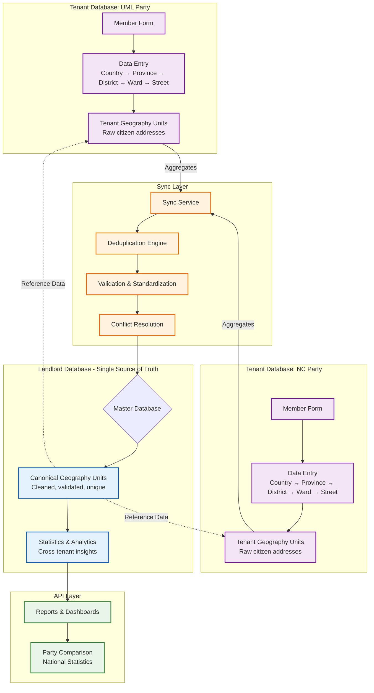

Ah! I completely misunderstood. You're describing a **bottom-up** architecture where **data originates in tenant databases** and gets **aggregated up to a central landlord database**. This is a fundamentally different approach and makes perfect sense for political party data collection. Let me redesign the entire architecture.

## 🏗️ **Bottom-Up Sync Architecture**



## 🔄 **Revised Data Flow: Bottom-Up Sync**

### **Phase 1: Tenant Data Collection Structure**

#### **1.1 Tenant Geography Levels Table**
```php
// database/migrations/tenant/2025_01_01_000001_create_geography_levels_table.php
return new class extends Migration {
    public function up(): void
    {
        Schema::create('geography_levels', function (Blueprint $table) {
            $table->id();
            $table->tinyInteger('level')->unique()->comment('0=country, 1=province, etc.');
            $table->string('code', 10)->unique()->comment('np, pr, dr, lu, wr, sr, hnr');
            $table->json('name_local')->comment('{"en": "Province", "np": "प्रदेश"}');
            $table->boolean('is_active')->default(true);
            $table->integer('sort_order')->default(0);
            $table->timestamps();
        });

        // Seed default levels for Nepal
        DB::table('geography_levels')->insert([
            ['level' => 0, 'code' => 'np', 'name_local' => '{"en": "Country", "np": "देश"}', 'sort_order' => 0],
            ['level' => 1, 'code' => 'pr', 'name_local' => '{"en": "Province", "np": "प्रदेश"}', 'sort_order' => 1],
            ['level' => 2, 'code' => 'dr', 'name_local' => '{"en": "District", "np": "जिल्ला"}', 'sort_order' => 2],
            ['level' => 3, 'code' => 'lu', 'name_local' => '{"en": "Local Unit", "np": "स्थानीय तह"}', 'sort_order' => 3],
            ['level' => 4, 'code' => 'wr', 'name_local' => '{"en": "Ward", "np": "वडा"}', 'sort_order' => 4],
            ['level' => 5, 'code' => 'sr', 'name_local' => '{"en": "Street", "np": "सडक"}', 'sort_order' => 5],
            ['level' => 6, 'code' => 'hnr', 'name_local' => '{"en": "House Number", "np": "घर नं."}', 'sort_order' => 6],
        ]);
    }
};
```

#### **1.2 Tenant Geography Units Table**
```php
// database/migrations/tenant/2025_01_01_000002_create_geography_units_table.php
return new class extends Migration {
    public function up(): void
    {
        Schema::create('geography_units', function (Blueprint $table) {
            $table->id();
            
            // Tenant isolation
            $table->unsignedBigInteger('tenant_id');
            
            // Level reference
            $table->unsignedBigInteger('level_id');
            $table->tinyInteger('level_number');
            
            // Hierarchy
            $table->unsignedBigInteger('parent_id')->nullable()->comment('Parent unit in same tenant');
            
            // Identification
            $table->string('code', 100)->comment('Tenant-specific code: UML-P1, UML-D25');
            $table->string('name', 255);
            $table->json('name_local')->nullable()->comment('Localized names');
            
            // External references
            $table->string('official_code', 100)->nullable()->comment('Government code if known');
            $table->unsignedBigInteger('canonical_id')->nullable()->comment('Link to landlord canonical unit');
            
            // Status
            $table->enum('status', ['draft', 'pending_sync', 'synced', 'rejected'])->default('draft');
            $table->text('rejection_reason')->nullable();
            
            // Metadata
            $table->json('metadata')->nullable()->comment('Additional tenant-specific data');
            $table->unsignedBigInteger('created_by')->comment('Party member who entered');
            $table->unsignedBigInteger('updated_by')->nullable();
            
            // Sync tracking
            $table->timestamp('synced_at')->nullable();
            $table->string('sync_version', 32)->nullable();
            
            $table->timestamps();
            $table->softDeletes();
            
            // Indexes
            $table->index(['tenant_id', 'level_number']);
            $table->index(['tenant_id', 'parent_id']);
            $table->index(['tenant_id', 'status']);
            $table->unique(['tenant_id', 'code']);
            $table->index(['canonical_id', 'tenant_id']);
        });
    }
};
```

### **Phase 2: Member Form & Data Entry**

#### **2.1 Form Processing Service**
```php
// app/Contexts/Membership/Application/Services/MemberGeographyFormService.php
namespace App\Contexts\Membership\Application\Services;

use App\Contexts\Membership\Domain\Models\TenantGeoUnit;
use App\Contexts\Membership\Domain\Models\GeographyLevel;
use Illuminate\Support\Facades\DB;
use Illuminate\Validation\ValidationException;

class MemberGeographyFormService
{
    public function processFormSubmission(array $formData, int $tenantId, int $userId): array
    {
        // Example formData:
        // [
        //     'country' => 'Nepal',
        //     'province' => 'Bagmati',
        //     'district' => 'Kathmandu',
        //     'local_unit' => 'Kathmandu Metropolitan City',
        //     'ward' => 'Ward 32',
        //     'street' => 'Bhanimandal Road',
        //     'house_number' => '25A'
        // ]
        
        DB::beginTransaction();
        
        try {
            $createdUnits = [];
            $lastParentId = null;
            
            foreach ($this->getLevelSequence() as $level) {
                $fieldName = $this->getFieldNameForLevel($level);
                
                if (empty($formData[$fieldName])) {
                    break; // Stop if optional field is empty
                }
                
                $unitName = $formData[$fieldName];
                
                // Check if unit already exists in tenant DB
                $existingUnit = $this->findExistingUnit(
                    $tenantId, 
                    $level['id'], 
                    $unitName, 
                    $lastParentId
                );
                
                if ($existingUnit) {
                    $unit = $existingUnit;
                } else {
                    // Create new tenant geography unit
                    $unit = TenantGeoUnit::create([
                        'tenant_id' => $tenantId,
                        'level_id' => $level['id'],
                        'level_number' => $level['number'],
                        'parent_id' => $lastParentId,
                        'code' => $this->generateUnitCode($tenantId, $level, $unitName),
                        'name' => $unitName,
                        'name_local' => ['en' => $unitName, 'np' => $unitName], // Assuming Nepali same for now
                        'status' => 'draft',
                        'created_by' => $userId,
                        'metadata' => [
                            'source' => 'member_form',
                            'form_timestamp' => now()->toISOString(),
                            'field_name' => $fieldName
                        ]
                    ]);
                    
                    // Queue for sync to landlord
                    $this->queueForSync($unit);
                }
                
                $createdUnits[] = $unit;
                $lastParentId = $unit->id;
            }
            
            DB::commit();
            
            return [
                'success' => true,
                'units_created' => $createdUnits,
                'hierarchy' => $this->buildHierarchyChain($createdUnits)
            ];
            
        } catch (\Exception $e) {
            DB::rollBack();
            throw $e;
        }
    }
    
    private function getLevelSequence(): array
    {
        return [
            ['id' => 1, 'number' => 0, 'required' => true],  // Country
            ['id' => 2, 'number' => 1, 'required' => true],  // Province
            ['id' => 3, 'number' => 2, 'required' => true],  // District
            ['id' => 4, 'number' => 3, 'required' => false], // Local Unit
            ['id' => 5, 'number' => 4, 'required' => false], // Ward
            ['id' => 6, 'number' => 5, 'required' => false], // Street
            ['id' => 7, 'number' => 6, 'required' => false], // House Number
        ];
    }
    
    private function findExistingUnit(
        int $tenantId, 
        int $levelId, 
        string $unitName, 
        ?int $parentId
    ): ?TenantGeoUnit {
        $query = TenantGeoUnit::where('tenant_id', $tenantId)
            ->where('level_id', $levelId)
            ->where('name', $unitName);
            
        if ($parentId) {
            $query->where('parent_id', $parentId);
        }
        
        return $query->first();
    }
    
    private function generateUnitCode(int $tenantId, array $level, string $unitName): string
    {
        $tenantCode = Tenant::find($tenantId)->code ?? 'TENANT';
        $levelCode = GeographyLevel::find($level['id'])->code;
        
        return sprintf(
            '%s-%s-%s-%d',
            $tenantCode,
            $levelCode,
            substr(md5($unitName), 0, 6),
            time()
        );
    }
    
    private function queueForSync(TenantGeoUnit $unit): void
    {
        // Mark for sync
        $unit->update(['status' => 'pending_sync']);
        
        // Dispatch sync job
        SyncGeographyToLandlord::dispatch($unit->id)
            ->onQueue('geography-sync')
            ->delay(now()->addMinutes(5)); // Batch for efficiency
    }
}
```

### **Phase 3: Landlord Database Structure**

#### **3.1 Canonical Geography Units Table**
```php
// database/migrations/landlord/2025_01_01_000001_create_canonical_geo_units_table.php
return new class extends Migration {
    public function up(): void
    {
        Schema::create('canonical_geography_units', function (Blueprint $table) {
            $table->id();
            
            // Hierarchy
            $table->tinyInteger('level')->comment('0=country, 1=province, etc.');
            $table->string('level_code', 10)->comment('np, pr, dr, lu, etc.');
            $table->unsignedBigInteger('parent_id')->nullable();
            $table->string('path', 1000)->nullable()->comment('Materialized path');
            
            // Official identification
            $table->string('official_code', 100)->unique()->comment('Government official code');
            $table->string('canonical_name', 255);
            $table->json('canonical_names')->comment('All known names across tenants');
            
            // Statistics
            $table->integer('tenant_count')->default(0)->comment('How many tenants reference this');
            $table->integer('usage_count')->default(0)->comment('Total member references');
            $table->json('tenant_references')->nullable()->comment('Which tenants use this unit');
            
            // Validation
            $table->enum('verification_status', ['unverified', 'verified', 'disputed'])->default('unverified');
            $table->json('verification_data')->nullable();
            $table->json('alternative_names')->nullable();
            
            // Timestamps
            $table->timestamp('first_seen_at');
            $table->timestamp('last_seen_at');
            $table->timestamps();
            
            // Indexes
            $table->index(['level', 'canonical_name']);
            $table->index(['official_code']);
            $table->index(['path']);
            $table->index(['tenant_count']);
            $table->fulltext(['canonical_name', 'canonical_names']);
        });
        
        // Create initial country entry
        DB::table('canonical_geography_units')->insert([
            'level' => 0,
            'level_code' => 'np',
            'official_code' => 'NP',
            'canonical_name' => 'Nepal',
            'canonical_names' => json_encode(['Nepal', 'नेपाल']),
            'first_seen_at' => now(),
            'last_seen_at' => now(),
            'created_at' => now(),
            'updated_at' => now()
        ]);
    }
};
```

#### **3.2 Tenant Sync Log Table**
```php
// database/migrations/landlord/2025_01_01_000002_create_tenant_sync_logs_table.php
return new class extends Migration {
    public function up(): void
    {
        Schema::create('tenant_sync_logs', function (Blueprint $table) {
            $table->id();
            $table->unsignedBigInteger('tenant_id');
            $table->unsignedBigInteger('tenant_unit_id');
            $table->unsignedBigInteger('canonical_unit_id')->nullable();
            
            // Sync data
            $table->json('tenant_data')->comment('Original data from tenant');
            $table->json('processed_data')->nullable()->comment('After standardization');
            $table->string('sync_operation', 20)->comment('create, update, merge, ignore');
            
            // Status
            $table->enum('status', ['pending', 'processing', 'completed', 'failed', 'conflict']);
            $table->text('error_message')->nullable();
            $table->json('conflict_data')->nullable();
            
            // Statistics
            $table->float('confidence_score', 3, 2)->nullable()->comment('0.00-1.00');
            $table->json('matching_results')->nullable();
            
            $table->timestamps();
            
            // Indexes
            $table->index(['tenant_id', 'status']);
            $table->index(['canonical_unit_id', 'status']);
            $table->index(['sync_operation', 'created_at']);
        });
    }
};
```

### **Phase 4: Sync Service (Tenant → Landlord)**

#### **4.1 Geography Sync Service**
```php
// app/Services/GeographySyncService.php
namespace App\Services;

use App\Models\Tenant;
use App\Contexts\Membership\Domain\Models\TenantGeoUnit;
use App\Contexts\Geography\Domain\Models\CanonicalGeoUnit;
use Illuminate\Support\Facades\DB;
use Illuminate\Support\Facades\Log;

class GeographySyncService
{
    private $similarityThreshold = 0.85;
    
    public function syncUnitToLandlord(int $tenantUnitId): array
    {
        $tenantUnit = TenantGeoUnit::with('level', 'parent')->find($tenantUnitId);
        
        if (!$tenantUnit) {
            throw new \Exception("Tenant unit not found: {$tenantUnitId}");
        }
        
        // Initialize tenant context
        tenancy()->initialize($tenantUnit->tenant);
        
        DB::beginTransaction();
        
        try {
            // 1. Find parent canonical unit if exists
            $canonicalParentId = null;
            if ($tenantUnit->parent && $tenantUnit->parent->canonical_id) {
                $canonicalParentId = $tenantUnit->parent->canonical_id;
            }
            
            // 2. Look for existing canonical unit
            $existingCanonical = $this->findExistingCanonical(
                $tenantUnit, 
                $canonicalParentId
            );
            
            if ($existingCanonical) {
                // Update existing canonical unit
                $result = $this->updateCanonicalUnit($existingCanonical, $tenantUnit);
            } else {
                // Create new canonical unit
                $result = $this->createCanonicalUnit($tenantUnit, $canonicalParentId);
            }
            
            // 3. Update tenant unit with canonical reference
            $tenantUnit->update([
                'canonical_id' => $result['canonical_id'],
                'status' => 'synced',
                'synced_at' => now(),
                'sync_version' => $result['sync_version']
            ]);
            
            // 4. Log sync
            $this->logSyncOperation($tenantUnit, $result);
            
            DB::commit();
            
            return [
                'success' => true,
                'operation' => $result['operation'],
                'canonical_unit_id' => $result['canonical_id'],
                'confidence_score' => $result['confidence_score'] ?? null
            ];
            
        } catch (\Exception $e) {
            DB::rollBack();
            
            Log::error('Geography sync failed', [
                'tenant_unit_id' => $tenantUnitId,
                'error' => $e->getMessage()
            ]);
            
            // Mark as failed
            $tenantUnit->update(['status' => 'rejected', 'rejection_reason' => $e->getMessage()]);
            
            throw $e;
        }
    }
    
    private function findExistingCanonical(
        TenantGeoUnit $tenantUnit, 
        ?int $parentId
    ): ?CanonicalGeoUnit {
        $query = CanonicalGeoUnit::where('level', $tenantUnit->level_number);
        
        // If parent known, only search within that hierarchy
        if ($parentId) {
            $parent = CanonicalGeoUnit::find($parentId);
            if ($parent && $parent->path) {
                $query->where('path', 'like', "{$parent->path}.%");
            }
        }
        
        // Search by name similarity
        $candidates = $query->get();
        
        foreach ($candidates as $candidate) {
            $similarity = $this->calculateNameSimilarity(
                $tenantUnit->name,
                $candidate->canonical_name,
                json_decode($candidate->canonical_names, true)
            );
            
            if ($similarity >= $this->similarityThreshold) {
                return $candidate;
            }
        }
        
        return null;
    }
    
    private function calculateNameSimilarity(
        string $tenantName, 
        string $canonicalName, 
        array $alternativeNames
    ): float {
        $names = array_merge([$canonicalName], $alternativeNames);
        $maxSimilarity = 0;
        
        foreach ($names as $name) {
            similar_text(
                strtolower($tenantName),
                strtolower($name),
                $similarity
            );
            
            $maxSimilarity = max($maxSimilarity, $similarity / 100);
        }
        
        return $maxSimilarity;
    }
    
    private function createCanonicalUnit(
        TenantGeoUnit $tenantUnit, 
        ?int $parentId
    ): array {
        // Determine official code if possible
        $officialCode = $tenantUnit->official_code 
            ?: $this->generateOfficialCode($tenantUnit);
        
        // Create canonical unit
        $canonical = CanonicalGeoUnit::create([
            'level' => $tenantUnit->level_number,
            'level_code' => $tenantUnit->level->code,
            'parent_id' => $parentId,
            'path' => $this->calculateCanonicalPath($parentId),
            'official_code' => $officialCode,
            'canonical_name' => $this->standardizeName($tenantUnit->name),
            'canonical_names' => json_encode([$tenantUnit->name]),
            'tenant_count' => 1,
            'tenant_references' => json_encode([
                [
                    'tenant_id' => $tenantUnit->tenant_id,
                    'tenant_unit_id' => $tenantUnit->id,
                    'first_seen' => now()->toISOString()
                ]
            ]),
            'first_seen_at' => now(),
            'last_seen_at' => now(),
            'verification_status' => 'unverified'
        ]);
        
        return [
            'canonical_id' => $canonical->id,
            'operation' => 'created',
            'sync_version' => md5($canonical->toJson())
        ];
    }
    
    private function updateCanonicalUnit(
        CanonicalGeoUnit $canonical, 
        TenantGeoUnit $tenantUnit
    ): array {
        $currentNames = json_decode($canonical->canonical_names, true);
        
        // Add new name if not already present
        if (!in_array($tenantUnit->name, $currentNames)) {
            $currentNames[] = $tenantUnit->name;
        }
        
        // Update tenant references
        $references = json_decode($canonical->tenant_references, true) ?? [];
        
        $found = false;
        foreach ($references as &$ref) {
            if ($ref['tenant_id'] == $tenantUnit->tenant_id) {
                $ref['last_seen'] = now()->toISOString();
                $found = true;
                break;
            }
        }
        
        if (!$found) {
            $references[] = [
                'tenant_id' => $tenantUnit->tenant_id,
                'tenant_unit_id' => $tenantUnit->id,
                'first_seen' => now()->toISOString(),
                'last_seen' => now()->toISOString()
            ];
        }
        
        // Update canonical unit
        $canonical->update([
            'canonical_names' => json_encode(array_unique($currentNames)),
            'tenant_count' => count(array_unique(array_column($references, 'tenant_id'))),
            'usage_count' => $canonical->usage_count + 1,
            'tenant_references' => json_encode($references),
            'last_seen_at' => now(),
            'updated_at' => now()
        ]);
        
        return [
            'canonical_id' => $canonical->id,
            'operation' => 'updated',
            'confidence_score' => 1.0, // Exact match found
            'sync_version' => md5($canonical->fresh()->toJson())
        ];
    }
    
    private function standardizeName(string $name): string
    {
        // Basic standardization
        $name = trim($name);
        $name = preg_replace('/\s+/', ' ', $name);
        $name = ucwords(strtolower($name));
        
        // Remove common prefixes/suffixes
        $name = preg_replace('/^(ward|w\.?|वडा)\s*/i', '', $name);
        $name = preg_replace('/\s+(municipality|metro|nagarpalika)$/i', '', $name);
        
        return $name;
    }
    
    private function generateOfficialCode(TenantGeoUnit $unit): string
    {
        $levelCode = strtoupper($unit->level->code);
        $parentCode = '';
        
        if ($unit->parent && $unit->parent->canonical_id) {
            $parentCanonical = CanonicalGeoUnit::find($unit->parent->canonical_id);
            if ($parentCanonical) {
                $parentCode = '-' . substr($parentCanonical->official_code, -3);
            }
        }
        
        return $levelCode . $parentCode . '-' . substr(md5($unit->name), 0, 4);
    }
    
    private function logSyncOperation(TenantGeoUnit $tenantUnit, array $result): void
    {
        DB::connection('landlord')->table('tenant_sync_logs')->insert([
            'tenant_id' => $tenantUnit->tenant_id,
            'tenant_unit_id' => $tenantUnit->id,
            'canonical_unit_id' => $result['canonical_id'],
            'tenant_data' => json_encode($tenantUnit->toArray()),
            'sync_operation' => $result['operation'],
            'status' => 'completed',
            'confidence_score' => $result['confidence_score'] ?? null,
            'created_at' => now(),
            'updated_at' => now()
        ]);
    }
}
```

### **Phase 5: Conflict Resolution & Deduplication**

#### **5.1 Conflict Resolution Service**
```php
// app/Services/GeographyConflictResolver.php
namespace App\Services;

use App\Contexts\Geography\Domain\Models\CanonicalGeoUnit;
use Illuminate\Support\Facades\DB;

class GeographyConflictResolver
{
    public function detectConflicts(int $canonicalUnitId): array
    {
        $canonical = CanonicalGeoUnit::with(['tenantReferences'])->find($canonicalUnitId);
        
        if (!$canonical) {
            return [];
        }
        
        $conflicts = [];
        
        // Check for same-level conflicts (different names for same location)
        $sameLevelConflicts = $this->findSameLevelConflicts($canonical);
        if ($sameLevelConflicts) {
            $conflicts['same_level'] = $sameLevelConflicts;
        }
        
        // Check for parent-child conflicts (wrong hierarchy)
        $hierarchyConflicts = $this->findHierarchyConflicts($canonical);
        if ($hierarchyConflicts) {
            $conflicts['hierarchy'] = $hierarchyConflicts;
        }
        
        // Check for verification conflicts
        $verificationConflicts = $this->findVerificationConflicts($canonical);
        if ($verificationConflicts) {
            $conflicts['verification'] = $verificationConflicts;
        }
        
        return $conflicts;
    }
    
    public function resolveConflict(int $canonicalUnitId, string $conflictType, array $resolution): bool
    {
        DB::beginTransaction();
        
        try {
            switch ($conflictType) {
                case 'same_level':
                    $this->resolveSameLevelConflict($canonicalUnitId, $resolution);
                    break;
                    
                case 'hierarchy':
                    $this->resolveHierarchyConflict($canonicalUnitId, $resolution);
                    break;
                    
                case 'verification':
                    $this->resolveVerificationConflict($canonicalUnitId, $resolution);
                    break;
                    
                default:
                    throw new \Exception("Unknown conflict type: {$conflictType}");
            }
            
            DB::commit();
            return true;
            
        } catch (\Exception $e) {
            DB::rollBack();
            throw $e;
        }
    }
    
    private function findSameLevelConflicts(CanonicalGeoUnit $unit): array
    {
        // Find other units at same level with same parent
        $conflictUnits = CanonicalGeoUnit::where('level', $unit->level)
            ->where('parent_id', $unit->parent_id)
            ->where('id', '!=', $unit->id)
            ->get();
        
        $conflicts = [];
        
        foreach ($conflictUnits as $conflictUnit) {
            $similarity = $this->calculateNameSimilarity(
                $unit->canonical_name,
                $conflictUnit->canonical_name,
                json_decode($conflictUnit->canonical_names, true)
            );
            
            if ($similarity > 0.7) { // High similarity threshold
                $conflicts[] = [
                    'conflict_unit_id' => $conflictUnit->id,
                    'conflict_unit_name' => $conflictUnit->canonical_name,
                    'similarity_score' => $similarity,
                    'suggested_action' => 'merge'
                ];
            }
        }
        
        return $conflicts;
    }
    
    private function resolveSameLevelConflict(int $unitId, array $resolution): void
    {
        $primaryUnit = CanonicalGeoUnit::find($unitId);
        $secondaryUnit = CanonicalGeoUnit::find($resolution['merge_with_id']);
        
        if (!$primaryUnit || !$secondaryUnit) {
            throw new \Exception('Units not found');
        }
        
        // Merge names
        $primaryNames = json_decode($primaryUnit->canonical_names, true);
        $secondaryNames = json_decode($secondaryUnit->canonical_names, true);
        $mergedNames = array_unique(array_merge($primaryNames, $secondaryNames));
        
        // Merge tenant references
        $primaryRefs = json_decode($primaryUnit->tenant_references, true) ?? [];
        $secondaryRefs = json_decode($secondaryUnit->tenant_references, true) ?? [];
        $mergedRefs = array_merge($primaryRefs, $secondaryRefs);
        
        // Update primary unit
        $primaryUnit->update([
            'canonical_names' => json_encode($mergedNames),
            'tenant_references' => json_encode($mergedRefs),
            'tenant_count' => count(array_unique(array_column($mergedRefs, 'tenant_id'))),
            'usage_count' => $primaryUnit->usage_count + $secondaryUnit->usage_count,
            'verification_status' => 'verified'
        ]);
        
        // Update all tenant references to point to primary unit
        $this->updateTenantReferences($secondaryUnit->id, $primaryUnit->id);
        
        // Soft delete secondary unit
        $secondaryUnit->delete();
    }
    
    private function updateTenantReferences(int $oldCanonicalId, int $newCanonicalId): void
    {
        // This would update all tenant units referencing the old canonical ID
        // Implementation depends on your tenant database access strategy
    }
}
```

## 📊 **Implementation Timeline (Bottom-Up Approach)**

### **Week 1: Tenant Data Collection**
- [ ] Create `geography_levels` table in tenant databases
- [ ] Create `geography_units` table in tenant databases
- [ ] Build member form with geography hierarchy
- [ ] Implement form processing service

### **Week 2: Landlord Database Setup**
- [ ] Create `canonical_geography_units` table in landlord
- [ ] Create `tenant_sync_logs` table in landlord
- [ ] Seed initial country data (Nepal)
- [ ] Build basic sync service

### **Week 3: Sync Infrastructure**
- [ ] Implement `GeographySyncService`
- [ ] Set up job queues for async sync
- [ ] Build conflict detection logic
- [ ] Create sync monitoring dashboard

### **Week 4: Advanced Features**
- [ ] Implement conflict resolution interface
- [ ] Add data quality scoring
- [ ] Build cross-tenant analytics
- [ ] Create data validation rules

## 🎯 **Key Advantages of Bottom-Up Approach**

1. **Realistic Data Collection**: Parties collect addresses as citizens provide them
2. **Data Validation**: Multiple parties reporting same location increases accuracy
3. **Incremental Growth**: Master database grows organically as more members join
4. **Party Autonomy**: Each party manages their own data entry process
5. **Conflict Detection**: System identifies when parties report different names for same location

## 🔄 **Data Flow Example**

```
PARTY UML collects member data:
Form → "Bagmati Province, Kathmandu District, Ward 32"

Tenant Database (tenant_uml):
geography_units:
- id: 101, level: 1, name: "Bagmati Province", status: draft
- id: 102, level: 2, name: "Kathmandu District", parent_id: 101, status: draft  
- id: 103, level: 4, name: "Ward 32", parent_id: 102, status: pending_sync

Sync Service runs:
1. Checks landlord for "Bagmati Province" at level 1
2. Finds existing canonical unit with official code "NP-P3"
3. Updates tenant unit 101: canonical_id = 45, status = synced
4. Repeats for child units

Landlord Database:
canonical_geography_units:
- id: 45, level: 1, canonical_name: "Bagmati", tenant_count: 3
- id: 46, level: 2, canonical_name: "Kathmandu", parent_id: 45
- id: 47, level: 4, canonical_name: "Ward 32", parent_id: 46

When PARTY NC reports same ward:
- System matches with existing canonical unit 47
- Increases tenant_count to 4
- Updates canonical_names if different name provided
```

This bottom-up approach creates a **crowd-sourced, validated geography database** that becomes more accurate as more political parties use the system. It reflects the real-world process of data collection while building a canonical reference through consensus.

**Ready to start with Week 1 implementation of the tenant data collection system?** 