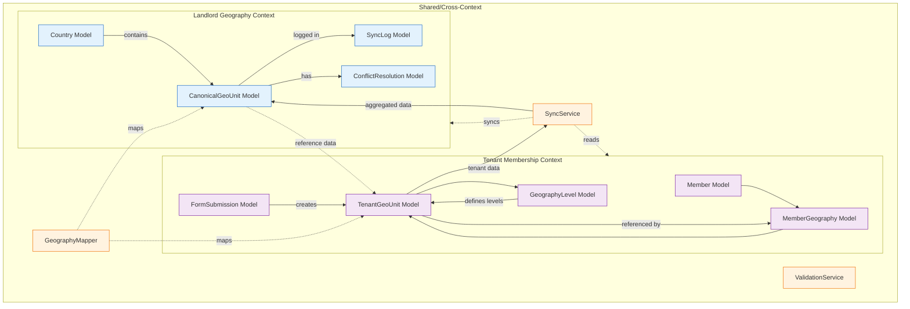

# 🧠 **Brainstorming: Model Architecture for Bottom-Up Sync**

Let me analyze the model requirements for this **bottom-up geography sync** architecture. This is a fundamentally different approach that requires rethinking our context boundaries.

## 📊 **Model Architecture Overview**



## 🏗️ **Detailed Model Specifications**

### **1. TENANT MEMBERSHIP CONTEXT Models**

#### **Model 1: `GeographyLevel`** (Configuration)
```php
// app/Contexts/Membership/Domain/Models/GeographyLevel.php
class GeographyLevel extends Model
{
    protected $table = 'geography_levels';
    
    protected $fillable = [
        'level',           // 0=country, 1=province, 2=district, etc.
        'code',            // 'np', 'pr', 'dr', 'lu', 'wr', 'sr', 'hnr'
        'name_local',      // {'en': 'Province', 'np': 'प्रदेश'}
        'is_active',
        'sort_order',
        'is_required',     // Country, Province, District are required
        'validation_rules', // JSON: {'max_length': 100, 'pattern': '^[A-Za-z ]+$'}
        'hint_text'        // Display hint for forms
    ];
    
    protected $casts = [
        'name_local' => 'array',
        'validation_rules' => 'array',
        'is_required' => 'boolean',
        'is_active' => 'boolean'
    ];
    
    // Relationships
    public function units(): HasMany
    {
        return $this->hasMany(TenantGeoUnit::class, 'level_id');
    }
    
    // Business Methods
    public function getDisplayName(string $language = 'en'): string
    {
        return $this->name_local[$language] ?? $this->name_local['en'] ?? "Level {$this->level}";
    }
    
    public function isCountryLevel(): bool
    {
        return $this->level === 0;
    }
    
    public function isCustomLevel(): bool
    {
        return $this->level >= 5; // Levels 5+ are party-specific
    }
}
```

#### **Model 2: `TenantGeoUnit`** (Raw Data Entry)
```php
// app/Contexts/Membership/Domain/Models/TenantGeoUnit.php
class TenantGeoUnit extends Model
{
    protected $table = 'geography_units';
    
    protected $fillable = [
        'tenant_id',
        'level_id',
        'level_number',
        'parent_id',
        'code',
        'name',
        'name_local',
        'official_code',     // If known from government data
        'canonical_id',      // Reference to landlord's canonical unit
        'status',            // draft, pending_sync, synced, rejected, conflict
        'rejection_reason',
        'metadata',          // {'source': 'form', 'entered_by': 'user123', 'timestamp': '...'}
        'created_by',
        'updated_by',
        'synced_at',
        'sync_version'
    ];
    
    protected $casts = [
        'name_local' => 'array',
        'metadata' => 'array',
        'synced_at' => 'datetime'
    ];
    
    // Relationships
    public function level(): BelongsTo
    {
        return $this->belongsTo(GeographyLevel::class);
    }
    
    public function parent(): BelongsTo
    {
        return $this->belongsTo(self::class, 'parent_id');
    }
    
    public function children(): HasMany
    {
        return $this->hasMany(self::class, 'parent_id');
    }
    
    public function members(): HasMany
    {
        return $this->hasMany(MemberGeography::class, 'geo_unit_id');
    }
    
    public function canonicalUnit(): ?CanonicalGeoUnit
    {
        // Cross-context relationship - handle with care
        if (!$this->canonical_id) {
            return null;
        }
        
        // Use a service to fetch, not direct model access
        return app(GeographyMapperService::class)->getCanonicalUnit($this->canonical_id);
    }
    
    // Business Methods
    public function getFullPath(): string
    {
        $path = [];
        $current = $this;
        
        while ($current) {
            array_unshift($path, $this->name);
            $current = $current->parent;
        }
        
        return implode(' → ', $path);
    }
    
    public function markForSync(): void
    {
        $this->update([
            'status' => 'pending_sync',
            'sync_version' => null
        ]);
        
        SyncTenantGeoUnitJob::dispatch($this->id);
    }
    
    public function isSynced(): bool
    {
        return $this->status === 'synced' && $this->canonical_id !== null;
    }
    
    public function hasConflicts(): bool
    {
        return $this->status === 'conflict';
    }
}
```

#### **Model 3: `MemberGeography`** (Linking Table)
```php
// app/Contexts/Membership/Domain/Models/MemberGeography.php
class MemberGeography extends Model
{
    protected $table = 'member_geography';
    
    protected $fillable = [
        'member_id',
        'geo_unit_id',
        'level_number',
        'is_primary',      // Primary residence vs other addresses
        'address_line',    // Additional address details
        'coordinates',     // GPS coordinates if available
        'verified_at',
        'verified_by'
    ];
    
    // Relationships
    public function member(): BelongsTo
    {
        return $this->belongsTo(Member::class);
    }
    
    public function geoUnit(): BelongsTo
    {
        return $this->belongsTo(TenantGeoUnit::class);
    }
    
    // Business Methods
    public function getFullAddress(): string
    {
        $address = [];
        
        if ($this->address_line) {
            $address[] = $this->address_line;
        }
        
        $current = $this->geoUnit;
        while ($current) {
            $address[] = $current->name;
            $current = $current->parent;
        }
        
        return implode(', ', array_reverse($address));
    }
}
```

#### **Model 4: `FormSubmission`** (Audit Trail)
```php
// app/Contexts/Membership/Domain/Models/FormSubmission.php
class FormSubmission extends Model
{
    protected $table = 'form_submissions';
    
    protected $fillable = [
        'tenant_id',
        'form_type',        // 'member_registration', 'address_update'
        'submitted_by',
        'form_data',        // Original form data as JSON
        'processed_data',   // Processed/validated data
        'geo_units_created', // IDs of created TenantGeoUnits
        'status',           // pending, processing, completed, failed
        'error_message'
    ];
    
    protected $casts = [
        'form_data' => 'array',
        'processed_data' => 'array',
        'geo_units_created' => 'array'
    ];
    
    // Relationships
    public function createdUnits(): HasMany
    {
        return TenantGeoUnit::whereIn('id', $this->geo_units_created ?? []);
    }
}
```

### **2. LANDLORD GEOGRAPHY CONTEXT Models**

#### **Model 1: `Country`** (Reference Data)
```php
// app/Contexts/Geography/Domain/Models/Country.php
class Country extends Model
{
    protected $connection = 'landlord';
    protected $table = 'countries';
    
    protected $fillable = [
        'code',              // 'NP', 'IN', 'DE'
        'code_alpha3',       // 'NPL', 'IND', 'DEU'
        'name_en',
        'name_local',        // {'np': 'नेपाल', 'hi': 'भारत'}
        'official_levels',   // JSON: {'1': 'Province', '2': 'District', ...}
        'is_active',
        'is_supported'       // Platform supports this country
    ];
    
    protected $casts = [
        'name_local' => 'array',
        'official_levels' => 'array'
    ];
    
    // Relationships
    public function canonicalUnits(): HasMany
    {
        return $this->hasMany(CanonicalGeoUnit::class, 'country_code', 'code');
    }
    
    public function tenantReferences(): HasMany
    {
        return $this->hasMany(TenantSyncLog::class, 'country_code', 'code');
    }
    
    // Business Methods
    public function getSupportedLevels(): array
    {
        return $this->official_levels ?? [
            '0' => ['name' => 'Country', 'local_name' => 'देश'],
            '1' => ['name' => 'Province', 'local_name' => 'प्रदेश'],
            '2' => ['name' => 'District', 'local_name' => 'जिल्ला'],
            '3' => ['name' => 'Local Unit', 'local_name' => 'स्थानीय तह'],
            '4' => ['name' => 'Ward', 'local_name' => 'वडा']
        ];
    }
}
```

#### **Model 2: `CanonicalGeoUnit`** (Single Source of Truth)
```php
// app/Contexts/Geography/Domain/Models/CanonicalGeoUnit.php
class CanonicalGeoUnit extends Model
{
    protected $connection = 'landlord';
    protected $table = 'canonical_geography_units';
    
    protected $fillable = [
        'country_code',
        'level',
        'level_code',
        'parent_id',
        'path',
        'official_code',      // Government code: 'NP-P3', 'IN-UP'
        'canonical_name',     // Primary standardized name
        'canonical_names',    // All known names from tenants
        'tenant_count',
        'usage_count',
        'tenant_references',  // Which tenants reference this unit
        'verification_status', // unverified, verified, disputed
        'verification_data',  // {'verified_by': 'gov_data', 'source': 'census_2021'}
        'alternative_names',
        'first_seen_at',
        'last_seen_at'
    ];
    
    protected $casts = [
        'canonical_names' => 'array',
        'tenant_references' => 'array',
        'verification_data' => 'array',
        'alternative_names' => 'array',
        'first_seen_at' => 'datetime',
        'last_seen_at' => 'datetime'
    ];
    
    // Relationships
    public function country(): BelongsTo
    {
        return $this->belongsTo(Country::class, 'country_code', 'code');
    }
    
    public function parent(): BelongsTo
    {
        return $this->belongsTo(self::class, 'parent_id');
    }
    
    public function children(): HasMany
    {
        return $this->hasMany(self::class, 'parent_id');
    }
    
    public function tenantUnits(): HasMany
    {
        // This is conceptual - actual implementation via SyncLog
        return $this->hasMany(TenantSyncLog::class, 'canonical_unit_id');
    }
    
    public function conflicts(): HasMany
    {
        return $this->hasMany(ConflictResolution::class, 'canonical_unit_id');
    }
    
    // Business Methods
    public function getConfidenceScore(): float
    {
        if ($this->tenant_count === 0) return 0.0;
        
        $score = min($this->tenant_count / 10, 1.0); // Max confidence at 10 tenants
        if ($this->verification_status === 'verified') {
            $score = min($score + 0.3, 1.0);
        }
        
        return round($score, 2);
    }
    
    public function addTenantReference(int $tenantId, int $tenantUnitId, string $name): void
    {
        $references = $this->tenant_references ?? [];
        
        $found = false;
        foreach ($references as &$ref) {
            if ($ref['tenant_id'] === $tenantId) {
                $ref['last_seen'] = now()->toISOString();
                $ref['names_used'][] = $name;
                $found = true;
                break;
            }
        }
        
        if (!$found) {
            $references[] = [
                'tenant_id' => $tenantId,
                'tenant_unit_id' => $tenantUnitId,
                'first_seen' => now()->toISOString(),
                'last_seen' => now()->toISOString(),
                'names_used' => [$name]
            ];
        }
        
        $this->update([
            'tenant_references' => $references,
            'tenant_count' => count(array_unique(array_column($references, 'tenant_id'))),
            'usage_count' => $this->usage_count + 1,
            'last_seen_at' => now()
        ]);
    }
    
    public function suggestStandardizedName(): string
    {
        $names = $this->canonical_names;
        
        if (empty($names)) {
            return $this->canonical_name;
        }
        
        // Find most common name across tenants
        $nameCounts = array_count_values($names);
        arsort($nameCounts);
        
        return array_key_first($nameCounts);
    }
}
```

#### **Model 3: `TenantSyncLog`** (Audit Trail)
```php
// app/Contexts/Geography/Domain/Models/TenantSyncLog.php
class TenantSyncLog extends Model
{
    protected $connection = 'landlord';
    protected $table = 'tenant_sync_logs';
    
    protected $fillable = [
        'tenant_id',
        'tenant_unit_id',
        'canonical_unit_id',
        'tenant_data',
        'processed_data',
        'sync_operation',     // create, update, merge, ignore, conflict
        'status',
        'error_message',
        'conflict_data',
        'confidence_score',
        'matching_results'
    ];
    
    protected $casts = [
        'tenant_data' => 'array',
        'processed_data' => 'array',
        'conflict_data' => 'array',
        'matching_results' => 'array'
    ];
    
    // Relationships
    public function tenant(): BelongsTo
    {
        // This assumes a Tenant model exists in landlord DB
        return $this->belongsTo(Tenant::class);
    }
    
    public function canonicalUnit(): BelongsTo
    {
        return $this->belongsTo(CanonicalGeoUnit::class);
    }
    
    // Business Methods
    public function isSuccessful(): bool
    {
        return $this->status === 'completed';
    }
    
    public function hasConflict(): bool
    {
        return $this->status === 'conflict';
    }
    
    public function getSyncSummary(): array
    {
        return [
            'operation' => $this->sync_operation,
            'confidence' => $this->confidence_score,
            'canonical_unit' => $this->canonical_unit_id,
            'timestamp' => $this->created_at->toISOString()
        ];
    }
}
```

#### **Model 4: `ConflictResolution`** (Conflict Management)
```php
// app/Contexts/Geography/Domain/Models/ConflictResolution.php
class ConflictResolution extends Model
{
    protected $connection = 'landlord';
    protected $table = 'conflict_resolutions';
    
    protected $fillable = [
        'canonical_unit_id',
        'conflict_type',      // name_mismatch, hierarchy, duplicate, boundary
        'conflicting_units',  // Array of tenant unit IDs involved
        'conflict_data',      // Details of the conflict
        'proposed_solution',  // {'action': 'merge', 'primary_unit_id': 123}
        'resolved_by',
        'resolution_action',  // merge, split, rename, hierarchy_update
        'resolution_data',    // Result of resolution
        'resolution_notes',
        'status'              // pending, in_review, resolved, rejected
    ];
    
    protected $casts = [
        'conflicting_units' => 'array',
        'conflict_data' => 'array',
        'proposed_solution' => 'array',
        'resolution_data' => 'array'
    ];
    
    // Relationships
    public function canonicalUnit(): BelongsTo
    {
        return $this->belongsTo(CanonicalGeoUnit::class);
    }
    
    public function resolver(): BelongsTo
    {
        return $this->belongsTo(User::class, 'resolved_by');
    }
    
    // Business Methods
    public function markAsResolved(string $action, array $data, int $resolverId): void
    {
        $this->update([
            'resolution_action' => $action,
            'resolution_data' => $data,
            'resolved_by' => $resolverId,
            'status' => 'resolved',
            'resolved_at' => now()
        ]);
        
        // Apply resolution to affected units
        $this->applyResolution($action, $data);
    }
    
    private function applyResolution(string $action, array $data): void
    {
        $service = app(ConflictResolutionService::class);
        
        switch ($action) {
            case 'merge':
                $service->mergeUnits($this->canonical_unit_id, $data['merge_with_id']);
                break;
            case 'rename':
                $service->renameCanonicalUnit($this->canonical_unit_id, $data['new_name']);
                break;
            case 'hierarchy_update':
                $service->updateHierarchy($this->canonical_unit_id, $data['new_parent_id']);
                break;
        }
    }
}
```

## 🔗 **Cross-Context Abstraction Layer**

### **Service 1: `GeographyMapperService`**
```php
// app/Services/CrossContext/GeographyMapperService.php
namespace App\Services\CrossContext;

use App\Contexts\Membership\Domain\Models\TenantGeoUnit;
use App\Contexts\Geography\Domain\Models\CanonicalGeoUnit;

class GeographyMapperService
{
    public function mapToCanonical(TenantGeoUnit $tenantUnit): ?CanonicalGeoUnit
    {
        // 1. Check if already mapped
        if ($tenantUnit->canonical_id) {
            return CanonicalGeoUnit::find($tenantUnit->canonical_id);
        }
        
        // 2. Find potential matches
        $matches = $this->findPotentialMatches($tenantUnit);
        
        if (empty($matches)) {
            return null;
        }
        
        // 3. Calculate confidence scores
        $scoredMatches = $this->scoreMatches($matches, $tenantUnit);
        
        // 4. Return best match if above threshold
        $bestMatch = $this->getBestMatch($scoredMatches);
        
        return $bestMatch['confidence'] >= 0.7 ? $bestMatch['unit'] : null;
    }
    
    public function createCanonicalFromTenant(TenantGeoUnit $tenantUnit): CanonicalGeoUnit
    {
        $parentCanonical = null;
        
        // Find parent canonical if exists
        if ($tenantUnit->parent && $tenantUnit->parent->canonical_id) {
            $parentCanonical = CanonicalGeoUnit::find($tenantUnit->parent->canonical_id);
        }
        
        return CanonicalGeoUnit::create([
            'country_code' => $this->inferCountryCode($tenantUnit),
            'level' => $tenantUnit->level_number,
            'level_code' => $tenantUnit->level->code,
            'parent_id' => $parentCanonical?->id,
            'canonical_name' => $this->standardizeName($tenantUnit->name),
            'canonical_names' => [$tenantUnit->name],
            'tenant_count' => 1,
            'tenant_references' => [[
                'tenant_id' => $tenantUnit->tenant_id,
                'tenant_unit_id' => $tenantUnit->id,
                'first_seen' => now()->toISOString()
            ]],
            'first_seen_at' => now(),
            'last_seen_at' => now()
        ]);
    }
}
```

### **Service 2: `SyncOrchestrator`**
```php
// app/Services/CrossContext/SyncOrchestrator.php
namespace App\Services\CrossContext;

class SyncOrchestrator
{
    public function syncTenantUnit(int $tenantUnitId): array
    {
        // 1. Get tenant unit (from tenant context)
        $tenantUnit = $this->getTenantUnit($tenantUnitId);
        
        // 2. Map to canonical (cross-context operation)
        $mapper = app(GeographyMapperService::class);
        $canonicalUnit = $mapper->mapToCanonical($tenantUnit);
        
        if ($canonicalUnit) {
            // 3. Update existing canonical unit
            $result = $this->updateCanonicalUnit($canonicalUnit, $tenantUnit);
        } else {
            // 4. Create new canonical unit
            $result = $this->createCanonicalUnit($tenantUnit);
        }
        
        // 5. Update tenant unit with reference
        $this->updateTenantUnitReference($tenantUnit, $result);
        
        // 6. Log sync operation
        $this->logSyncOperation($tenantUnit, $result);
        
        return $result;
    }
    
    private function getTenantUnit(int $id): TenantGeoUnit
    {
        // This method needs to work across tenant contexts
        // Implementation depends on your multi-tenancy approach
        return TenantGeoUnit::find($id);
    }
}
```

## 📁 **Model Relationships Summary**

| **Context** | **Model** | **Purpose** | **Key Relationships** |
|-------------|-----------|-------------|----------------------|
| **Tenant Membership** | `GeographyLevel` | Define geography hierarchy levels | ← `TenantGeoUnit` |
| **Tenant Membership** | `TenantGeoUnit` | Raw geography data from members | → `GeographyLevel`, ←→ `MemberGeography` |
| **Tenant Membership** | `MemberGeography` | Link members to geography units | → `Member`, → `TenantGeoUnit` |
| **Tenant Membership** | `FormSubmission` | Audit trail of data entry | → `TenantGeoUnit` |
| **Landlord Geography** | `Country` | Country reference data | → `CanonicalGeoUnit` |
| **Landlord Geography** | `CanonicalGeoUnit` | Single source of truth | ← `Country`, → `TenantSyncLog` |
| **Landlord Geography** | `TenantSyncLog` | Sync audit trail | → `CanonicalGeoUnit` |
| **Landlord Geography** | `ConflictResolution` | Manage data conflicts | → `CanonicalGeoUnit` |

## 🎯 **Key Abstraction Principles**

### **1. Context Boundaries**
- **Membership Context**: Tenant-specific data collection and management
- **Geography Context**: Cross-tenant canonical data and validation
- **Cross-Context Services**: Bridge between contexts with clear contracts

### **2. Data Flow**
```
Tenant Data Entry → TenantGeoUnit (draft) → Sync Service → 
CanonicalGeoUnit (verified) → Reference back to TenantGeoUnit (synced)
```

### **3. Abstraction Layers**
1. **Data Collection Layer** (Tenant): Raw, party-specific data
2. **Canonical Layer** (Landlord): Cleaned, validated, cross-party data  
3. **Mapping Layer** (Service): Intelligent matching and conflict resolution
4. **Audit Layer** (Both): Full traceability of all operations

### **4. Change Management**
- Tenant data changes → Mark for sync → Review → Update canonical
- Canonical data changes → Notify tenants → Optional updates
- Conflict detection → Human review → Resolution → Propagation

## 🔄 **Implementation Strategy**

**Phase 1**: Tenant data collection models (`GeographyLevel`, `TenantGeoUnit`, `MemberGeography`)
**Phase 2**: Basic landlord models (`Country`, `CanonicalGeoUnit`)
**Phase 3**: Sync infrastructure (`SyncOrchestrator`, `GeographyMapperService`)
**Phase 4**: Conflict management (`ConflictResolution`, `TenantSyncLog`)
**Phase 5**: Advanced features (data quality scoring, bulk operations, APIs)

This architecture supports your bottom-up approach while maintaining clean context separation. Each context has clear responsibilities, and cross-context operations happen through well-defined service layers.

**Which models would you like to implement first?** I recommend starting with the Tenant Membership Context models since they're needed for data collection, then building the sync infrastructure.