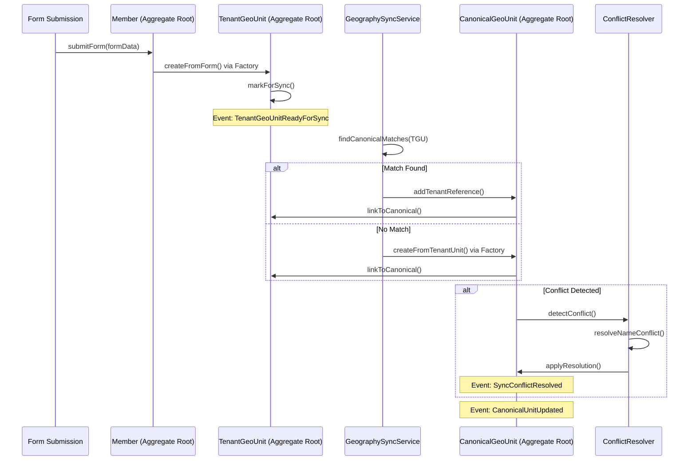

# 🏗️ **DDD Analysis: Entities, Value Objects, Aggregates & Domain Services**

Based on your bottom-up sync architecture, let me analyze the domain model through a DDD lens.

## 🎯 **Domain Model Analysis**

```mermaid
graph TB
    %% Style Definitions
    classDef aggregateRoot fill:#e1f5fe,stroke:#0288d1
    classDef entity fill:#f3e5f5,stroke:#7b1fa2
    classDef valueObject fill:#e8f5e8,stroke:#2e7d32
    classDef domainService fill:#fff3e0,stroke:#ef6c00
    classDef domainEvent fill:#fce4ec,stroke:#c2185b
    classDef repository fill:#f3e5f5,stroke:#7b1fa2,stroke-dasharray: 5 5
    classDef factory fill:#e8f5e8,stroke:#2e7d32,stroke-dasharray: 5 5

    %% Aggregates (Roots)
    subgraph AR1[Membership Aggregate]
        direction LR
        MemberRoot[<b>Member<br/>(Aggregate Root)</b>]:::aggregateRoot
        MemberGeography[MemberGeography]:::entity
        FormSubmission[FormSubmission]:::entity
    end

    subgraph AR2[Geography Aggregate]
        direction LR
        TenantGeoRoot[<b>TenantGeoUnit<br/>(Aggregate Root)</b>]:::aggregateRoot
        GeographyLevel[GeographyLevel]:::entity
    end

    subgraph AR3[Canonical Aggregate]
        direction LR
        CanonicalRoot[<b>CanonicalGeoUnit<br/>(Aggregate Root)</b>]:::aggregateRoot
        Country[Country]:::entity
        ConflictRes[ConflictResolution]:::entity
    end

    %% Value Objects
    V1[GeoPath]:::valueObject
    V2[GeoCoordinates]:::valueObject
    V3[LocalizedName]:::valueObject
    V4[SyncMetadata]:::valueObject
    V5[ConfidenceScore]:::valueObject

    %% Domain Services
    DS1[GeographySyncService]:::domainService
    DS2[ConflictResolver]:::domainService
    DS3[NameStandardizer]:::domainService

    %% Domain Events
    DE1[TenantUnitCreated]:::domainEvent
    DE2[CanonicalUnitVerified]:::domainEvent
    DE3[SyncConflictDetected]:::domainEvent
    DE4[GeographyHierarchyChanged]:::domainEvent

    %% Repositories & Factories
    RF1[TenantGeoUnitRepository]:::repository
    RF2[CanonicalGeoUnitRepository]:::repository
    RF3[MemberRepository]:::repository
    RF4[TenantGeoUnitFactory]:::factory
    RF5[CanonicalGeoUnitFactory]:::factory

    %% Relationships
    MemberRoot --> MemberGeography
    TenantGeoRoot --> GeographyLevel
    
    %% Value Object Usage
    TenantGeoRoot -.-> V1
    TenantGeoRoot -.-> V3
    CanonicalRoot -.-> V1
    CanonicalRoot -.-> V3
    CanonicalRoot -.-> V5
    
    %% Service Interactions
    DS1 -->|syncs| TenantGeoRoot
    DS1 -->|creates/updates| CanonicalRoot
    DS2 -->|resolves| ConflictRes
    DS3 -->|standardizes| V3

    %% Event Triggers
    TenantGeoRoot -->|emits| DE1
    DS2 -->|emits| DE3
    CanonicalRoot -->|emits| DE2
    
    %% Repository Access
    RF1 -->|manages| TenantGeoRoot
    RF2 -->|manages| CanonicalRoot
    RF3 -->|manages| MemberRoot
    RF4 -->|creates| TenantGeoRoot
    RF5 -->|creates| CanonicalRoot
```

## 📦 **AGGREGATES & AGGREGATE ROOTS**

### **1. Membership Aggregate**
**Aggregate Root**: `Member`
```php
// app/Contexts/Membership/Domain/Entities/Member.php
class Member implements AggregateRoot
{
    private MemberId $id;
    private TenantId $tenantId;
    private FullName $fullName;
    private Collection $geographyAssignments; // Collection of MemberGeography
    private Collection $formSubmissions;
    
    // Invariants: A member must have at least province and district assignment
    
    public function assignGeography(
        GeographyAssignment $assignment,
        MemberGeographyRepository $repository
    ): void {
        // Business rule: Cannot assign same geography twice
        if ($this->hasGeography($assignment->geoUnitId)) {
            throw new DuplicateGeographyAssignmentException();
        }
        
        $memberGeography = new MemberGeography(
            MemberGeographyId::generate(),
            $this->id,
            $assignment->geoUnitId,
            $assignment->addressLine,
            $assignment->coordinates,
            $assignment->isPrimary
        );
        
        $this->geographyAssignments->add($memberGeography);
        $repository->save($memberGeography);
        
        $this->recordEvent(new MemberGeographyAssigned(
            $this->id,
            $memberGeography->id(),
            $assignment->geoUnitId
        ));
    }
    
    public function submitForm(FormData $formData): FormSubmission
    {
        $submission = new FormSubmission(
            FormSubmissionId::generate(),
            $this->id,
            $formData,
            FormStatus::PENDING
        );
        
        $this->formSubmissions->add($submission);
        
        $this->recordEvent(new FormSubmitted(
            $this->id,
            $submission->id(),
            $formData->geographyData()
        ));
        
        return $submission;
    }
}
```

### **2. Tenant Geography Aggregate**
**Aggregate Root**: `TenantGeoUnit`
```php
// app/Contexts/Membership/Domain/Entities/TenantGeoUnit.php
class TenantGeoUnit implements AggregateRoot
{
    private TenantGeoUnitId $id;
    private TenantId $tenantId;
    private GeographyLevel $level;
    private ?TenantGeoUnitId $parentId;
    private UnitName $name;
    private LocalizedName $localizedName;
    private UnitCode $code;
    private ?OfficialCode $officialCode;
    private ?CanonicalUnitId $canonicalId;
    private SyncStatus $syncStatus;
    private SyncMetadata $syncMetadata;
    private Collection $children;
    
    // Invariants:
    // 1. Parent must be at level-1 (if parent exists)
    // 2. Official code must be valid for the country
    
    public function createChild(UnitName $name, GeographyLevel $childLevel): self
    {
        // Business rule: Child level must be exactly one higher
        if ($childLevel->value() !== $this->level->value() + 1) {
            throw new InvalidHierarchyLevelException();
        }
        
        // Business rule: Cannot create beyond level 8
        if ($childLevel->value() > 8) {
            throw new MaximumHierarchyDepthException();
        }
        
        $child = new self(
            TenantGeoUnitId::generate(),
            $this->tenantId,
            $childLevel,
            $this->id,
            $name,
            LocalizedName::fromSingle($name->value()),
            UnitCode::generate($this->tenantId, $childLevel, $name),
            null, // officialCode
            null, // canonicalId
            SyncStatus::DRAFT(),
            SyncMetadata::initial()
        );
        
        $this->children->add($child);
        
        $this->recordEvent(new TenantGeoUnitCreated(
            $child->id(),
            $this->tenantId,
            $child->level(),
            $child->name()
        ));
        
        return $child;
    }
    
    public function markForSync(): void
    {
        if ($this->syncStatus->equals(SyncStatus::SYNCED())) {
            throw new AlreadySyncedException();
        }
        
        $this->syncStatus = SyncStatus::PENDING_SYNC();
        $this->syncMetadata = $this->syncMetadata->markPending();
        
        $this->recordEvent(new TenantGeoUnitReadyForSync(
            $this->id(),
            $this->tenantId,
            $this->toSyncData()
        ));
    }
    
    public function linkToCanonical(CanonicalUnitId $canonicalId, SyncVersion $version): void
    {
        $this->canonicalId = $canonicalId;
        $this->syncStatus = SyncStatus::SYNCED();
        $this->syncMetadata = $this->syncMetadata->markSynced($version);
        
        $this->recordEvent(new TenantGeoUnitSynced(
            $this->id(),
            $canonicalId,
            $version
        ));
    }
}
```

### **3. Canonical Geography Aggregate**
**Aggregate Root**: `CanonicalGeoUnit`
```php
// app/Contexts/Geography/Domain/Entities/CanonicalGeoUnit.php
class CanonicalGeoUnit implements AggregateRoot
{
    private CanonicalGeoUnitId $id;
    private CountryCode $countryCode;
    private GeographyLevel $level;
    private ?CanonicalGeoUnitId $parentId;
    private GeoPath $path;
    private UnitName $canonicalName;
    private AlternativeNames $alternativeNames;
    private OfficialCode $officialCode;
    private VerificationStatus $verificationStatus;
    private TenantReferences $tenantReferences;
    private ConfidenceScore $confidenceScore;
    private Collection $conflicts;
    
    // Invariants:
    // 1. Official code must be unique within country and level
    // 2. Path must match parent hierarchy
    
    public function addTenantReference(
        TenantId $tenantId,
        TenantGeoUnitId $tenantUnitId,
        UnitName $reportedName
    ): void {
        $this->tenantReferences = $this->tenantReferences->addReference(
            $tenantId,
            $tenantUnitId,
            $reportedName
        );
        
        $this->alternativeNames = $this->alternativeNames->addIfNew($reportedName);
        
        // Recalculate confidence score
        $this->confidenceScore = ConfidenceScore::calculate(
            $this->tenantReferences->count(),
            $this->verificationStatus
        );
        
        $this->recordEvent(new CanonicalUnitReferenced(
            $this->id(),
            $tenantId,
            $reportedName
        ));
    }
    
    public function verify(VerificationSource $source, VerifiedData $data): void
    {
        $this->verificationStatus = VerificationStatus::VERIFIED();
        
        // Update official data if provided by verification source
        if ($data->hasOfficialCode()) {
            $this->officialCode = $data->officialCode();
        }
        
        if ($data->hasStandardizedName()) {
            $this->canonicalName = $data->standardizedName();
        }
        
        $this->recordEvent(new CanonicalUnitVerified(
            $this->id(),
            $source,
            $data
        ));
    }
    
    public function detectConflict(ConflictData $conflictData): ConflictResolution
    {
        $conflict = new ConflictResolution(
            ConflictResolutionId::generate(),
            $this->id,
            $conflictData->type(),
            $conflictData->conflictingUnits(),
            $conflictData->details()
        );
        
        $this->conflicts->add($conflict);
        
        $this->recordEvent(new SyncConflictDetected(
            $this->id(),
            $conflict->id(),
            $conflictData->type()
        ));
        
        return $conflict;
    }
}
```

## 🔤 **VALUE OBJECTS (Immutable)**

### **1. Geography Value Objects**
```php
// app/Contexts/Shared/Domain/ValueObjects/GeoPath.php
class GeoPath implements ValueObject
{
    private string $path;
    
    private function __construct(string $path)
    {
        // Validation: Must be dot-separated IDs or empty
        if (!empty($path) && !preg_match('/^\d+(\.\d+)*$/', $path)) {
            throw new InvalidGeoPathException($path);
        }
        
        $this->path = $path;
    }
    
    public static function fromString(string $path): self
    {
        return new self($path);
    }
    
    public static function createFromParent(?self $parent, int $unitId): self
    {
        if (!$parent || $parent->isEmpty()) {
            return new self((string) $unitId);
        }
        
        return new self($parent->toString() . '.' . $unitId);
    }
    
    public function isDescendantOf(self $other): bool
    {
        if ($this->isEmpty() || $other->isEmpty()) {
            return false;
        }
        
        return strpos($this->path, $other->path . '.') === 0;
    }
    
    public function getDepth(): int
    {
        return $this->isEmpty() ? 0 : substr_count($this->path, '.') + 1;
    }
    
    public function equals(ValueObject $other): bool
    {
        return $other instanceof self && $this->path === $other->path;
    }
}

// app/Contexts/Shared/Domain/ValueObjects/LocalizedName.php
class LocalizedName implements ValueObject
{
    private array $names; // ['en' => 'Name', 'np' => 'नाम']
    
    public function __construct(array $names)
    {
        if (empty($names['en'])) {
            throw new MissingEnglishNameException();
        }
        
        $this->names = $names;
    }
    
    public static function fromSingle(string $name, string $language = 'en'): self
    {
        return new self([$language => $name]);
    }
    
    public function getName(string $language = 'en'): string
    {
        return $this->names[$language] ?? $this->names['en'] ?? '';
    }
    
    public function addTranslation(string $language, string $name): self
    {
        $newNames = $this->names;
        $newNames[$language] = $name;
        
        return new self($newNames);
    }
}

// app/Contexts/Geography/Domain/ValueObjects/ConfidenceScore.php
class ConfidenceScore implements ValueObject
{
    private float $score; // 0.0 to 1.0
    
    private function __construct(float $score)
    {
        if ($score < 0.0 || $score > 1.0) {
            throw new InvalidConfidenceScoreException($score);
        }
        
        $this->score = round($score, 2);
    }
    
    public static function calculate(int $tenantCount, VerificationStatus $verification): self
    {
        $baseScore = min($tenantCount / 10.0, 1.0);
        
        if ($verification->isVerified()) {
            $baseScore = min($baseScore + 0.3, 1.0);
        }
        
        return new self($baseScore);
    }
    
    public function isHighConfidence(): bool
    {
        return $this->score >= 0.8;
    }
    
    public function equals(ValueObject $other): bool
    {
        return $other instanceof self && $this->score === $other->score;
    }
}
```

### **2. Identification Value Objects**
```php
// app/Contexts/Shared/Domain/ValueObjects/UnitCode.php
class UnitCode implements ValueObject
{
    private string $code;
    
    public function __construct(string $code)
    {
        // Validation: Must match pattern TENANT-LEVEL-XXXXXX
        if (!preg_match('/^[A-Z]+-[A-Z]{2}-[A-Z0-9]{6}$/', $code)) {
            throw new InvalidUnitCodeException($code);
        }
        
        $this->code = $code;
    }
    
    public static function generate(
        TenantId $tenantId,
        GeographyLevel $level,
        UnitName $name
    ): self {
        $tenantCode = $tenantId->toCode(); // Converts to short code
        $levelCode = $level->code();
        $hash = substr(md5($name->value()), 0, 6);
        
        return new self("{$tenantCode}-{$levelCode}-{$hash}");
    }
}

// app/Contexts/Geography/Domain/ValueObjects/OfficialCode.php
class OfficialCode implements ValueObject
{
    private string $code;
    
    public function __construct(string $code)
    {
        // Validation: Must be government-recognized format
        // NP-P1, NP-D25, IN-UP, etc.
        if (!preg_match('/^[A-Z]{2}-[A-Z0-9]+$/', $code)) {
            throw new InvalidOfficialCodeException($code);
        }
        
        $this->code = $code;
    }
}
```

## ⚙️ **DOMAIN SERVICES (Stateless Business Logic)**

### **1. Geography Sync Service**
```php
// app/Contexts/Geography/Domain/Services/GeographySyncService.php
class GeographySyncService
{
    public function __construct(
        private TenantGeoUnitRepository $tenantRepository,
        private CanonicalGeoUnitRepository $canonicalRepository,
        private NameSimilarityCalculator $similarityCalculator
    ) {}
    
    public function syncTenantUnit(TenantGeoUnitId $tenantUnitId): SyncResult
    {
        $tenantUnit = $this->tenantRepository->find($tenantUnitId);
        
        if (!$tenantUnit) {
            throw new TenantUnitNotFoundException($tenantUnitId);
        }
        
        // Find potential canonical matches
        $matches = $this->findCanonicalMatches($tenantUnit);
        
        if (empty($matches)) {
            // Create new canonical unit
            $canonicalUnit = $this->createCanonicalFromTenant($tenantUnit);
            $operation = SyncOperation::CREATED();
        } else {
            // Update existing canonical unit
            $bestMatch = $this->selectBestMatch($matches, $tenantUnit);
            $canonicalUnit = $this->updateCanonicalFromTenant($bestMatch, $tenantUnit);
            $operation = SyncOperation::UPDATED();
        }
        
        // Link tenant unit to canonical
        $tenantUnit->linkToCanonical(
            $canonicalUnit->id(),
            SyncVersion::generate()
        );
        
        $this->tenantRepository->save($tenantUnit);
        $this->canonicalRepository->save($canonicalUnit);
        
        return new SyncResult($operation, $canonicalUnit->id(), $canonicalUnit->confidenceScore());
    }
    
    private function findCanonicalMatches(TenantGeoUnit $tenantUnit): array
    {
        $candidates = $this->canonicalRepository->findByLevelAndCountry(
            $tenantUnit->level(),
            $this->inferCountryCode($tenantUnit)
        );
        
        return array_filter($candidates, function ($canonical) use ($tenantUnit) {
            $similarity = $this->similarityCalculator->calculate(
                $tenantUnit->name(),
                $canonical->canonicalName(),
                $canonical->alternativeNames()
            );
            
            return $similarity >= 0.7; // Threshold for potential match
        });
    }
}
```

### **2. Conflict Resolution Service**
```php
// app/Contexts/Geography/Domain/Services/ConflictResolver.php
class ConflictResolver
{
    public function resolveNameConflict(
        CanonicalGeoUnit $canonicalUnit,
        array $conflictingNames
    ): Resolution {
        // Strategy pattern for different resolution approaches
        $strategies = [
            new MostFrequentNameStrategy(),
            new GovernmentOfficialNameStrategy(),
            new AdministratorDecisionStrategy()
        ];
        
        foreach ($strategies as $strategy) {
            if ($strategy->canResolve($conflictingNames)) {
                return $strategy->resolve($conflictingNames);
            }
        }
        
        throw new UnresolvableConflictException($conflictingNames);
    }
    
    public function mergeDuplicateUnits(
        CanonicalGeoUnit $primary,
        CanonicalGeoUnit $secondary
    ): void {
        // Business rules for merging
        if ($primary->level()->value() !== $secondary->level()->value()) {
            throw new DifferentLevelMergeException();
        }
        
        if ($primary->parentId() !== $secondary->parentId()) {
            throw new DifferentHierarchyMergeException();
        }
        
        // Merge names
        $mergedNames = $primary->alternativeNames()->merge(
            $secondary->alternativeNames()
        );
        
        // Merge tenant references
        $mergedReferences = $primary->tenantReferences()->merge(
            $secondary->tenantReferences()
        );
        
        $primary->updateFromMerge($mergedNames, $mergedReferences);
        
        // Mark secondary as merged (soft delete)
        $secondary->markAsMerged($primary->id());
    }
}
```

## 📨 **DOMAIN EVENTS**

### **1. Tenant Context Events**
```php
// app/Contexts/Membership/Domain/Events/TenantGeoUnitCreated.php
class TenantGeoUnitCreated implements DomainEvent
{
    public function __construct(
        public readonly TenantGeoUnitId $unitId,
        public readonly TenantId $tenantId,
        public readonly GeographyLevel $level,
        public readonly UnitName $name,
        public readonly DateTimeImmutable $occurredOn
    ) {}
    
    public function aggregateId(): string
    {
        return $this->unitId->toString();
    }
    
    public function eventName(): string
    {
        return 'tenant_geo_unit.created';
    }
}
```

### **2. Sync Events**
```php
// app/Contexts/Geography/Domain/Events/TenantGeoUnitSynced.php
class TenantGeoUnitSynced implements DomainEvent
{
    public function __construct(
        public readonly TenantGeoUnitId $tenantUnitId,
        public readonly CanonicalGeoUnitId $canonicalUnitId,
        public readonly SyncVersion $version,
        public readonly DateTimeImmutable $occurredOn
    ) {}
    
    public function aggregateId(): string
    {
        return $this->canonicalUnitId->toString();
    }
}
```

### **3. Conflict Events**
```php
// app/Contexts/Geography/Domain/Events/SyncConflictDetected.php
class SyncConflictDetected implements DomainEvent
{
    public function __construct(
        public readonly CanonicalGeoUnitId $canonicalUnitId,
        public readonly ConflictResolutionId $conflictId,
        public readonly ConflictType $type,
        public readonly DateTimeImmutable $occurredOn
    ) {}
}
```

## 📚 **REPOSITORIES (Persistence Abstraction)**

### **1. Tenant Geography Repository**
```php
// app/Contexts/Membership/Domain/Repositories/TenantGeoUnitRepository.php
interface TenantGeoUnitRepository
{
    public function find(TenantGeoUnitId $id): ?TenantGeoUnit;
    
    public function findByTenantAndLevel(
        TenantId $tenantId,
        GeographyLevel $level
    ): array;
    
    public function findPendingSync(TenantId $tenantId): array;
    
    public function findByCanonicalId(CanonicalUnitId $canonicalId): array;
    
    public function save(TenantGeoUnit $unit): void;
    
    public function remove(TenantGeoUnit $unit): void;
}
```

### **2. Canonical Geography Repository**
```php
// app/Contexts/Geography/Domain/Repositories/CanonicalGeoUnitRepository.php
interface CanonicalGeoUnitRepository
{
    public function find(CanonicalGeoUnitId $id): ?CanonicalGeoUnit;
    
    public function findByOfficialCode(OfficialCode $code): ?CanonicalGeoUnit;
    
    public function findByLevelAndCountry(
        GeographyLevel $level,
        CountryCode $countryCode
    ): array;
    
    public function findByNameSimilarity(
        UnitName $name,
        GeographyLevel $level,
        CountryCode $countryCode,
        float $threshold = 0.7
    ): array;
    
    public function save(CanonicalGeoUnit $unit): void;
    
    public function remove(CanonicalGeoUnit $unit): void;
}
```

## 🏭 **FACTORIES (Complex Object Creation)**

### **1. Tenant Geography Factory**
```php
// app/Contexts/Membership/Domain/Factories/TenantGeoUnitFactory.php
class TenantGeoUnitFactory
{
    public static function createFromForm(
        FormData $formData,
        TenantId $tenantId,
        UserId $createdBy
    ): TenantGeoUnit {
        // Validate hierarchy completeness
        $hierarchy = self::extractHierarchy($formData);
        self::validateHierarchy($hierarchy);
        
        $units = [];
        $previousUnit = null;
        
        foreach ($hierarchy as $levelData) {
            $level = GeographyLevel::fromNumber($levelData['level']);
            
            $unit = new TenantGeoUnit(
                TenantGeoUnitId::generate(),
                $tenantId,
                $level,
                $previousUnit?->id(),
                new UnitName($levelData['name']),
                LocalizedName::fromSingle($levelData['name']),
                UnitCode::generate($tenantId, $level, new UnitName($levelData['name'])),
                null, // officialCode
                null, // canonicalId
                SyncStatus::DRAFT(),
                SyncMetadata::forFormSubmission($createdBy)
            );
            
            $units[] = $unit;
            $previousUnit = $unit;
        }
        
        // Return the leaf unit (deepest level)
        return end($units);
    }
}
```

### **2. Canonical Geography Factory**
```php
// app/Contexts/Geography/Domain/Factories/CanonicalGeoUnitFactory.php
class CanonicalGeoUnitFactory
{
    public static function createFromTenantUnit(
        TenantGeoUnit $tenantUnit,
        ?CanonicalGeoUnit $parentCanonical = null
    ): CanonicalGeoUnit {
        return new CanonicalGeoUnit(
            CanonicalGeoUnitId::generate(),
            self::inferCountryCode($tenantUnit),
            $tenantUnit->level(),
            $parentCanonical?->id(),
            GeoPath::createFromParent(
                $parentCanonical?->path(),
                $tenantUnit->id()->toInt()
            ),
            self::standardizeName($tenantUnit->name()),
            AlternativeNames::fromSingle($tenantUnit->name()),
            OfficialCode::generate($tenantUnit),
            VerificationStatus::UNVERIFIED(),
            TenantReferences::fromTenantUnit($tenantUnit),
            ConfidenceScore::initial()
        );
    }
}
```

## 📊 **DDD SUMMARY TABLE**

| **DDD Concept** | **Examples in Our Domain** | **Purpose** |
|-----------------|----------------------------|-------------|
| **Aggregate Roots** | `Member`, `TenantGeoUnit`, `CanonicalGeoUnit` | Transaction boundaries, enforce invariants |
| **Entities** | `MemberGeography`, `FormSubmission`, `ConflictResolution` | Mutable objects with identity |
| **Value Objects** | `GeoPath`, `LocalizedName`, `ConfidenceScore`, `UnitCode` | Immutable, describes characteristics |
| **Domain Services** | `GeographySyncService`, `ConflictResolver` | Stateless business logic |
| **Domain Events** | `TenantGeoUnitCreated`, `SyncConflictDetected` | Capture domain occurrences |
| **Repositories** | `TenantGeoUnitRepository`, `CanonicalGeoUnitRepository` | Persistence abstraction |
| **Factories** | `TenantGeoUnitFactory`, `CanonicalGeoUnitFactory` | Complex object creation |

## 🔄 **DOMAIN FLOW WITH DDD**



## 🎯 **KEY DDD PRINCIPLES APPLIED**

1. **Aggregate Design**: Each aggregate protects its own invariants
2. **Bounded Contexts**: Clear separation between Membership and Geography contexts
3. **Ubiquitous Language**: Domain terms like `Canonical`, `Sync`, `ConfidenceScore`
4. **Persistent Ignorance**: Entities don't know about persistence
5. **Event-Driven**: Domain events capture important business occurrences

## 🚀 **IMPLEMENTATION PRIORITY**

1. **Start with Value Objects** (immutable building blocks)
2. **Define Aggregate Roots** (transaction boundaries)
3. **Create Domain Services** (business logic)
4. **Add Domain Events** (communication mechanism)
5. **Implement Repositories** (persistence)
6. **Build Factories** (complex creation)

This DDD structure gives you a clean, maintainable architecture that reflects your business domain. Each component has clear responsibilities and the relationships between contexts are well-defined through value objects and domain services.

**Would you like me to implement any specific DDD component first?** I suggest starting with the Value Objects and Aggregate Roots as they form the foundation of your domain model.