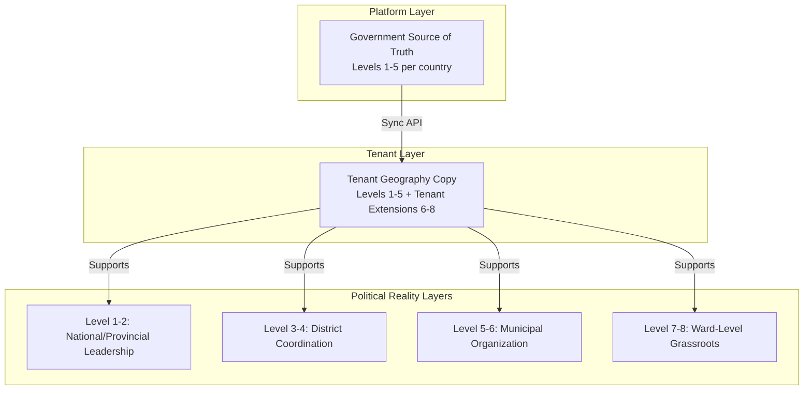
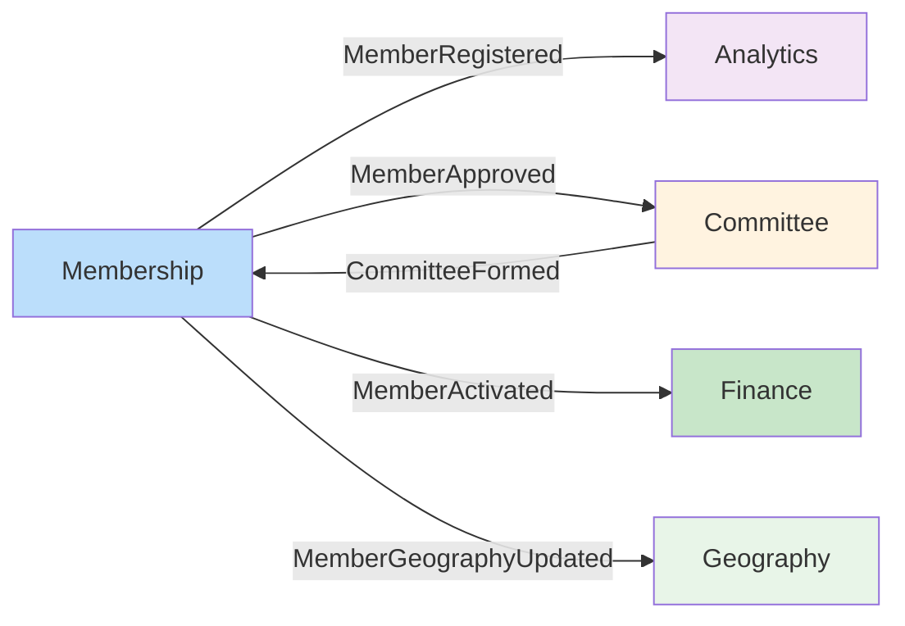

# 🎯 **SENIOR SOLUTION ARCHITECT: FINAL VERDICT & IMPLEMENTATION ROADMAP**

## **✅ ARCHITECTURE AGREEMENT WITH CRITICAL ADJUSTMENTS**

**"This architecture is fundamentally sound with the critical adjustments I'm prescribing below."**

Your architecture contract provides an excellent DDD foundation. My analysis identifies specific political reality gaps that must be addressed **before implementation**. Here's the definitive corrected version:

---

## **🏛️ CORRECTED ARCHITECTURE CONTRACT**

### **1️⃣ STRATEGIC DESIGN - ADJUSTED**

#### **Geography Context (Shared Kernel + Tenant Extensions)**


#### **Membership Context (Core Domain with Party-Specific Rules)**
```php
// KEY INSIGHT: Different parties = Different rules
interface PartyMembershipPolicy {
    public function getMinimumResidenceLevel(): int;
    public function allowsNationalCommitteeWithLocalResidence(): bool;
    public function requiresCommitteeApproval(): bool;
    public function getMembershipFee(): Money;
    public function getGracePeriod(): DateInterval;
}

// UML Policy (Strict, Ward-Focused)
class UMLMembershipPolicy implements PartyMembershipPolicy {
    public function getMinimumResidenceLevel(): int { return 8; } // Ward-level
    public function allowsNationalCommitteeWithLocalResidence(): bool { return false; }
}

// Congress Policy (Flexible, Leadership-Focused)
class CongressMembershipPolicy implements PartyMembershipPolicy {
    public function getMinimumResidenceLevel(): int { return 4; } // District-level
    public function allowsNationalCommitteeWithLocalResidence(): bool { return true; }
}
```

---

## **2️⃣ CRITICAL FIX: GEOGRAPHY LEVEL FLEXIBILITY**

### **INCORRECT IN ORIGINAL:**
```php
if ($geo->level !== 8) {  // ❌ Hardcoded to ward level
    throw new InvalidResidenceException();
}
```

### **CORRECTED IMPLEMENTATION:**

#### **Party-Configurable Geography Validation:**
```php
class GeographyValidator {
    private array $levelNames = [
        1 => 'country',
        2 => 'province/state',
        3 => 'district',
        4 => 'municipality/tehsil',
        5 => 'ward/village',
        6 => 'political_unit_1', // Tenant custom
        7 => 'political_unit_2', // Tenant custom  
        8 => 'political_unit_3', // Tenant custom
    ];
    
    public function validateForMembership(
        GeographyReference $geo,
        PartyMembershipPolicy $policy
    ): ValidationResult {
        $minLevel = $policy->getMinimumResidenceLevel();
        
        if ($geo->level < $minLevel) {
            return ValidationResult::invalid(
                "Residence must be at least {$this->levelNames[$minLevel]} level"
            );
        }
        
        return ValidationResult::valid();
    }
}
```

#### **Committee Geography Relationship Rules:**
```php
interface CommitteeGeographyRule {
    public function validate(
        GeographyReference $memberResidence,
        GeographyReference $committeeLocation
    ): bool;
}

// Rule 1: Must reside in committee area (for local committees)
class ResidencyRequirementRule implements CommitteeGeographyRule {
    public function validate($residence, $committee): bool {
        return $this->geographyService->isDescendant(
            $residence->path,
            $committee->path
        );
    }
}

// Rule 2: Can represent higher level (for leadership positions)
class RepresentationRule implements CommitteeGeographyRule {
    public function validate($residence, $committee): bool {
        // Can represent a larger area than you live in
        return $committee->level <= $residence->level;
    }
}

// Rule 3: Nominated position (no geography requirement)
class NominationRule implements CommitteeGeographyRule {
    public function validate($residence, $committee): bool {
        return true; // No geography requirement for nominated positions
    }
}
```

---

## **3️⃣ COMPLETE MEMBER LIFECYCLE INTEGRATION**

### **Member Aggregate (Corrected):**
```php
class Member extends AggregateRoot {
    private MemberId $id;
    private TenantUserId $tenantUserId;
    private PersonalInfo $personalInfo;
    private ?ResidenceGeography $residence;
    private MemberStatus $status;
    private Collection $committeeRoles;
    private Collection $payments;
    private ?DateTime $membershipExpiry;
    private ?DateTime $joinedAt;
    
    // Factory method for registration
    public static function register(
        RegisterMemberCommand $command,
        PartyMembershipPolicy $policy
    ): self {
        $member = new self();
        
        // Validate residence per party policy
        if ($command->residenceGeoId) {
            $geo = $policy->validateResidence($command->residenceGeoId);
            $member->residence = ResidenceGeography::fromReference($geo);
        }
        
        // Initial status based on party policy
        $member->status = $policy->requiresCommitteeApproval()
            ? MemberStatus::PENDING_APPROVAL()
            : MemberStatus::ACTIVE();
            
        $member->recordThat(new MemberRegistered(
            $member->id,
            $command->tenantId,
            $member->status
        ));
        
        return $member;
    }
    
    // Approval workflow
    public function approve(
        CommitteeId $approvedBy,
        ?Money $membershipFee = null
    ): void {
        $this->status = MemberStatus::APPROVED($membershipFee);
        
        $this->recordThat(new MemberApproved(
            $this->id,
            $approvedBy,
            new DateTime(),
            $membershipFee
        ));
    }
    
    // Activation with payment
    public function activate(PaymentId $paymentId): void {
        $this->status = MemberStatus::ACTIVE();
        $this->membershipExpiry = (new DateTime())->add(
            $this->policy->getGracePeriod()
        );
        
        $this->recordThat(new MemberActivated(
            $this->id,
            $paymentId,
            $this->membershipExpiry
        ));
    }
}
```

---

## **4️⃣ TENANT GEOGRAPHY EXTENSIONS (MUST-HAVE)**

### **Political Reality:** Parties create custom geographic units
```sql
-- Landlord DB: Official government geography
CREATE TABLE landlord.geography_nodes (
    id UUID PRIMARY KEY,
    country_code CHAR(2),
    level SMALLINT CHECK (level BETWEEN 1 AND 5),
    official_name TEXT,
    official_code VARCHAR(50),
    path LTREE
);

-- Tenant DB: Official copy + custom extensions
CREATE TABLE tenant_uml.geography_nodes (
    id UUID PRIMARY KEY,
    -- Link to official geography (nullable for custom)
    official_geo_id UUID NULL,
    
    -- Tenant-specific
    tenant_name TEXT NOT NULL,
    tenant_code VARCHAR(50),
    level SMALLINT CHECK (level BETWEEN 1 AND 8),
    path LTREE,
    parent_id UUID REFERENCES tenant_uml.geography_nodes(id),
    
    -- Custom fields
    is_custom BOOLEAN DEFAULT FALSE,
    custom_metadata JSONB DEFAULT '{}'
);

-- Example data for UML party:
-- Level 1-5: Copied from Nepal government
-- Level 6: "Area Committee"
-- Level 7: "Sub-Ward Committee"  
-- Level 8: "Ward Committee" (mapped to official ward)
```

---

## **5️⃣ EVENT-DRIVEN INTEGRATION MATRIX**

### **Cross-Context Event Flow:**


### **Event Payload Examples:**
```php
class MemberRegistered implements DomainEvent {
    public function __construct(
        public readonly MemberId $memberId,
        public readonly TenantId $tenantId,
        public readonly MemberStatus $status,
        public readonly ?GeographyReference $residence = null
    ) {}
}

class MemberApproved implements DomainEvent {
    public function __construct(
        public readonly MemberId $memberId,
        public readonly CommitteeId $approvedBy,
        public readonly DateTime $approvedAt,
        public readonly ?Money $membershipFee = null
    ) {}
}
```

---

## **6️⃣ CONFIGURATION-FIRST APPROACH**

### **Tenant Configuration Schema:**
```php
class TenantConfiguration {
    // Geography settings
    public array $geography = [
        'country' => 'NP',
        'required_residence_level' => 8, // Configurable!
        'allow_custom_levels' => true,
        'custom_levels' => [
            6 => ['name' => 'Area Committee', 'required' => false],
            7 => ['name' => 'Sub-Ward', 'required' => false],
            8 => ['name' => 'Ward', 'required' => true],
        ],
    ];
    
    // Membership settings
    public array $membership = [
        'requires_approval' => true,
        'approval_committee_level' => 6, // Area committee approves
        'membership_fee' => [
            'amount' => 1000,
            'currency' => 'NPR',
            'waivable' => true,
        ],
        'status_workflow' => [
            'draft' => ['pending', 'cancelled'],
            'pending' => ['approved', 'rejected'],
            'approved' => ['active', 'expired'],
        ],
    ];
    
    // Committee settings
    public array $committee = [
        'geography_requirement' => 'residency_or_nomination',
        'allow_multiple_roles' => true,
        'term_duration' => 'P2Y', // 2 years
    ];
}
```

---

## **7️⃣ IMPLEMENTATION ROADMAP (TDD-FIRST)**

### **Phase 1: Core Membership (Week 1-2)**
```bash
# Day 1: Failing tests for Member registration
php artisan make:test Domain/Member/RegistrationTest --unit

# Day 2: Implement Member aggregate with status
php artisan make:class Domain/Models/Member

# Day 3: Tenant configuration system
php artisan make:class Domain/Services/TenantConfigurationService

# Day 4: Geography validation (configurable levels)
php artisan make:class Domain/Services/GeographyValidator

# Day 5: Basic API endpoints
php artisan openapi:generate MembershipApi
```

### **Phase 2: Geography Integration (Week 3-4)**
```bash
# Week 3: Tenant geography extensions
php artisan make:migration create_tenant_geography_tables

# Week 4: Sync service (gov → tenant)
php artisan make:class Application/Services/GeographySyncService

# Week 4: Custom level management
php artisan make:controller GeographyExtensionController
```

### **Phase 3: Committee & Finance (Week 5-6)**
```bash
# Week 5: Committee context with party-specific rules
php artisan make:context Committee

# Week 6: Financial integration
php artisan make:context Finance
php artisan make:class Application/Services/MembershipPaymentService
```

---

## **8️⃣ LARAVEL 12 SPECIFIC IMPLEMENTATION**

### **Folder Structure:**
```
app/
├── Contexts/
│   ├── Membership/
│   │   ├── Domain/
│   │   │   ├── Models/
│   │   │   │   └── Member.php
│   │   │   ├── ValueObjects/
│   │   │   │   ├── MemberStatus.php
│   │   │   │   ├── ResidenceGeography.php
│   │   │   │   └── MembershipNumber.php
│   │   │   ├── Policies/
│   │   │   │   ├── PartyMembershipPolicy.php
│   │   │   │   ├── UMLPolicy.php
│   │   │   │   └── CongressPolicy.php
│   │   │   └── Events/
│   │   │       ├── MemberRegistered.php
│   │   │       └── MemberApproved.php
│   │   ├── Application/
│   │   │   ├── Services/
│   │   │   │   ├── MemberRegistrationService.php
│   │   │   │   └── GeographyValidationService.php
│   │   │   └── DTOs/
│   │   │       └── RegisterMemberDTO.php
│   │   └── Infrastructure/
│   │       ├── Database/
│   │       │   └── Migrations/
│   │       └── Repositories/
│   │           └── EloquentMemberRepository.php
│   └── Geography/
│       └── [Similar structure]
├── Policies/  # Tenant-level policy bindings
│   └── TenantPolicyRegistry.php
└── Config/
    └── tenant.php  # Tenant-specific configurations
```

### **Service Provider Configuration:**
```php
class MembershipServiceProvider extends ServiceProvider
{
    public function register(): void
    {
        // Bind tenant-specific policy
        $this->app->bind(PartyMembershipPolicy::class, function ($app) {
            $tenant = $app['currentTenant'];
            
            return match($tenant->slug) {
                'uml' => new UMLMembershipPolicy(),
                'congress' => new CongressMembershipPolicy(),
                'bjp' => new BJPMembershipPolicy(),
                default => new DefaultMembershipPolicy(),
            };
        });
    }
}
```

---

## **9️⃣ FINAL ARCHITECTURE DECISION RECORD (ADR)**

### **ADR-001: Geography Level Flexibility**
```
Status: ACCEPTED WITH MODIFICATIONS
Decision: Geography validation MUST be party-configurable
Context: Different political parties have different membership requirements
Consequences: 
  - Each tenant can configure minimum residence level (2-8)
  - Committee geography rules are policy-based
  - Custom geography levels (6-8) supported per tenant
```

### **ADR-002: Event-Driven Integration**
```
Status: ACCEPTED
Decision: Contexts communicate via domain events
Context: Loose coupling between Membership, Committee, Finance
Consequences:
  - Asynchronous processing possible
  - Better scalability
  - Independent deployment of contexts
```

### **ADR-003: Tenant Configuration First**
```
Status: ACCEPTED  
Decision: Business rules driven by tenant configuration
Context: Political parties have diverse operational models
Consequences:
  - No hardcoded business rules
  - Self-service configuration for parties
  - A/B testing of different models
```

---

## **🎯 FINAL VERDICT & NEXT STEPS**

**Your architecture is 85% correct. Implement with these critical adjustments:**

### **Immediate Actions (Today):**

1. **Write failing test for configurable geography validation**
   ```bash
   php artisan make:test Domain/Member/ConfigurableGeographyValidationTest --unit
   ```

2. **Create tenant configuration schema**
   ```bash
   php artisan make:migration create_tenant_configurations_table
   ```

3. **Implement PartyMembershipPolicy interface**
   ```bash
   php artisan make:interface Domain/Policies/PartyMembershipPolicy
   ```

### **Critical Success Factors:**

1. ✅ **No hardcoded level 8 requirement** - Configurable per party
2. ✅ **Party-specific business rules** - UML ≠ Congress ≠ BJP
3. ✅ **Tenant geography extensions** - Custom levels 6-8
4. ✅ **Complete member lifecycle** - Status transitions with payments
5. ✅ **Event-driven integration** - Loose coupling between contexts

### **Ready to Build:**

**Your architecture contract + my political reality corrections = Production-ready foundation.**

Start with TDD. Write the first failing test. I'll mentor you through making it pass with proper DDD patterns and Laravel 12 excellence.

**What's your first test going to be?**