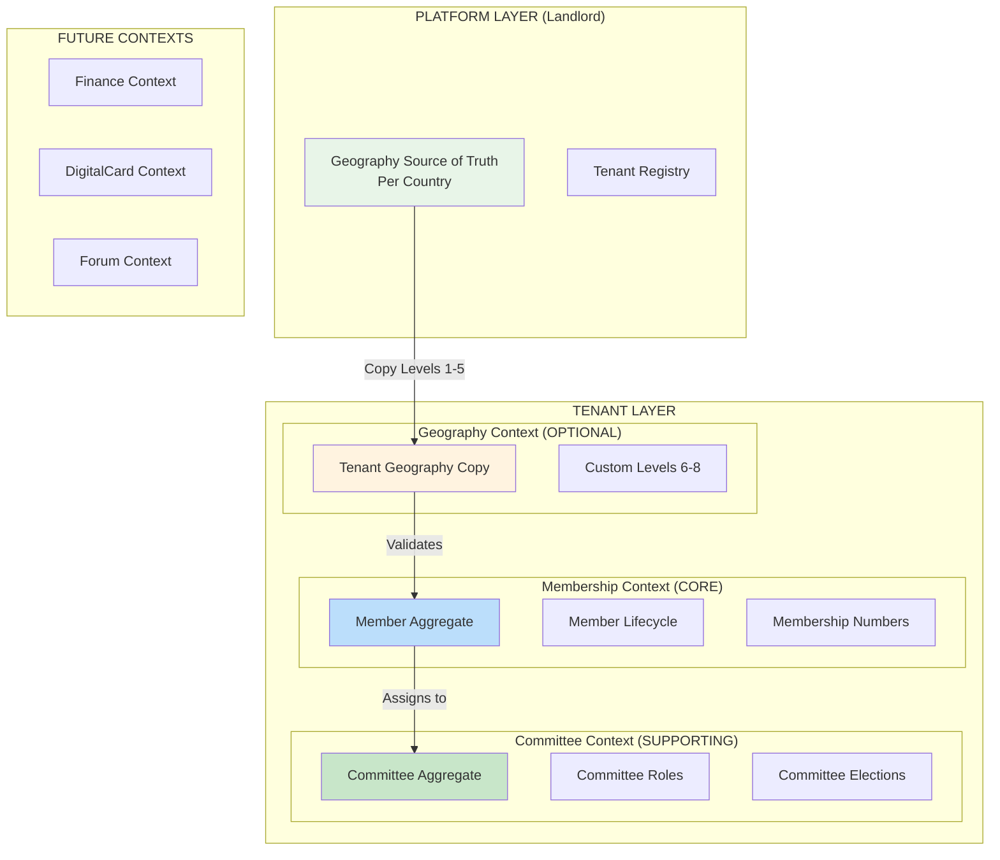

# 🏛️ **PROJECT BACKGROUND & CURRENT STATUS - Code Mentor Session**

## **🌍 PROJECT OVERVIEW: Political Party Digital Operating System**

### **1.0 VISION**
Building a **global political party management SaaS** that digitalizes party operations while respecting political hierarchies, data sovereignty, and organizational diversity.

### **1.1 CORE VALUE PROPOSITION**
- **For Local Parties**: Ward-level digital organization in Nepal
- **For Diaspora**: International chapter management  
- **For National Parties**: Central committee + geographic hierarchy
- **For All**: Membership lifecycle, committees, finance, discussions

### **1.2 MARKET SEGMENTS**
1. **Nepal**: 7 provinces → 77 districts → 753 municipalities → 6,743 wards
2. **India**: 28 states → 766 districts → 6,000+ tehsils
3. **Germany**: 16 states → 401 districts → 11,000 municipalities
4. **Diaspora**: Country → State/Province → City → Chapter

---

## **📊 ACTUAL DEVELOPMENT STATUS**

### **✅ COMPLETED:**
1. **Platform Context** (Landlord database)
   - Multi-tenant setup with Spatie Laravel Multitenancy
   - Tenant registration and database creation
   - Tenant slug system: `uml.publicdigit.com`

2. **Tenant Auth Context**
   - Tenant users can register/login
   - Basic authentication working
   - Tenant database isolation

3. **Membership Context (Partial)**
   - Basic Member model exists
   - Database migrations created
   - Folder structure with DDD layers

### **⚠️ CURRENT ISSUES:**
1. **Member Model has architectural flaws:**
   - `tenant_user_id` is optional (should be required 1:1)
   - Geography fields hardcoded (levels 1-8 in Member)
   - No proper value objects for business rules

2. **Missing proper bounded contexts:**
   - Geography logic mixed in Membership
   - No separate Committee context
   - No event-driven integration

3. **No internationalization strategy:**
   - Hardcoded for Nepal only
   - No country-specific geography sources

---

## **🏗️ ARCHITECTURE WE WANT TO DEVELOP**

### **CORRECTED ARCHITECTURE: THREE CLEAN CONTEXTS**



### **KEY ARCHITECTURAL PRINCIPLES:**

1. **DDD Bounded Contexts**: Clear separation of concerns
2. **Hexagonal Architecture**: Domain at center, adapters outside
3. **CQRS Pattern**: Separate write/read models for performance
4. **Event-Driven**: Contexts communicate via domain events
5. **TDD First**: Business rule tests before implementation

---

## **🔧 CORRECTION OF CURRENT MEMBER MODEL**

### **PROBLEMS IN CURRENT MODEL:**
```php
// CURRENT (WRONG):
class Member extends Model {
    // ❌ Geography knowledge in Membership
    protected $fillable = [
        'admin_unit_level1_id', // Province
        'admin_unit_level2_id', // District
        // ... up to level 8
        'geo_path', // LTREE
    ];
    
    // ❌ Optional user relationship
    protected $fillable = ['tenant_user_id']; // nullable
}
```

### **CORRECTED MODEL:**
```php
// CORRECTED:
class Member extends AggregateRoot {
    // ✅ REQUIRED: User account (1:1)
    private TenantUserId $tenantUserId;
    
    // ✅ OPTIONAL: Geography reference (not structure)
    private ?GeographyReference $geographyReference = null;
    
    // ✅ Core identity
    private PersonalInfo $personalInfo;
    private MembershipNumber $membershipNumber;
    private MemberStatus $status;
    
    // ✅ Business methods
    public function register(PersonalInfo $info): void;
    public function approve(UserId $approverId): void;
    public function activate(): void;
}
```

---

## **🌍 INTERNATIONALIZATION STRATEGY**

### **Single Source of Truth Architecture:**

```
Landlord Database (Platform)
├── country_geographies
│   ├── NP: [country, province, district, municipality, ward]
│   ├── IN: [country, state, district, tehsil, village]
│   ├── DE: [country, state, district, municipality]
│   └── US: [country, state, county, city]
│
└── tenant_geography_sources
    ├── UML (NP): Copy of NP levels 1-5 + custom 6-8
    ├── Congress (NP): Copy of NP levels 1-5 + different custom 6-8
    ├── BJP (IN): Copy of IN levels 1-5 + custom
    └── CDU (DE): Copy of DE levels 1-5 + custom
```

### **Sync Mechanism:**
```php
class GeographySyncService {
    public function syncToTenant(Tenant $tenant, string $countryCode): void {
        // 1. Copy government levels 1-5 from platform
        $govGeo = $this->platformGeography->getCountryHierarchy($countryCode, 1, 5);
        
        // 2. Create in tenant with ID mapping
        foreach ($govGeo as $node) {
            TenantGeography::create([
                'platform_node_id' => $node->id,
                'level' => $node->level,
                'code' => $node->code,
                'name' => $node->name,
                'path' => $node->path,
                'is_custom' => false,
            ]);
        }
        
        // 3. Tenant can add custom levels 6-8
        // These stay in tenant DB only
    }
}
```

### **Country-Specific Implementations:**
```php
interface CountryGeographyProvider {
    public function getHierarchyLevels(): array;
    public function validateNode(array $node): bool;
    public function getNodePath(array $parents): string;
}

class NepalGeographyProvider implements CountryGeographyProvider {
    public function getHierarchyLevels(): array {
        return [
            1 => ['name' => 'Country', 'code' => 'NP'],
            2 => ['name' => 'Province', 'code' => 'P'],
            3 => ['name' => 'District', 'code' => 'D'],
            4 => ['name' => 'Municipality', 'code' => 'M'],
            5 => ['name' => 'Ward', 'code' => 'W'],
        ];
    }
}

class IndiaGeographyProvider implements CountryGeographyProvider {
    public function getHierarchyLevels(): array {
        return [
            1 => ['name' => 'Country', 'code' => 'IN'],
            2 => ['name' => 'State', 'code' => 'S'],
            3 => ['name' => 'District', 'code' => 'D'],
            4 => ['name' => 'Tehsil', 'code' => 'T'],
            5 => ['name' => 'Village', 'code' => 'V'],
        ];
    }
}
```

---

## **🚀 DEVELOPMENT METHODOLOGY**

### **TDD First Approach:**
```
RED → GREEN → REFACTOR Cycle:

1. RED: Write failing test for business rule
2. GREEN: Implement minimum code to pass test
3. REFACTOR: Improve code while keeping tests green
4. REPEAT: Next business rule
```

### **Folder Structure (DDD):**
```
app/Contexts/{ContextName}/
├── Domain/                    # Pure business logic
│   ├── Models/               # Entities & Aggregates
│   ├── ValueObjects/         # Immutable business concepts
│   ├── Events/               # Domain events
│   ├── Services/             # Domain services
│   ├── Repositories/         # Repository interfaces
│   └── Exceptions/           # Business exceptions
├── Application/              # Use cases
│   ├── Services/             # Application services
│   ├── DTOs/                 # Data transfer objects
│   ├── Commands/             # Command handlers
│   └── Queries/              # Query handlers (CQRS)
└── Infrastructure/           # Technical implementation
    ├── Database/             # Migrations, seeders
    ├── Repositories/         # Concrete repositories
    ├── External/             # External service adapters
    └── Http/                 # API controllers
```

---

## **🔗 CONTEXT INTEGRATION STRATEGY**

### **Event-Driven Communication:**
```php
// Membership Context publishes events
class Member extends AggregateRoot {
    public function approve(UserId $approverId): void {
        $this->status = MemberStatus::approved();
        $this->recordThat(new MemberApproved(
            $this->id,
            $approverId,
            $this->tenantId
        ));
    }
}

// Geography Context listens (optional)
class EnrichGeographyOnMemberApproval {
    public function handle(MemberApproved $event): void {
        if ($this->geographyService->isAvailable()) {
            $this->geographyService->enrichMember($event->memberId);
        }
    }
}

// Committee Context listens (optional)
class AssignToCommitteeOnMemberApproval {
    public function handle(MemberApproved $event): void {
        if ($this->committeeService->isAvailable()) {
            $this->committeeService->assignToDefaultCommittee($event->memberId);
        }
    }
}
```

### **Anti-Corruption Layers:**
```php
// Membership knows nothing about Geography structure
interface GeographyService {
    public function validateReference(string $reference): bool;
    public function getHierarchy(string $reference): ?array;
}

// Implementation uses Geography Context
class GeographyContextAdapter implements GeographyService {
    public function validateReference(string $reference): bool {
        // Calls Geography Context via API or direct if in same process
        return $this->geographyContext->validate($reference);
    }
}

// Null implementation when geography not purchased
class NullGeographyService implements GeographyService {
    public function validateReference(string $reference): bool {
        return true; // Always valid without geography module
    }
    
    public function getHierarchy(string $reference): ?array {
        return null; // No data without geography module
    }
}
```

---

## **💡 MULTI-TENANCY STRATEGY**

### **Spatie Laravel Multitenancy Configuration:**
```php
// config/multitenancy.php
'tenant_model' => \App\Models\Tenant::class,

'tenant_connection' => 'tenant',

'tenant_database' => [
    'template' => 'template_tenant_db',
    'suffix' => '_tenant',
],

'domains' => [
    'landlord' => env('LANDLORD_DOMAIN', 'publicdigit.com'),
    'tenant' => '{tenant}.publicdigit.com',
],

// Each tenant gets:
// 1. Separate database: tenant_uml, tenant_congress
// 2. Isolated data
// 3. Custom geography levels 6-8
// 4. Own committee structure
```

---

## **🎯 PRIORITY DEVELOPMENT ROADMAP**

### **Phase 1: Core Membership (Week 1-2)**
```bash
# 1. Fix Member model (1:1 with TenantUser)
# 2. Implement MemberStatus value object
# 3. Implement MembershipNumber generation
# 4. Build registration → approval → activation workflow
# 5. Create basic API endpoints
# 6. Write comprehensive tests
```

### **Phase 2: Geography Module (Week 3-4)**
```bash
# 1. Platform geography sources (NP, IN templates)
# 2. Tenant geography copy service
# 3. Custom levels 6-8 management
# 4. Geography validation service
# 5. Optional geography integration with Membership
```

### **Phase 3: Committee Module (Week 5-6)**
```bash
# 1. Committee aggregate with roles
# 2. Election workflows
# 3. Term management
# 4. Committee-geography alignment
# 5. Integration with Membership
```

### **Phase 4: Enhancement (Week 7-8)**
```bash
# 1. DigitalCard Context integration
# 2. Finance Context (dues, payments)
# 3. Forum Context (discussions)
# 4. Analytics and reporting
# 5. Performance optimization
```

---

## **📞 IMMEDIATE NEXT STEPS**

### **Today's Priority: Fix Member Model**
1. **Run migration** to make `tenant_user_id` required and unique
2. **Update Member model** with proper 1:1 relationship
3. **Create value objects** for MemberStatus and MembershipNumber
4. **Write tests** for business rules

### **Code to Write Now:**
```bash
# 1. Fix database schema
php artisan make:migration make_tenant_user_id_required_in_members_table

# 2. Create value objects
php artisan make:valueobject MemberStatus --context=Membership
php artisan make:valueobject MembershipNumber --context=Membership

# 3. Write failing tests
php artisan make:test MemberRegistrationTest --unit
php artisan make:test MemberApprovalWorkflowTest --feature
```

---

## **🔍 YOUR ROLE AS CODE MENTOR**

### **I will help you:**
1. **Architecture decisions** - Validate design choices
2. **Code reviews** - Ensure DDD principles followed
3. **TDD guidance** - Write meaningful tests first
4. **Problem solving** - Debug complex issues
5. **Best practices** - Laravel, PostgreSQL, performance

### **You should:**
1. **Write code** following TDD approach
2. **Ask questions** when stuck
3. **Share progress** with code snippets
4. **Challenge assumptions** if something seems wrong
5. **Focus on business value** not just technical perfection

---

**Ready to start? Let's begin with fixing the Member model and enforcing the 1:1 relationship with TenantUser.**

**What would you like to tackle first?**
1. Database migration to fix constraints
2. Member model refactoring
3. Value object implementation
4. Test writing for business rules
