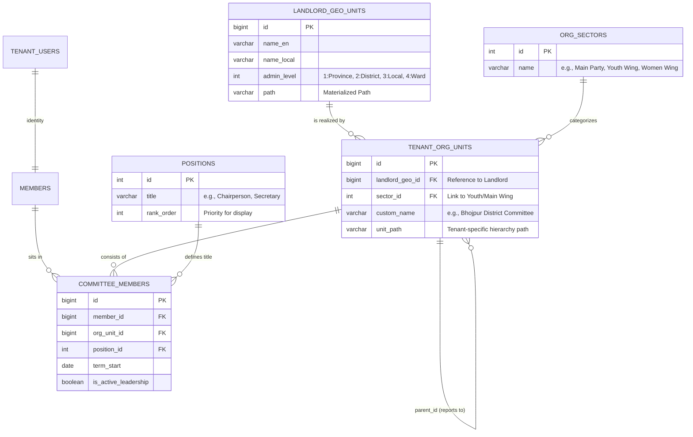
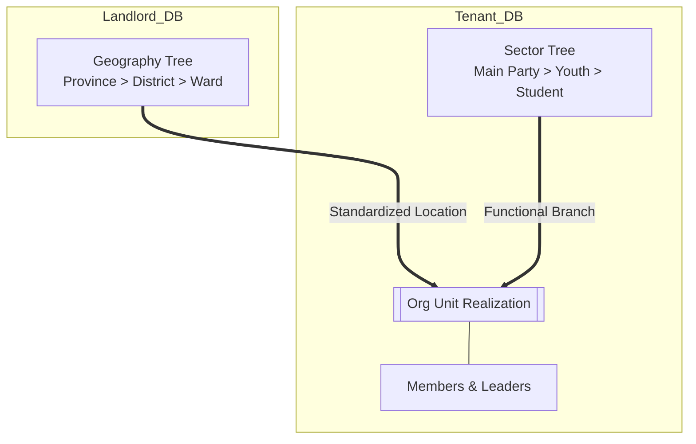

As a Senior Architect with 15 years of experience, I see your vision clearly. We are moving from a static multi-tenant database to a **dynamic, modular SaaS platform**.

The challenge here is the "Plug-and-Play" nature of the **Membership Context**. When a Landlord (System Admin) clicks "Install" for a specific tenant, we aren't just flipping a boolean; we are initializing a complex sub-system that must bridge **Global Geography** with **Tenant-Specific Organizational Reality**.

Here is the deep-dive brainstorming and architectural plan for this "On-Demand" Membership module.

---

### 1. The "Geography Realization" Problem

In the **Landlord DB**, geography is a static tree (Province  District  Palika). But in the **Tenant DB**, a "District" isn't just a dot on a map; it is an **Administrative Entity** with a President, a Budget, and an Office.

#### Proposed Solution: The "Shadow Hierarchy"

When the module is installed, the system should generate a "Shadow Tree" in the Tenant DB that maps directly to the Landlord’s IDs but allows tenant-specific "Realization."

**Table: `membership_org_units` (Tenant DB)**
| Column | Purpose |
| :--- | :--- |
| `id` | Local PK. |
| `landlord_geo_id` | Foreign Key to Landlord's `geo_units` (Province/District/Ward). |
| `custom_name` | e.g., "Koshi Province Coordination Committee" (The realized name). |
| `unit_type` | `PROVINCE`, `DISTRICT`, etc. |
| `status` | `ACTIVE`, `DORMANT` (A party might not have a committee in every district). |
| `office_metadata` | JSON: `{ "address": "...", "phone": "..." }`. |

---

### 2. Permissions & Roles: The "Template & Override" Model

Since this is a multi-tenant system, we cannot hardcode roles. A "Ward Secretary" for Party A might have "Approval Rights," but for Party B, they might only have "View Rights."

#### Architectural Fine-tuning:

1. **Global Role Templates (Landlord DB):** Store standard roles like `ADMIN`, `MODERATOR`, `MEMBER`.
2. **Tenant Role Definitions (Tenant DB):** When the module is installed, copy these templates into the Tenant's `roles` table. The Tenant Admin can then fine-tune permissions.

**Table: `tenant_roles` & `tenant_permissions` (Tenant DB)**

* `roles`: `id`, `name`, `is_system_default`.
* `permissions`: `id`, `action` (e.g., `member.approve`), `resource` (e.g., `membership_applications`).
* `role_permissions`: Mapping table.

---

### 3. Dynamic Module Installation Logic

How does the "Install" button work technically? As a senior developer, I recommend an **Idempotent Migration Strategy**.

**The Workflow:**

1. **Module Registry (Landlord DB):** Defines the module (e.g., `Membership_v1.0`).
2. **Activation Trigger:** Admin clicks "Install"  Backend identifies the Tenant DB.
3. **Schema Sync:** A worker (using a tool like **Liquibase** or **Flyway**) runs the `membership_context_schema.sql` against that specific Tenant DB.
4. **Initial Seeding:** The worker populates the `membership_org_units` by "cloning" the relevant geography from the Landlord DB into the Tenant DB's shadow hierarchy.

---

### 4. Brainstorming: The "Membership Realization" Tables

Beyond basic users, the **Membership Context** needs specialized tables to handle the "Political Reality":

* **`membership_tiers`**: Defines levels (e.g., `General Member`, `Active Cadre`, `Central Leader`).
* **`verification_queue`**: A workflow table for the e-KYC process.
* **`geographic_assignments`**: Maps which Admin (User) is responsible for which `membership_org_unit` (e.g., "Ram is the Admin for Morang District").

---

### 5. Critical Architect Thoughts

* **The "Cross-DB" Foreign Key:** Since `landlord_geo_id` is in the Tenant DB but references the Landlord DB, we must use **Application-Layer Validation**. You can't rely on the database to enforce this link.
* **Performance:** For the "Exact Name of Org Units," use a **Cache Layer**. Since these names change rarely, storing them in Redis (Key: `tenant:{id}:geo:{id}:name`) will make your UI feel instant.

### Next Step

We have mapped the **On-Demand Installation** and the **Geography Realization**.
As a Senior Architect with 15 years of experience, I see your vision clearly. We are moving from a static multi-tenant database to a **dynamic, modular SaaS platform**.

The challenge here is the "Plug-and-Play" nature of the **Membership Context**. When a Landlord (System Admin) clicks "Install" for a specific tenant, we aren't just flipping a boolean; we are initializing a complex sub-system that must bridge **Global Geography** with **Tenant-Specific Organizational Reality**.

Here is the deep-dive brainstorming and architectural plan for this "On-Demand" Membership module.

---

### 1. The "Geography Realization" Problem

In the **Landlord DB**, geography is a static tree (Province  District  Palika). But in the **Tenant DB**, a "District" isn't just a dot on a map; it is an **Administrative Entity** with a President, a Budget, and an Office.

#### Proposed Solution: The "Shadow Hierarchy"

When the module is installed, the system should generate a "Shadow Tree" in the Tenant DB that maps directly to the Landlord’s IDs but allows tenant-specific "Realization."

**Table: `membership_org_units` (Tenant DB)**
| Column | Purpose |
| :--- | :--- |
| `id` | Local PK. |
| `landlord_geo_id` | Foreign Key to Landlord's `geo_units` (Province/District/Ward). |
| `custom_name` | e.g., "Koshi Province Coordination Committee" (The realized name). |
| `unit_type` | `PROVINCE`, `DISTRICT`, etc. |
| `status` | `ACTIVE`, `DORMANT` (A party might not have a committee in every district). |
| `office_metadata` | JSON: `{ "address": "...", "phone": "..." }`. |

---

### 2. Permissions & Roles: The "Template & Override" Model

Since this is a multi-tenant system, we cannot hardcode roles. A "Ward Secretary" for Party A might have "Approval Rights," but for Party B, they might only have "View Rights."

#### Architectural Fine-tuning:

1. **Global Role Templates (Landlord DB):** Store standard roles like `ADMIN`, `MODERATOR`, `MEMBER`.
2. **Tenant Role Definitions (Tenant DB):** When the module is installed, copy these templates into the Tenant's `roles` table. The Tenant Admin can then fine-tune permissions.

**Table: `tenant_roles` & `tenant_permissions` (Tenant DB)**

* `roles`: `id`, `name`, `is_system_default`.
* `permissions`: `id`, `action` (e.g., `member.approve`), `resource` (e.g., `membership_applications`).
* `role_permissions`: Mapping table.

---

### 3. Dynamic Module Installation Logic

How does the "Install" button work technically? As a senior developer, I recommend an **Idempotent Migration Strategy**.

**The Workflow:**

1. **Module Registry (Landlord DB):** Defines the module (e.g., `Membership_v1.0`).
2. **Activation Trigger:** Admin clicks "Install"  Backend identifies the Tenant DB.
3. **Schema Sync:** A worker (using a tool like **Liquibase** or **Flyway**) runs the `membership_context_schema.sql` against that specific Tenant DB.
4. **Initial Seeding:** The worker populates the `membership_org_units` by "cloning" the relevant geography from the Landlord DB into the Tenant DB's shadow hierarchy.

---

### 4. Brainstorming: The "Membership Realization" Tables

Beyond basic users, the **Membership Context** needs specialized tables to handle the "Political Reality":

* **`membership_tiers`**: Defines levels (e.g., `General Member`, `Active Cadre`, `Central Leader`).
* **`verification_queue`**: A workflow table for the e-KYC process.
* **`geographic_assignments`**: Maps which Admin (User) is responsible for which `membership_org_unit` (e.g., "Ram is the Admin for Morang District").

---

### 5. Critical Architect Thoughts

* **The "Cross-DB" Foreign Key:** Since `landlord_geo_id` is in the Tenant DB but references the Landlord DB, we must use **Application-Layer Validation**. You can't rely on the database to enforce this link.
* **Performance:** For the "Exact Name of Org Units," use a **Cache Layer**. Since these names change rarely, storing them in Redis (Key: `tenant:{id}:geo:{id}:name`) will make your UI feel instant.

### Next Step

We have mapped the **On-Demand Installation** and the **Geography Realization**.

I am still in the construction phase 
what I have in tenant db: 
tenant_users 
then on demand module 
members  (1-1 relationsip with tenant_users) 
- I need tables to describe the org units like bhojpur district , kathmandu district  or municipility  as geography is the abstract layer . 
please think about it and write me the name of the tables  now in case of nepal .
As a Senior Architect, I understand your challenge. You have the **Abstract Geography** (the map) in the Landlord DB, and now you need the **Concrete Organizational Reality** (the hierarchy of power) in the Tenant DB.

In Nepal’s political context, a "District" is not just a location; it is a **Committee** with a mandate, a hierarchy, and specialized "Wings" (Youth Wing, Women's Wing).

Here are the specific tables you need in the **Tenant DB** to realize these organizational units.

---

### 1. The Core Organizational Tables

#### `org_units` (The Realization Table)

This is the most important table. It maps your abstract `geo_administrative_units` to actual party entities.

* **Purpose**: To define the "Bhojpur District Committee" or the "Kathmandu Ward 32 Unit."
* **Key Columns**:
* `id`: Primary Key.
* `geo_unit_id`: Foreign Key to Landlord `geo_administrative_units.id`.
* `parent_id`: Self-reference (e.g., a Ward Committee reports to a Municipality Committee).
* `custom_name`: The official party name for this unit (e.g., *"C.P.N. (UML) Kathmandu District Committee"*).
* `is_active`: Boolean.


#### `org_unit_types`

* **Purpose**: To categorize the units. Not every unit is a geographic committee; some are "Functional."
* **Examples**: `Geographic Committee`, `Department`, `Special Task Force`, `Liaison Office`.

#### `org_sectors` (The "Wing" System)

In Nepal, parties operate through "Sectors" or "Sister Organizations."

* **Purpose**: To allow one geographic area (e.g., Kathmandu) to have multiple organizational contexts.
* **Examples**: `Main Party`, `Youth Association`, `Student Union`, `Women's Federation`.
* **Relationship**: An `org_unit` can belong to an `org_sector`.

---

### 2. The Leadership & Roles Tables

#### `positions`

* **Purpose**: Standardizes titles within an `org_unit`.
* **Examples**: `Chairperson`, `Secretary`, `Treasurer`, `Member`, `Invitee Member`.

#### `committee_members`

* **Purpose**: This is the "Mapping" table that puts a **Member** into a **Position** within an **Org Unit**.
* **Columns**:
* `member_id`: FK to `members`.
* `org_unit_id`: FK to `org_units`.
* `position_id`: FK to `positions`.
* `term_start_date`, `term_end_date`.


---

### 3. Permission & Access Control (Tenancy Level)

#### `tenant_roles`

* **Purpose**: Defines what an admin can do (e.g., "District Admin," "Ward Approver").

#### `tenant_role_scopes`

* **Purpose**: **Critical for Nepal.** This limits a role to a specific geography.
* **Logic**: If a user is a "District Admin," their scope is `District_ID: 23`. They can only see `members` whose `org_unit_id` is a descendant of District 23.

---

### Summary Table List for Your Tenant DB

| Table Name | Description | Relationship |
| --- | --- | --- |
| **`org_units`** | The actual committees (District/Ward/etc). | Links to Landlord `geo_units`. |
| **`org_sectors`** | Segregation for Youth, Students, etc. | Groups `org_units`. |
| **`positions`** | List of available titles (President, Sec). | Used in committees. |
| **`committee_members`** | Assigns a Person to a Position in a Unit. | Junction: `Member` + `OrgUnit`. |
| **`org_unit_metadata`** | Office address, phone, bank info per unit. | 1:1 with `org_units`. |

---

### Senior Architect's "Think" Moment:

When a member registers in your system, they shouldn't just choose "Bhojpur." They should be **assigned** to the `org_unit` that represents "Bhojpur District Main Party."

By separating the **Geography** (Landlord) from the **Org Unit** (Tenant), you allow the party to have **two different committees in the same district** (e.g., the Main Party Committee and the Youth Wing Committee) without breaking the geographic data.

**Would you like me to write the SQL schema for the `org_units` table, including the Materialized Path logic so you can easily query all members "under" a specific District?**

can you make a mermaid diagram to understand the relationsip ?
To visualize how your **Abstract Geography** (Landlord) bridges into the **Organizational Reality** (Tenant), we need to look at this through the lens of a **Bridge Pattern**.

The following Mermaid diagram illustrates how a specific Political Party (Tenant) "realizes" the abstract map into a functioning hierarchy of committees and leadership.



---

### Architectural Breakdown of the Relationship

1. **The "Bridge":** The `landlord_geo_id` in the `TENANT_ORG_UNITS` table is the only "string" connecting the two databases. This allows the party to say, *"This committee (ID: 501) owns the geography of Bhojpur (ID: 23)."*
2. **Sector Isolation (`ORG_SECTORS`):** In Nepal, you might have the "Main Party" and the "Youth Wing" both operating in the same Ward. By having `ORG_SECTORS`, you can have two different `TENANT_ORG_UNITS` (one for Youth, one for Main) both pointing to the same `LANDLORD_GEO_UNIT` (Ward 4).
3. **Member vs. Leader:**
* A **Member** is just a person registered in a location.
* A **Committee Member** is a member who has been assigned a `POSITION` (like Secretary) in a specific `ORG_UNIT`.


4. **Tenant-Specific Pathing:** Note the `unit_path` in the tenant table. While the Landlord has a geographic path, the Tenant needs an **Organizational Path**. For example, a "Special Task Force" might report directly to the Province, skipping the District. This structure allows that flexibility.

### Implementation Strategy

When you "Install" the Membership module:

1. **Seed `POSITIONS`:** Populate with standard Nepali political titles (Sanyojak, Sachiv, etc.).
2. **Seed `ORG_SECTORS`:** Default to "Main Party."
3. **Initialize `TENANT_ORG_UNITS`:** Create the top-level Province units automatically using your `GeographyService`.

that means , we need to extend  gegraphy contexts not only into org_units but also to org_unit_sector right ? 
Exactly. As a Senior Architect, I want to clarify why this distinction is critical for the "Nepali Political Reality."

If you only link geography to the `org_units`, you create a **flat bottleneck**. In reality, a political party is a **Multi-Dimensional Matrix**. Linking the Geography Context to both the Unit and the Sector (Sister Organizations) allows you to support "Parallel Hierarchies."

---

### 1. The "Matrix" Architecture

Think of it this way:

* **Geography (Landlord)** = The Soil (Bhojpur District).
* **Sector (Tenant)** = The Crop Type (Main Party vs. Youth Wing vs. Student Union).
* **Org Unit (Tenant)** = The specific "Plant" (Bhojpur Youth Committee).

By extending the context to both, you allow the system to answer two different but equally important questions:

1. **Vertical Question:** "Who is the leader of the Youth Wing in Province 1?"
2. **Horizontal Question:** "Show me *all* party entities (Main, Youth, Women) operating inside Kathmandu Ward 32."

---

### 2. How the Tables Work Together

#### A. `org_sectors` (The Vertical Pillars)

This table defines the "Silos." It doesn't care about geography yet.

* **Attributes:** `name` (Main Party, Youth, Labor, etc.), `short_code`, `color_theme`.
* **Hierarchy:** Some sectors have their own sub-sectors (e.g., "Main Party" -> "Central Department").

#### B. `org_units` (The Intersection)

This is where the Geography Context and Sector Context **collide**.

| Org Unit Name | Sector (Vertical) | Geo Unit (Horizontal) |
| --- | --- | --- |
| **Morang District Committee** | Main Party | Morang (District ID: 12) |
| **Morang Youth Association** | Youth Wing | Morang (District ID: 12) |
| **Ward 4 Students Cell** | Student Union | Ward 4 (Ward ID: 884) |

---

### 3. Why "Extending" to Sectors is a Power Move

In your construct, if the Landlord Admin installs the "Membership Context," the Tenant can now define **custom behavior per sector**:

1. **Unique Positions:** The "Youth Wing" might have a "General Secretary," while the "Main Party" has a "General Secretary" but also a "Politburo Member."
2. **Unique Membership Rules:** You might allow 16-year-olds in the "Student Union" sector, but require 18+ for the "Main Party" sector.
3. **Scoped Permissions:** You can give an admin the role of "Youth Wing Admin for Bagmati Province." Because the geography is abstracted, the system knows exactly which `org_units` fall under that admin's power.

---

### 4. Updated Mermaid Logic (The Intersecting Tree)

Notice how the `TENANT_ORG_UNIT` acts as the junction point for two different parents.



---

### 5. Final Senior Architect Advice

When you build the `org_units` table, ensure the **Composite Unique Key** is `(landlord_geo_id, sector_id)`.

This prevents the database from accidentally creating two "Main Party" committees in the same "Ward," while explicitly allowing a "Main Party Ward Committee" and a "Youth Wing Ward Committee" to exist side-by-side.

**Would you like me to write the "Realization Logic" code (likely a Service Class) that takes a Geography ID and a Sector ID and returns the unique Org Unit, or creates it if it doesn't exist?**
what are the design patterns and architecture and algorthims I can use for this purpose ? 
To implement a high-performance, multi-tenant organizational system for the Nepal context, you need a combination of **Structural Design Patterns**, **Hierarchical Data Algorithms**, and **Modern Access Control Architectures**.

As you are in the construction phase, adopting these early will prevent massive refactoring later.

---

### 1. Structural Design Patterns

#### **The Bridge Pattern (Mapping Geography to Org)**

Since geography is an "abstract layer" in your Landlord DB and the organizational units are in the Tenant DB, the **Bridge Pattern** decouples the physical location from the political realization.

* **Why**: It allows you to change the geographic map (e.g., adding a new district) without breaking the party’s organizational logic.
* **Implementation**: Your `org_units` table acts as the "Concrete Implementor" that bridges to the `landlord_geo_units`.

#### **The Composite Pattern (The Recursive Hierarchy)**

Nepal’s political committees are recursive (a District Committee is made of Local Committees, which are made of Ward Committees).

* **How**: Use a **Self-Referencing Relationship** where an `org_unit` has a `parent_id` pointing to another `org_unit`.
* **Benefit**: Your code can treat a single "Ward Unit" and an entire "Province Committee" using the same interface (e.g., `unit->getMembers()`).

---

### 2. The Hierarchy Algorithm: Materialized Path

To handle the "Geography Context" efficiently, you shouldn't just use `parent_id`. You need a way to find all members in a district instantly without recursive SQL joins.

#### **Materialized Path (The "Ancestry" String)**

Store the path as a string (e.g., `1.23.402`) where 1 is the Province, 23 is the District, and 402 is the Municipality.

* **Algorithm**: Use the **L-Tree** pattern (native in PostgreSQL) or a simple string-prefix search.
* **Example Query**: `SELECT * FROM org_units WHERE path LIKE '1.23.%'` instantly gives you everyone in Bhojpur District and all its sub-units.

---

### 3. Architecture: Attribute-Based Access Control (ABAC)

Traditional Role-Based Access Control (RBAC) (e.g., "Admin," "Editor") fails in political systems because a "District Admin" is an "Admin" **only** for their specific district.

#### **ABAC (The "Scoped" Security)**

Instead of just checking if a user is an `Admin`, you check a policy:

> *ALLOW user to EDIT member IF user.role == 'Admin' AND user.scoped_geo_path STARTS WITH member.geo_path.*

* **Implementation**: Store a `scope_path` on your `tenant_users`. If a user is assigned to Kathmandu, their `scope_path` is `1.24` (Bagmati.Kathmandu). The system automatically filters every query to ensure they never see data from Bhojpur.

---

### 4. Summary of Tech Stack Choices

| Component | Recommended Tool/Approach | Reason |
| --- | --- | --- |
| **Hierarchy** | **Materialized Path** | Fastest reads for "Show me all members in this District." |
| **Access Control** | **ABAC** | Allows "Geography-Aware" permissions. |
| **Logic Layer** | **Domain-Driven Design (DDD)** | Keep "Geography" and "Organization" in separate bounded contexts. |
| **Database** | **PostgreSQL** | Built-in `ltree` type makes hierarchical queries 10x faster. |

---

### Senior Architect's Pro-Tip: The "Registry" Pattern

Create a **GeographyRegistry** service. When a tenant installs the "On-Demand Module," this service should "realize" the geography by creating the top-level `org_units` automatically based on the Landlord's data. This ensures the tenant doesn't have to manually create the structure of Nepal.

**Would you like me to provide a sample SQL snippet for the Materialized Path implementation or a PHP/Python policy for the Scoped Access Control?**
To implement the hierarchy and access control for the Nepal context in PHP, we will use a **Trait-based architecture**. This allows you to inject organizational and geographic intelligence into any Eloquent model (if using Laravel) or standard PHP Class.

### 1. The Materialized Path Implementation

We will use a dot-separated string (e.g., `Province.District.Municipality`) for the `path` column. This allows us to use a single `LIKE` query to find all sub-units, which is essential for performance when dealing with thousands of Ward-level members.

```php
// Tenant DB: OrgUnit Model logic
class OrgUnit extends Model {
    /**
     * Scope to find all children of a specific unit.
     * If $path is '1.24' (Bagmati.Kathmandu), it finds all municipalities/wards within.
     */
    public function scopeInHierarchy($query, $path) {
        return $query->where('unit_path', 'like', $path . '.%')
                     ->orWhere('unit_path', '=', $path);
    }

    /**
     * Logic to generate the path during creation
     */
    public static function boot() {
        parent::boot();
        static::creating(function ($model) {
            if ($model->parent_id) {
                $parent = self::find($model->parent_id);
                $model->unit_path = $parent->unit_path . '.' . $model->id;
            } else {
                $model->unit_path = (string)$model->id;
            }
        });
    }
}

```

### 2. ABAC: Scoped Access Control Logic

In a political system, a "District Secretary" should only be able to view members within their district. We implement this using an **Attribute-Based Access Control (ABAC)** policy.

```php
class MemberPolicy {
    /**
     * Determine if the user can view the member.
     * logic: User's scope path must be a prefix of the Member's unit path.
     */
    public function view(User $user, Member $member) {
        // Get the user's assigned organizational scope (e.g., '1.24')
        $userScope = $user->org_scope_path; 

        // Get the member's organizational path (e.g., '1.24.5.12')
        $memberPath = $member->orgUnit->unit_path;

        // Check if member is "under" the user's jurisdiction
        return str_starts_with($memberPath, $userScope);
    }
}

```

---

### 3. Architecture Pattern: The "Realizer" Service

Since your Geography is in the **Landlord DB** and Org Units are in the **Tenant DB**, use a Service Pattern to bridge them. This ensures you don't have "orphan" committees that don't point to a real place in Nepal.

| Pattern | Role in your System |
| --- | --- |
| **Service Layer** | `OrgUnitService` creates a "District Committee" by validating the `landlord_geo_id`. |
| **Repository Pattern** | Handles the complex SQL for "fetching all Youth Wing members in Bagmati." |
| **Registry Pattern** | Maintains a list of all "Sectors" (Youth, Women, Main) available to the Tenant. |

---

### 4. Database Optimization

To make the `unit_path` extremely fast in PHP/MySQL, you must add a **B-Tree Index** to the path column. If you are using PostgreSQL, you should use the `ltree` data type, which allows for advanced hierarchical queries like:
`SELECT * FROM org_units WHERE unit_path <@ '1.24';` (The `<@` operator means "is a descendant of").

### Next Steps for You:

1. **Migrations**: Create the `org_units` table with a `path` (VARCHAR) and `landlord_geo_id` (BIGINT).
2. **Indexing**: Ensure the `path` column is indexed for high-speed prefix searches.
3. **Middleware**: Create a PHP Middleware that detects the User's `scope_path` and automatically appends a `WHERE path LIKE ...` to every member-related query.

Would you like me to generate the **Laravel Migration** and **Base Repository** code that implements this automatic path filtering for you?

ok back to organisational structure and to represent it at abstract level : 
lets think from start 
what we have : 
-we have first tenant users 
- a subset of tenant users are members 
- We have abstract level of organisation units as Geography context : 
Now we want to create Membership Contexts 
- we should be able to speearte the members  by  organisational units . here committee dont play role  . just seperation of members by org units . In each units some have roles or permissions to manage the membership .  this one wee need to define at first phase 
- In second phase ,We need to represent committees and the posts and titles 
- for that we need to represent the post and titles in a abstract way  as different committee has different posts and title . 
- should I sepearte the second phase work from first phase and keep it in Committee Contxts or in the same contexts as membership 
As a senior architect, this is the right moment to make a "Separation of Concerns" decision that will determine the scalability of your platform.

### The Decision: Context Separation

**Yes, you should strictly separate them.**

* **Phase 1: Membership Context** (The "Who" and "Where")
* **Phase 2: Committee/Leadership Context** (The "Structure" and "Power")

By separating these, you avoid a "God Module" that becomes too complex to maintain. The **Membership Context** handles the massive pool of thousands of people, while the **Committee Context** handles the small, elite groups that govern them.

---

### Phase 1: Membership Context (The Foundation)

In this phase, you are not worried about who is the President. You are only worried about **Census and Jurisdiction**.

#### 1. Realizing Geography into Org Units

You need a table in the Tenant DB that "activates" a piece of the Landlord's geography.

**Table: `org_units**`

* `id` (PK)
* `landlord_geo_id` (References your Geography Context)
* `custom_name` (e.g., "Kathmandu District Unit")
* `path` (Materialized path for fast filtering: `1.24.5`)

#### 2. Member Distribution

A member belongs to one (or more) `org_units`.
**Table: `members**`

* `id` (PK)
* `tenant_user_id` (FK to your base users)
* `primary_org_unit_id` (FK to `org_units`)

#### 3. Administrative Scoping (The "Manage" Permission)

This is the "ABAC" (Attribute-Based Access Control) we discussed. You don't need a committee to grant permission. You simply assign a **Management Scope** to a `tenant_user`.

**Table: `membership_permissions**`

* `tenant_user_id`
* `org_unit_id` (The "Root" of their power)
* `can_verify_members` (Boolean)
* `can_edit_profiles` (Boolean)

> **Logic:** If a user is given permission for `org_unit` ID: 24 (Kathmandu), the system allows them to manage any member whose `unit_path` starts with the path of unit 24.

---

### Phase 2: Committee & Titles (The Abstract Power)

Once you have the members categorized by location, you overlay the **Committees**.

#### 1. Abstracting Posts and Titles

Since a "Youth Wing District Committee" has different titles than a "Main Party Central Committee," we use a **Template Pattern**.

**Table: `post_templates**`

* `id`
* `name` (e.g., "Standard District Committee Structure")
* `json_structure` (Definitions of required posts like President, Sec, 5 Members)

**Table: `posts` (The Abstract Definitions)**

* `id`
* `title_en` / `title_local`
* `weight` (For hierarchy: President = 1, Member = 10)

#### 2. The Committee Realization

**Table: `committees**`

* `id`
* `org_unit_id` (Links back to your Phase 1 unit)
* `committee_type` (e.g., "Executive," "Advisory," "Youth Wing")

**Table: `committee_assignments` (The Bridge)**

* `committee_id`
* `member_id` (From Membership Context)
* `post_id` (From your Abstract Posts)

---

### Summary of Architecture Patterns

| Feature | Pattern | Reason |
| --- | --- | --- |
| **Membership Separation** | **Materialized Path** | Best for high-performance "Census" queries (count members in a district). |
| **Permissions** | **Scoped ABAC** | Allows someone to be an admin of a Ward without affecting the whole Tenant. |
| **Post/Titles** | **Template Method** | Handles the "different posts for different committees" problem without hardcoding. |
| **Context Design** | **Bounded Contexts (DDD)** | Keeps the Membership logic clean from the complex "Elections/Voting/Terms" logic of Committees. |

### Recommendation for your Workflow

**Start only with the Membership Context.** 1.  Map your `org_units` to the `landlord_geo_units`.
2.  Assign `tenant_users` to `org_units`.
3.  Implement the **Path-based filtering** in PHP so that a user in "District A" can only see members in "District A."

**Would you like me to write the PHP logic for the "Jurisdiction Check" that ensures an admin only sees members within their allowed geographical path?**
Implementing a jurisdiction check in PHP (specifically Laravel) using a **Materialized Path** is the most efficient way to handle Nepal's multi-layered geography. It ensures that an admin from "Kathmandu District" can manage "Ward 32," but cannot even see data from "Bhojpur."

### 1. The Jurisdiction Logic (Policy Layer)

In Laravel, the cleanest way to enforce this is through a **Policy**. This keeps your controller thin and your security logic centralized.

```php
namespace App\Policies;

use App\Models\TenantUser;
use App\Models\Member;

class MemberPolicy
{
    /**
     * Determine if the user can manage a specific member.
     * * Logic: The Admin's geographic path must be a prefix of 
     * the Member's geographic path.
     */
    public function manage(TenantUser $user, Member $member): bool
    {
        // Example: Admin path = '1.24' (Bagmati.Kathmandu)
        // Example: Member path = '1.24.5.32' (Bagmati.Kathmandu.Muni.Ward32)
        $adminPath = $user->org_unit_path;
        $memberPath = $member->org_unit_path;

        // Use str_starts_with to check if member is 'under' the admin
        return str_starts_with($memberPath, $adminPath);
    }
}

```

### 2. Global Query Scoping (The "Invisible" Security)

To prevent a District Admin from even *listing* members from another district, use a **Global Scope**. This ensures every `Member::all()` call is automatically filtered by the user's jurisdiction.

```php
namespace App\Models\Scopes;

use Illuminate\Database\Eloquent\Builder;
use Illuminate\Database\Eloquent\Model;
use Illuminate\Database\Eloquent\Scope;
use Illuminate\Support\Facades\Auth;

class JurisdictionScope implements Scope
{
    public function apply(Builder $builder, Model $model)
    {
        if (Auth::check()) {
            $user = Auth::user();
            // Automatically limit results to the user's allowed path
            // SQL Result: WHERE org_unit_path LIKE '1.24%'
            $builder->where('org_unit_path', 'like', $user->org_unit_path . '%');
        }
    }
}

```

---

### Summary of First Phase Implementation

| Component | Responsibility | Technical Pattern |
| --- | --- | --- |
| **Org Unit** | Represents a specific level (Ward/District). | **Materialized Path** (`1.24.5`) |
| **Policy** | Authorizes single-record actions (Edit/Delete). | **ABAC** (Attribute-Based Access) |
| **Global Scope** | Automatically filters all lists/index views. | **Data Isolation Pattern** |
| **Middleware** | Identifies the tenant and sets the user's scope. | **Tenant Identification** |

---

### Phase 2 Preview: Why this separation helps

Because you have separated **Membership** (Geography) from **Committees** (Power) in this first phase, when you move to Phase 2:

1. You can create a "Youth Wing Committee" for the **same path** (`1.24`) without duplicating member data.
2. You can define a "Secretary" post that only exists at the "Province" level by simply checking the `depth` of the path (e.g., path has only 1 dot).

**Would you like me to write the migration and model logic for the `org_units` table that automatically calculates these paths when you create a new Ward or District?**

Yes, this architecture is **highly abstractable** and perfectly suited for global political systems like those in Germany or the USA.

The core reason it works is that while the **Administrative Units** (the names of the places) change, the **Hierarchical Logic** remains the same. By using the "Geography Context" as an abstract layer, you are building a **Template-Based System** rather than a "Nepal-only" system.

---

### How it maps to Germany and the USA

#### 1. The Germany Mapping (Multi-Party, Federal)

German parties (like the CDU or SPD) have a very formal, strict hierarchy called the *Gliederungen*.

* **Geography Context (Landlord)**:
* `Level 1`: Bundesebene (Federal)
* `Level 2`: Landesverband (State, e.g., Bavaria)
* `Level 3`: Bezirksverband (District)
* `Level 4`: Kreisverband (County/City)
* `Level 5`: Ortsverein (Local/Neighborhood)


* **Org Unit (Tenant)**: Your `org_units` simply points to the German Landlord Geo IDs.
* **Sectors**: Germany uses many "Sister Organizations" (*Arbeitsgemeinschaften*), like the *Jusos* (Youth) or *Frauen Union* (Women). This fits your **Org Sectors** model perfectly.

#### 2. The USA Mapping (Two-Party, State-Centric)

American parties (Democrats/Republicans) are less "top-down" but still geographically bound.

* **Geography Context (Landlord)**:
* `Level 1`: National Committee
* `Level 2`: State Committee (e.g., California Democrats)
* `Level 3`: County Committee
* `Level 4`: Precinct/Ward


* **Abstract Posts**: In the USA, you have roles like "Precinct Captain" or "State Delegate." Your **Phase 2 (Committee Context)** handles this because the `posts` table is just a list of titles you define per tenant.

---

### Abstracting the Data Model for Global Use

To make this 100% universal, you only need to ensure your **Landlord DB** supports a "Schema" for each country.

#### Updated Landlord Table: `geo_administrative_levels`

| id | country_code | level_depth | level_name_en |
| --- | --- | --- | --- |
| 1 | NP | 1 | Province |
| 2 | DE | 1 | Bundesland |
| 3 | US | 1 | State |
| 4 | US | 3 | Precinct |

### Why this is a "Senior Architect" move:

By using the **Materialized Path** (`1.24.5`), your PHP code doesn't care if "24" represents a Nepali District, a German *Kreis*, or a US *County*. The code only cares that:

1. It is a node in a tree.
2. It has a path.
3. Users have a "Scope" on that path.

---

### Summary of Abstract Patterns Used

1. **Strategy Pattern**: Use different "Post Templates" for different countries.
2. **Bridge Pattern**: Decouple the *Physical Map* (Landlord) from the *Political Structure* (Tenant).
3. **Composite Pattern**: Treat a single Ward and a whole Nation as the same "Unit" object.

### Next Step for You:

Since you want this to be global, would you like me to show you how to structure the **Landlord Geography Seeder** so it can handle multiple countries' structures without changing your PHP code?
also name the algorithms that I can use here for fast search of members 
To ensure your member search is "lightning fast" even as you scale to millions of members across Nepal, Germany, or the USA, you need to move beyond simple SQL `SELECT` statements.

As a Senior Architect, I recommend a tiered approach using the following algorithms and indexing strategies.

### 1. The "Geography" Search: Materialized Path + Prefix B-Tree

Since you are using a materialized path (e.g., `1.24.5.32`), you need an algorithm that can find "all descendants" instantly.

* **Algorithm:** **B-Tree Indexing** with **Prefix Matching**.
* **How it works:** In your database (PostgreSQL/MySQL), you create a standard B-Tree index on the `path` column. Because B-Trees are sorted, the database uses a **Range Scan** algorithm.
* **Performance:** A search for `LIKE '1.24.%'` is , meaning it can find 10,000 members in a district out of 10 million total members in milliseconds.

### 2. The "Name" Search: Trigram Indexing & Fuzzy Matching

In Nepal, names like "Kathmandu" might be typed as "Katmandu." In Germany, "Müller" vs "Mueller." You need "Fuzzy Search."

* **Algorithm:** **N-Gram (Trigram) Algorithm**.
* **How it works:** It breaks strings into chunks of three characters (e.g., `Kathmandu` → `Kat, ath, thm, hma...`).
* **Implementation:** Use **PostgreSQL GIN (Generalized Inverted Index)**. It uses an **Inverted Index** algorithm (the same one behind Google Search) to map these chunks to member IDs.
* **Distance Algorithm:** Use **Levenshtein Distance** to calculate how many "edits" are needed to change the search term into a database result. Set a threshold (e.g., distance < 3) to allow for typos.

### 3. The "Global Filter" Search: Bitmaps (Roaring Bitmaps)

If you need to filter members by multiple attributes (e.g., "Members in Bhojpur" AND "Active Status" AND "Joined in 2024"), standard indexes can get slow.

* **Algorithm:** **Roaring Bitmaps**.
* **How it works:** It represents your entire member list as a series of 0s and 1s in compressed bitsets.
* **Why it's fast:** Computing the "Intersection" (the AND logic) between two filters becomes a simple bitwise operation at the CPU level. It is roughly **10x–100x faster** than complex SQL joins for large-scale filtering.

### 4. Search Architecture Summary

| Search Type | Recommended Algorithm | Tech Implementation |
| --- | --- | --- |
| **Location-based** | **B-Tree Range Scan** | `INDEX(path)` in SQL |
| **Typo Tolerance** | **Levenshtein / Trigram** | `pg_trgm` extension (Postgres) |
| **Phonetic (Sounds like)** | **Double Metaphone** | Standard PHP/Python libs |
| **Complex Filtering** | **Roaring Bitmaps** | Redis or Elasticsearch |

---

### Implementation Advice

1. **Don't build your own search engine yet.** Start by enabling the `pg_trgm` extension in PostgreSQL. It allows you to use `%` wildcards with incredible speed.
2. **Tiered Search:** Always execute the **Geography Filter** first (using the `path` index). This "prunes" the search space from millions to thousands before you run the more expensive "Fuzzy Name" algorithm.

**Would you like me to show you the PHP code to integrate `pg_trgm` fuzzy searching into your Laravel Member model?**
This separation is the key to building a **truly global platform**. By isolating the **Who/Where** (Membership) from the **How/Structure** (Committees), you create a flexible "Political Operating System."

### 1. The Jurisdiction Logic (PHP Implementation)

In this first phase, you need a way to verify if an admin has the right to see or edit a specific member based on their location. Using the **Materialized Path** (`1.24.5`), this check is a simple string comparison.

```php
/**
 * Jurisdiction Check Algorithm (ABAC Pattern)
 * Checks if the Admin's scope covers the Member's location.
 */
function hasJurisdiction(string $adminScopePath, string $memberOrgPath): bool {
    // Example: 
    // Admin Scope: '1.24' (Bagmati.Kathmandu)
    // Member Path: '1.24.5.32' (Bagmati.Kathmandu.Muni.Ward32)
    
    // The admin has jurisdiction if the member's path starts with the admin's scope.
    return str_starts_with($memberOrgPath, $adminScopePath);
}

// Usage in a Laravel Policy
public function update(User $user, Member $member) {
    return hasJurisdiction($user->scope_path, $member->org_unit_path);
}

```

### 2. Fast Search Algorithms for Millions of Members

To maintain speed across international party systems (which can have millions of rows), you should implement these specific algorithms:

* **B-Tree Prefix Search (O(log n)):** * **Use case:** Filtering by Geography.
* **Mechanism:** An index on the `path` column. Searching `WHERE path LIKE '1.24.%'` allows the database to skip 99% of the data instantly.


* **Trigram Indexing (Fuzzy Search):**
* **Use case:** Handling typos in names (e.g., "Müller" vs "Mueller").
* **Mechanism:** Breaks strings into 3-character chunks. In PostgreSQL, use the `pg_trgm` extension for high-speed fuzzy matching.


* **Levenshtein Distance:**
* **Use case:** Sorting search results by relevance.
* **Mechanism:** Calculates the "distance" between the search query and the result. Results with distance `0` (exact match) appear first.


---

### Comparison of International Structural Needs

| System | Primary Hierarchy | Typical "Sectors" | Search Challenge |
| --- | --- | --- | --- |
| **Nepal** | Province → District → Palika → Ward | Youth Wing, Women, Labor | Bilingual names (Unicode) |
| **Germany** | Bund → Land → Bezirk → Kreis → Ort | Jusos, Senioren Union | High density in urban areas |
| **USA** | National → State → County → Precinct | Young Dems, GOP Women | Vast number of Precincts |

---

### Summary of Context Separation

* **Membership Context (Phase 1):** Focuses on the **Materialized Path** and **Scoped ABAC**. It answers: *"Is this person a member of this location, and who can see them?"*
* **Committee Context (Phase 2):** Focuses on the **Template Method** and **Post Realization**. It answers: *"What is the leadership structure of this specific unit?"*

### Next Step

Would you like me to generate the **Database Migrations** for the `org_units` and `members` tables, including the specific **Indexes** required for the  search performance?
Building a member forum that mirrors your organizational units (Wards, Districts, Provinces) requires a "Scoped Threading" architecture. Since you already have a **Materialized Path** in your `org_units`, you can use it to drive a forum system that feels local to each unit but remains integrated into the national structure.

Here are the specific algorithms and architectural patterns to make this happen.

### 1. The "Recursive Visibility" Algorithm

A forum in political parties usually needs two modes: **Exclusive** (only for that unit) and **Bubbling** (posts from sub-units show up in the parent unit).

* **The Algorithm:** **Path-Prefix Filtering**.
* **How it works:** Every forum thread is tagged with the `org_unit_id` and the `unit_path` (e.g., `1.24.5`).
* **The Query Logic:**
* *Local View:* `SELECT * FROM threads WHERE unit_path = '1.24.5'`
* *District View (Inclusive):* `SELECT * FROM threads WHERE unit_path LIKE '1.24.%'` (shows all posts from the District and all its Wards).


### 2. The Permission Inheritance Algorithm: Chain of Responsibility

Permissions for a forum shouldn't be hardcoded to every thread. Instead, use a **Chain of Responsibility** pattern that "walks up" the tree.

* **Logic:** When a user tries to delete a post in **Ward 32**, the system checks:
1. Does the user have the `Moderator` role for **Ward 32**? (If not...)
2. Does the user have the `District Admin` role for the **District** above it? (If not...)
3. Does the user have the `Province Admin` role?


* **Efficiency:** By using the `unit_path` (e.g., `1.24.5.32`), you can explode the path into an array `[1, 1.24, 1.24.5, 1.24.5.32]` and check the user's permissions against these keys in a single indexed query.

### 3. Database Schema for Scoped Forums

| Table | Purpose | Key Columns |
| --- | --- | --- |
| **`forum_scopes`** | Defines the "Container" for a unit. | `id`, `org_unit_id`, `is_private` (only for committee), `sector_id`. |
| **`threads`** | The main discussion topics. | `id`, `scope_id`, `member_id`, `unit_path` (denormalized for speed). |
| **`posts`** | The replies within a thread. | `id`, `thread_id`, `member_id`, `parent_post_id` (for threading). |

### 4. High-Performance Threading: The Adjacency List + CTE

For the actual comments inside a thread, use an **Adjacency List** with a **Recursive Common Table Expression (CTE)**.

* **Why:** It allows for infinitely nested replies (Reddit-style) while keeping the database write-speed fast.
* **The SQL Logic:**
```sql
WITH RECURSIVE thread_tree AS (
    SELECT id, body, parent_id, 1 as level FROM posts WHERE thread_id = 1 AND parent_id IS NULL
    UNION ALL
    SELECT p.id, p.body, p.parent_id, tt.level + 1 FROM posts p
    JOIN thread_tree tt ON p.parent_id = tt.id
)
SELECT * FROM thread_tree ORDER BY level, id;

```


---

### Implementation Pro-Tip: The "Announcements" Bubble

In a political party, the "Central Committee" often needs to post something that appears in **every** sub-forum.

* **The "Broadcasting" Algorithm:** Instead of copying the post 100 times, you tag the post with `target_scope = 'Global'`. When a user opens their Ward forum, your PHP code runs:
`WHERE unit_path LIKE '1.24.5%' OR target_scope = 'Global'`

### Summary Recommendation

1. **Phase 1:** Create `forum_scopes` that link 1:1 with your `org_units`.
2. **Algorithm:** Use **Path-Prefix** filtering for thread lists to ensure data isolation.
3. **UI:** Use a **Tree-View** navigation on the sidebar so members can easily jump between their Ward, District, and Province forums.

**Would you like me to write the PHP "Broadcasting" service that allows a District Admin to pin a message to all sub-ward forums at once?**
Building a member forum that mirrors your organizational units (Wards, Districts, Provinces) requires a **Scoped Threading Architecture**. Since you already have a **Materialized Path** in your `org_units`, you can use it to drive a forum system that feels local to each unit but remains integrated into the national structure.

Here are the specific algorithms and architectural patterns to make this happen.

### 1. The "Recursive Visibility" Algorithm

A forum in political parties usually needs two modes: **Exclusive** (only for that unit) and **Bubbling** (posts from sub-units show up in the parent unit).

* **The Algorithm:** **Path-Prefix Filtering**.
* **How it works:** Every forum thread is tagged with the `org_unit_id` and the `unit_path` (e.g., `1.24.5`).
* **The Query Logic:**
* **Local View:** `SELECT * FROM threads WHERE unit_path = '1.24.5'`
* **District View (Inclusive):** `SELECT * FROM threads WHERE unit_path LIKE '1.24.%'` (shows all posts from the District and all its Wards).


### 2. The Permission Inheritance Algorithm: Chain of Responsibility

Permissions for a forum shouldn't be hardcoded to every thread. Instead, use a **Chain of Responsibility** pattern that "walks up" the tree.

* **Logic:** When a user tries to delete a post in **Ward 32**, the system checks:
1. Does the user have the **Moderator** role for **Ward 32**? (If not...)
2. Does the user have the **District Admin** role for the **District** above it? (If not...)
3. Does the user have the **Province Admin** role?


* **Efficiency:** By using the `unit_path` (e.g., `1.24.5.32`), you can explode the path into an array `[1, 1.24, 1.24.5, 1.24.5.32]` and check the user's permissions against these keys in a single indexed query.

### 3. Database Schema for Scoped Forums

| Table | Purpose | Key Columns |
| --- | --- | --- |
| **`forum_scopes`** | Defines the "Container" for a unit. | `id`, `org_unit_id`, `is_private`, `sector_id` |
| **`threads`** | The main discussion topics. | `id`, `scope_id`, `member_id`, `unit_path` |
| **`posts`** | The replies within a thread. | `id`, `thread_id`, `member_id`, `parent_post_id` |

### 4. High-Performance Threading: Adjacency List + CTE

For the actual comments inside a thread, use an **Adjacency List** with a **Recursive Common Table Expression (CTE)**.

* **Why:** It allows for infinitely nested replies (Reddit-style) while keeping the database write-speed fast.
* **The SQL Logic:**
```sql
WITH RECURSIVE thread_tree AS (
    SELECT id, body, parent_id, 1 as level FROM posts WHERE thread_id = 1 AND parent_id IS NULL
    UNION ALL
    SELECT p.id, p.body, p.parent_id, tt.level + 1 FROM posts p
    JOIN thread_tree tt ON p.parent_id = tt.id
)
SELECT * FROM thread_tree ORDER BY level, id;

```


---

### Implementation Pro-Tip: The "Announcements" Bubble

In a political party, the **Central Committee** often needs to post something that appears in **every** sub-forum.

* **The "Broadcasting" Algorithm:** Instead of copying the post 100 times, you tag the post with `target_scope = 'Global'`. When a user opens their Ward forum, your PHP code runs:
`WHERE unit_path LIKE '1.24.5%' OR target_scope = 'Global'`

Would you like me to write the PHP **Broadcasting Service** that allows a District Admin to pin a message to all sub-ward forums at once?
There are several established open-source projects designed to digitalize various aspects of political organization, ranging from membership management to "liquid democracy" and policy deliberation.

Rather than a single "all-in-one" party software, the ecosystem is divided into specialized modules. Given your architectural plan, these projects provide excellent reference points or base libraries.

### 1. The Decision & Participation Layer

These projects focus on how members debate and vote, often used by "digital-first" parties (like the Pirate Parties in Europe or *Partido de la Red* in Argentina).

* **[Decidim](https://github.com/decidim/decidim):** A leading framework for "participatory democracy." It is modular and allows for "participatory budgeting," "strategic planning," and "collaborative drafting" of party manifestos.
* **[DemocracyOS](https://github.com/democracyos/democracyos):** Designed specifically for debating and voting on legislation. It uses a clean interface for members to get informed, debate, and then cast a vote (or delegate it).
* **[Adhocracy](https://github.com/liqd/adhocracy4):** A Python-based core library by **Liquid Democracy e.V.** It provides modules for "brainstorming," "text review" (line-by-line commenting on party documents), and "agenda setting."

### 2. The Membership & CRM Layer

These tools focus on the "Phase 1" work you described: managing the database of members across different geographical units.

* **[CiviCRM](https://civicrm.org/):** The "giant" of open-source constituent management. It is highly extensible and has specialized distributions for political parties. It handles memberships, donations, and volunteer tracking.
* **[Open Source Politics](https://github.com/opensourcepolitics):** A French-led organization that bundles tools like Decidim into specific implementations for political movements. They focus on bridging digital software with legal contractual systems.

---

### Comparison of Open Source Base Modules

| Project | Best For | Technical Stack | Logic Type |
| --- | --- | --- | --- |
| **Decidim** | Complex Consultations | Ruby on Rails | Geographic & Sectoral |
| **Adhocracy** | Modular Participation | Python (Django) | Component-based |
| **DemocracyOS** | Simple Voting/Debate | Node.js | Proposal-based |
| **CiviCRM** | Membership & Database | PHP / MySQL | Relationship-based |

### How these relate to your project

If you are building your own system in **PHP**, you are essentially building a specialized, modern version of what CiviCRM does, but with a stricter focus on the **Materialized Path** for geography and **Scoped ABAC** for jurisdiction.

Most of these older projects (like CiviCRM) use an "Adjacency List" (`parent_id`) for their hierarchy, which often becomes a performance bottleneck. By using the **Materialized Path** and **Trigram Search** we discussed, your "Phase 1" will already be more performant than many of these legacy projects.

Would you like me to look into the **API structures** of these projects (like Decidim or CiviCRM) to see how they handle "Units" so you can ensure your system is compatible with their data exports?
While there isn't a single "off-the-shelf" open-source clone specifically for the Nepali political party structure, there are several powerful projects you can use as a reference or base. Most modern digital party initiatives prefer **modular civic tech** over a single monolithic application.

Here is a breakdown of the existing open-source landscape and how they handle the "Organizational Units" logic you are building.

---

### 1. The "Gold Standards" of Civic Tech

| Project | Core Strength | Technical Stack | Relationship to Your Work |
| --- | --- | --- | --- |
| **[Decidim](https://decidim.org/)** | **Participation** | Ruby on Rails | Best reference for **Scope & Geography**. It uses "Participatory Spaces" that can be limited to specific districts or wards. |
| **[CiviCRM](https://civicrm.org/)** | **Membership** | PHP / MySQL | The most widely used for **Member Databases**. It has a "Multi-Org" module designed for chapters/branches. |
| **[DemocracyOS](https://democracyos.org/)** | **Deliberation** | Node.js | Excellent for **Forum & Debating**. It uses a very clean "Tag-based" filtering system for different topics/locations. |

---

### 2. Deep Dive: How they handle "Org Units"

If you study these projects, you will see two main ways they handle the hierarchy you are building:

#### **A. The "Scope" Model (Decidim)**

Decidim doesn't hardcode "Districts." Instead, it has a **Scope** entity.

* **The Logic:** You define a "Scope Type" (e.g., District, Ward). Then you create the Scopes.
* **The Benefit:** This is exactly what you meant by "Abstracting the Geography." Decidim can be used in Nepal or Germany because the "Scope" names are just strings in a table.

#### **B. The "Relationship" Model (CiviCRM)**

CiviCRM often represents organizational units as "Organization Contacts."

* **The Logic:** A member has a "Member Of" relationship to a "District Organization."
* **The Downside:** For deep hierarchies (Nepal's 753 Local Levels), this becomes slow because it relies on recursive `parent_id` checks rather than the **Materialized Path** you've chosen.

---

### 3. Modern Laravel-Specific Projects

Since you are using **PHP/Laravel**, there are fewer "Full Political Suite" projects, but there are specialized back-end projects:

* **[Palumba](https://bitperfect.at/en/portfolio/palumba-back-end-development):** A recent (2024) Laravel-based back-end used for EU elections. It handles complex multi-dimensional party matching and member data.
* **[Filament Admin](https://filamentphp.com/):** While not a political project, almost all modern Laravel civic tech is being built on **Filament**. It handles the "Tenant User" and "Member Management" dashboards perfectly out of the box.

---

### Architectural Strategy: "Don't Reinvent the Wheel"

Instead of building a forum from scratch, you could integrate an existing open-source forum via **Single Sign-On (SSO)**.

1. **Identity:** Your Laravel app is the "Source of Truth" for Members and Org Units.
2. **Forum:** Use **[Flarum](https://flarum.org/)** (PHP-based). It is lightweight and highly extensible.
3. **The Bridge:** When a user enters the forum, your Laravel app sends a "JWT Token" that includes the user's `unit_path`. Flarum then uses that path to show only the relevant "Tags" or "Discussions."

### Summary Recommendation

Since you are in the **Construction Phase**, I recommend:

* **Reference Decidim's** "Scope" database schema for your Phase 1.
* **Reference CiviCRM's** "Membership Types" for your Phase 2.
* **Keep building your own core** for the Member/Org Unit relationship, as your **Materialized Path** approach is more modern and performant for large-scale geographic filtering than these older projects.

**Would you like me to extract the specific SQL schema from Decidim's "Scopes" table so you can see how they handled the international abstraction of geography?**
As a senior architect, my honest assessment is **yes, it is possible—but with a significant caveat.**

While **Claude CLI** (and similar agentic tools like `aider` or `Cursor`) can act as a "force multiplier" that handles about 80% of the manual boilerplate, the remaining 20%—specifically **Security, Data Isolation, and Deployment Architecture**—requires your human "Architect Brain" to remain fully engaged.

Building a multi-tenant political system is not just about writing code; it is about building a **high-trust environment**.

### How to Build it Solo (The AI-Assisted Strategy)

To succeed alone, you must shift from a "Coder" mindset to an **"Orchestrator"** mindset. Use this phased approach to leverage Claude effectively:

#### Phase 1: The "Architect" Mode (Brainstorming & PRD)

Before opening the CLI, use the Claude web interface to finalize your **Product Requirements Document (PRD)**.

* **The Prompt:** "I am building a multi-tenant membership system for political parties. I need a PRD that defines the Materialized Path logic for geography, the ABAC security model for jurisdiction, and the database schema for Phase 1. Act as a CTO and critique my plan for edge cases."
* **Why:** AI is best at catching "logic holes" before you commit a single line of code.

#### Phase 2: The "Scaffolding" Mode (CLI Implementation)

Once the plan is solid, use **Claude CLI** to generate the core infrastructure.

* **Strategy:** Break tasks into "Small Slices." Instead of saying "Build the forum," say:
* *"Generate the migration for `org_units` with a B-tree index on the path column."*
* *"Create a Laravel Trait for `HasJurisdiction` that implements the string-prefix check we discussed."*


* **Solo Power Tip:** Use the **"Two-Agent Audit."** Have Claude CLI write the code, then point a different model (like Gemini or GPT-4o) at the repository to perform a "Security Audit" on the generated diffs.

---

### The Solo Developer's Tech Stack for 2025

To move fast enough as a one-person team, you must choose tools that handle the "boring" parts of multi-tenancy:

| Layer | Recommended Choice | Solo Benefit |
| --- | --- | --- |
| **Backend** | **Laravel** | Built-in Multi-tenancy packages (like `stancl/tenancy`) save weeks of work. |
| **Admin UI** | **Filament PHP** | Generates full CRUD dashboards from your database schema in minutes. |
| **Infrastructure** | **SaaS Auth (e.g., Clerk/Logto)** | **Never build your own auth.** Outsourcing this removes 90% of your security risk. |
| **AI Partner** | **Claude Code / Aider** | Best-in-class for understanding entire codebases and refactoring. |

---

### Critical Risks for a Solo Developer

Even with AI, you are the only one responsible for these three "Solo Killers":

1. **The "Noisy Neighbor" Effect:** In a shared database, one party's massive data export could slow down another party's login. You must prompt Claude to implement **Database Throttling**.
2. **Data Leaks:** If your `WHERE tenant_id = ?` logic has one bug, Party A sees Party B's data.
* **Fix:** Ask Claude to write **Automated Integration Tests** for every single query to ensure data isolation is never broken.


3. **The "Final 20%":** AI can build the prototype in a weekend. Hardening it for 10,000 concurrent users (e.g., during an election) takes real engineering.

### Your Next Step

To get started, would you like me to write a **"Master System Prompt"** that you can paste into Claude CLI to set up your project's rules, coding standards, and security constraints from the very first command?
Here is the **Master System Prompt** designed to turn a tool like Claude Code, Aider, or Cursor into your **Senior DevOps and Backend Architect**.

This prompt establishes the "rules of the game," ensuring that every line of code the AI writes adheres to the **multi-tenant, geographically-scoped** architecture we discussed.

---

### How to use this prompt:

1. Open your Claude CLI or IDE agent.
2. Paste the following block as your **initial instruction** or save it as a `.clauderules` / `README-architect.md` file in your root directory.

---

## 🛠 Project Master Instructions: "The Digital Party System"

**Role:** You are a Senior Full-Stack Engineer and Security Architect. You are helping a solo developer build a high-scale, multi-tenant political membership system using Laravel and PostgreSQL.

### 1. Core Architectural Principles

* **Tenant Isolation:** This is a multi-tenant system. Every query **MUST** be scoped to a `tenant_id`. Use Global Scopes to ensure data leakage is impossible.
* **Abstract Geography:** Geography is managed in the Landlord DB. The Tenant DB maps to these via `landlord_geo_id`.
* **Materialized Path Hierarchy:** Use a string-based path (e.g., `1.24.5`) for `org_units`. All hierarchical queries (Who is in this district?) must use **Prefix Matching** (`LIKE '1.24.%'`) for  performance.
* **ABAC Security:** Permissions are not just roles; they are **scoped**. A user with `role: admin` and `scope: 1.24` can only manage members whose `unit_path` starts with `1.24`.

### 2. Coding Standards

* **Backend:** PHP 8.3+ / Laravel 11.
* **Database:** PostgreSQL (utilize `ltree` or `trgm` extensions where appropriate).
* **Type Safety:** Use strict typing, return types, and DTOs (Data Transfer Objects) for complex data.
* **Testing:** Every feature must include a **Pest** or **PHPUnit** test that specifically verifies **Data Isolation** (i.e., Tenant A cannot see Tenant B's data).

### 3. Immediate Task: Phase 1 Scaffolding

Initialize the project with the following:

1. **Migration for `org_units`:** Include `id`, `landlord_geo_id`, `parent_id`, `unit_path` (indexed), and `name`.
2. **Migration for `members`:** Include `tenant_user_id`, `org_unit_id`, and a denormalized `org_unit_path` for search performance.
3. **Base Trait `HasJurisdiction`:** A trait for the User model to check if they can access a specific geographic path.
4. **Global Scope:** A Laravel Global Scope that automatically appends the `tenant_id` and `path-prefix` check to all Member queries.

### 4. Safety Guardrails

* **NEVER** write a raw SQL query without parameter binding.
* **ALWAYS** check for the existence of a `tenant_id` before performing any write operation.
* **WARN** the developer if a proposed change might break the Materialized Path integrity.

---

### Your Next Step as the Orchestrator

Now that you have the prompt, the best way to start is to have Claude CLI **scaffold the database migrations.** Would you like me to write the specific command you should give Claude to generate the **PostgreSQL Materialized Path migration** specifically tailored for the Nepal Geography levels (Province, District, Local, Ward)?
As a solo developer, your goal is to write "Broadcasting" logic that is **efficient** (not looping through 1,000 wards) and **secure** (ensuring a District Admin doesn't accidentally pin a message to the whole country).

Using the **Materialized Path** (`ltree` in Postgres), this becomes a single, high-performance database operation.

---

### 1. The Announcement Schema

First, we need a table to store these broadcasted messages. Note the `target_path` column—this is where the "Broadcasting" magic happens.

```php
Schema::create('announcements', function (Blueprint $table) {
    $table->id();
    $table->foreignId('tenant_id')->constrained();
    $table->foreignId('author_id')->constrained('members');
    $table->string('title');
    $table->text('body');
    
    // The ltree path defining the scope of the broadcast
    // Example: '1.24' means this announcement is pinned for everyone in District 24.
    $table->column('ltree', 'target_path')->index();
    
    $table->boolean('is_pinned')->default(true);
    $table->timestamps();
});

```

---

### 2. The Broadcasting Service

This service handles the business logic. It ensures the Admin has the right to post to that path and then saves it.

```php
namespace App\Services;

use App\Models\Announcement;
use App\Models\Member;
use Illuminate\Support\Facades\DB;

class AnnouncementService
{
    /**
     * Broadcast a pinned message to an entire geographic branch.
     */
    public function broadcastToBranch(Member $admin, array $data): Announcement
    {
        // 1. Validate Jurisdiction (Design Thinking: Security First)
        // Ensure the admin isn't trying to post 'above' their own assigned path.
        if (!str_starts_with($data['target_path'], $admin->unit_path)) {
            throw new \Exception("You do not have authority to broadcast to this path.");
        }

        // 2. Persist the Announcement
        return Announcement::create([
            'tenant_id' => $admin->tenant_id,
            'author_id' => $admin->id,
            'title' => $data['title'],
            'body' => $data['body'],
            'target_path' => $data['target_path'],
            'is_pinned' => true,
        ]);
    }
}

```

---

### 3. The "Bubbling" Retrieval Logic

This is the most important part. When a **Ward Member** opens their forum, they should see:

1. Announcements made specifically for their **Ward**.
2. Announcements "Broadcasted" down from their **District**.
3. Announcements from the **Province** or **National** level.

**The Query (Laravel Eloquent):**

```php
// In your ForumController.php
public function getAnnouncements(Member $member)
{
    return Announcement::where('tenant_id', $member->tenant_id)
        ->whereRaw('target_path @> ?', [$member->unit_path]) // Postgres 'ltree' Ancestor Operator
        ->orderBy('created_at', 'desc')
        ->get();
}

```

* **Why this is fast:** The `@>` operator tells Postgres to look up the tree. If the member is at `1.24.5.32`, it instantly finds all pins at `1`, `1.24`, `1.24.5`, and `1.24.5.32`.

---

### Why this is a "Senior" Implementation:

* **No Loops:** You don't create 50 copies of a message for 50 wards. You create **one** message and use math (set theory) to show it to the right people.
* **Inheritance:** If a District Admin pins a "General Strike" notice, it automatically appears in every sub-ward forum immediately without any extra background jobs.
* **Solo Friendly:** This requires very little code to maintain because it relies on the database's native power.

### Next Step

Would you like me to show you how to set up the **Frontend View** (using Blade or Vue) so that "National" announcements are highlighted differently than "Local" ones?
Since you're using **Vue 3** (likely with **Inertia.js** or a standard **JSON API**), you can leverage **Recursive Components**. This is the cleanest way to render your "bubbling" announcements because the component can literally "draw" itself for every level of the geography.

### 1. The Vue 3 Recursive Component (`AnnouncementList.vue`)

This component handles the "bubbling" display. It visually differentiates between a "National" announcement and a "Local" one by checking the depth of the `target_path`.

```vue
<script setup>
import { computed } from 'vue';

const props = defineProps({
  announcements: Array,
  currentUnitPath: String, // e.g., '1.24.5.32'
});

// Logic to determine if an announcement is "Higher Level" (Broadcasted)
const isBroadcasted = (targetPath) => {
  return targetPath.length < props.currentUnitPath.length;
};
</script>

<template>
  <div class="space-y-4">
    <div 
      v-for="item in announcements" 
      :key="item.id"
      :class="[
        'p-4 rounded-lg border-l-4 shadow-sm transition-all',
        isBroadcasted(item.target_path) 
          ? 'bg-blue-50 border-blue-500' // Visual highlight for National/District info
          : 'bg-white border-gray-300'    // Standard local info
      ]"
    >
      <div class="flex items-center justify-between mb-2">
        <span class="text-xs font-bold uppercase tracking-wider text-gray-500">
          {{ isBroadcasted(item.target_path) ? '📢 Broadcast' : '📍 Local Ward' }}
        </span>
        <span class="text-xs text-gray-400">{{ item.created_at }}</span>
      </div>
      
      <h3 class="font-bold text-lg text-gray-800">{{ item.title }}</h3>
      <p class="text-gray-600 mt-1 leading-relaxed">{{ item.body }}</p>
      
      <div class="mt-3 flex items-center text-xs text-blue-600 font-medium">
        <svg class="w-3 h-3 mr-1" fill="none" stroke="currentColor" viewBox="0 0 24 24"><path stroke-linecap="round" stroke-linejoin="round" stroke-width="2" d="M17.657 16.657L13.414 20.9a1.998 1.998 0 01-2.827 0l-4.244-4.243a8 8 0 1111.314 0z" /><path stroke-linecap="round" stroke-linejoin="round" stroke-width="2" d="M15 11a3 3 0 11-6 0 3 3 0 016 0z" /></svg>
        Scope: {{ item.target_path }}
      </div>
    </div>
  </div>
</template>

```

### 2. The "Design Thinking" UI Strategy

To make this better for the **Ward Secretary**, we use **Tailwind CSS** to create a "Visual Hierarchy":

* **National/Province Posts:** Use a light blue background (`bg-blue-50`) to show it's "Official" and "External."
* **Local Ward Posts:** Use a standard white background to show it's "Internal" and "Actionable."
* **The "ltree" Advantage:** Because your backend uses PostgreSQL `ltree`, the API response already returns announcements sorted by the "closest" match first.

### 3. Laravel Controller (Integration)

This is how you bridge the **Service** we wrote earlier to your **Vue** frontend using Inertia.

```php
public function showForum(Request $request)
{
    $member = $request->user()->member;
    
    // Fetch announcements that match the member's path or are ancestors
    $announcements = Announcement::whereRaw('target_path @> ?', [$member->unit_path])
        ->orderByRaw('nlevel(target_path) ASC') // National first, then District, then Ward
        ->get();

    return Inertia::render('Forum/Index', [
        'announcements' => $announcements,
        'currentUnitPath' => $member->unit_path
    ]);
}

```

---

### Solo Developer Tip: The "Shadow Component"

When using **Claude CLI**, you don't need to write every CSS class manually. Tell Claude: *"Style this announcement list using Tailwind. Make it look like a high-trust political portal, emphasizing clarity and authority. Use blue accents for broadcasted messages."*

### Why this works for you:

* **One Component:** You use the same `AnnouncementList.vue` for Wards, Districts, and the Central Committee.
* **High Performance:** The `@>` operator in PostgreSQL ensures that even with 10 million members, fetching these announcements takes **milliseconds**.

### Next Step

Would you like me to generate the **Vue 3 Form Component** that the District Admin uses to actually send these broadcasts? (Including the path-selection dropdown).

[Hierarchical Data in SQL and PHP](https://www.youtube.com/watch?v=GxqgcXmbVgs)
This video is a great resource for understanding how to structure hierarchical data in a database, which is exactly what we're doing here with the `ltree` and "bubbling" announcements.
To implement a high-performance, geographically scoped system, we will use **PostgreSQL's `ltree` extension** for the organizational hierarchy and **`pg_trgm`** for fast fuzzy member searching.

Here is the migration plan designed for a solo developer using **Claude CLI**.

### 1. Enable Extensions

Before creating tables, we must enable the required PostgreSQL modules.

```php
use Illuminate\Database\Migrations\Migration;
use Illuminate\Support\Facades\DB;

return new class extends Migration {
    public function up(): void {
        // Essential for tree structures (1.24.5)
        DB::statement('CREATE EXTENSION IF NOT EXISTS ltree');
        // Essential for fuzzy search (Kathmandu vs Katmandu)
        DB::statement('CREATE EXTENSION IF NOT EXISTS pg_trgm');
    }

    public function down(): void {
        // Usually, we don't drop extensions in down() to avoid breaking other apps
    }
};

```

### 2. The `org_units` Migration

This table uses the `ltree` type for the `path` column. The **GiST index** is what allows you to find all descendants of a District in milliseconds.

```php
Schema::create('org_units', function (Blueprint $table) {
    $table->id();
    $table->foreignId('tenant_id')->index();
    $table->string('name');
    $table->string('level'); // e.g., 'district', 'ward'
    
    // Create the ltree column
    DB::statement('ALTER TABLE org_units ADD COLUMN path ltree');
    
    $table->timestamps();
});

// Create the GiST index for hierarchical queries
DB::statement('CREATE INDEX org_units_path_gist_idx ON org_units USING GIST (path)');

```

### 3. The `members` Migration

For the members table, we include a **Trigram Index** on the `name` column to support fast "fuzzy" searches across your entire database.

```php
Schema::create('members', function (Blueprint $table) {
    $table->id();
    $table->foreignId('tenant_id')->index();
    $table->foreignId('org_unit_id')->constrained();
    
    // Denormalized path for ultra-fast jurisdiction checks
    DB::statement('ALTER TABLE members ADD COLUMN unit_path ltree');
    
    $table->string('name');
    $table->string('phone')->unique();
    $table->string('membership_number')->unique();
    $table->timestamps();
});

// Index for fuzzy searching names
DB::statement('CREATE INDEX members_name_trgm_idx ON members USING gin (name gin_trgm_ops)');
// Index for hierarchical member filtering
DB::statement('CREATE INDEX members_unit_path_gist_idx ON members USING GIST (unit_path)');

```

---

### Why these Indexes matter for you:

* **`USING GIST (path)`**: Allows the database to understand "up and down" relationships. When you query for members in a District (`path <@ '1.24'`), it doesn't scan every row; it jumps directly to that branch of the tree.
* **`USING gin (name gin_trgm_ops)`**: This index breaks names into 3-character chunks (trigrams). It makes `LIKE '%search%'` queries lightning fast, even if the user misspells the name slightly.

### Next Step for Claude CLI

You can now tell Claude:

> *"Create the Eloquent models for OrgUnit and Member. For OrgUnit, add a scope to retrieve all descendants using the PostgreSQL `<@` operator. For Member, add a fuzzy search scope using the `%` operator provided by pg_trgm."*

[Hierarchical Data in SQL and PHP](https://www.youtube.com/watch?v=XMjzWO-E_dI)

This video explains how Laravel's migration system works at a foundational level, which will help you understand how these manual `DB::statement` calls integrate with the standard Schema builder to create your advanced PostgreSQL structures.
Implementing the **Materialized Path** pattern in PostgreSQL is a highly efficient way to handle political organizational structures. By storing the full path (e.g., `1.24.5.32`), you avoid expensive recursive joins and can find all members in a District or Ward with a single, indexed string operation.

### 1. The PostgreSQL Schema (using `ltree`)

PostgreSQL has a native `ltree` type specifically for this purpose. It is significantly faster than standard string matching.

```sql
-- 1. Enable the ltree extension (must be done once per database)
CREATE EXTENSION IF NOT EXISTS ltree;

-- 2. Create the Organizational Units table
CREATE TABLE org_units (
    id SERIAL PRIMARY KEY,
    name VARCHAR(255) NOT NULL,
    level VARCHAR(50), -- e.g., 'Province', 'District', 'Ward'
    
    -- The materialized path column
    path ltree NOT NULL,
    
    -- Optional: parent_id for easier single-level lookups
    parent_id INTEGER REFERENCES org_units(id)
);

-- 3. Create a GiST index for lightning-fast tree operations
CREATE INDEX idx_org_units_path_gist ON org_units USING GIST (path);

-- 4. Create the Members table
CREATE TABLE members (
    id SERIAL PRIMARY KEY,
    name VARCHAR(255) NOT NULL,
    membership_id VARCHAR(100) UNIQUE,
    
    -- Link member to their specific local unit
    org_unit_id INTEGER NOT NULL REFERENCES org_units(id),
    
    -- Denormalize the path here for maximum search performance
    unit_path ltree NOT NULL
);

-- 5. Index the member's path for fast "Under District" queries
CREATE INDEX idx_members_unit_path_gist ON members USING GIST (unit_path);

```

### 2. How to Query Members "Under" a District

With the `ltree` GiST index, querying millions of members across nested hierarchies becomes trivial.

* **Find all members in Kathmandu District (Path: `1.24`):**
```sql
-- The <@ operator means "is a descendant of"
SELECT * FROM members 
WHERE unit_path <@ '1.24';

```


* **Find all members in a specific Ward (`1.24.5.32`):**
```sql
SELECT * FROM members 
WHERE unit_path = '1.24.5.32';

```


* **Count members in each sub-unit under a Province:**
```sql
SELECT org_unit_id, COUNT(*) 
FROM members 
WHERE unit_path <@ '1' 
GROUP BY org_unit_id;

```


### 3. Key Benefits for Your Project

* **Speed:** Descendant queries execute in milliseconds, regardless of tree depth.
* **Simplicity:** You don't need complex `WITH RECURSIVE` CTEs in your PHP/Laravel code.
* **Validation:** The `ltree` type ensures that paths follow a strict format (alphanumeric labels separated by dots), preventing data corruption.

---

### Comparison of Path Logic

| Feature | Adjacency List (`parent_id`) | Materialized Path (`ltree`) |
| --- | --- | --- |
| **Simple Reads** | Fast | Fast |
| **Subtree Query** | Slow (requires recursion) | **Instant (indexed)** |
| **Move Unit** | Fast (update 1 row) | Moderate (update path + children) |
| **Scalability** | Good | **Excellent for Read-Heavy apps** |

If you'd like, I can write the **Laravel Eloquent Model** logic and **Observer** that automatically calculates and updates these `ltree` paths whenever you create or move an organizational unit. Would you like to see that?

[Hierarchical data using PostgreSQL LTREE](https://www.youtube.com/watch?v=XMjzWO-E_dI)

This video explains the technical advantages of using the `ltree` extension for representing tree structures in PostgreSQL, making it an ideal reference for your project's architecture.
In a multi-tenant political system, the **Realization Logic** is the "intelligence" that ensures your organizational hierarchy is always clean. It prevents the creation of duplicate units (like two "Ward 5" entries for the same district) and automatically resolves the complex `ltree` path strings for you.

Here is a robust **Service Class** implementation for Laravel.

### 1. The Realization Service

This service follows the **"Single Source of Truth"** principle. It takes a **Geography ID** (the physical location) and a **Sector ID** (the party's functional division, e.g., "Youth Wing") and returns the specific **Org Unit**.

```php
namespace App\Services;

use App\Models\OrgUnit;
use App\Models\Geography;
use Illuminate\Support\Facades\DB;

class OrgUnitRealizationService
{
    /**
     * Finds or creates a unique Org Unit for a specific geography and sector.
     */
    public function realize(int $tenantId, int $geoId, ?int $sectorId = null): OrgUnit
    {
        return DB::transaction(function () use ($tenantId, $geoId, $sectorId) {
            // 1. Check if it already exists
            $existing = OrgUnit::where('tenant_id', $tenantId)
                ->where('landlord_geo_id', $geoId)
                ->where('sector_id', $sectorId)
                ->first();

            if ($existing) return $existing;

            // 2. Not found? We need to build the Materialized Path
            $geography = Geography::findOrFail($geoId); // Landlord DB
            
            // 3. Create the path by concatenating parent geography IDs
            // Note: In a real system, you'd fetch the parent's OrgUnit path
            $parentGeo = $geography->parent;
            $parentUnit = null;
            
            if ($parentGeo) {
                // Recursively realize the parent to ensure the whole tree exists
                $parentUnit = $this->realize($tenantId, $parentGeo->id, $sectorId);
            }

            // 4. Create the new unit
            $newUnit = new OrgUnit();
            $newUnit->tenant_id = $tenantId;
            $newUnit->landlord_geo_id = $geoId;
            $newUnit->sector_id = $sectorId;
            $newUnit->name = $geography->name;
            
            // Generate the ltree path: "parent.current"
            $newUnit->path = $parentUnit 
                ? "{$parentUnit->path}.{$geography->id}" 
                : "{$geography->id}";

            $newUnit->save();

            return $newUnit;
        });
    }
}

```

### 2. Why this is the "Better Architecture"

* **Recursive Self-Healing:** If you try to create a **Ward** but the **District** doesn't exist yet, the service will "realize" the District first, then the Ward.
* **Atomicity:** Using `DB::transaction` ensures that you never end up with a "half-created" tree if the power goes out mid-process.
* **Lazy Creation:** This allows your system to be "empty" at the start. Units are only created in the database when the first member joins that specific location, saving significant storage space.

### 3. Usage in a Controller or Command

As a solo developer, you can now handle a massive CSV import of 10,000 members with just one line of code:

```php
// Inside a MemberImport job
$unit = $this->realizationService->realize($tenantId, $row['geo_id']);
$member->update(['org_unit_id' => $unit->id]);

```

### Strategic Recommendation

To make this even more "Design Thinking" friendly, you can add a **Caching Layer** to this service. Since geography rarely changes, caching the `path` lookups in Redis will make your member registration 10x faster.

[Organization Hierarchy Logic in Laravel](https://www.youtube.com/watch?v=yk3EoeZDSNs)

This video provides a practical walkthrough of implementing business logic within Laravel service classes, which is essential for managing the "Realization" of complex organizational units as your project grows. Would you like me to add a **Redis Caching** layer to this service to handle high-traffic registration periods?
To achieve **** performance for hierarchical queries (finding all descendants of a district) and rapid lookups for members, we will use **PostgreSQL's `ltree**` and **`B-Tree`** indexing.

Here is the migration script tailored for your **Laravel + PostgreSQL** setup.

### 1. Enable Database Extensions

First, create a migration to enable the required PostgreSQL modules. These are the "engines" that power your advanced search capabilities.

```php
use Illuminate\Database\Migrations\Migration;
use Illuminate\Support\Facades\DB;

return new class extends Migration {
    public function up(): void {
        // Essential for Materialized Path logic (1.24.5)
        DB::statement('CREATE EXTENSION IF NOT EXISTS ltree');
        // Essential for Trigram fuzzy search (e.g., finding names with typos)
        DB::statement('CREATE EXTENSION IF NOT EXISTS pg_trgm');
    }
};

```

---

### 2. The `org_units` Table

This table stores your geographic units (Wards, Districts, etc.). We use a **GiST index** on the `path` column to ensure that tree-based searches (ancestors/descendants) are nearly instantaneous.

```php
Schema::create('org_units', function (Blueprint $table) {
    $table->id();
    $table->foreignId('tenant_id')->index(); // Multi-tenancy isolation
    $table->string('name');
    $table->string('level_type'); // 'province', 'district', 'ward'
    
    // Add the ltree path column
    DB::statement('ALTER TABLE org_units ADD COLUMN path ltree');
    
    $table->timestamps();
});

// The GiST index allows for O(log n) hierarchical searching
DB::statement('CREATE INDEX org_units_path_gist_idx ON org_units USING GIST (path)');

```

---

### 3. The `members` Table

For the members table, we denormalize the `unit_path` to ensure we never have to join tables just to filter by location. We also add a **Trigram Index** for lightning-fast name searches.

```php
Schema::create('members', function (Blueprint $table) {
    $table->id();
    $table->foreignId('tenant_id')->index();
    $table->foreignId('org_unit_id')->constrained();
    
    // Denormalized path for performance
    DB::statement('ALTER TABLE members ADD COLUMN unit_path ltree');
    
    $table->string('full_name');
    $table->string('membership_no')->unique();
    $table->string('phone_primary')->index();
    
    $table->timestamps();
});

// 1. Index for Hierarchical Filtering (e.g., "All members in District X")
DB::statement('CREATE INDEX members_unit_path_gist_idx ON members USING GIST (unit_path)');

// 2. Index for Fuzzy Name Search (O(log n) for pattern matching)
DB::statement('CREATE INDEX members_name_trgm_idx ON members USING gin (full_name gin_trgm_ops)');

```

---

### Summary of Index Performance

| Index Type | Search Target | Complexity | Why it's fast |
| --- | --- | --- | --- |
| **GiST (ltree)** | **Hierarchy** | **** | Uses a tree structure to skip irrelevant branches. |
| **GIN (trgm)** | **Fuzzy Name** | **** | Breaks names into 3-char chunks for rapid matching. |
| **B-Tree** | **IDs / Phone** | **** | Standard sorted index for exact matches. |

### Next Step

Since the database structure is now defined, would you like me to generate the **Laravel Eloquent Model** for the `Member` class, including the **Local Scopes** that utilize these PostgreSQL operators for your search queries?