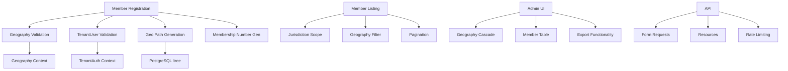

# **🚀 PHASE 1 IMPLEMENTATION PLAN: COMPLETE MEMBERSHIP FOUNDATION**

Based on your comprehensive progress, here's the focused implementation plan to **complete Phase 1** (Membership Context). We'll build on what's already done and fill the remaining gaps.

## **📋 CURRENT STATUS SUMMARY**

✅ **COMPLETED:**
- Global Geography Context with Nepal hierarchy
- `members` table with geography columns
- Member registration service + number generation
- TenantUser geography integration
- Module installation system
- Basic tests (44+68 integration + 11 membership)

❌ **MISSING FOR PHASE 1 COMPLETION:**
1. Member ↔ TenantUser relationship integration
2. Geography-scoped member listing/filtering
3. Admin UI for member management
4. Complete API endpoints
5. Jurisdiction-based access control

---

## **🔧 PHASE 1 IMPLEMENTATION STEPS**

### **WEEK 1: Member-TenantUser Integration (Days 1-2)**

#### **Step 1.1: Create Validation Service**
```php
// app/Contexts/Membership/Application/Services/TenantUserValidator.php
class TenantUserValidator
{
    public function validate(int $tenantUserId, int $tenantId): TenantUser
    {
        // 1. Check TenantUser exists and belongs to correct tenant
        // 2. Check TenantUser is active
        // 3. Check not already linked to a member
        // 4. Return validated TenantUser or throw DomainException
    }
}
```

#### **Step 1.2: Update MemberRegistrationService**
```php
class MemberRegistrationService
{
    public function __construct(
        private TenantUserValidator $validator,
        private GeographyRepository $geographyRepo
    ) {}
    
    public function register(array $data): Member
    {
        // 1. Validate geography hierarchy
        // 2. Validate/retrieve TenantUser if provided
        // 3. Generate membership number
        // 4. Create member with proper relationships
    }
}
```

#### **Step 1.3: Define Eloquent Relationships**
```php
// Member.php
public function tenantUser(): BelongsTo
{
    return $this->belongsTo(TenantUser::class, 'tenant_user_id')
        ->where('tenant_id', $this->tenant_id);
}

public function geographyUnit($level = 'province'): HasOneThrough
{
    // Define geography relationships through foreign keys
}

// TenantUser.php  
public function member(): HasOne
{
    return $this->hasOne(Member::class, 'tenant_user_id');
}
```

#### **Step 1.4: Write Integration Tests**
```php
// tests/Feature/Membership/MemberTenantUserIntegrationTest.php
class MemberTenantUserIntegrationTest extends TestCase
{
    public function test_member_can_link_to_valid_tenant_user()
    public function test_cannot_link_to_inactive_tenant_user()
    public function test_cannot_link_to_user_from_wrong_tenant()
    public function test_cannot_create_duplicate_links()
}
```

---

### **WEEK 1: Geography-Scoped Queries (Days 3-4)**

#### **Step 1.5: Create Materialized Path System**
```sql
-- Add path column to members table (already denormalized from geography)
ALTER TABLE members ADD COLUMN IF NOT EXISTS geo_path ltree;

-- Create GiST index for hierarchical queries
CREATE INDEX IF NOT EXISTS members_geo_path_gist_idx 
ON members USING GIST (geo_path);
```

#### **Step 1.6: Build Path Generator Service**
```php
// app/Contexts/Membership/Application/Services/GeographyPathService.php
class GeographyPathService
{
    public function generatePath(
        int $provinceId, 
        ?int $districtId = null,
        ?int $localLevelId = null,
        ?int $wardId = null
    ): string {
        // Build ltree path: province.district.local.ward
        // Validate each level exists in hierarchy
        return "{$provinceId}.{$districtId}.{$localLevelId}.{$wardId}";
    }
}
```

#### **Step 1.7: Create Jurisdiction Scopes**
```php
// app/Contexts/Membership/Domain/Models/Scopes/JurisdictionScope.php
class JurisdictionScope implements Scope
{
    public function apply(Builder $builder, Model $model): void
    {
        // For TenantUser: filter members by their geography assignment
        // For Admin: filter by their admin scope path
    }
}

// Member.php
protected static function booted(): void
{
    static::addGlobalScope(new JurisdictionScope);
}

public function scopeInGeography(Builder $query, string $path): Builder
{
    // Use PostgreSQL @> operator for descendant queries
    return $query->whereRaw("geo_path <@ ?", [$path]);
}
```

#### **Step 1.8: Add to Registration Service**
```php
class MemberRegistrationService
{
    public function register(array $data): Member
    {
        // ... existing validation
        
        // Generate geo_path
        $geoPath = $this->geographyPathService->generatePath(
            $data['province_id'],
            $data['district_id'],
            $data['local_level_id'],
            $data['ward_id']
        );
        
        // Create member with geo_path
        return Member::create([
            // ... other fields
            'geo_path' => $geoPath
        ]);
    }
}
```

---

### **WEEK 2: Admin UI & API (Days 5-7)**

#### **Step 1.9: Create Member Management API**
```php
// routes/tenant-api.php
Route::prefix('api')->middleware(['auth:tenant'])->group(function () {
    Route::apiResource('members', MemberController::class);
    Route::get('members/geography/{path}', [MemberController::class, 'byGeography']);
    Route::post('members/import', [MemberController::class, 'import']);
});

// app/Contexts/Membership/Application/Http/Controllers/MemberController.php
class MemberController extends Controller
{
    public function index(MemberListQuery $query): MemberCollection
    {
        // Filter by geography, search, pagination
        return new MemberCollection($query->paginate());
    }
    
    public function byGeography(string $path): MemberCollection
    {
        return new MemberCollection(
            Member::inGeography($path)->paginate()
        );
    }
}
```

#### **Step 1.10: Build Form Requests & Resources**
```php
// app/Contexts/Membership/Application/Http/Requests/StoreMemberRequest.php
class StoreMemberRequest extends FormRequest
{
    public function rules(): array
    {
        return [
            'first_name' => 'required|string|max:100',
            'last_name' => 'required|string|max:100',
            'province_id' => 'required|exists:geo_administrative_units,id',
            'district_id' => [
                'required',
                Rule::exists('geo_administrative_units', 'id')
                    ->where('parent_id', $this->province_id)
            ],
            // ... hierarchical validation
            'tenant_user_id' => 'nullable|exists:tenant_users,id',
        ];
    }
}

// app/Contexts/Membership/Application/Http/Resources/MemberResource.php
class MemberResource extends JsonResource
{
    public function toArray(Request $request): array
    {
        return [
            'id' => $this->id,
            'membership_number' => $this->membership_number,
            'full_name' => $this->full_name,
            'geography' => $this->geographyHierarchy(), // nested object
            'tenant_user' => new TenantUserResource($this->whenLoaded('tenantUser')),
            'created_at' => $this->created_at,
        ];
    }
}
```

#### **Step 1.11: Create Vue Admin Components**
```vue
<!-- resources/js/Pages/Tenant/Members/Index.vue -->
<template>
  <div class="p-6">
    <h1 class="text-2xl font-bold mb-6">Member Management</h1>
    
    <!-- Geography Filter -->
    <GeographyFilter @filter="applyGeographyFilter" />
    
    <!-- Member List -->
    <MemberTable :members="members.data" />
    
    <!-- Pagination -->
    <Pagination :links="members.links" />
  </div>
</template>

<script setup>
import { ref, onMounted } from 'vue';
import GeographyFilter from '@/Components/GeographyFilter.vue';
import MemberTable from '@/Components/MemberTable.vue';

const members = ref({ data: [] });

const fetchMembers = async (filters = {}) => {
  const response = await axios.get('/api/members', { params: filters });
  members.value = response.data;
};

const applyGeographyFilter = (path) => {
  fetchMembers({ geography_path: path });
};

onMounted(() => fetchMembers());
</script>
```

#### **Step 1.12: Geography Filter Component**
```vue
<!-- resources/js/Components/GeographyFilter.vue -->
<template>
  <div class="grid grid-cols-4 gap-4 mb-6">
    <!-- Province Dropdown -->
    <select v-model="selectedProvince" @change="loadDistricts">
      <option value="">Select Province</option>
      <option v-for="province in provinces" :value="province">
        {{ province.name_en }}
      </option>
    </select>
    
    <!-- District Dropdown -->
    <select v-model="selectedDistrict" @change="loadLocalLevels" :disabled="!selectedProvince">
      <option value="">Select District</option>
      <!-- ... -->
    </select>
    
    <!-- Local Level Dropdown -->
    <!-- Ward Dropdown -->
    
    <button @click="applyFilter" class="bg-blue-600 text-white px-4 py-2 rounded">
      Filter Members
    </button>
  </div>
</template>

<script setup>
// Geography cascading dropdown logic
</script>
```

---

### **WEEK 2: Testing & Polish (Day 8)**

#### **Step 1.13: Comprehensive Test Suite**
```php
// tests/Feature/Membership/MemberManagementTest.php
class MemberManagementTest extends TestCase
{
    public function test_admin_can_list_members()
    public function test_members_filtered_by_geography()
    public function test_cannot_see_other_tenant_members()
    public function test_member_creation_with_tenant_user()
    public function test_geo_path_generation()
    public function test_jurisdiction_scope_application()
}
```

#### **Step 1.14: Performance Tests**
```php
class MemberPerformanceTest extends TestCase
{
    public function test_geo_path_index_performance()
    {
        // Create 10,000 members with different geography paths
        // Test query speed for descendant lookups
        // Assert response time < 100ms
    }
}
```

#### **Step 1.15: Documentation & API Spec**
```markdown
# Member Management API

## Endpoints
- `GET /api/members` - List members (filter by geography)
- `POST /api/members` - Register new member
- `GET /api/members/{id}` - Get member details
- `GET /api/members/geography/{path}` - Get members in geography tree

## Geography Filter Format
Use ltree path: `7.77.753.6743`
- 7: Province ID
- 77: District ID  
- 753: Local Level ID
- 6743: Ward ID

Partial paths work: `7.77` returns all members in district 77
```

---

## **📊 DEPENDENCY GRAPH**



---

## **🎯 SUCCESS CRITERIA FOR PHASE 1 COMPLETION**

### **Functionality (100% Complete)**
- [ ] Member registration with geography validation
- [ ] Optional TenantUser linking with validation
- [ ] Geography-scoped member listing
- [ ] Admin UI with geography filters
- [ ] Complete REST API
- [ ] Jurisdiction-based access control

### **Performance (< 100ms queries)**
- [ ] PostgreSQL GiST index on geo_path
- [ ] 10,000+ member test passes
- [ ] Geography cascade loads in < 50ms

### **Testing (> 90% Coverage)**
- [ ] Unit tests for all services
- [ ] Integration tests for API
- [ ] Feature tests for UI
- [ ] Performance tests for scale

### **Security**
- [ ] Tenant data isolation verified
- [ ] SQL injection prevented
- [ ] Rate limiting on API
- [ ] XSS protection on UI

---

## **🚀 IMMEDIATE NEXT ACTION (TODAY)**

1. **Create TenantUserValidator** (1 hour)
2. **Update MemberRegistrationService** (30 min)
3. **Add geo_path column + index** (15 min)
4. **Test the integration** (1 hour)

**Estimated total: 3 hours** to complete core integration.

---

## **📈 PROGRESS TRACKING**

| Component | Status | Priority | ETA |
|-----------|--------|----------|-----|
| TenantUserValidator | ❌ Not Started | 🔴 HIGH | Today |
| Geo Path System | ❌ Not Started | 🔴 HIGH | Today |
| Jurisdiction Scope | ❌ Not Started | 🟡 MEDIUM | Day 3 |
| API Endpoints | ❌ Not Started | 🟡 MEDIUM | Day 5 |
| Admin UI | ❌ Not Started | 🟢 LOW | Day 6 |
| Performance Tests | ❌ Not Started | 🟢 LOW | Day 8 |

---

## **💡 RECOMMENDED WORKFLOW**

```bash
# Start with TDD approach
php artisan test --filter=TenantUserValidator

# Create validator
php artisan make:service TenantUserValidator --context=Membership

# Add geo_path column
php artisan make:migration add_geo_path_to_members_table

# Run tests after each change
php artisan test tests/Feature/Membership/

# Create API endpoints
php artisan make:controller MemberController --api --context=Membership
```

This plan builds directly on your existing architecture and completes the **Membership Context** foundation. The materialized path system using PostgreSQL `ltree` will give you the performance needed for large-scale political organizations while maintaining clean geography-based filtering.