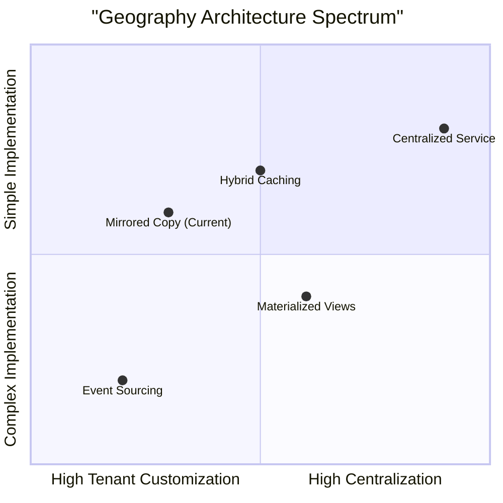

Excellent question. As a senior architect, I must tell you that **your current approach is just one of several valid patterns**, each with different trade-offs. Let me analyze the landscape of possible architectures for this geography synchronization problem.

## 🏗️ **Architecture Spectrum: 5 Approaches**



Here's a detailed comparison of architectures, including **alternatives you should seriously consider**:

## 🔄 **Alternative 1: Centralized Service Pattern (RPC Style)**

**Instead of copying data, query it on-demand from a central service.**

### **How It Works**:
```php
// Tenant applications call a central geography service
class GeographyServiceClient
{
    public function getProvinceMembers(string $tenantId, int $provinceId): Collection
    {
        // Calls central API instead of local query
        $response = Http::withHeaders([
            'X-Tenant-ID' => $tenantId,
        ])->get("https://geography-service/api/provinces/{$provinceId}/members");
        
        return Member::hydrate($response->json());
    }
}
```

### **Pros vs Cons**:
| **Advantages** | **Disadvantages** |
|----------------|-------------------|
| ✅ **Single source of truth** - no sync issues | ❌ **Performance bottleneck** - all queries hit central service |
| ✅ **Instant updates** - changes propagate immediately | ❌ **Network dependency** - tenant isolated if service down |
| ✅ **Minimal storage** - no duplication in tenant DBs | ❌ **Complex caching** needed for performance |
| ✅ **Easy to add new countries/features** | ❌ **Tenant-specific extensions difficult** |

**Best For**: When geography changes frequently and consistency is more important than latency.

## 📊 **Alternative 2: Materialized Views (PostgreSQL Specific)**

**Use database-level replication instead of application-level copying.**

### **How It Works**:
```sql
-- In tenant database, create a view that references landlord
CREATE MATERIALIZED VIEW tenant_geography AS
SELECT 
    g.id as external_geo_id,
    g.name_en,
    g.admin_level,
    -- PostgreSQL can refresh this automatically
FROM landlord.geo_administrative_units g
WHERE g.country_code = 'NP';

-- Refresh periodically or on-demand
REFRESH MATERIALIZED VIEW CONCURRENTLY tenant_geography;
```

### **Pros vs Cons**:
| **Advantages** | **Disadvantages** |
|----------------|-------------------|
| ✅ **Database-managed sync** - no custom code | ❌ **Database vendor lock-in** (PostgreSQL specific) |
| ✅ **Transactional consistency** | ❌ **Cross-database queries can be slow** |
| ✅ **Supports incremental refresh** | ❌ **Tenant isolation weaker** |
| ✅ **Simple query model** for developers | ❌ **Custom tenant extensions complex** |

**Best For**: When you have strong PostgreSQL expertise and want minimal custom sync code.

## 🚀 **Alternative 3: Change Data Capture (CDC) Pattern**

**Capture landlord changes and stream them to tenants.**

### **How It Works**:
```php
// 1. Capture changes in landlord
DB::listen(function ($query) {
    if ($this->isGeographyChange($query)) {
        ChangeCapture::record($query);
    }
});

// 2. Stream to message broker (Kafka, RabbitMQ)
class GeographyChangeStream
{
    public function publishChange(array $change): void
    {
        Kafka::publish('geography-changes', [
            'tenant_id' => '*', // Or specific tenants
            'operation' => $change['type'],
            'data' => $change['data']
        ]);
    }
}

// 3. Tenants consume and apply changes
class GeographyChangeConsumer
{
    public function handleChange(array $message): void
    {
        if ($message['tenant_id'] === $this->tenant->id || 
            $message['tenant_id'] === '*') {
            $this->applyChange($message);
        }
    }
}
```

### **Pros vs Cons**:
| **Advantages** | **Disadvantages** |
|----------------|-------------------|
| ✅ **Near real-time sync** | ❌ **High complexity** (message brokers, consumers) |
| ✅ **Selective updates** - only changed data | ❌ **Message ordering challenges** |
| ✅ **Scalable** - add tenants without load on landlord | ❌ **Eventual consistency** (not immediate) |
| ✅ **Audit trail built-in** | ❌ **Operational overhead** |

**Best For**: Large-scale systems (1000+ tenants) where near-real-time updates are critical.

## 💾 **Alternative 4: Hybrid Caching Pattern**

**Combine local cache with centralized service for best of both worlds.**

### **How It Works**:
```php
class HybridGeographyService
{
    public function getGeographyUnit(int $unitId): array
    {
        $cacheKey = "geo:{$this->tenant->id}:{$unitId}";
        
        // 1. Check local Redis cache first
        if ($cached = Redis::get($cacheKey)) {
            return json_decode($cached, true);
        }
        
        // 2. Check local tenant DB (stale copy)
        if ($local = $this->getFromTenantDB($unitId)) {
            // 3. Async refresh from central
            $this->queueBackgroundRefresh($unitId);
            return $local;
        }
        
        // 4. Fallback to central service
        $fresh = $this->callCentralService($unitId);
        
        // 5. Update cache and local DB
        $this->updateLocalCopy($fresh);
        
        return $fresh;
    }
}
```

### **Pros vs Cons**:
| **Advantages** | **Disadvantages** |
|----------------|-------------------|
| ✅ **Excellent performance** - cache hits | ❌ **Complex cache invalidation** |
| ✅ **Graceful degradation** - works offline | ❌ **Multiple data sources to manage** |
| ✅ **Flexible consistency** - tune per use case | ❌ **Potential stale reads** |
| ✅ **Proven pattern** (CDN-like) | ❌ **Implementation complexity** |

**Best For**: Systems where performance is critical but perfect consistency isn't required.

## 📈 **Alternative 5: Tenant Sharding with Shared Reference Data**

**Shard tenants but keep geography in a shared reference cluster.**

### **How It Works**:
```
Shard 1 (Tenants A-F)    Shard 2 (Tenants G-L)    Shard N (Tenants X-Z)
      │                         │                         │
      └───────────┬─────────────┴─────────────┬───────────┘
                  │                           │
          [Read Replica 1]             [Read Replica 2]
                  │                           │
                  └─────────────┬─────────────┘
                                │
                      [Geography Reference DB]
```

### **Pros vs Cons**:
| **Advantages** | **Disadvantages** |
|----------------|-------------------|
| ✅ **Scalable reads** - read replicas | ❌ **Complex database topology** |
| ✅ **Centralized updates** | ❌ **Still eventual consistency on replicas** |
| ✅ **Good performance** - local-ish queries | ❌ **Replica lag issues** |
| ✅ **Tenant isolation maintained** | ❌ **Operational complexity** |

**Best For**: When you need to scale beyond single database but want centralized management.

## 🎯 **Decision Framework: Which Pattern to Choose?**

Here's a decision matrix based on your specific requirements:

| **Requirement** | **Current Pattern** | **Better Alternative** | **Why** |
|-----------------|---------------------|------------------------|---------|
| **Zero sync lag** | ❌ (Manual/None) | **CDC Pattern** | Real-time streaming |
| **Minimal tenant storage** | ❌ (Full copy) | **Centralized Service** | No local storage |
| **Offline capability** | ✅ (Local copy) | **Hybrid Caching** | Cached + graceful fallback |
| **Simple implementation** | ✅ (Straightforward) | **Current** | Already implemented |
| **Multi-country support** | ⚠️ (Manual per country) | **Centralized Service** | Single configuration |
| **Tenant customization** | ✅ (Levels 5-8) | **Current** | Easy to extend |

## 🔧 **Pragmatic Hybrid Recommendation**

Given you already have parts implemented, I recommend a **hybrid evolution path**:

### **Phase 1: Enhance Current Mirroring (Next Month)**
```php
// Add selective sync capabilities to your existing service
class EnhancedMirrorService extends GeographyMirrorService
{
    public function syncChangedUnitsOnly(Tenant $tenant, array $changedIds): void
    {
        // Only update specific units that changed
        // Much more efficient than full mirror
    }
}
```

### **Phase 2: Add Read-Through Cache (Next Quarter)**
```php
// For high-traffic queries, add Redis caching layer
class CachedGeographyRepository
{
    public function getFrequentlyAccessedUnits(Tenant $tenant): Collection
    {
        return Cache::remember("geo:hot:{$tenant->id}", 3600, function () use ($tenant) {
            return $this->geographyService->getHotUnits($tenant);
        });
    }
}
```

### **Phase 3: Event-Driven Updates (When Needed)**
```php
// When you hit scale issues (500+ tenants)
class GeographyChangeNotifier
{
    public function notifyTenantsOfChange(int $unitId): void
    {
        // Lightweight notification instead of full data push
        Redis::publish('geo-changes', json_encode([
            'unit_id' => $unitId,
            'action' => 'invalidate_cache'
        ]));
    }
}
```

## 📊 **Cost-Benefit Analysis Summary**

| **Pattern** | **Dev Cost** | **Ops Cost** | **Performance** | **Consistency** | **Flexibility** |
|-------------|--------------|--------------|-----------------|-----------------|-----------------|
| **Current (Mirror)** | Low | Medium | High | Medium | High |
| **Centralized Service** | Medium | Low | Low-Medium | High | Low |
| **Materialized Views** | Low | Medium | Medium | High | Low |
| **CDC Pattern** | High | High | High | High | Medium |
| **Hybrid Caching** | High | Medium | Very High | Medium | High |

## 🎯 **My Professional Recommendation**

**Stick with your current pattern, but evolve it strategically.**

Here's why:

1. **You already have working code** - the highest cost is already paid
2. **It supports tenant customization** (levels 5-8) - critical for your use case
3. **Performance is excellent** for membership queries
4. **The sync problem is manageable** with proper tooling

**Immediate improvements to make**:
1. Add **selective sync** capability (sync only changed units)
2. Implement **health monitoring** for data consistency
3. Create **emergency resync tools** for when things drift

**Long-term consideration**: If you exceed 1,000 tenants or geography changes become very frequent, evaluate **CDC Pattern** for its scalability.

## 🤔 **Critical Question for You**

What's the **expected rate of change** for Nepal's administrative geography?

- **Low** (changes yearly): Current pattern is perfect
- **Medium** (changes monthly): Add incremental sync
- **High** (changes weekly): Consider CDC pattern sooner

The frequency of change is the single biggest factor in choosing the right architecture for this problem.