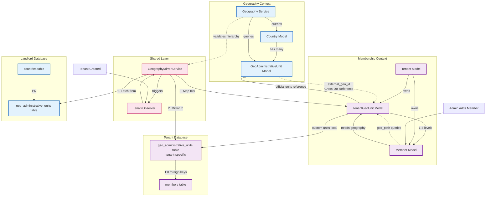
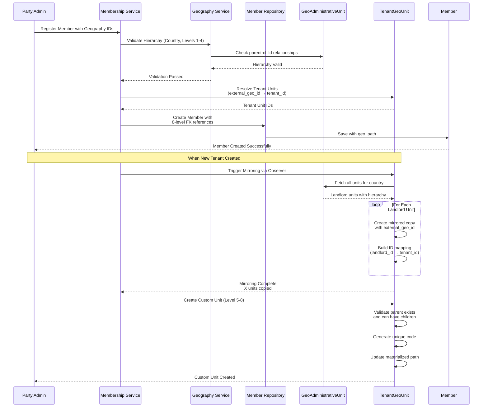

# 🏗️ **Architecture Overview: Geography Context Integration**

## 📊 **Abstract Architecture: Complete Relationship Map**



## 🔄 **Detailed Interaction Sequence**



## 🎯 **Context Responsibilities & Boundaries**

### **Geography Context (Landlord)**
```
RESPONSIBILITIES:
├── Global Reference Data
│   ├── Country configurations (NP, IN, DE, etc.)
│   ├── Official administrative hierarchies (levels 1-4)
│   └── Multilingual names and codes
├── Validation Logic
│   ├── Hierarchy validation (parent-child rules)
│   ├── Country-specific level definitions
│   └── Boundary change management
└── Read-Optimized API
    ├── Fast country/level queries
    ├── Cached hierarchy responses
    └── Spatial queries (future)

DATA MODEL:
GeoAdministrativeUnit {
  id: 12345
  country_code: "NP"
  admin_level: 2
  admin_type: "district"
  code: "NP-D25"
  name_local: {"en": "Kathmandu", "np": "काठमाडौं"}
  parent_id: 12344
  path: "1.23.456"
}
```

### **Membership Context (Tenant)**
```
RESPONSIBILITIES:
├── Tenant-Specific Geography
│   ├── Mirrored official units (levels 1-4)
│   ├── Custom party units (levels 5-8)
│   └── Tenant isolation enforcement
├── Member-Geography Relationship
│   ├── 8-level foreign key storage
│   ├── Materialized paths for queries
│   └── Geography assignment/validation
└── Tenant Operations
    ├── Custom unit management
    ├── Member density reporting
    └── Geography-based permissions

DATA MODEL:
TenantGeoUnit {
  id: 98765 (tenant-specific)
  tenant_id: 777
  external_geo_id: 12345 (references landlord)
  unit_type: "official" | "custom"
  admin_level: 2
  code: "OFFICIAL-NP-NP-D25"
  parent_id: 98764
  geo_path: "98764.98765"
}

Member {
  admin_unit_level1_id: 98764
  admin_unit_level2_id: 98765
  ...
  admin_unit_level8_id: null
  geo_path: "98764.98765"
}
```

## 🔗 **Critical Integration Points**

### **1. ID Mapping Layer**
```php
// The crucial bridge between contexts
class GeographyIdMapper
{
    private static $cache = [];
    
    public static function landlordToTenant(
        int $landlordId, 
        int $tenantId
    ): ?int {
        $key = "map:{$tenantId}:{$landlordId}";
        
        return Cache::remember($key, 3600, function () use ($landlordId, $tenantId) {
            return TenantGeoUnit::where('tenant_id', $tenantId)
                ->where('external_geo_id', $landlordId)
                ->value('id');
        });
    }
    
    public static function tenantToLandlord(int $tenantUnitId): ?int
    {
        return TenantGeoUnit::find($tenantUnitId)->external_geo_id;
    }
}
```

### **2. Cross-Context Service Contracts**
```php
// Geography Context provides these to Membership Context
interface GeographyValidationContract
{
    public function validateHierarchy(string $countryCode, array $landlordIds): bool;
    public function getCountryConfig(string $countryCode): array;
    public function getUnitWithAncestors(int $landlordId): array;
}

// Membership Context provides these to Geography Context
interface GeographyUsageContract  
{
    public function getTenantsUsingCountry(string $countryCode): Collection;
    public function getGeographyUsageStats(int $landlordUnitId): array;
}
```

## 📈 **Data Flow in Production**

### **Scenario: UML Party adds member in Kathmandu**
```
1. FRONTEND → MEMBERSHIP CONTEXT:
   POST /members
   {
     "name": "Ram Bahadur",
     "geography": {
       "country": "NP",
       "units": [1, 25, 456, 7890] // Landlord IDs for Province→District→Local→Ward
     }
   }

2. MEMBERSHIP CONTEXT VALIDATION:
   - Calls GeographyContext::validateHierarchy('NP', [1, 25, 456, 7890])
   - GeographyContext checks parent-child relationships
   - Returns: true/false with validation errors

3. ID RESOLUTION:
   - For each landlord ID, lookup tenant-specific ID:
     1 (landlord) → 1001 (tenant_uml)
     25 → 1002
     456 → 1003  
     7890 → 1004

4. MEMBER CREATION:
   Member::create([
     'admin_unit_level1_id': 1001,
     'admin_unit_level2_id': 1002,
     'admin_unit_level3_id': 1003,
     'admin_unit_level4_id': 1004,
     'geo_path': '1001.1002.1003.1004'
   ])

5. CUSTOM GEOGRAPHY (Optional):
   - Admin later creates Tole (level 5) under ward 1004
   - New member assigned to tole: geo_path becomes '1001.1002.1003.1004.1005'
```

## 🛡️ **Architecture Guard Rails**

### **Rule 1: Never Join Across Contexts**
```sql
-- FORBIDDEN: Cross-database join
SELECT * FROM landlord.geo_units
JOIN tenant_uml.members ON geo_units.id = members.province_id;

-- REQUIRED: Mirror then query locally
-- 1. Mirror landlord units → tenant_uml.geo_units
-- 2. Query: SELECT * FROM tenant_uml.members 
--           JOIN tenant_uml.geo_units ON members.province_id = geo_units.id
```

### **Rule 2: Contexts Communicate via Contracts**
```php
// WRONG: Direct model usage across contexts
$landlordUnit = Landlord\GeoUnit::find(123); // In Membership Context

// CORRECT: Use service contracts
$isValid = $this->geographyValidator->validateHierarchy('NP', [1, 25, 456]);
```

### **Rule 3: Tenant Data Never References Landlord Directly**
```php
// Store reference, not dependency
class TenantGeoUnit {
  protected $fillable = [
    'external_geo_id', // OK: Reference ID
    // 'landlord_unit'  // BAD: Direct relationship
  ];
  
  // Access via cached service call
  public function getLandlordData(): array
  {
      return $this->geographyService->getUnit($this->external_geo_id);
  }
}
```

## 🎯 **Why This Architecture Works**

### **Separation of Concerns**
- **Geography Context** = "What exists in the world"
- **Membership Context** = "How our party organizes in that world"

### **Scalability**
- Geography changes infrequently → Heavily cached
- Membership operations frequent → Tenant-optimized
- New countries added without touching membership code

### **Maintainability**
- Teams can work independently
- Geography team updates boundaries
- Membership team builds party features
- Integration via clear contracts

## 🔮 **Evolution Path**

```mermaid
timeline
    title Architecture Evolution
    section Phase 1 : Now
        Single-table landlord<br>Basic mirroring
    section Phase 2 : 6 Months
        Event-driven sync<br>Multi-country support
    section Phase 3 : 1 Year
        Spatial queries<br>Advanced analytics
    section Phase 4 : 2 Years
        Global search<br>Real-time boundaries
```

## 📋 **Implementation Checklist**

- [ ] **Geography Context**: Complete, tested, deployed
- [ ] **Landlord Database**: Contains Nepal, India, Germany data  
- [ ] **Membership Context**: Tenant models defined
- [ ] **Tenant Databases**: Migration ready for geo_administrative_units
- [ ] **Mirroring Service**: Copies landlord → tenant with ID mapping
- [ ] **Integration Tests**: Validate cross-context communication
- [ ] **API Layer**: REST endpoints for geography assignment
- [ ] **Monitoring**: Track mirroring success/failure rates

**Key Insight**: The Geography Context provides the **universal truth** of administrative boundaries. The Membership Context creates **tenant-specific instances** of that truth, extended with party-specific organization. They collaborate through well-defined contracts, never direct dependencies.

**Next Architecture Decision**: Should we implement an event-driven sync for landlord changes, or rely on periodic manual updates?