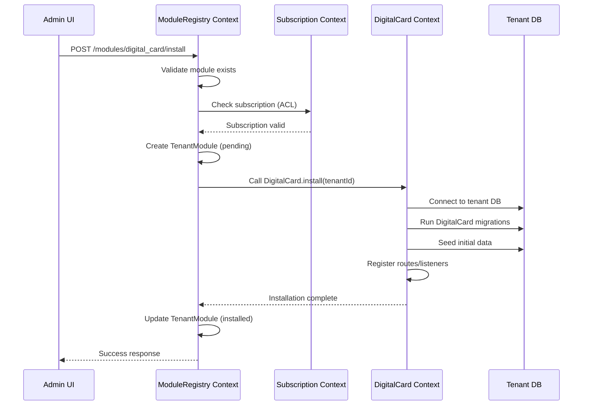

# **🏗️ ModuleRegistry: Context Analysis & Architecture**

**YES**, `ModuleRegistry` should be a **separate Bounded Context** that orchestrates module installation across the platform. Let me explain the correct architecture:

## **📦 ARCHITECTURAL ANALYSIS**

### **Current Context Landscape:**
```
Existing Contexts:
1. Subscription Context    - Manages plans, features, billing
2. DigitalCard Context    - Business logic for digital cards
3. TenantAuth Context     - Authentication & authorization

PROBLEM: No central place to manage module installation lifecycle
```

### **Solution: ModuleRegistry as a NEW Bounded Context**

```
Platform Contexts Map:
┌─────────────────┐    ┌─────────────────┐    ┌─────────────────┐
│  SUBSCRIPTION   │    │  TENANT AUTH    │    │ MODULE REGISTRY │
│  Context        │◄──►│  Context        │◄──►│  Context        │
│                 │    │                 │    │                 │
│ • Plans         │    │ • Tenants       │    │ • Module Catalog│
│ • Billing       │    │ • Users         │    │ • Installation  │
│ • Feature Gates │    │ • Roles         │    │ • Dependencies  │
└─────────────────┘    └─────────────────┘    └─────────────────┘
         │                       │                       │
         └───────────────────────┼───────────────────────┘
                                 │
                    ┌────────────▼────────────┐
                    │     PLATFORM CORE       │
                    │  (Shared Kernel)        │
                    │  • TenantId VO          │
                    │  • Event Bus            │
                    │  • Common Exceptions    │
                    └─────────────────────────┘
                                 │
                    ┌────────────▼────────────┐
                    │   BUSINESS CONTEXTS     │
                    │  (Installable Modules)  │
                    │  • DigitalCard Context  │
                    │  • Elections Context    │
                    │  • Messaging Context    │
                    │  • etc...               │
                    └─────────────────────────┘
```

## **🔧 MODULE REGISTRY CONTEXT DESIGN**

### **1. ModuleRegistry Context Responsibilities:**
```yaml
Primary Responsibilities:
1. Module Discovery      - Find all installable modules in the platform
2. Dependency Resolution - Check and validate module dependencies
3. Installation Orchestration - Coordinate installation across contexts
4. Version Management    - Track installed versions per tenant
5. Lifecycle Management  - Install/upgrade/uninstall modules

Domain Model:
• Module (Aggregate)          - Module definition & metadata
• TenantModule (Aggregate)    - Tenant's installed module instance
• InstallationJob (Entity)    - Installation process tracking
• ModuleDependency (ValueObject) - Module dependency rules
```

### **2. ModuleRegistry Domain Layer:**
```php
// app/Contexts/ModuleRegistry/Domain/Models/Module.php
class Module extends AggregateRoot
{
    private ModuleId $id;
    private string $name;               // 'digital_card'
    private string $displayName;        // 'Digital Cards'
    private Version $version;           // '1.0.0'
    private string $contextNamespace;   // 'DigitalCard\\'
    private string $migrationsPath;     // '/app/Contexts/DigitalCard/Migrations/Tenant/'
    private bool $requiresSubscription;
    private array $dependencies;        // ['membership' => '^1.0']
    private ModuleConfiguration $config;
    
    public function getInstallationSteps(): array
    {
        return [
            new DatabaseMigrationStep($this->migrationsPath),
            new SeedDataStep($this->name),
            new RegisterRoutesStep($this->name),
            new RegisterEventListenersStep($this->name),
        ];
    }
}

// app/Contexts/ModuleRegistry/Domain/Models/TenantModule.php
class TenantModule extends Entity
{
    private TenantModuleId $id;
    private TenantId $tenantId;
    private ModuleId $moduleId;
    private ModuleVersion $installedVersion;
    private ModuleStatus $status;          // 'pending', 'installed', 'failed'
    private InstallationLog $installationLog;
    private DateTimeImmutable $installedAt;
    private ?DateTimeImmutable $lastUsedAt;
    
    public function markAsInstalled(): void
    {
        $this->status = ModuleStatus::installed();
        $this->installedAt = new DateTimeImmutable();
        $this->recordEvent(new ModuleInstalled(
            $this->tenantId,
            $this->moduleId,
            $this->installedVersion
        ));
    }
}
```

### **3. ModuleRegistry Application Layer:**
```php
// app/Contexts/ModuleRegistry/Application/Services/ModuleDiscoveryService.php
class ModuleDiscoveryService
{
    public function discoverModules(): array
    {
        // Scan Contexts directory for modules
        $contextsPath = base_path('app/Contexts');
        $modules = [];
        
        foreach (glob($contextsPath . '/*', GLOB_ONLYDIR) as $contextDir) {
            $contextName = basename($contextDir);
            
            // Check if context has module.json definition
            $moduleDefinition = $contextDir . '/module.json';
            
            if (file_exists($moduleDefinition)) {
                $config = json_decode(file_get_contents($moduleDefinition), true);
                $modules[] = ModuleFactory::fromConfig($contextName, $config);
            }
        }
        
        return $modules;
    }
}

// app/Contexts/ModuleRegistry/Application/Commands/InstallModuleCommand.php
class InstallModuleCommand
{
    public function __construct(
        public readonly TenantId $tenantId,
        public readonly string $moduleName,
        public readonly string $installedByUserId
    ) {}
}

// app/Contexts/ModuleRegistry/Application/Handlers/InstallModuleHandler.php
class InstallModuleHandler
{
    public function __construct(
        private ModuleRepository $moduleRepository,
        private TenantModuleRepository $tenantModuleRepository,
        private SubscriptionClient $subscriptionClient,
        private ModuleInstallerFactory $installerFactory,
        private EventDispatcher $eventDispatcher
    ) {}
    
    public function handle(InstallModuleCommand $command): void
    {
        // 1. Get module from registry
        $module = $this->moduleRepository->findByName($command->moduleName);
        
        // 2. Check if tenant can install (via Subscription Context)
        $this->subscriptionClient->ensureTenantCanInstall(
            $command->tenantId,
            $module
        );
        
        // 3. Create installation record
        $tenantModule = TenantModule::create(
            tenantId: $command->tenantId,
            moduleId: $module->getId(),
            version: $module->getVersion(),
            installedBy: $command->installedByUserId
        );
        
        $this->tenantModuleRepository->save($tenantModule);
        
        // 4. Get module-specific installer
        $installer = $this->installerFactory->createForModule($module);
        
        // 5. Run installation
        $installer->install($command->tenantId);
        
        // 6. Update status
        $tenantModule->markAsInstalled();
        $this->tenantModuleRepository->save($tenantModule);
        
        // 7. Dispatch events
        $this->eventDispatcher->dispatchAll($tenantModule->releaseEvents());
    }
}
```

### **4. Module Definition File (module.json):**
```json
// app/Contexts/DigitalCard/module.json
{
    "name": "digital_card",
    "display_name": "Digital Cards",
    "version": "1.0.0",
    "description": "Digital membership cards with QR code validation",
    "requires_subscription": true,
    "subscription_feature": "digital_cards",
    "context_namespace": "DigitalCard",
    "migrations_path": "Database/Migrations/Tenant/",
    "seeds_path": "Database/Seeds/",
    "routes_file": "Infrastructure/routes.php",
    "service_provider": "Infrastructure/ModuleServiceProvider.php",
    "dependencies": {
        "membership": "^1.0"
    },
    "config": {
        "max_cards_per_member": 1,
        "qr_code_expiry_hours": 24
    },
    "install_steps": [
        "run_migrations",
        "seed_initial_data",
        "register_routes",
        "register_event_listeners"
    ]
}
```

## **🔌 HOW MODULE REGISTRY COMMUNICATES WITH OTHER CONTEXTS**

### **1. With Subscription Context (Anti-Corruption Layer):**
```php
// app/Contexts/ModuleRegistry/Infrastructure/Clients/SubscriptionClient.php
class SubscriptionClient
{
    public function __construct(
        private HttpClient $httpClient,
        private string $subscriptionServiceUrl
    ) {}
    
    public function ensureTenantCanInstall(TenantId $tenantId, Module $module): void
    {
        if (!$module->requiresSubscription()) {
            return; // Free module, no check needed
        }
        
        // Call Subscription Context's internal API
        $response = $this->httpClient->post("{$this->subscriptionServiceUrl}/check-install", [
            'tenant_id' => $tenantId->toString(),
            'module_name' => $module->getName(),
            'feature_name' => $module->getSubscriptionFeature()
        ]);
        
        if (!$response->successful()) {
            throw new SubscriptionRequiredException(
                "Tenant {$tenantId} does not have subscription for {$module->getName()}"
            );
        }
    }
}
```

### **2. With Business Contexts (DigitalCard, Elections, etc.):**
```php
// ModuleRegistry discovers modules, but installation delegates TO the module
// app/Contexts/ModuleRegistry/Application/Services/ModuleInstallerFactory.php

class ModuleInstallerFactory
{
    public function createForModule(Module $module): ModuleInstallerInterface
    {
        // Each module provides its own installer
        $installerClass = $module->getContextNamespace() . '\\Installation\\ModuleInstaller';
        
        if (!class_exists($installerClass)) {
            throw new ModuleInstallerNotFoundException(
                "Module {$module->getName()} does not have an installer"
            );
        }
        
        return app()->make($installerClass);
    }
}

// app/Contexts/DigitalCard/Installation/ModuleInstaller.php
class ModuleInstaller implements ModuleInstallerInterface
{
    public function install(TenantId $tenantId): void
    {
        // 1. Switch to tenant database
        $this->tenantConnection->connect($tenantId);
        
        // 2. Run DigitalCard-specific migrations
        $this->migrator->run(
            path: __DIR__ . '/../Database/Migrations/Tenant/',
            connection: $this->tenantConnection
        );
        
        // 3. Seed initial data (if any)
        $this->seeder->run(DigitalCardSeeder::class);
        
        // 4. Register module routes for this tenant
        $this->routeRegistrar->registerForTenant($tenantId);
        
        // 5. Register event listeners
        $this->eventRegistrar->registerForTenant($tenantId);
    }
}
```

## **🚀 IMPLEMENTATION ROADMAP**

### **Phase 1: ModuleRegistry Foundation**
```bash
# 1. Create ModuleRegistry Context
php artisan make:context ModuleRegistry --domain

# 2. Create module registry tables in landlord DB
php artisan make:migration create_module_registry_tables

# 3. Create Module definition model
php artisan make:model Module --context=ModuleRegistry

# 4. Create module discovery service
php artisan make:service ModuleDiscoveryService --context=ModuleRegistry
```

### **Phase 2: DigitalCard Module Definition**
```bash
# 1. Create module.json for DigitalCard
# app/Contexts/DigitalCard/module.json

# 2. Create DigitalCard installer
php artisan make:class Installation/ModuleInstaller --context=DigitalCard

# 3. Create tenant-specific migrations folder
mkdir -p app/Contexts/DigitalCard/Database/Migrations/Tenant

# 4. Create tenant migration for digital_cards table
php artisan make:migration create_digital_cards_table \
  --path=app/Contexts/DigitalCard/Database/Migrations/Tenant \
  --context=DigitalCard
```

### **Phase 3: Integration**
```bash
# 1. Create API endpoints in ModuleRegistry
php artisan make:controller ModuleController --context=ModuleRegistry --api

# 2. Create Vue.js module marketplace component
php artisan make:component ModuleMarketplace --context=ModuleRegistry

# 3. Test installation flow
php artisan make:test ModuleInstallationTest --context=ModuleRegistry
```

## **📊 TENANT MODULE INSTALLATION SEQUENCE**



## **🎯 KEY BENEFITS OF SEPARATE MODULEREGISTRY CONTEXT**

1. **Centralized Management** - One place to see all modules and installations
2. **Decoupled Architecture** - Modules don't know about each other
3. **Subscription Integration** - Clean separation of concerns
4. **Lifecycle Management** - Install, upgrade, uninstall in one place
5. **Discovery Service** - Auto-discover new modules as they're added
6. **Dependency Resolution** - Handle complex module dependencies
7. **Audit Trail** - Track who installed what and when

## **❌ ALTERNATIVES CONSIDERED (AND REJECTED)**

### **Option A: Subscription Context handles installation**
- ❌ **Problem:** Subscription shouldn't know about module internals
- ❌ **Violates:** Single Responsibility Principle

### **Option B: Each module self-registers**
- ❌ **Problem:** No central overview of installed modules
- ❌ **Violates:** Platform consistency

### **Option C: Platform Core handles it**
- ❌ **Problem:** Platform core becomes god object
- ❌ **Violates:** Bounded Context boundaries

## **✅ RECOMMENDATION**

Create **ModuleRegistry as a separate Bounded Context** that:
1. **Discovers** all installable modules
2. **Orchestrates** installation via module-specific installers
3. **Integrates** with Subscription Context for permission checks
4. **Maintains** installation state per tenant
5. **Provides** API for module management

This approach keeps your architecture clean, scalable, and maintainable as you add more modules in the future.
