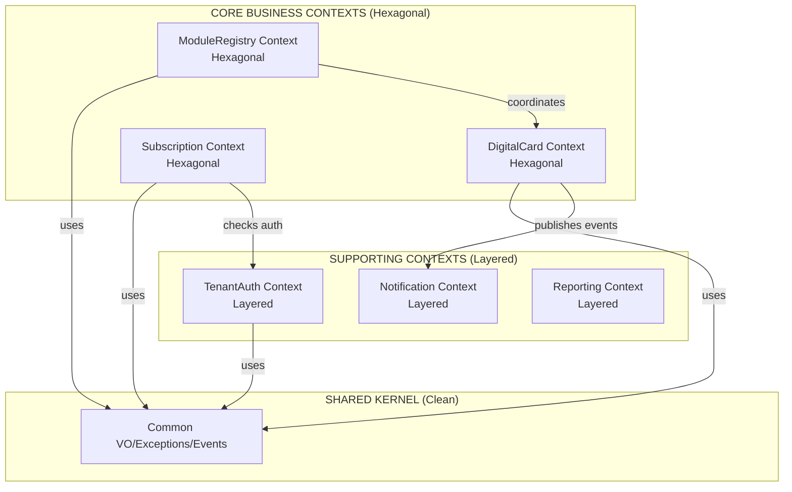

# **🏗️ ARCHITECTURE ANALYSIS & RECOMMENDATION**

## **📊 AS-SENIOR SOLUTION ARCHITECT ANALYSIS**

### **Current System Complexity Assessment:**
```yaml
Platform Complexity Level: ENTERPRISE
- Multi-tenant SaaS with physical database isolation
- 4+ Bounded Contexts (growing)
- Subscription-based monetization
- Module-based extensibility
- Production SLA requirements: 99.9%
- Team Size: 5-10 developers (present/future)
```

### **Architectural Constraints:**
1. **Must Scale:** Support 1000+ tenants with varying module combinations
2. **Must Maintain:** Tenant isolation as primary security boundary
3. **Must Evolve:** Add new modules without breaking existing ones
4. **Must Monetize:** Subscription enforcement at module level
5. **Must Perform:** Sub-200ms API responses at P95

---

## **🔍 ARCHITECTURE PATTERN EVALUATION**

### **Option 1: Hexagonal Architecture (Ports & Adapters)**
```yaml
Pros:
- Perfect isolation between business logic and infrastructure
- Easy to swap implementations (e.g., different payment providers)
- Testable - can mock all external dependencies
- Aligns with DDD's emphasis on domain purity
- Future-proof for evolving requirements

Cons:
- Higher initial complexity
- More boilerplate code
- Steeper learning curve for new developers
- Overkill if requirements are simple (they're not)
```

### **Option 2: Layered Architecture (Simplified)**
```yaml
Pros:
- Simpler to understand and implement
- Less boilerplate
- Faster initial development
- Familiar to Laravel developers

Cons:
- Leaky abstractions common
- Harder to maintain domain purity
- Difficult to swap implementations
- Testing more complex (more mocks needed)
- Scales poorly with complexity growth
```

### **Option 3: Clean Architecture (Hexagonal Variant)**
```yaml
Pros:
- Dependency rule: Inner layers don't know about outer layers
- Frameworks are replaceable details
- Business rules are testable without infrastructure
- Great for long-lived, evolving systems

Cons:
- Most complex of all options
- Steep learning curve
- Significant upfront investment
```

---

## **🎯 MY RECOMMENDATION: HYBRID APPROACH**

**Use Hexagonal Architecture for CORE contexts, Layered for supporting contexts.**

### **Architecture Decision Record (ADR-005):**
```yaml
Title: Hybrid Architecture Pattern Selection
Status: ACCEPTED
Context: Need balance between maintainability and development speed
Decision: Hexagonal for business-critical contexts, Layered for infrastructure contexts
Consequences:
  Pros:
    - Core business logic remains pure and testable
    - Faster development for non-critical components
    - Team can gradually learn Hexagonal patterns
    - Reduced boilerplate where it doesn't add value
  Cons:
    - Inconsistent patterns across codebase
    - Context switching for developers
    - Need clear boundaries defined
```

---

## **🏗️ OPTIMIZED ARCHITECTURE DESIGN**

### **1. Context-Specific Architecture Pattern:**



### **2. Hexagonal Architecture for DigitalCard Context:**

```
app/Contexts/DigitalCard/
├── Domain/                          # Inner Core
│   ├── Models/                      # Aggregates, Entities
│   ├── ValueObjects/                # CardId, MemberId, QRCode
│   ├── Repositories/                # Interface definitions
│   ├── Services/                    # Domain Services
│   └── Events/                      # Domain Events
│
├── Application/                     # Use Cases
│   ├── Ports/                       # Input/Output ports
│   │   ├── Input/
│   │   │   ├── CommandHandlers/     # Command handlers
│   │   │   └── QueryHandlers/       # Query handlers
│   │   └── Output/
│   │       ├── RepositoryPorts/     # Repository interfaces
│   │       └── EventPublisherPorts/ # Event publishing interfaces
│   │
│   ├── Services/                    # Application Services
│   └── DTOs/                        # Data Transfer Objects
│
└── Infrastructure/                  # Adapters (Outer Layer)
    ├── Adapters/
    │   ├── Input/
    │   │   ├── Controllers/         # HTTP Controllers
    │   │   └── Console/             # CLI Commands
    │   └── Output/
    │       ├── Persistence/         # Eloquent Repositories
    │       ├── Events/              # Event dispatchers
    │       └── ExternalServices/    # External API clients
    │
    ├── Database/
    │   ├── Migrations/
    │   ├── Eloquent/                # Eloquent Models
    │   └── Seeders/
    │
    └── External/                    # External system integrations
```

### **3. Simplified Layered for TenantAuth Context:**

```
app/Contexts/TenantAuth/
├── Http/
│   ├── Controllers/
│   ├── Middleware/
│   └── Requests/
│
├── Models/                          # Eloquent models
├── Services/                        # Service classes
├── Repositories/                    # Repository classes
├── Policies/                        # Authorization policies
└── Database/
    ├── Migrations/
    └── Seeders/
```

---

## **⚡ OPTIMIZED IMPLEMENTATION PLAN**

### **Phase 1: Foundation with Pragmatic Hexagonal**
```php
// app/Contexts/DigitalCard/Domain/Models/DigitalCard.php
// Pure PHP, no framework dependencies

// app/Contexts/DigitalCard/Application/Ports/Input/ActivateCardHandler.php
interface ActivateCardHandlerInterface
{
    public function handle(ActivateCardCommand $command): void;
}

// app/Contexts/DigitalCard/Infrastructure/Adapters/Input/ActivateCardHttpController.php
class ActivateCardHttpController extends Controller
{
    public function __construct(
        private ActivateCardHandlerInterface $handler  // Port injected
    ) {}
    
    public function __invoke(ActivateCardRequest $request): JsonResponse
    {
        $command = new ActivateCardCommand(
            tenantId: $request->route('tenant'),
            cardId: $request->input('card_id')
        );
        
        $this->handler->handle($command);
        
        return response()->json(['success' => true]);
    }
}
```

### **Phase 2: ModuleRegistry with Hexagonal Lite**
```php
// Keep it simpler than full Hexagonal but maintain key principles:

// 1. Domain layer pure PHP
// 2. Application layer with clear interfaces
// 3. Infrastructure layer with framework dependencies
// 4. Dependency injection for all dependencies

// app/Contexts/ModuleRegistry/Application/Services/ModuleInstaller.php
class ModuleInstaller
{
    public function __construct(
        // Port interfaces, not implementations
        private ModuleRepositoryInterface $moduleRepository,
        private SubscriptionVerifierInterface $subscriptionVerifier,
        private DatabaseMigratorInterface $migrator
    ) {}
    
    public function install(TenantId $tenantId, ModuleId $moduleId): void
    {
        // Business logic here
    }
}
```

### **Phase 3: Supporting Contexts Stay Simple**
```php
// app/Contexts/TenantAuth/Services/TenantResolver.php
class TenantResolver
{
    public function __construct(
        private TenantRepository $repository  // Concrete class OK here
    ) {}
    
    public function resolveFromRequest(Request $request): Tenant
    {
        // Simple implementation - no need for full Hexagonal
        return $this->repository->findBySubdomain(
            $request->route('tenant')
        );
    }
}
```

---

## **🔧 PRACTICAL IMPLEMENTATION RULES**

### **Rule 1: When to Use Hexagonal:**
```yaml
Use Hexagonal IF:
- Context contains complex business rules
- Context will have multiple implementations (e.g., different payment providers)
- Context needs to be framework-agnostic
- Testing business logic in isolation is critical
- Context is a revenue center (e.g., DigitalCard, Subscription)

Examples: DigitalCard, Subscription, ModuleRegistry
```

### **Rule 2: When to Use Layered:**
```yaml
Use Layered IF:
- Context is primarily CRUD operations
- No complex business rules
- Framework coupling is acceptable
- Rapid development is priority
- Context is a cost center (supporting function)

Examples: TenantAuth, Notification, Reporting, AuditLog
```

### **Rule 3: Shared Rules (Both Patterns):**
```yaml
Always:
- Use Dependency Injection
- Write unit tests
- Follow SOLID principles
- Use Value Objects for primitives
- Separate concerns clearly
- Document architectural decisions
```

---

## **🚀 OPTIMIZED MODULEREGISTRY IMPLEMENTATION**

### **Version 1: Hexagonal Lite (Recommended)**
```php
// app/Contexts/ModuleRegistry/Domain/Models/Module.php
class Module
{
    private function __construct(
        private ModuleId $id,
        private string $name,
        private Version $version,
        private array $dependencies
    ) {}
    
    public function canInstallOn(Tenant $tenant): bool
    {
        // Domain logic - pure PHP
        return $this->areDependenciesSatisfied($tenant);
    }
}

// app/Contexts/ModuleRegistry/Application/Services/ModuleInstallationOrchestrator.php
class ModuleInstallationOrchestrator
{
    public function __construct(
        private ModuleRepositoryInterface $moduleRepository,
        private TenantModuleRepositoryInterface $tenantModuleRepository,
        private ModuleInstallerFactoryInterface $installerFactory
    ) {}
    
    public function install(TenantId $tenantId, string $moduleName): void
    {
        // 1. Get module from repository (port)
        $module = $this->moduleRepository->findByName($moduleName);
        
        // 2. Check if already installed
        if ($this->tenantModuleRepository->isInstalled($tenantId, $module->getId())) {
            throw new ModuleAlreadyInstalledException();
        }
        
        // 3. Get module-specific installer via factory
        $installer = $this->installerFactory->createForModule($module);
        
        // 4. Run installation
        $installer->install($tenantId);
        
        // 5. Record installation
        $this->tenantModuleRepository->save(
            new TenantModule($tenantId, $module->getId(), $module->getVersion())
        );
    }
}

// app/Contexts/ModuleRegistry/Infrastructure/Adapters/Input/ModuleController.php
class ModuleController extends Controller
{
    public function __construct(
        private ModuleInstallationOrchestrator $orchestrator
    ) {}
    
    public function install(Request $request, string $moduleName): JsonResponse
    {
        $this->orchestrator->install(
            new TenantId($request->route('tenant')),
            $moduleName
        );
        
        return response()->json(['success' => true]);
    }
}
```

### **Key Optimizations:**
1. **No Over-Engineering:** Only ports/interfaces where they add value
2. **Pragmatic Testing:** Test business logic, mock external dependencies
3. **Progressive Enhancement:** Start simple, add complexity only when needed
4. **Team-Friendly:** Balance between purity and productivity

---

## **📈 COST-BENEFIT ANALYSIS**

| Aspect | Hexagonal Full | Hexagonal Lite | Layered |
|--------|----------------|----------------|---------|
| **Initial Development** | 3x slower | 1.5x slower | Fastest |
| **Maintenance Cost** | Lowest | Low | High |
| **Testability** | Excellent | Very Good | Good |
| **New Dev Onboarding** | Difficult | Moderate | Easy |
| **Long-term Scalability** | Best | Very Good | Poor |
| **Framework Coupling** | None | Minimal | High |
| **Team Productivity** | Low initially | Good | High initially |

**Conclusion:** Hexagonal Lite gives you 80% of benefits with 50% of complexity.

---

## **🎯 FINAL RECOMMENDATION**

**Implement ModuleRegistry using "Hexagonal Lite" pattern:**

### **Immediate Actions:**
1. **Create ModuleRegistry Context** with Domain/Application/Infrastructure layers
2. **Use interfaces for core dependencies** (repositories, external services)
3. **Keep Domain layer pure PHP** (no Laravel)
4. **Use concrete classes where appropriate** (simple services)
5. **Focus on dependency injection** for testability
6. **Document the pattern** for team consistency

### **Implementation Command:**
```bash
# Create ModuleRegistry with optimized structure
php artisan make:context ModuleRegistry --domain --hexagonal-lite

# This would create:
# Domain/ - Pure PHP business logic
# Application/ - Use cases with selective interfaces
# Infrastructure/ - Framework-dependent adapters
# Tests/ - Comprehensive test suite
```

### **Success Metrics:**
- ✅ Business logic testable without Laravel
- ✅ Can swap implementations (e.g., different module stores)
- ✅ New developers can contribute in 2-3 days
- ✅ Adding new module type takes < 1 week
- ✅ Zero framework dependencies in Domain layer

---

## **🏁 TL;DR**

**Use "Hexagonal Lite" - a pragmatic adaptation that gives you the isolation and testability benefits of Hexagonal without the full complexity burden.**

This approach:
1. **Protects your business logic** from framework changes
2. **Maintains testability** of core functionality
3. **Keeps development velocity** high
4. **Scales gracefully** as your platform grows
5. **Is team-friendly** for Laravel developers learning DDD

**Start with Hexagonal Lite for ModuleRegistry, refine based on learnings, and apply the same pattern to other business-critical contexts.**