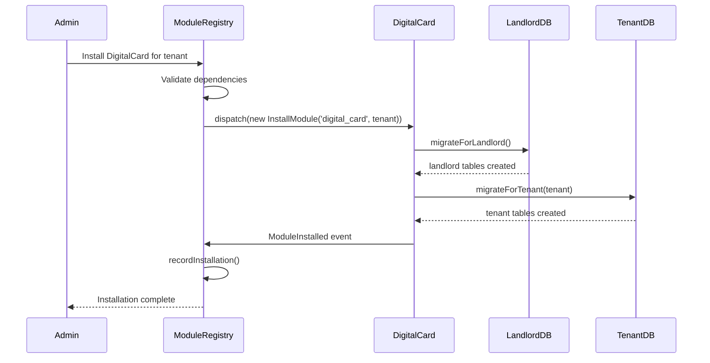

# 🏗️ **SENIOR SOLUTION ARCHITECT REVIEW**

## 🔍 **CRITICAL FLAW IDENTIFIED IN PREVIOUS ARCHITECTURE**

**The fundamental problem:** My previous design **violates Context Independence** by having ModuleRegistry context responsible for migrating **other contexts'** tables.

### **❌ WRONG APPROACH (Previous Design):**
```
ModuleRegistry Command → Migrates DigitalCard tables
    (Context A)              (Context B's tables!)
```

**This creates:**
1. **Circular dependencies** - ModuleRegistry needs to know about DigitalCard's schema
2. **Tight coupling** - Changes in DigitalCard break ModuleRegistry
3. **Violates Bounded Contexts** - Each context should own its migrations
4. **Maintenance nightmare** - Centralized migration logic

---

## ✅ **CORRECT ARCHITECTURE: DECENTRALIZED MIGRATION**

### **Principle:** **Each Context Owns Its Own Migrations**

```
┌─────────────────┐    ┌─────────────────┐    ┌─────────────────┐
│  ModuleRegistry │    │   DigitalCard   │    │    Calendar     │
│    Context      │    │    Context      │    │    Context      │
├─────────────────┤    ├─────────────────┤    ├─────────────────┤
│• modules table  │    │• digital_cards  │    │• events table   │
│• tenant_modules │    │• card_templates │    │• calendars      │
│  (landlord)     │    │  (tenant)       │    │  (tenant)       │
│                 │    │• global_config  │    │• global_config  │
│                 │    │  (landlord)     │    │  (landlord)     │
└─────────────────┘    └─────────────────┘    └─────────────────┘
        │                       │                       │
        └───────────────────────┼───────────────────────┘
                                │
                         Installation Trigger
                          (ModuleRegistry API)
```

---

## 🎯 **NEW ARCHITECTURE: EVENT-DRIVEN MIGRATION**

### **Step 1: ModuleRegistry Only Manages Catalog**
```php
// ModuleRegistry ONLY knows about:
namespace App\Contexts\ModuleRegistry\Domain\Models;

class Module 
{
    private ModuleId $id;
    private ModuleName $name;
    private MigrationPaths $migrationPaths; // Just paths, not logic
    
    public function migrationPaths(): MigrationPaths
    {
        return new MigrationPaths(
            landlord: 'app/Contexts/DigitalCard/Infrastructure/Database/Migrations/Landlord',
            tenant: 'app/Contexts/DigitalCard/Infrastructure/Database/Migrations/Tenant'
        );
    }
    
    // NO migration logic here!
}
```

### **Step 2: Each Context Provides Its Own Migrator**
```php
// DigitalCard Context provides its OWN migrator
namespace App\Contexts\DigitalCard\Application\Services;

class DigitalCardMigrator
{
    public function migrateForLandlord(): void
    {
        // Runs DigitalCard's landlord migrations
        $migrator = app('migrator');
        $migrator->run([
            base_path('app/Contexts/DigitalCard/Infrastructure/Database/Migrations/Landlord')
        ]);
    }
    
    public function migrateForTenant(string $tenantSlug): void
    {
        // Switch to tenant database
        DB::setDefaultConnection("tenant_{$tenantSlug}");
        
        // Runs DigitalCard's tenant migrations
        $migrator = app('migrator');
        $migrator->run([
            base_path('app/Contexts/DigitalCard/Infrastructure/Database/Migrations/Tenant')
        ]);
    }
}
```

### **Step 3: ModuleRegistry Discovers & Triggers (NOT Executes)**
```php
// ModuleRegistry Service (orchestrator, not executor)
class ModuleInstallationService
{
    public function installModule(string $moduleName, string $tenantSlug): void
    {
        // 1. Get module from catalog
        $module = $this->moduleRepository->findByName($moduleName);
        
        // 2. Discover module's migrator class
        $migratorClass = $this->discoverMigrator($moduleName);
        // e.g., "App\Contexts\DigitalCard\Application\Services\DigitalCardMigrator"
        
        // 3. Instantiate migrator (DI container)
        $migrator = app($migratorClass);
        
        // 4. Trigger migrations (module's own responsibility)
        $migrator->migrateForLandlord();
        $migrator->migrateForTenant($tenantSlug);
        
        // 5. Record installation
        $this->recordInstallation($module, $tenantSlug);
    }
    
    private function discoverMigrator(string $moduleName): string
    {
        // Convention over configuration
        $namespace = "App\\Contexts\\" . ucfirst($moduleName);
        return "{$namespace}\\Application\\Services\\{$moduleName}Migrator";
    }
}
```

---

## 🚀 **BEST SOLUTION: PLUGGABLE MIGRATION INTERFACE**

### **1. Define Migration Contract (Shared Kernel)**
```php
// In Shared Kernel (minimal, stable interface)
namespace App\Shared\Contracts;

interface ModuleMigratorInterface
{
    public function migrateForLandlord(): void;
    public function migrateForTenant(string $tenantSlug): void;
    public function rollbackForLandlord(): void;
    public function rollbackForTenant(string $tenantSlug): void;
}
```

### **2. Each Context Implements Its Own**
```php
// DigitalCard Context
namespace App\Contexts\DigitalCard\Application\Services;

use App\Shared\Contracts\ModuleMigratorInterface;

class DigitalCardMigrator implements ModuleMigratorInterface
{
    public function migrateForLandlord(): void
    {
        // DigitalCard's specific landlord migrations
        $this->runMigrations('landlord');
    }
    
    public function migrateForTenant(string $tenantSlug): void
    {
        DB::setDefaultConnection("tenant_{$tenantSlug}");
        $this->runMigrations('tenant');
    }
    
    private function runMigrations(string $scope): void
    {
        $path = "app/Contexts/DigitalCard/Infrastructure/Database/Migrations/{$scope}";
        $migrator = app('migrator');
        $migrator->run([base_path($path)]);
    }
}
```

### **3. Auto-Discovery & Registration**
```php
// ModuleRegistry uses Laravel's Service Container
class ModuleRegistryServiceProvider extends ServiceProvider
{
    public function register(): void
    {
        // Auto-bind migrators
        $this->app->bind(
            'module.migrator.digital_card',
            \App\Contexts\DigitalCard\Application\Services\DigitalCardMigrator::class
        );
        
        $this->app->bind(
            'module.migrator.calendar', 
            \App\Contexts\Calendar\Application\Services\CalendarMigrator::class
        );
        
        // Or dynamic discovery:
        $this->discoverAndRegisterMigrators();
    }
    
    private function discoverAndRegisterMigrators(): void
    {
        foreach ($this->getInstalledModules() as $module) {
            $migratorClass = "App\\Contexts\\{$module}\\Application\\Services\\{$module}Migrator";
            
            if (class_exists($migratorClass)) {
                $this->app->bind("module.migrator.{$module}", $migratorClass);
            }
        }
    }
}
```

---

## 📋 **CONTEXT-INDEPENDENT COMMAND STRUCTURE**

### **Option A: Central Command with Plugins (Recommended)**
```php
// In ModuleRegistry Context (orchestrates, doesn't execute)
class ModuleMigrateCommand extends Command
{
    protected $signature = 'module:migrate 
                            {module : Module name}
                            {--tenant= : Tenant slug}
                            {--all : All tenants}
                            {--scope=all : landlord|tenant|all}';
    
    public function handle(ModuleMigratorFactory $factory)
    {
        $module = $this->argument('module');
        
        // Get the module's OWN migrator
        $migrator = $factory->getMigratorForModule($module);
        
        if ($this->option('scope') === 'landlord' || $this->option('scope') === 'all') {
            $migrator->migrateForLandlord();
            $this->info("✓ {$module} landlord migrations completed");
        }
        
        if ($this->tenantSpecified() && $this->option('scope') !== 'landlord') {
            $migrator->migrateForTenant($this->getTenantSlug());
            $this->info("✓ {$module} tenant migrations completed");
        }
    }
}
```

### **Option B: Each Context Has Its Own Command (More Decoupled)**
```bash
# ModuleRegistry command (for catalog tables)
php artisan module-registry:migrate

# DigitalCard command (for its own tables)
php artisan digital-card:migrate --tenant=acme

# Calendar command (for its own tables)  
php artisan calendar:migrate --tenant=acme
```

**Better:** **Option A with plugins** - Single entry point but delegating execution.

---

## 🏗️ **DATABASE RESPONSIBILITY MATRIX**

| Component | Landlord Tables | Tenant Tables | Migration Logic |
|-----------|-----------------|---------------|-----------------|
| **ModuleRegistry** | `modules`, `tenant_modules` | None | Own migrator in ModuleRegistry context |
| **DigitalCard** | `digital_card_global_config` | `digital_cards`, `card_templates` | Own migrator in DigitalCard context |
| **Calendar** | `calendar_global_config` | `events`, `calendars` | Own migrator in Calendar context |
| **UserManagement** | `users` (platform) | `user_profiles` (tenant) | Own migrator in UserManagement context |

**Rule:** **Each context migrates its own tables, in its own databases.**

---

## 🔧 **IMPLEMENTATION BLUEPRINT**

### **1. Shared Kernel (Minimal)**
```php
// packages/laravel-backend/app/Shared/
├── Contracts/
│   └── ModuleMigratorInterface.php
└── Kernel.php
```

### **2. ModuleRegistry Context (Orchestrator)**
```php
// packages/laravel-backend/app/Contexts/ModuleRegistry/
├── Application/
│   ├── Commands/
│   │   └── ModuleMigrateCommand.php      # Orchestrates others
│   └── Services/
│       ├── ModuleMigratorFactory.php     # Discovers migrators
│       └── ModuleInstallationService.php # Triggers migrations
├── Infrastructure/
│   └── Database/
│       └── Migrations/
│           ├── landlord/                  # OWN landlord tables
│           │   ├── create_modules_table.php
│           │   └── create_tenant_modules_table.php
│           └── tenant/                    # OWN tenant tables (if any)
│               └── (none - ModuleRegistry is landlord-only)
└── Application/Services/
    └── ModuleRegistryMigrator.php        # Migrates OWN tables
```

### **3. DigitalCard Context (Self-contained)**
```php
// packages/laravel-backend/app/Contexts/DigitalCard/
├── Application/
│   └── Services/
│       └── DigitalCardMigrator.php       # Migrates OWN tables
├── Infrastructure/
│   └── Database/
│       └── Migrations/
│           ├── landlord/
│           │   └── create_digital_card_global_config.php
│           └── tenant/
│               ├── create_digital_cards_table.php
│               └── create_card_templates_table.php
└── (No knowledge of ModuleRegistry migrators)
```

### **4. Registration (Auto-discovery)**
```php
// In each context's ServiceProvider
class DigitalCardServiceProvider extends ServiceProvider
{
    public function register(): void
    {
        // Register OUR migrator
        $this->app->singleton(
            \App\Contexts\DigitalCard\Application\Services\DigitalCardMigrator::class
        );
        
        // Tag it for discovery
        $this->app->tag(
            \App\Contexts\DigitalCard\Application\Services\DigitalCardMigrator::class,
            ['module.migrator']
        );
    }
}
```

---

## 🎯 **EVENT-DRIVEN INSTALLATION FLOW**



---

## 💡 **INNOVATION: MIGRATION "BLUEPRINTS"**

### **Module Exports Migration Blueprint:**
```php
// DigitalCard defines WHAT to migrate, not HOW
class DigitalCardMigrationBlueprint
{
    public static function getLandlordMigrations(): array
    {
        return [
            'create_digital_card_global_config' => [
                'table' => 'digital_card_global_config',
                'columns' => [
                    'id', 'key', 'value', 'created_at', 'updated_at'
                ],
                'indexes' => ['key'],
                'description' => 'Global DigitalCard settings'
            ]
        ];
    }
    
    public static function getTenantMigrations(): array
    {
        return [
            'create_digital_cards_table' => [
                'table' => 'digital_cards',
                'columns' => [
                    'id', 'tenant_id', 'user_id', 'name', 'content', 
                    'created_at', 'updated_at'
                ],
                'foreign_keys' => [
                    'tenant_id' => 'tenants.id',
                    'user_id' => 'users.id'
                ]
            ]
        ];
    }
}
```

### **ModuleRegistry Executes Blueprint:**
```php
class BlueprintExecutor
{
    public function execute(string $module, array $blueprint, string $connection): void
    {
        foreach ($blueprint as $migrationName => $spec) {
            Schema::connection($connection)->create($spec['table'], function ($table) use ($spec) {
                // Build table from blueprint
                foreach ($spec['columns'] as $column) {
                    $this->addColumn($table, $column);
                }
                
                // Add indexes, foreign keys, etc.
            });
        }
    }
}
```

**This keeps control in each context but allows centralized execution if needed.**

---

## 🏆 **SENIOR ARCHITECT RECOMMENDATION:**

**Choose: Event-Driven with Pluggable Migrators**

### **Why This Wins:**

1. ✅ **Context Independence** - Each context owns its migrations
2. ✅ **No Circular Dependencies** - ModuleRegistry doesn't know other contexts' schemas
3. ✅ **Plug-and-Play** - New contexts can be added without modifying ModuleRegistry
4. ✅ **Maintainable** - Changes in DigitalCard don't break ModuleRegistry
5. ✅ **Testable** - Each migrator can be tested independently
6. ✅ **Scalable** - Hundreds of contexts possible

### **Implementation Order:**

1. **Define `ModuleMigratorInterface`** in Shared Kernel
2. **Each context implements** its own migrator
3. **ModuleRegistry provides** discovery/orchestration
4. **Single `module:migrate` command** that delegates
5. **Event system** for loose coupling

**This is the correct hexagonal/DDD approach.** Each bounded context is truly independent, owning its domain logic, data schema, and migration responsibilities.