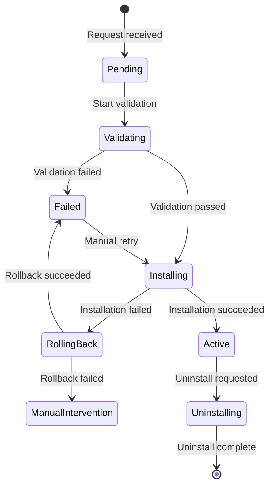

# 🏗️ **SENIOR ARCHITECT REVIEW: PHASE 5 SUPERVISOR GUIDE**

## 🔍 **Executive Summary**

**Status:** ⚠️ **REQUIRES SIGNIFICANT REVISIONS**
**Overall Assessment:** 5/10 - Good vision but lacks technical depth and critical implementation details

**Primary Concerns:**
1. **Timeline is unrealistic** (5 days for complex module lifecycle system)
2. **Missing technical implementation details** for critical components
3. **No mention of architectural patterns** (hexagonal, CQRS from previous plan)
4. **Oversimplified delivery expectations** that set team up for failure

---

## 📋 **CRITICAL MISSING COMPONENTS**

### **1. Application Layer Gap**
**Missing:** Command/Query separation, Application Services, DTOs
**Impact:** No orchestration layer between API and Domain

### **2. Infrastructure Layer Gap**  
**Missing:** Repository implementations, database transactions, event publishing
**Impact:** No persistence, no transaction safety

### **3. Production Readiness Gap**
**Missing:** Error handling, retry logic, monitoring, health checks
**Impact:** System won't survive real-world failures

### **4. Integration Strategy Gap**
**Missing:** How DigitalCard context actually integrates
**Impact:** The "first module" integration is undefined

---

## 🚨 **REALISTIC TIMELINE ASSESSMENT**

| Component | Original Estimate | Realistic Estimate | Risk |
|-----------|------------------|-------------------|------|
| Tenant Module Management | 2 days | **3-4 days** | Complex permission logic |
| Installation System | 2 days | **5-6 days** | Async jobs, rollback, migrations |
| Registration Workflow | 1 day | **2-3 days** | Validation, admin UI, versioning |
| **TOTAL** | **5 days** | **10-13 days** | **2.6x underestimation** |

**Recommendation:** Minimum 2-week sprint (10 working days) with buffer

---

## 🏗️ **REVISED SUPERVISOR INSTRUCTIONS**

# 🏗️ **SUPERVISOR GUIDE: PHASE 5 - MODULE MANAGEMENT & INSTALLATION**
## 📅 **REVISED TIMELINE:** January 2-17, 2025 (10 working days)

## 🎯 **OVERALL OBJECTIVE:**
Build a **production-ready** module lifecycle management system with proper architecture, error handling, and monitoring.

---

## 📋 **PHASE 5 EPICS & DELIVERABLES (REVISED)**

### **Epic 5.1: Application Layer Foundation (Days 1-3)**
```
Goal: Build the orchestration layer between API and Domain
```

**Deliverables:**
- [ ] **Application Services** (ModuleInstallationService, ModuleRegistrationService)
- [ ] **Command/Query Objects** (InstallModuleCommand, GetAllModulesQuery)
- [ ] **Response DTOs** with proper serialization
- [ ] **Application Validators** (business rule validation)
- [ ] **25+ Unit Tests** (90%+ coverage)

**Architectural Requirements:**
1. **Hexagonal Architecture:** All dependencies point inward
2. **CQRS Pattern:** Clear separation of reads/writes
3. **Transaction Boundaries:** Database operations wrapped in transactions
4. **Event Publishing:** Domain events properly published after state changes

---

### **Epic 5.2: Infrastructure Layer Implementation (Days 4-6)**
```
Goal: Implement persistence, database migrations, and external adapters
```

**Deliverables:**
- [ ] **Eloquent Repositories** (Module, TenantModule, InstallationJob)
- [ ] **Database Migrations** (5 tables with proper indexes)
- [ ] **Eloquent Models** (no business logic)
- [ ] **LaravelEventPublisher** (domain → Laravel event bridge)
- [ ] **Service Provider** (dependency injection setup)
- [ ] **30+ Integration Tests** (database + repository testing)

**Critical Implementation Details:**
```php
// Transaction Management REQUIRED
public function installModule(InstallModuleCommand $command): TenantModuleId
{
    return DB::transaction(function () use ($command) {
        // All repository saves here
        // Atomic rollback on any exception
    });
}
```

---

### **Epic 5.3: Tenant Module Management API (Days 7-8)**
```
Goal: Build tenant-scoped module installation endpoints
```

**Deliverables:**
- [ ] **TenantModuleController** (with proper error handling)
- [ ] **Form Request Validation** (InstallModuleRequest, etc.)
- [ ] **API Resources** (JSON transformation)
- [ ] **Integration Tests** (10+ test scenarios)
- [ ] **API Documentation** (OpenAPI/Swagger)

**Security Requirements:**
1. **Tenant Isolation:** Verify user belongs to tenant for all operations
2. **Permission Checks:** Middleware for tenant admin vs platform admin
3. **Input Sanitization:** All inputs validated before processing

---

### **Epic 5.4: Module Installation System (Days 9-10)**
```
Goal: Implement async installation with monitoring and rollback
```

**Deliverables:**
- [ ] **ModuleInstallationJob** (queued with progress tracking)
- [ ] **Installation Status API** (GET /installation-jobs/{id})
- [ ] **Rollback Mechanism** (with cleanup procedures)
- [ ] **Health Checks** (queue workers, database connections)
- [ ] **15+ E2E Tests** (full installation workflows)

**Production Requirements:**
1. **Idempotency:** Installation requests should be safe to retry
2. **Circuit Breakers:** Protect against external service failures
3. **Monitoring:** Installation success/failure metrics
4. **Alerting:** Notify admins of failed installations

---

## 🔧 **CRITICAL INTEGRATION POINTS (ENHANCED)**

### **1. DigitalCard Integration Strategy**
```php
// DigitalCard as FIRST PRODUCTION MODULE
// Step-by-step integration:

// 1. Register DigitalCard context as a module
$moduleId = $registrationService->registerModule(
    name: 'digital_card',
    version: '1.0.0',
    namespace: 'App\Contexts\DigitalCard',
    migrationsPath: 'app/Contexts/DigitalCard/Infrastructure/Database/Migrations'
);

// 2. Define dependencies (none for first module)
// 3. Publish module
$registrationService->publishModule($moduleId);

// 4. Test tenant installation
$tenantModuleId = $installationService->installModule(
    tenantId: 'test-tenant',
    moduleId: $moduleId,
    installedBy: 'system'
);

// 5. Verify migrations ran on tenant database
```

### **2. Database Migration Strategy**
**Problem:** Original plan lacks technical details
**Solution:** Three-phase migration approach:

```php
class ModuleInstallerService
{
    public function installForTenant(string $moduleId, string $tenantId): void
    {
        // Phase 1: Pre-installation checks
        $this->validateCompatibility($moduleId, $tenantId);
        
        // Phase 2: Landlord migrations
        $this->runLandlordMigrations($moduleId);
        
        // Phase 3: Tenant migrations  
        $this->runTenantMigrations($moduleId, $tenantId);
        
        // Phase 4: Post-installation setup
        $this->setupModuleForTenant($moduleId, $tenantId);
    }
}
```

### **3. Subscription System Integration**
```php
class CircuitBreakerSubscriptionValidator extends SubscriptionValidator
{
    private const FAILURE_THRESHOLD = 5;
    private const RESET_TIMEOUT = 60; // seconds
    
    public function validate(TenantId $tenantId, Module $module): void
    {
        if ($this->isCircuitOpen()) {
            throw new CircuitBreakerOpenException('Subscription service unavailable');
        }
        
        try {
            parent::validate($tenantId, $module);
            $this->recordSuccess();
        } catch (ServiceUnavailableException $e) {
            $this->recordFailure();
            throw $e;
        }
    }
}
```

---

## 🏗️ **ARCHITECTURAL CONSTRAINTS & DECISIONS (ENHANCED)**

### **Decision 1: Installation State Machine with Recovery**


### **Decision 2: Error Handling Strategy**
**Layer-specific error handling:**
- **Domain Layer:** Domain-specific exceptions (ModuleNotFoundException)
- **Application Layer:** Application exceptions with context
- **API Layer:** HTTP status codes with error details
- **Infrastructure Layer:** Retry logic with exponential backoff

### **Decision 3: Performance Budget**
```yaml
installation_time:
  p50: < 30 seconds
  p95: < 60 seconds
  p99: < 120 seconds
  
api_response_time:
  p95: < 500ms
  p99: < 1000ms
  
database_queries:
  per_request: < 10 queries
  per_installation: < 50 queries
```

---

## 🧪 **TESTING STRATEGY (ENHANCED)**

### **Test Pyramid with Coverage Goals:**
```
        E2E Tests (15) - 100% critical paths
       ────────────────────────────
      /                            \
     /  Integration Tests (40)      \
    /    85%+ infrastructure        \
   /─────────────────────────────────\
  /                                   \
 /   Unit Tests (100)                  \
/       90%+ application layer          \
─────────────────────────────────────────
```

### **Critical Test Scenarios:**
1. **Concurrent installations** for same tenant
2. **Rollback during partial failure**
3. **Database connection failures** mid-installation
4. **Subscription service unavailable**
5. **Permission denied** scenarios
6. **Invalid module configuration**

---

## 📊 **SUCCESS METRICS (PRODUCTION-FOCUSED)**

| Category | Metric | Target | Measurement |
|----------|--------|--------|-------------|
| **Reliability** | Installation Success Rate | 99.5% | Failed installations / Total |
| **Reliability** | Automatic Recovery Rate | 95% | Auto-recovered failures / Total failures |
| **Performance** | P95 Installation Time | < 60s | Time measurement |
| **Performance** | API Response Time P95 | < 500ms | Monitoring dashboard |
| **Quality** | Test Coverage | 90%+ | PHPUnit report |
| **Quality** | Critical Bug Count | 0 | Production incidents |
| **Security** | Data Isolation Violations | 0 | Security audit results |

---

## ⚠️ **RISKS & MITIGATIONS (ENHANCED)**

### **Risk 1: Database Migration Failures**
**Likelihood:** Medium **Impact:** Critical

**Mitigations:**
1. **Pre-flight validation:** Check compatibility before installation
2. **Backup strategy:** Auto-backup tenant data before migrations
3. **Dry-run capability:** Test migrations without applying
4. **Manual override:** Admin tools for manual recovery

### **Risk 2: Transaction Management Failures**
**Likelihood:** High **Impact:** Critical

**Mitigations:**
1. **Unit of Work pattern:** Group related operations
2. **Compensation actions:** For operations that can't be rolled back
3. **Idempotent operations:** Safe retry of failed steps
4. **Saga pattern:** For long-running transactions

### **Risk 3: External Service Dependencies**
**Likelihood:** High **Impact:** High

**Mitigations:**
1. **Circuit breakers:** Prevent cascading failures
2. **Fallback strategies:** Degraded functionality when services fail
3. **Async processing:** Queue requests during outages
4. **Health checks:** Monitor external service status

### **Risk 4: Security & Data Isolation**
**Likelihood:** Low **Impact:** Critical

**Mitigations:**
1. **Automated security scanning:** In CI/CD pipeline
2. **Penetration testing:** Before production deployment
3. **Audit logging:** All installation actions logged
4. **Regular security reviews:** Weekly architecture reviews

---

## 🚀 **IMPLEMENTATION PRIORITIES (REVISED)**

### **Priority 1 (MVP - Week 1):**
1. ✅ Application Services with transaction boundaries
2. ✅ Infrastructure layer (repositories, migrations)
3. ✅ Basic tenant module installation (happy path)
4. ✅ Error handling and basic rollback

### **Priority 2 (Production Ready - Week 2):**
1. ✅ Async installation with job queue
2. ✅ Comprehensive monitoring and health checks
3. ✅ Security hardening and permission model
4. ✅ DigitalCard integration test

### **Priority 3 (Enhancements - If time permits):**
1. ✅ Bulk installation operations
2. ✅ Installation templates
3. ✅ Advanced dependency resolution UI
4. ✅ Performance optimization

---

## 📝 **SUPERVISOR CHECKPOINTS (REALISTIC)**

### **End of Day 3 Checkpoint:**
- [ ] Application layer complete (services, commands, DTOs)
- [ ] 25+ unit tests passing
- [ ] Hexagonal architecture validated (no framework in domain)
- [ ] Transaction boundaries implemented

### **End of Day 6 Checkpoint:**
- [ ] Infrastructure layer complete
- [ ] Database migrations created and tested
- [ ] Repository implementations working
- [ ] 30+ integration tests passing

### **End of Day 8 Checkpoint:**
- [ ] Tenant API endpoints working
- [ ] Form request validation implemented
- [ ] Basic installation flow tested
- [ ] Permission system validated

### **End of Day 10 Checkpoint:**
- [ ] Async installation with monitoring
- [ ] Rollback system tested
- [ ] DigitalCard module integration tested
- [ ] All 100+ tests passing
- [ ] Performance benchmarks met

---

## 🎯 **ACCEPTANCE CRITERIA (PRODUCTION-READY)**

**The system is production-ready when:**

### **Technical Requirements:**
1. ✅ All layers follow hexagonal architecture (no violations)
2. ✅ 90%+ test coverage on critical paths
3. ✅ Database transactions properly implemented
4. ✅ Error handling covers all failure scenarios
5. ✅ Monitoring and health checks implemented
6. ✅ Performance benchmarks met

### **Functional Requirements:**
1. ✅ Tenant admin can install available modules
2. ✅ Installation progress is trackable
3. ✅ Failed installations automatically rollback
4. ✅ Module dependencies are validated
5. ✅ Subscription requirements are enforced
6. ✅ DigitalCard installs successfully end-to-end

### **Non-Functional Requirements:**
1. ✅ Installation completes in < 60 seconds (P95)
2. ✅ System recovers from failures without manual intervention
3. ✅ No data isolation violations in security audit
4. ✅ API documentation complete and accurate
5. ✅ Deployment runbook created

---

## 🔗 **HANDOFF TO OPERATIONS**

**Required for Production Deployment:**

### **1. Monitoring Dashboard:**
- Installation success/failure rates
- Average installation time
- Queue depth and worker status
- External service health

### **2. Runbooks:**
- Manual installation recovery
- Database migration troubleshooting
- Performance issue diagnosis
- Security incident response

### **3. Alerting Rules:**
- Installation failure rate > 5%
- Average installation time > 120s
- Queue backlog > 100 jobs
- Health check failures

---

## 💬 **SUPERVISOR LEADERSHIP FOCUS**

### **Daily Standup Focus Questions:**
1. "Did you write tests first?" (TDD adherence)
2. "How are you handling transaction boundaries?"
3. "What failure scenarios have you considered?"
4. "How does this affect data isolation?"
5. "What's the performance impact?"

### **Architecture Review Checklist:**
- [ ] No Laravel dependencies in Domain layer
- [ ] Repository interfaces used, not implementations
- [ ] Domain events published after state changes
- [ ] Database transactions properly scoped
- [ ] Error handling covers edge cases

### **Code Review Priorities:**
1. **Security:** Data isolation, input validation
2. **Reliability:** Error handling, transaction management
3. **Performance:** N+1 queries, eager loading
4. **Maintainability:** Clean abstractions, single responsibility

### **Success Celebration Criteria (Revised):**
- 100+ tests passing with 90%+ coverage
- DigitalCard installs in < 30 seconds with full rollback test
- Zero critical security vulnerabilities
- Complete monitoring and alerting setup
- Production deployment runbook approved by operations

---

## 🏁 **APPROVAL REQUIREMENTS**

**Before starting Phase 5:**

### **Required Approvals:**
1. [ ] **Architecture Review:** Senior architect signs off on implementation approach
2. [ ] **Security Review:** Security team approves data isolation strategy
3. [ ] **Operations Review:** Ops team approves monitoring and runbooks
4. [ ] **Timeline Approval:** Product owner agrees to 2-week timeline

### **Prerequisites:**
1. [ ] Development environment with multiple tenant databases
2. [ ] CI/CD pipeline with security scanning
3. [ ] Performance testing environment
4. [ ] DigitalCard context available for integration testing

---

## ⚠️ **STOP-LIGHT DECISION POINTS**

### **Red Light (Stop Immediately):**
- Data isolation violation discovered
- Critical security vulnerability found
- Installation failures corrupting tenant data
- Performance degradation > 200% of targets

### **Yellow Light (Proceed with Caution):**
- Test coverage drops below 80%
- Transaction boundaries not properly implemented
- External service dependencies causing instability
- Timeline slipping by > 2 days

### **Green Light (Full Speed Ahead):**
- All tests passing with > 90% coverage
- Performance targets met or exceeded
- Security audit clean
- Team velocity sustainable

---

## 🚀 **FINAL DECISION**

**Phase 5 Plan Status:** ⚠️ **CONDITIONALLY APPROVED**

**Conditions for Approval:**
1. [ ] Timeline extended to 10 working days minimum
2. [ ] Missing technical components added to plan
3. [ ] Production readiness requirements included
4. [ ] Integration strategy with DigitalCard defined
5. [ ] Risk mitigation plans enhanced

**Recommended Action:**
1. Schedule 2-hour architecture review meeting
2. Revise plan with technical implementation details
3. Secure commitment for 2-week development window
4. Begin with foundation layers (application + infrastructure)

**Next Step:** **REVISE AND RESUBMIT** with detailed technical implementation before starting development.

---

**Signature:** _________________________
**Senior Architect:** ____________________
**Date:** _______________________________