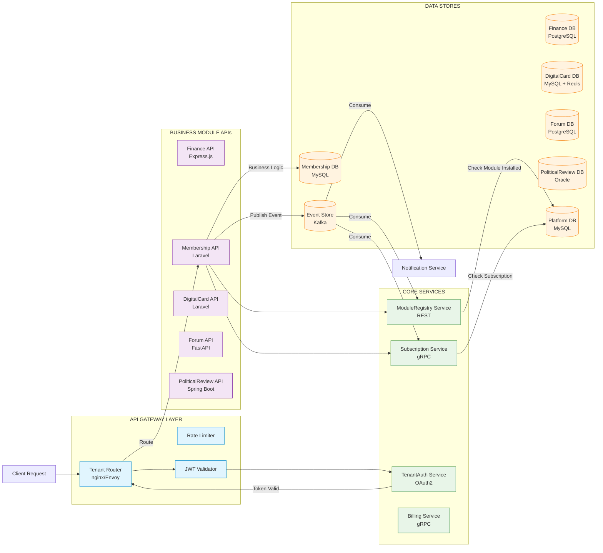
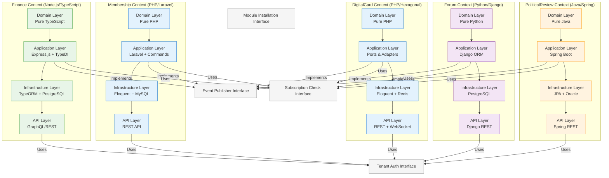
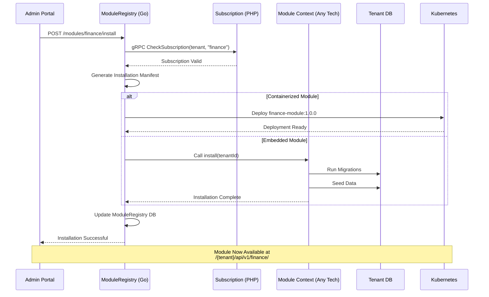
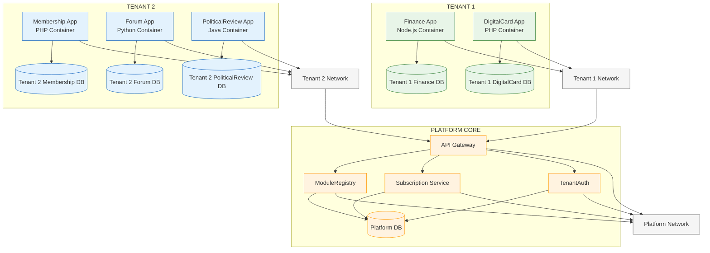
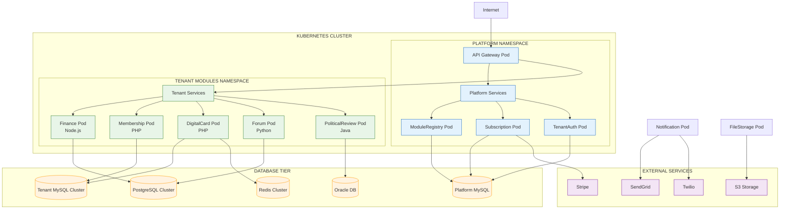

# **🏗️ MULTI-CONTEXT PLATFORM ARCHITECTURE**

## **📊 ENTERPRISE CONTEXT MAP**

```mermaid
graph TB
    subgraph "PLATFORM INFRASTRUCTURE (Shared Kernel)"
        SK1[Event Bus]
        SK2[Message Queue]
        SK3[API Gateway]
        SK4[Service Registry]
        SK5[Tenant Router]
    end

    subgraph "BUSINESS MODULE CONTEXTS (Installable)"
        BC1[Finance Context<br/>Node.js + PostgreSQL]
        BC2[Membership Context<br/>PHP/Laravel + MySQL]
        BC3[DigitalCard Context<br/>PHP + Laravel + Redis]
        BC4[Forum Context<br/>Python/Django + PostgreSQL]
        BC5[PoliticalReview Context<br/>Java/Spring + Oracle]
    end

    subgraph "PLATFORM CORE CONTEXTS"
        PC1[Subscription Context<br/>PHP/Laravel + Stripe]
        PC2[ModuleRegistry Context<br/>Go + MySQL]
        PC3[TenantAuth Context<br/>PHP/Laravel + JWT]
        PC4[Billing Context<br/>Node.js + Stripe]
    end

    subgraph "SUPPORTING CONTEXTS"
        SC1[Notification Context<br/>Node.js + Firebase]
        SC2[Reporting Context<br/>Python + BigQuery]
        SC3[AuditLog Context<br/>Go + Elasticsearch]
        SC4[FileStorage Context<br/>Go + S3/MinIO]
    end

    subgraph "EXTERNAL SYSTEMS"
        EXT1[Payment Gateways<br/>Stripe/PayPal]
        EXT2[Email Services<br/>SendGrid/Mailgun]
        EXT3[SMSServices<br/>Twilio]
        EXT4[Analytics<br/>Google Analytics/Mixpanel]
    end

    %% CORE COMMUNICATION PATHS
    SK3 -->|Routes to| BC1
    SK3 -->|Routes to| BC2
    SK3 -->|Routes to| BC3
    SK3 -->|Routes to| BC4
    SK3 -->|Routes to| BC5

    %% MODULE REGISTRY COORDINATION
    PC2 -->|Discovers| BC1
    PC2 -->|Discovers| BC2
    PC2 -->|Discovers| BC3
    PC2 -->|Discovers| BC4
    PC2 -->|Discovers| BC5

    %% SUBSCRIPTION ENFORCEMENT
    PC1 -->|Authorizes| BC1
    PC1 -->|Authorizes| BC2
    PC1 -->|Authorizes| BC3
    PC1 -->|Authorizes| BC4
    PC1 -->|Authorizes| BC5

    %% EVENT-BASED COMMUNICATION
    BC1 -->|Publishes| SK1
    BC2 -->|Publishes| SK1
    BC3 -->|Publishes| SK1
    BC4 -->|Publishes| SK1
    BC5 -->|Publishes| SK1

    SK1 -->|Delivers to| PC1
    SK1 -->|Delivers to| PC2
    SK1 -->|Delivers to| SC1
    SK1 -->|Delivers to| SC3

    %% TENANT AUTH INTEGRATION
    PC3 -->|Authenticates| SK3
    PC3 -->|Provides Tokens| BC1
    PC3 -->|Provides Tokens| BC2
    PC3 -->|Provides Tokens| BC3
    PC3 -->|Provides Tokens| BC4
    PC3 -->|Provides Tokens| BC5

    %% EXTERNAL INTEGRATIONS
    PC1 -->|Syncs with| EXT1
    SC1 -->|Uses| EXT2
    SC1 -->|Uses| EXT3
    SC2 -->|Exports to| EXT4

    classDef platform fill:#e3f2fd,stroke:#1565c0
    classDef business fill:#e8f5e8,stroke:#2e7d32
    classDef core fill:#fff3e0,stroke:#ef6c00
    classDef support fill:#f3e5f5,stroke:#7b1fa2
    classDef external fill:#ffebee,stroke:#c62828
    classDef shared fill:#f5f5f5,stroke:#616161

    class BC1,BC2,BC3,BC4,BC5 business
    class PC1,PC2,PC3,PC4 core
    class SC1,SC2,SC3,SC4 support
    class EXT1,EXT2,EXT3,EXT4 external
    class SK1,SK2,SK3,SK4,SK5 shared
```

---

## **🔗 DETAILED COMMUNICATION ARCHITECTURE**

---

## **🏗️ TECHNOLOGY-AGNOSTIC CONTEXT ARCHITECTURE**

---

## **🔄 MODULE INSTALLATION & DEPLOYMENT FLOW**

---

## **🔐 SECURITY & ISOLATION BOUNDARIES**

---

## **📦 TECHNOLOGY STACK PER CONTEXT**

| Context | Language/Framework | Database | Communication | Deployment |
|---------|-------------------|----------|---------------|------------|
| **Finance** | Node.js + TypeScript + Express | PostgreSQL | REST/GraphQL | Docker + K8s |
| **Membership** | PHP + Laravel | MySQL | REST API | PHP-FPM + Nginx |
| **DigitalCard** | PHP (Hexagonal) | MySQL + Redis | REST + WebSocket | Docker |
| **Forum** | Python + Django | PostgreSQL | REST API | Gunicorn + Nginx |
| **PoliticalReview** | Java + Spring Boot | Oracle | REST API | Tomcat |
| **Subscription** | PHP + Laravel | MySQL | gRPC/REST | PHP-FPM |
| **ModuleRegistry** | Go + Gin | MySQL | gRPC/REST | Binary |
| **TenantAuth** | PHP + Laravel | MySQL | OAuth2/JWT | PHP-FPM |

---

## **🎯 KEY ARCHITECTURAL PRINCIPLES**

### **1. Context Independence:**
- Each context has **its own database** (no shared tables)
- Can be developed in **different programming languages**
- Can use **different frameworks** and patterns
- **Deployable independently** (microservices or modules)

### **2. Communication Patterns:**
- **Synchronous:** REST/gRPC for command/query
- **Asynchronous:** Events for eventual consistency
- **Discovery:** Service registry for dynamic routing
- **API:** Each context exposes well-defined API

### **3. Data Isolation:**
- **Tenant data** stays in tenant databases
- **Platform data** in platform databases
- **No cross-tenant queries** allowed
- **Encryption** at rest and in transit

### **4. Deployment Flexibility:**
- Can run as **monolithic modules** (PHP packages)
- Can run as **microservices** (containers)
- Can use **serverless functions** for some contexts
- **Hybrid deployment** supported

### **5. Subscription Enforcement:**
- ModuleRegistry **checks installation status**
- Subscription Service **checks payment status**
- API Gateway **validates both** before routing
- **Graceful degradation** for expired subscriptions

---

## **🚀 DEPLOYMENT ARCHITECTURE**

---

## **✅ ARCHITECTURE VALIDATION**

This architecture ensures:

1. **✅ Technology Independence** - Each context can use optimal tech stack
2. **✅ Deployment Independence** - Can deploy/update contexts separately
3. **✅ Data Isolation** - Tenant data never mixes
4. **✅ Scalability** - Scale contexts independently based on load
5. **✅ Maintainability** - Teams can work on contexts independently
6. **✅ Subscription Enforcement** - Centralized control with distributed checks
7. **✅ Fault Isolation** - Failure in one context doesn't bring down others
8. **✅ Future-Proof** - Easy to add new contexts with new technologies

The **ModuleRegistry Context** acts as the **orchestrator**, **Subscription Context** acts as the **enforcer**, and **API Gateway** acts as the **traffic cop** - together they create a cohesive platform while maintaining complete independence for business contexts.