# **🔧 DigitalCard Context Integration with ModuleRegistry**

Let me explain **exactly** what needs to be developed in DigitalCard Context to work with ModuleRegistry.

## **🏗️ DIGITALCARD CONTEXT STRUCTURE FOR MODULE INTEGRATION**

### **Required Files & Structure:**
```
app/Contexts/DigitalCard/
├── module.json                          # MODULE DEFINITION
├── Installation/                        # INSTALLATION LOGIC
│   ├── ModuleInstaller.php
│   ├── Migrations/
│   │   └── Tenant/
│   │       ├── 2024_01_01_000001_create_digital_cards_table.php
│   │       └── 2024_01_01_000002_create_card_validations_table.php
│   ├── Seeds/
│   │   └── DigitalCardSeeder.php
│   └── Uninstaller.php
├── Infrastructure/
│   ├── ModuleRegistry/
│   │   ├── ModuleRegistration.php       # REGISTERS WITH MODULEREGISTRY
│   │   └── SubscriptionClient.php       # CHECKS SUBSCRIPTION
│   └── Routes/
│       └── tenant-routes.php            # TENANT-SPECIFIC ROUTES
└── (existing DigitalCard structure continues...)
```

---

## **📋 STEP-BY-STEP IMPLEMENTATION**

### **1. Module Definition File (module.json)**
```json
{
  "name": "digital_card",
  "display_name": "Digital Cards",
  "version": "1.0.0",
  "description": "Digital membership cards with QR code validation",
  "requires_subscription": true,
  "subscription_feature": "digital_cards",
  "context_namespace": "DigitalCard",
  "technology_stack": "php/laravel",
  "database_engine": "mysql",
  
  "dependencies": {
    "membership": "^1.0"
  },
  
  "installation": {
    "migrations_path": "Installation/Migrations/Tenant/",
    "seeds_path": "Installation/Seeds/",
    "routes_file": "Infrastructure/Routes/tenant-routes.php",
    "service_provider": "Infrastructure/ModuleServiceProvider.php",
    "minimum_php_version": "8.1",
    "minimum_laravel_version": "10.0"
  },
  
  "api_endpoints": {
    "base_path": "/{tenant}/api/v1/cards",
    "mobile_base_path": "/{tenant}/mapi/v1/cards",
    "requires_auth": true,
    "rate_limit": "100/hour"
  },
  
  "database_tables": [
    "digital_cards",
    "card_validations"
  ],
  
  "permissions": [
    "cards.create",
    "cards.view",
    "cards.activate",
    "cards.revoke",
    "cards.validate"
  ],
  
  "webhook_events": [
    "DigitalCard\\Domain\\Events\\CardIssued",
    "DigitalCard\\Domain\\Events\\CardActivated",
    "DigitalCard\\Domain\\Events\\CardRevoked"
  ],
  
  "config_defaults": {
    "max_cards_per_member": 1,
    "qr_code_ttl_hours": 24,
    "validation_log_retention_days": 90
  }
}
```

### **2. ModuleInstaller Class**
```php
// app/Contexts/DigitalCard/Installation/ModuleInstaller.php

namespace DigitalCard\Installation;

use DigitalCard\Installation\Contracts\ModuleInstallerInterface;
use Illuminate\Database\ConnectionInterface;
use Illuminate\Support\Facades\DB;
use Ramsey\Uuid\Uuid;

class ModuleInstaller implements ModuleInstallerInterface
{
    private ConnectionInterface $tenantConnection;
    
    public function __construct(
        private string $tenantId
    ) {
        // Store tenant connection for later use
        $this->tenantConnection = $this->getTenantConnection($tenantId);
    }
    
    /**
     * Main installation method called by ModuleRegistry
     */
    public function install(): void
    {
        $this->runMigrations();
        $this->seedInitialData();
        $this->registerRoutes();
        $this->registerEventListeners();
        $this->setupPermissions();
    }
    
    /**
     * Run tenant-specific migrations
     */
    private function runMigrations(): void
    {
        $migrationPath = __DIR__ . '/Migrations/Tenant/';
        
        $migrations = [
            'create_digital_cards_table',
            'create_card_validations_table'
        ];
        
        foreach ($migrations as $migration) {
            $this->runMigrationFile($migrationPath . $migration . '.php');
        }
    }
    
    /**
     * Seed initial data for the module
     */
    private function seedInitialData(): void
    {
        // Create default card statuses, etc.
        $this->tenantConnection->table('digital_card_statuses')->insert([
            ['id' => Uuid::uuid4(), 'name' => 'issued', 'display_name' => 'Issued'],
            ['id' => Uuid::uuid4(), 'name' => 'active', 'display_name' => 'Active'],
            ['id' => Uuid::uuid4(), 'name' => 'revoked', 'display_name' => 'Revoked'],
            ['id' => Uuid::uuid4(), 'name' => 'expired', 'display_name' => 'Expired'],
        ]);
    }
    
    /**
     * Register tenant-specific routes
     */
    private function registerRoutes(): void
    {
        $routesFile = __DIR__ . '/../../Infrastructure/Routes/tenant-routes.php';
        
        // ModuleRegistry will call this file during tenant route compilation
        // The file should define routes specific to this tenant
    }
    
    /**
     * Register event listeners for this tenant
     */
    private function registerEventListeners(): void
    {
        // Register event listeners that are tenant-specific
        // For example: When membership is cancelled, revoke cards
    }
    
    /**
     * Setup RBAC permissions for this module
     */
    private function setupPermissions(): void
    {
        $permissions = [
            'cards.create' => 'Create digital cards',
            'cards.view' => 'View digital cards',
            'cards.activate' => 'Activate digital cards',
            'cards.revoke' => 'Revoke digital cards',
            'cards.validate' => 'Validate digital cards',
        ];
        
        foreach ($permissions as $name => $description) {
            $this->tenantConnection->table('permissions')->insert([
                'id' => Uuid::uuid4(),
                'name' => $name,
                'description' => $description,
                'module' => 'digital_card',
                'created_at' => now(),
            ]);
        }
    }
    
    /**
     * Uninstall the module (optional)
     */
    public function uninstall(bool $keepData = false): void
    {
        if (!$keepData) {
            $this->dropModuleTables();
        }
        
        $this->removeRoutes();
        $this->removePermissions();
    }
    
    private function dropModuleTables(): void
    {
        $tables = ['card_validations', 'digital_cards'];
        
        foreach ($tables as $table) {
            $this->tenantConnection->statement("DROP TABLE IF EXISTS {$table}");
        }
    }
    
    private function getTenantConnection(string $tenantId): ConnectionInterface
    {
        // This should use your existing tenant connection logic
        config(["database.connections.tenant_{$tenantId}" => [
            'driver' => 'mysql',
            'database' => "tenant_{$tenantId}",
            // ... other connection details
        ]]);
        
        return DB::connection("tenant_{$tenantId}");
    }
}
```

### **3. Tenant-Specific Migration**
```php
// app/Contexts/DigitalCard/Installation/Migrations/Tenant/2024_01_01_000001_create_digital_cards_table.php

use Illuminate\Database\Migrations\Migration;
use Illuminate\Database\Schema\Blueprint;
use Illuminate\Support\Facades\Schema;

class CreateDigitalCardsTable extends Migration
{
    public function up(): void
    {
        Schema::create('digital_cards', function (Blueprint $table) {
            $table->uuid('id')->primary();
            $table->uuid('member_id');
            $table->uuid('tenant_id');
            $table->string('status', 50)->default('issued');
            $table->text('qr_code')->nullable();
            $table->timestamp('issued_at');
            $table->timestamp('expires_at')->nullable();
            $table->timestamp('activated_at')->nullable();
            $table->timestamp('revoked_at')->nullable();
            $table->text('revocation_reason')->nullable();
            $table->json('metadata')->nullable();
            
            // Partial unique index: one active card per member per tenant
            $table->unique(['member_id', 'tenant_id'])
                  ->where('status', 'active');
            
            $table->index(['tenant_id', 'status']);
            $table->index(['member_id']);
            $table->index(['issued_at']);
            
            $table->timestamps();
        });
    }
    
    public function down(): void
    {
        Schema::dropIfExists('digital_cards');
    }
}
```

### **4. Subscription Integration in Handlers**
```php
// app/Contexts/DigitalCard/Infrastructure/ModuleRegistry/SubscriptionClient.php

namespace DigitalCard\Infrastructure\ModuleRegistry;

use DigitalCard\Application\Contracts\SubscriptionClientInterface;
use DigitalCard\Domain\Exceptions\SubscriptionRequiredException;
use Illuminate\Support\Facades\Http;

class SubscriptionClient implements SubscriptionClientInterface
{
    private string $moduleRegistryUrl;
    
    public function __construct()
    {
        $this->moduleRegistryUrl = config('services.module_registry.url');
    }
    
    /**
     * Check if tenant can perform action on DigitalCard module
     */
    public function ensureTenantCan(string $tenantId, string $action = 'access'): void
    {
        $response = Http::withHeaders([
            'X-Tenant-Id' => $tenantId,
            'X-Module-Name' => 'digital_card',
        ])->post("{$this->moduleRegistryUrl}/api/check-access", [
            'action' => $action,
        ]);
        
        if (!$response->successful()) {
            throw new SubscriptionRequiredException(
                "DigitalCard module requires active subscription"
            );
        }
    }
    
    /**
     * Get module usage/quota information
     */
    public function getUsage(string $tenantId): array
    {
        $response = Http::withHeaders([
            'X-Tenant-Id' => $tenantId,
        ])->get("{$this->moduleRegistryUrl}/api/modules/digital_card/usage");
        
        return $response->json();
    }
}
```

### **5. Update Handlers to Use Subscription Check**
```php
// app/Contexts/DigitalCard/Application/Handlers/ActivateCardHandler.php

namespace DigitalCard\Application\Handlers;

use DigitalCard\Application\Contracts\SubscriptionClientInterface;
use DigitalCard\Domain\Exceptions\SubscriptionRequiredException;

class ActivateCardHandler
{
    public function __construct(
        private SubscriptionClientInterface $subscriptionClient,
        private DigitalCardRepositoryInterface $cardRepository
    ) {}
    
    public function handle(ActivateCardCommand $command): void
    {
        // 1. CHECK SUBSCRIPTION VIA MODULEREGISTRY
        $this->subscriptionClient->ensureTenantCan(
            $command->tenantId,
            'cards.activate'
        );
        
        // 2. Check quota if needed
        $usage = $this->subscriptionClient->getUsage($command->tenantId);
        if ($usage['cards']['used'] >= $usage['cards']['limit']) {
            throw new QuotaExceededException('Card limit reached');
        }
        
        // 3. Original business logic
        $card = $this->cardRepository->findForTenant(
            $command->cardId,
            $command->tenantId
        );
        
        $card->activate($command->activatedAt);
        
        $this->cardRepository->save($card);
    }
}
```

### **6. Module Service Provider**
```php
// app/Contexts/DigitalCard/Infrastructure/ModuleServiceProvider.php

namespace DigitalCard\Infrastructure;

use DigitalCard\Application\Contracts\SubscriptionClientInterface;
use DigitalCard\Infrastructure\ModuleRegistry\SubscriptionClient;
use Illuminate\Support\ServiceProvider;

class ModuleServiceProvider extends ServiceProvider
{
    public function register(): void
    {
        // Bind subscription client interface to implementation
        $this->app->bind(
            SubscriptionClientInterface::class,
            SubscriptionClient::class
        );
        
        // Register module-specific middleware
        $this->app->router->aliasMiddleware(
            'subscription.digital_card',
            \DigitalCard\Infrastructure\Http\Middleware\CheckDigitalCardSubscription::class
        );
    }
    
    public function boot(): void
    {
        // Register tenant routes when module is installed
        if ($this->app->runningInConsole()) {
            $this->loadMigrationsFrom(__DIR__ . '/Installation/Migrations/Tenant/');
        }
        
        // Register event subscribers
        $this->app['events']->subscribe(
            \DigitalCard\Infrastructure\EventSubscribers\MembershipEventSubscriber::class
        );
    }
}
```

### **7. Module Registration (Auto-discovery)**
```php
// app/Contexts/DigitalCard/Infrastructure/ModuleRegistry/ModuleRegistration.php

namespace DigitalCard\Infrastructure\ModuleRegistry;

use DigitalCard\Installation\ModuleInstaller;
use DigitalCard\Installation\Contracts\ModuleInstallerInterface;

class ModuleRegistration
{
    public static function getModuleDefinition(): array
    {
        return json_decode(
            file_get_contents(__DIR__ . '/../../../module.json'),
            true
        );
    }
    
    public static function getInstallerClass(): string
    {
        return ModuleInstaller::class;
    }
    
    public static function register(): void
    {
        // This method is called by ModuleRegistry during discovery
        // It tells ModuleRegistry about this module
        
        $moduleDefinition = self::getModuleDefinition();
        
        // Register with ModuleRegistry service
        app('module-registry')->registerModule(
            name: $moduleDefinition['name'],
            installer: self::getInstallerClass(),
            definition: $moduleDefinition
        );
    }
}
```

---

## **🔗 HOW MODULEREGISTRY INTERACTS WITH DIGITALCARD**

### **Sequence Diagram:**


### **Runtime Flow:**

```mermaid
sequenceDiagram
    participant User
    participant API as API Gateway
    participant MR as ModuleRegistry
    participant DC as DigitalCard Handler
    
    User->>API: POST /{tenant}/api/v1/cards/activate
    API->>MR: Check if module installed for tenant
    MR-->>API: Module installed ✓
    
    API->>DC: Route to ActivateCardHandler
    DC->>MR: Check subscription & quota
    MR-->>DC: Subscription valid ✓
    
    DC->>DC: Execute business logic
    DC->>TenantDB: Update card status
    DC-->>API: Success response
    API-->>User: 200 OK
```


---

## **🚀 IMPLEMENTATION CHECKLIST FOR DIGITALCARD**

### **Phase 1: Module Definition (Day 1)**
- [ ] Create `module.json` with all metadata
- [ ] Create `ModuleRegistration.php` for auto-discovery
- [ ] Create `ModuleServiceProvider.php`

### **Phase 2: Installation Logic (Day 2)**
- [ ] Create `ModuleInstaller.php` implementing interface
- [ ] Create tenant-specific migrations in `Installation/Migrations/Tenant/`
- [ ] Create seeders for initial data
- [ ] Create `Uninstaller.php` (optional)

### **Phase 3: Subscription Integration (Day 3)**
- [ ] Create `SubscriptionClient.php` implementing interface
- [ ] Update all handlers to use subscription checks
- [ ] Create middleware for subscription validation
- [ ] Add quota checking logic

### **Phase 4: Integration Testing (Day 4)**
- [ ] Test module discovery with ModuleRegistry
- [ ] Test installation flow for a tenant
- [ ] Test subscription enforcement
- [ ] Test uninstallation (with/without data)

### **Phase 5: Production Readiness (Day 5)**
- [ ] Add error handling for subscription failures
- [ ] Implement graceful degradation
- [ ] Add monitoring and logging
- [ ] Update documentation

---

## **🔑 KEY INTEGRATION POINTS**

### **1. Auto-discovery Contract:**
```php
// ModuleRegistry expects each module to provide:
interface ModuleDiscoverable 
{
    public static function getModuleDefinition(): array;
    public static function getInstallerClass(): string;
}
```

### **2. Installation Contract:**
```php
interface ModuleInstallerInterface
{
    public function __construct(string $tenantId);
    public function install(): void;
    public function uninstall(bool $keepData = false): void;
}
```

### **3. Subscription Contract:**
```php
interface SubscriptionClientInterface
{
    public function ensureTenantCan(string $tenantId, string $action): void;
    public function getUsage(string $tenantId): array;
}
```

---

## **✅ WHAT THIS GIVES YOU:**

1. **Plug-and-Play Modules** - DigitalCard becomes installable via ModuleRegistry
2. **Subscription Enforcement** - Built-in checks before any operation
3. **Tenant Isolation** - Each tenant gets their own schema/configuration
4. **Auto-discovery** - ModuleRegistry finds DigitalCard automatically
5. **Clean Uninstallation** - Remove module without breaking other modules
6. **Version Management** - Track which version each tenant is using
7. **Dependency Management** - DigitalCard can require Membership module

---

## **📞 MODULEREGISTRY API ENDPOINTS DIGITALCARD WILL USE:**

```php
// DigitalCard calls these ModuleRegistry endpoints:

// 1. Check if module is installed
GET /api/modules/{module}/tenants/{tenantId}/status

// 2. Check subscription access
POST /api/modules/{module}/tenants/{tenantId}/check-access

// 3. Get usage/quota information
GET /api/modules/{module}/tenants/{tenantId}/usage

// 4. Report module usage (for quota tracking)
POST /api/modules/{module}/tenants/{tenantId}/usage
```

This architecture makes DigitalCard a **true SaaS module** that can be installed/uninstalled per tenant, with automatic subscription enforcement and quota management, while maintaining all your DDD principles and business logic integrity.