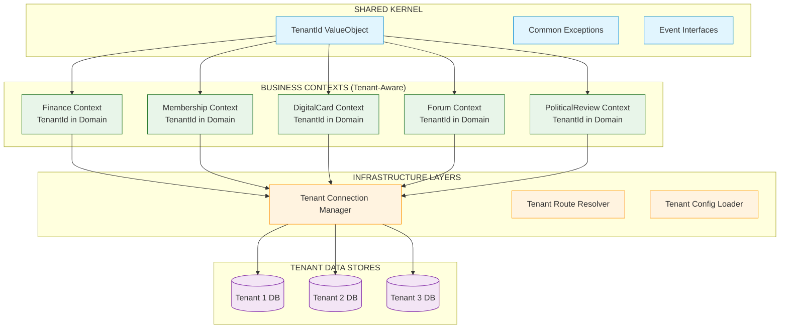
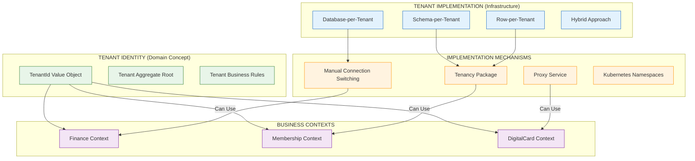
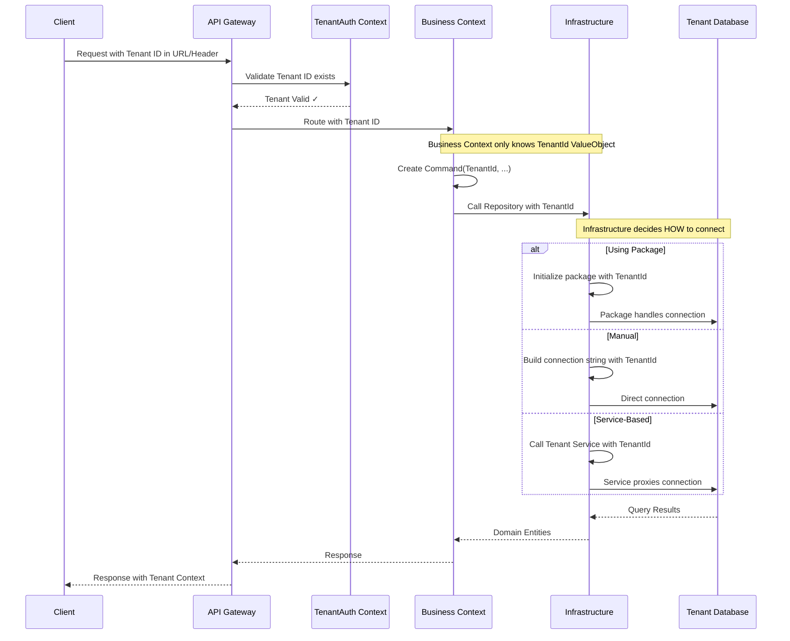

# **🔍 CRITICAL ARCHITECTURAL CLARIFICATION**

**NO!** You've hit on a **critical misunderstanding**. Let me correct this:

## **🎯 ARCHITECTURE PRINCIPLE RE-EVALUATION**

**ALL Contexts (including Business Contexts) MUST understand tenancy**, but **NOT** through Laravel packages like `stancl/tenancy`.

### **The Correct Principle:**

```yaml
Principle: "Tenancy-Aware, Package-Agnostic"
- ✅ Each Context understands tenant isolation conceptually
- ✅ Each Context implements tenant isolation in its Domain
- ✅ NO Context depends on external tenancy packages
- ✅ Tenant ID is a first-class concept in ALL Domain models
- ✅ Only Infrastructure layer knows about tenant database connections
```

---

## **🏗️ CORRECT ARCHITECTURE FOR MULTI-TENANCY**

### **1. Shared Kernel - Tenant Abstraction:**
```php
// Shared Kernel - Used by ALL Contexts
namespace Platform\SharedKernel\Domain;

class TenantId extends ValueObject 
{
    public function __construct(private string $id) {}
    
    public function toString(): string 
    {
        return $this->id;
    }
    
    // All contexts import and use this TenantId
}
```

### **2. How Each Context Handles Tenancy:**

#### **DigitalCard Context (Example):**
```php
// Domain Layer - Tenant-Aware but Package-Agnostic
namespace DigitalCard\Domain\Models;

use Platform\SharedKernel\Domain\TenantId;

class DigitalCard extends AggregateRoot
{
    public function __construct(
        private CardId $cardId,
        private TenantId $tenantId,    // ✅ TENANT ID IN DOMAIN
        private MemberId $memberId,
        private CardStatus $status
    ) {}
    
    // All business rules consider tenantId
    public function activate(): void
    {
        if (!$this->tenantId->equals($command->tenantId)) {
            throw new \DomainException('Card does not belong to this tenant');
        }
        // ... business logic
    }
}

// Repository Interface - Tenant-Aware
interface DigitalCardRepository
{
    public function findForTenant(CardId $cardId, TenantId $tenantId): DigitalCard;
    public function saveForTenant(DigitalCard $card, TenantId $tenantId): void;
}
```

#### **Membership Context:**
```php
namespace Membership\Domain\Models;

use Platform\SharedKernel\Domain\TenantId;

class Member extends AggregateRoot
{
    public function __construct(
        private MemberId $id,
        private TenantId $tenantId,    // ✅ TENANT ID IN DOMAIN
        private string $email
    ) {}
    
    public function belongsToTenant(TenantId $tenantId): bool
    {
        return $this->tenantId->equals($tenantId);
    }
}
```

#### **Finance Context (Node.js):**
```typescript
// Domain Layer - Tenant-Aware
class Invoice {
    constructor(
        private id: InvoiceId,
        private tenantId: TenantId,    // ✅ TENANT ID IN DOMAIN
        private amount: Money
    ) {}
    
    belongsToTenant(tenantId: TenantId): boolean {
        return this.tenantId.equals(tenantId);
    }
}

// Repository Interface
interface InvoiceRepository {
    findForTenant(invoiceId: InvoiceId, tenantId: TenantId): Promise<Invoice>;
}
```

---

## **🚫 WHAT WE DON'T DO:**

### **❌ BAD: Context depends on tenancy package**
```php
// WRONG - This couples context to a specific package
use Stancl\Tenancy\Database\Concerns\BelongsToTenant;

class DigitalCard extends Model
{
    use BelongsToTenant;  // ❌ PACKAGE DEPENDENCY IN DOMAIN
    
    // ... business logic mixed with framework concerns
}
```

### **✅ GOOD: Context understands tenancy conceptually**
```php
// CORRECT - Domain understands tenancy as business concept
class DigitalCard extends AggregateRoot
{
    private TenantId $tenantId;  // ✅ BUSINESS CONCEPT
    
    public function __construct(
        CardId $cardId,
        TenantId $tenantId,      // ✅ TENANT AS DOMAIN CONCEPT
        // ...
    ) {}
}
```

---

## **🔧 IMPLEMENTATION PATTERNS**

### **Pattern 1: TenantId in Every Aggregate**
```php
// Every Aggregate Root includes TenantId
abstract class TenantAwareAggregate extends AggregateRoot
{
    protected TenantId $tenantId;
    
    public function getTenantId(): TenantId
    {
        return $this->tenantId;
    }
    
    protected function ensureBelongsToTenant(TenantId $tenantId): void
    {
        if (!$this->tenantId->equals($tenantId)) {
            throw new \DomainException('Does not belong to tenant');
        }
    }
}

class DigitalCard extends TenantAwareAggregate
{
    // Inherits tenant awareness
}
```

### **Pattern 2: Repository Pattern with Tenant Scope**
```php
interface DigitalCardRepository
{
    // All methods require TenantId
    public function findForTenant(CardId $cardId, TenantId $tenantId): DigitalCard;
    public function saveForTenant(DigitalCard $card): void;
    public function findByMemberForTenant(MemberId $memberId, TenantId $tenantId): ?DigitalCard;
    
    // NO tenant-agnostic methods allowed
    // ❌ public function find(CardId $cardId): DigitalCard; // NOT ALLOWED
}
```

### **Pattern 3: Command/Query Objects Include TenantId**
```php
class ActivateCardCommand
{
    public function __construct(
        public readonly TenantId $tenantId,  // ✅ REQUIRED
        public readonly CardId $cardId,
        public readonly \DateTimeImmutable $activatedAt
    ) {}
}

class GetMemberCardQuery  
{
    public function __construct(
        public readonly TenantId $tenantId,  // ✅ REQUIRED
        public readonly MemberId $memberId
    ) {}
}
```

---

## **🏗️ INFRASTRUCTURE LAYER IMPLEMENTATION**

### **Database Connection Management (Infrastructure Only):**
```php
// app/Contexts/DigitalCard/Infrastructure/Database/TenantConnectionManager.php

namespace DigitalCard\Infrastructure\Database;

use Platform\SharedKernel\Domain\TenantId;

class TenantConnectionManager
{
    private array $connections = [];
    
    public function getConnectionForTenant(TenantId $tenantId): Connection
    {
        $tenantDbName = "tenant_{$tenantId->toString()}";
        
        if (!isset($this->connections[$tenantDbName])) {
            // Create connection dynamically
            config(["database.connections.{$tenantDbName}" => [
                'driver' => 'mysql',
                'database' => $tenantDbName,
                // ... other connection details from tenant configuration
            ]]);
            
            $this->connections[$tenantDbName] = DB::connection($tenantDbName);
        }
        
        return $this->connections[$tenantDbName];
    }
}
```

### **Eloquent Repository Implementation:**
```php
namespace DigitalCard\Infrastructure\Persistence\Eloquent;

use DigitalCard\Domain\Repositories\DigitalCardRepository;
use Platform\SharedKernel\Domain\TenantId;
use Illuminate\Database\Connection;

class EloquentDigitalCardRepository implements DigitalCardRepository
{
    private Connection $connection;
    
    public function __construct(
        private TenantConnectionManager $connectionManager
    ) {}
    
    public function findForTenant(CardId $cardId, TenantId $tenantId): DigitalCard
    {
        // 1. Get tenant-specific connection
        $this->connection = $this->connectionManager->getConnectionForTenant($tenantId);
        
        // 2. Query with tenant scope
        $model = $this->connection
            ->table('digital_cards')
            ->where('id', $cardId->toString())
            ->where('tenant_id', $tenantId->toString()) // ✅ TENANT SCOPE
            ->first();
            
        if (!$model) {
            throw new CardNotFoundException();
        }
        
        // 3. Map to Domain Entity
        return DigitalCardMapper::toDomain($model);
    }
}
```

---

## **🌐 CROSS-CONTEXT COMMUNICATION**

### **Events Include TenantId:**
```php
namespace DigitalCard\Domain\Events;

use Platform\SharedKernel\Domain\TenantId;

class CardActivated implements DomainEvent
{
    public function __construct(
        public readonly CardId $cardId,
        public readonly TenantId $tenantId,  // ✅ INCLUDED IN EVENTS
        public readonly \DateTimeImmutable $activatedAt
    ) {}
}

// Other contexts can filter/subscribe to tenant-specific events
```

### **Anti-Corruption Layer with Tenant Context:**
```php
namespace Membership\Infrastructure\Integration\DigitalCard;

class DigitalCardRevocationService
{
    public function revokeCardsForMember(MemberId $memberId, TenantId $tenantId): void
    {
        // Call DigitalCard API with tenant context
        $response = $this->httpClient->post("/tenants/{$tenantId}/cards/revoke-by-member", [
            'member_id' => $memberId->toString(),
        ]);
    }
}
```

---

## **📊 ARCHITECTURE DIAGRAM (CORRECTED)**



---

## **✅ TENANCY IMPLEMENTATION RULES**

### **RULE 1: Domain Layer Rules**
```php
// ✅ CORRECT:
class DigitalCard {
    private TenantId $tenantId;  // Domain concept
    public function belongsToTenant(TenantId $tenantId): bool;
}

// ❌ WRONG:
use SomeTenancyPackage\Traits\BelongsToTenant;  // No package dependencies
```

### **RULE 2: Application Layer Rules**
```php
// ✅ CORRECT:
class ActivateCardHandler {
    public function handle(ActivateCardCommand $command): void {
        // Command includes tenantId
        $card = $repository->findForTenant($command->cardId, $command->tenantId);
    }
}

// ❌ WRONG:
class ActivateCardHandler {
    public function handle(ActivateCardCommand $command): void {
        // Using global tenant() helper from package
        $tenantId = tenancy()->current()->id;  // NO
    }
}
```

### **RULE 3: Infrastructure Layer Rules**
```php
// ✅ CORRECT:
class EloquentDigitalCardRepository {
    public function findForTenant(CardId $cardId, TenantId $tenantId): DigitalCard {
        // Manually scope queries
        return DigitalCardModel::where('tenant_id', $tenantId->toString())
                               ->where('id', $cardId->toString())
                               ->first();
    }
}

// ❌ WRONG:
class EloquentDigitalCardRepository {
    use SomePackage\Scopes\TenantScope;  // No automatic scoping
}
```

---

## **🚀 PRACTICAL IMPLEMENTATION GUIDE**

### **Step 1: Add TenantId to Shared Kernel**
```bash
# Create Shared Kernel TenantId
mkdir -p app/SharedKernel/Domain/ValueObjects
php artisan make:value-object TenantId --path=app/SharedKernel/Domain/ValueObjects
```

### **Step 2: Update All Aggregates**
```php
// In every Aggregate Root in every Context
abstract class TenantAwareAggregate extends AggregateRoot
{
    protected TenantId $tenantId;
    
    // ... tenant awareness methods
}

// Update DigitalCard, Membership, Finance, etc.
class DigitalCard extends TenantAwareAggregate
{
    // Business logic now has tenant context
}
```

### **Step 3: Update All Repositories**
```php
// Add "ForTenant" to all repository method names
interface DigitalCardRepository
{
    // BEFORE: find(CardId $cardId)
    // AFTER: findForTenant(CardId $cardId, TenantId $tenantId)
    
    public function findForTenant(CardId $cardId, TenantId $tenantId): DigitalCard;
    public function saveForTenant(DigitalCard $card): void;
    // ... all methods must include TenantId
}
```

### **Step 4: Update All Commands/Queries**
```php
class ActivateCardCommand
{
    // Add TenantId as first parameter
    public function __construct(
        public readonly TenantId $tenantId,
        // ... other parameters
    ) {}
}
```

### **Step 5: Create Tenant Connection Infrastructure**
```php
// One-time infrastructure setup
class TenantConnectionManager
{
    // Manages connections without package dependencies
}
```

---

## **🎯 KEY TAKEAWAYS**

1. **Tenancy is a DOMAIN CONCEPT** - Not an infrastructure detail
2. **ALL Business Contexts understand tenancy** at the Domain level
3. **NO external tenancy packages** in Domain or Application layers
4. **TenantId is a first-class citizen** in all Aggregates, Commands, Events
5. **Infrastructure handles the mechanics** of database connections
6. **Each Context is responsible** for its own tenant isolation

**This approach gives you:**
- ✅ **True independence** from any specific tenancy package
- ✅ **Context autonomy** - each can implement tenancy appropriately
- ✅ **Technology flexibility** - different contexts can use different approaches
- ✅ **Business logic clarity** - tenancy is explicit in Domain
- ✅ **Testability** - can test tenant isolation logic directly

**The result:** A **truly decoupled, multi-tenant system** where each context understands tenancy as a business concept, not as a framework feature.
# **🎯 CORRECT! You've Nailed the Core Concept**

Yes, you understand perfectly! Let me clarify the **architectural reality**:

## **🏢 TENANT IDENTITY VS TENANT IMPLEMENTATION**

### **Two Separate Concerns:**



---

## **🔑 THE CRITICAL DISTINCTION**

### **1. Tenant Identity (Domain Concept - REQUIRED):**
```php
// app/SharedKernel/Domain/ValueObjects/TenantId.php
class TenantId extends ValueObject
{
    public function __construct(private string $id) {}
    
    public function toString(): string { return $this->id; }
    public function equals(TenantId $other): bool { 
        return $this->id === $other->toString(); 
    }
    
    // This is a BUSINESS CONCEPT that ALL contexts understand
}
```

### **2. Tenant Implementation (Infrastructure - OPTIONAL):**
```php
// app/Infrastructure/Tenancy/ - ONE OF THESE OPTIONS:

// Option A: Manual Connection Management
class ManualTenantConnectionManager
{
    public function getConnectionForTenant(TenantId $tenantId): Connection
    {
        // Manual database switching logic
        $dbName = "tenant_{$tenantId->toString()}";
        // ... create connection
    }
}

// Option B: Package Wrapper (Anti-Corruption Layer)
class PackageTenantConnectionManager
{
    public function __construct(
        private StanclTenancy $package  // ✅ Package isolated here
    ) {}
    
    public function getConnectionForTenant(TenantId $tenantId): Connection
    {
        // Translate Domain TenantId to package tenant
        $packageTenant = $this->package->find($tenantId->toString());
        tenancy()->initialize($packageTenant);
        return DB::connection('tenant');
    }
}

// Option C: Service-Based (Microservices)
class ServiceTenantConnectionManager
{
    public function getConnectionForTenant(TenantId $tenantId): Connection
    {
        // Call Tenant Service API
        $response = $this->httpClient->get("/tenants/{$tenantId}/connection");
        // Return connection details
    }
}
```

---

## **🏗️ HOW BUSINESS CONTEXTS INTERACT WITH TENANCY**

### **Contexts Only Know TenantId, NOT Implementation:**
```php
// app/Contexts/DigitalCard/Domain/Models/DigitalCard.php
class DigitalCard extends AggregateRoot
{
    public function __construct(
        private CardId $cardId,
        private TenantId $tenantId,    // ✅ ONLY KNOWS TenantId VALUE OBJECT
        private MemberId $memberId
    ) {}
    
    // Business rule: Card belongs to specific tenant
    public function belongsToTenant(TenantId $tenantId): bool
    {
        return $this->tenantId->equals($tenantId);
    }
    
    // ❌ NO knowledge of databases, connections, or packages
    // ❌ No `use Stancl\Tenancy\...`
    // ❌ No `tenancy()->current()`
}

// app/Contexts/DigitalCard/Application/Handlers/ActivateCardHandler.php
class ActivateCardHandler
{
    public function handle(ActivateCardCommand $command): void
    {
        // Command includes TenantId from API
        $card = $this->repository->findForTenant(
            $command->cardId,
            $command->tenantId  // ✅ Domain TenantId
        );
        
        // Business logic operates on Domain TenantId
        if (!$card->belongsToTenant($command->tenantId)) {
            throw new DomainException('Invalid tenant');
        }
        
        // ... rest of business logic
    }
}
```

### **Repository Interface (Domain Layer):**
```php
namespace DigitalCard\Domain\Repositories;

interface DigitalCardRepository
{
    // All methods require TenantId
    public function findForTenant(CardId $cardId, TenantId $tenantId): DigitalCard;
    
    // ❌ NO tenant-agnostic methods
    // public function find(CardId $cardId): DigitalCard; // NOT ALLOWED
}
```

### **Repository Implementation (Infrastructure Layer):**
```php
namespace DigitalCard\Infrastructure\Persistence\Eloquent;

// Implementation can use ANY tenancy mechanism
class EloquentDigitalCardRepository implements DigitalCardRepository
{
    public function __construct(
        private TenantConnectionManagerInterface $connectionManager
    ) {}
    
    public function findForTenant(CardId $cardId, TenantId $tenantId): DigitalCard
    {
        // 1. Get connection for this tenant (ANY mechanism)
        $connection = $this->connectionManager->getConnectionForTenant($tenantId);
        
        // 2. Query with explicit tenant scope
        $model = $connection
            ->table('digital_cards')
            ->where('id', $cardId->toString())
            ->where('tenant_id', $tenantId->toString()) // ✅ Domain TenantId
            ->first();
            
        return $this->mapToDomain($model);
    }
}
```

---

## **🔄 TENANT ID FLOW THROUGH THE SYSTEM**



---

## **🔧 TENANT CONNECTION MANAGER INTERFACE**

### **The Abstraction Layer:**
```php
// app/Infrastructure/Tenancy/Contracts/TenantConnectionManagerInterface.php

interface TenantConnectionManagerInterface
{
    /**
     * Get database connection for a specific tenant
     * Implementation can use ANY mechanism
     */
    public function getConnectionForTenant(TenantId $tenantId): Connection;
    
    /**
     * Execute callback in tenant context
     */
    public function runForTenant(TenantId $tenantId, callable $callback): mixed;
    
    /**
     * Check if tenant database exists
     */
    public function tenantDatabaseExists(TenantId $tenantId): bool;
}
```

### **Different Implementations:**
```php
// Implementation 1: Manual (No Package)
class ManualTenantConnectionManager implements TenantConnectionManagerInterface
{
    public function getConnectionForTenant(TenantId $tenantId): Connection
    {
        $dbName = "tenant_{$tenantId->toString()}";
        
        // Create connection manually
        Config::set("database.connections.{$dbName}", [
            'driver' => 'mysql',
            'database' => $dbName,
            // ... from tenant configuration store
        ]);
        
        return DB::connection($dbName);
    }
}

// Implementation 2: Package Wrapper
class PackageTenantConnectionManager implements TenantConnectionManagerInterface
{
    public function __construct(
        private \Stancl\Tenancy\Tenancy $tenancy
    ) {}
    
    public function getConnectionForTenant(TenantId $tenantId): Connection
    {
        // Use package but abstract it away
        $tenant = $this->tenancy->find($tenantId->toString());
        $this->tenancy->initialize($tenant);
        
        return DB::connection('tenant');
    }
}

// Implementation 3: Kubernetes/Service Mesh
class ServiceMeshTenantConnectionManager implements TenantConnectionManagerInterface  
{
    public function getConnectionForTenant(TenantId $tenantId): Connection
    {
        // Each tenant gets its own database service
        $serviceName = "tenant-{$tenantId->toString()}-db";
        
        return DB::connection($serviceName);
    }
}
```

---

## **🚀 PRACTICAL IMPLEMENTATION STRATEGY**

### **Step 1: Define TenantId in Shared Kernel**
```bash
# TenantId is a Platform-wide Value Object
php artisan make:value-object TenantId --shared-kernel
```

### **Step 2: All Contexts Import TenantId**
```php
// In EVERY context's composer.json
{
    "autoload": {
        "psr-4": {
            "DigitalCard\\": "app/Contexts/DigitalCard/",
            "Platform\\SharedKernel\\": "app/SharedKernel/"
        }
    }
}

// Use in Domain models
use Platform\SharedKernel\Domain\TenantId;

class DigitalCard
{
    private TenantId $tenantId;
}
```

### **Step 3: Infrastructure Binding (Service Provider)**
```php
// app/Providers/TenancyServiceProvider.php

class TenancyServiceProvider extends ServiceProvider
{
    public function register(): void
    {
        // Bind to ANY implementation
        $this->app->bind(
            TenantConnectionManagerInterface::class,
            
            // Choose ONE:
            ManualTenantConnectionManager::class,        // Simple
            // PackageTenantConnectionManager::class,    // With package
            // ServiceMeshTenantConnectionManager::class, // Advanced
        );
    }
}
```

### **Step 4: Contexts Receive TenantId from API**
```php
// app/Http/Middleware/ResolveTenant.php

class ResolveTenant
{
    public function handle(Request $request, Closure $next)
    {
        $tenantId = $request->route('tenant'); // From URL: /{tenant}/api/...
        
        // Convert to Domain TenantId
        $tenantId = new TenantId($tenantId);
        
        // Store in request for handlers
        $request->attributes->set('tenantId', $tenantId);
        
        return $next($request);
    }
}

// In Controllers
class DigitalCardController extends Controller
{
    public function store(Request $request)
    {
        $tenantId = $request->attributes->get('tenantId'); // TenantId VO
        
        $command = new IssueCardCommand(
            tenantId: $tenantId,  // ✅ Domain TenantId
            memberId: new MemberId($request->input('member_id'))
        );
        
        $this->handler->handle($command);
    }
}
```

---

## **🎯 KEY ARCHITECTURAL INSIGHTS**

### **What Stays Constant:**
1. **TenantId Value Object** - Platform-wide domain concept
2. **Business Contexts understand TenantId** - It's in their Domain
3. **All Commands/Queries include TenantId** - Non-negotiable
4. **All Repositories are tenant-scoped** - "ForTenant" methods

### **What Can Vary:**
1. **Tenant database strategy** - Per-tenant DB, schemas, rows, hybrid
2. **Connection mechanism** - Manual, package, service mesh
3. **Deployment model** - Monolith, microservices, serverless
4. **Technology per context** - PHP, Node.js, Python, Java

### **The Magic:**
- **Business logic** only knows "I belong to Tenant X"
- **Infrastructure** figures out "How to connect to Tenant X's data"
- **You can change tenancy implementation** without touching business logic
- **Different contexts** can use different tenancy mechanisms

---

## **✅ FINAL VERIFICATION CHECKLIST**

**For EACH Business Context (DigitalCard, Finance, etc.):**
- [ ] Domain models have `TenantId $tenantId` property
- [ ] Repository interfaces have `ForTenant` methods
- [ ] Commands/Queries include `TenantId` parameter
- [ ] Business rules consider tenant boundaries
- [ ] **NO** tenancy package imports in Domain/Application layers
- [ ] **YES** uses `Platform\SharedKernel\Domain\TenantId`

**For Infrastructure:**
- [ ] `TenantConnectionManagerInterface` implementation exists
- [ ] Repository implementations use the connection manager
- [ ] Can swap between manual/package/service implementations
- [ ] TenantId flows from API → Domain → Infrastructure → Database

**This architecture gives you:** **Business context independence** from tenancy implementation, while maintaining **strong tenant isolation** at the domain level.
# **🏗️ GOLDEN RULES FOR MULTI-TENANT DDD ARCHITECTURE**

## **🎯 PROMPT ENGINEERING INSTRUCTIONS FOR AI ASSISTANTS**

### **RULE 1: TENANT IDENTITY AS DOMAIN CONCEPT**
```
- Every Domain model MUST have a TenantId property
- Use ONLY Platform\SharedKernel\Domain\TenantId Value Object
- NEVER use tenancy packages (stancl/tenancy, hyn/multi-tenant) in Domain/Application layers
- TenantId is a business identifier, not a technical implementation detail
- All business rules MUST consider tenant boundaries
```

### **RULE 2: REPOSITORY DESIGN PATTERN**
```
- Repository interfaces MUST use "ForTenant" naming convention
- Example: findForTenant(), saveForTenant(), findByMemberForTenant()
- NEVER create tenant-agnostic repository methods (find(), findAll(), etc.)
- Repository method signatures MUST include TenantId parameter
- Example: findForTenant(CardId $cardId, TenantId $tenantId)
```

### **RULE 3: COMMAND/QUERY OBJECT STRUCTURE**
```
- Every Command and Query MUST have TenantId as first parameter
- Constructor pattern: __construct(public readonly TenantId $tenantId, ...)
- Commands represent actions scoped to a specific tenant
- Queries retrieve data for a specific tenant
- NEVER extract TenantId from global state (tenancy()->current(), etc.)
```

### **RULE 4: DOMAIN LAYER PURITY**
```
- Domain layer MUST be pure PHP with NO framework dependencies
- NEVER import Illuminate, Laravel, or tenancy packages in Domain
- Domain models MUST extend only your own AggregateRoot/Entity classes
- Business logic MUST validate tenant ownership internally
- Example: $card->belongsToTenant($tenantId) method in Domain model
```

### **RULE 5: APPLICATION LAYER ENFORCEMENT**
```
- Handlers MUST validate TenantId matches before business logic
- Pattern: if (!$entity->belongsToTenant($command->tenantId)) throw
- Handlers MUST use repository "ForTenant" methods only
- Application services MUST receive TenantId as explicit parameter
- NEVER assume current tenant from middleware or context
```

### **RULE 6: INFRASTRUCTURE ABSTRACTION**
```
- Create TenantConnectionManagerInterface for database connections
- Repository implementations MUST inject TenantConnectionManagerInterface
- Infrastructure MAY use tenancy packages, but ONLY in implementation
- NEVER expose package details to Domain/Application layers
- Connection switching logic MUST be encapsulated in Infrastructure
```

### **RULE 7: API LAYER TENANT RESOLUTION**
```
- Extract TenantId from URL route parameter: /{tenant}/api/*
- Convert to Domain TenantId in middleware/controller
- Pass TenantId explicitly to Commands/Queries
- NEVER use helper functions like tenant(), tenancy()->current()
- Tenant resolution MUST be explicit and visible in code flow
```

### **RULE 8: EVENT DESIGN PATTERN**
```
- Domain Events MUST include TenantId property
- Event subscribers MUST filter events by TenantId
- Cross-context communication MUST include TenantId
- Event payloads MUST be tenant-specific
- NEVER publish tenant-agnostic events
```

### **RULE 9: TESTING STRATEGY**
```
- Unit tests MUST test tenant isolation logic
- Always test with multiple TenantId values
- Mock repositories MUST enforce tenant boundaries
- Integration tests MUST use actual tenant database connections
- Test tenant switching scenarios explicitly
```

### **RULE 10: CODE GENERATION PATTERNS**
```
When generating Domain models:
- Include: private TenantId $tenantId in constructor
- Include: public function getTenantId(): TenantId
- Include: public function belongsToTenant(TenantId $tenantId): bool

When generating Repository interfaces:
- Use "ForTenant" suffix on all methods
- Include TenantId parameter in every method
- NEVER generate find(), save() without tenant context

When generating Commands/Handlers:
- TenantId MUST be first constructor parameter
- Handler MUST validate tenant ownership
- Use repository->findForTenant() not repository->find()
```

### **RULE 11: DEPENDENCY INJECTION PATTERN**
```
- Inject TenantConnectionManagerInterface, not concrete implementations
- Domain services MUST NOT know about connection mechanisms
- Repository implementations receive connection manager via constructor
- Controllers receive TenantId from request, pass to commands
- Service location (app()->make()) is FORBIDDEN for tenant-related services
```

### **RULE 12: ERROR HANDLING RULES**
```
- Throw DomainException when tenant mismatch detected
- Use specific exceptions: TenantAccessDeniedException, TenantNotFoundException
- NEVER silently ignore tenant validation failures
- Log tenant ID with all security-relevant errors
- API MUST return 403/404 for tenant access violations
```

### **RULE 13: MIGRATION & SEEDING PATTERNS**
```
- Database migrations MUST include tenant_id column
- Unique indexes MUST include tenant_id for multi-tenant uniqueness
- Seeders MUST create data for specific tenants
- NEVER seed global/tenant-agnostic data in tenant databases
- Migration rollbacks MUST preserve tenant data isolation
```

### **RULE 14: QUERY BUILDING PATTERNS**
```
- ALL database queries MUST include WHERE tenant_id = ?
- Use query scopes: ->where('tenant_id', $tenantId->toString())
- NEVER query across multiple tenants in single query
- Aggregations MUST be tenant-scoped
- Reporting queries MUST filter by TenantId
```

### **RULE 15: MODULE REGISTRY INTEGRATION**
```
- Modules MUST declare tenant-aware in module.json
- Installation MUST run tenant-specific migrations
- Module services MUST be tenant-scoped
- Module configuration MUST be per-tenant
- Uninstallation MUST respect tenant data isolation
```

---

## **🚫 ABSOLUTE FORBIDDEN PATTERNS**
```
❌ NEVER: tenancy()->current()->id in Domain/Application layers
❌ NEVER: DB::table()->without tenant scope
❌ NEVER: Global scopes that automatically add tenant_id
❌ NEVER: Tenant-agnostic repository methods
❌ NEVER: Commands without TenantId parameter
❌ NEVER: Domain models without TenantId property
❌ NEVER: Events without TenantId context
❌ NEVER: Sharing database connections between tenants
```

---

## **✅ ACCEPTED PATTERNS**
```
✅ ALWAYS: new TenantId($request->route('tenant'))
✅ ALWAYS: $repository->findForTenant($id, $tenantId)
✅ ALWAYS: $command = new Command($tenantId, ...)
✅ ALWAYS: if (!$entity->belongsToTenant($tenantId)) throw
✅ ALWAYS: Domain\Events\SomethingHappened($tenantId, ...)
✅ ALWAYS: WHERE tenant_id = ? in every database query
✅ ALWAYS: Unique constraint: UNIQUE(column, tenant_id)
✅ ALWAYS: TenantConnectionManagerInterface injection
```

---

## **🔧 AI PROMPT TEMPLATES FOR CODE GENERATION**

### **When generating Domain Models:**
```
Create a {ModelName} Domain model with:
1. Private TenantId $tenantId property
2. Constructor with TenantId parameter
3. getTenantId(): TenantId method
4. belongsToTenant(TenantId $tenantId): bool method
5. All business logic methods must validate tenant ownership
6. NO framework dependencies
```

### **When generating Repository Interfaces:**
```
Create a {ModelName}RepositoryInterface with:
1. All methods MUST have "ForTenant" suffix
2. All methods MUST include TenantId parameter
3. Example: findForTenant({ModelId} $id, TenantId $tenantId): {ModelName}
4. Example: saveForTenant({ModelName} $model): void
5. NO tenant-agnostic methods allowed
```

### **When generating Commands/Handlers:**
```
Create {ActionName}Command and {ActionName}Handler:
1. Command MUST have TenantId as first constructor parameter
2. Handler MUST inject repository and validate tenant ownership
3. Handler MUST use repository->findForTenant() method
4. Handler MUST check $entity->belongsToTenant($command->tenantId)
5. Throw DomainException on tenant mismatch
```

### **When generating API Controllers:**
```
Create {ModelName}Controller with:
1. Extract TenantId from route: $tenantId = new TenantId($request->route('tenant'))
2. Create Command with TenantId parameter
3. Pass Command to Handler
4. Return appropriate HTTP responses
5. NEVER use tenancy helpers
```

---

## **🎯 ARCHITECTURE VERIFICATION CHECKLIST**
```
For every code change, verify:
1. ✅ Domain models have TenantId property
2. ✅ Repository methods use "ForTenant" naming
3. ✅ Commands include TenantId parameter
4. ✅ Handlers validate tenant ownership
5. ✅ Queries include WHERE tenant_id = ?
6. ✅ Events include TenantId context
7. ✅ NO tenancy package imports in Domain/Application
8. ✅ Tests verify tenant isolation
```

**These rules ensure:**
- **Tenant isolation** is baked into the Domain
- **Business logic** is tenant-aware by design
- **Infrastructure details** don't leak into business rules
- **Code is testable** without tenancy packages
- **System can evolve** from monolith to microservices
- **Different contexts** can use different tenancy implementations
