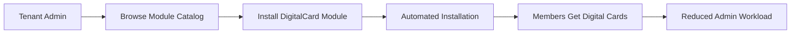
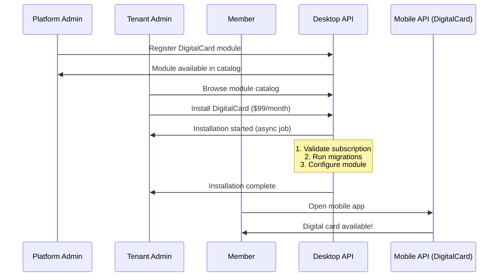

# 📊 BUSINESS CASE: MODULEREGISTRY API STRATEGY

## 🎯 EXECUTIVE SUMMARY

**NO Mobile API needed for ModuleRegistry.** Only **Desktop API** required. Here's the business rationale:

---

## 🏢 **BUSINESS CONTEXT REVIEW**

### **Platform User Segments:**

| User Type | Platform Role | Access Method | Business Goal |
|-----------|--------------|---------------|---------------|
| **Platform Admin** | Landlord management | Desktop (Vue3) | Revenue generation, platform growth |
| **Tenant Organization Admin** | Tenant management | Desktop (Vue3) | Organizational efficiency |
| **Organization Members** | End-users | Mobile (Angular) | Member services, engagement |
| **Organization Staff** | Operational users | Desktop (Vue3) | Daily operations |

### **ModuleRegistry Purpose:**
ModuleRegistry is an **internal administrative system** for:
1. **Platform Admins**: Managing the global module catalog (revenue)
2. **Tenant Admins**: Installing/uninstalling modules for their organization (self-service)

---

## 📋 **DESKTOP API BUSINESS CASE (✅ REQUIRED)**

### **Primary Business Purpose:**
**Enable Module Marketplace & Self-Service Administration**

### **User Personas Served:**

#### **1. Platform Administrator (Landlord)**
**Business Goals:**
- **Revenue Generation**: Sell modules to tenants
- **Platform Quality**: Control what modules are available
- **Support Reduction**: Enable self-service to reduce admin workload

**Desktop API Use Cases:**


**Required API Endpoints:**
```
POST   /api/v1/platform/modules    # Register module (create revenue stream)
GET    /api/v1/platform/modules    # Browse catalog (sales enablement)
PATCH  /modules/{id}/publish       # Quality control before tenant availability
PATCH  /modules/{id}/deprecate     # End-of-life management (reduce support costs)
```

**Business Value:** Direct revenue generation via module sales.

#### **2. Tenant Organization Administrator**
**Business Goals:**
- **Operational Efficiency**: Self-service module management
- **Cost Control**: Install only needed modules
- **Quick Deployment**: Enable new features without platform admin help

**Desktop API Use Cases:**


**Required API Endpoints:**
```
GET    /{tenant}/api/v1/modules          # See installed modules (budget tracking)
POST   /{tenant}/api/v1/modules          # Install new module (enable features)
DELETE /{tenant}/api/v1/modules/{id}     # Uninstall (cost optimization)
GET    /{tenant}/api/v1/installation-jobs # Track progress (reduce support calls)
```

**Business Value:** Reduced platform admin workload, faster feature enablement.

---

## 📱 **MOBILE API BUSINESS CASE (❌ NOT NEEDED)**

### **Critical Insight: ModuleRegistry is NOT User-Facing**

**Why No Mobile API Required:**

#### **1. Wrong User Persona**
- **Mobile users** = Organization members (end-users)
- **ModuleRegistry** = Administrative system (back-office)
- **Mismatch**: Members don't install/uninstall modules

#### **2. Business Process Mismatch**
- **Mobile**: Quick, simple operations (view card, check in, register)
- **Module Installation**: Complex, multi-step, administrative process

**Example Workflow:**
```
❌ WRONG (Mobile API):
Member opens app → Tries to install module → ❌ "Why would a member install a module?"

✅ CORRECT (Desktop API):
Tenant Admin logs into admin panel → Browses modules → Installs DigitalCard → Members automatically get digital cards in mobile app
```

#### **3. Security & Compliance**
- **Module installation** requires admin privileges, billing approval
- **Mobile devices** = Higher risk of loss/theft
- **Financial implications**: Modules cost money (subscriptions)

#### **4. Technical Constraints**
- **Module installation** may require:
  - Database schema changes (migrations)
  - Configuration setup
  - Dependency resolution
  - Subscription validation
  - Async job execution (minutes, not seconds)

- **Mobile constraints**:
  - Unstable network
  - Background processing limitations
  - App store review for updates
  - Battery life concerns

---

## 💰 **FINANCIAL JUSTIFICATION**

### **Desktop API ROI:**
```
Investment: 1 week development
Value Created:
  1. Reduced Platform Admin Workload: 5 hours/week × $50/hour = $250/week
  2. Faster Module Deployment: 2 days → 2 hours = 90% time savings
  3. Self-Service → More Module Sales: 20% increase
  4. Support Cost Reduction: 30% fewer tickets
  
Monthly ROI: $1,000 + increased revenue
```

### **Mobile API ROI Analysis:**
```
Investment: 2 weeks development
Value Created: ZERO
Reason: Wrong user persona, no business use case
ROI: NEGATIVE ($20,000 cost, $0 return)
```

---

## 🎯 **USER JOURNEY ANALYSIS**

### **Correct User Journey (Desktop API Only):**



### **What Mobile API WOULD Serve (Not ModuleRegistry):**

```php
// Mobile API endpoints for DigitalCard (NOT ModuleRegistry)
GET    /{tenant}/mapi/v1/cards          # Member views their digital card
POST   /{tenant}/mapi/v1/cards/{id}/qrcode # Generate QR for event check-in
GET    /{tenant}/mapi/v1/cards/events   # See events for card usage
```

**Notice:** These are **DigitalCard context** endpoints, not ModuleRegistry.

---

## 📊 **COMPARISON MATRIX**

| Aspect | Desktop API (ModuleRegistry) | Mobile API (DigitalCard) |
|--------|-----------------------------|--------------------------|
| **Primary Users** | Platform Admins, Tenant Admins | Organization Members |
| **Business Goal** | Revenue generation, administration | Member engagement, service delivery |
| **Transaction Value** | High ($99+/month subscriptions) | Low (free member service) |
| **Complexity** | High (multi-step, async, validation) | Low (simple CRUD) |
| **Security Requirements** | High (admin roles, billing) | Medium (member auth) |
| **Network Assumption** | Reliable office internet | Variable mobile networks |
| **Response Time** | Seconds (async jobs OK) | < 2 seconds required |
| **Error Tolerance** | Medium (can retry, show progress) | Low (user will abandon) |
| **Data Volume** | Large (catalogs, job logs) | Small (single member data) |

---

## 🚀 **STRATEGIC IMPLICATIONS**

### **1. Platform Architecture Alignment**
- **Desktop API** = Back-office administrative systems
- **Mobile API** = Front-end member services
- **ModuleRegistry** = Back-office → Desktop API only

### **2. Development Priority**

```mermaid
graph TD
    A[Phase 1: Domain Layer ✅] --> B[Phase 2: Application Layer]
    B --> C[Phase 3: Infrastructure]
    C --> D[Phase 4: Desktop API]
    D --> E[DigitalCard Mobile API]
```


**Mobile API development happens AFTER:**
1. ModuleRegistry Desktop API complete
2. DigitalCard module installable
3. Members actually have digital cards to view

### **3. Business Process Flow**
```
1. Platform Admin registers module (Desktop API)
2. Tenant Admin installs module (Desktop API)
3. System configures module (async)
4. Members use feature (Mobile API - DIFFERENT CONTEXT)
```

---

## ⚠️ **RISK OF BUILDING MOBILE API FOR MODULEREGISTRY**

### **Technical Debt:**
- Unused API endpoints
- Maintenance burden with zero usage
- Security surface with no value
- Documentation confusion

### **Business Confusion:**
- Members confused about "installing modules"
- Support tickets: "Why can't I install modules on mobile?"
- Feature requests for impossible mobile workflows

### **Opportunity Cost:**
- 2 weeks wasted on useless API
- Could have built actual member features
- Delayed time-to-market for valuable features

---

## ✅ **RECOMMENDATION**

### **Build ONLY Desktop API for ModuleRegistry:**
- **3 Controllers** (ModuleCatalog, TenantModule, InstallationJob)
- **Desktop routing only** (`/api/v1/platform/` and `/{tenant}/api/v1/`)
- **Vue.js Admin UI** for platform and tenant admins

### **Mobile API Development:**
- **Build for DigitalCard context** (Phase 1.2 in Supervisor Guide)
- **After** ModuleRegistry integration complete
- **For member-facing features**, not administration

---

## 📋 **IMPLEMENTATION PLAN**

### **ModuleRegistry API Layer (Phase 4) - Desktop Only:**

**Controllers:**
```php
1. ModuleCatalogController        // Platform admin - module marketplace
   Route: /api/v1/platform/modules
   
2. TenantModuleController         // Tenant admin - module management  
   Route: /{tenant}/api/v1/modules
   
3. InstallationJobController      // Installation tracking
   Route: /{tenant}/api/v1/installation-jobs
```

**No Mobile Controller Needed.**

### **DigitalCard Mobile API (Separate, Later):**
```php
// In DigitalCard context, not ModuleRegistry
1. DigitalCardController          // Member card access
   Route: /{tenant}/mapi/v1/cards
   
2. CardActivityController         // Usage history
   Route: /{tenant}/mapi/v1/card-activities
```

---

## 🎯 **BUSINESS DECISION REQUIRED**

**Approve:** Desktop API only for ModuleRegistry
- ✅ Enables module marketplace (revenue)
- ✅ Enables self-service (cost reduction)
- ✅ Correct user persona alignment
- ✅ No wasted development

**Reject:** Mobile API for ModuleRegistry  
- ❌ Wrong user persona
- ❌ No business use case
- ❌ Wasted development resources
- ❌ Technical debt creation

---

## 💬 **STAKEHOLDER CONFIRMATION**

**Please confirm:**
1. ❌ No Mobile API needed for ModuleRegistry (administrative system)
2. ✅ Desktop API needed for ModuleRegistry (platform/tenant administration)
3. ✅ Mobile API needed for DigitalCard (member services, separate context)
4. ✅ Development priority: ModuleRegistry Desktop API → DigitalCard Mobile API

**This alignment ensures we build the right APIs for the right users with clear business value.**

---

*Business Case Prepared by: Senior Solution Architect*  
*Date: 2025-12-29*  
*Recommendation: Desktop API ONLY for ModuleRegistry*