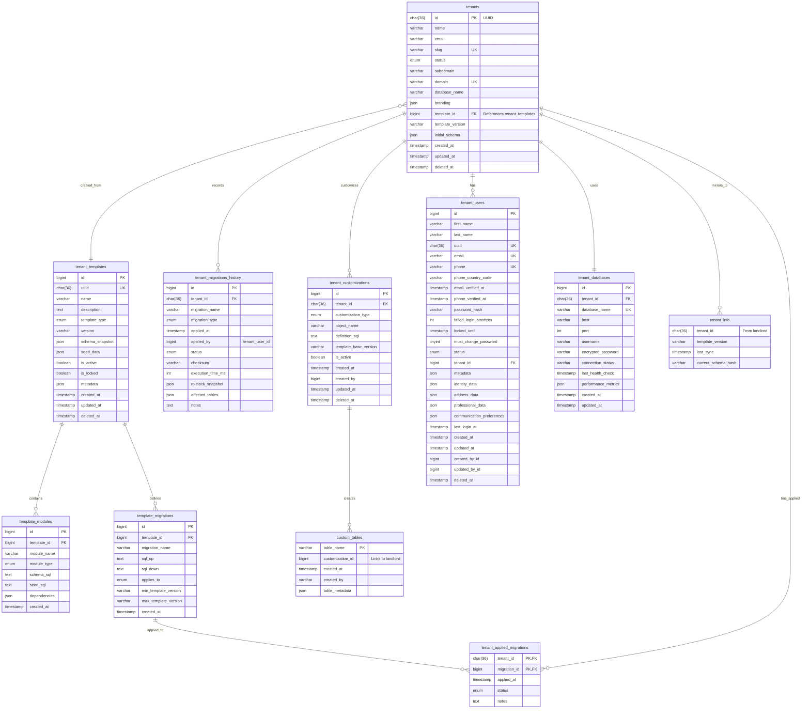

Here's a comprehensive Mermaid diagram showing the complete tenant database administration architecture with all relationships:

## 🏗️ **TENANT DATABASE ARCHITECTURE - MERMAID DIAGRAM**

## 📊 **ARCHITECTURE FLOW DIAGRAM**

## 🔄 **TENANT LIFECYCLE DIAGRAM**

## 🗺️ **DATABASE CONNECTION MAP**

## 📈 **MIGRATION WORKFLOW DIAGRAM**

## 🔧 **IMPLEMENTATION PRIORITY MAP**

These diagrams provide a complete visual representation of your tenant database administration architecture. Would you like me to:

1. **Focus on a specific diagram** in more detail?
2. **Create implementation code** for any component shown?
3. **Generate the actual SQL** for all the tables in the ER diagram?
4. **Build the Laravel models** with the relationships shown?

The ER diagram is the most important one as it shows all the actual database tables and their relationships. The flow diagrams show how the system operates at different levels.