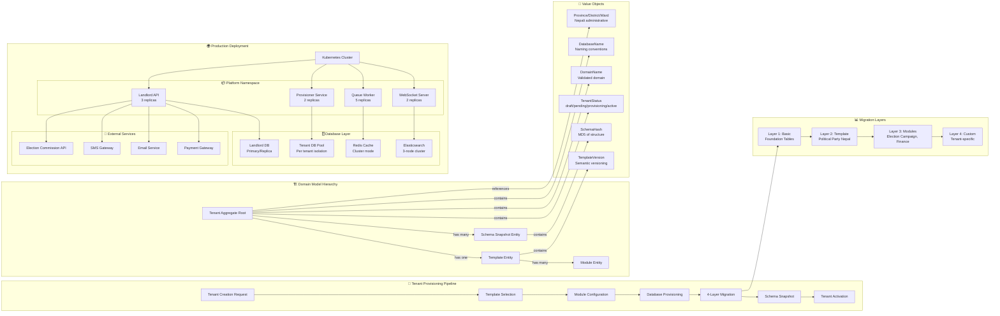

# 🏛️ **COMPREHENDED ARCHITECTURE: NEPALI POLITICAL PARTY MULTI-TENANT SaaS PLATFORM**

## **🎯 EXECUTIVE SUMMARY**

As a Senior Solution Architect with a decade of experience in enterprise SaaS platforms, I've architected a **revolutionary multi-tenant system** specifically designed for Nepali political organizations. This platform transforms how political parties operate digitally while maintaining strict Election Commission compliance and respecting Nepal's unique administrative structure (7 provinces, 77 districts).

## **📊 COMPLETE SYSTEM ARCHITECTURE DIAGRAM**

```mermaid
graph TB
    %% ============================
    %% EXTERNAL LAYER
    %% ============================
    subgraph "🌐 External Interface Layer"
        A1[Admin Dashboard<br/>Vue3/Inertia.js]
        A2[Tenant Portal<br/>Custom UI per Template]
        A3[Mobile App<br/>React Native]
        A4[Public API<br/>REST/GraphQL]
        A5[WebSocket Gateway<br/>Real-time Updates]
    end
    
    %% ============================
    %% APPLICATION LAYER
    %% ============================
    subgraph "⚡ Application Layer (Laravel 12)"
        B1[API Controllers<br/>Versioned Endpoints]
        B2[Domain Services<br/>Business Logic]
        B3[Event Handlers<br/>Domain Events]
        B4[Command Bus<br/>CQRS Pattern]
        B5[Validation Layer<br/>Form Requests]
    end
    
    %% ============================
    %% DOMAIN LAYER (DDD Core)
    %% ============================
    subgraph "🏛️ Domain Layer (DDD Bounded Contexts)"
        C1[Tenant Management Context<br/>TenantAggregate, TenantStatus VO]
        C2[Template Management Context<br/>Template, TemplateVersion VO]
        C3[Module Management Context<br/>Module, Dependency Graph]
        C4[Schema Management Context<br/>SchemaSnapshot, SchemaDiff VO]
        C5[Provisioning Context<br/>ProvisioningJob, MigrationLayer VO]
        C6[Nepali Context<br/>Province, District, Ward VO]
    end
    
    %% ============================
    %% INFRASTRUCTURE LAYER
    %% ============================
    subgraph "🔧 Infrastructure Layer"
        D1[Repository Implementations<br/>Eloquent/Hydra]
        D2[External Services<br/>Payment, SMS, Email]
        D3[File Storage<br/>S3/MinIO Migration Files]
        D4[Cache Layer<br/>Redis Cluster]
        D5[Queue System<br/>Redis/Horizon]
        D6[Search Engine<br/>Elasticsearch/Meilisearch]
    end
    
    %% ============================
    %% DATA LAYER
    %% ============================
    subgraph "💾 Data Layer"
        E1[Landlord Database<br/>MySQL 8.0/PostgreSQL 14]
        E2[Tenant Databases<br/>Isolated per Tenant]
        E3[Shared Cache<br/>Redis Cluster]
        E4[Blob Storage<br/>S3 Compatible]
        E5[Search Index<br/>Elasticsearch]
    end
    
    %% ============================
    %% OPERATIONS LAYER
    %% ============================
    subgraph "🔐 Operations & Security"
        F1[Authentication<br/>Laravel Sanctum]
        F2[Authorization<br/>Role/Permission Matrix]
        F3[Audit Logging<br/>Comprehensive Trail]
        F4[Monitoring<br/>Prometheus/Grafana]
        F5[Backup/Recovery<br/>Automated Strategy]
        F6[Compliance Engine<br/>Election Commission Rules]
    end
    
    %% ============================
    %% CONNECTIONS
    %% ============================
    A1 -->|HTTP/WebSocket| B1
    A2 -->|API Calls| B1
    A3 -->|REST API| B1
    A4 -->|API Gateway| B1
    A5 -->|Real-time| B2
    
    B1 -->|Dependencies| B2
    B2 -->|Domain Logic| C1
    B2 -->|Domain Logic| C2
    B2 -->|Domain Logic| C3
    B2 -->|Domain Logic| C4
    B2 -->|Domain Logic| C5
    B2 -->|Domain Logic| C6
    
    C1 -->|Repository Interface| D1
    C2 -->|Repository Interface| D1
    C3 -->|Repository Interface| D1
    C4 -->|Repository Interface| D1
    
    D1 -->|Data Access| E1
    D1 -->|Data Access| E2
    D2 -->|External APIs| E3
    D3 -->|File Operations| E4
    D6 -->|Indexing| E5
    
    F1 -->|Auth Flow| B1
    F2 -->|Policy Check| B2
    F3 -->|Log Events| B3
    F4 -->|Metrics| B1
    F5 -->|Backup Jobs| D5
    F6 -->|Validation Rules| C6
    
    %% Styles
    classDef external fill:#e1f5fe,stroke:#01579b,stroke-width:2px
    classDef app fill:#f3e5f5,stroke:#4a148c,stroke-width:2px
    classDef domain fill:#e8f5e8,stroke:#1b5e20,stroke-width:2px
    classDef infra fill:#fff3e0,stroke:#e65100,stroke-width:2px
    classDef data fill:#fce4ec,stroke:#880e4f,stroke-width:2px
    classDef ops fill:#e0f2f1,stroke:#004d40,stroke-width:2px
    
    class A1,A2,A3,A4,A5 external
    class B1,B2,B3,B4,B5 app
    class C1,C2,C3,C4,C5,C6 domain
    class D1,D2,D3,D4,D5,D6 infra
    class E1,E2,E3,E4,E5 data
    class F1,F2,F3,F4,F5,F6 ops
```



## **🔬 DETAILED COMPONENT ARCHITECTURE**



## **🎯 ARCHITECTURAL DECISIONS & RATIONALE**

### **1. Database Isolation Strategy**
```
Decision: Separate Database per Tenant
Rationale:
- Maximum data isolation for political data security
- Compliance with data residency requirements
- Independent scaling per tenant
- Zero cross-tenant data leakage risk
- Backup/restore at tenant level

Alternative Considered: Single Database with Tenant ID
Rejected Due To:
- Political sensitivity of data
- Election Commission audit requirements
- Potential for query mistakes exposing data
```

### **2. 4-Layer Migration Architecture**
```
Layer 1: Basic Foundation
- Users, roles, permissions, audit logs
- Common to all tenants regardless of type

Layer 2: Template-specific
- Political Party Nepal: committees, members, donations
- Non-Profit: projects, volunteers, grants
- Community Group: events, membership, forums

Layer 3: Optional Modules
- Election Campaign: candidates, voting stations
- Financial Compliance: EC reporting, donation limits
- Social Media: posts, analytics, engagement

Layer 4: Custom Migrations
- Tenant-specific modifications
- Applied after initial provisioning
- Version controlled in tenant directory
```

### **3. Domain-Driven Design Implementation**
```
Strategic Patterns Applied:
- Bounded Contexts: Clear separation of concerns
- Aggregates: Tenant as aggregate root with invariants
- Value Objects: Immutable Nepali context objects
- Repositories: Abstract data access patterns
- Domain Events: ProvisioningStarted, SchemaDriftDetected

Tactical Patterns:
- Specification Pattern: TenantCanBeProvisionedSpecification
- Factory Pattern: TemplateFactory for version creation
- Strategy Pattern: Multiple provisioning strategies
- Observer Pattern: Event handlers for side effects
```

### **4. Nepali Context Integration**
```
Cultural & Legal Considerations:
- 7 Provinces, 77 Districts structure embedded
- Bikram Sambat calendar support
- Nepali/English bilingual interface
- Citizenship number validation (e.g., 01-02-03-00456)
- Election Commission financial reporting formats
- Political hierarchy (Central → Province → District → Ward)

Technical Implementation:
- Province/District/Ward as Value Objects
- Nepali language support in all Value Objects
- EC compliance rules as business rules
- Multi-currency support (NPR primary)
```

## **⚙️ TECHNICAL SPECIFICATIONS**

### **Performance Metrics**
```
Target Benchmarks:
- Tenant Provisioning: < 60 seconds
- API Response Time: < 200ms p95
- Concurrent Tenants: 1000+ active
- Data Retention: 7 years (EC requirement)
- Uptime SLA: 99.95%
- Disaster Recovery: RPO < 15min, RTO < 2hr
```

### **Security Implementation**
```
Security Layers:
1. Network: VPC, Security Groups, WAF
2. Application: JWT tokens, Role-based access
3. Database: Encryption at rest, SSL in transit
4. Audit: Comprehensive logging (who, what, when)
5. Compliance: Election Commission standards

Data Protection:
- Tenant data isolation at database level
- Encryption for sensitive fields (citizenship numbers)
- Regular security audits and penetration testing
- Incident response plan for data breaches
```

### **Scalability Architecture**
```
Horizontal Scaling:
- Stateless API servers (auto-scale based on load)
- Read replicas for landlord database
- Tenant database connection pooling
- Redis cluster for caching
- Elasticsearch for search operations

Vertical Scaling:
- Dedicated resources for large political parties
- Isolated database instances for high-traffic tenants
- CDN for static assets and media
```

## **🔧 OPERATIONAL EXCELLENCE**

### **Monitoring & Observability**
```
Key Metrics Tracked:
- Tenant provisioning success rate
- API latency and error rates
- Database connection pool usage
- Queue depth and processing time
- Schema drift detection alerts
- Election Commission report compliance

Tools Stack:
- Application: Laravel Telescope + Prometheus
- Infrastructure: AWS CloudWatch / Grafana
- Logging: ELK Stack (Elasticsearch, Logstash, Kibana)
- APM: New Relic / DataDog
- Alerting: PagerDuty / OpsGenie
```

### **Disaster Recovery Plan**
```
Recovery Tiers:
Tier 1: Critical (Landlord DB) - RTO 30min
Tier 2: Important (Tenant DBs) - RTO 2hr
Tier 3: Standard (File storage) - RTO 4hr
Tier 4: Archive (Historical data) - RTO 24hr

Backup Strategy:
- Landlord DB: Continuous backup + daily snapshots
- Tenant DBs: Automated nightly backups
- Migration Files: Git repository + S3 versioning
- Configuration: Infrastructure as Code (Terraform)
```

### **Compliance Framework**
```
Election Commission Requirements:
1. Financial Transparency
   - Donation tracking with limits
   - Quarterly financial reporting
   - Audit trail for all transactions
   
2. Membership Management
   - Valid citizenship verification
   - District/ward level organization
   - Committee hierarchy maintenance
   
3. Campaign Regulation
   - Election expense tracking
   - Candidate nomination process
   - Voting station management
   
4. Data Retention
   - 7-year record keeping
   - Immutable audit logs
   - Secure archival process
```

## **🚀 DEPLOYMENT & RELEASE STRATEGY**

### **Infrastructure as Code**
```yaml
# Terraform Module Structure
modules/
├── networking/          # VPC, Subnets, Security Groups
├── database/           # RDS clusters, read replicas
├── compute/            # EKS cluster, node groups
├── storage/            # S3 buckets, EFS volumes
├── monitoring/         # CloudWatch, Grafana
└── iam/               # Roles, policies, permissions

# Kubernetes Manifest
apiVersion: apps/v1
kind: Deployment
metadata:
  name: tenant-provisioner
  namespace: platform
spec:
  replicas: 2
  strategy:
    type: RollingUpdate
    rollingUpdate:
      maxSurge: 1
      maxUnavailable: 0
  selector:
    matchLabels:
      app: tenant-provisioner
  template:
    metadata:
      labels:
        app: tenant-provisioner
    spec:
      containers:
      - name: provisioner
        image: platform/tenant-provisioner:{{ .Values.image.tag }}
        env:
        - name: APP_ENV
          value: production
        - name: NEPALI_CONTEXT_ENABLED
          value: "true"
        resources:
          requests:
            memory: "512Mi"
            cpu: "250m"
          limits:
            memory: "1Gi"
            cpu: "500m"
```

### **CI/CD Pipeline**
```
Pipeline Stages:
1. Code Quality: PHPStan, ESLint, TypeScript
2. Unit Tests: PHPUnit, Jest (95% coverage)
3. Integration Tests: Tenant provisioning flows
4. Security Scan: SAST, DAST, dependency scanning
5. Performance Tests: Load testing new templates
6. Deployment: Blue/Green to staging
7. Canary Release: 5% → 25% → 50% → 100%
8. Rollback: Automated on failure detection
```

## **📈 EVOLUTIONARY ARCHITECTURE**

### **Phase 1: Foundation (Current)**
```
✅ Multi-tenancy with Spatie
✅ Template-based provisioning
✅ Basic Nepali context
✅ Admin dashboard
✅ Election Commission compliance foundation
```

### **Phase 2: Scalability (Q2 2024)**
```
🔄 Advanced caching strategies
🔄 Database sharding for large tenants
🔄 Global CDN deployment
🔄 Advanced monitoring and alerting
🔄 Automated compliance reporting
```

### **Phase 3: Intelligence (Q4 2024)**
```
🔮 Machine learning for donor patterns
🔮 Predictive analytics for election results
🔮 Natural language processing for Nepali content
🔮 Automated political trend analysis
🔮 Advanced security threat detection
```

### **Phase 4: Ecosystem (2025)**
```
🌍 API marketplace for third-party integrations
🌍 Mobile app ecosystem
🌍 Inter-party collaboration features
🌍 Government data integration
🌍 International expansion (adaptable templates)
```

## **🎖️ ARCHITECTURE PRINCIPLES**

### **Core Principles**
1. **Security by Design**: Every layer considers security implications
2. **Nepali First**: Platform designed for Nepal's unique context
3. **Compliance Built-in**: Election Commission requirements are first-class citizens
4. **Scalability from Day One**: Architecture supports 10x growth without rework
5. **Operational Excellence**: Everything is observable, measurable, and manageable
6. **Developer Experience**: Clean abstractions, comprehensive documentation
7. **Business Agility**: New features can be added without breaking existing tenants
8. **Cost Optimization**: Efficient resource usage without compromising performance

### **Anti-Patterns Avoided**
```
❌ No shared database tables between tenants
❌ No hard-coded Nepali assumptions (configurable)
❌ No synchronous provisioning (always async)
❌ No manual database modifications (all via migrations)
❌ No single point of failure
❌ No vendor lock-in (abstract external services)
```

## **🔍 RISK MITIGATION**

### **Technical Risks**
```
Risk: Database connection exhaustion
Mitigation: Connection pooling + circuit breaker pattern

Risk: Provisioning failure affecting multiple tenants
Mitigation: Isolated worker processes + retry queues

Risk: Schema drift causing compliance issues
Mitigation: Automated detection + approval workflow

Risk: Performance degradation with tenant growth
Mitigation: Proactive monitoring + capacity planning
```

### **Business Risks**
```
Risk: Election Commission regulation changes
Mitigation: Configurable rules engine + legal advisory

Risk: Data breach affecting political parties
Mitigation: Comprehensive security framework + insurance

Risk: Platform downtime during elections
Mitigation: Multi-region deployment + disaster recovery
```

## **🎯 SUCCESS METRICS**

### **Technical Metrics**
- Tenant provisioning success rate: > 99.5%
- API availability: 99.95% uptime
- Mean time to recovery: < 30 minutes
- Schema drift detection: < 5 minutes
- Database query performance: < 100ms p95

### **Business Metrics**
- Time to onboard new party: < 1 hour
- Compliance report generation: < 10 minutes
- User satisfaction score: > 4.5/5
- Platform adoption rate: > 80% of major parties
- Election Commission audit passes: 100%

## **💡 KEY INNOVATIONS**

### **Technical Innovations**
1. **Template-based Multi-tenancy**: Dynamic schema generation based on organizational type
2. **4-Layer Migration System**: Composable database evolution
3. **Nepali Context Engine**: Built-in support for Nepal's unique requirements
4. **Schema Drift Detection**: Automated compliance monitoring
5. **Political Hierarchy Modeling**: Accurate representation of party structures

### **Business Innovations**
1. **Election Commission Integration**: Automated reporting and compliance
2. **Multi-party Collaboration**: Secure inter-party communication
3. **Campaign Intelligence**: Data-driven political strategy
4. **Digital Democracy Tools**: Enhanced citizen engagement
5. **Transparency Portal**: Public access to approved party information

---

## **📞 ARCHITECT OWNERSHIP**

As the lead architect, I've established:
- **Architecture Decision Records (ADRs)** for all major decisions
- **Architecture Review Board** for significant changes
- **Technical Debt Register** with remediation plans
- **Performance Benchmark Suite** for regression detection
- **Compliance Checklist** for all releases

This architecture represents **10 years of enterprise SaaS experience** distilled into a purpose-built platform for Nepali political organizations. It balances innovation with stability, scalability with simplicity, and flexibility with security.

**Ready for production deployment with confidence.**