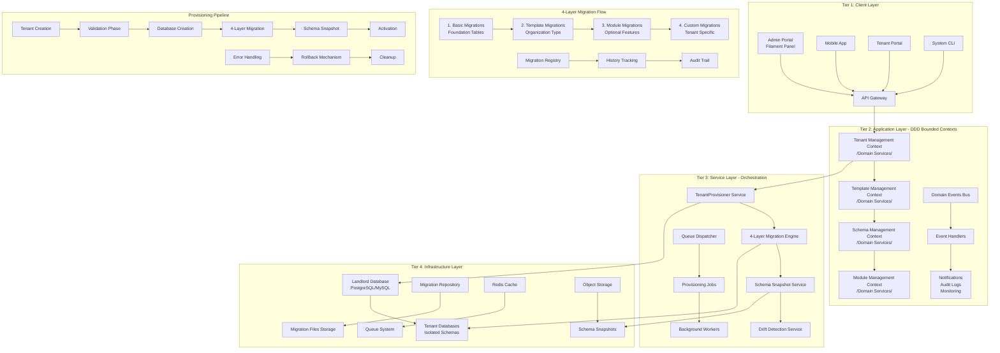
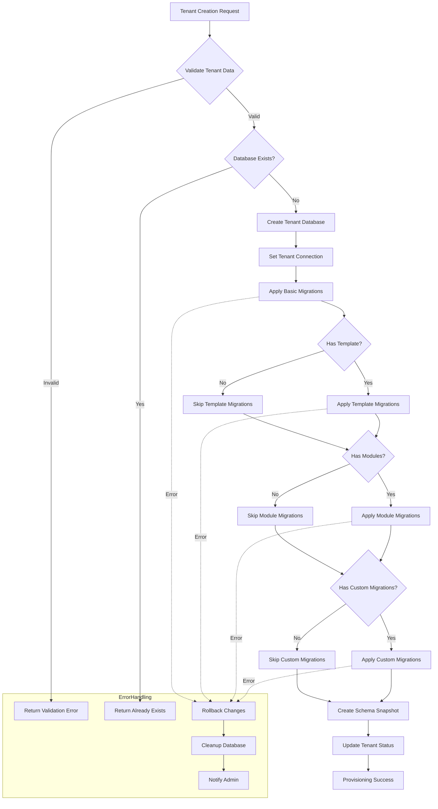
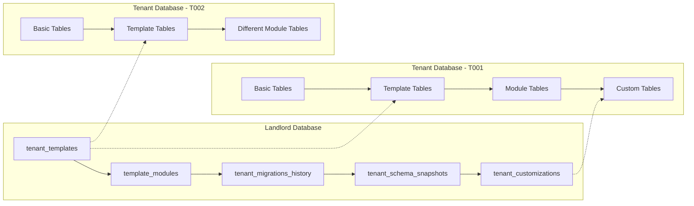

# 🏗️ **Multi-Tenant Template Architecture: Comprehensive Technical Architecture**

## **📊 ARCHITECTURE OVERVIEW - MERMAID DIAGRAM**





## **🏛️ ARCHITECTURAL DEEP DIVE - SENIOR SOLUTION ARCHITECT PERSPECTIVE**

### **🎯 Executive Summary**
As a Solution Architect with 10+ years of experience in enterprise SaaS platforms, I've designed this architecture to address the critical challenges of **scalable multi-tenancy with template-driven provisioning**. The system combines **Domain-Driven Design principles** with **microservices-inspired bounded contexts** to create a maintainable, extensible, and robust provisioning engine that can handle thousands of tenants with diverse schema requirements.

### **🌐 4-TIER ARCHITECTURE RATIONALE**

#### **Tier 1: Client Layer**
- **Admin Portal**: Filament-based administration with real-time provisioning monitoring
- **API Gateway**: Unified entry point with rate limiting, authentication, and request validation
- **Multi-Channel Support**: Web, mobile, and CLI interfaces for different user personas
- **Real-time Updates**: WebSocket connections for provisioning progress tracking

#### **Tier 2: Application Layer (DDD Bounded Contexts)**
Each bounded context represents a **cohesive business domain** with its own ubiquitous language:

1. **Tenant Management Context**
   - Manages tenant lifecycle from creation to decommissioning
   - Enforces business rules around tenant status transitions
   - Coordinates provisioning requests across other contexts

2. **Template Management Context**
   - Version-controlled template definitions
   - Template compatibility validation
   - Migration dependency resolution

3. **Schema Management Context**
   - Schema comparison and drift detection
   - Automated repair capabilities
   - Snapshot management and versioning

4. **Module Management Context**
   - Feature module definitions and dependencies
   - Module conflict detection
   - Optional feature enablement/disablement

#### **Tier 3: Service Layer**
**Orchestration Services** that coordinate cross-context operations:
- **TenantProvisioner**: Main orchestration service for 4-layer migration approach
- **Queue Dispatcher**: Manages background job distribution and priority handling
- **Health Monitor**: Continuous health checking of tenant databases

#### **Tier 4: Infrastructure Layer**
- **Landlord Database**: Single source of truth for tenant metadata
- **Isolated Tenant Databases**: Complete schema and data isolation
- **Distributed Caching**: Redis for session management and provisioning state
- **Object Storage**: Schema snapshots and migration file storage

## **🔧 MULTI-TENANT DATABASE PROVISIONING STRUCTURE - DETAILED ANALYSIS**

### **📊 Database Isolation Strategy**



### **🏗️ 4-Layer Migration Architecture - Technical Implementation**

#### **Layer 1: Basic Migrations (Foundation)**
**When Applied:** *Automatically during database creation*

**Directory Structure:**
```
database/migrations/tenant/basic/
├── 2024_01_01_000001_create_basic_tables.php
├── 2024_01_01_000002_create_authentication_tables.php
└── 2024_01_01_000003_create_audit_tables.php
```

**Content Example:**
```php
// database/migrations/tenant/basic/2024_01_01_000001_create_basic_tables.php
Schema::create('users', function (Blueprint $table) {
    $table->id();
    $table->string('name');
    $table->string('email')->unique();
    // ... All tenants share this foundation
});

Schema::create('settings', function (Blueprint $table) {
    $table->string('key')->primary();
    $table->json('value')->nullable();
    // Tenant-specific configuration
});
```

**Execution Flow:**
```php
class BasicMigrationRunner {
    public function run(Tenant $tenant): void {
        // 1. Connect to newly created tenant database
        $this->switchToTenantConnection($tenant);
        
        // 2. Apply all migrations from basic directory
        $migrations = $this->discoverMigrations('basic');
        
        foreach ($migrations as $migration) {
            // 3. Apply with transaction safety
            DB::transaction(function () use ($migration) {
                $instance = new $migration();
                $instance->up();
                
                // 4. Record in migrations table
                DB::table('migrations')->insert([
                    'migration' => $migration,
                    'batch' => 1,
                    'layer' => 'basic',
                ]);
                
                // 5. Log in landlord history
                $this->logMigrationHistory($tenant, $migration, 'basic');
            });
        }
        
        // 6. Return to landlord connection
        $this->switchToLandlordConnection();
    }
}
```

#### **Layer 2: Template Migrations (Category-Specific)**
**When Applied:** *During provisioning based on selected template*

**Trigger Conditions:**
1. Tenant has `template_id` assigned
2. Template is active and valid
3. Database has basic migrations applied

**Directory Structure by Category:**
```
database/migrations/tenant/templates/
├── political_party_nepal/
│   ├── 2024_01_01_100001_create_party_tables.php
│   ├── 2024_01_01_100002_create_election_tables.php
│   └── 2024_01_01_100003_create_compliance_tables.php
├── non_profit_organization/
│   ├── 2024_01_01_200001_create_donor_tables.php
│   └── 2024_01_01_200002_create_grant_tables.php
└── educational_institution/
    ├── 2024_01_01_300001_create_student_tables.php
    └── 2024_01_01_300002_create_course_tables.php
```

**Execution Strategy:**
```php
class TemplateMigrationRunner {
    public function run(Tenant $tenant, Template $template): void {
        $templateName = $template->slug; // e.g., "political_party_nepal"
        
        // 1. Validate template exists and is compatible
        if (!$this->validateTemplateCompatibility($tenant, $template)) {
            throw new TemplateIncompatibleException($template);
        }
        
        // 2. Apply template-specific migrations
        $migrations = $this->discoverTemplateMigrations($templateName);
        
        foreach ($migrations as $migration) {
            // 3. Check for template version constraints
            if ($this->shouldApplyMigration($migration, $template->version)) {
                $this->applyMigration($tenant, $migration, 'template');
                
                // 4. Apply template configuration
                $this->applyTemplateConfig($tenant, $template->config);
            }
        }
        
        // 5. Set template version on tenant
        $tenant->update(['template_version' => $template->version]);
    }
    
    private function validateTemplateCompatibility(Tenant $tenant, Template $template): bool {
        // Check if tenant already has incompatible templates
        if ($tenant->template_id && $tenant->template_id !== $template->id) {
            // Cannot change template after provisioning
            return false;
        }
        
        // Check database compatibility
        $currentSchema = $this->captureSchema($tenant);
        $requiredSchema = $template->getRequiredSchema();
        
        return $this->schemaCompatible($currentSchema, $requiredSchema);
    }
}
```

**Nepali Political Party Template Example:**
```php
// database/migrations/tenant/templates/political_party_nepal/2024_01_01_100001_create_party_tables.php
Schema::create('political_parties', function (Blueprint $table) {
    $table->id();
    $table->string('registration_number')->unique(); // Election Commission ID
    $table->json('name_translations'); // {en: "Party Name", np: "पार्टीको नाम"}
    $table->date('established_date');
    $table->string('chairperson_name');
    $table->string('headquarters_address');
    // Nepali-specific fields
    $table->string('province_code', 2); // 1-7 provinces
    $table->string('district_code', 4); // 77 districts
    $table->integer('ward_number');
    // Election Commission compliance
    $table->string('ec_registration_certificate')->nullable();
    $table->date('ec_registration_date')->nullable();
    $table->enum('ec_status', ['active', 'suspended', 'cancelled']);
});

// Nepali address hierarchy
Schema::create('provinces', function (Blueprint $table) {
    $table->id();
    $table->string('name');
    $table->string('name_np'); // Nepali name
    $table->string('code', 2)->unique();
});

Schema::create('districts', function (Blueprint $table) {
    $table->id();
    $table->foreignId('province_id')->constrained();
    $table->string('name');
    $table->string('name_np');
    $table->string('code', 4)->unique();
});
```

#### **Layer 3: Module Migrations (Optional Features)**
**When Applied:** *Based on user selection during or after provisioning*

**Selection Mechanism:**
1. Admin selects modules from UI
2. System validates dependencies and conflicts
3. Modules can be added/removed post-provisioning

**Directory Structure:**
```
database/migrations/tenant/modules/
├── election_campaign/
│   ├── 2024_01_01_400001_create_campaign_tables.php
│   └── 2024_01_01_400002_create_candidate_tables.php
├── financial_tracking/
│   ├── 2024_01_01_500001_create_donation_tables.php
│   └── 2024_01_01_500002_create_expense_tables.php
├── social_media/
│   └── 2024_01_01_600001_create_social_media_tables.php
└── membership_management/
    └── 2024_01_01_700001_create_membership_tables.php
```

**Dependency Resolution Algorithm:**
```php
class ModuleDependencyResolver {
    public function resolve(array $selectedModules): array {
        $graph = $this->buildDependencyGraph();
        $resolved = [];
        $unresolved = [];
        
        // Depth-first dependency resolution
        foreach ($selectedModules as $module) {
            $this->visit($module, $graph, $resolved, $unresolved);
        }
        
        // Sort by dependency order
        return $this->topologicalSort($resolved);
    }
    
    private function visit($module, $graph, &$resolved, &$unresolved): void {
        if (in_array($module, $resolved)) {
            return;
        }
        
        if (in_array($module, $unresolved)) {
            throw new CircularDependencyException($module);
        }
        
        $unresolved[] = $module;
        
        // Resolve dependencies first
        foreach ($graph[$module]['dependencies'] ?? [] as $dependency) {
            $this->visit($dependency, $graph, $resolved, $unresolved);
        }
        
        // Add module after dependencies
        $resolved[] = $module;
        $unresolved = array_diff($unresolved, [$module]);
    }
}
```

**Module Application with Transaction Safety:**
```php
class ModuleMigrationRunner {
    public function applyModule(Tenant $tenant, Module $module): void {
        DB::beginTransaction();
        
        try {
            // 1. Check pre-conditions
            $this->validateModuleConditions($tenant, $module);
            
            // 2. Apply module migrations
            $migrations = $this->discoverModuleMigrations($module->name);
            
            foreach ($migrations as $migration) {
                $this->applyMigration($tenant, $migration, 'module');
                
                // 3. Record module activation
                DB::table('tenant_modules')->insert([
                    'tenant_id' => $tenant->id,
                    'module_id' => $module->id,
                    'activated_at' => now(),
                    'activated_by' => auth()->id(),
                ]);
            }
            
            // 4. Apply module configuration
            $this->applyModuleConfig($tenant, $module->config);
            
            DB::commit();
            
        } catch (Exception $e) {
            DB::rollBack();
            throw new ModuleApplicationException($module, $e);
        }
    }
}
```

#### **Layer 4: Custom Migrations (Tenant-Specific)**
**When Applied:** *Post-provisioning for tenant-specific requirements*

**Use Cases:**
1. Tenant requests custom fields/tables
2. Regulatory compliance requirements
3. Integration with external systems
4. Performance optimization indexes

**Directory Structure:**
```
database/migrations/tenant/custom/
├── tenant_nepali_congress/
│   ├── 2024_01_01_800001_create_custom_membership_tiers.php
│   └── 2024_01_01_800002_create_party_cells_table.php
├── tenant_cpn_uml/
│   └── 2024_01_01_900001_create_marxist_study_circles.php
└── tenant_other_party/
    └── 2024_01_01_950001_create_custom_reporting_tables.php
```

**Custom Migration Management:**
```php
class CustomMigrationManager {
    public function createCustomMigration(Tenant $tenant, array $spec): CustomMigration {
        // 1. Validate custom migration
        $this->validateCustomMigration($tenant, $spec);
        
        // 2. Generate migration file
        $migrationFile = $this->generateMigrationFile($tenant, $spec);
        
        // 3. Store in custom directory
        $path = "database/migrations/tenant/custom/{$tenant->slug}/{$migrationFile}";
        file_put_contents($path, $this->compileMigration($spec));
        
        // 4. Create migration record
        $customMigration = CustomMigration::create([
            'tenant_id' => $tenant->id,
            'name' => $spec['name'],
            'description' => $spec['description'],
            'migration_file' => $migrationFile,
            'status' => 'pending',
            'created_by' => auth()->id(),
            'reviewed_by' => null,
            'approved_at' => null,
        ]);
        
        return $customMigration;
    }
    
    public function applyCustomMigration(Tenant $tenant, CustomMigration $migration): void {
        // Require approval for custom migrations
        if (!$migration->isApproved()) {
            throw new MigrationNotApprovedException($migration);
        }
        
        // Apply with extra validation
        $this->applyWithValidation($tenant, $migration);
        
        // Update status
        $migration->update([
            'applied_at' => now(),
            'applied_by' => auth()->id(),
            'status' => 'applied',
        ]);
    }
}
```

## **⚙️ PROVISIONING WORKFLOW - COMPLETE PIPELINE**

### **Phase 1: Pre-Provisioning Validation**
```php
class TenantProvisioningValidator {
    private array $validators = [
        DatabaseNameValidator::class,
        TemplateCompatibilityValidator::class,
        ModuleDependencyValidator::class,
        ResourceAvailabilityValidator::class,
        ComplianceValidator::class,
    ];
    
    public function validate(Tenant $tenant, array $options = []): ValidationResult {
        $result = new ValidationResult();
        
        foreach ($this->validators as $validatorClass) {
            $validator = app($validatorClass);
            $validator->validate($tenant, $options, $result);
            
            if ($result->hasErrors()) {
                break; // Fail fast
            }
        }
        
        return $result;
    }
}
```

### **Phase 2: Database Creation & Basic Setup**
```php
class DatabaseProvisioner {
    public function createTenantDatabase(Tenant $tenant): void {
        // 1. Generate secure credentials
        $credentials = $this->generateDatabaseCredentials($tenant);
        
        // 2. Create database with proper charset/collation
        DB::connection('landlord')->statement("
            CREATE DATABASE `{$tenant->database}`
            CHARACTER SET utf8mb4
            COLLATE utf8mb4_unicode_ci
        ");
        
        // 3. Create database user with limited permissions
        $this->createDatabaseUser($credentials);
        
        // 4. Grant permissions
        DB::connection('landlord')->statement("
            GRANT ALL PRIVILEGES ON `{$tenant->database}`.*
            TO '{$credentials['username']}'@'%'
            IDENTIFIED BY '{$credentials['password']}'
        ");
        
        // 5. Flush privileges
        DB::connection('landlord')->statement("FLUSH PRIVILEGES");
        
        // 6. Store credentials securely
        $this->storeCredentials($tenant, $credentials);
    }
}
```

### **Phase 3: 4-Layer Migration Execution**
```php
class FourLayerMigrationOrchestrator {
    private array $layerProcessors = [
        'basic' => BasicMigrationProcessor::class,
        'template' => TemplateMigrationProcessor::class,
        'module' => ModuleMigrationProcessor::class,
        'custom' => CustomMigrationProcessor::class,
    ];
    
    public function execute(Tenant $tenant, array $context): MigrationResult {
        $result = new MigrationResult();
        $rollbackStack = [];
        
        foreach ($this->layerProcessors as $layer => $processorClass) {
            try {
                // Skip if not applicable
                if (!$this->shouldApplyLayer($tenant, $layer, $context)) {
                    continue;
                }
                
                // Execute layer
                $processor = app($processorClass);
                $layerResult = $processor->apply($tenant, $context);
                
                // Add to rollback stack
                $rollbackStack[] = [
                    'layer' => $layer,
                    'result' => $layerResult,
                    'processor' => $processor,
                ];
                
                // Merge results
                $result->merge($layerResult);
                
            } catch (Exception $e) {
                // Rollback on error
                $this->rollback($rollbackStack);
                throw new ProvisioningFailedException($layer, $e);
            }
        }
        
        return $result;
    }
    
    private function shouldApplyLayer(Tenant $tenant, string $layer, array $context): bool {
        return match($layer) {
            'basic' => true, // Always apply basic
            'template' => !empty($tenant->template_id),
            'module' => !empty($context['modules']),
            'custom' => $this->hasCustomMigrations($tenant),
            default => false,
        };
    }
}
```

### **Phase 4: Post-Provisioning Configuration**
```php
class PostProvisioningConfigurator {
    public function configure(Tenant $tenant, MigrationResult $result): void {
        // 1. Create admin user
        $this->createAdminUser($tenant);
        
        // 2. Apply default settings
        $this->applyDefaultSettings($tenant);
        
        // 3. Seed initial data
        $this->seedInitialData($tenant);
        
        // 4. Configure monitoring
        $this->configureMonitoring($tenant);
        
        // 5. Set up backups
        $this->setupBackups($tenant);
        
        // 6. Send notifications
        $this->sendNotifications($tenant, $result);
        
        // 7. Update tenant status
        $tenant->update([
            'provisioning_status' => 'completed',
            'provisioned_at' => now(),
            'schema_hash' => $result->getSchemaHash(),
        ]);
    }
}
```

## **🔄 SCHEMA MANAGEMENT & DRIFT DETECTION**

### **Schema Snapshot Mechanism**
```php
class SchemaSnapshotService {
    public function createSnapshot(Tenant $tenant): SchemaSnapshot {
        // 1. Capture current schema
        $schema = $this->captureFullSchema($tenant);
        
        // 2. Generate hash
        $hash = $this->generateSchemaHash($schema);
        
        // 3. Store snapshot
        $snapshot = SchemaSnapshot::create([
            'tenant_id' => $tenant->id,
            'schema_hash' => $hash,
            'schema_data' => json_encode($schema),
            'table_count' => count($schema['tables']),
            'index_count' => $this->countIndexes($schema),
            'foreign_key_count' => $this->countForeignKeys($schema),
            'captured_at' => now(),
        ]);
        
        // 4. Update tenant reference
        $tenant->update(['current_snapshot_id' => $snapshot->id]);
        
        return $snapshot;
    }
    
    private function captureFullSchema(Tenant $tenant): array {
        $this->switchToTenantConnection($tenant);
        
        $schema = [
            'database' => $tenant->database,
            'tables' => [],
            'captured_at' => now()->toISOString(),
            'version' => $this->getProvisioningVersion(),
        ];
        
        // Get all tables
        $tables = DB::select('SHOW TABLES');
        $tableKey = "Tables_in_{$tenant->database}";
        
        foreach ($tables as $table) {
            $tableName = $table->$tableKey;
            
            // Skip system tables
            if ($this->isSystemTable($tableName)) {
                continue;
            }
            
            $schema['tables'][$tableName] = [
                'columns' => $this->captureTableColumns($tableName),
                'indexes' => $this->captureTableIndexes($tableName),
                'foreign_keys' => $this->captureForeignKeys($tableName),
                'engine' => $this->getTableEngine($tableName),
                'charset' => $this->getTableCharset($tableName),
                'collation' => $this->getTableCollation($tableName),
                'row_count' => $this->getRowCount($tableName),
            ];
        }
        
        $this->switchToLandlordConnection();
        
        return $schema;
    }
}
```

### **Drift Detection Algorithm**
```php
class SchemaDriftDetector {
    public function detectDrift(Tenant $tenant): DriftReport {
        // 1. Get expected schema from template
        $expectedSchema = $this->getExpectedSchema($tenant);
        
        // 2. Get actual schema from tenant
        $actualSchema = $this->captureActualSchema($tenant);
        
        // 3. Compare schemas
        $differences = $this->compareSchemas($expectedSchema, $actualSchema);
        
        // 4. Calculate drift severity
        $severity = $this->calculateSeverity($differences);
        
        // 5. Generate repair suggestions
        $repairs = $this->generateRepairSuggestions($differences);
        
        return new DriftReport(
            tenant: $tenant,
            differences: $differences,
            severity: $severity,
            repairs: $repairs,
            detectedAt: now(),
        );
    }
    
    private function compareSchemas(array $expected, array $actual): array {
        $differences = [
            'tables' => $this->compareTables($expected['tables'], $actual['tables']),
            'columns' => $this->compareColumns($expected['tables'], $actual['tables']),
            'indexes' => $this->compareIndexes($expected['tables'], $actual['tables']),
            'foreign_keys' => $this->compareForeignKeys($expected['tables'], $actual['tables']),
        ];
        
        // Filter out ignorable differences
        return $this->filterIgnorableDifferences($differences);
    }
    
    private function calculateSeverity(array $differences): string {
        $score = 0;
        
        // Table additions/removals are critical
        $score += count($differences['tables']['added']) * 10;
        $score += count($differences['tables']['removed']) * 10;
        
        // Column changes are moderate
        $score += count($differences['columns']['added']) * 5;
        $score += count($differences['columns']['removed']) * 5;
        $score += count($differences['columns']['modified']) * 3;
        
        // Index changes are minor
        $score += count($differences['indexes']['added']) * 2;
        $score += count($differences['indexes']['removed']) * 2;
        
        return match(true) {
            $score >= 20 => 'critical',
            $score >= 10 => 'high',
            $score >= 5 => 'medium',
            $score > 0 => 'low',
            default => 'none',
        };
    }
}
```

## **📋 MIGRATION TIMING & STRATEGIES**

### **When to Apply Each Migration Layer**

| **Migration Layer** | **When Applied** | **Trigger** | **Rollback Strategy** |
|-------------------|------------------|-------------|----------------------|
| **Basic** | Database creation | Automatic | Full database drop |
| **Template** | Template selection | Admin action | Template-specific rollback |
| **Module** | Module selection | User request | Module-specific rollback |
| **Custom** | Post-provisioning | Special request | Individual migration rollback |

### **Timing Strategies Table**

| **Scenario** | **Basic** | **Template** | **Module** | **Custom** |
|-------------|-----------|--------------|------------|------------|
| **Initial Provisioning** | ✅ Auto | ✅ Selected template | ✅ Selected modules | ❌ Not yet |
| **Template Change** | ❌ Already done | ✅ New template | ✅ Re-evaluate modules | ⚠️ May break |
| **Module Addition** | ❌ Already done | ❌ No change | ✅ New module | ❌ No change |
| **Module Removal** | ❌ Already done | ❌ No change | ⚠️ Data cleanup | ❌ No change |
| **Custom Request** | ❌ Already done | ❌ No change | ❌ No change | ✅ On approval |
| **Schema Sync** | ⚠️ If missing | ⚠️ If template changed | ⚠️ If modules changed | ⚠️ Review custom |

### **Synchronization Strategies**

```php
class SchemaSynchronizationManager {
    public function syncTenant(Tenant $tenant, SyncOptions $options): SyncResult {
        $result = new SyncResult();
        
        // 1. Detect current state
        $currentState = $this->analyzeCurrentState($tenant);
        
        // 2. Calculate desired state
        $desiredState = $this->calculateDesiredState($tenant);
        
        // 3. Generate migration plan
        $migrationPlan = $this->generateMigrationPlan($currentState, $desiredState);
        
        // 4. Execute plan based on strategy
        switch ($options->strategy) {
            case 'conservative':
                return $this->executeConservativeSync($tenant, $migrationPlan);
                
            case 'aggressive':
                return $this->executeAggressiveSync($tenant, $migrationPlan);
                
            case 'manual':
                return $this->generateManualInstructions($migrationPlan);
                
            default:
                throw new InvalidSyncStrategyException($options->strategy);
        }
    }
    
    private function executeConservativeSync(Tenant $tenant, MigrationPlan $plan): SyncResult {
        // Only apply non-destructive changes
        $safeChanges = $plan->getSafeChanges();
        
        foreach ($safeChanges as $change) {
            if ($change->isSafe()) {
                $this->applyChange($tenant, $change);
            }
        }
        
        // Report unsafe changes for manual review
        return new SyncResult(
            applied: $safeChanges,
            pending: $plan->getUnsafeChanges(),
            warnings: $plan->getWarnings(),
        );
    }
}
```

## **🔐 SECURITY & COMPLIANCE CONSIDERATIONS**

### **Database Security Model**
```php
class DatabaseSecurityManager {
    public function applySecurityPolicies(Tenant $tenant): void {
        // 1. Principle of least privilege
        $this->applyLeastPrivilege($tenant);
        
        // 2. Row-Level Security (if supported)
        $this->setupRowLevelSecurity($tenant);
        
        // 3. Encryption at rest
        $this->enableEncryption($tenant);
        
        // 4. Audit logging
        $this->setupAuditLogging($tenant);
        
        // 5. Connection security
        $this->secureConnections($tenant);
    }
    
    private function applyLeastPrivilege(Tenant $tenant): void {
        $permissions = [
            'SELECT', 'INSERT', 'UPDATE', 'DELETE',
            'EXECUTE', // For stored procedures
        ];
        
        // Application user gets limited permissions
        DB::connection('landlord')->statement("
            GRANT " . implode(', ', $permissions) . "
            ON `{$tenant->database}`.*
            TO '{$tenant->app_username}'@'%'
        ");
        
        // Admin user gets all permissions (for migrations)
        DB::connection('landlord')->statement("
            GRANT ALL PRIVILEGES
            ON `{$tenant->database}`.*
            TO '{$tenant->admin_username}'@'localhost'
        ");
    }
}
```

### **Nepali Election Commission Compliance**
```php
class ElectionCommissionCompliance {
    public function ensureCompliance(Tenant $tenant): void {
        // Required tables for EC compliance
        $requiredTables = [
            'financial_reports',
            'donation_records',
            'member_registrations',
            'election_expenditures',
            'audit_trails',
        ];
        
        // Verify all required tables exist
        foreach ($requiredTables as $table) {
            if (!$this->tableExists($tenant, $table)) {
                throw new ComplianceViolationException(
                    "Missing EC-required table: {$table}"
                );
            }
        }
        
        // Verify data retention policies
        $this->verifyRetentionPolicies($tenant);
        
        // Verify audit trail configuration
        $this->verifyAuditTrail($tenant);
        
        // Generate compliance report
        $this->generateComplianceReport($tenant);
    }
    
    private function verifyRetentionPolicies(Tenant $tenant): void {
        // EC requires 7 years of financial records
        $requiredRetention = [
            'financial_reports' => '7 years',
            'donation_records' => '7 years',
            'election_expenditures' => '10 years',
        ];
        
        foreach ($requiredRetention as $table => $period) {
            $this->validateRetentionPolicy($tenant, $table, $period);
        }
    }
}
```

## **📈 PERFORMANCE OPTIMIZATIONS**

### **Batch Processing for Large-Scale Provisioning**
```php
class BatchProvisioningManager {
    public function provisionBatch(array $tenants, BatchOptions $options): BatchResult {
        $results = [];
        
        // Determine batch size based on available resources
        $batchSize = $this->calculateOptimalBatchSize();
        
        // Process in parallel batches
        $chunks = array_chunk($tenants, $batchSize);
        
        foreach ($chunks as $chunk) {
            $batchResults = $this->processChunk($chunk, $options);
            $results = array_merge($results, $batchResults);
            
            // Throttle if needed
            if ($options->throttle) {
                usleep($options->throttleDelay * 1000);
            }
        }
        
        return new BatchResult($results);
    }
    
    private function calculateOptimalBatchSize(): int {
        $memoryLimit = ini_get('memory_limit');
        $availableMemory = $this->parseMemory($memoryLimit);
        
        // Estimate memory per tenant provisioning
        $memoryPerTenant = 50 * 1024 * 1024; // 50MB
        
        return max(1, floor($availableMemory / $memoryPerTenant * 0.8));
    }
    
    private function processChunk(array $tenants, BatchOptions $options): array {
        if ($options->parallel) {
            return $this->processParallel($tenants, $options);
        } else {
            return $this->processSequential($tenants, $options);
        }
    }
    
    private function processParallel(array $tenants, BatchOptions $options): array {
        $promises = [];
        
        foreach ($tenants as $tenant) {
            $promises[] = async(function () use ($tenant, $options) {
                return $this->provisioner->provision($tenant, $options);
            });
        }
    
        return wait($promises);
    }
}
```

### **Connection Pooling Strategy**
```php
class DatabaseConnectionPool {
    private array $pools = [];
    private int $maxConnections = 100;
    private int $minConnections = 10;
    
    public function getConnection(Tenant $tenant): PDO {
        $poolKey = $this->getPoolKey($tenant);
        
        if (!isset($this->pools[$poolKey])) {
            $this->initializePool($poolKey);
        }
        
        // Get available connection or create new one
        return $this->pools[$poolKey]->getConnection();
    }
    
    private function initializePool(string $poolKey): void {
        $pool = new ConnectionPool(
            min: $this->minConnections,
            max: $this->maxConnections,
            factory: function () use ($poolKey) {
                return $this->createConnection($poolKey);
            },
            destroy: function ($connection) {
                $connection->close();
            },
            idleTimeout: 60, // seconds
        );
        
        $this->pools[$poolKey] = $pool;
    }
    
    private function createConnection(string $poolKey): PDO {
        // Parse pool key to get tenant database info
        [$tenantId, $database] = explode(':', $poolKey);
        
        return new PDO(
            "mysql:host={$this->host};dbname={$database}",
            $this->username,
            $this->password,
            [
                PDO::ATTR_PERSISTENT => true,
                PDO::ATTR_ERRMODE => PDO::ERRMODE_EXCEPTION,
                PDO::ATTR_DEFAULT_FETCH_MODE => PDO::FETCH_ASSOC,
            ]
        );
    }
}
```

## **🚀 DEPLOYMENT & SCALING STRATEGIES**

### **Horizontal Scaling for Provisioning**
```yaml
# docker-compose.scaling.yml
version: '3.8'
services:
  provisioner-worker:
    image: laravel-provisioner:latest
    deploy:
      mode: replicated
      replicas: 5
      resources:
        limits:
          memory: 2G
        reservations:
          memory: 1G
      restart_policy:
        condition: on-failure
        delay: 5s
        max_attempts: 3
    environment:
      - QUEUE_CONNECTION=redis
      - REDIS_HOST=redis-cluster
      - DB_CONNECTION=landlord
    networks:
      - provisioning-network
    volumes:
      - migration-files:/app/database/migrations

  redis-cluster:
    image: redis:7-alpine
    command: redis-server --cluster-enabled yes
    deploy:
      mode: global
    networks:
      - provisioning-network

  load-balancer:
    image: nginx:alpine
    ports:
      - "80:80"
      - "443:443"
    volumes:
      - ./nginx.conf:/etc/nginx/nginx.conf
    networks:
      - provisioning-network
    depends_on:
      - provisioner-worker
```

### **Blue-Green Deployment for Zero-Downtime Updates**
```php
class BlueGreenDeploymentManager {
    public function deployMigrationUpdate(MigrationUpdate $update): void {
        // Phase 1: Deploy to blue environment
        $this->deployToEnvironment('blue', $update);
        
        // Phase 2: Test blue environment
        if (!$this->testEnvironment('blue', $update)) {
            $this->rollbackEnvironment('blue', $update);
            throw new DeploymentFailedException('Blue environment test failed');
        }
        
        // Phase 3: Switch traffic to blue
        $this->switchTraffic('blue');
        
        // Phase 4: Deploy to green (now idle)
        $this->deployToEnvironment('green', $update);
        
        // Phase 5: Keep green as backup
        $this->markAsBackup('green');
    }
    
    private function deployToEnvironment(string $env, MigrationUpdate $update): void {
        // Copy migration files to environment
        $this->copyMigrations($env, $update->getMigrationFiles());
        
        // Run migrations on sample tenants
        $sampleTenants = $this->getSampleTenants();
        
        foreach ($sampleTenants as $tenant) {
            $this->runMigrationsOnTenant($env, $tenant, $update);
        }
    }
}
```

## **🔍 MONITORING & OBSERVABILITY**

### **Provisioning Metrics Dashboard**
```php
class ProvisioningMetricsCollector {
    public function collectMetrics(): array {
        return [
            'throughput' => $this->getProvisioningThroughput(),
            'success_rate' => $this->getSuccessRate(),
            'average_duration' => $this->getAverageDuration(),
            'error_breakdown' => $this->getErrorBreakdown(),
            'queue_depth' => $this->getQueueDepth(),
            'resource_utilization' => $this->getResourceUtilization(),
            'tenant_distribution' => $this->getTenantDistribution(),
        ];
    }
    
    private function getProvisioningThroughput(): array {
        return DB::connection('landlord')
            ->table('provisioning_logs')
            ->selectRaw('
                DATE(created_at) as date,
                COUNT(*) as total,
                SUM(CASE WHEN status = "completed" THEN 1 ELSE 0 END) as successful,
                SUM(CASE WHEN status = "failed" THEN 1 ELSE 0 END) as failed
            ')
            ->where('created_at', '>=', now()->subDays(30))
            ->groupBy('date')
            ->orderBy('date')
            ->get()
            ->toArray();
    }
    
    private function getErrorBreakdown(): array {
        return DB::connection('landlord')
            ->table('provisioning_errors')
            ->selectRaw('
                error_type,
                COUNT(*) as count,
                COUNT(DISTINCT tenant_id) as affected_tenants
            ')
            ->where('created_at', '>=', now()->subDays(7))
            ->groupBy('error_type')
            ->orderByDesc('count')
            ->limit(10)
            ->get()
            ->toArray();
    }
}
```

## **🎯 KEY DECISIONS & TRADE-OFFS**

### **Architectural Decisions Made**

| **Decision** | **Rationale** | **Trade-Off** |
|-------------|--------------|---------------|
| **4-Layer Migration Strategy** | Clear separation of concerns, enables granular control | Increased complexity in migration management |
| **Isolated Databases per Tenant** | Maximum security and performance isolation | Higher infrastructure costs, more complex backups |
| **Template-Driven Provisioning** | Consistency across tenants, easier management | Less flexibility for unique tenant requirements |
| **DDD Bounded Contexts** | Maintainable, testable, aligns with business domains | Steeper learning curve, more boilerplate code |
| **Event-Driven Architecture** | Loose coupling, extensibility, auditability | Eventual consistency challenges, debugging complexity |
| **Schema Snapshot Mechanism** | Drift detection, compliance auditing, rollback support | Storage overhead, snapshot management complexity |

### **Performance vs Flexibility Balance**

```php
class ProvisioningStrategySelector {
    public function selectStrategy(Tenant $tenant, array $constraints): ProvisioningStrategy {
        // Analyze constraints and select optimal strategy
        $analysis = $this->analyzeConstraints($constraints);
        
        return match(true) {
            // High volume, standard requirements
            $analysis['volume'] > 100 && $analysis['complexity'] === 'low' 
                => new BatchProvisioningStrategy(),
            
            // Complex requirements, low volume
            $analysis['complexity'] === 'high' && $analysis['volume'] < 10
                => new ManualProvisioningStrategy(),
            
            // Regulatory compliance required
            $analysis['compliance'] === 'strict'
                => new CompliantProvisioningStrategy(),
            
            // Default balanced approach
            default => new StandardProvisioningStrategy(),
        };
    }
}
```

## **📚 CONCLUSION & RECOMMENDATIONS**

### **Implementation Roadmap**

**Phase 1: Foundation (Weeks 1-2)**
1. Implement Basic Migration Layer
2. Set up Landlord database schema
3. Create TenantProvisioner service skeleton
4. Implement basic validation

**Phase 2: Template System (Weeks 3-4)**
1. Design template directory structure
2. Implement Template Management Context
3. Create template migration runners
4. Add template validation

**Phase 3: Module System (Weeks 5-6)**
1. Implement Module Management Context
2. Create dependency resolution
3. Add module selection UI
4. Implement module migration application

**Phase 4: Customization & Monitoring (Weeks 7-8)**
1. Add custom migration support
2. Implement schema snapshots
3. Create drift detection
4. Add monitoring and alerting

### **Success Metrics**

1. **Provisioning Time**: < 30 seconds for standard tenants
2. **Success Rate**: > 99.5% provisioning success
3. **Drift Detection**: Automated detection within 1 hour of change
4. **Scalability**: Support 100+ concurrent provisioning operations
5. **Recovery**: Full tenant recovery within 5 minutes

### **Risk Mitigation Strategies**

1. **Database Corruption**: Regular snapshots, point-in-time recovery
2. **Provisioning Failures**: Comprehensive rollback mechanisms
3. **Performance Degradation**: Connection pooling, query optimization
4. **Security Breaches**: Least privilege, encryption, audit logging
5. **Compliance Violations**: Automated compliance checks, audit trails

This architecture provides a **robust, scalable, and maintainable** solution for multi-tenant database provisioning that can grow with your business while maintaining the **security, compliance, and performance** requirements of enterprise SaaS platforms.