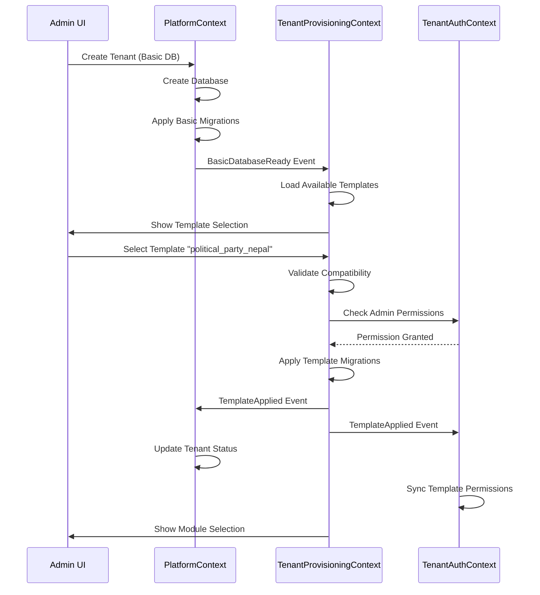

# 🏛️ **PROPOSED NEW CONTEXT: `TenantProvisioningContext`**

Based on your sophisticated DDD structure and existing contexts, I propose a **dedicated new context** for template-driven multi-tenant provisioning. Here's why and how it fits:

## **🎯 WHY A NEW CONTEXT IS NEEDED**

Looking at your existing contexts:
- **`PlatformContext`** - Manages platform-level operations, applications, and basic tenant setup
- **`TenantAuthContext`** - Handles tenant-specific authentication and user management
- **`ElectionContext`** - Manages election-specific business logic
- **`ElectionSetupContext`** - Handles election setup and requests

**The Gap:** Template-driven database provisioning with 4-layer migrations is a **distinct bounded context** with:
- Its own ubiquitous language (templates, modules, migrations, snapshots, drift)
- Complex business rules (dependency resolution, compatibility, rollback)
- Specialized domain experts (DBA, DevOps, Platform Architects)

## **🏗️ PROPOSED: `TenantProvisioningContext`**

```
app/Contexts/TenantProvisioning/
├── Application/
│   ├── Commands/
│   │   ├── ApplyTemplateMigrationCommand.php
│   │   ├── ApplyModuleMigrationCommand.php
│   │   ├── ApplyCustomMigrationCommand.php
│   │   ├── CreateSchemaSnapshotCommand.php
│   │   ├── DetectSchemaDriftCommand.php
│   │   └── RepairSchemaDriftCommand.php
│   ├── Handlers/
│   │   ├── ApplyTemplateMigrationHandler.php
│   │   ├── ApplyModuleMigrationHandler.php
│   │   ├── ApplyCustomMigrationHandler.php
│   │   ├── CreateSchemaSnapshotHandler.php
│   │   ├── DetectSchemaDriftHandler.php
│   │   └── RepairSchemaDriftHandler.php
│   ├── Ports/
│   │   ├── TemplateRepositoryInterface.php
│   │   ├── ModuleRepositoryInterface.php
│   │   ├── MigrationHistoryRepositoryInterface.php
│   │   ├── SchemaSnapshotRepositoryInterface.php
│   │   └── TenantDatabaseConnectionInterface.php
│   ├── Queries/
│   │   ├── GetAvailableTemplatesQuery.php
│   │   ├── GetAvailableModulesQuery.php
│   │   ├── GetMigrationHistoryQuery.php
│   │   ├── GetSchemaStatusQuery.php
│   │   └── GetDriftReportQuery.php
│   └── Services/
│       ├── TemplateMigrationService.php
│       ├── ModuleMigrationService.php
│       ├── CustomMigrationService.php
│       ├── SchemaSnapshotService.php
│       ├── SchemaDriftDetectionService.php
│       ├── MigrationDependencyResolver.php
│       └── MigrationCompatibilityValidator.php
├── Domain/
│   ├── Entities/
│   │   ├── Template.php
│   │   ├── TemplateVersion.php
│   │   ├── Module.php
│   │   ├── Migration.php
│   │   ├── SchemaSnapshot.php
│   │   └── MigrationHistory.php
│   ├── Events/
│   │   ├── TemplateApplied.php
│   │   ├── ModuleApplied.php
│   │   ├── CustomMigrationApplied.php
│   │   ├── SchemaSnapshotCreated.php
│   │   ├── SchemaDriftDetected.php
│   │   └── MigrationRolledBack.php
│   ├── Exceptions/
│   │   ├── TemplateIncompatibleException.php
│   │   ├── ModuleDependencyException.php
│   │   ├── MigrationFailedException.php
│   │   ├── SchemaDriftException.php
│   │   └── RollbackFailedException.php
│   ├── Services/
│   │   ├── TemplateCompatibilityService.php
│   │   ├── ModuleDependencyService.php
│   │   ├── MigrationExecutionService.php
│   │   └── SchemaComparisonService.php
│   ├── Specifications/
│   │   ├── TemplateCompatibilitySpecification.php
│   │   ├── ModuleDependencySpecification.php
│   │   ├── MigrationApplicableSpecification.php
│   │   └── SchemaHealthySpecification.php
│   └── ValueObjects/
│       ├── TemplateSlug.php
│       ├── ModuleSlug.php
│       ├── MigrationId.php
│       ├── SchemaHash.php
│       ├── DriftSeverity.php
│       ├── MigrationStatus.php
│       ├── TemplateType.php
│       └── ModuleCategory.php
├── Infrastructure/
│   ├── Database/
│   │   ├── Migrations/
│   │   │   ├── 2025_01_01_000001_create_template_definitions_table.php
│   │   │   ├── 2025_01_01_000002_create_module_definitions_table.php
│   │   │   ├── 2025_01_01_000003_create_migration_history_table.php
│   │   │   ├── 2025_01_01_000004_create_schema_snapshots_table.php
│   │   │   └── 2025_01_01_000005_create_template_module_compatibility_table.php
│   │   ├── Models/
│   │   │   ├── TemplateDefinitionModel.php
│   │   │   ├── ModuleDefinitionModel.php
│   │   │   ├── MigrationHistoryModel.php
│   │   │   ├── SchemaSnapshotModel.php
│   │   │   └── TemplateModuleCompatibilityModel.php
│   │   └── Seeders/
│   │       ├── DefaultTemplatesSeeder.php
│   │       ├── DefaultModulesSeeder.php
│   │       └── NepaliContextSeeder.php
│   ├── External/
│   │   ├── TemplateStorage/
│   │   │   ├── PoliticalPartyNepal/
│   │   │   │   ├── template.json
│   │   │   │   ├── migrations/
│   │   │   │   ├── seeders/
│   │   │   │   └── config/
│   │   │   ├── NonProfitOrganization/
│   │   │   └── CommunityGroup/
│   │   ├── ModuleStorage/
│   │   │   ├── ElectionCampaign/
│   │   │   ├── FinancialTracking/
│   │   │   ├── SocialMedia/
│   │   │   └── MembershipManagement/
│   │   └── CustomMigrationStorage/
│   │       └── {tenant-slug}/
│   ├── Http/
│   │   ├── Controllers/
│   │   │   ├── Admin/
│   │   │   │   ├── TemplateManagementController.php
│   │   │   │   ├── ModuleManagementController.php
│   │   │   │   ├── MigrationHistoryController.php
│   │   │   │   └── SchemaHealthController.php
│   │   │   └── Tenant/
│   │   │       ├── TenantTemplateController.php
│   │   │       ├── TenantModuleController.php
│   │   │       └── TenantCustomMigrationController.php
│   │   ├── Middleware/
│   │   │   ├── TenantProvisioningEnabled.php
│   │   │   └── TemplateCompatibilityCheck.php
│   │   ├── Requests/
│   │   │   ├── ApplyTemplateRequest.php
│   │   │   ├── ApplyModuleRequest.php
│   │   │   ├── ApplyCustomMigrationRequest.php
│   │   │   └── CreateSnapshotRequest.php
│   │   └── Resources/
│   │       ├── TemplateResource.php
│   │       ├── ModuleResource.php
│   │       ├── MigrationHistoryResource.php
│   │       └── SchemaSnapshotResource.php
│   ├── Providers/
│   │   └── TenantProvisioningServiceProvider.php
│   └── Repositories/
│       ├── EloquentTemplateRepository.php
│       ├── EloquentModuleRepository.php
│       ├── EloquentMigrationHistoryRepository.php
│       ├── EloquentSchemaSnapshotRepository.php
│       └── FileSystemMigrationRepository.php
├── Presentation/
│   ├── Http/
│   │   ├── Controllers/
│   │   │   ├── Admin/
│   │   │   │   ├── ProvisioningDashboardController.php
│   │   │   │   └── MigrationAuditController.php
│   │   │   └── Api/
│   │   │       ├── V1/
│   │   │       │   ├── TemplatesController.php
│   │   │       │   └── ModulesController.php
│   │   │       └── V2/
│   │   │           ├── SchemaHealthController.php
│   │   │           └── MigrationHistoryController.php
│   │   ├── Middleware/
│   │   │   └── ApiVersion.php
│   │   └── Requests/
│   │       └── Admin/
│   │           ├── ProvisioningRequest.php
│   │           └── MigrationAuditRequest.php
│   ├── Cli/
│   │   └── Commands/
│   │       ├── ProvisionTenantCommand.php
│   │       ├── ApplyTemplateCommand.php
│   │       ├── ApplyModuleCommand.php
│   │       └── DetectDriftCommand.php
│   └── Web/
│       └── Components/
│           ├── TemplateSelector.php
│           ├── ModuleSelector.php
│           └── MigrationTimeline.php
└── readme.md
```

## **🔄 HOW IT INTEGRATES WITH EXISTING CONTEXTS**

### **1. Integration with `PlatformContext`**

**PlatformContext** handles basic tenant database creation:
```php
// app/Contexts/Platform/Application/Services/TenantProvisioningService.php
class TenantProvisioningService
{
    public function provisionBasicDatabase(Tenant $tenant): void
    {
        // 1. Create database (PlatformContext responsibility)
        $this->databaseProvisioner->createDatabase($tenant);
        
        // 2. Apply basic migrations (PlatformContext responsibility)
        $this->applyBasicMigrations($tenant);
        
        // 3. Mark as ready for template selection
        $tenant->update([
            'provisioning_status' => 'basic_ready',
            'database_created_at' => now(),
        ]);
        
        // 4. Raise event for TenantProvisioningContext
        event(new BasicDatabaseReady($tenant));
    }
}
```

**TenantProvisioningContext** listens and prepares for template selection:
```php
// app/Contexts/TenantProvisioning/Infrastructure/Listeners/HandleBasicDatabaseReady.php
class HandleBasicDatabaseReady
{
    public function handle(BasicDatabaseReady $event): void
    {
        $tenant = $event->tenant;
        
        // 1. Load available templates for this tenant type
        $templates = $this->templateRepository->getAvailableForTenant($tenant);
        
        // 2. Store in cache for quick access
        Cache::put("tenant:{$tenant->id}:available_templates", $templates, 3600);
        
        // 3. Notify admin UI that tenant is ready for template selection
        $this->notificationService->notifyAdmin(
            $tenant->admin_user_id,
            'Tenant ready for template selection',
            "Tenant {$tenant->name} is ready for template selection."
        );
    }
}
```

### **2. Integration with `TenantAuthContext`**

**TenantAuthContext** provides tenant authentication, **TenantProvisioningContext** uses it:
```php
// app/Contexts/TenantProvisioning/Application/Services/TemplateMigrationService.php
class TemplateMigrationService
{
    private TenantAuthResolver $authResolver;
    
    public function applyTemplate(Tenant $tenant, TemplateSlug $templateSlug): void
    {
        // 1. Verify admin has permission via TenantAuthContext
        if (!$this->authResolver->canAdministerTenant($tenant)) {
            throw new UnauthorizedException('Cannot apply template to this tenant');
        }
        
        // 2. Get template from storage
        $template = $this->templateRepository->findBySlug($templateSlug);
        
        // 3. Apply template migrations
        $this->executeTemplateMigrations($tenant, $template);
        
        // 4. Update tenant auth context about new schema
        event(new TemplateApplied($tenant, $template, auth()->user()));
    }
}
```

### **3. Context Communication via Events**

```php
// app/Contexts/TenantProvisioning/Domain/Events/TemplateApplied.php
class TemplateApplied implements ShouldBroadcast
{
    public function __construct(
        public Tenant $tenant,
        public Template $template,
        public User $appliedBy
    ) {}
    
    public function broadcastOn(): array
    {
        return [
            new PrivateChannel("tenant.{$this->tenant->id}.provisioning"),
            new Channel("admin.provisioning.updates"),
        ];
    }
}

// PlatformContext listens to update tenant status
class UpdateTenantStatusOnTemplateApplied
{
    public function handle(TemplateApplied $event): void
    {
        $event->tenant->update([
            'template_id' => $event->template->getId(),
            'template_applied_at' => now(),
            'provisioning_status' => 'template_applied',
        ]);
    }
}

// TenantAuthContext listens to update permissions
class UpdateAuthPermissionsOnTemplateApplied
{
    public function handle(TemplateApplied $event): void
    {
        // Template might introduce new roles/permissions
        $this->permissionService->syncTemplatePermissions(
            $event->tenant,
            $event->template
        );
    }
}
```

## **📁 PRE-DEVELOPED TEMPLATES & MODULES STRUCTURE**

### **External Storage Structure (Decoupled from Code)**
```
storage/app/templates/
├── political_party_nepal/
│   ├── template.json
│   ├── migrations/
│   │   ├── 001_create_party_tables.php
│   │   ├── 002_create_committee_structure.php
│   │   ├── 003_create_financial_compliance.php
│   │   └── 004_create_nepali_context.php
│   ├── seeders/
│   │   ├── provinces_districts.php
│   │   ├── default_roles.php
│   │   └── election_commission_data.php
│   ├── config/
│   │   ├── nepali_context.json
│   │   ├── election_commission.json
│   │   └── default_settings.json
│   └── assets/
│       ├── logos/
│       └── documents/
├── non_profit_organization/
└── community_group/

storage/app/modules/
├── election_campaign/
│   ├── module.json
│   ├── migrations/
│   │   ├── 001_create_election_tables.php
│   │   ├── 002_create_candidate_management.php
│   │   └── 003_create_voting_stations.php
│   ├── config/
│   │   ├── election_types.json
│   │   └── candidate_requirements.json
│   └── services/
│       └── ElectionResultCalculator.php
├── financial_tracking/
├── social_media/
└── membership_management/
```

### **Template Definition (JSON)**
```json
{
  "slug": "political_party_nepal",
  "name": "Political Party Nepal",
  "version": "2.0.0",
  "description": "Template for Nepali political parties with Election Commission compliance",
  "organization_type": "political_party",
  "required_modules": ["membership_management", "financial_tracking"],
  "optional_modules": ["election_campaign", "social_media", "event_management"],
  "compatibility": {
    "basic_version": ">=1.2.0",
    "laravel_version": "^10.0",
    "mysql_version": ">=8.0"
  },
  "nepali_context": {
    "enabled": true,
    "required": true,
    "features": ["provinces", "districts", "citizenship_validation", "multi_language"]
  },
  "election_commission": {
    "compliance": true,
    "required_tables": ["financial_reports", "donation_records", "member_registrations"],
    "reporting_frequency": "quarterly"
  },
  "migrations": {
    "order": ["foundation", "party_structure", "financial", "compliance"],
    "rollback_strategy": "sequential"
  }
}
```

## **🚀 IMPLEMENTATION PHASES**

### **Phase 1: Context Foundation**
```bash
# Create context structure
php artisan make:context TenantProvisioning

# Create core domain entities
php artisan make:domain:entity Template --context=TenantProvisioning
php artisan make:domain:entity Module --context=TenantProvisioning
php artisan make:domain:entity MigrationHistory --context=TenantProvisioning

# Create infrastructure
php artisan make:migration create_template_definitions --context=TenantProvisioning
php artisan make:model TemplateDefinition --context=TenantProvisioning
```

### **Phase 2: Template Management**
```bash
# Create template storage service
php artisan make:service TemplateStorageService --context=TenantProvisioning

# Create template validation
php artisan make:specification TemplateCompatibility --context=TenantProvisioning

# Create admin controllers
php artisan make:controller TemplateManagementController --context=TenantProvisioning --admin
```

### **Phase 3: Module Management**
```bash
# Create module dependency resolver
php artisan make:service ModuleDependencyResolver --context=TenantProvisioning

# Create module compatibility checker
php artisan make:specification ModuleCompatibility --context=TenantProvisioning

# Create module application service
php artisan make:service ModuleMigrationService --context=TenantProvisioning
```

### **Phase 4: Migration Execution**
```bash
# Create migration executor
php artisan make:service MigrationExecutor --context=TenantProvisioning

# Create rollback manager
php artisan make:service RollbackManager --context=TenantProvisioning

# Create history tracker
php artisan make:service MigrationHistoryService --context=TenantProvisioning
```

## **🔗 CONTEXT COLLABORATION PATTERNS**

### **1. Anti-Corruption Layer for Cross-Context Communication**
```php
// app/Contexts/TenantProvisioning/Infrastructure/Adapters/PlatformContextAdapter.php
class PlatformContextAdapter implements TenantDatabaseConnectionInterface
{
    private PlatformDatabaseManager $platformManager;
    
    public function getConnectionForTenant(TenantId $tenantId): Connection
    {
        // Convert TenantProvisioningContext TenantId to PlatformContext Tenant
        $platformTenant = $this->convertToPlatformTenant($tenantId);
        
        // Use PlatformContext's connection manager
        return $this->platformManager->getTenantConnection($platformTenant);
    }
    
    private function convertToPlatformTenant(TenantId $tenantId): PlatformTenant
    {
        // Anti-corruption: Map between contexts
        return PlatformTenant::find($tenantId->toString());
    }
}
```

### **2. Shared Kernel for Common Concepts**
```php
// app/Contexts/Shared/Domain/ValueObjects/TenantId.php
class TenantId implements Stringable
{
    // Used by both PlatformContext and TenantProvisioningContext
}

// app/Contexts/TenantProvisioning/Domain/ValueObjects/TemplateSlug.php
class TemplateSlug
{
    // Specific to TenantProvisioningContext
}
```

### **3. Event-Driven Integration**


## **🎯 WHY THIS SEPARATION MAKES SENSE**

1. **Single Responsibility**: `TenantProvisioningContext` only cares about template-driven schema management
2. **Clear Boundaries**: Platform creates DB, Provisioning manages schema evolution
3. **Independent Evolution**: Can update template system without touching auth or platform logic
4. **Team Alignment**: Dedicated team for schema management vs platform ops vs auth
5. **Scalability**: Can scale template storage and migration execution independently

## **📊 CONTEXT RESPONSIBILITY MATRIX**

| **Responsibility** | **PlatformContext** | **TenantProvisioningContext** | **TenantAuthContext** |
|-------------------|-------------------|-----------------------------|----------------------|
| Create Tenant DB | ✅ Primary | ❌ Listener only | ❌ |
| Basic Migrations | ✅ Primary | ❌ | ❌ |
| Template Selection | ❌ | ✅ Primary | ⚠️ Permission check |
| Template Migrations | ❌ | ✅ Primary | ❌ |
| Module Selection | ❌ | ✅ Primary | ⚠️ Permission check |
| Module Migrations | ❌ | ✅ Primary | ❌ |
| Custom Migrations | ❌ | ✅ Primary | ⚠️ Approval workflow |
| Schema Snapshots | ❌ | ✅ Primary | ❌ |
| Drift Detection | ❌ | ✅ Primary | ❌ |
| User Authentication | ❌ | ❌ | ✅ Primary |
| Tenant Permissions | ⚠️ Basic | ❌ | ✅ Primary |

## **🚀 QUICKSTART IMPLEMENTATION**

If you want to start small and integrate gradually:

```php
// 1. Create minimal TenantProvisioningContext
mkdir -p app/Contexts/TenantProvisioning/{Domain,Application,Infrastructure}

// 2. Create core domain
// app/Contexts/TenantProvisioning/Domain/Entities/Template.php
class Template
{
    public function __construct(
        private TemplateSlug $slug,
        private TemplateName $name,
        private TemplateVersion $version,
        private array $requiredModules = [],
        private array $optionalModules = []
    ) {}
    
    public function canBeAppliedTo(Tenant $tenant): bool
    {
        // Business logic here
        return $tenant->isBasicProvisioned() 
            && $this->isCompatibleWith($tenant->organizationType);
    }
}

// 3. Integrate with existing PlatformContext
// In PlatformContext's TenantProvisioningService:
public function afterBasicProvisioning(Tenant $tenant): void
{
    // Delegate to TenantProvisioningContext
    event(new BasicDatabaseReady($tenant));
    
    // Or direct service call if minimal
    app(TemplateSelectionService::class)->prepareForTenant($tenant);
}
```

This approach gives you a clean separation while leveraging your existing sophisticated DDD infrastructure!