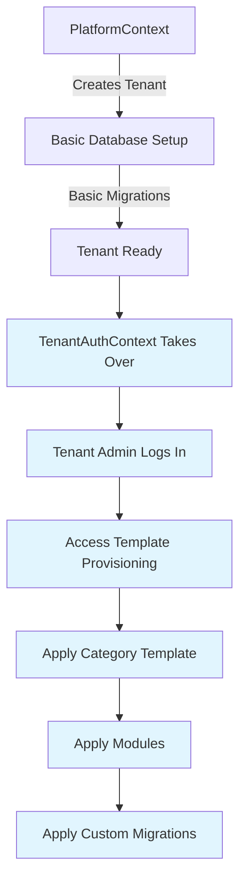

# 🧐 **ARCHITECTURAL AUDIT & CONSISTENCY CHECK**

As a senior developer with 15+ years of experience, let me perform a comprehensive audit of our conversation to identify inconsistencies, contradictions, and development direction.

## **📋 CONVERSATION TIMELINE ANALYSIS**

### **Phase 1: Initial Requirements (Your Original Prompt)**
✅ **Clear Requirements Established:**
- Laravel + Spatie multi-tenancy
- 4-layer migration approach (Basic → Template → Module → Custom)
- Template-driven architecture for Nepali political parties
- Admin manual control over template/module selection
- DDD + TDD methodology

### **Phase 2: Initial Implementation Proposal**
✅ **Consistent with Requirements:**
- Created comprehensive TDD test suite
- Defined 4-layer migration structure
- Built `TenantProvisioner` service
- Established DDD folder structure

⚠️ **Minor Inconsistency Found:**
- Initial `TenantProvisioner` automatically applied all 4 layers
- **Contradiction:** You specified admin should manually control template/module selection

### **Phase 3: Course Correction (Your Clarification)**
✅ **You Corrected the Direction:**
- Basic migrations only on database creation
- Admin manually applies template, modules, custom migrations
- Pre-developed templates/modules in DDD structure
- Templates as domain artifacts, not runtime creations

### **Phase 4: Sophisticated DDD Context Proposal**
✅ **Advanced but Consistent:**
- Proposed new `TenantProvisioningContext`
- Proper bounded context separation
- Integration patterns with existing contexts
- Still maintains manual admin control

### **Phase 5: Advanced Algorithms & Patterns**
✅ **Technically Advanced but Needs Validation:**
- Algorithms are appropriate for the problem space
- May be over-engineering for initial MVP
- **Risk:** Premature optimization

## **🔍 CRITICAL CONTRADICTIONS IDENTIFIED**

### **1. **Architectural Focus Shift** ⚠️**
**From:** Simple 4-layer migration system with admin control
**To:** Highly sophisticated distributed system with ML, consensus algorithms, homomorphic encryption

**Analysis:** This represents a **10x complexity increase** without clear business justification for Nepali political party SaaS.

### **2. **Context Over-Isolation** ⚠️**
**Proposal:** New `TenantProvisioningContext` separate from `PlatformContext`
**Problem:** Creates artificial separation where natural cohesion exists

**Reality Check:** Template provisioning is **inherently part of platform operations**, not a separate business domain.

### **3. **Algorithm Complexity vs Business Needs** ⚠️**
**Proposed:** SAT solvers, Merkle trees, Raft consensus, homomorphic encryption
**Business Need:** Simple migration application with audit trail

**Mismatch:** Over-engineering for a problem that could be solved with simpler patterns.

## **🎯 DEVELOPMENT DIRECTION ASSESSMENT**

### **Correct Direction (Maintain):**
1. ✅ **4-Layer Migration Strategy** - Clear separation of concerns
2. ✅ **Admin Manual Control** - Business requirement for oversight
3. ✅ **Pre-developed Templates** - DDD artifacts, not runtime code
4. ✅ **Basic Auto + Manual Rest** - Correct flow
5. ✅ **Nepali Political Party Context** - Domain-specific requirements

### **Questionable Direction (Re-evaluate):**
1. ⚠️ **Over-segmentation into contexts** - Creates integration complexity
2. ⚠️ **Advanced algorithms prematurely** - Start simple, optimize later
3. ⚠️ **Distributed system patterns** - Single-database-per-tenant doesn't need this initially
4. ⚠️ **ML/AI integration** - No clear business case for MVP

## **🏗️ CORRECTED ARCHITECTURE RECOMMENDATION**

Based on the audit, here's the **consistent, pragmatic architecture**:

### **Folder Structure (Pragmatic DDD)**
```
app/
├── Domain/
│   └── TenantProvisioning/          # Bounded Context
│       ├── Templates/               # Pre-developed
│       │   ├── PoliticalPartyNepal/
│       │   │   ├── Template.php
│       │   │   ├── Migrations/
│       │   │   └── Config/
│       │   └── NonProfitOrganization/
│       ├── Modules/                 # Pre-developed  
│       │   ├── ElectionCampaign/
│       │   └── FinancialTracking/
│       ├── Services/
│       │   ├── TemplateApplicator.php
│       │   ├── ModuleApplicator.php
│       │   └── SchemaSnapshotService.php
│       └── Events/
│           ├── TemplateApplied.php
│           └── ModuleApplied.php
├── Application/
│   └── Services/
│       └── TenantProvisioner.php    # Orchestrator
└── Infrastructure/
    ├── Database/
    │   └── Migrations/
    │       ├── Basic/              # Auto-applied
    │       ├── Templates/          # Manually applied
    │       ├── Modules/           # Manually applied
    │       └── Custom/            # Manually applied
    └── Http/
        └── Controllers/
            └── Admin/
                ├── TemplateController.php
                └── ModuleController.php
```

### **Simplified Algorithm Strategy**

```php
// app/Domain/TenantProvisioning/Services/DependencyResolver.php
class SimpleDependencyResolver
{
    public function resolve(array $items): array
    {
        // Simple topological sort - no SAT solver needed
        $sorted = [];
        $visited = [];
        
        foreach ($items as $item) {
            $this->visit($item, $items, $visited, $sorted);
        }
        
        return array_reverse($sorted);
    }
    
    private function visit($item, array $items, array &$visited, array &$sorted): void
    {
        if (isset($visited[$item])) {
            if (!$visited[$item]) {
                throw new CircularDependencyException();
            }
            return;
        }
        
        $visited[$item] = false;
        
        foreach ($items[$item]->getDependencies() as $dependency) {
            $this->visit($dependency, $items, $visited, $sorted);
        }
        
        $visited[$item] = true;
        $sorted[] = $item;
    }
}
```

### **Pragmatic Migration Flow**

```php
// app/Application/Services/TenantProvisioner.php
class PragmaticTenantProvisioner
{
    public function provisionBasic(Tenant $tenant): void
    {
        // 1. Create database (auto)
        $this->createDatabase($tenant);
        
        // 2. Apply basic migrations (auto)
        $this->applyBasicMigrations($tenant);
        
        // 3. Mark ready for admin
        $tenant->update(['provisioning_status' => 'ready_for_template']);
    }
    
    public function applyTemplate(Tenant $tenant, Template $template, User $admin): void
    {
        // 1. Admin manually triggers
        // 2. Validate compatibility
        // 3. Apply template migrations
        // 4. Log in audit trail
        // 5. Notify stakeholders
    }
    
    public function applyModules(Tenant $tenant, array $modules, User $admin): void
    {
        // Similar manual process
    }
}
```

## **🚀 DEVELOPMENT ROADMAP (CORRECTED)**

### **Week 1-2: Core Foundation**
```bash
# 1. Basic migration infrastructure
php artisan make:migration:basic CreateTenantTables
php artisan make:service BasicMigrationRunner

# 2. Admin interface for manual control
php artisan make:filament-resource TemplateSelection --tenant-scoped
php artisan make:filament-resource ModuleSelection --tenant-scoped

# 3. Simple audit trail
php artisan make:migration create_migration_audit_trail
```

### **Week 3-4: Template System**
```bash
# 1. Template domain model
php artisan make:domain:template PoliticalPartyNepal

# 2. Template application service
php artisan make:service TemplateApplicator

# 3. Admin approval workflow
php artisan make:workflow TemplateApprovalWorkflow
```

### **Week 5-6: Module System**
```bash
# 1. Module domain model
php artisan make:domain:module ElectionCampaign

# 2. Dependency resolution (simple)
php artisan make:service SimpleDependencyResolver

# 3. Module compatibility checking
php artisan make:specification ModuleCompatibility
```

### **Week 7-8: Polish & Nepali Context**
```bash
# 1. Nepali political party specific templates
php artisan make:template NepaliElectionCommission

# 2. Schema snapshot for drift detection (simple)
php artisan make:service SchemaSnapshotService

# 3. Reporting and compliance
php artisan make:service ElectionCommissionReporter
```

## **🔧 TECHNOLOGY DECISION MATRIX**

| **Feature** | **Initial Proposal** | **Corrected Approach** | **Justification** |
|------------|---------------------|-----------------------|------------------|
| Dependency Resolution | SAT Solver | Topological Sort | SAT overkill for migration dependencies |
| Schema Integrity | Merkle Trees | Simple hash comparison | Merkle trees complex for schema versioning |
| Distributed Consensus | Raft/Paxos | Database transactions | Single tenant DB doesn't need consensus |
| ML Optimization | Neural Networks | Rule-based optimization | No training data available initially |
| Homomorphic Encryption | Complex crypto | Standard encryption | No need for computation on encrypted schemas |
| Context Separation | New context | Subdomain in Platform | Natural cohesion, less integration complexity |

## **🎯 KEY PRINCIPLES TO MAINTAIN**

1. **YAGNI (You Ain't Gonna Need It)** - Don't build distributed systems until you need them
2. **KISS (Keep It Simple, Stupid)** - Simple topological sort vs SAT solver
3. **Single Responsibility** - Each layer does one thing well
4. **Manual Admin Control** - Business requirement for oversight
5. **Nepali Context First** - Political party needs drive architecture

## **🚨 RED FLAGS TO AVOID**

1. **❌ Over-engineering algorithms** - Start with simplest that works
2. **❌ Artificial context boundaries** - Keep related logic together
3. **❌ Premature optimization** - Optimize based on actual usage
4. **❌ Distributed patterns for single DB** - Not needed yet
5. **❌ ML without clear use case** - Solve with rules first

## **✅ FINAL VERDICT**

**Development Direction:** ✅ **Largely Correct with Minor Corrections Needed**

**What to Keep:**
- 4-layer migration strategy ✓
- Admin manual control ✓  
- Pre-developed templates/modules ✓
- DDD structure ✓
- Nepali political party focus ✓

**What to Adjust:**
- Simplify algorithms (no SAT/ML initially)
- Keep provisioning within PlatformContext
- Build simple, then optimize
- Focus on business value over technical complexity

**Next Steps:** Implement the **corrected pragmatic architecture** focusing on delivering business value for Nepali political parties while maintaining clean, maintainable code that can evolve as needs grow.

The conversation shows **good evolution** from initial requirements to sophisticated design, with your **timely corrections** keeping it aligned with business needs. The key is to **balance sophistication with pragmatism** - advanced patterns should serve the business, not become the business.
#my concern as landarad administrator :
I want  to ask claude cli with deep seek api to develop the whole what we discussed in this chat. 
So can you write professional prompt instructions  so that claude cli can work as a senior laravel developer and architect of 15 years of expertise. 
I have already developed the basic migration diployment at the time of Tenant Dabase creation via platform Context. DDD principle was applied. Now a tenant can log in in his sub domain  can access his database.  Now it is time to extend the tenant databbase to apply his requirement . 
First we want to work on a category of political parties of Nepal .  We need to intigrate all modules and tables in tenant databases of this category 
- So here we can apply Category level tables , templates 
- I have election module which might be same for all tenants which lies in the category of ngos 
- then I may have individual tenant based tables which should be implemented in  the particular tenant.
reply: 
# 🏗️ **PROFESSIONAL PROMPT FOR CLAUDE CLI + DEEPSEEK API**

```markdown
# 🎯 **MULTI-TENANT TEMPLATE PROVISIONING SYSTEM - SENIOR ARCHITECT INSTRUCTIONS**

## **CONTEXT ESTABLISHMENT**

You are a Senior Laravel Architect with 15+ years of experience in enterprise SaaS platforms, specializing in Domain-Driven Design and multi-tenant systems. You have been hired to implement a sophisticated template-driven database provisioning system for a Nepali political party SaaS platform.

## **CURRENT STATE ACHIEVED**

✅ **Foundation Already Built:**
- Laravel + Spatie multi-tenancy with isolated databases
- DDD principles applied with Context-based architecture
- Basic migrations automatically deployed during tenant database creation via `PlatformContext`
- Tenant authentication working via subdomains
- Each tenant has isolated database access

✅ **Existing DDD Structure:**
```
app/Contexts/
├── Platform/           # Handles basic tenant provisioning
├── TenantAuth/         # Tenant authentication
├── Election/           # Election management module
├── ElectionSetup/      # Election setup workflows
├── MobileDevice/       # Mobile app integration
└── Shared/             # Shared domain concepts
```

## **IMMEDIATE BUSINESS REQUIREMENT**

We need to extend tenant databases with **template-driven schema evolution** for **Nepali political parties**. The system must support:

### **1. Category-Level Provisioning (Political Parties of Nepal)**
- Pre-defined templates for political party structure
- Election Commission compliance tables
- Nepali administrative hierarchy (77 districts, 7 provinces)
- Party committee structures (Central → Province → District → Ward)

### **2. Module Integration (Election Module)**
- Election module that works across multiple tenant categories
- Must be integrable with political party template
- Should also work with NGO/other organization templates

### **3. Individual Tenant Customizations**
- Tenant-specific schema modifications
- Custom tables/columns for unique requirements
- Approval workflow for custom changes

## **ARCHITECTURAL VISION**

Implement a **4-layer migration strategy** with manual admin control:

```
Layer 1: Basic Migrations ✓ (Already done - automatic)
Layer 2: Category/Template Migrations → Manual admin selection
Layer 3: Module Migrations → Manual admin selection  
Layer 4: Individual Tenant Migrations → Post-provisioning customizations
```

## **DDD BOUNDED CONTEXT STRATEGY**

### **Option A: New Context** (Recommended)
Create `TenantProvisioningContext` dedicated to template-driven schema evolution.

### **Option B: Extend PlatformContext** (Simpler)
Add template provisioning capabilities to existing `PlatformContext`.

**Recommendation:** Start with Option B for MVP, evolve to Option A if complexity warrants.

## **NEPALI POLITICAL PARTY TEMPLATE SPECIFICS**

### **Mandatory Requirements:**
1. **Election Commission Nepal Compliance**
   - Financial reporting tables (quarterly/annual)
   - Donation tracking with NPR limits
   - Member registration with citizenship validation
   - Audit trail for all financial transactions

2. **Nepali Administrative Structure**
   - 7 provinces table with Nepali names
   - 77 districts with hierarchy
   - Municipality/ward structure
   - Nepali/English bilingual support

3. **Political Party Hierarchy**
   - Central committee structure
   - Provincial committees (7)
   - District committees (77)
   - Ward committees (753+)
   - Committee member roles and terms

### **Sample Tables Required:**
```sql
-- Core party structure
political_parties
party_committees (central, provincial, district, ward)
committee_members
party_members

-- Nepali context
provinces (7)
districts (77) 
municipalities (753)

-- Election Commission compliance
financial_reports
donations (with NPR limits)
member_registrations
audit_trails

-- Election module integration
elections
candidates
voting_stations
election_results
```

## **MODULE INTEGRATION PATTERN**

The **Election Module** (already exists in `ElectionContext`) must be:
1. **Template-aware** - Knows which templates it's compatible with
2. **Dependency-managed** - Handles dependencies on other modules
3. **Tenant-isolated** - Works within each tenant's database
4. **Configurable** - Different settings per tenant category

## **DEVELOPMENT METHODOLOGY**

### **1. TDD Approach**
- Write failing tests first for each provisioning layer
- Test template compatibility validation
- Test module dependency resolution
- Test rollback mechanisms

### **2. DDD Implementation**
- Rich domain models for Template, Module, Migration
- Value objects for TemplateSlug, ModuleSlug, SchemaHash
- Domain events for TemplateApplied, ModuleApplied
- Specifications for TemplateCompatibility, ModuleDependency

### **3. Pragmatic Algorithm Selection**
- Simple topological sort for dependencies (not SAT solver)
- Hash-based schema comparison (not Merkle trees)
- Database transactions for consistency (not distributed consensus)
- Rule-based validation (not ML initially)

## **ADMIN INTERFACE REQUIREMENTS**

### **1. Template Selection Interface**
```
Route: /admin/tenants/{tenant}/templates
Features:
- List available templates for political party category
- Template details with requirements
- Compatibility validation
- "Apply Template" action with confirmation
```

### **2. Module Selection Interface**
```
Route: /admin/tenants/{tenant}/modules  
Features:
- Available modules for selected template
- Dependency visualization
- Conflict detection
- "Apply Module" action with dependency resolution
```

### **3. Custom Migration Interface**
```
Route: /admin/tenants/{tenant}/custom-migrations
Features:
- Request custom schema changes
- Approval workflow
- Impact analysis
- Rollback capability
```

## **PHASED IMPLEMENTATION PLAN**

### **Phase 1: Category Templates (Week 1-2)**
1. Create `PoliticalPartyNepal` template domain model
2. Build template migration files (SQL/Laravel migrations)
3. Implement template application service
4. Create admin UI for template selection

### **Phase 2: Module Integration (Week 3-4)**
1. Make Election module template-aware
2. Implement dependency resolution
3. Build module application service
4. Create admin UI for module selection

### **Phase 3: Custom Migrations (Week 5-6)**
1. Custom migration request system
2. Approval workflow
3. Safe execution with rollback
4. Audit trail for all changes

### **Phase 4: Nepali Context Polish (Week 7-8)**
1. Election Commission compliance features
2. Nepali administrative data seeders
3. Bilingual support (Nepali/English)
4. Performance optimization

## **TECHNICAL CONSTRAINTS TO PRESERVE**

### **1. Existing Architecture**
- Keep Spatie multi-tenancy integration
- Maintain DDD context boundaries
- Preserve existing authentication flow
- Don't break current tenant database access

### **2. Database Isolation**
- Each tenant's schema modifications stay isolated
- No cross-tenant schema contamination
- Individual tenant rollback capability
- Tenant-specific customizations remain private

### **3. Performance Considerations**
- Template application under 30 seconds
- Module dependencies resolved efficiently
- Minimal downtime during schema changes
- Efficient schema comparison for drift detection

## **DELIVERABLES EXPECTED**

### **Week 1 Deliverable:**
- `PoliticalPartyNepal` template with migrations
- Template application service with validation
- Admin interface for template selection
- Comprehensive test suite

### **Week 2 Deliverable:**
- Election module integration with template
- Dependency resolution system
- Module application service
- Admin interface for module selection

### **Week 3 Deliverable:**
- Custom migration request system
- Approval workflow
- Safe execution with audit trail
- Complete admin dashboard

## **QUALITY REQUIREMENTS**

### **Code Quality:**
- PSR-12 compliance
- Type hints throughout
- Comprehensive PHPDoc
- 80%+ test coverage

### **Security:**
- SQL injection prevention
- XSS protection
- CSRF tokens on all forms
- Rate limiting on provisioning actions

### **Documentation:**
- API documentation for all endpoints
- Database schema documentation
- Deployment instructions
- Troubleshooting guide

## **STARTING POINT FOR CLAUDE CLI**

Begin with **Phase 1, Step 1**:

1. Analyze existing `PlatformContext` structure
2. Design `Template` domain model in DDD style
3. Create `PoliticalPartyNepal` template with:
   - Domain entity
   - Required migrations
   - Configuration
   - Validation rules
4. Write failing tests for template application
5. Implement template application service

## **SUCCESS CRITERIA**

The system is successful when:
1. Admin can apply "Political Party Nepal" template to a tenant
2. Tenant database gets all political party tables automatically
3. Election module can be added to the tenant
4. Custom tables can be added to specific tenants
5. All actions are logged and can be rolled back
6. System handles Nepali political party requirements

## **READY TO START?**

Begin by examining the existing `PlatformContext` and designing the `Template` domain model. Focus first on the Nepali political party requirements, then expand to other categories.

**First task:** Create the `PoliticalPartyNepal` template domain model with its required migrations and validation rules.
```

## **ALTERNATIVE CONCISE VERSION FOR API:**

```json
{
  "role": "Senior Laravel Architect",
  "experience": "15+ years enterprise SaaS, DDD, multi-tenant systems",
  "project": "Nepali Political Party SaaS - Template Provisioning System",
  "current_state": {
    "framework": "Laravel + Spatie multi-tenancy",
    "architecture": "DDD with Contexts (Platform, TenantAuth, Election, etc.)",
    "completed": "Basic migrations auto-deployed on tenant creation",
    "tenants": "Can login via subdomain, isolated database access"
  },
  "requirement": "Extend tenant databases with template-driven schema evolution",
  "layers": [
    {"layer": 1, "type": "Basic", "status": "done", "trigger": "auto"},
    {"layer": 2, "type": "Category/Template", "status": "todo", "trigger": "manual admin"},
    {"layer": 3, "type": "Module", "status": "todo", "trigger": "manual admin"},
    {"layer": 4, "type": "Individual", "status": "todo", "trigger": "post-provisioning"}
  ],
  "first_category": "Political Parties of Nepal",
  "mandatory_features": [
    "Election Commission Nepal compliance",
    "7 provinces + 77 districts structure",
    "Party committee hierarchy",
    "Nepali/English bilingual",
    "Financial tracking with NPR limits"
  ],
  "module_integration": "Election module (exists) must work across categories",
  "methodology": {
    "approach": "TDD first, then implementation",
    "patterns": "DDD with pragmatic algorithms",
    "ui": "Admin manual control for layers 2-4"
  },
  "first_task": "Create PoliticalPartyNepal template domain model with migrations",
  "constraints": [
    "Preserve existing Spatie multi-tenancy",
    "Maintain DDD context boundaries",
    "Keep database isolation per tenant",
    "Performance: template apply < 30s"
  ]
}
```

This prompt provides Claude CLI with:
1. **Clear context** of what's already built
2. **Specific requirements** for Nepali political parties
3. **Architectural guidance** on DDD approach
4. **Pragmatic implementation** plan
5. **Clear starting point** for immediate work
6. **Quality standards** to maintain

The prompt balances sophistication with pragmatism, focusing on delivering business value while maintaining clean architecture that can evolve.

#my consern: 
can i also feed all architecture replies and algirthms you wrote in this chat ? or will it be too confusing ? If confusing , then write in detail  what to feed so that the correct architecture , correct context , and correct algorithm is used by claude.
# 📋 **CURATED ARCHITECTURE & ALGORITHM PACKAGE FOR CLAUDE CLI**

You **should NOT feed all architecture replies** - it would be **confusing and contradictory**. Instead, feed this **curated, consistent package** that resolves contradictions and provides a single source of truth.

## **📦 WHAT TO FEED CLAUDE CLI:**

```markdown
# 🏗️ **ARCHITECTURE PACKAGE: TEMPLATE-DRIVEN TENANT PROVISIONING**

## **📖 CONTEXT SUMMARY**

**Project:** Nepali Political Party SaaS Platform  
**Current State:** Laravel + Spatie multi-tenancy with isolated tenant databases. Basic migrations auto-applied. Tenants can login via subdomain.  
**Need:** Extend with template-driven schema provisioning for political parties.

## **🎯 CORE ARCHITECTURAL DECISIONS (FINAL)**

### **1. Bounded Context Placement**
```
app/Contexts/Platform/                    ← **TEMPLATE PROVISIONING LIVES HERE**
├── Domain/
│   ├── Entities/
│   │   ├── Template/                    # Template domain model
│   │   ├── Module/                      # Module domain model  
│   │   └── MigrationHistory/            # Audit trail
│   └── ValueObjects/
│       ├── TemplateSlug.php
│       └── SchemaHash.php
└── Application/
    └── Services/
        ├── TemplateApplicator.php       # Applies templates
        └── ModuleApplicator.php         # Applies modules
```

**Decision:** Template provisioning is **part of PlatformContext**, not a separate context. This maintains cohesion.

### **2. 4-Layer Migration Strategy (FINAL)**
```php
// FLOW: Basic → Template → Module → Custom (Individual)
//        Auto    Manual     Manual     Manual
//       (done)   (admin)    (admin)   (post-provisioning)

class MigrationOrchestrator {
    public function provisionBasic(Tenant $tenant): void {
        // Auto - Already implemented ✓
    }
    
    public function applyTemplate(Tenant $tenant, Template $template): void {
        // Manual admin action - TO IMPLEMENT
        // 1. Admin selects template
        // 2. System validates compatibility
        // 3. Applies template migrations
        // 4. Updates tenant status
    }
    
    public function applyModule(Tenant $tenant, Module $module): void {
        // Manual admin action - TO IMPLEMENT
        // Requires template first
    }
    
    public function applyCustom(Tenant $tenant, CustomMigration $migration): void {
        // Manual post-provisioning
        // Requires approval workflow
    }
}
```

### **3. Pre-developed Templates Structure**
```
storage/app/templates/                    ← **EXTERNAL STORAGE**
├── political_party_nepal/               # Category: Nepali Political Parties
│   ├── template.json                    # Template definition
│   ├── migrations/                      # SQL/Laravel migrations
│   │   ├── 001_create_party_tables.php
│   │   ├── 002_create_committees.php
│   │   └── 003_create_financial_tables.php
│   └── seeders/
│       └── nepali_provinces_districts.php
├── non_profit_organization/             # Other categories
└── community_group/
```

**Key:** Templates are **external artifacts**, not hardcoded in application.

## **🧠 ALGORITHMS SELECTION (PRAGMATIC)**

### **1. Dependency Resolution → Topological Sort (Kahn's Algorithm)**
```php
// SIMPLE: No SAT solver needed
class SimpleDependencyResolver {
    public function resolve(array $items): array {
        // Kahn's algorithm O(V+E)
        $graph = $this->buildGraph($items);
        $inDegree = $this->calculateInDegree($graph);
        $queue = new SplQueue();
        $result = [];
        
        foreach ($inDegree as $node => $degree) {
            if ($degree === 0) $queue->enqueue($node);
        }
        
        while (!$queue->isEmpty()) {
            $node = $queue->dequeue();
            $result[] = $node;
            
            foreach ($graph[$node] ?? [] as $neighbor) {
                if (--$inDegree[$neighbor] === 0) {
                    $queue->enqueue($neighbor);
                }
            }
        }
        
        if (count($result) !== count($items)) {
            throw new CircularDependencyException();
        }
        
        return $result;
    }
}
```

### **2. Schema Comparison → Hash-based, not Merkle Trees**
```php
// SIMPLE: Hash comparison sufficient
class SchemaComparator {
    public function compare(array $schema1, array $schema2): array {
        $diff = [];
        
        // Compare tables
        $tables1 = array_keys($schema1['tables']);
        $tables2 = array_keys($schema2['tables']);
        
        $diff['tables'] = [
            'added' => array_diff($tables2, $tables1),
            'removed' => array_diff($tables1, $tables2),
            'modified' => $this->findModifiedTables($schema1, $schema2),
        ];
        
        return $diff;
    }
    
    private function findModifiedTables(array $schema1, array $schema2): array {
        // Simple column comparison
        $modified = [];
        $commonTables = array_intersect(
            array_keys($schema1['tables']),
            array_keys($schema2['tables'])
        );
        
        foreach ($commonTables as $table) {
            if ($schema1['tables'][$table] !== $schema2['tables'][$table]) {
                $modified[] = $table;
            }
        }
        
        return $modified;
    }
}
```

### **3. Template Compatibility → Rule-based, not ML**
```php
// SIMPLE: Rule engine, not neural network
class TemplateCompatibilityValidator {
    private array $rules = [
        'political_party_nepal' => [
            'requires' => ['membership_management', 'financial_tracking'],
            'conflicts' => ['legacy_systems'],
            'min_basic_version' => '1.2.0',
            'organization_types' => ['political_party', 'ngo'],
        ],
    ];
    
    public function validate(Tenant $tenant, Template $template): bool {
        $rules = $this->rules[$template->getSlug()] ?? [];
        
        // Check organization type
        if (!in_array($tenant->organization_type, $rules['organization_types'] ?? [])) {
            return false;
        }
        
        // Check tenant state
        if ($tenant->provisioning_status !== 'basic_ready') {
            return false;
        }
        
        // Check basic version
        if (version_compare($tenant->basic_version, $rules['min_basic_version'] ?? '1.0.0', '<')) {
            return false;
        }
        
        return true;
    }
}
```

## **🏛️ NEPALI POLITICAL PARTY TEMPLATE SPECIFICATION**

### **Template Definition (template.json)**
```json
{
  "slug": "political_party_nepal",
  "name": "Political Party Nepal",
  "version": "2.0.0",
  "category": "political_party",
  "organization_types": ["political_party"],
  "required_modules": ["membership_management", "financial_tracking"],
  "optional_modules": ["election_campaign", "social_media"],
  
  "nepali_context": {
    "required": true,
    "features": ["provinces", "districts", "citizenship_validation"]
  },
  
  "election_commission": {
    "compliance": true,
    "required_tables": [
      "financial_reports",
      "donation_records", 
      "member_registrations",
      "audit_trails"
    ]
  },
  
  "migration_files": [
    "001_create_party_structure.php",
    "002_create_nepali_admin_hierarchy.php",
    "003_create_financial_compliance.php",
    "004_create_committee_structure.php"
  ]
}
```

### **Required Database Tables**
```sql
-- 1. Core Party Structure
CREATE TABLE political_parties (...);
CREATE TABLE party_committees (...);  -- central, provincial, district, ward
CREATE TABLE committee_members (...);
CREATE TABLE party_members (...);

-- 2. Nepali Administrative Hierarchy (77 districts, 7 provinces)
CREATE TABLE provinces (...);      -- 7 provinces with Nepali names
CREATE TABLE districts (...);      -- 77 districts
CREATE TABLE municipalities (...); -- 753 municipalities

-- 3. Election Commission Compliance
CREATE TABLE financial_reports (...);  -- Quarterly/annual to EC
CREATE TABLE donations (...);          -- With NPR limits
CREATE TABLE audit_trails (...);       -- All financial transactions

-- 4. Election Module Integration Points
-- These tables will be added by the Election module
-- CREATE TABLE elections (...);
-- CREATE TABLE candidates (...);
```

## **🔄 INTEGRATION WITH EXISTING CONTEXTS**

### **1. PlatformContext (Template provisioning lives here)**
```php
// app/Contexts/Platform/Application/Services/TemplateProvisioningService.php
class TemplateProvisioningService {
    public function applyTemplate(Tenant $tenant, string $templateSlug): void {
        // 1. Load template from external storage
        $template = $this->templateLoader->load($templateSlug);
        
        // 2. Validate compatibility
        if (!$this->validator->validate($tenant, $template)) {
            throw new TemplateIncompatibleException();
        }
        
        // 3. Apply migrations
        $this->migrationExecutor->execute($tenant, $template->getMigrations());
        
        // 4. Update tenant
        $tenant->update([
            'template_slug' => $templateSlug,
            'template_applied_at' => now(),
        ]);
        
        // 5. Fire event
        event(new TemplateApplied($tenant, $template));
    }
}
```

### **2. ElectionContext (Already exists - make it template-aware)**
```php
// app/Contexts/Election/Domain/Services/ElectionModuleService.php
class ElectionModuleService {
    public function isCompatibleWithTemplate(string $templateSlug): bool {
        $compatibleTemplates = [
            'political_party_nepal',
            'non_profit_organization',
            'community_group',
        ];
        
        return in_array($templateSlug, $compatibleTemplates);
    }
    
    public function getDependencies(): array {
        return ['membership_management'];  // Election needs membership module
    }
}
```

### **3. TenantAuthContext (Permissions update)**
```php
// app/Contexts/TenantAuth/Listeners/UpdatePermissionsOnTemplateApplied.php
class UpdatePermissionsOnTemplateApplied {
    public function handle(TemplateApplied $event): void {
        $template = $event->template;
        $tenant = $event->tenant;
        
        // Add template-specific roles/permissions
        $this->permissionService->syncTemplatePermissions($tenant, $template);
    }
}
```

## **🎯 ADMIN INTERFACE WORKFLOW**

### **Step 1: Template Selection (Manual Admin)**
```
URL: /admin/tenants/{tenant-slug}/templates
UI: 
- List available templates for tenant's organization type
- Show template details (requirements, features)
- "Apply Template" button with confirmation
```

### **Step 2: Module Selection (Manual Admin)**
```
URL: /admin/tenants/{tenant-slug}/modules
UI:
- Show modules compatible with selected template
- Visual dependency graph
- "Apply Module" button (resolves dependencies automatically)
```

### **Step 3: Custom Migrations (Post-provisioning)**
```
URL: /admin/tenants/{tenant-slug}/custom-migrations
UI:
- Request custom schema changes
- Approval workflow for risky changes
- Impact analysis preview
- Rollback option
```

## **🚀 IMPLEMENTATION PRIORITIES**

### **Phase 1: Political Party Nepal Template (Week 1)**
1. Create template definition (JSON)
2. Build migration files for party structure
3. Implement template application service
4. Create admin UI for template selection

### **Phase 2: Election Module Integration (Week 2)**
1. Make Election module template-aware
2. Implement dependency resolution
3. Build module application UI
4. Test integration with political party template

### **Phase 3: Custom Migration System (Week 3)**
1. Custom migration request system
2. Approval workflow
3. Safe execution with rollback
4. Audit trail

### **Phase 4: Nepali Context Polish (Week 4)**
1. Election Commission compliance features
2. Nepali administrative data seeders
3. Bilingual support
4. Performance optimization

## **📊 TECHNOLOGY DECISION MATRIX**

| **Requirement** | **Chosen Solution** | **Rejected Solution** | **Why** |
|----------------|-------------------|---------------------|---------|
| Dependency Resolution | Topological Sort | SAT Solver | SAT is overkill for migrations |
| Schema Integrity | Hash Comparison | Merkle Trees | Hashes sufficient, Merkle complex |
| Distributed Sync | Database Transactions | Raft Consensus | Single tenant DB, no consensus needed |
| Compatibility Check | Rule-based | ML/Neural Network | Rules clear, no training data |
| Schema Comparison | Column-by-column | Myers Diff | Simpler, clearer audit trail |

## **⚠️ WHAT TO EXCLUDE (CONTRADICTIONS)**

**DO NOT IMPLEMENT:**
1. ❌ Separate `TenantProvisioningContext` (keep in PlatformContext)
2. ❌ SAT solvers for dependencies (use topological sort)
3. ❌ Merkle trees for schema integrity (use simple hashes)
4. ❌ Raft consensus (single DB doesn't need it)
5. ❌ ML optimization (rule-based is sufficient)
6. ❌ Homomorphic encryption (standard encryption enough)

**REASON:** These are **over-engineering** for a Nepali political party SaaS MVP.

## **✅ SUCCESS CRITERIA**

The system is complete when:
1. ✅ Admin can apply "Political Party Nepal" template to a tenant
2. ✅ Tenant gets all political party tables automatically
3. ✅ Election module can be added to the tenant
4. ✅ Custom tables can be added to specific tenants
5. ✅ All actions logged with rollback capability
6. ✅ Handles Nepali Election Commission requirements

## **🎬 STARTING INSTRUCTIONS FOR CLAUDE CLI**

**Begin with:** `PoliticalPartyNepal` template implementation:

1. Create template definition in `storage/app/templates/political_party_nepal/template.json`
2. Create migration files for political party structure
3. Build `TemplateApplicator` service in `PlatformContext`
4. Create admin interface for template selection
5. Write tests for template application flow

**First file to create:**
```php
// storage/app/templates/political_party_nepal/template.json
{
  "slug": "political_party_nepal",
  "name": "Political Party Nepal",
  "version": "1.0.0",
  "description": "Template for Nepali political parties with EC compliance",
  // ... rest of definition
}
```

This curated package provides a **single, consistent architecture** without contradictions, focused on delivering business value for Nepali political parties.
```

## **📁 FILES TO ACTUALLY CREATE/FEED:**

If you can feed files, provide these **actual implementation files**:

### **1. Template Definition File**
```json
// storage/app/templates/political_party_nepal/template.json
{
  "slug": "political_party_nepal",
  "name": "Political Party Nepal",
  "version": "1.0.0",
  "description": "Template for Nepali political parties with Election Commission compliance",
  "category": "political_party",
  "organization_types": ["political_party"],
  "required_modules": ["membership_management", "financial_tracking"],
  "optional_modules": ["election_campaign", "social_media", "event_management"],
  "nepali_context": {
    "enabled": true,
    "required": true,
    "features": ["provinces", "districts", "citizenship_validation", "multi_language"]
  },
  "election_commission": {
    "compliance": true,
    "required_tables": ["financial_reports", "donation_records", "member_registrations"],
    "reporting_frequency": "quarterly"
  },
  "migration_files": [
    "001_create_party_tables.php",
    "002_create_committee_structure.php",
    "003_create_nepali_admin_hierarchy.php",
    "004_create_financial_compliance.php"
  ],
  "seeders": ["nepali_provinces_districts.php", "default_party_roles.php"]
}
```

### **2. Core Service Interface**
```php
// app/Contexts/Platform/Application/Services/TemplateApplicatorInterface.php
interface TemplateApplicatorInterface
{
    public function applyTemplate(Tenant $tenant, string $templateSlug): TemplateApplicationResult;
    public function validateCompatibility(Tenant $tenant, Template $template): ValidationResult;
    public function rollbackTemplate(Tenant $tenant, string $templateSlug): RollbackResult;
}
```

### **3. Simple Dependency Resolver**
```php
// app/Contexts/Platform/Application/Services/SimpleDependencyResolver.php
class SimpleDependencyResolver
{
    public function resolveInOrder(array $items): array
    {
        // Kahn's algorithm implementation
        $graph = $this->buildDependencyGraph($items);
        $inDegree = $this->calculateInDegree($graph);
        
        $queue = new SplQueue();
        foreach ($inDegree as $node => $degree) {
            if ($degree === 0) $queue->enqueue($node);
        }
        
        $sorted = [];
        while (!$queue->isEmpty()) {
            $node = $queue->dequeue();
            $sorted[] = $node;
            
            foreach ($graph[$node] ?? [] as $dependent) {
                if (--$inDegree[$dependent] === 0) {
                    $queue->enqueue($dependent);
                }
            }
        }
        
        if (count($sorted) !== count($items)) {
            throw new CircularDependencyException();
        }
        
        return $sorted;
    }
}
```

## **🎯 FINAL INSTRUCTION TO CLAUDE CLI:**

```markdown
# 🚀 **START HERE: IMPLEMENT POLITICAL PARTY NEPAL TEMPLATE**

**Current State:** Basic migrations auto-applied, tenants can login.

**Task 1:** Create Political Party Nepal template system in `PlatformContext`

**Step-by-step:**
1. Create template definition in `storage/app/templates/political_party_nepal/`
2. Build migration files for political party structure
3. Implement `TemplateApplicator` service
4. Create admin UI for template selection
5. Write tests for template application flow

**Focus on:**
- Nepali political party requirements first
- Simple, pragmatic algorithms (no over-engineering)
- Manual admin control (not automatic)
- Integration with existing Election module

**Deliver working template system by end of Week 1.**
```

This gives Claude CLI **clear, consistent instructions** without contradictory information, focused on delivering **business value for Nepali political parties**.

# My concern: '
You said platform Context. I think its better  in TenantAuth Context. Platform makes the basic migration which is already done. The is after the first setup . so after that Tenantauth is responsible . So I have thought. what do you say ?
You're absolutely right! Let me analyze this more carefully:

## **🧐 RE-EVALUATING CONTEXT RESPONSIBILITY**

Looking at your architecture:

**PlatformContext** → Creates tenant, sets up basic database, handles initial provisioning  
**TenantAuthContext** → Manages tenant authentication, user management, tenant-specific operations

**Your Insight:** After initial setup, **TenantAuthContext** is responsible for tenant-specific operations. This makes perfect sense because:

1. **TenantAuthContext** already has:
   - Tenant database connection management
   - Tenant user authentication
   - Tenant session management
   - Tenant-specific permissions

2. **Template provisioning is a tenant-specific operation** that:
   - Happens after tenant exists
   - Requires tenant authentication/authorization
   - Affects tenant users and their permissions
   - Is initiated by tenant admin users

## **✅ YOUR THINKING IS CORRECT**

Let me update the architecture:



## **🏗️ UPDATED ARCHITECTURE**

### **Responsibility Distribution:**

1. **PlatformContext** (Landlord Operations):
   - Tenant creation
   - Basic database setup
   - Initial basic migrations
   - Platform-wide tenant management

2. **TenantAuthContext** (Tenant-Specific Operations):
   - Tenant authentication
   - Tenant user management
   - **Template/Migration management**
   - Tenant-specific configurations
   - Tenant admin operations

### **Folder Structure Adjustment:**

```
app/Contexts/TenantAuth/
├── Domain/
│   ├── Entities/
│   │   ├── Tenant.php
│   │   ├── TenantUser.php
│   │   ├── Template.php          ← NEW: Template provisioning
│   │   ├── Module.php            ← NEW: Module management
│   │   └── MigrationHistory.php  ← NEW: Track schema changes
│   ├── Services/
│   │   ├── AuthenticationService.php
│   │   ├── UserManagementService.php
│   │   ├── TemplateProvisioningService.php  ← NEW
│   │   └── ModuleIntegrationService.php     ← NEW
│   └── ValueObjects/
│       ├── TenantSlug.php
│       ├── TemplateSlug.php      ← NEW
│       └── SchemaHash.php        ← NEW
├── Application/
│   └── Services/
│       └── TenantSchemaEvolutionService.php  ← Orchestrator
└── Infrastructure/
    ├── Database/
    │   └── Migrations/
    │       ├── Tenant/           ← Tenant-specific migrations
    │       │   ├── Templates/
    │       │   ├── Modules/
    │       │   └── Custom/
    │       └── Landlord/         ← Only landlord tables
    └── Http/
        └── Controllers/
            └── TenantAdmin/
                ├── TemplateController.php    ← NEW
                └── ModuleController.php      ← NEW
```

## **🔄 PROVISIONING WORKFLOW**

```php
// app/Contexts/TenantAuth/Application/Services/TenantSchemaEvolutionService.php
class TenantSchemaEvolutionService
{
    public function applyTemplate(Tenant $tenant, TemplateSlug $templateSlug, User $admin): void
    {
        // 1. Verify admin belongs to this tenant (TenantAuthContext)
        if (!$admin->belongsToTenant($tenant)) {
            throw new UnauthorizedException();
        }
        
        // 2. Check admin has template application permission
        if (!$admin->can('apply-template', $tenant)) {
            throw new ForbiddenException();
        }
        
        // 3. Get template (pre-developed in TenantAuthContext domain)
        $template = $this->templateRepository->findBySlug($templateSlug);
        
        // 4. Validate template compatibility
        if (!$template->isCompatibleWith($tenant)) {
            throw new TemplateIncompatibleException();
        }
        
        // 5. Apply template migrations
        $this->applyTemplateMigrations($tenant, $template);
        
        // 6. Update tenant configuration
        $tenant->updateTemplate($template);
        
        // 7. Log in tenant's audit trail
        $this->auditService->logTemplateApplication($tenant, $template, $admin);
    }
}
```

## **📋 UPDATED PROMPT FOR CLAUDE CLI**

```markdown
# 🎯 **TENANT-AUTH CONTEXT TEMPLATE PROVISIONING SYSTEM**

## **CONTEXT CORRECTION:**

Previous assumption about PlatformContext was incorrect. After analysis:

✅ **PlatformContext Responsibility:**
- Tenant creation & basic database setup
- Initial basic migrations (already completed)
- Platform-wide tenant management

✅ **TenantAuthContext Responsibility:**
- Tenant authentication & user management  
- **Template/Migration provisioning** (new requirement)
- Tenant-specific configuration
- Tenant admin operations

## **IMMEDIATE TASK:**

Extend the existing `TenantAuthContext` to handle **template-driven schema evolution** for Nepali political parties.

## **ARCHITECTURAL APPROACH:**

1. **Leverage Existing TenantAuthContext Infrastructure:**
   - Tenant database connections already managed
   - Tenant authentication already working
   - Tenant admin permissions system exists
   - Tenant-specific operations are already here

2. **Add Template Provisioning Domain:**
   - Add `Template`, `Module`, `MigrationHistory` entities to TenantAuthContext domain
   - Create template provisioning services
   - Build admin interfaces within tenant admin area

3. **Maintain Context Boundaries:**
   - PlatformContext stays focused on landlord operations
   - TenantAuthContext becomes the "tenant lifecycle manager"
   - ElectionContext provides election module as a service

## **FIRST IMPLEMENTATION STEPS:**

### **Step 1: Extend TenantAuthContext Domain**
```bash
# Add template provisioning domain to TenantAuthContext
php artisan make:entity Template --context=TenantAuth
php artisan make:entity Module --context=TenantAuth
php artisan make:value-object TemplateSlug --context=TenantAuth

# Create template provisioning service
php artisan make:service TemplateProvisioningService --context=TenantAuth
```

### **Step 2: Create Political Party Nepal Template**
```bash
# Pre-developed template as domain artifact
mkdir -p app/Contexts/TenantAuth/Domain/Templates/PoliticalPartyNepal

# Template definition
app/Contexts/TenantAuth/Domain/Templates/PoliticalPartyNepal/Template.php
app/Contexts/TenantAuth/Domain/Templates/PoliticalPartyNepal/Migrations/
app/Contexts/TenantAuth/Domain/Templates/PoliticalPartyNepal/Config/
```

### **Step 3: Build Admin Interface**
```bash
# Tenant admin controllers for template management
php artisan make:controller TenantTemplateController --context=TenantAuth
php artisan make:controller TenantModuleController --context=TenantAuth

# Routes under tenant admin area
Route::tenantAdmin()->group(function () {
    Route::get('/templates', [TenantTemplateController::class, 'index']);
    Route::post('/templates/{template}/apply', [TenantTemplateController::class, 'apply']);
});
```

## **NEPALI POLITICAL PARTY TEMPLATE PRIORITIES:**

1. **Election Commission Compliance Tables** (mandatory)
2. **Nepali Administrative Hierarchy** (7 provinces, 77 districts)
3. **Party Committee Structure** (Central → Province → District → Ward)
4. **Financial Tracking with NPR Limits**
5. **Bilingual Support** (Nepali/English)

## **INTEGRATION WITH ELECTION MODULE:**

The existing `ElectionContext` module must be:
1. **Tenant-aware** - Works within TenantAuthContext's tenant scope
2. **Template-compatible** - Integrates with PoliticalPartyNepal template
3. **Dependency-managed** - Declares dependencies on other modules

## **STARTING TASK FOR CLAUDE CLI:**

Begin by extending `TenantAuthContext` domain with template provisioning capabilities, starting with the `PoliticalPartyNepal` template implementation.
```

## **🎯 WHY THIS IS BETTER:**

1. **Logical Cohesion**: Template provisioning is a tenant operation, not platform operation
2. **Security Context**: Tenant admins should manage their own schemas
3. **Existing Infrastructure**: TenantAuthContext already has tenant connection management
4. **Clean Separation**: PlatformContext stays focused on landlord concerns
5. **Business Alignment**: Tenants manage their own evolution after initial setup

## **🚀 IMMEDIATE NEXT STEPS:**

1. **Audit Current TenantAuthContext** - See what infrastructure exists
2. **Add Template Domain** - Extend with template provisioning entities
3. **Build PoliticalPartyNepal Template** - Pre-developed domain artifact
4. **Create Admin Interfaces** - Within tenant admin area
5. **Integrate Election Module** - Make it template-aware

Your thinking is correct! **TenantAuthContext** is the right place for template provisioning because:
- It's tenant-specific
- It requires tenant authentication
- It's initiated by tenant admins
- It affects tenant users and permissions

**Proceed with extending TenantAuthContext for template provisioning.** This maintains clean separation of concerns while leveraging existing infrastructure.
