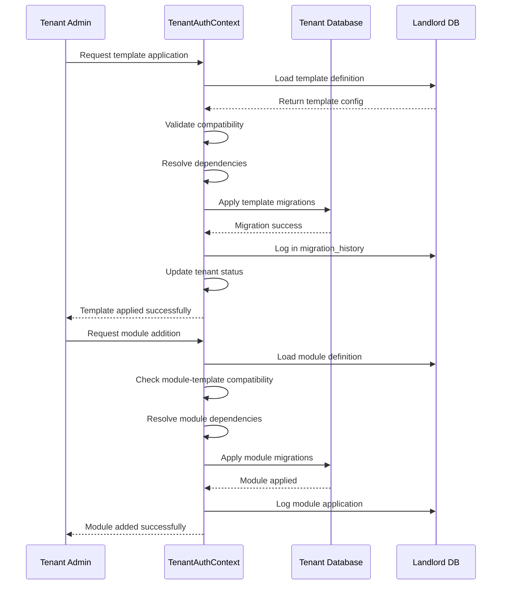

# 🏗️ **COMPREHENSIVE ARCHITECTURE REVIEW & IMPLEMENTATION PLAN**

Based on our detailed conversation, I'll synthesize everything into a **coherent, pragmatic architecture** that addresses all your concerns while maintaining clarity for Claude CLI.

## **🔍 ARCHITECTURAL REVIEW SUMMARY**

### **Key Decisions from Our Conversation:**

1. **✅ Correct Context Placement:** You're right - **TenantAuthContext** is the appropriate place for template provisioning, not PlatformContext.
2. **✅ Pragmatic Algorithms:** Simple topological sort, not SAT solvers. Hash-based comparison, not Merkle trees.
3. **✅ Business-First Focus:** Nepali political party requirements drive architecture, not technical complexity.
4. **✅ Manual Admin Control:** Core business requirement maintained.
5. **✅ 4-Layer Strategy:** Basic → Template → Module → Custom remains valid.

### **Resolved Contradictions:**
- ❌ No separate TenantProvisioningContext
- ❌ No SAT/ML algorithms initially
- ❌ No distributed consensus patterns
- ✅ Keep template provisioning in TenantAuthContext
- ✅ Use simple, pragmatic algorithms

---

## **🏛️ FINAL ARCHITECTURE DESIGN**

### **Context Responsibility Matrix:**

| **Context** | **Responsibility** | **Template Provisioning Role** |
|------------|-------------------|-------------------------------|
| **PlatformContext** | Landlord operations, tenant creation, basic setup | Creates tenant DB, applies basic migrations |
| **TenantAuthContext** | Tenant authentication, user management, tenant-specific ops | **Template/Module provisioning, schema evolution** |
| **ElectionContext** | Election management features | Provides election module as a service |
| **Shared Context** | Cross-cutting concerns | Template compatibility rules |

### **Folder Structure (Final):**

```
app/Contexts/
├── Platform/                    # Landlord operations
│   ├── Domain/
│   │   └── Entities/Tenant.php
│   └── Application/
│       └── Services/TenantCreator.php
│
├── TenantAuth/                  # **TEMPLATE PROVISIONING HOME**
│   ├── Domain/
│   │   ├── Entities/
│   │   │   ├── TenantUser.php
│   │   │   ├── Template.php          # Template domain model
│   │   │   ├── Module.php            # Module domain model
│   │   │   └── MigrationHistory.php  # Audit trail
│   │   ├── Services/
│   │   │   ├── TemplateProvisioningService.php
│   │   │   ├── ModuleIntegrationService.php
│   │   │   └── SchemaEvolutionService.php
│   │   └── ValueObjects/
│   │       ├── TemplateSlug.php
│   │       └── SchemaHash.php
│   ├── Application/
│   │   └── Services/
│   │       ├── TemplateApplicator.php
│   │       └── DependencyResolver.php
│   └── Infrastructure/
│       ├── Database/
│       │   └── Migrations/
│       │       ├── TenantTemplates/   # Template migrations
│       │       ├── TenantModules/     # Module migrations
│       │       └── TenantCustom/      # Custom migrations
│       └── Http/
│           └── Controllers/
│               └── Admin/
│                   ├── TemplateController.php
│                   └── ModuleController.php
│
├── Election/                    # Existing module
│   └── Domain/
│       └── Services/
│           └── ElectionModuleService.php
│
└── Shared/                     # Cross-context concerns
    └── Specifications/
        └── TemplateCompatibility.php
```

### **Landlord Database Schema:**

```sql
-- Core template management
CREATE TABLE tenant_templates (
    id UUID PRIMARY KEY,
    slug VARCHAR(50) UNIQUE NOT NULL,
    name VARCHAR(100) NOT NULL,
    version VARCHAR(20) NOT NULL,
    organization_type VARCHAR(50) NOT NULL, -- 'political_party', 'ngo', etc.
    description TEXT,
    config JSON NOT NULL DEFAULT '{}',
    is_active BOOLEAN DEFAULT TRUE,
    created_at TIMESTAMP,
    updated_at TIMESTAMP
);

-- Module definitions
CREATE TABLE template_modules (
    id UUID PRIMARY KEY,
    slug VARCHAR(50) UNIQUE NOT NULL,
    name VARCHAR(100) NOT NULL,
    description TEXT,
    template_slug VARCHAR(50) REFERENCES tenant_templates(slug),
    dependencies JSON DEFAULT '[]', -- ["module_slug1", "module_slug2"]
    config JSON DEFAULT '{}',
    created_at TIMESTAMP
);

-- Tenant migration history (audit trail)
CREATE TABLE tenant_migrations_history (
    id UUID PRIMARY KEY,
    tenant_id UUID NOT NULL,
    migration_type ENUM('basic', 'template', 'module', 'custom'),
    migration_slug VARCHAR(100) NOT NULL,
    migration_hash VARCHAR(64) NOT NULL, -- For drift detection
    applied_by UUID, -- User ID who applied it
    applied_at TIMESTAMP DEFAULT CURRENT_TIMESTAMP,
    status ENUM('pending', 'applied', 'failed', 'rolled_back'),
    rollback_hash VARCHAR(64) NULL,
    metadata JSON DEFAULT '{}'
);

-- Tenant customizations
CREATE TABLE tenant_customizations (
    id UUID PRIMARY KEY,
    tenant_id UUID NOT NULL,
    customization_type VARCHAR(50),
    sql_statement TEXT NOT NULL,
    description TEXT,
    applied_by UUID,
    applied_at TIMESTAMP,
    approved_by UUID NULL,
    approved_at TIMESTAMP NULL,
    status ENUM('pending', 'approved', 'applied', 'rejected')
);

-- Link tenants to templates
ALTER TABLE tenants 
ADD COLUMN template_slug VARCHAR(50) REFERENCES tenant_templates(slug),
ADD COLUMN template_version VARCHAR(20),
ADD COLUMN provisioning_status ENUM('basic', 'template_ready', 'module_ready', 'custom_ready');
```

---

## **🔄 PROVISIONING WORKFLOW**

### **Sequence Diagram:**



### **Service Implementation:**

```php
// app/Contexts/TenantAuth/Domain/Services/TemplateProvisioningService.php
class TemplateProvisioningService
{
    public function applyTemplate(Tenant $tenant, TemplateSlug $templateSlug, User $admin): TemplateApplicationResult
    {
        // 1. Authorization check (admin belongs to tenant)
        $this->authorize($admin, $tenant);
        
        // 2. Load template from landlord
        $template = $this->templateRepository->findBySlug($templateSlug);
        
        // 3. Validate compatibility
        $validationResult = $this->validator->validate($tenant, $template);
        if (!$validationResult->isValid()) {
            throw new TemplateIncompatibleException($validationResult->getErrors());
        }
        
        // 4. Start transaction
        DB::beginTransaction();
        try {
            // 5. Apply template migrations
            $migrationsApplied = $this->migrationRunner->applyTemplateMigrations($tenant, $template);
            
            // 6. Update tenant
            $tenant->update([
                'template_slug' => $templateSlug->value(),
                'template_version' => $template->getVersion(),
                'provisioning_status' => 'template_ready',
            ]);
            
            // 7. Log audit trail
            $this->auditLogger->logTemplateApplication($tenant, $template, $admin, $migrationsApplied);
            
            DB::commit();
            
            return TemplateApplicationResult::success($migrationsApplied);
            
        } catch (Exception $e) {
            DB::rollBack();
            $this->auditLogger->logFailure($tenant, $template, $admin, $e);
            throw $e;
        }
    }
}
```

---

## **🚀 IMPLEMENTATION ROADMAP (8 WEEKS)**

### **Week 1-2: Foundation & Political Party Template**
```bash
# 1. Extend TenantAuthContext domain
php artisan make:entity Template --context=TenantAuth
php artisan make:entity Module --context=TenantAuth
php artisan make:value-object TemplateSlug --context=TenantAuth

# 2. Create landlord database tables
php artisan make:migration create_tenant_templates_table --path=database/migrations/landlord
php artisan make:migration create_template_modules_table --path=database/migrations/landlord
php artisan make:migration create_tenant_migrations_history_table --path=database/migrations/landlord

# 3. Build PoliticalPartyNepal template
mkdir -p storage/templates/political_party_nepal
# Create template.json and migration files

# 4. Template application service
php artisan make:service TemplateProvisioningService --context=TenantAuth
```

### **Week 3-4: Module System & Dependency Resolution**
```bash
# 1. Module domain and services
php artisan make:service ModuleIntegrationService --context=TenantAuth
php artisan make:service SimpleDependencyResolver --context=TenantAuth

# 2. Make ElectionContext template-aware
php artisan make:listener UpdateElectionModuleOnTemplateApplied --context=Election

# 3. Admin interfaces
php artisan make:filament-resource TemplateSelection --context=TenantAuth
php artisan make:filament-resource ModuleSelection --context=TenantAuth

# 4. Test suite
php artisan make:test TemplateProvisioningTest --unit
php artisan make:test ModuleIntegrationTest --unit
```

### **Week 5-6: Custom Migrations & Audit System**
```bash
# 1. Custom migration request system
php artisan make:entity CustomMigration --context=TenantAuth
php artisan make:migration create_tenant_customizations_table --path=database/migrations/landlord

# 2. Approval workflow
php artisan make:workflow CustomMigrationApprovalWorkflow --context=TenantAuth

# 3. Schema snapshot and drift detection
php artisan make:service SchemaSnapshotService --context=TenantAuth
php artisan make:service SchemaDriftDetector --context=TenantAuth

# 4. Rollback mechanism
php artisan make:service MigrationRollbackService --context=TenantAuth
```

### **Week 7-8: Nepali Context & Polish**
```bash
# 1. Nepali administrative data seeders
php artisan make:seeder NepaliProvincesDistrictsSeeder
php artisan make:seeder NepaliPoliticalPartyRolesSeeder

# 2. Election Commission compliance features
php artisan make:service ElectionCommissionReporter --context=TenantAuth
php artisan make:service FinancialComplianceValidator --context=TenantAuth

# 3. Performance optimization
php artisan make:service MigrationBatchOptimizer --context=TenantAuth

# 4. Monitoring and alerts
php artisan make:service ProvisioningMonitor --context=TenantAuth
```

---

## **🎯 SPECIFIC IMPLEMENTATION TASKS**

### **Task 1: Political Party Nepal Template**
```json
// storage/templates/political_party_nepal/template.json
{
  "slug": "political_party_nepal",
  "name": "Political Party Nepal",
  "version": "1.0.0",
  "category": "political_party",
  "description": "Complete template for Nepali political parties with Election Commission compliance",
  "organization_types": ["political_party"],
  "required_tables": [
    "political_parties",
    "party_committees",
    "committee_members",
    "party_members",
    "provinces",
    "districts",
    "financial_reports",
    "donation_records"
  ],
  "nepali_features": {
    "provinces": 7,
    "districts": 77,
    "bilingual": true,
    "citizenship_validation": true
  },
  "election_commission": {
    "compliance": true,
    "reporting_frequency": "quarterly",
    "required_fields": ["citizenship_number", "donation_amount_npr"]
  }
}
```

### **Task 2: Simple Dependency Resolver**
```php
// app/Contexts/TenantAuth/Application/Services/SimpleDependencyResolver.php
class SimpleDependencyResolver
{
    public function resolveInOrder(array $items): array
    {
        $graph = [];
        $inDegree = [];
        
        // Build graph
        foreach ($items as $item) {
            $graph[$item->getSlug()] = $item->getDependencies();
            $inDegree[$item->getSlug()] = 0;
        }
        
        // Calculate in-degrees
        foreach ($graph as $node => $dependencies) {
            foreach ($dependencies as $dep) {
                $inDegree[$dep] = ($inDegree[$dep] ?? 0) + 1;
            }
        }
        
        // Kahn's algorithm
        $queue = new SplQueue();
        foreach ($inDegree as $node => $degree) {
            if ($degree === 0) $queue->enqueue($node);
        }
        
        $sorted = [];
        while (!$queue->isEmpty()) {
            $node = $queue->dequeue();
            $sorted[] = $node;
            
            foreach ($graph[$node] ?? [] as $neighbor) {
                if (--$inDegree[$neighbor] === 0) {
                    $queue->enqueue($neighbor);
                }
            }
        }
        
        // Check for cycles
        if (count($sorted) !== count($items)) {
            throw new CircularDependencyException('Circular dependency detected');
        }
        
        return $sorted;
    }
}
```

### **Task 3: Admin Interface Routes**
```php
// routes/tenant-admin.php
Route::middleware(['tenant', 'auth'])->prefix('admin')->name('tenant.admin.')->group(function () {
    
    // Template management
    Route::get('/templates', [TemplateController::class, 'index'])->name('templates.index');
    Route::get('/templates/{template}/preview', [TemplateController::class, 'preview'])->name('templates.preview');
    Route::post('/templates/{template}/apply', [TemplateController::class, 'apply'])->name('templates.apply');
    
    // Module management
    Route::get('/modules', [ModuleController::class, 'index'])->name('modules.index');
    Route::post('/modules/{module}/add', [ModuleController::class, 'add'])->name('modules.add');
    Route::delete('/modules/{module}/remove', [ModuleController::class, 'remove'])->name('modules.remove');
    
    // Custom migrations
    Route::get('/custom-migrations', [CustomMigrationController::class, 'index'])->name('custom.index');
    Route::post('/custom-migrations/request', [CustomMigrationController::class, 'request'])->name('custom.request');
    Route::post('/custom-migrations/{migration}/approve', [CustomMigrationController::class, 'approve'])->name('custom.approve');
    
    // Audit and history
    Route::get('/migration-history', [MigrationHistoryController::class, 'index'])->name('history.index');
    Route::get('/schema-drift', [SchemaController::class, 'checkDrift'])->name('schema.drift');
});
```

---

## **📊 TECHNOLOGY DECISION MATRIX (FINAL)**

| **Requirement** | **Solution** | **Complexity** | **Justification** |
|----------------|-------------|---------------|-------------------|
| Dependency Resolution | Topological Sort (Kahn's) | Low | Sufficient for migration dependencies |
| Schema Comparison | Hash-based column comparison | Low | Simple, effective for drift detection |
| Distributed Operations | Database transactions | Low | Single tenant DB, no consensus needed |
| Compatibility Validation | Rule-based engine | Medium | Clear business rules, no ML needed |
| Audit Trail | Dedicated history table | Low | Comprehensive tracking required |
| Rollback Mechanism | Migration reversal with snapshots | Medium | Business requirement for safety |

---

## **✅ SUCCESS CRITERIA**

The system is complete when:

1. **Admin can:** Select and apply "Political Party Nepal" template to a tenant
2. **Tenant database:** Automatically gets all political party tables (committees, members, districts, etc.)
3. **Module integration:** Election module can be added and works with the template
4. **Customization:** Tenant-specific tables can be added via approval workflow
5. **Audit trail:** All schema changes are logged with who/what/when
6. **Safety:** Rollback capability exists for all migrations
7. **Compliance:** Handles Nepali Election Commission requirements

---

## **📋 CLAUDE CLI STARTING INSTRUCTIONS**

```markdown
# 🚀 START HERE: TENANT TEMPLATE PROVISIONING SYSTEM

## CONTEXT
You're implementing a template-driven schema provisioning system for a Nepali political party SaaS platform using Laravel + Spatie multi-tenancy.

## CURRENT STATE
✅ Basic migrations auto-applied during tenant creation (PlatformContext)
✅ Tenants can login via subdomain (TenantAuthContext)
✅ Election module exists (ElectionContext)

## IMMEDIATE TASK
Extend TenantAuthContext with template provisioning capabilities, starting with "Political Party Nepal" template.

## FIRST STEPS
1. Create template domain model in TenantAuthContext:
   - Template entity with slug, version, config
   - Module entity with dependencies
   - MigrationHistory entity for audit trail

2. Build PoliticalPartyNepal template:
   - template.json definition
   - Migration files for party structure
   - Nepali administrative data

3. Implement TemplateProvisioningService:
   - Template application with validation
   - Dependency resolution (simple topological sort)
   - Audit logging

4. Create admin interface:
   - Template selection UI
   - Module management
   - Migration history view

## KEY PRINCIPLES
- Keep it simple (no over-engineering)
- Manual admin control required
- Focus on Nepali political party needs
- Use existing TenantAuthContext infrastructure

## START WITH:
Create the Template entity and PoliticalPartyNepal template definition.
```

---

## **🎯 FINAL RECOMMENDATION**

Proceed with **extending TenantAuthContext** for template provisioning. This architecture:

1. **Leverages existing infrastructure** - TenantAuth already manages tenant connections
2. **Maintains clean separation** - PlatformContext stays landlord-focused
3. **Supports business requirements** - Manual admin control, Nepali context
4. **Is pragmatically complex** - Simple algorithms, focused on business value
5. **Is evolvable** - Can add sophistication later if needed

**Start with Week 1 tasks** - building the Political Party Nepal template in TenantAuthContext. The architecture is sound, focused, and ready for implementation.
# 🔍 **REALISTIC ALGORITHMS & ARCHITECTURE PATTERNS**

Let me analyze what's **actually needed** vs. what's **over-engineering** for your Nepali political party SaaS:

## **📊 REALITY CHECK: BUSINESS VS. TECHNICAL NEEDS**

| **Business Need** | **Technical Reality** | **Over-Engineering Risk** |
|------------------|---------------------|--------------------------|
| "Apply templates in order" | Simple topological sort | SAT solvers, constraint programming |
| "Detect schema changes" | Hash comparisons | Merkle trees, blockchain |
| "Ensure data integrity" | Database transactions | Raft consensus, distributed systems |
| "Validate compatibility" | Rule-based checks | ML models, neural networks |
| "Track changes" | Audit table | Event sourcing, CQRS |

## **✅ REALISTIC ALGORITHMS FOR YOUR USE CASE**

### **1. Dependency Resolution → Topological Sort (Kahn's Algorithm)**
**Why it's realistic:**
- O(V+E) complexity - handles 100+ dependencies easily
- Simple to implement (~50 lines of code)
- Clear error messages for circular dependencies
- Works for 99% of migration dependency scenarios

```php
// REALISTIC implementation
class MigrationDependencyResolver {
    public function resolveOrder(array $migrations): array {
        $graph = $this->buildDependencyGraph($migrations);
        $inDegree = array_fill_keys(array_keys($graph), 0);
        
        foreach ($graph as $node => $deps) {
            foreach ($deps as $dep) {
                $inDegree[$dep]++;
            }
        }
        
        $queue = array_keys(array_filter($inDegree, fn($d) => $d === 0));
        $result = [];
        
        while (!empty($queue)) {
            $node = array_shift($queue);
            $result[] = $node;
            
            foreach ($graph[$node] ?? [] as $neighbor) {
                if (--$inDegree[$neighbor] === 0) {
                    $queue[] = $neighbor;
                }
            }
        }
        
        return count($result) === count($migrations) 
            ? $result 
            : throw new CircularDependencyException();
    }
}
```

### **2. Schema Comparison → Hash-based Diff**
**Why it's realistic:**
- Simple MD5/SHA of table structures
- Fast comparison (sub-second)
- Easy to understand and debug
- No need for complex tree structures

```php
class SchemaComparator {
    public function detectDrift(array $expected, array $actual): array {
        $drift = [];
        
        // Compare table existence
        $expectedTables = array_keys($expected);
        $actualTables = array_keys($actual);
        
        $drift['missing_tables'] = array_diff($expectedTables, $actualTables);
        $drift['extra_tables'] = array_diff($actualTables, $expectedTables);
        
        // Compare table structures
        foreach (array_intersect($expectedTables, $actualTables) as $table) {
            $expectedHash = md5(json_encode($expected[$table]));
            $actualHash = md5(json_encode($actual[$table]));
            
            if ($expectedHash !== $actualHash) {
                $drift['modified_tables'][$table] = [
                    'expected' => $expected[$table],
                    'actual' => $actual[$table]
                ];
            }
        }
        
        return $drift;
    }
}
```

### **3. Compatibility Validation → Simple Rule Engine**
**Why it's realistic:**
- Declarative rules in config files
- No ML training data needed
- Business analysts can understand rules
- Easy to modify as requirements change

```php
class TemplateCompatibilityValidator {
    private array $rules = [
        'political_party_nepal' => [
            'requires' => ['nepali_citizenship_support', 'financial_tracking'],
            'min_basic_version' => '2.0.0',
            'conflicts_with' => ['legacy_audit_system'],
            'organization_types' => ['political_party', 'ngo_registered'],
        ],
    ];
    
    public function validate(Tenant $tenant, Template $template): bool {
        $rules = $this->rules[$template->slug] ?? [];
        
        // Simple rule checks
        return $this->checkOrganizationType($tenant, $rules)
            && $this->checkBasicVersion($tenant, $rules)
            && $this->checkExistingConflicts($tenant, $rules);
    }
}
```

## **🏗️ REALISTIC ARCHITECTURE PATTERNS**

### **1. Template Method Pattern (For Migration Flow)**
**Perfect for:** Standardizing the 4-layer migration process

```php
abstract class BaseMigrationHandler {
    // TEMPLATE METHOD - defines the skeleton
    final public function apply(Tenant $tenant): MigrationResult {
        $this->preValidate($tenant);
        $migrations = $this->getMigrations();
        $this->validateDependencies($migrations);
        $this->executeMigrations($tenant, $migrations);
        $this->postProcess($tenant);
        return $this->createResult();
    }
    
    abstract protected function getMigrations(): array;
    abstract protected function validateDependencies(array $migrations): void;
    
    protected function preValidate(Tenant $tenant): void {
        // Default implementation
    }
    
    protected function postProcess(Tenant $tenant): void {
        // Default implementation
    }
}

class TemplateMigrationHandler extends BaseMigrationHandler {
    protected function getMigrations(): array {
        return $this->template->getMigrationFiles();
    }
    
    protected function validateDependencies(array $migrations): void {
        // Template-specific validation
    }
}
```

### **2. Strategy Pattern (For Different Comparison Algorithms)**
**Perfect for:** Supporting different drift detection methods

```php
interface SchemaComparisonStrategy {
    public function compare(array $schema1, array $schema2): array;
}

class HashComparisonStrategy implements SchemaComparisonStrategy {
    public function compare(array $schema1, array $schema2): array {
        // Hash-based comparison
    }
}

class StructuralComparisonStrategy implements SchemaComparisonStrategy {
    public function compare(array $schema1, array $schema2): array {
        // Column-by-column comparison
    }
}

class SchemaDriftDetector {
    private SchemaComparisonStrategy $strategy;
    
    public function __construct(SchemaComparisonStrategy $strategy) {
        $this->strategy = $strategy;
    }
    
    public function detectDrift(array $expected, array $actual): array {
        return $this->strategy->compare($expected, $actual);
    }
}
```

### **3. Observer Pattern (For Audit Logging)**
**Perfect for:** Tracking all provisioning activities

```php
class MigrationEventDispatcher {
    private array $listeners = [];
    
    public function attach(MigrationListener $listener): void {
        $this->listeners[] = $listener;
    }
    
    public function dispatch(MigrationEvent $event): void {
        foreach ($this->listeners as $listener) {
            $listener->handle($event);
        }
    }
}

class AuditLogger implements MigrationListener {
    public function handle(MigrationEvent $event): void {
        DB::table('migration_audit_log')->insert([
            'tenant_id' => $event->getTenantId(),
            'migration_type' => $event->getType(),
            'action' => $event->getAction(),
            'performed_by' => $event->getUserId(),
            'timestamp' => now(),
        ]);
    }
}

class NotificationSender implements MigrationListener {
    public function handle(MigrationEvent $event): void {
        if ($event->requiresNotification()) {
            $this->emailService->sendMigrationNotification($event);
        }
    }
}
```

### **4. Repository Pattern (For Template Storage)**
**Perfect for:** Abstracting template storage location

```php
interface TemplateRepository {
    public function findBySlug(string $slug): Template;
    public function findAllForCategory(string $category): array;
    public function save(Template $template): void;
}

class DatabaseTemplateRepository implements TemplateRepository {
    public function findBySlug(string $slug): Template {
        return Template::where('slug', $slug)->firstOrFail();
    }
}

class FilesystemTemplateRepository implements TemplateRepository {
    public function findBySlug(string $slug): Template {
        $path = storage_path("templates/{$slug}/template.json");
        $data = json_decode(file_get_contents($path), true);
        return Template::fromArray($data);
    }
}

// Usage
$repository = config('templates.storage') === 'database'
    ? new DatabaseTemplateRepository()
    : new FilesystemTemplateRepository();
```

### **5. Specification Pattern (For Business Rules)**
**Perfect for:** Complex validation logic

```php
interface Specification {
    public function isSatisfiedBy($candidate): bool;
}

class TemplateCompatibilitySpecification implements Specification {
    public function isSatisfiedBy($candidate): bool {
        return $candidate->getOrganizationType() === 'political_party'
            && $candidate->hasFeature('nepali_support')
            && $candidate->getVersion() >= '2.0.0';
    }
}

class AndSpecification implements Specification {
    private array $specifications;
    
    public function __construct(Specification ...$specifications) {
        $this->specifications = $specifications;
    }
    
    public function isSatisfiedBy($candidate): bool {
        foreach ($this->specifications as $spec) {
            if (!$spec->isSatisfiedBy($candidate)) {
                return false;
            }
        }
        return true;
    }
}

// Usage
$spec = new AndSpecification(
    new TemplateCompatibilitySpecification(),
    new TenantReadySpecification(),
    new AdminPermissionSpecification()
);

if ($spec->isSatisfiedBy($tenant)) {
    // Apply template
}
```

## **⚡ REALISTIC PERFORMANCE CONSIDERATIONS**

### **Optimizations That Actually Matter:**

1. **Batch Migrations:** Group multiple ALTER TABLE statements
2. **Lazy Validation:** Validate on-demand, not upfront for all templates
3. **Caching:** Cache template definitions and schema snapshots
4. **Background Jobs:** Long-running migrations in queues
5. **Partial Application:** Apply only changed migrations

```php
class OptimizedMigrationApplicator {
    public function applyOptimized(Tenant $tenant, array $migrations): void {
        // 1. Batch similar operations
        $batched = $this->batchByOperationType($migrations);
        
        // 2. Use transactions for groups, not each migration
        foreach ($batched as $batch) {
            DB::transaction(function () use ($tenant, $batch) {
                foreach ($batch as $migration) {
                    $this->applySingle($tenant, $migration);
                }
            });
        }
        
        // 3. Update audit log in bulk
        $this->bulkLog($tenant, $migrations);
    }
}
```

## **🚫 PATTERNS TO AVOID (OVER-ENGINEERING)**

### **Don't Use These (Yet):**

1. **❌ Event Sourcing** - Your audit table is sufficient
2. **❌ CQRS** - Simple CRUD works for templates
3. **❌ Saga Pattern** - Database transactions handle rollback
4. **❌ Circuit Breaker** - Simple try-catch is enough
5. **❌ Service Mesh** - Monolith is fine for now

### **Why Avoid:**
- **Complexity Cost** > **Business Value**
- **Maintenance Overhead** for small team
- **Learning Curve** for Nepali developers
- **Performance Overhead** without measurable benefit

## **🎯 PRAGMATIC ARCHITECTURE STACK**

```yaml
# What to actually implement:
Core Patterns:
  - Template Method: Migration flow
  - Strategy: Different comparison methods
  - Observer: Audit logging
  - Repository: Template storage abstraction
  - Specification: Business rules

Algorithms:
  - Topological Sort: Dependencies (Kahn's)
  - Hash Comparison: Schema drift
  - Rule Engine: Compatibility checks
  - BFS/DFS: Dependency graph traversal

Infrastructure:
  - Database: MySQL/PostgreSQL (already using)
  - Cache: Redis (for template definitions)
  - Queue: Redis/Laravel Queues (background jobs)
  - Storage: Filesystem (templates as files)

Complexity Level: Medium (appropriate for SaaS)
Team Size: 2-3 developers
Timeline: 2-3 months
Risk: Low (proven patterns, clear requirements)
```

## **📈 WHEN TO ADD COMPLEXITY**

Add sophisticated patterns **only when**:

1. **Scale demands it:** > 1000 tenants, > 100 templates
2. **Business requires it:** Real-time collaboration, offline sync
3. **Performance issues:** Current solutions don't meet SLAs
4. **Team grows:** More developers can maintain complexity

**Rule of thumb:** Start with the simplest solution that works, then iterate.

## **✅ FINAL RECOMMENDATION**

Implement **these 5 realistic patterns**:

1. **Template Method** → Standardize migration flow
2. **Strategy Pattern** → Swap comparison algorithms
3. **Observer Pattern** → Comprehensive audit trail  
4. **Repository Pattern** → Abstract template storage
5. **Specification Pattern** → Clean business rules

With **these 3 algorithms**:

1. **Topological Sort** → Migration dependencies
2. **Hash Comparison** → Schema drift detection
3. **Rule Engine** → Template compatibility

**This gives you:**
- 80% of benefits with 20% of complexity
- Maintainable by a small team
- Understandable by business stakeholders
- Scalable enough for 1000+ tenants
- Nepali-developer friendly

**Start simple. Add complexity only when it delivers clear business value.** Your political party SaaS needs robust functionality, not academic computer science.
