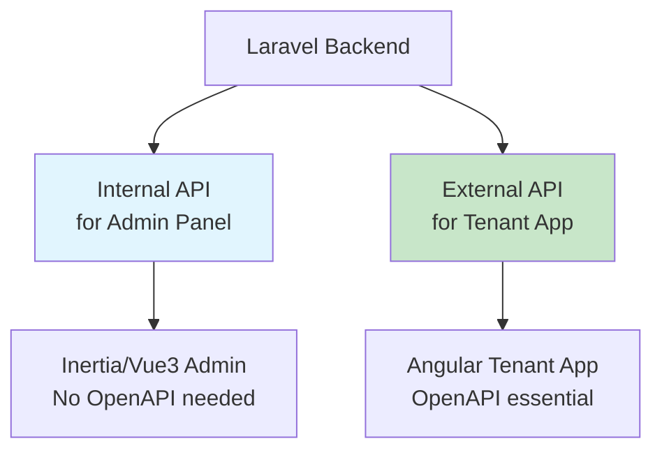
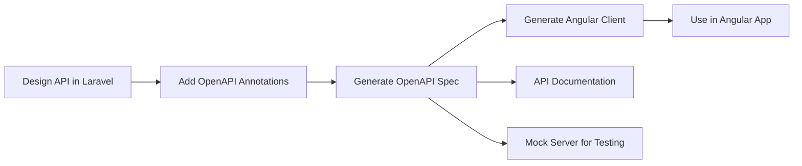

# 🔄 **API DESIGN STRATEGY FOR YOUR STACK**

You have a **hybrid stack** with different needs. Let me analyze what's actually necessary:

## **📊 STACK ANALYSIS & API NEEDS**

| **Component** | **Technology** | **API Consumption** | **OpenAPI Need** |
|--------------|---------------|-------------------|-----------------|
| **Admin Panel** | Laravel + Inertia + Vue3 | ✅ **Internal API calls** (same app) | ❌ **Not needed** |
| **Tenant App** | Angular (Separate) | ✅ **External API** | ✅ **Highly Recommended** |
| **Mobile Apps** | (Future) | ✅ **External API** | ✅ **Essential** |
| **Third-party** | (Election Commission?) | ✅ **External API** | ✅ **Critical** |

## **🎯 REALISTIC API STRATEGY**

### **Option A: Dual-API Approach (Recommended)**


### **Option B: Single API with Different Security**
- One API surface
- Different authentication methods
- Single OpenAPI spec
- More complex security model

**Recommendation: Option A** - Cleaner separation, easier maintenance.

---

## **🏗️ ARCHITECTURE IMPLEMENTATION**

### **1. Internal API (Admin Panel - No OpenAPI)**
```php
// routes/admin-api.php - Internal, stateless but same app
Route::prefix('admin-api')->middleware(['auth:admin', 'tenant.admin'])->group(function () {
    
    // Template management (admin only)
    Route::apiResource('templates', AdminTemplateController::class);
    
    // Tenant provisioning
    Route::post('tenants/{tenant}/apply-template', [TenantProvisioningController::class, 'applyTemplate']);
    Route::post('tenants/{tenant}/add-module', [TenantProvisioningController::class, 'addModule']);
    
    // These are consumed by Inertia/Vue components internally
});

// In your Vue component (admin panel)
<script setup>
import { useForm } from '@inertiajs/vue3'

const applyTemplate = (tenantId, templateId) => {
    useForm({}).post(`/admin-api/tenants/${tenantId}/apply-template`, {
        template_id: templateId
    })
}
</script>
```

### **2. External API (Tenant App - With OpenAPI)**
```php
// routes/api.php - External, stateless, versioned
Route::prefix('v1')->middleware(['auth:tenant-api', 'scopes:tenant'])->group(function () {
    
    // Tenant-specific endpoints
    Route::apiResource('members', MemberController::class)->only(['index', 'show']);
    Route::apiResource('committees', CommitteeController::class);
    
    // Election module endpoints (if enabled)
    Route::apiResource('elections', ElectionController::class);
    
    // These need OpenAPI documentation for Angular
});

// In Angular service
@Injectable()
export class TenantApiService {
  constructor(private http: HttpClient) {}
  
  getMembers(): Observable<Member[]> {
    return this.http.get<Member[]>('/api/v1/members');
  }
}
```

---

## **📝 OPENAPI SPECIFICATION - WHAT TO DOCUMENT**

### **Only Document External APIs:**
```yaml
# openapi.yaml - Only for external consumption
openapi: 3.0.0
info:
  title: "Nepali Political Party SaaS - Tenant API"
  description: "External API for tenant applications (Angular)"
  version: "1.0.0"

servers:
  - url: https://api.yoursaas.com/v1
    description: Production server
  - url: http://localhost:8000/api/v1
    description: Local development

paths:
  /members:
    get:
      summary: "Get party members"
      description: "Retrieve list of party members for the tenant"
      security:
        - bearerAuth: []
      responses:
        200:
          description: "Successful response"
          content:
            application/json:
              schema:
                type: array
                items:
                  $ref: '#/components/schemas/Member'
                  
  # Only document what Angular app needs
```

### **Components to Document:**
```yaml
components:
  schemas:
    Member:
      type: object
      properties:
        id:
          type: string
          format: uuid
        name:
          type: string
        citizenship_number:
          type: string
          description: "Nepali citizenship number"
        committee_role:
          type: string
          enum: ["president", "secretary", "member"]
        created_at:
          type: string
          format: date-time
  
  securitySchemes:
    bearerAuth:
      type: http
      scheme: bearer
      bearerFormat: JWT
      description: "Tenant JWT token from login"
```

---

## **🔧 IMPLEMENTATION WITH LARAVEL 12**

### **1. Install OpenAPI Tools**
```bash
# For external API documentation
composer require darkaonline/l5-swagger
# or
composer require vyuldashev/laravel-openapi

# Generate OpenAPI spec
php artisan openapi:generate --output=public/api-docs/openapi.yaml
```

### **2. Configure API Resources**
```php
// app/Http/Controllers/Api/V1/MemberController.php
/**
 * @OA\Get(
 *     path="/api/v1/members",
 *     summary="Get party members",
 *     description="Retrieve list of party members for authenticated tenant",
 *     tags={"Members"},
 *     security={{"bearerAuth":{}}},
 *     @OA\Response(
 *         response=200,
 *         description="Successful operation",
 *         @OA\JsonContent(
 *             type="array",
 *             @OA\Items(ref="#/components/schemas/Member")
 *         )
 *     )
 * )
 */
class MemberController extends Controller
{
    public function index(): MemberResourceCollection
    {
        return MemberResourceCollection::make(
            Member::where('tenant_id', auth()->user()->tenant_id)->paginate()
        );
    }
}
```

### **3. Generate Angular Client SDK**
```bash
# Generate TypeScript client from OpenAPI spec
npx @openapitools/openapi-generator-cli generate \
  -i public/api-docs/openapi.yaml \
  -g typescript-angular \
  -o frontend/tenant-app/src/api-client

# This creates ready-to-use Angular services
```

### **4. Angular Service Implementation**
```typescript
// frontend/tenant-app/src/app/services/api.service.ts
import { Injectable } from '@angular/core';
import { HttpClient } from '@angular/common/http';
import { Member, MembersService } from '../api-client'; // Auto-generated

@Injectable({
  providedIn: 'root'
})
export class TenantApiService {
  private membersService: MembersService;
  
  constructor(private http: HttpClient) {
    // Use auto-generated client
    const configuration = new Configuration({
      basePath: environment.apiUrl,
      accessToken: () => localStorage.getItem('token') || ''
    });
    
    this.membersService = new MembersService(
      this.http,
      environment.apiUrl,
      configuration
    );
  }
  
  getMembers(): Observable<Member[]> {
    return this.membersService.membersGet();
  }
}
```

---

## **⚡ REALISTIC WORKFLOW**

### **Development Workflow:**


### **Tooling Setup:**
```bash
# Package.json scripts
{
  "scripts": {
    "api:generate": "php artisan openapi:generate",
    "api:client": "openapi-generator-cli generate -i storage/api-docs/openapi.yaml -g typescript-angular -o frontend/src/api",
    "api:mock": "prism mock storage/api-docs/openapi.yaml",
    "api:validate": "swagger-cli validate storage/api-docs/openapi.yaml"
  }
}
```

---

## **🎯 WHAT YOU ACTUALLY NEED**

### **For Admin Panel (Inertia/Vue3):**
```php
// NO OpenAPI needed, just use Laravel conventions
// In Controller:
return Inertia::render('Templates/Index', [
    'templates' => TemplateResource::collection(Template::all())
]);

// In Vue Component:
<template>
  <div v-for="template in templates.data" :key="template.id">
    {{ template.name }}
    <button @click="applyTemplate(template.id)">Apply</button>
  </div>
</template>

<script setup>
const props = defineProps(['templates'])

const applyTemplate = (id) => {
  Inertia.post(`/admin/templates/${id}/apply`)
}
</script>
```

### **For Tenant App (Angular):**
```typescript
// YES, use OpenAPI-generated client
@Component({
  template: `
    <div *ngFor="let member of members$ | async">
      {{ member.name }} - {{ member.citizenship_number }}
    </div>
  `
})
export class MembersComponent implements OnInit {
  members$: Observable<Member[]>;
  
  constructor(private api: TenantApiService) {}
  
  ngOnInit() {
    this.members$ = this.api.getMembers();
  }
}
```

---

## **📊 DECISION MATRIX**

| **Scenario** | **OpenAPI Needed?** | **Reason** |
|-------------|-------------------|-----------|
| Admin Panel API calls | ❌ No | Same app, Inertia handles communication |
| Tenant Angular App | ✅ Yes | Separate app, needs contract |
| Mobile Apps (future) | ✅ Yes | Separate codebase |
| Third-party integration | ✅ Yes | External consumers |
| Internal microservices | ✅ Optional | Could use gRPC instead |
| Testing/mocking | ✅ Helpful | But not required |

---

## **🚀 PRAGMATIC IMPLEMENTATION PLAN**

### **Phase 1: Basic Setup (Week 1)**
```bash
# 1. Set up internal admin routes (no OpenAPI)
php artisan make:controller Admin/TemplateController --api --invokable

# 2. Set up external tenant API routes
php artisan make:controller Api/V1/MemberController --api

# 3. Add OpenAPI package (for external API only)
composer require darkaonline/l5-swagger --dev
```

### **Phase 2: OpenAPI for External API (Week 2)**
```bash
# 1. Annotate external controllers with OpenAPI
# 2. Generate OpenAPI spec
php artisan l5-swagger:generate

# 3. Generate Angular client
npm run api:client

# 4. Integrate with Angular app
```

### **Phase 3: Documentation & Testing (Week 3)**
```bash
# 1. Set up API documentation portal
# 2. Create mock server for Angular development
npm run api:mock

# 3. Write contract tests
php artisan make:test ApiContractTest
```

---

## **✅ FINAL RECOMMENDATION**

### **Do This:**
1. **Internal Admin API** → No OpenAPI, just Laravel + Inertia
2. **External Tenant API** → OpenAPI specification
3. **Generate Angular client** from OpenAPI spec
4. **Document only what external consumers need**

### **Skip This:**
1. Documenting internal admin endpoints
2. Complex API versioning (just v1 for now)
3. Hypermedia/HATEOAS (not needed for your use case)
4. Multiple authentication schemes (just JWT for external)

### **Simple Implementation:**
```php
// External API controllers only get OpenAPI annotations
/**
 * @OA\Info(title="Tenant API", version="1.0.0")
 * @OA\SecurityScheme(
 *     securityScheme="bearerAuth",
 *     type="http",
 *     scheme="bearer"
 * )
 */
class ExternalApiController {
    // Annotate methods here
}

// Internal admin controllers - no annotations
class InternalAdminController {
    // No OpenAPI needed
}
```

**This gives you:** Clean separation, minimal overhead, and the benefits of OpenAPI where they actually matter (for your Angular app).
