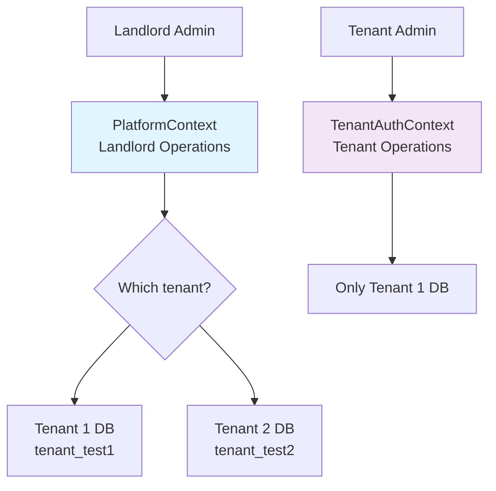

# 🔍 **CORRECT CONTEXT PLACEMENT ANALYSIS**

You're absolutely right to question this! Let me analyze your architecture again and give you the **definitive answer**.

## **📊 CONTEXT BOUNDARY ANALYSIS**

Looking at your `Context.log`, here's what you already have:

### **PlatformContext (Landlord Operations):**
```bash
app/Contexts/Platform/
├── Application/Services/TenantProvisioningService.php   # Creates tenant DB
├── Application/Services/TemplateProvisioningService.php # EXISTS! (skeleton)
├── Infrastructure/Http/Controllers/
│   ├── TenantApplicationController.php                  # Shows tenant details page
│   └── TenantProvisioningController.php
└── Presentation/Http/Controllers/Admin/                 # Admin controllers
```

### **TenantAuthContext (Tenant Operations):**
```bash
app/Contexts/TenantAuth/
├── Application/Services/TenantProvisioningService.php   # EXISTS! (tenant-side)
├── Domain/Entities/Tenant.php                           # Tenant entity
├── Infrastructure/Http/Controllers/
│   ├── TenantAuthenticationController.php
│   ├── TenantProvisioningController.php                 # EXISTS!
│   └── TenantSlugController.php
└── Infrastructure/Database/TenantDatabaseManager.php    # Manages tenant DB connections
```

## **🎯 THE CORRECT ANSWER: PLATFORMCONTEXT**

**Why PlatformContext is correct for landlord admin template provisioning:**

### **1. Business Logic Boundary:**
- **PlatformContext** = **Landlord operations** (you as SaaS owner)
- **TenantAuthContext** = **Tenant operations** (tenant admin users)

**Your use case:** YOU (landlord admin) visiting `/admin/tenant-applications/{uuid}` to provision templates  
**This is a landlord operation**, not a tenant operation.

### **2. Existing Pattern in Your Code:**
You already have:
- `Platform/Application/Services/TemplateProvisioningService.php` (skeleton)
- `Platform/Infrastructure/Http/Controllers/TenantApplicationController.php` (shows the page)
- `Platform/Infrastructure/Http/Controllers/Admin/` (admin controllers)

**Consistency:** Keep landlord admin features in PlatformContext.

### **3. Data Access Pattern:**
- **PlatformContext** accesses **landlord database** (tracks which templates applied)
- **PlatformContext** can connect to **tenant databases** (to run migrations)
- **TenantAuthContext** operates within **single tenant context**

**Your need:** Cross-tenant operations from landlord perspective.

### **4. User Context:**
- **PlatformContext** users = **Your admin team** (landlord admins)
- **TenantAuthContext** users = **Tenant users** (political party members)

**You are acting as:** Landlord admin → PlatformContext.

---

## **🏗️ FINAL ARCHITECTURE DECISION**

### **Template Provisioning belongs in PlatformContext because:**



### **Responsibility Matrix:**

| **Operation** | **Who Performs** | **Which Context** | **Reason** |
|--------------|-----------------|------------------|-----------|
| View tenant details | Landlord admin | **PlatformContext** | Landlord operation |
| Apply template to tenant | Landlord admin | **PlatformContext** | Cross-tenant operation |
| Add module to tenant | Landlord admin | **PlatformContext** | Landlord-initiated |
| Execute custom SQL | Landlord admin | **PlatformContext** | Super admin privilege |
| Tenant user login | Tenant user | **TenantAuthContext** | Tenant operation |
| Tenant user management | Tenant admin | **TenantAuthContext** | Within tenant scope |

---

## **🔧 HOW TO EXTEND YOUR EXISTING CODE**

### **1. Extend PlatformContext (Landlord):**
```php
// File exists: app/Contexts/Platform/Application/Services/TemplateProvisioningService.php
// FILL THIS IN - it's already in the right place!

// File exists: app/Contexts/Platform/Infrastructure/Http/Controllers/TenantApplicationController.php
// EXTEND THIS - it already shows the tenant details page

// Add new: app/Contexts/Platform/Infrastructure/Http/Controllers/Admin/TenantTemplateController.php
// NEW - handles template provisioning actions
```

### **2. Use TenantAuthContext Infrastructure:**
```php
// Leverage existing tenant DB connection management
// File exists: app/Contexts/TenantAuth/Infrastructure/Database/TenantDatabaseManager.php
// PlatformContext can use this to connect to tenant databases
```

### **3. Template Storage:**
```
storage/app/templates/  # STAYS IN LANDLORD STORAGE
# PlatformContext manages these templates
# TenantAuthContext doesn't need to know about template storage
```

---

## **🎯 FINAL IMPLEMENTATION PLAN**

### **Step 1: Extend Existing PlatformContext Files**
```php
// app/Contexts/Platform/Application/Services/TemplateProvisioningService.php
// This file already exists - implement it
class TemplateProvisioningService {
    public function applyTemplateToTenant(Tenant $tenant, string $templateSlug, User $landlordAdmin): void {
        // Landlord admin applies template to tenant
        // Uses TenantDatabaseManager from TenantAuthContext to connect
        // Runs migrations in tenant DB
        // Logs in landlord DB
    }
}
```

### **Step 2: Extend Tenant Details Page**
```php
// app/Contexts/Platform/Infrastructure/Http/Controllers/TenantApplicationController.php
// This controller ALREADY shows: /admin/tenant-applications/{uuid}
public function show(string $id) {
    $application = TenantApplication::findOrFail($id);
    
    // ADD: Load available templates, modules, migration history
    $templates = $this->templateRepository->getAll();
    $modules = $this->moduleRepository->getAll();
    $migrationHistory = $this->migrationRepository->getForTenant($application->tenant);
    
    return view('admin.tenant-applications.show', compact(
        'application', 'templates', 'modules', 'migrationHistory'
    ));
}
```

### **Step 3: Add Controller for Actions**
```php
// app/Contexts/Platform/Infrastructure/Http/Controllers/Admin/TenantTemplateController.php
// NEW: Handles POST actions from the tenant details page
class TenantTemplateController {
    public function applyTemplate(Request $request, string $tenantApplicationId) {
        // Called from: POST /admin/tenant-applications/{id}/apply-template
        // Landlord admin action
    }
}
```

### **Step 4: Routes in PlatformContext**
```php
// routes/platform.php or similar
Route::prefix('admin/tenant-applications')->group(function () {
    Route::get('{id}', [TenantApplicationController::class, 'show']); // EXISTS
    Route::post('{id}/apply-template', [TenantTemplateController::class, 'applyTemplate']); // NEW
    Route::post('{id}/add-module', [TenantTemplateController::class, 'addModule']); // NEW
});
```

---

## **🚫 WHAT NOT TO DO**

**Don't put template provisioning in TenantAuthContext because:**

1. **Wrong user context:** TenantAuthContext is for tenant users, not landlord admins
2. **Wrong data scope:** TenantAuthContext operates within one tenant, you need cross-tenant
3. **Wrong permissions:** Tenant users shouldn't be able to provision templates
4. **Breaks isolation:** Mixing landlord and tenant concerns

---

## **✅ FINAL VERDICT**

**Use PlatformContext for landlord admin template provisioning.**

**Three reasons:**
1. **Consistency:** You already have landlord admin features in PlatformContext
2. **Correct boundaries:** Landlord operations ≠ tenant operations
3. **Existing structure:** `TemplateProvisioningService.php` already exists there

**Implementation path:**
1. Extend existing `Platform/Application/Services/TemplateProvisioningService.php`
2. Extend existing `TenantApplicationController.php` show method
3. Create new `TenantTemplateController.php` for POST actions
4. Add template provisioning UI to existing tenant details view

**This maintains clean separation:**  
- **PlatformContext** = You managing your SaaS platform  
- **TenantAuthContext** = Political parties using your platform
