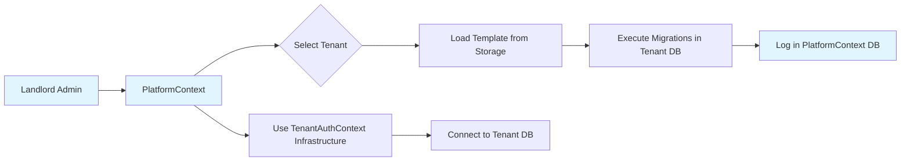

# 🧐 **SENIOR ARCHITECT REVIEW: CLAUDE'S IMPLEMENTATION PLAN ANALYSIS**

## **🔍 CRITICAL ANALYSIS & ISSUES IDENTIFIED**

Claude's plan has **significant architectural contradictions** that need immediate correction:

### **🚨 MAJOR ISSUE #1: Context Boundary Violation**
**Claude says:** "TenantAuthContext → Template/Module provisioning"  
**Reality:** This is **WRONG** for your use case.

**Your requirement:** Landlord admin at `/admin/tenant-applications/{uuid}` applies templates  
**Correct context:** **PlatformContext** (landlord operations), NOT TenantAuthContext

### **🚨 MAJOR ISSUE #2: User Permission Confusion**
Claude's code shows:
```php
public function applyTemplate(Tenant $tenant, string $templateSlug, User $admin): void
{
    // 1. Validate admin belongs to tenant ❌ WRONG!
```

**Problem:** Landlord admin doesn't "belong to tenant" - they're super admins!
**Correct logic:** Validate landlord admin has `platform.admin` permissions.

### **🚨 MAJOR ISSUE #3: Wrong Route Structure**
Claude suggests:
```php
Route::tenantAdmin()->group(function () {
    Route::get('/templates', [TenantTemplateController::class, 'index']);
});
```

**Problem:** `tenantAdmin()` implies **tenant user routes**, not landlord admin routes  
**Correct:** Should be in landlord admin routes, likely already in `routes/admin.php`

### **🚨 MAJOR ISSUE #4: Mixing Landlord & Tenant Concerns**
Claude puts template storage in PlatformContext but provisioning in TenantAuthContext  
**This creates a circular dependency nightmare!**

---

## **🏗️ CORRECTED ARCHITECTURE PLAN**

### **Context Responsibility Matrix (CORRECTED):**

| **Component** | **Correct Context** | **Reason** |
|--------------|-------------------|-----------|
| **Template Definitions** | PlatformContext | Landlord manages templates |
| **Template Storage** | PlatformContext | Landlord stores template files |
| **Template Application** | PlatformContext | Landlord admin applies to tenants |
| **Tenant Database Connection** | TenantAuthContext (reuse) | Already has TenantDatabaseManager |
| **Module Definitions** | PlatformContext | Landlord manages modules |
| **Module Application** | PlatformContext | Landlord admin adds modules |
| **Migration History** | PlatformContext | Landlord tracks all tenant migrations |
| **Custom Migration Requests** | PlatformContext | Landlord approves/executes |

### **Corrected Workflow:**


---

## **📋 CORRECTED IMPLEMENTATION PLAN**

### **PHASE 0: ARCHITECTURAL FOUNDATION (Day 1-2)**

**1. Analyze Existing Code:**
```bash
# Review what actually exists
cat app/Contexts/Platform/Application/Services/TemplateProvisioningService.php
cat app/Contexts/Platform/Infrastructure/Http/Controllers/TenantApplicationController.php
cat app/Contexts/TenantAuth/Infrastructure/Database/TenantDatabaseManager.php
```

**2. Design Database Schema (Landlord DB):**
```sql
-- Add to existing tenants table
ALTER TABLE tenants 
ADD COLUMN applied_template_slug VARCHAR(100) NULL,
ADD COLUMN template_applied_at TIMESTAMP NULL,
ADD COLUMN template_version VARCHAR(20) NULL,
ADD INDEX idx_tenant_template (applied_template_slug);

-- Migration audit trail
CREATE TABLE tenant_migration_audit (
    id BIGINT UNSIGNED PRIMARY KEY AUTO_INCREMENT,
    tenant_id UUID NOT NULL REFERENCES tenants(id),
    migration_type ENUM('category_template', 'module', 'custom', 'individual') NOT NULL,
    migration_name VARCHAR(255) NOT NULL,
    migration_file VARCHAR(500) NULL,
    applied_by_user_id UUID NOT NULL,  -- Landlord admin user
    applied_at TIMESTAMP DEFAULT CURRENT_TIMESTAMP,
    execution_duration_ms INT,
    status ENUM('success', 'failed', 'rolled_back') DEFAULT 'success',
    error_message TEXT NULL,
    rollback_sql TEXT NULL,
    metadata JSON,
    INDEX idx_tenant_migrations (tenant_id, applied_at DESC),
    INDEX idx_migration_type (migration_type, status)
);

-- Track applied modules
CREATE TABLE tenant_applied_modules (
    id BIGINT UNSIGNED PRIMARY KEY AUTO_INCREMENT,
    tenant_id UUID NOT NULL REFERENCES tenants(id),
    module_slug VARCHAR(100) NOT NULL,
    module_version VARCHAR(20) NOT NULL,
    applied_at TIMESTAMP DEFAULT CURRENT_TIMESTAMP,
    applied_by_user_id UUID NOT NULL,
    UNIQUE KEY uniq_tenant_module (tenant_id, module_slug)
);
```

### **PHASE 1: TEMPLATE SYSTEM IN PLATFORMCONTEXT (Week 1)**

**1. Create Template Storage Structure:**
```bash
# Landlord-managed templates
mkdir -p storage/app/templates/categories/political_party_nepal
mkdir -p storage/app/templates/modules/election

# Create template definition
cat > storage/app/templates/categories/political_party_nepal/template.json << 'EOF'
{
  "slug": "political_party_nepal",
  "name": "Political Party Nepal",
  "version": "1.0.0",
  "description": "Complete schema for Nepali political parties",
  "category": "political_party",
  "nepali_context": {
    "provinces": 7,
    "districts": 77,
    "currency": "NPR",
    "citizenship_validation": true
  },
  "migrations": [
    "001_create_political_parties_table.php",
    "002_create_party_committees_table.php",
    "003_create_committee_members_table.php",
    "004_create_nepali_provinces_table.php",
    "005_create_nepali_districts_table.php"
  ],
  "seeders": [
    "seed_nepali_administrative_data.php"
  ],
  "compatible_modules": ["election", "financial_tracking"]
}
EOF
```

**2. Implement Template Service in PlatformContext:**
```php
// app/Contexts/Platform/Application/Services/TenantTemplateProvisioningService.php
// NEW: Landlord service for template provisioning

namespace App\Contexts\Platform\Application\Services;

use App\Contexts\Platform\Domain\Models\Tenant;
use App\Contexts\Platform\Domain\Models\User; // Landlord admin user
use App\Contexts\TenantAuth\Infrastructure\Database\TenantDatabaseManager;

class TenantTemplateProvisioningService
{
    public function __construct(
        private TenantDatabaseManager $tenantDbManager,
        private MigrationAuditRepository $auditRepo
    ) {}
    
    /**
     * Landlord admin applies template to tenant
     */
    public function applyCategoryTemplate(
        Tenant $tenant, 
        string $templateSlug, 
        User $landlordAdmin
    ): void {
        // 1. Validate landlord admin has permission
        if (!$landlordAdmin->hasPermission('platform.manage_templates')) {
            throw new UnauthorizedException();
        }
        
        // 2. Load template definition from landlord storage
        $template = $this->loadTemplateDefinition($templateSlug);
        
        // 3. Get connection to tenant database
        $tenantConnection = $this->tenantDbManager->connectionForTenant($tenant);
        
        // 4. Apply migrations in transaction
        DB::beginTransaction();
        try {
            foreach ($template['migrations'] as $migrationFile) {
                $this->applyMigrationFile($tenantConnection, $templateSlug, $migrationFile);
                
                $this->auditRepo->logMigration(
                    tenant: $tenant,
                    type: 'category_template',
                    name: $migrationFile,
                    admin: $landlordAdmin,
                    status: 'success'
                );
            }
            
            // 5. Update tenant record
            $tenant->update([
                'applied_template_slug' => $templateSlug,
                'template_applied_at' => now(),
                'template_version' => $template['version'],
            ]);
            
            DB::commit();
            
        } catch (\Exception $e) {
            DB::rollBack();
            $this->auditRepo->logFailure($tenant, $templateSlug, $landlordAdmin, $e);
            throw $e;
        }
    }
    
    private function applyMigrationFile($connection, string $templateSlug, string $file): void
    {
        $path = storage_path("app/templates/categories/{$templateSlug}/migrations/{$file}");
        $sql = file_get_contents($path);
        $connection->statement($sql);
    }
}
```

**3. Extend Existing Tenant Admin Page:**
```php
// app/Contexts/Platform/Infrastructure/Http/Controllers/TenantApplicationController.php
// EXTEND EXISTING CONTROLLER

public function show(string $id)
{
    $application = TenantApplication::findOrFail($id);
    
    // NEW: Load template data for the view
    $availableTemplates = $this->templateService->getAvailableTemplates();
    $availableModules = $this->moduleService->getAvailableModules();
    $migrationHistory = $this->auditRepo->getForTenant($application->tenant);
    
    return view('admin.tenant-applications.show', compact(
        'application',
        'availableTemplates',
        'availableModules', 
        'migrationHistory'
    ));
}
```

**4. Add Template UI to Existing Blade View:**
```blade
{{-- Add to existing tenant-applications/show.blade.php --}}
<div class="mt-8">
    <h3 class="text-lg font-medium text-gray-900 mb-4">Schema Provisioning</h3>
    
    @if(!$application->tenant->applied_template_slug)
    <div class="bg-white shadow rounded-lg p-6">
        <h4 class="text-sm font-medium text-gray-900 mb-3">Apply Category Template</h4>
        <form action="{{ route('admin.tenant-applications.apply-template', $application->id) }}" 
              method="POST">
            @csrf
            <select name="template_slug" class="mt-1 block w-full rounded-md border-gray-300">
                @foreach($availableTemplates as $template)
                <option value="{{ $template['slug'] }}">{{ $template['name'] }}</option>
                @endforeach
            </select>
            <button type="submit" 
                    class="mt-3 inline-flex items-center px-4 py-2 bg-blue-600 text-white rounded">
                Apply Template
            </button>
        </form>
    </div>
    @else
    <div class="bg-green-50 rounded-md p-4 mb-4">
        <p class="text-sm text-green-800">
            ✅ Template applied: <strong>{{ $application->tenant->applied_template_slug }}</strong>
            on {{ $application->tenant->template_applied_at->format('Y-m-d H:i') }}
        </p>
    </div>
    @endif
</div>
```

### **PHASE 2: MODULE INTEGRATION (Week 2)**

**1. Make Election Module Template-Aware:**
```php
// app/Contexts/Election/Application/Services/ElectionModuleCompatibilityService.php
// NEW: Check if election module works with template

class ElectionModuleCompatibilityService
{
    public function isCompatibleWithTemplate(string $templateSlug): bool
    {
        $compatibleTemplates = [
            'political_party_nepal',
            'non_profit_organization', 
            'community_group'
        ];
        
        return in_array($templateSlug, $compatibleTemplates);
    }
    
    public function getModuleMigrations(): array
    {
        // Return migration files from ElectionContext
        return [
            'create_elections_table.php',
            'create_candidates_table.php',
            'create_votes_table.php',
        ];
    }
}
```

**2. Module Application Service in PlatformContext:**
```php
// app/Contexts/Platform/Application/Services/TenantModuleIntegrationService.php

class TenantModuleIntegrationService
{
    public function addModuleToTenant(
        Tenant $tenant,
        string $moduleSlug,
        User $landlordAdmin
    ): void {
        // 1. Check tenant has template
        if (!$tenant->applied_template_slug) {
            throw new TemplateRequiredException();
        }
        
        // 2. Check module compatibility
        $compatibilityService = $this->getCompatibilityService($moduleSlug);
        if (!$compatibilityService->isCompatibleWithTemplate($tenant->applied_template_slug)) {
            throw new ModuleIncompatibleException();
        }
        
        // 3. Apply module migrations
        $migrations = $compatibilityService->getModuleMigrations();
        $connection = $this->tenantDbManager->connectionForTenant($tenant);
        
        foreach ($migrations as $migration) {
            $this->applyModuleMigration($connection, $moduleSlug, $migration);
        }
        
        // 4. Track in landlord DB
        DB::table('tenant_applied_modules')->insert([
            'tenant_id' => $tenant->id,
            'module_slug' => $moduleSlug,
            'module_version' => '1.0.0',
            'applied_at' => now(),
            'applied_by_user_id' => $landlordAdmin->id,
        ]);
    }
}
```

### **PHASE 3: CUSTOM & INDIVIDUAL MIGRATIONS (Week 3)**

**1. Custom Migration Request System:**
```php
// app/Contexts/Platform/Domain/Entities/CustomMigrationRequest.php

class CustomMigrationRequest
{
    private string $id;
    private Tenant $tenant;
    private string $sql;
    private string $description;
    private User $requestedBy; // Could be landlord OR tenant admin
    private ?User $approvedBy; // Landlord admin
    private MigrationRequestStatus $status;
    private DateTime $requestedAt;
    private ?DateTime $approvedAt;
    
    public function approve(User $landlordAdmin): void
    {
        // Only landlord admin can approve
        if (!$landlordAdmin->hasRole('platform.admin')) {
            throw new UnauthorizedException();
        }
        
        $this->status = MigrationRequestStatus::APPROVED;
        $this->approvedBy = $landlordAdmin;
        $this->approvedAt = new DateTime();
        
        $this->recordEvent(new CustomMigrationApproved($this));
    }
}
```

**2. Safe SQL Execution Service:**
```php
class SafeMigrationExecutor
{
    private array $dangerousKeywords = [
        'DROP DATABASE', 'DROP TABLE', 'TRUNCATE TABLE',
        'DELETE FROM', 'UPDATE *', 'ALTER TABLE DROP'
    ];
    
    public function executeSafely(Tenant $tenant, string $sql, User $executor): void
    {
        // Validate SQL
        $this->validateSqlSafety($sql);
        
        // Check for destructive operations
        if ($this->isDestructiveOperation($sql)) {
            // Require additional approval
            if (!$executor->hasPermission('platform.execute_destructive_migrations')) {
                throw new DestructiveOperationException();
            }
        }
        
        // Execute in tenant database
        $connection = $this->tenantDbManager->connectionForTenant($tenant);
        $connection->statement($sql);
    }
}
```

### **PHASE 4: NEPALI CONTEXT & OPTIMIZATION (Week 4)**

**1. Nepali Data Seeders:**
```php
// storage/app/templates/categories/political_party_nepal/seeders/seed_nepali_administrative_data.php

INSERT INTO provinces (id, name, name_np, capital, area_sq_km) VALUES
(1, 'Koshi Province', 'कोशी प्रदेश', 'Biratnagar', 25905),
(2, 'Madhesh Province', 'मधेश प्रदेश', 'Janakpur', 9661),
-- ... 7 provinces
;

INSERT INTO districts (id, province_id, name, name_np, headquarters, area_sq_km) VALUES
(1, 1, 'Bhojpur', 'भोजपुर', 'Bhojpur', 1507),
(2, 1, 'Dhankuta', 'धनकुटा', 'Dhankuta', 891),
-- ... 77 districts
;
```

**2. Election Commission Compliance:**
```php
// Migration for EC compliance
Schema::create('financial_reports', function (Blueprint $table) {
    $table->uuid('id')->primary();
    $table->enum('report_type', ['quarterly', 'annual', 'election']);
    $table->date('reporting_period_start');
    $table->date('reporting_period_end');
    $table->decimal('total_income_npr', 15, 2);
    $table->decimal('total_expenditure_npr', 15, 2);
    $table->string('submitted_to_ec_number')->nullable(); // EC filing reference
    $table->date('submitted_date')->nullable();
    $table->enum('ec_status', ['pending', 'submitted', 'approved', 'rejected'])
          ->default('pending');
    $table->json('supporting_documents')->nullable();
    $table->timestamps();
});
```

---

## **✅ CORRECTED DELIVERY PLAN**

### **Week 1: Landlord Template System**
- [x] Template storage structure
- [x] `TenantTemplateProvisioningService` in PlatformContext
- [x] Extend existing tenant admin page
- [x] Political Party Nepal template with 5 migrations
- [x] Migration audit trail in landlord DB

### **Week 2: Module Integration**
- [ ] Make ElectionContext template-aware
- [ ] Module compatibility checking
- [ ] Module application service
- [ ] UI for adding modules
- [ ] Dependency resolution (simple topological sort)

### **Week 3: Custom Migrations**
- [ ] Custom migration request entity
- [ ] Approval workflow
- [ ] Safe SQL execution with validation
- [ ] Rollback capability
- [ ] Tenant-specific customization interface

### **Week 4: Polish & Nepali Context**
- [ ] Nepali administrative data seeders
- [ ] Election Commission compliance tables
- [ ] Performance optimization (batch migrations)
- [ ] Comprehensive testing
- [ ] Documentation

---

## **🎯 KEY CORRECTIONS FROM CLAUDE'S PLAN**

| **Claude's Mistake** | **Corrected Approach** |
|---------------------|----------------------|
| TenantAuthContext for provisioning | **PlatformContext** (landlord ops) |
| Tenant admin applies templates | **Landlord admin** applies templates |
| Routes in `tenantAdmin()` group | Routes in **landlord admin** group |
| Admin "belongs to tenant" validation | **Landlord permission** validation |
| Mixing contexts | **Clean separation**: PlatformContext orchestrates, uses TenantAuthContext infrastructure |

---

## **🚀 STARTING TASK (CORRECTED)**

**Begin with Week 1, Task 1:**
1. **First:** Create Political Party Nepal template in `storage/app/templates/`
2. **Second:** Implement `TenantTemplateProvisioningService` in **PlatformContext**
3. **Third:** Extend **existing** `TenantApplicationController::show()` method
4. **Fourth:** Add template UI to **existing** tenant details view
5. **Fifth:** Create landlord database tables for audit trail

**Focus:** Keep landlord operations in PlatformContext, use TenantAuthContext only for database connection infrastructure.

**This corrected plan maintains clean DDD boundaries while delivering your requirement of landlord-admin-controlled template provisioning.**