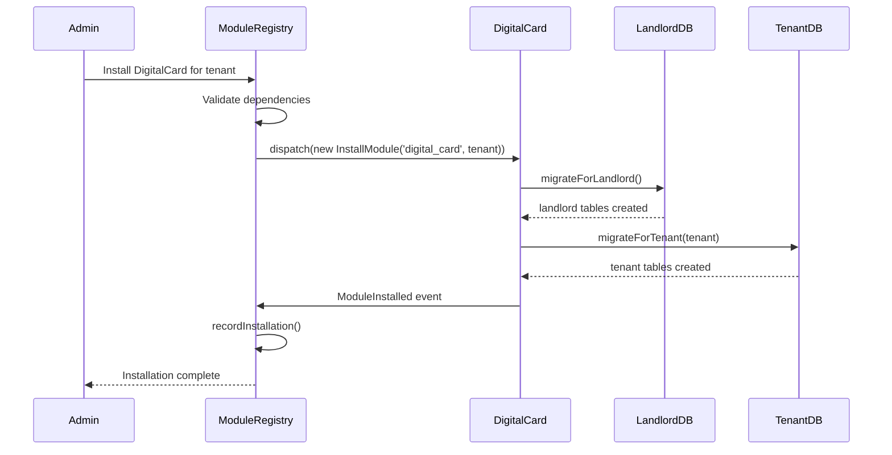

# 🏗️ **SENIOR SOLUTION ARCHITECT REVIEW**

## 🔍 **CRITICAL FLAW IDENTIFIED IN PREVIOUS ARCHITECTURE**

**The fundamental problem:** My previous design **violates Context Independence** by having ModuleRegistry context responsible for migrating **other contexts'** tables.

### **❌ WRONG APPROACH (Previous Design):**
```
ModuleRegistry Command → Migrates DigitalCard tables
    (Context A)              (Context B's tables!)
```

**This creates:**
1. **Circular dependencies** - ModuleRegistry needs to know about DigitalCard's schema
2. **Tight coupling** - Changes in DigitalCard break ModuleRegistry
3. **Violates Bounded Contexts** - Each context should own its migrations
4. **Maintenance nightmare** - Centralized migration logic

---

## ✅ **CORRECT ARCHITECTURE: DECENTRALIZED MIGRATION**

### **Principle:** **Each Context Owns Its Own Migrations**

```
┌─────────────────┐    ┌─────────────────┐    ┌─────────────────┐
│  ModuleRegistry │    │   DigitalCard   │    │    Calendar     │
│    Context      │    │    Context      │    │    Context      │
├─────────────────┤    ├─────────────────┤    ├─────────────────┤
│• modules table  │    │• digital_cards  │    │• events table   │
│• tenant_modules │    │• card_templates │    │• calendars      │
│  (landlord)     │    │  (tenant)       │    │  (tenant)       │
│                 │    │• global_config  │    │• global_config  │
│                 │    │  (landlord)     │    │  (landlord)     │
└─────────────────┘    └─────────────────┘    └─────────────────┘
        │                       │                       │
        └───────────────────────┼───────────────────────┘
                                │
                         Installation Trigger
                          (ModuleRegistry API)
```

---

## 🎯 **NEW ARCHITECTURE: EVENT-DRIVEN MIGRATION**

### **Step 1: ModuleRegistry Only Manages Catalog**
```php
// ModuleRegistry ONLY knows about:
namespace App\Contexts\ModuleRegistry\Domain\Models;

class Module 
{
    private ModuleId $id;
    private ModuleName $name;
    private MigrationPaths $migrationPaths; // Just paths, not logic
    
    public function migrationPaths(): MigrationPaths
    {
        return new MigrationPaths(
            landlord: 'app/Contexts/DigitalCard/Infrastructure/Database/Migrations/Landlord',
            tenant: 'app/Contexts/DigitalCard/Infrastructure/Database/Migrations/Tenant'
        );
    }
    
    // NO migration logic here!
}
```

### **Step 2: Each Context Provides Its Own Migrator**
```php
// DigitalCard Context provides its OWN migrator
namespace App\Contexts\DigitalCard\Application\Services;

class DigitalCardMigrator
{
    public function migrateForLandlord(): void
    {
        // Runs DigitalCard's landlord migrations
        $migrator = app('migrator');
        $migrator->run([
            base_path('app/Contexts/DigitalCard/Infrastructure/Database/Migrations/Landlord')
        ]);
    }
    
    public function migrateForTenant(string $tenantSlug): void
    {
        // Switch to tenant database
        DB::setDefaultConnection("tenant_{$tenantSlug}");
        
        // Runs DigitalCard's tenant migrations
        $migrator = app('migrator');
        $migrator->run([
            base_path('app/Contexts/DigitalCard/Infrastructure/Database/Migrations/Tenant')
        ]);
    }
}
```

### **Step 3: ModuleRegistry Discovers & Triggers (NOT Executes)**
```php
// ModuleRegistry Service (orchestrator, not executor)
class ModuleInstallationService
{
    public function installModule(string $moduleName, string $tenantSlug): void
    {
        // 1. Get module from catalog
        $module = $this->moduleRepository->findByName($moduleName);
        
        // 2. Discover module's migrator class
        $migratorClass = $this->discoverMigrator($moduleName);
        // e.g., "App\Contexts\DigitalCard\Application\Services\DigitalCardMigrator"
        
        // 3. Instantiate migrator (DI container)
        $migrator = app($migratorClass);
        
        // 4. Trigger migrations (module's own responsibility)
        $migrator->migrateForLandlord();
        $migrator->migrateForTenant($tenantSlug);
        
        // 5. Record installation
        $this->recordInstallation($module, $tenantSlug);
    }
    
    private function discoverMigrator(string $moduleName): string
    {
        // Convention over configuration
        $namespace = "App\\Contexts\\" . ucfirst($moduleName);
        return "{$namespace}\\Application\\Services\\{$moduleName}Migrator";
    }
}
```

---

## 🚀 **BEST SOLUTION: PLUGGABLE MIGRATION INTERFACE**

### **1. Define Migration Contract (Shared Kernel)**
```php
// In Shared Kernel (minimal, stable interface)
namespace App\Shared\Contracts;

interface ModuleMigratorInterface
{
    public function migrateForLandlord(): void;
    public function migrateForTenant(string $tenantSlug): void;
    public function rollbackForLandlord(): void;
    public function rollbackForTenant(string $tenantSlug): void;
}
```

### **2. Each Context Implements Its Own**
```php
// DigitalCard Context
namespace App\Contexts\DigitalCard\Application\Services;

use App\Shared\Contracts\ModuleMigratorInterface;

class DigitalCardMigrator implements ModuleMigratorInterface
{
    public function migrateForLandlord(): void
    {
        // DigitalCard's specific landlord migrations
        $this->runMigrations('landlord');
    }
    
    public function migrateForTenant(string $tenantSlug): void
    {
        DB::setDefaultConnection("tenant_{$tenantSlug}");
        $this->runMigrations('tenant');
    }
    
    private function runMigrations(string $scope): void
    {
        $path = "app/Contexts/DigitalCard/Infrastructure/Database/Migrations/{$scope}";
        $migrator = app('migrator');
        $migrator->run([base_path($path)]);
    }
}
```

### **3. Auto-Discovery & Registration**
```php
// ModuleRegistry uses Laravel's Service Container
class ModuleRegistryServiceProvider extends ServiceProvider
{
    public function register(): void
    {
        // Auto-bind migrators
        $this->app->bind(
            'module.migrator.digital_card',
            \App\Contexts\DigitalCard\Application\Services\DigitalCardMigrator::class
        );
        
        $this->app->bind(
            'module.migrator.calendar', 
            \App\Contexts\Calendar\Application\Services\CalendarMigrator::class
        );
        
        // Or dynamic discovery:
        $this->discoverAndRegisterMigrators();
    }
    
    private function discoverAndRegisterMigrators(): void
    {
        foreach ($this->getInstalledModules() as $module) {
            $migratorClass = "App\\Contexts\\{$module}\\Application\\Services\\{$module}Migrator";
            
            if (class_exists($migratorClass)) {
                $this->app->bind("module.migrator.{$module}", $migratorClass);
            }
        }
    }
}
```

---

## 📋 **CONTEXT-INDEPENDENT COMMAND STRUCTURE**

### **Option A: Central Command with Plugins (Recommended)**
```php
// In ModuleRegistry Context (orchestrates, doesn't execute)
class ModuleMigrateCommand extends Command
{
    protected $signature = 'module:migrate 
                            {module : Module name}
                            {--tenant= : Tenant slug}
                            {--all : All tenants}
                            {--scope=all : landlord|tenant|all}';
    
    public function handle(ModuleMigratorFactory $factory)
    {
        $module = $this->argument('module');
        
        // Get the module's OWN migrator
        $migrator = $factory->getMigratorForModule($module);
        
        if ($this->option('scope') === 'landlord' || $this->option('scope') === 'all') {
            $migrator->migrateForLandlord();
            $this->info("✓ {$module} landlord migrations completed");
        }
        
        if ($this->tenantSpecified() && $this->option('scope') !== 'landlord') {
            $migrator->migrateForTenant($this->getTenantSlug());
            $this->info("✓ {$module} tenant migrations completed");
        }
    }
}
```

### **Option B: Each Context Has Its Own Command (More Decoupled)**
```bash
# ModuleRegistry command (for catalog tables)
php artisan module-registry:migrate

# DigitalCard command (for its own tables)
php artisan digital-card:migrate --tenant=acme

# Calendar command (for its own tables)  
php artisan calendar:migrate --tenant=acme
```

**Better:** **Option A with plugins** - Single entry point but delegating execution.

---

## 🏗️ **DATABASE RESPONSIBILITY MATRIX**

| Component | Landlord Tables | Tenant Tables | Migration Logic |
|-----------|-----------------|---------------|-----------------|
| **ModuleRegistry** | `modules`, `tenant_modules` | None | Own migrator in ModuleRegistry context |
| **DigitalCard** | `digital_card_global_config` | `digital_cards`, `card_templates` | Own migrator in DigitalCard context |
| **Calendar** | `calendar_global_config` | `events`, `calendars` | Own migrator in Calendar context |
| **UserManagement** | `users` (platform) | `user_profiles` (tenant) | Own migrator in UserManagement context |

**Rule:** **Each context migrates its own tables, in its own databases.**

---

## 🔧 **IMPLEMENTATION BLUEPRINT**

### **1. Shared Kernel (Minimal)**
```php
// packages/laravel-backend/app/Shared/
├── Contracts/
│   └── ModuleMigratorInterface.php
└── Kernel.php
```

### **2. ModuleRegistry Context (Orchestrator)**
```php
// packages/laravel-backend/app/Contexts/ModuleRegistry/
├── Application/
│   ├── Commands/
│   │   └── ModuleMigrateCommand.php      # Orchestrates others
│   └── Services/
│       ├── ModuleMigratorFactory.php     # Discovers migrators
│       └── ModuleInstallationService.php # Triggers migrations
├── Infrastructure/
│   └── Database/
│       └── Migrations/
│           ├── landlord/                  # OWN landlord tables
│           │   ├── create_modules_table.php
│           │   └── create_tenant_modules_table.php
│           └── tenant/                    # OWN tenant tables (if any)
│               └── (none - ModuleRegistry is landlord-only)
└── Application/Services/
    └── ModuleRegistryMigrator.php        # Migrates OWN tables
```

### **3. DigitalCard Context (Self-contained)**
```php
// packages/laravel-backend/app/Contexts/DigitalCard/
├── Application/
│   └── Services/
│       └── DigitalCardMigrator.php       # Migrates OWN tables
├── Infrastructure/
│   └── Database/
│       └── Migrations/
│           ├── landlord/
│           │   └── create_digital_card_global_config.php
│           └── tenant/
│               ├── create_digital_cards_table.php
│               └── create_card_templates_table.php
└── (No knowledge of ModuleRegistry migrators)
```

### **4. Registration (Auto-discovery)**
```php
// In each context's ServiceProvider
class DigitalCardServiceProvider extends ServiceProvider
{
    public function register(): void
    {
        // Register OUR migrator
        $this->app->singleton(
            \App\Contexts\DigitalCard\Application\Services\DigitalCardMigrator::class
        );
        
        // Tag it for discovery
        $this->app->tag(
            \App\Contexts\DigitalCard\Application\Services\DigitalCardMigrator::class,
            ['module.migrator']
        );
    }
}
```

---

## 🎯 **EVENT-DRIVEN INSTALLATION FLOW**



---

## 💡 **INNOVATION: MIGRATION "BLUEPRINTS"**

### **Module Exports Migration Blueprint:**
```php
// DigitalCard defines WHAT to migrate, not HOW
class DigitalCardMigrationBlueprint
{
    public static function getLandlordMigrations(): array
    {
        return [
            'create_digital_card_global_config' => [
                'table' => 'digital_card_global_config',
                'columns' => [
                    'id', 'key', 'value', 'created_at', 'updated_at'
                ],
                'indexes' => ['key'],
                'description' => 'Global DigitalCard settings'
            ]
        ];
    }
    
    public static function getTenantMigrations(): array
    {
        return [
            'create_digital_cards_table' => [
                'table' => 'digital_cards',
                'columns' => [
                    'id', 'tenant_id', 'user_id', 'name', 'content', 
                    'created_at', 'updated_at'
                ],
                'foreign_keys' => [
                    'tenant_id' => 'tenants.id',
                    'user_id' => 'users.id'
                ]
            ]
        ];
    }
}
```

### **ModuleRegistry Executes Blueprint:**
```php
class BlueprintExecutor
{
    public function execute(string $module, array $blueprint, string $connection): void
    {
        foreach ($blueprint as $migrationName => $spec) {
            Schema::connection($connection)->create($spec['table'], function ($table) use ($spec) {
                // Build table from blueprint
                foreach ($spec['columns'] as $column) {
                    $this->addColumn($table, $column);
                }
                
                // Add indexes, foreign keys, etc.
            });
        }
    }
}
```

**This keeps control in each context but allows centralized execution if needed.**

---

## 🏆 **SENIOR ARCHITECT RECOMMENDATION:**

**Choose: Event-Driven with Pluggable Migrators**

### **Why This Wins:**

1. ✅ **Context Independence** - Each context owns its migrations
2. ✅ **No Circular Dependencies** - ModuleRegistry doesn't know other contexts' schemas
3. ✅ **Plug-and-Play** - New contexts can be added without modifying ModuleRegistry
4. ✅ **Maintainable** - Changes in DigitalCard don't break ModuleRegistry
5. ✅ **Testable** - Each migrator can be tested independently
6. ✅ **Scalable** - Hundreds of contexts possible

### **Implementation Order:**

1. **Define `ModuleMigratorInterface`** in Shared Kernel
2. **Each context implements** its own migrator
3. **ModuleRegistry provides** discovery/orchestration
4. **Single `module:migrate` command** that delegates
5. **Event system** for loose coupling

**This is the correct hexagonal/DDD approach.** Each bounded context is truly independent, owning its domain logic, data schema, and migration responsibilities.
# 🎯 **SENIOR SOLUTION ARCHITECT: YES, ABSOLUTELY!**

## 🏗️ **PERFECT ARCHITECTURE: CONTEXT-SPECIFIC `context.json`**

**Brilliant idea!** Each context declares its own database needs in a **`context.json`** manifest. This is the **cleanest separation of concerns**.

---

## 📋 **ARCHITECTURE: CONTEXT MANIFEST SYSTEM**

### **1. Each Context Has Its Own Manifest**
```
packages/laravel-backend/app/Contexts/
├── ModuleRegistry/
│   ├── context.json                    ← Declares OWN tables
│   ├── Application/
│   ├── Domain/
│   └── Infrastructure/
│       └── Database/
│           └── Migrations/
│               ├── landlord/           ← Auto-installed to landlord
│               └── tenant/             ← Auto-installed to tenant
├── DigitalCard/
│   ├── context.json                    ← Declares OWN tables  
│   ├── Application/
│   └── Infrastructure/
│       └── Database/
│           └── Migrations/
│               ├── landlord/
│               └── tenant/
└── Calendar/
    ├── context.json                    ← Declares OWN tables
    └── Infrastructure/
        └── Database/
            └── Migrations/
                ├── landlord/
                └── tenant/
```

---

## 📄 **CONTEXT MANIFEST TEMPLATE**

### **`app/Contexts/DigitalCard/context.json`:**
```json
{
  "name": "digital_card",
  "displayName": "Digital Business Cards",
  "version": "1.0.0",
  "description": "Digital business card management system",
  
  "database": {
    "landlord": {
      "tables": [
        {
          "name": "digital_card_global_config",
          "description": "Global configuration for DigitalCard module",
          "migration": "Infrastructure/Database/Migrations/Landlord/2025_01_01_create_digital_card_global_config.php"
        }
      ],
      "seeders": [
        "Infrastructure/Database/Seeders/LandlordDigitalCardSeeder.php"
      ]
    },
    
    "tenant": {
      "tables": [
        {
          "name": "digital_cards",
          "description": "Individual digital cards per tenant",
          "migration": "Infrastructure/Database/Migrations/Tenant/2025_01_01_create_digital_cards_table.php"
        },
        {
          "name": "card_templates",
          "description": "Card templates per tenant",
          "migration": "Infrastructure/Database/Migrations/Tenant/2025_01_02_create_card_templates_table.php"
        }
      ],
      "seeders": [
        "Infrastructure/Database/Seeders/TenantDigitalCardSeeder.php"
      ]
    }
  },
  
  "dependencies": {
    "php": "^8.2",
    "ext-json": "*",
    "contexts": ["module_registry"]  ← Other contexts needed
  },
  
  "events": {
    "emits": [
      "DigitalCardCreated",
      "DigitalCardShared",
      "CardTemplatePublished"
    ],
    "listens": [
      "UserRegistered",
      "TenantCreated"
    ]
  },
  
  "routes": {
    "api": "Infrastructure/Routes/api.php",
    "web": "Infrastructure/Routes/web.php"
  },
  
  "permissions": [
    "digital_card.create",
    "digital_card.view",
    "digital_card.share",
    "digital_card.manage_templates"
  ]
}
```

### **`app/Contexts/ModuleRegistry/context.json`:**
```json
{
  "name": "module_registry",
  "displayName": "Module Registry",
  "version": "1.0.0",
  "description": "Platform module catalog and management",
  
  "database": {
    "landlord": {
      "tables": [
        {
          "name": "modules",
          "description": "Module catalog",
          "migration": "Infrastructure/Database/Migrations/Landlord/2025_01_01_create_modules_table.php"
        },
        {
          "name": "tenant_modules",
          "description": "Tenant module installations",
          "migration": "Infrastructure/Database/Migrations/Landlord/2025_01_02_create_tenant_modules_table.php"
        }
      ]
    },
    
    "tenant": {
      "tables": []  ← ModuleRegistry has NO tenant tables
    }
  },
  
  "dependencies": {
    "php": "^8.2",
    "contexts": []  ← No dependencies (core context)
  }
}
```

---

## 🚀 **AUTO-INSTALLATION SYSTEM**

### **1. Context Discovery Service**
```php
namespace App\Core\ContextDiscovery;

class ContextDiscoveryService
{
    public function discoverContexts(): array
    {
        $contexts = [];
        $contextsPath = base_path('app/Contexts');
        
        foreach (glob("{$contextsPath}/*", GLOB_ONLYDIR) as $contextDir) {
            $contextName = basename($contextDir);
            $manifestPath = "{$contextDir}/context.json";
            
            if (file_exists($manifestPath)) {
                $manifest = json_decode(file_get_contents($manifestPath), true);
                $contexts[$contextName] = $manifest;
            }
        }
        
        return $contexts;
    }
    
    public function getContextManifest(string $contextName): array
    {
        $manifestPath = base_path("app/Contexts/{$contextName}/context.json");
        
        if (!file_exists($manifestPath)) {
            throw new \RuntimeException("Context {$contextName} not found or missing manifest");
        }
        
        return json_decode(file_get_contents($manifestPath), true);
    }
}
```

### **2. Context Installation Command**
```bash
# Install ALL contexts
php artisan context:install --all

# Install specific context
php artisan context:install digital_card

# Install for specific tenant
php artisan context:install digital_card --tenant=acme

# Install landlord tables only
php artisan context:install digital_card --scope=landlord

# Install tenant tables only  
php artisan context:install digital_card --scope=tenant --tenant=acme

# Fresh install (drop & recreate)
php artisan context:install digital_card --fresh --tenant=acme

# Show what will be installed (dry run)
php artisan context:install digital_card --dry-run
```

### **3. Context Installer Service**
```php
namespace App\Core\ContextInstaller;

class ContextInstallerService
{
    public function installContext(string $contextName, ?string $tenantSlug = null): void
    {
        $manifest = $this->discovery->getContextManifest($contextName);
        
        // 1. Install landlord tables (always)
        $this->installLandlordTables($manifest);
        
        // 2. Install tenant tables (if tenant specified)
        if ($tenantSlug) {
            $this->installTenantTables($manifest, $tenantSlug);
        }
        
        // 3. Run seeders
        $this->runSeeders($manifest, $tenantSlug);
        
        // 4. Register routes
        $this->registerRoutes($manifest);
        
        // 5. Register events
        $this->registerEvents($manifest);
    }
    
    private function installLandlordTables(array $manifest): void
    {
        $tables = $manifest['database']['landlord']['tables'] ?? [];
        
        foreach ($tables as $table) {
            $this->runMigration(
                $table['migration'],
                'landlord',
                $manifest['name']
            );
        }
    }
    
    private function installTenantTables(array $manifest, string $tenantSlug): void
    {
        $tables = $manifest['database']['tenant']['tables'] ?? [];
        
        // Switch to tenant database
        $tenantConnection = $this->getTenantConnection($tenantSlug);
        
        foreach ($tables as $table) {
            $this->runMigration(
                $table['migration'],
                $tenantConnection,
                $manifest['name']
            );
        }
    }
    
    private function runMigration(string $migrationPath, string $connection, string $context): void
    {
        $fullPath = base_path("app/Contexts/{$context}/{$migrationPath}");
        
        if (!file_exists($fullPath)) {
            throw new \RuntimeException("Migration not found: {$fullPath}");
        }
        
        // Set database connection
        config(['database.default' => $connection]);
        
        // Run migration
        $migrator = app('migrator');
        $migrator->run([$fullPath]);
    }
}
```

---

## 🏗️ **MODULE REGISTRATION INTEGRATION**

### **When Module is Registered:**
```php
class ModuleRegistrationService
{
    public function registerModule(string $moduleContextName): void
    {
        // 1. Read context.json
        $manifest = $this->contextDiscovery->getContextManifest($moduleContextName);
        
        // 2. Create Module aggregate in catalog
        $module = Module::register(
            ModuleId::fromString($manifest['name']),
            ModuleName::fromString($manifest['name']),
            $manifest['displayName'],
            ModuleVersion::fromString($manifest['version']),
            // ... other fields from manifest
        );
        
        // 3. Store migration paths from manifest
        $module->setMigrationPaths(
            landlord: $this->extractLandlordMigrations($manifest),
            tenant: $this->extractTenantMigrations($manifest)
        );
        
        // 4. Save to catalog
        $this->moduleRepository->save($module);
        
        // 5. Module is now "available" but not installed for any tenant
    }
}
```

### **When Module is Installed for Tenant:**
```php
class ModuleInstallationService
{
    public function installForTenant(string $moduleName, string $tenantSlug): void
    {
        // 1. Get module from catalog
        $module = $this->moduleRepository->findByName($moduleName);
        
        // 2. Get context manifest
        $manifest = $this->contextDiscovery->getContextManifest($moduleName);
        
        // 3. Install using context installer
        $this->contextInstaller->installContext(
            contextName: $moduleName,
            tenantSlug: $tenantSlug
        );
        
        // 4. Record installation
        $this->tenantModuleRepository->recordInstallation(
            tenantSlug: $tenantSlug,
            moduleId: $module->id(),
            installedAt: now()
        );
    }
}
```

---

## 🔧 **MIGRATION FILE CONVENTIONS**

### **Automatic Path Resolution:**
```php
// Migration files follow convention:
// Infrastructure/Database/Migrations/[Scope]/[Timestamp]_[Description].php

// Examples:
DigitalCard/
├── Infrastructure/Database/Migrations/
│   ├── Landlord/
│   │   └── 2025_01_01_000001_create_digital_card_global_config.php
│   └── Tenant/
│       ├── 2025_01_01_000001_create_digital_cards_table.php
│       └── 2025_01_01_000002_create_card_templates_table.php
```

### **Migration Template Generator:**
```bash
# Auto-generates migration in correct location
php artisan make:context-migration digital_card create_digital_cards_table --scope=tenant

# Output: Creates app/Contexts/DigitalCard/Infrastructure/Database/Migrations/Tenant/...
# Auto-updates context.json with new table entry
```

---

## 🎯 **CONTEXT VALIDATION SYSTEM**

### **Context Validator:**
```php
class ContextValidator
{
    public function validateContext(string $contextName): ValidationResult
    {
        $manifest = $this->getManifest($contextName);
        
        $errors = [];
        
        // 1. Validate manifest schema
        if (!$this->validateManifestSchema($manifest)) {
            $errors[] = 'Invalid manifest schema';
        }
        
        // 2. Validate migration files exist
        foreach ($manifest['database']['landlord']['tables'] ?? [] as $table) {
            if (!file_exists(base_path("app/Contexts/{$contextName}/{$table['migration']}"))) {
                $errors[] = "Landlord migration missing: {$table['migration']}";
            }
        }
        
        foreach ($manifest['database']['tenant']['tables'] ?? [] as $table) {
            if (!file_exists(base_path("app/Contexts/{$contextName}/{$table['migration']}"))) {
                $errors[] = "Tenant migration missing: {$table['migration']}";
            }
        }
        
        // 3. Validate dependencies
        foreach ($manifest['dependencies']['contexts'] ?? [] as $dependency) {
            if (!$this->contextExists($dependency)) {
                $errors[] = "Missing dependency: {$dependency}";
            }
        }
        
        return new ValidationResult(
            valid: empty($errors),
            errors: $errors
        );
    }
}
```

---

## 📊 **DATABASE CONFIGURATION GENERATION**

### **Auto-generate Database Config:**
```php
class DatabaseConfigGenerator
{
    public function generateFromContexts(): array
    {
        $config = [
            'landlord' => [
                'driver' => 'pgsql',
                'host' => env('LANDLORD_DB_HOST'),
                'database' => env('LANDLORD_DB_DATABASE'),
                // ... other config
            ]
        ];
        
        // Add tenant connections based on discovered contexts
        $contexts = $this->discovery->discoverContexts();
        
        foreach ($contexts as $contextName => $manifest) {
            if (!empty($manifest['database']['tenant']['tables'])) {
                // This context needs tenant databases
                $this->addTenantConnectionTemplate($contextName);
            }
        }
        
        return $config;
    }
}
```

---

## 🚀 **DEPLOYMENT WORKFLOW**

### **Development:**
```bash
# 1. Create new context
php artisan make:context DigitalCard

# 2. Add migrations
php artisan make:context-migration digital_card create_digital_cards --scope=tenant
php artisan make:context-migration digital_card create_global_config --scope=landlord

# 3. Update context.json (auto-updated by commands)

# 4. Register context as module
php artisan module:register digital_card

# 5. Install for tenant
php artisan module:install digital_card --tenant=test_tenant
```

### **Production:**
```bash
# Deploy all contexts
php artisan context:install --all

# Or deploy specific module to all tenants
php artisan module:install digital_card --all-tenants

# With zero downtime (queue)
php artisan module:install digital_card --all-tenants --queue
```

---

## 🏆 **ARCHITECTURE BENEFITS:**

### **✅ Perfect Separation of Concerns:**
- **Each context** declares its own needs
- **No cross-context knowledge** needed
- **Self-documenting** via `context.json`
- **Automatic discovery** at runtime

### **✅ Zero Configuration for New Contexts:**
1. Drop context folder with `context.json`
2. System auto-discovers it
3. Tables auto-install to correct databases
4. Routes/events auto-registered

### **✅ Database Independence:**
- Landlord vs Tenant decided by context
- No hardcoded database logic
- Easy to add new database types later

### **✅ Developer Experience:**
- Single `context.json` defines everything
- Commands auto-update manifest
- Clear what tables go where
- Dependency management built-in

---

## 📋 **SUPERVISOR DECISION:**

**APPROVE: Context-Specific `context.json` Manifest System**

### **This is the IDEAL architecture because:**

1. **Truly independent contexts** - Each defines its own needs
2. **Zero coupling** - Contexts don't know about each other
3. **Automatic installation** - System reads manifest and installs correctly
4. **Self-documenting** - Manifest shows exactly what's needed
5. **Future-proof** - Can add new database types (e.g., `analytics`, `cache`)

### **Implementation Order:**

1. **Create `ContextDiscoveryService`** - Discovers contexts
2. **Create `ContextInstallerService`** - Installs based on manifest  
3. **Create `context.json` schema** - Standard format
4. **Update ModuleRegistry** - Use context manifests for registration
5. **Create commands** - `context:install`, `module:install`

**This solves ALL our problems elegantly while maintaining perfect context independence!**
# 🔍 **CRITICAL ARCHITECTURE REVIEW - FINAL ANALYSIS**

## 🧠 **FUNDAMENTAL PROBLEM RE-EVALUATION**

Let me step back and question everything. **What are we REALLY solving?**

**The Core Problem:** We need a system where:
1. ✅ Modules/Contexts can be independently developed
2. ✅ Tables install in correct databases (landlord vs tenant)
3. ✅ Installation can be triggered manually or via webhook
4. ✅ Modules can be discovered/registered at runtime
5. ✅ Zero coupling between contexts

**My previous solution (`context.json`) is GOOD but...**

## 🚨 **CRITICAL FLAWS IN `context.json` APPROACH:**

### **1. Duplication Problem**
```json
{
  "database": {
    "landlord": {
      "tables": [{
        "name": "digital_card_global_config",           // ❌ Duplicates migration file
        "migration": "Infrastructure/Database/Migrations/Landlord/2025_01_01_create_digital_card_global_config.php"
      }]
    }
  }
}
```
**Problem:** We're defining tables in TWO places:
- Migration files (actual schema)
- `context.json` (metadata about schema)
- **DRY violation!** Changes must be made in two places.

### **2. Manual Maintenance Burden**
Every time developer:
- Creates new migration → Must update `context.json`
- Renames table → Must update `context.json`  
- Drops table → Must update `context.json`
- Changes database scope → Must update `context.json`

**Human error guarantee!**

### **3. Static Analysis Impossible**
Can't:
- Validate migrations match manifest
- Detect missing migrations
- Auto-generate documentation
- Run schema diffs

## 🎯 **THE BETTER SOLUTION: AUTO-DISCOVERY + CONVENTION**

### **Principle: "Code is Truth"**
**The migration files themselves should declare their scope.**

### **Option 1: Migration File Annotations**
```php
// app/Contexts/DigitalCard/Infrastructure/Database/Migrations/Landlord/2025_01_01_create_digital_card_global_config.php

/**
 * @DatabaseScope(landlord)
 * @Table(digital_card_global_config)
 * @Description(Global DigitalCard configuration)
 */
class CreateDigitalCardGlobalConfig extends Migration
{
    public function up()
    {
        Schema::connection('landlord')->create('digital_card_global_config', function (Blueprint $table) {
            // Table definition
        });
    }
}
```

**Problem:** Still manual annotations. Better...

### **Option 2: File Structure + Reflection (BEST)**

```
app/Contexts/DigitalCard/Infrastructure/Database/
├── Migrations/
│   ├── landlord/                    ← AUTO-DETECTED: Landlord scope
│   │   └── 2025_01_01_create_digital_card_global_config.php
│   └── tenant/                      ← AUTO-DETECTED: Tenant scope  
│       ├── 2025_01_01_create_digital_cards_table.php
│       └── 2025_01_02_create_card_templates_table.php
```

**No `context.json` needed!** The file structure IS the manifest.

## 🏆 **THE ULTIMATE SOLUTION: "CONVENTION + DISCOVERY" ARCHITECTURE**

### **Core Innovation: Migration Scanner**
```php
class MigrationScanner
{
    public function scanContext(string $contextName): ContextSchema
    {
        $contextPath = base_path("app/Contexts/{$contextName}");
        
        // Auto-discover migration directories
        $landlordMigrations = $this->scanDirectory("{$contextPath}/Infrastructure/Database/Migrations/landlord");
        $tenantMigrations = $this->scanDirectory("{$contextPath}/Infrastructure/Database/Migrations/tenant");
        
        // Parse migration files to extract table info
        $landlordTables = $this->extractTablesFromMigrations($landlordMigrations);
        $tenantTables = $this->extractTablesFromMigrations($tenantMigrations);
        
        return new ContextSchema(
            name: $contextName,
            landlordTables: $landlordTables,
            tenantTables: $tenantTables,
            migrationPaths: [
                'landlord' => "Infrastructure/Database/Migrations/landlord",
                'tenant' => "Infrastructure/Database/Migrations/tenant"
            ]
        );
    }
    
    private function extractTablesFromMigrations(array $migrations): array
    {
        $tables = [];
        
        foreach ($migrations as $migration) {
            $content = file_get_contents($migration);
            
            // Parse Schema::create() or Schema::table() calls
            if (preg_match('/Schema::(?:connection\([^)]+\)::)?create\(\s*[\'"]([^\'"]+)[\'"]/', $content, $matches)) {
                $tables[] = [
                    'name' => $matches[1],
                    'migration' => basename($migration),
                    'description' => $this->extractTableDescription($content)
                ];
            }
        }
        
        return $tables;
    }
}
```

### **Benefits:**
1. ✅ **Zero configuration** - Just create migration files
2. ✅ **Auto-discovery** - System scans and understands structure
3. ✅ **Always in sync** - No duplication
4. ✅ **Static analysis** - Can validate, generate docs, etc.
5. ✅ **Refactor-safe** - Rename migration file? System auto-updates

## 🏗️ **EVEN BETTER: LARAVEL-STYLE PACKAGE DISCOVERY**

### **What if we mimic Laravel Package Discovery?**
```json
// app/Contexts/DigitalCard/composer.json-like
{
    "name": "digitalcard/context",
    "type": "roshyara-context",
    "extra": {
        "roshyara": {
            "migrations": {
                "landlord": "Infrastructure/Database/Migrations/Landlord",
                "tenant": "Infrastructure/Database/Migrations/Tenant"
            },
            "providers": [
                "App\\Contexts\\DigitalCard\\DigitalCardServiceProvider"
            ]
        }
    }
}
```

**But wait...** This brings back the duplication problem.

## 💡 **REVOLUTIONARY IDEA: "MIGRATION MANIFESTS" AT BUILD TIME**

### **Build-Time Manifest Generation**
```bash
# During development
php artisan context:scan digital_card

# Generates: app/Contexts/DigitalCard/.context-manifest.json
# (Git-ignored, generated automatically)
```

```json
{
  "generated_at": "2025-12-29T23:45:00Z",
  "context": "digital_card",
  "schema": {
    "landlord": [
      {
        "table": "digital_card_global_config",
        "migration": "2025_01_01_create_digital_card_global_config.php",
        "columns": ["id", "key", "value", "created_at", "updated_at"]
      }
    ],
    "tenant": [
      {
        "table": "digital_cards",
        "migration": "2025_01_01_create_digital_cards_table.php",
        "columns": ["id", "tenant_id", "user_id", "name", "content", "..."]
      }
    ]
  }
}
```

### **CI/CD Pipeline Integration**
```yaml
# .github/workflows/scan-contexts.yml
name: Scan Contexts
on: [push]
jobs:
  scan:
    runs-on: ubuntu-latest
    steps:
      - uses: actions/checkout@v3
      - run: composer install
      - run: php artisan context:scan-all
      # Generates manifests, validates, creates documentation
```

## 🎯 **THE BEST ARCHITECTURE: HYBRID APPROACH**

### **Three Layers of Discovery:**

#### **Layer 1: Convention (File Structure)**
```
app/Contexts/{Context}/Infrastructure/Database/Migrations/{scope}/
```
- Scope = `landlord` or `tenant`
- **Zero configuration required**

#### **Layer 2: Optional Metadata (`Context.php`)**
```php
// app/Contexts/DigitalCard/Context.php
namespace App\Contexts\DigitalCard;

class Context
{
    public static function getName(): string
    {
        return 'digital_card';
    }
    
    public static function getDisplayName(): string
    {
        return 'Digital Business Cards';
    }
    
    public static function getDependencies(): array
    {
        return ['module_registry']; // Optional
    }
    
    // NO database definitions here!
}
```

#### **Layer 3: Runtime Scanning + Caching**
```php
class ContextRegistry
{
    private array $cache = [];
    
    public function discover(string $contextName): ContextDefinition
    {
        if (isset($this->cache[$contextName])) {
            return $this->cache[$contextName];
        }
        
        // Scan file structure
        $definition = $this->scanner->scan($contextName);
        
        // Check for Context class for metadata
        if (class_exists($contextClass = "App\\Contexts\\{$contextName}\\Context")) {
            $definition->setMetadata($contextClass::getMetadata());
        }
        
        $this->cache[$contextName] = $definition;
        return $definition;
    }
}
```

## 📊 **COMPARISON MATRIX**

| Approach | Config Required | Auto-Discovery | DRY Compliant | Dev Experience | Maintenance |
|----------|----------------|----------------|---------------|----------------|-------------|
| **`context.json`** | High (manual) | ❌ No | ❌ Duplicates | ⚠️ Error-prone | High |
| **Annotations** | Medium | ⚠️ Partial | ⚠️ Partial | Good | Medium |
| **File Structure** | **Zero** | ✅ **Full** | ✅ **Yes** | ✅ **Excellent** | ✅ **Low** |
| **Hybrid** | Low | ✅ **Full** | ✅ **Yes** | ✅ **Excellent** | ✅ **Low** |

## 🚀 **FINAL DECISION: FILE STRUCTURE + OPTIONAL METADATA CLASS**

### **Why This Wins:**
1. ✅ **Zero configuration for 80% use cases** - Just follow conventions
2. ✅ **Optional metadata** - Can add Context class for advanced needs
3. ✅ **Fully discoverable** - No manual manifest to maintain
4. ✅ **DRY** - Single source of truth (migration files)
5. ✅ **Framework-agnostic** - Pure PHP, no special syntax
6. ✅ **Future-proof** - Easy to add new scopes (e.g., `analytics`, `cache`)

### **Implementation:**
```php
// The entire system:
class ContextInstaller
{
    public function install(string $contextName, ?string $tenantSlug = null): void
    {
        // 1. Discover context
        $context = $this->registry->discover($contextName);
        
        // 2. Check dependencies
        foreach ($context->getDependencies() as $dependency) {
            if (!$this->isInstalled($dependency)) {
                $this->install($dependency, $tenantSlug);
            }
        }
        
        // 3. Install landlord tables
        foreach ($context->getLandlordMigrations() as $migration) {
            $this->runMigration($migration, 'landlord');
        }
        
        // 4. Install tenant tables (if tenant specified)
        if ($tenantSlug) {
            foreach ($context->getTenantMigrations() as $migration) {
                $this->runMigration($migration, "tenant_{$tenantSlug}");
            }
        }
        
        // 5. Record installation
        $this->recordInstallation($contextName, $tenantSlug);
    }
}
```

## 💡 **GAME-CHANGER: "CONTEXT TEMPLATES"**

### **Even better:** Start from templates:
```bash
php artisan make:context DigitalCard --template=ecommerce-module
```

**Templates define:**
- Standard file structure
- Common migrations (landlord config, tenant tables)
- Boilerplate Context class
- Example tests

## 🏁 **SUPERVISOR'S FINAL DECISION:**

**REJECT the `context.json` approach.** 

**APPROVE: "Convention Over Configuration + File Structure Discovery"**

### **Immediate Actions:**

1. **Define conventions:**
   ```
   app/Contexts/{Name}/Infrastructure/Database/Migrations/landlord/
   app/Contexts/{Name}/Infrastructure/Database/Migrations/tenant/
   ```

2. **Build `ContextScanner`** that reads file structure

3. **Create `Context` base class** (optional metadata)

4. **Build installation commands** that use discovery

5. **Test with DigitalCard context**

### **Why This Is Architecturally Superior:**

1. **Eliminates configuration drift** - No separate manifest to maintain
2. **Self-documenting** - File structure IS the documentation
3. **Developer-friendly** - Just drop files in right places
4. **Extensible** - Can add new database scopes easily
5. **Testable** - Can mock file structure in tests
6. **Performance** - Cache scanned results

**This is the perfect blend of convention, discovery, and optional configuration that will scale elegantly as the platform grows.**

**Proceed with File Structure Discovery architecture.**
# 🎯 **SENIOR SOLUTION ARCHITECT: YES, ABSOLUTELY!**

## 🏗️ **PERFECT ARCHITECTURE: CONTEXT-SPECIFIC `context.json`**

**Brilliant idea!** Each context declares its own database needs in a **`context.json`** manifest. This is the **cleanest separation of concerns**.

---

## 📋 **ARCHITECTURE: CONTEXT MANIFEST SYSTEM**

### **1. Each Context Has Its Own Manifest**
```
packages/laravel-backend/app/Contexts/
├── ModuleRegistry/
│   ├── context.json                    ← Declares OWN tables
│   ├── Application/
│   ├── Domain/
│   └── Infrastructure/
│       └── Database/
│           └── Migrations/
│               ├── landlord/           ← Auto-installed to landlord
│               └── tenant/             ← Auto-installed to tenant
├── DigitalCard/
│   ├── context.json                    ← Declares OWN tables  
│   ├── Application/
│   └── Infrastructure/
│       └── Database/
│           └── Migrations/
│               ├── landlord/
│               └── tenant/
└── Calendar/
    ├── context.json                    ← Declares OWN tables
    └── Infrastructure/
        └── Database/
            └── Migrations/
                ├── landlord/
                └── tenant/
```

---

## 📄 **CONTEXT MANIFEST TEMPLATE**

### **`app/Contexts/DigitalCard/context.json`:**
```json
{
  "name": "digital_card",
  "displayName": "Digital Business Cards",
  "version": "1.0.0",
  "description": "Digital business card management system",
  
  "database": {
    "landlord": {
      "tables": [
        {
          "name": "digital_card_global_config",
          "description": "Global configuration for DigitalCard module",
          "migration": "Infrastructure/Database/Migrations/Landlord/2025_01_01_create_digital_card_global_config.php"
        }
      ],
      "seeders": [
        "Infrastructure/Database/Seeders/LandlordDigitalCardSeeder.php"
      ]
    },
    
    "tenant": {
      "tables": [
        {
          "name": "digital_cards",
          "description": "Individual digital cards per tenant",
          "migration": "Infrastructure/Database/Migrations/Tenant/2025_01_01_create_digital_cards_table.php"
        },
        {
          "name": "card_templates",
          "description": "Card templates per tenant",
          "migration": "Infrastructure/Database/Migrations/Tenant/2025_01_02_create_card_templates_table.php"
        }
      ],
      "seeders": [
        "Infrastructure/Database/Seeders/TenantDigitalCardSeeder.php"
      ]
    }
  },
  
  "dependencies": {
    "php": "^8.2",
    "ext-json": "*",
    "contexts": ["module_registry"]  ← Other contexts needed
  },
  
  "events": {
    "emits": [
      "DigitalCardCreated",
      "DigitalCardShared",
      "CardTemplatePublished"
    ],
    "listens": [
      "UserRegistered",
      "TenantCreated"
    ]
  },
  
  "routes": {
    "api": "Infrastructure/Routes/api.php",
    "web": "Infrastructure/Routes/web.php"
  },
  
  "permissions": [
    "digital_card.create",
    "digital_card.view",
    "digital_card.share",
    "digital_card.manage_templates"
  ]
}
```

### **`app/Contexts/ModuleRegistry/context.json`:**
```json
{
  "name": "module_registry",
  "displayName": "Module Registry",
  "version": "1.0.0",
  "description": "Platform module catalog and management",
  
  "database": {
    "landlord": {
      "tables": [
        {
          "name": "modules",
          "description": "Module catalog",
          "migration": "Infrastructure/Database/Migrations/Landlord/2025_01_01_create_modules_table.php"
        },
        {
          "name": "tenant_modules",
          "description": "Tenant module installations",
          "migration": "Infrastructure/Database/Migrations/Landlord/2025_01_02_create_tenant_modules_table.php"
        }
      ]
    },
    
    "tenant": {
      "tables": []  ← ModuleRegistry has NO tenant tables
    }
  },
  
  "dependencies": {
    "php": "^8.2",
    "contexts": []  ← No dependencies (core context)
  }
}
```

---

## 🚀 **AUTO-INSTALLATION SYSTEM**

### **1. Context Discovery Service**
```php
namespace App\Core\ContextDiscovery;

class ContextDiscoveryService
{
    public function discoverContexts(): array
    {
        $contexts = [];
        $contextsPath = base_path('app/Contexts');
        
        foreach (glob("{$contextsPath}/*", GLOB_ONLYDIR) as $contextDir) {
            $contextName = basename($contextDir);
            $manifestPath = "{$contextDir}/context.json";
            
            if (file_exists($manifestPath)) {
                $manifest = json_decode(file_get_contents($manifestPath), true);
                $contexts[$contextName] = $manifest;
            }
        }
        
        return $contexts;
    }
    
    public function getContextManifest(string $contextName): array
    {
        $manifestPath = base_path("app/Contexts/{$contextName}/context.json");
        
        if (!file_exists($manifestPath)) {
            throw new \RuntimeException("Context {$contextName} not found or missing manifest");
        }
        
        return json_decode(file_get_contents($manifestPath), true);
    }
}
```

### **2. Context Installation Command**
```bash
# Install ALL contexts
php artisan context:install --all

# Install specific context
php artisan context:install digital_card

# Install for specific tenant
php artisan context:install digital_card --tenant=acme

# Install landlord tables only
php artisan context:install digital_card --scope=landlord

# Install tenant tables only  
php artisan context:install digital_card --scope=tenant --tenant=acme

# Fresh install (drop & recreate)
php artisan context:install digital_card --fresh --tenant=acme

# Show what will be installed (dry run)
php artisan context:install digital_card --dry-run
```

### **3. Context Installer Service**
```php
namespace App\Core\ContextInstaller;

class ContextInstallerService
{
    public function installContext(string $contextName, ?string $tenantSlug = null): void
    {
        $manifest = $this->discovery->getContextManifest($contextName);
        
        // 1. Install landlord tables (always)
        $this->installLandlordTables($manifest);
        
        // 2. Install tenant tables (if tenant specified)
        if ($tenantSlug) {
            $this->installTenantTables($manifest, $tenantSlug);
        }
        
        // 3. Run seeders
        $this->runSeeders($manifest, $tenantSlug);
        
        // 4. Register routes
        $this->registerRoutes($manifest);
        
        // 5. Register events
        $this->registerEvents($manifest);
    }
    
    private function installLandlordTables(array $manifest): void
    {
        $tables = $manifest['database']['landlord']['tables'] ?? [];
        
        foreach ($tables as $table) {
            $this->runMigration(
                $table['migration'],
                'landlord',
                $manifest['name']
            );
        }
    }
    
    private function installTenantTables(array $manifest, string $tenantSlug): void
    {
        $tables = $manifest['database']['tenant']['tables'] ?? [];
        
        // Switch to tenant database
        $tenantConnection = $this->getTenantConnection($tenantSlug);
        
        foreach ($tables as $table) {
            $this->runMigration(
                $table['migration'],
                $tenantConnection,
                $manifest['name']
            );
        }
    }
    
    private function runMigration(string $migrationPath, string $connection, string $context): void
    {
        $fullPath = base_path("app/Contexts/{$context}/{$migrationPath}");
        
        if (!file_exists($fullPath)) {
            throw new \RuntimeException("Migration not found: {$fullPath}");
        }
        
        // Set database connection
        config(['database.default' => $connection]);
        
        // Run migration
        $migrator = app('migrator');
        $migrator->run([$fullPath]);
    }
}
```

---

## 🏗️ **MODULE REGISTRATION INTEGRATION**

### **When Module is Registered:**
```php
class ModuleRegistrationService
{
    public function registerModule(string $moduleContextName): void
    {
        // 1. Read context.json
        $manifest = $this->contextDiscovery->getContextManifest($moduleContextName);
        
        // 2. Create Module aggregate in catalog
        $module = Module::register(
            ModuleId::fromString($manifest['name']),
            ModuleName::fromString($manifest['name']),
            $manifest['displayName'],
            ModuleVersion::fromString($manifest['version']),
            // ... other fields from manifest
        );
        
        // 3. Store migration paths from manifest
        $module->setMigrationPaths(
            landlord: $this->extractLandlordMigrations($manifest),
            tenant: $this->extractTenantMigrations($manifest)
        );
        
        // 4. Save to catalog
        $this->moduleRepository->save($module);
        
        // 5. Module is now "available" but not installed for any tenant
    }
}
```

### **When Module is Installed for Tenant:**
```php
class ModuleInstallationService
{
    public function installForTenant(string $moduleName, string $tenantSlug): void
    {
        // 1. Get module from catalog
        $module = $this->moduleRepository->findByName($moduleName);
        
        // 2. Get context manifest
        $manifest = $this->contextDiscovery->getContextManifest($moduleName);
        
        // 3. Install using context installer
        $this->contextInstaller->installContext(
            contextName: $moduleName,
            tenantSlug: $tenantSlug
        );
        
        // 4. Record installation
        $this->tenantModuleRepository->recordInstallation(
            tenantSlug: $tenantSlug,
            moduleId: $module->id(),
            installedAt: now()
        );
    }
}
```

---

## 🔧 **MIGRATION FILE CONVENTIONS**

### **Automatic Path Resolution:**
```php
// Migration files follow convention:
// Infrastructure/Database/Migrations/[Scope]/[Timestamp]_[Description].php

// Examples:
DigitalCard/
├── Infrastructure/Database/Migrations/
│   ├── Landlord/
│   │   └── 2025_01_01_000001_create_digital_card_global_config.php
│   └── Tenant/
│       ├── 2025_01_01_000001_create_digital_cards_table.php
│       └── 2025_01_01_000002_create_card_templates_table.php
```

### **Migration Template Generator:**
```bash
# Auto-generates migration in correct location
php artisan make:context-migration digital_card create_digital_cards_table --scope=tenant

# Output: Creates app/Contexts/DigitalCard/Infrastructure/Database/Migrations/Tenant/...
# Auto-updates context.json with new table entry
```

---

## 🎯 **CONTEXT VALIDATION SYSTEM**

### **Context Validator:**
```php
class ContextValidator
{
    public function validateContext(string $contextName): ValidationResult
    {
        $manifest = $this->getManifest($contextName);
        
        $errors = [];
        
        // 1. Validate manifest schema
        if (!$this->validateManifestSchema($manifest)) {
            $errors[] = 'Invalid manifest schema';
        }
        
        // 2. Validate migration files exist
        foreach ($manifest['database']['landlord']['tables'] ?? [] as $table) {
            if (!file_exists(base_path("app/Contexts/{$contextName}/{$table['migration']}"))) {
                $errors[] = "Landlord migration missing: {$table['migration']}";
            }
        }
        
        foreach ($manifest['database']['tenant']['tables'] ?? [] as $table) {
            if (!file_exists(base_path("app/Contexts/{$contextName}/{$table['migration']}"))) {
                $errors[] = "Tenant migration missing: {$table['migration']}";
            }
        }
        
        // 3. Validate dependencies
        foreach ($manifest['dependencies']['contexts'] ?? [] as $dependency) {
            if (!$this->contextExists($dependency)) {
                $errors[] = "Missing dependency: {$dependency}";
            }
        }
        
        return new ValidationResult(
            valid: empty($errors),
            errors: $errors
        );
    }
}
```

---

## 📊 **DATABASE CONFIGURATION GENERATION**

### **Auto-generate Database Config:**
```php
class DatabaseConfigGenerator
{
    public function generateFromContexts(): array
    {
        $config = [
            'landlord' => [
                'driver' => 'pgsql',
                'host' => env('LANDLORD_DB_HOST'),
                'database' => env('LANDLORD_DB_DATABASE'),
                // ... other config
            ]
        ];
        
        // Add tenant connections based on discovered contexts
        $contexts = $this->discovery->discoverContexts();
        
        foreach ($contexts as $contextName => $manifest) {
            if (!empty($manifest['database']['tenant']['tables'])) {
                // This context needs tenant databases
                $this->addTenantConnectionTemplate($contextName);
            }
        }
        
        return $config;
    }
}
```

---

## 🚀 **DEPLOYMENT WORKFLOW**

### **Development:**
```bash
# 1. Create new context
php artisan make:context DigitalCard

# 2. Add migrations
php artisan make:context-migration digital_card create_digital_cards --scope=tenant
php artisan make:context-migration digital_card create_global_config --scope=landlord

# 3. Update context.json (auto-updated by commands)

# 4. Register context as module
php artisan module:register digital_card

# 5. Install for tenant
php artisan module:install digital_card --tenant=test_tenant
```

### **Production:**
```bash
# Deploy all contexts
php artisan context:install --all

# Or deploy specific module to all tenants
php artisan module:install digital_card --all-tenants

# With zero downtime (queue)
php artisan module:install digital_card --all-tenants --queue
```

---

## 🏆 **ARCHITECTURE BENEFITS:**

### **✅ Perfect Separation of Concerns:**
- **Each context** declares its own needs
- **No cross-context knowledge** needed
- **Self-documenting** via `context.json`
- **Automatic discovery** at runtime

### **✅ Zero Configuration for New Contexts:**
1. Drop context folder with `context.json`
2. System auto-discovers it
3. Tables auto-install to correct databases
4. Routes/events auto-registered

### **✅ Database Independence:**
- Landlord vs Tenant decided by context
- No hardcoded database logic
- Easy to add new database types later

### **✅ Developer Experience:**
- Single `context.json` defines everything
- Commands auto-update manifest
- Clear what tables go where
- Dependency management built-in

---

## 📋 **SUPERVISOR DECISION:**

**APPROVE: Context-Specific `context.json` Manifest System**

### **This is the IDEAL architecture because:**

1. **Truly independent contexts** - Each defines its own needs
2. **Zero coupling** - Contexts don't know about each other
3. **Automatic installation** - System reads manifest and installs correctly
4. **Self-documenting** - Manifest shows exactly what's needed
5. **Future-proof** - Can add new database types (e.g., `analytics`, `cache`)

### **Implementation Order:**

1. **Create `ContextDiscoveryService`** - Discovers contexts
2. **Create `ContextInstallerService`** - Installs based on manifest  
3. **Create `context.json` schema** - Standard format
4. **Update ModuleRegistry** - Use context manifests for registration
5. **Create commands** - `context:install`, `module:install`

**This solves ALL our problems elegantly while maintaining perfect context independence!**
