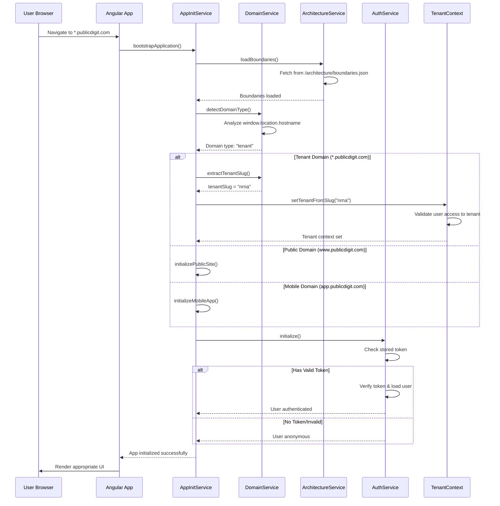
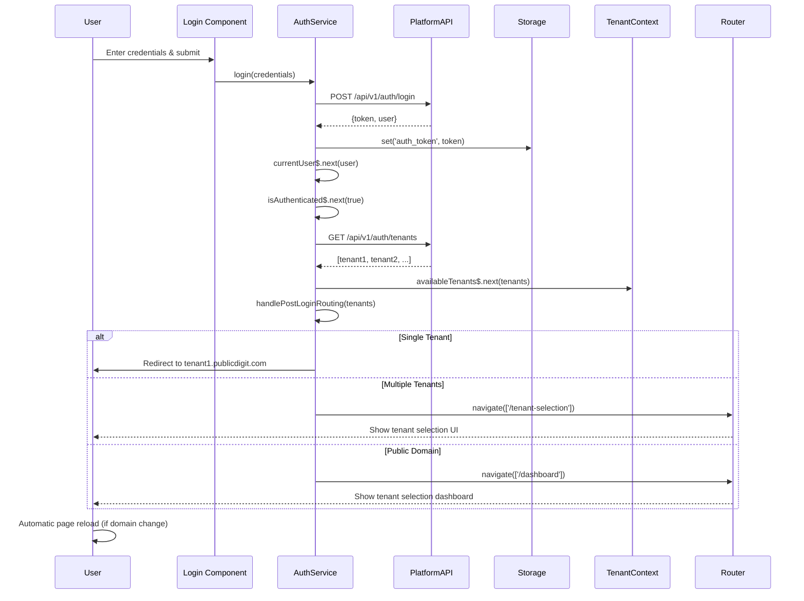
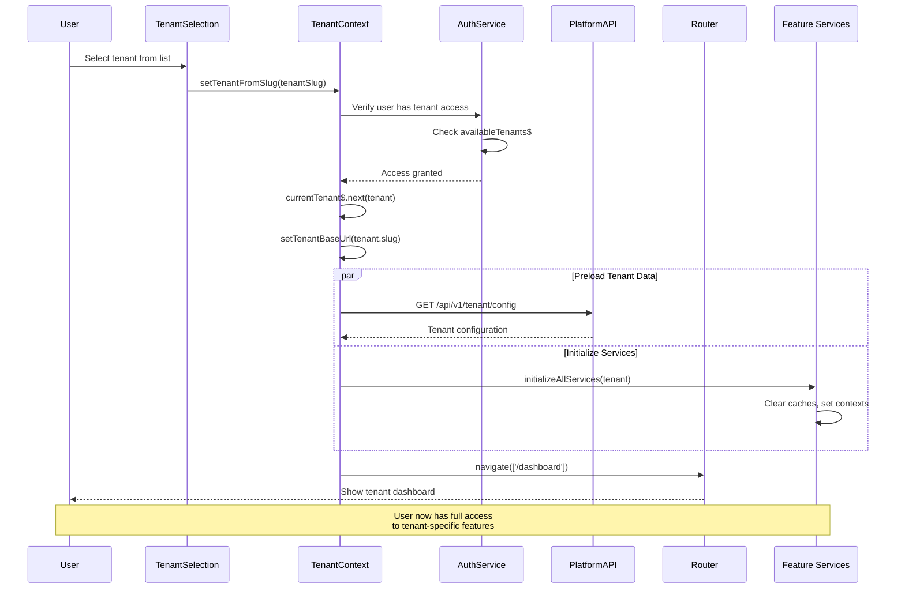
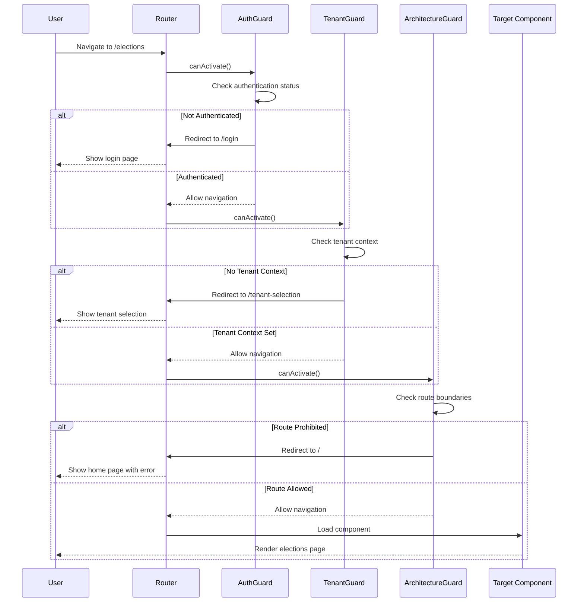
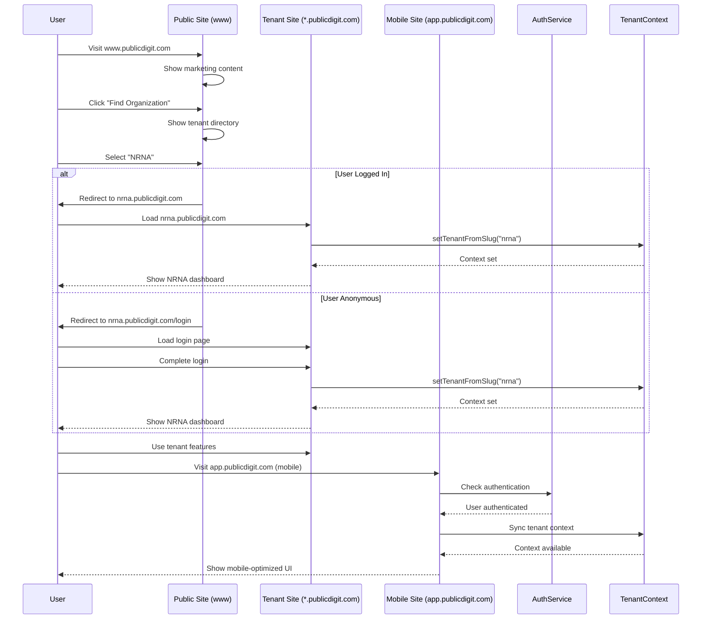
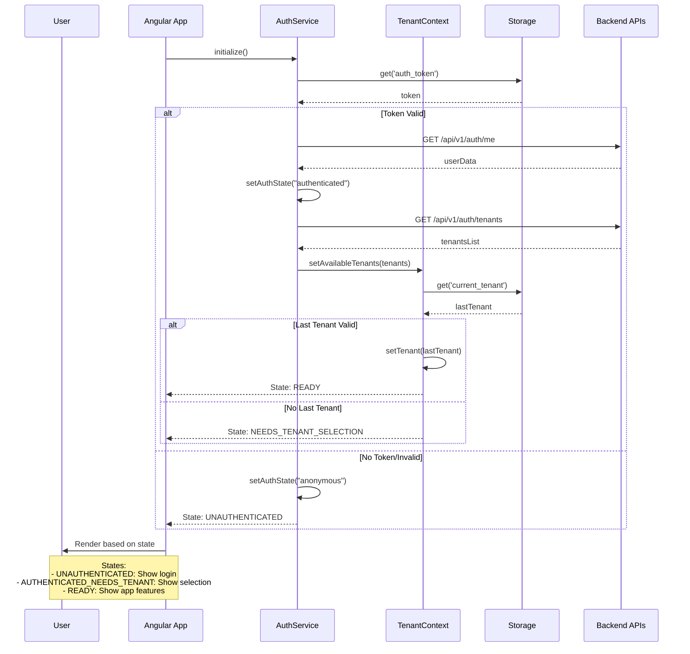
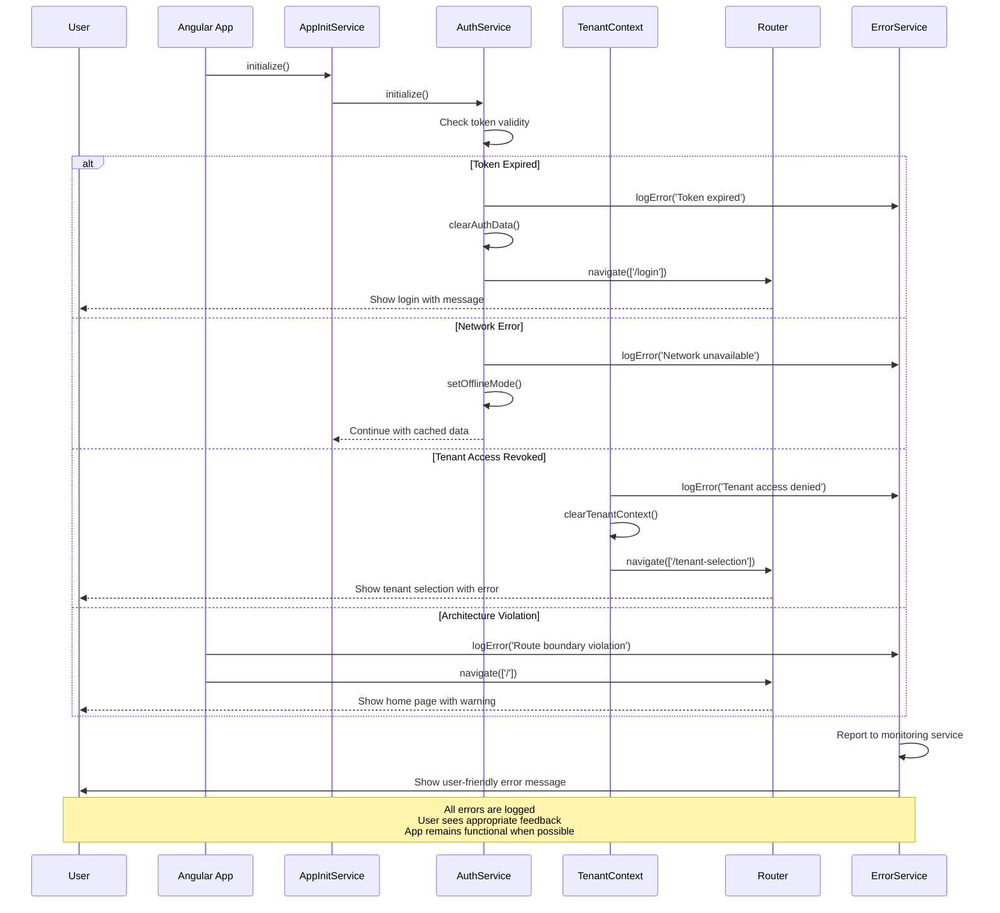

# 🎯 Angular App User Flow - Sequence Diagrams

## 1. 🏠 App Startup & Bootstrap Flow

## 2. 🔐 Authentication & Login Flow

## 3. 🏢 Tenant Context Setup Flow

## 4. 🛡️ Route Guard Protection Flow

## 5. 🌐 Multi-Domain Navigation Flow

## 6. 🔄 State Management Flow

## 7. 🚀 Error Handling & Recovery Flow

These diagrams provide a professional visualization of the key user flows, showing:

1. **Clear sequence** of operations
2. **Error handling** and recovery paths  
3. **State transitions** between different app states
4. **Integration points** between services
5. **User feedback** at each step

The flows ensure a robust, user-friendly experience while maintaining security and architectural boundaries.