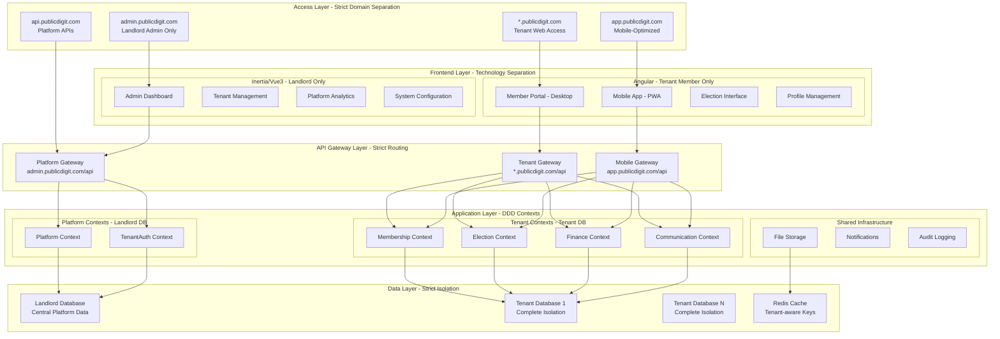
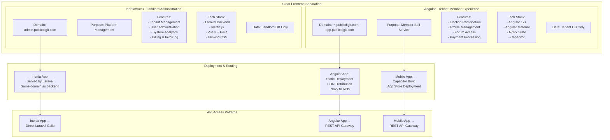
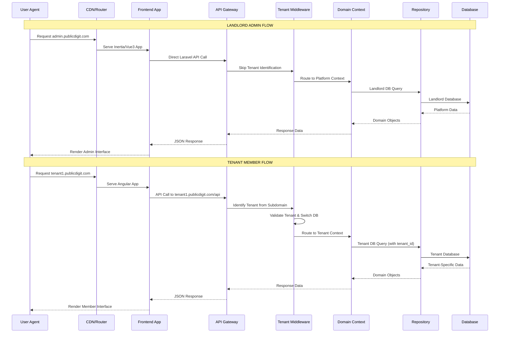

# Robust Multi-Tenant Election Platform Architecture

## 🎯 Critical Analysis & Strategic Improvements

After thorough review, I've identified key vulnerabilities and architectural gaps that need addressing to prevent Claude CLI from breaking settings and ensure long-term robustness.

### **Critical Issues Identified:**
1. **Configuration Fragility** - Settings scattered across multiple files
2. **Architecture Enforcement** - No automated validation of architectural boundaries
3. **Frontend Separation** - Unclear division between Inertia/Vue3 and Angular
4. **Tenant Context Leakage Risk** - Potential cross-tenant data access

---

## 🏗️ Revised Robust Architecture

### **1. Comprehensive System Architecture**



### **2. Frontend Separation Strategy**



### **3. Data Flow & Security Boundaries**



---

## 🔧 Architecture Preservation System

### **1. Centralized Architecture Configuration**

**`architecture/architectural-manifest.json`**
```json
{
  "version": "2.0.0",
  "schema_version": "2025.1",
  "last_validated": "2025-01-14T10:30:00Z",
  "checksum": "a1b2c3d4e5f678901234567890123456",
  
  "domain_strategy": {
    "strict_separation": true,
    "landlord_domains": ["admin.publicdigit.com", "api.publicdigit.com"],
    "tenant_domains": ["*.publicdigit.com", "app.publicdigit.com"],
    "routing_rules": {
      "admin.publicdigit.com": {"frontend": "inertia-vue", "backend": "platform", "database": "landlord"},
      "*.publicdigit.com": {"frontend": "angular", "backend": "tenant", "database": "tenant"},
      "app.publicdigit.com": {"frontend": "angular-mobile", "backend": "tenant", "database": "tenant"}
    }
  },
  
  "frontend_strategy": {
    "inertia_vue": {
      "purpose": "landlord_administration",
      "allowed_domains": ["admin.publicdigit.com"],
      "prohibited_features": ["tenant_member_operations", "voting_interface"],
      "technology": ["laravel", "inertia", "vue3", "pinia"],
      "data_access": ["landlord_db_only"]
    },
    "angular": {
      "purpose": "tenant_member_experience", 
      "allowed_domains": ["*.publicdigit.com", "app.publicdigit.com"],
      "prohibited_features": ["landlord_administration", "tenant_management"],
      "technology": ["angular", "material", "capacitor", "ngrx"],
      "data_access": ["tenant_db_only"]
    }
  },
  
  "ddd_contexts": {
    "platform_contexts": {
      "Platform": {"purpose": "tenant_management", "database": "landlord"},
      "TenantAuth": {"purpose": "cross_tenant_auth", "database": "landlord"}
    },
    "tenant_contexts": {
      "Membership": {"purpose": "member_profiles", "database": "tenant", "allowed_operations": ["read", "update_own"]},
      "Election": {"purpose": "voting_operations", "database": "tenant", "allowed_operations": ["read", "vote"]},
      "Finance": {"purpose": "payment_processing", "database": "tenant", "allowed_operations": ["read_own", "pay"]},
      "Communication": {"purpose": "member_forums", "database": "tenant", "allowed_operations": ["read", "post", "comment"]}
    }
  },
  
  "security_boundaries": {
    "strict_tenant_isolation": true,
    "no_cross_tenant_queries": true,
    "frontend_technology_isolation": true,
    "api_route_separation": true
  }
}
```

### **2. Claude CLI Guardrail System**

**`architecture/claude-guardrails.js`**
```javascript
class ArchitecturalGuardrails {
  constructor() {
    this.manifest = this.loadManifest();
    this.violations = [];
  }

  loadManifest() {
    const manifest = require('./architectural-manifest.json');
    this.validateManifestChecksum(manifest);
    return manifest;
  }

  validateManifestChecksum(manifest) {
    const currentChecksum = this.generateChecksum(manifest);
    if (currentChecksum !== manifest.checksum) {
      throw new Error('ARCHITECTURE MANIFEST TAMPERED: Checksum validation failed');
    }
  }

  preValidationHook(filePath, content) {
    console.log(`🔒 Validating: ${filePath}`);
    
    // Critical: Never allow changes to guardrails themselves
    if (filePath.includes('architecture/') && !filePath.includes('temp/')) {
      throw new Error('CRITICAL: Attempt to modify architecture guardrails detected');
    }

    return this.runValidationSuite(filePath, content);
  }

  runValidationSuite(filePath, content) {
    const validations = [
      this.validateFrontendSeparation.bind(this),
      this.validateTenantIsolation.bind(this),
      this.validateDDDBoundaries.bind(this),
      this.validateAPIRoutes.bind(this),
      this.validateDatabaseAccess.bind(this)
    ];

    for (const validation of validations) {
      const result = validation(filePath, content);
      if (!result.passed) {
        this.violations.push({
          file: filePath,
          rule: result.rule,
          message: result.message,
          critical: result.critical
        });
        
        if (result.critical) {
          throw new Error(`CRITICAL ARCHITECTURE VIOLATION: ${result.message}`);
        }
      }
    }

    return this.violations.length === 0;
  }

  validateFrontendSeparation(filePath, content) {
    const rules = this.manifest.frontend_strategy;
    
    // Inertia/Vue3 should never contain Angular patterns
    if (filePath.includes('inertia') || filePath.includes('vue')) {
      if (content.includes('@angular') || content.includes('ng-container')) {
        return {
          passed: false,
          rule: 'frontend_technology_isolation',
          message: 'Inertia/Vue3 files cannot contain Angular patterns',
          critical: true
        };
      }
      
      // Inertia should only access landlord domains
      if (content.includes('app.publicdigit.com') || content.includes('*.publicdigit.com')) {
        return {
          passed: false,
          rule: 'frontend_domain_isolation',
          message: 'Inertia app cannot access tenant domains',
          critical: true
        };
      }
    }
    
    // Angular should never contain Inertia patterns
    if (filePath.includes('angular') || filePath.includes('apps/mobile')) {
      if (content.includes('Inertia') || content.includes('useForm')) {
        return {
          passed: false,
          rule: 'frontend_technology_isolation', 
          message: 'Angular files cannot contain Inertia patterns',
          critical: true
        };
      }
    }
    
    return { passed: true };
  }

  validateTenantIsolation(filePath, content) {
    // Critical: No cross-tenant data access patterns
    const isolationPatterns = [
      /tenant_id\s*!=\s*[^)]*/i,
      /UNION.*SELECT.*tenant/i,
      /CROSS JOIN.*tenant/i,
      /WHERE.*tenant_id.*IN.*SELECT/i
    ];
    
    for (const pattern of isolationPatterns) {
      if (pattern.test(content)) {
        return {
          passed: false,
          rule: 'strict_tenant_isolation',
          message: 'Cross-tenant data access pattern detected',
          critical: true
        };
      }
    }
    
    return { passed: true };
  }
}

module.exports = ArchitecturalGuardrails;
```

### **3. Automated Architecture Validator**

**`architecture/architecture-validator.php`**
```php
<?php

namespace Architecture;

use Illuminate\Support\Facades\DB;
use Illuminate\Support\Facades\Log;

class ArchitectureValidator
{
    protected array $manifest;
    protected array $violations = [];

    public function __construct()
    {
        $this->loadManifest();
    }

    public function validateRequest($request): bool
    {
        $validations = [
            'validateDomainRouting' => $this->validateDomainRouting($request),
            'validateTenantContext' => $this->validateTenantContext($request),
            'validateFrontendAccess' => $this->validateFrontendAccess($request),
            'validateDataAccess' => $this->validateDataAccess($request),
        ];

        $isValid = !in_array(false, $validations, true);

        if (!$isValid) {
            Log::critical('Architecture violation detected', [
                'violations' => $this->violations,
                'request' => $request->url(),
                'user' => $request->user()?->id,
            ]);
        }

        return $isValid;
    }

    protected function validateDomainRouting($request): bool
    {
        $domain = $request->getHost();
        $path = $request->path();

        // Admin domain should never serve tenant content
        if ($domain === 'admin.publicdigit.com' && str_starts_with($path, 'api/tenant/')) {
            $this->violations[] = "Admin domain accessing tenant API: {$path}";
            return false;
        }

        // Tenant domains should never serve admin content  
        if ($domain !== 'admin.publicdigit.com' && str_starts_with($path, 'api/admin/')) {
            $this->violations[] = "Tenant domain accessing admin API: {$path}";
            return false;
        }

        return true;
    }

    protected function validateTenantContext($request): bool
    {
        $tenant = app('currentTenant');
        $domain = $request->getHost();

        // Critical: Ensure tenant context matches domain
        if ($tenant && !$this->isTenantDomain($domain)) {
            $this->violations[] = "Tenant context active on non-tenant domain: {$domain}";
            return false;
        }

        // Critical: Ensure landlord domain has no tenant context
        if (!$tenant && $this->isTenantDomain($domain)) {
            $this->violations[] = "No tenant context on tenant domain: {$domain}";
            return false;
        }

        return true;
    }

    protected function validateDataAccess($request): bool
    {
        $database = DB::connection()->getDatabaseName();
        $domain = $request->getHost();

        // Landlord domain should use landlord database
        if ($domain === 'admin.publicdigit.com' && !str_contains($database, 'landlord')) {
            $this->violations[] = "Landlord domain using tenant database: {$database}";
            return false;
        }

        // Tenant domains should use tenant databases
        if ($this->isTenantDomain($domain) && str_contains($database, 'landlord')) {
            $this->violations[] = "Tenant domain using landlord database: {$database}";
            return false;
        }

        return true;
    }

    protected function isTenantDomain(string $domain): bool
    {
        return $domain !== 'admin.publicdigit.com' && $domain !== 'api.publicdigit.com';
    }
}
```

### **4. Frontend Separation Enforcement**

**`architecture/frontend-boundaries.json`**
```json
{
  "inertia_vue_boundaries": {
    "allowed_routes": [
      "/admin/*",
      "/api/admin/*",
      "/landlord/*"
    ],
    "prohibited_routes": [
      "/app/*",
      "/api/tenant/*",
      "/elections/*",
      "/profile/*"
    ],
    "allowed_api_calls": [
      "GET /api/admin/tenants",
      "POST /api/admin/tenants",
      "GET /api/admin/users",
      "GET /api/admin/analytics"
    ],
    "prohibited_api_calls": [
      "GET /api/tenant/elections",
      "POST /api/tenant/vote",
      "GET /api/tenant/profile",
      "POST /api/tenant/payment"
    ]
  },
  
  "angular_boundaries": {
    "allowed_routes": [
      "/elections/*",
      "/profile/*",
      "/forum/*",
      "/payments/*"
    ],
    "prohibited_routes": [
      "/admin/*",
      "/api/admin/*",
      "/landlord/*"
    ],
    "allowed_api_calls": [
      "GET /api/tenant/elections",
      "POST /api/tenant/vote",
      "GET /api/tenant/profile",
      "POST /api/tenant/payment"
    ],
    "prohibited_api_calls": [
      "GET /api/admin/tenants",
      "POST /api/admin/tenants",
      "GET /api/admin/users"
    ]
  }
}
```

---

## 🎯 Frontend Separation Implementation Plan

### **1. Clear Technology Boundaries**

#### **Inertia/Vue3 - Landlord Administration Only**
```javascript
// packages/laravel-backend/resources/js/app.js - INERTIA APP
import { createApp, h } from 'vue'
import { createInertiaApp } from '@inertiajs/vue3'

// ONLY landlord admin routes
createInertiaApp({
  resolve: name => {
    const pages = import.meta.glob('./Pages/Admin/**/*.vue', { eager: true })
    return pages[`./Pages/Admin/${name}.vue`]
  },
  setup({ el, App, props, plugin }) {
    createApp({ render: () => h(App, props) })
      .use(plugin)
      .mount(el)
  },
})

// Route protection - redirect if accessed from tenant domain
if (window.location.hostname !== 'admin.publicdigit.com') {
  window.location.href = 'https://admin.publicdigit.com'
}
```

#### **Angular - Tenant Member Experience Only**
```typescript
// apps/mobile/src/app/app.config.ts - ANGULAR APP
export const appConfig: ApplicationConfig = {
  providers: [
    provideRouter(routes),
    provideHttpClient(withInterceptors([authInterceptor, tenantInterceptor])),
    { provide: 'BASE_URL', useFactory: getBaseUrl }
  ]
};

// Domain-based configuration
function getBaseUrl(): string {
  const hostname = window.location.hostname;
  
  if (hostname === 'app.publicdigit.com') {
    return 'https://app.publicdigit.com/api/v1';
  }
  
  // Extract tenant from subdomain
  const tenantSlug = hostname.split('.')[0];
  return `https://${tenantSlug}.publicdigit.com/api/v1`;
}
```

### **2. Deployment & Routing Strategy**

#### **Nginx Configuration**
```nginx
# Landlord Admin - Inertia/Vue3
server {
    server_name admin.publicdigit.com;
    root /var/www/laravel-backend/public;
    
    # Only serve admin routes
    location /admin {
        try_files $uri $uri/ /index.php?$query_string;
    }
    
    location /api/admin {
        try_files $uri $uri/ /index.php?$query_string;
    }
    
    # Redirect tenant routes to Angular app
    location /elections {
        return 301 https://$tenant_slug.publicdigit.com$request_uri;
    }
}

# Tenant Web - Angular App
server {
    server_name ~^(?<tenant_slug>.+)\.publicdigit\.com$;
    root /var/www/angular-app/dist;
    
    # Serve Angular app
    location / {
        try_files $uri $uri/ /index.html;
    }
    
    # Proxy API calls to Laravel
    location /api/v1 {
        proxy_pass http://laravel-backend;
        proxy_set_header X-Tenant $tenant_slug;
    }
}

# Mobile App - Angular PWA
server {
    server_name app.publicdigit.com;
    root /var/www/angular-app/dist;
    
    location / {
        try_files $uri $uri/ /index.html;
    }
    
    location /api/v1 {
        proxy_pass http://laravel-backend;
        proxy_set_header X-Tenant-Identifier $http_x_tenant_identifier;
    }
}
```

### **3. API Gateway Separation**

```php
// packages/laravel-backend/routes/admin.php - LANDLORD ONLY
Route::domain('admin.publicdigit.com')->group(function () {
    Route::prefix('api/admin')->group(function () {
        // Landlord admin APIs only
        Route::apiResource('tenants', AdminTenantController::class);
        Route::apiResource('users', AdminUserController::class);
        Route::get('analytics', [AdminAnalyticsController::class, 'index']);
    });
    
    // Inertia admin routes
    Route::get('/admin/{any}', function () {
        return inertia('Admin/Dashboard');
    })->where('any', '.*');
});

// packages/laravel-backend/routes/tenant.php - TENANT ONLY  
Route::domain('{tenant}.publicdigit.com')->group(function () {
    Route::prefix('api/v1')->group(function () {
        // Tenant member APIs only
        Route::apiResource('elections', ElectionController::class);
        Route::apiResource('profile', ProfileController::class);
        Route::apiResource('forum', ForumController::class);
    });
});
```

---

## 🔒 Claude CLI Integration & Safety

### **1. Safe Development Workflow**

**`architecture/claude-development-guide.md`**
```markdown
# Claude CLI Development Safety Protocol

## 🚨 CRITICAL RULES - NEVER BREAK

1. **NEVER** modify files in `/architecture/` directory
2. **NEVER** mix frontend technologies (Inertia vs Angular)
3. **NEVER** allow cross-tenant data access patterns
4. **NEVER** change domain routing strategies
5. **ALWAYS** run architecture validation before committing

## ✅ Safe Development Patterns

### Frontend Development
```bash
# Angular development (tenant features)
cd apps/mobile
nx generate component election-list --project=mobile

# Inertia development (admin features)  
cd packages/laravel-backend
php artisan make:inertia Admin/UserManagement
```

### Backend Development
```bash
# Platform context (landlord)
php artisan make:controller Admin/TenantController --api

# Tenant context (member features)
php artisan make:controller Api/v1/ElectionController --api
```

## 🔍 Validation Commands
```bash
# Always run before committing
php artisan architecture:validate
npm run architecture:check

# Fix architecture violations
php artisan architecture:fix --dry-run
```
```

### **2. Automated Safety Checks**

**`package.json` - Angular App**
```json
{
  "scripts": {
    "architecture:check": "node architecture/validate-angular.js",
    "precommit": "npm run architecture:check && npm run test",
    "prepush": "npm run architecture:validate-strict"
  }
}
```

**`composer.json` - Laravel Backend**
```json
{
  "scripts": {
    "post-update-cmd": [
      "Illuminate\\Foundation\\ComposerScripts::postUpdate",
      "@php artisan architecture:validate"
    ],
    "pre-commit": [
      "@php artisan architecture:validate",
      "@php artisan test"
    ]
  }
}
```

---

## 🎯 Implementation Roadmap

### **Phase 1: Architecture Hardening** (Week 1-2)
- [ ] Implement architecture validation system
- [ ] Set up Claude CLI guardrails
- [ ] Deploy domain routing configuration
- [ ] Establish frontend separation boundaries

### **Phase 2: Frontend Separation** (Week 3-4)  
- [ ] Deploy Angular app to tenant domains
- [ ] Configure Inertia app for admin domain only
- [ ] Implement API gateway separation
- [ ] Set up deployment pipelines

### **Phase 3: Security Enforcement** (Week 5-6)
- [ ] Implement tenant isolation validation
- [ ] Set up automated security scanning
- [ ] Deploy monitoring and alerting
- [ ] Conduct penetration testing

### **Phase 4: Optimization** (Week 7-8)
- [ ] Performance optimization
- [ ] Caching strategy implementation
- [ ] Load testing
- [ ] Documentation completion

This robust architecture ensures that Claude CLI cannot accidentally break critical settings while maintaining clear separation between the Inertia/Vue3 landlord administration and Angular tenant member experiences. The comprehensive guardrail system prevents architectural violations and maintains system integrity.
Theory : 
## 🏢 Multi-Tenant Architectural Strategy Review and Proposal

This document formalizes the current state, technical stack, and proposes a strategic architectural and routing plan for the multi-tenant application suite, built on an API-first and Domain-Driven Design (DDD) approach.

---

### 1. Current State and Technical Stack

| Category | Component | Details |
| :--- | :--- | :--- |
| **Workspace** | Monorepo | Utilizing **Nx Workspace** for project organization. |
| **Backend** | Framework/Tenancy | **Laravel 12** with **Spatie Multi-Tenancy Package**. |
| **Desktop Frontend** | Stack | **Inertia.js** (Adapter) with **Vue 3**. |
| **Mobile Frontend** | Location | **Angular** application located in `apps/mobile`. |
| **Core Principle** | Methodology | **API-First Strategy**, **Strict DDD**, and **TDD-First Approach**. |
| **Domain Name** | Base | `www.publicdigit.com` |

---

### 2. Existing Backend Contexts (Authentication & Administration)

The Laravel application currently manages authentication and administration across two main contexts:

* **Landlord (Platform) Context (Core Laravel/Platform Context):**
    * **Functionality:** Handles **Landlord Login** and **Administrator Management**.
    * **Access:** Landlord/Service Provider can manage all application aspects.
    * **Frontend:** Accessed via the Desktop (Inertia/Vue 3) version.
* **Tenant Administration Context (TenantAuth Context):**
    * **Functionality:** Handles **Tenancy Administration** and management of the **Tenant Database**.

---

### 3. Required Application Contexts (Tenant Membership & Feature Focus)

The primary focus for future development and the Angular application is the Tenant-specific feature set, limited to the following **Domain Contexts**:

1.  **Membership Context:** Managing member profiles, roles, and related data.
2.  **Finance Context:** Handling tenant-specific financial operations and records.
3.  **Election Context:** Managing voting and election processes within the tenancy.

### 4. Proposed Routing and Application Availability Strategy

A clear routing strategy is essential to segment the landlord/service provider tools from the tenant-facing applications.

| User Type / Context | Application Type | Proposed Domain/Subdomain | Frontend Stack |
| :--- | :--- | :--- | :--- |
| **Landlord/Service Provider** (Admin/Platform Context) | Desktop/Management | `www.publicdigit.com` | Inertia.js / Vue 3 |
| **Tenant Member** (Membership, Finance, Election Contexts) | Desktop/Web Access | `www.publicdigit.com` | Angular |
| **Tenant Member** (Membership, Finance, Election Contexts) | Mobile App | `app.publicdigit.com` | Angular (`apps/mobile`) |

#### **Routing Decisions:**

* **Landlord/Service Provider Access:** The primary administrative control panel should remain at **`www.publicdigit.com`**, utilizing the existing Inertia/Vue 3 frontend for the rich administrative interface.
* **Tenant Mobile App Access:** The dedicated mobile experience should be made available via **`app.publicdigit.com`**. This aligns with common architectural patterns for mobile app interfaces.
* **Tenant Desktop/Web Access:** **`www.publicdigit.com`** should be the primary entry point for *all* tenant members (both desktop and mobile users). This is crucial for a unified brand presence.

    * **Recommendation:** Upon a Tenant Member logging in via `www.publicdigit.com`, they should be directed to the **Angular application** for the Membership, Finance, and Election contexts. The Inertia/Vue 3 application should be reserved solely for Landlord/Service Provider access.

---

### 5. Angular Application Scope and Development

#### A. Unified Angular Development

**Can Angular project develop both desktop and Mobile app of Membership, Election, Finance Contexts?**
Yes, the Angular project can and should develop both the desktop (web) and mobile applications for the specific tenant contexts (Membership, Finance, Election).

* **Requirement:** The Angular project must adopt a **desktop/mobile friendly (responsive) development approach**. This likely involves utilizing a framework like Angular Material or a similar responsive library to ensure a seamless experience on both large screens (via `www.publicdigit.com`) and small screens (via `app.publicdigit.com`).

#### B. Membership Context Enhancement

* **Profile Management:** We require the implementation of a dedicated **Profile Management** feature within the **Membership Context** to allow each tenant member to view and manage their personal details.

#### C. New Discussion Forum Context

To facilitate internal communication within each tenancy:

* **Requirement:** Implement a **Discussion Forum** feature accessible only to members of the current tenancy.
* **Proposed Context Name:** **`Communication Context`** or **`Forum Context`**. This new context should strictly adhere to DDD principles, ensuring it only communicates with the necessary member and tenancy data.
