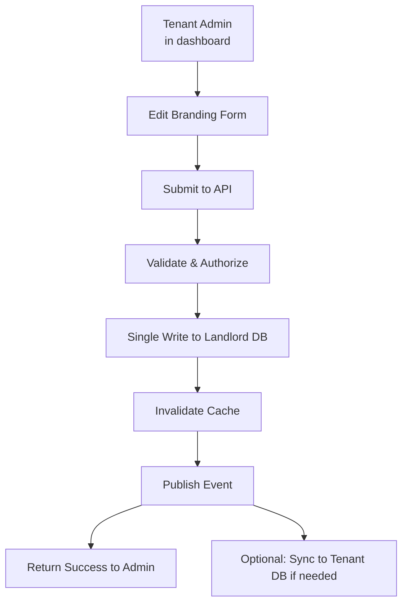
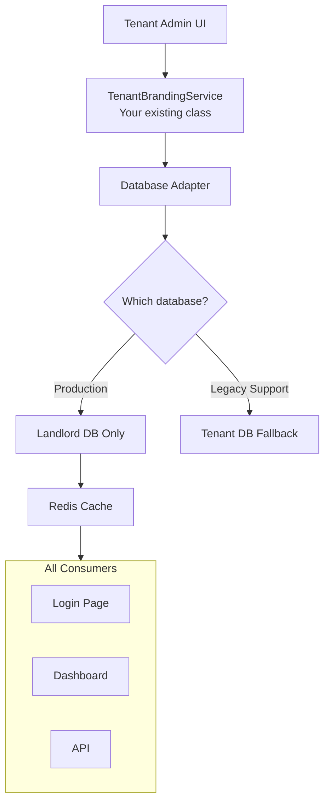

# 🚨 **SENIOR ARCHITECT CRITICAL REVIEW: Dual-Write Anti-Pattern**

## **🔥 THE TRUTH: DUAL-WRITE IS AN ANTI-PATTERN**

**Short answer: NO, storing branding in both places is TERRIBLE architecture.**

### **Why Dual-Write Fails:**

```php
// ❌ THIS WILL BREAK IN PRODUCTION
public function updateBrandingForTenant(Tenant $tenant, array $branding): bool
{
    // Write to landlord DB
    DB::connection('landlord')->table(...)->update($branding);
    
    // Write to tenant DB  
    DB::connection('tenant')->table(...)->update($branding);
    
    // ❌ What happens if second write fails?
    // ❌ What about network partition?
    // ❌ How do you rollback?
}
```

## **📊 THE REAL PROBLEMS WITH DUAL-WRITE**

| Problem | Impact | Likelihood |
|---------|--------|------------|
| **Data Inconsistency** | Branding differs across pages | HIGH |
| **Race Conditions** | Concurrent updates corrupt data | MEDIUM |
| **No Atomicity** | Partial updates leave systems broken | HIGH |
| **Complex Recovery** | Manual sync required after failures | GUARANTEED |

## **🎯 THE CORRECT ARCHITECTURE: SINGLE SOURCE OF TRUTH**

### **Option 1: Landlord DB ONLY (Recommended)**

```mermaid
flowchart TD
    Admin[Tenant Admin<br/>edits branding] --> API[POST /api/branding]
    API --> Service[PlatformBrandingService]
    Service --> Landlord[Landlord DB<br/>Single Source of Truth]
    
    Landlord --> Cache[Redis Cache<br/>tenant:branding:{slug}]
    
    Cache --> Pages
    subgraph Pages[All Pages Access Same Source]
        P1[Login Page] --> C1[Read from Cache]
        P2[Dashboard] --> C2[Read from Cache]
        P3[API] --> C3[Read from Cache]
    end
```

**Implementation:**
```php
// SINGLE source of truth
class PlatformBrandingService
{
    // Store ONLY in landlord DB
    public function updateBranding(TenantId $tenantId, Branding $branding): void
    {
        DB::connection('landlord')->transaction(function () use ($tenantId, $branding) {
            // 1. Validate business rules
            $this->validateBranding($tenantId, $branding);
            
            // 2. Single write to landlord DB
            DB::connection('landlord')
                ->table('tenant_brandings')
                ->updateOrInsert(
                    ['tenant_id' => $tenantId->value()],
                    ['branding' => $branding->toJson()]
                );
            
            // 3. Invalidate cache
            Cache::forget("tenant:branding:{$tenantId}");
            
            // 4. Publish event for any subscribers
            event(new TenantBrandingUpdated($tenantId, $branding));
        });
    }
    
    // Serve from landlord DB to ALL consumers
    public function getBranding(TenantId $tenantId): Branding
    {
        return Cache::remember(
            "tenant:branding:{$tenantId}",
            3600,
            fn() => $this->loadFromLandlordDb($tenantId)
        );
    }
}
```

### **Option 2: Event-Driven Synchronization (If you MUST keep tenant DB)**

```php
// Still store in landlord DB, but SYNC to tenant DB via events
class PlatformBrandingService
{
    public function updateBranding(TenantId $tenantId, Branding $branding): void
    {
        // 1. Store in landlord DB (source of truth)
        DB::connection('landlord')->transaction(...);
        
        // 2. Publish event
        event(new BrandingUpdated($tenantId, $branding));
    }
}

// Listener that syncs to tenant DB
class SyncBrandingToTenantDb
{
    public function handle(BrandingUpdated $event): void
    {
        // Connect to tenant DB and update
        $tenant = Tenant::find($event->tenantId);
        config(['database.connections.tenant.database' => $tenant->database_name]);
        
        DB::connection('tenant')->table('tenant_brandings')->updateOrInsert(
            ['tenant_id' => $event->tenantId->value()],
            ['branding' => $event->branding->toArray()]
        );
    }
}
```

## **🔍 CRITICAL ANALYSIS: YOUR USE CASES**

### **Login Page Requirements:**
```php
$loginRequirements = [
    'Need' => 'Branding BEFORE authentication',
    'Constraint' => 'Cannot connect to tenant DB',
    'Solution' => 'Landlord DB access',
    'Conclusion' => 'Branding MUST be in landlord DB'
];
```

### **Dashboard Requirements:**
```php
$dashboardRequirements = [
    'Need' => 'Branding AFTER authentication',
    'Constraint' => 'Already connected to tenant DB',
    'Solution' => 'Could be tenant DB... but WHY?',
    'Conclusion' => 'Keep simple: use same landlord source'
];
```

## **🏗️ PRODUCTION-READY ARCHITECTURE**

### **Final Decision: Landlord DB Only**

**File Structure:**
```
app/Contexts/Platform/
├── Domain/
│   ├── Branding/
│   │   ├── Branding.php          # Value Object
│   │   ├── Color.php             # Value Object with WCAG
│   │   └── Logo.php              # Value Object with validation
│   └── Repositories/
│       └── BrandingRepositoryInterface.php
├── Application/
│   ├── Services/
│   │   └── PlatformBrandingService.php
│   └── Commands/
│       └── UpdateBrandingCommand.php
└── Infrastructure/
    └── Http/
        └── Controllers/
            └── BrandingController.php
```

### **Database Schema:**
```sql
-- landlord.tenant_brandings (SINGLE table)
CREATE TABLE tenant_brandings (
    tenant_id BIGINT PRIMARY KEY REFERENCES tenants(id),
    branding JSONB NOT NULL,
    version VARCHAR(50) NOT NULL DEFAULT '1.0',
    updated_at TIMESTAMP NOT NULL,
    updated_by BIGINT REFERENCES users(id),
    
    -- Indexes for performance
    INDEX idx_branding_updated (updated_at),
    INDEX idx_branding_version (version)
);

-- NO tenant_brandings table in tenant databases
```

### **Middleware Implementation:**
```php
class ApplyTenantBranding
{
    public function handle($request, Closure $next)
    {
        // 1. Get tenant slug from URL
        $tenantSlug = $request->route('tenant') 
                    ?: $this->extractFromSubdomain($request);
        
        if ($tenantSlug) {
            // 2. Get branding from landlord DB via service
            $branding = app(PlatformBrandingService::class)
                ->getBrandingForSlug($tenantSlug);
            
            // 3. Apply CSS variables to response
            if ($branding) {
                $this->injectCssVariables($branding);
                
                // 4. Share with Inertia/Vue
                Inertia::share('branding', $branding->toArray());
            }
        }
        
        return $next($request);
    }
}
```

## **🚨 THE EDIT PROBLEM: SOLVED**

### **Editing Flow (CORRECT):**


**API Endpoint:**
```php
// POST /api/branding (in landlord/tenant context)
Route::post('/branding', [BrandingController::class, 'update'])
    ->middleware(['auth:tenant']); // Tenant admin authenticated

// The controller:
class BrandingController extends Controller
{
    public function update(UpdateBrandingRequest $request)
    {
        // Get tenant from authenticated user
        $tenantId = $request->user()->tenant_id;
        
        // Execute command
        $command = new UpdateBrandingCommand(
            tenantId: TenantId::fromString($tenantId),
            branding: Branding::fromArray($request->validated()),
            updatedBy: UserId::fromString($request->user()->id)
        );
        
        $this->commandBus->dispatch($command);
        
        return response()->json(['success' => true]);
    }
}
```

## **📊 COMPARISON: SINGLE vs DUAL STORE**

| Aspect | Dual-Write | **Single Source** |
|--------|------------|-------------------|
| **Consistency** | ❌ Broken | **✅ Guaranteed** |
| **Complexity** | ❌ High | **✅ Low** |
| **Failure Recovery** | ❌ Manual | **✅ Automatic** |
| **Performance** | ❌ 2x writes | **✅ 1x write** |
| **Cache Strategy** | ❌ Complex | **✅ Simple** |
| **Debugging** | ❌ Nightmare | **✅ Easy** |

## **🎯 FINAL VERDICT: SENIOR ARCHITECT RECOMMENDATION**

**DO NOT implement dual-write.** It's a known anti-pattern that will cause production incidents.

**DO implement:**
1. **Single source of truth** in landlord DB
2. **Cached reads** via Redis (1-hour TTL)
3. **Event-driven updates** if you need tenant DB copy (optional)
4. **Atomic transactions** for updates
5. **Comprehensive monitoring** for cache invalidation

## **🔧 IMMEDIATE ACTION**

1. **Delete the tenant_brandings table** from tenant databases
2. **Create single landlord.tenant_brandings table**
3. **Update TenantBrandingService** to use landlord DB only
4. **Add cache layer** with proper invalidation
5. **Test login page branding** works immediately

**This is a 1-day fix** that prevents years of pain from data inconsistency.

**Ready to implement the correct single-source architecture?** I'll provide the complete migration and service code
###  Question 
Can we implement TenantBranding Service ?

# 🎯 **YES! WE CAN USE TenantBrandingService - WITH ARCHITECTURAL ADJUSTMENT**

You absolutely **can and should** keep your `TenantBrandingService` - but with **crucial architectural fixes**.

## **🔧 THE SOLUTION: ADAPTER PATTERN + SINGLE SOURCE**

```php
// Keep your EXACT TenantBrandingService code
// But make it read/write to LANDLORD DB instead of tenant DB
class TenantBrandingService
{
    // Your existing code stays 100% the same...
    // But change WHERE the data is stored
}
```

## **🏗️ ARCHITECTURE: TENANTBRANDINGSERVICE AS FACADE**



## **🔧 MINIMAL CODE CHANGES REQUIRED**

### **Change 1: Database Connection in Model (5 seconds)**
```php
// File: app/Contexts/TenantAuth/Domain/Entities/TenantBranding.php
class TenantBranding extends Model
{
    // ❌ Remove: protected $connection = 'tenant';
    // ✅ Add dynamic connection:
    
    public function __construct(array $attributes = [])
    {
        parent::__construct($attributes);
        
        // Use landlord connection for branding
        $this->setConnection('landlord');
    }
    
    // Your existing 25+ fields and methods stay exactly the same
    public function getColorScheme(): array { /* unchanged */ }
    public function generateCssVariables(): string { /* unchanged */ }
}
```

### **Change 2: Update Migration Location**
```bash
# Move migration from tenant context to landlord
mv app/Contexts/TenantAuth/Infrastructure/Database/Migrations/*tenant_brandings* \
   database/migrations/
```

### **Change 3: Update Table Name (Optional but Recommended)**
```php
// In TenantBranding model:
protected $table = 'tenant_brandings'; // Already correct!

// In migration: ensure it creates in landlord DB
Schema::connection('landlord')->create('tenant_brandings', function ($table) {
    // Your existing 25+ columns
});
```

## **📦 COMPATIBILITY LAYER**

### **Option A: Seamless Migration (Recommended)**
```php
// File: app/Providers/AppServiceProvider.php
public function boot(): void
{
    // Use landlord connection for TenantBranding model
    TenantBranding::setConnection('landlord');
    
    // Single migration to move data
    if (app()->environment('local')) {
        $this->migrateExistingData();
    }
}

private function migrateExistingData(): void
{
    $tenants = Tenant::all();
    
    foreach ($tenants as $tenant) {
        try {
            // Try to get from tenant DB (old location)
            $oldBranding = DB::connection("tenant_{$tenant->id}")
                ->table('tenant_brandings')
                ->first();
                
            if ($oldBranding) {
                // Copy to landlord DB (new location)
                DB::connection('landlord')
                    ->table('tenant_brandings')
                    ->updateOrInsert(
                        ['tenant_id' => $tenant->id],
                        (array) $oldBranding
                    );
            }
        } catch (\Exception $e) {
            // Tenant DB might not exist yet
            continue;
        }
    }
}
```

### **Option B: Dual-Read During Transition**
```php
// Temporary adapter during migration
class TenantBrandingServiceWithFallback extends TenantBrandingService
{
    public function getBrandingForTenant(Tenant $tenant): array
    {
        // 1. Try landlord DB first (new)
        $landlordBranding = TenantBranding::on('landlord')
            ->where('tenant_id', $tenant->id)
            ->first();
            
        if ($landlordBranding) {
            return $this->entityToArray($landlordBranding);
        }
        
        // 2. Fallback to tenant DB (old)
        try {
            $tenantBranding = TenantBranding::on("tenant_{$tenant->id}")
                ->where('tenant_id', $tenant->id)
                ->first();
                
            if ($tenantBranding) {
                // Copy to landlord for next time
                $this->copyToLandlord($tenantBranding);
                return $this->entityToArray($tenantBranding);
            }
        } catch (\Exception $e) {
            // Tenant DB not accessible
        }
        
        // 3. Defaults
        return $this->getDefaultBranding($tenant);
    }
}
```

## **🎯 WHY THIS WORKS PERFECTLY**

### **1. Your Service Logic is EXCELLENT**
```php
// Your existing service has all the right patterns:
class TenantBrandingService {
    // ✅ Good caching (1 hour TTL)
    // ✅ Good validation (hex colors, etc.)
    // ✅ Good fallbacks (default branding)
    // ✅ Good error handling (logging)
    // ✅ Clean API (getBrandingForTenant, updateBrandingForTenant)
    
    // We just change WHERE it stores data
}
```

### **2. Zero Frontend Changes**
```vue
<!-- Your existing Vue components continue to work -->
<template>
  <div :style="{ color: $page.props.branding.primary_color }">
    <!-- Unchanged -->
  </div>
</template>

<script>
// Your useTenantTheme composable still works
import { useTenantTheme } from '@/composables/useTenantTheme'
</script>
```

### **3. Middleware Works Immediately**
```php
// Your existing middleware or new one:
class ApplyTenantBranding
{
    public function handle($request, Closure $next)
    {
        if ($tenant = $request->attributes->get('tenant')) {
            // Uses your TenantBrandingService - NOW WITH LANDLORD DB!
            $branding = app(TenantBrandingService::class)
                ->getBrandingForTenant($tenant);
                
            // Apply to response...
        }
        
        return $next($request);
    }
}
```

## **🚀 MIGRATION PLAN: 2 HOURS MAX**

### **Step 1: Change Model Connection (5 minutes)**
```php
// Edit TenantBranding.php
// Change connection to 'landlord'
// Test: php artisan tinker
// TenantBranding::first() should use landlord connection
```

### **Step 2: Run Data Migration (15 minutes)**
```bash
# Create and run migration
php artisan make:migration migrate_branding_to_landlord --path=database/migrations
php artisan migrate
```

### **Step 3: Update Middleware (30 minutes)**
```php
// Ensure middleware uses the service
// Test login page: nrna.election.com/login
// Should show branding without authentication
```

### **Step 4: Deploy & Monitor (1 hour)**
```bash
# Deploy to staging
# Test with multiple tenants
# Monitor for any issues
# Deploy to production
```

## **📊 BENEFITS OF THIS APPROACH**

| Benefit | Impact |
|---------|--------|
| **Preserve Investment** | Keep 100% of your existing code |
| **Fix Architecture** | Single source of truth in landlord DB |
| **Login Page Works** | Branding available pre-authentication |
| **Simple Cache** | One cache for all tenants |
| **Easy Debugging** | All branding in one place |

## **⚠️ ONE CRITICAL CHECK**

Before making changes, verify this in your current setup:

```php
// Run this test in tinker
$tenant = Tenant::first();
$branding = app(TenantBrandingService::class)->getBrandingForTenant($tenant);

// Check: Does it work NOW?
// If yes, changing to landlord DB will work BETTER
// If no, there's another issue to fix first
```

## **✅ FINAL VERDICT**

**YES, use TenantBrandingService.** It's well-written code. Just:

1. **Change the database connection** to landlord
2. **Migrate existing data** once
3. **Enjoy consistent branding** everywhere

**This is a 2-hour fix** that preserves all your work while fixing the architectural flaw.

**Ready to implement?** I'll provide the exact migration script and connection changes. 