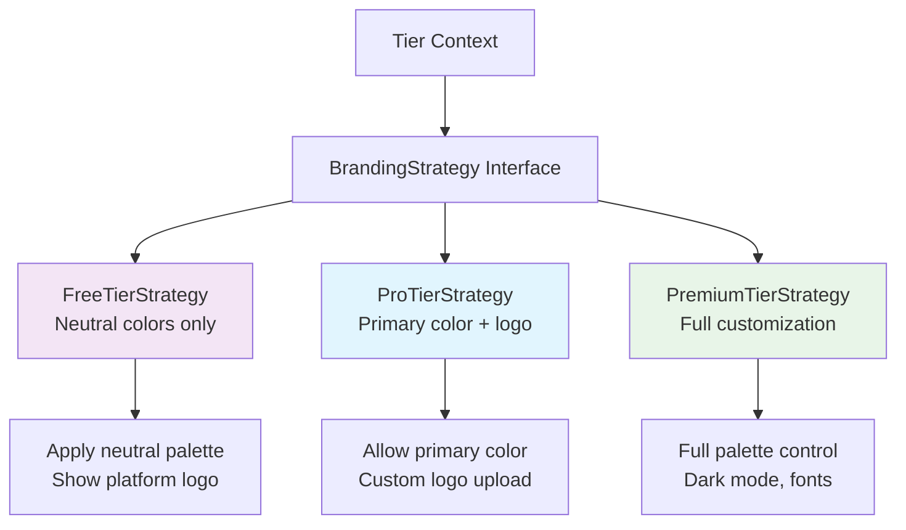
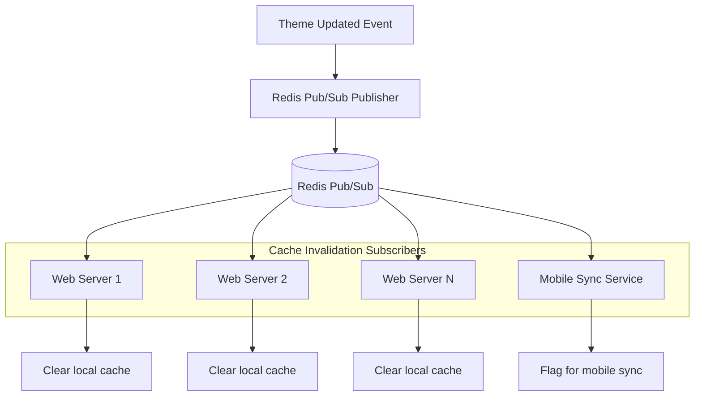
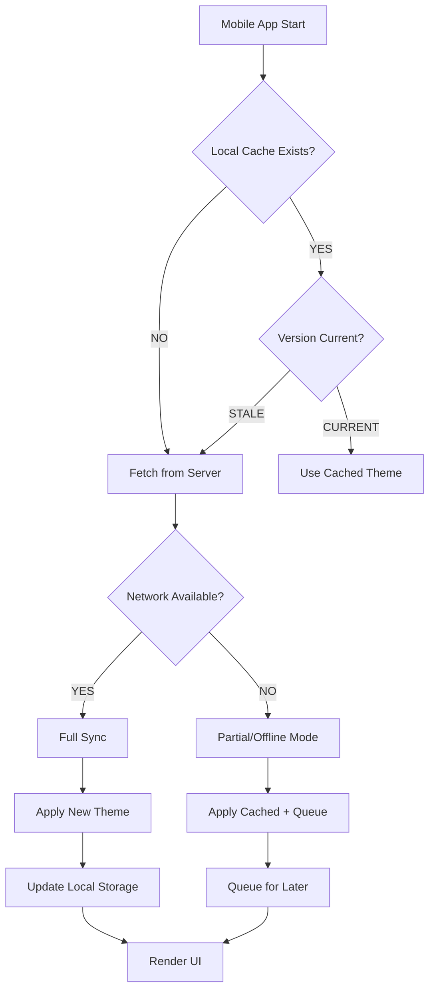
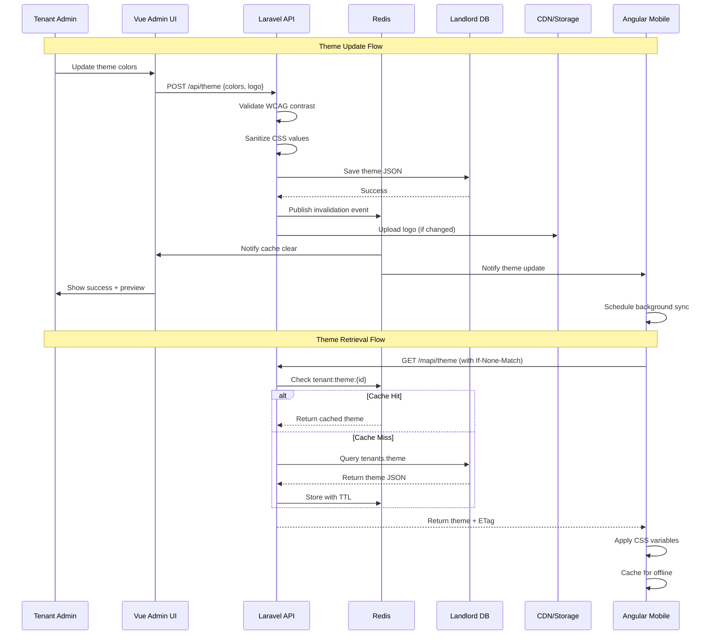
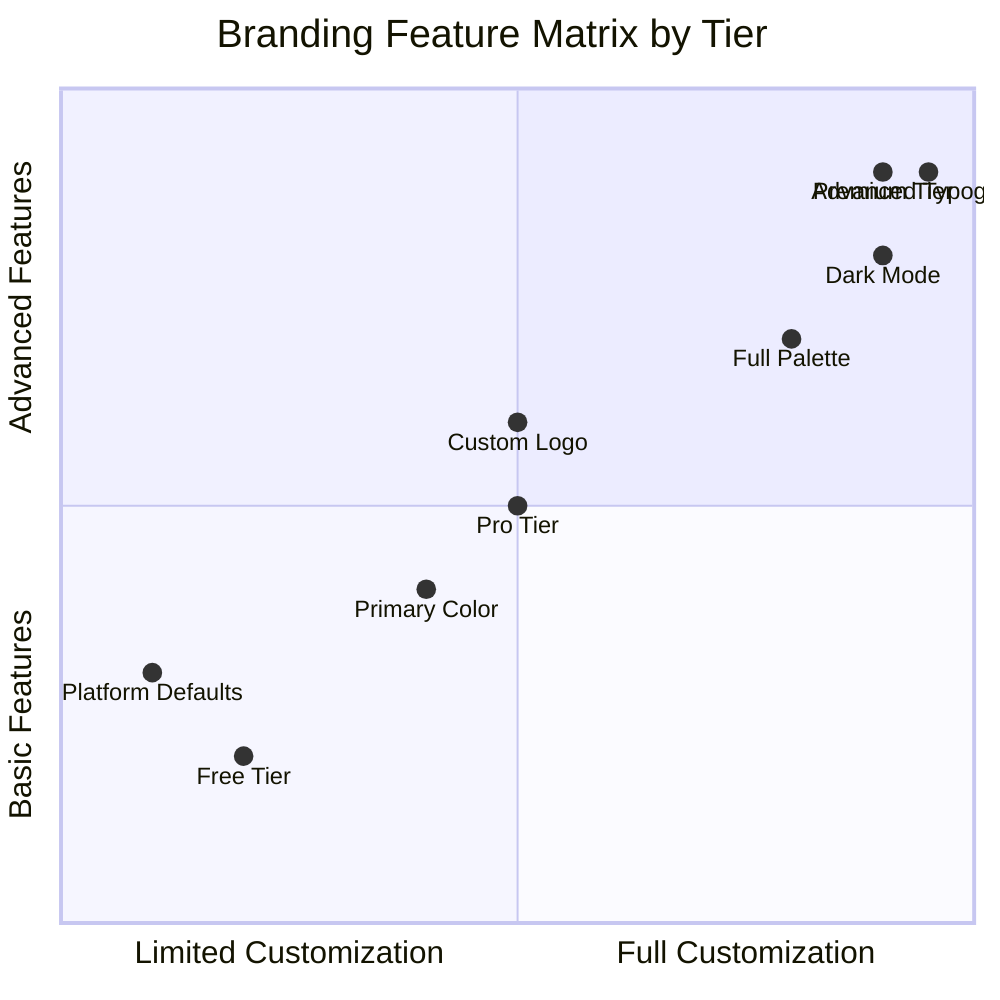

# 🏛️ **FINAL ARCHITECTURE: Multi-Tenant Branding System**

## **CORE ARCHITECTURAL DECISION**

**Branding Configuration Resides in Landlord Database Only** - Tenant identification (URL/subdomain resolution) must happen BEFORE accessing tenant-specific databases. Branding is platform configuration, not business data.

---

## **SYSTEM ARCHITECTURE OVERVIEW**

```mermaid
config:
  layout: elk
  theme: neo
---
flowchart TB
 subgraph PLATFORM_LAYER["Platform Infrastructure"]
        LANDLORD_DB["(Landlord DB<br>tenants.theme JSONB)"]
        REDIS["(Redis Cache<br>tenant:theme:{id})"]
        VALIDATION["Validation Service<br>WCAG + Security"]
  end
 subgraph REQUEST_FLOW["Tenant Request Flow"]
        MIDDLEWARE["Tenant Resolver Middleware"]
        REQ["Request nrna.publicdigit.com"]
        IDENTIFY{"Identify Tenant from URL"}
        CACHE_CHECK{"Check Redis Cache"}
        CACHE_HIT["Use Cached Theme"]
        DB_READ["Read from Landlord DB"]
        CACHE_WRITE["Write to Redis"]
        CSS_INJECTION["CSS Variable Injection"]
  end
 subgraph FRONTEND_LAYER["Frontend Implementation"]
        WEB["Web Platform Vue 3"]
        MOBILE["Mobile Platform Angular"]
        ADMIN["Tenant Admin UI"]
  end
 subgraph DESIGN_SYSTEM["Design Token System"]
        TOKENS["CSS Custom Properties"]
        COMPONENTS["Component Library"]
        OVERRIDES["Tier-based Overrides"]
  end
    REQ --> MIDDLEWARE
    MIDDLEWARE --> IDENTIFY
    IDENTIFY --> CACHE_CHECK
    CACHE_CHECK -- CACHE HIT --> CACHE_HIT
    CACHE_CHECK -- CACHE MISS --> DB_READ
    DB_READ --> CACHE_WRITE
    CACHE_WRITE --> CACHE_HIT
    CACHE_HIT --> CSS_INJECTION
    PLATFORM_LAYER --> REQUEST_FLOW
    REQUEST_FLOW L_REQUEST_FLOW_FRONTEND_LAYER_0@--> FRONTEND_LAYER
    FRONTEND_LAYER L_FRONTEND_LAYER_DESIGN_SYSTEM_0@--> DESIGN_SYSTEM
    CSS_INJECTION --> TOKENS
    ADMIN --> PLATFORM_LAYER

    style PLATFORM_LAYER fill:#FFE0B2
    style REQUEST_FLOW fill:#BBDEFB
    style FRONTEND_LAYER fill:#E1BEE7
    style DESIGN_SYSTEM fill:#FFCDD2
    linkStyle 9 stroke:#D50000

    L_REQUEST_FLOW_FRONTEND_LAYER_0@{ animation: slow } 
    L_FRONTEND_LAYER_DESIGN_SYSTEM_0@{ animation: slow }
```` ---

## **DESIGN PATTERNS & ALGORITHMS**

### **1. Repository Pattern with Cached Decorator**

```mermaid
flowchart LR
    CLIENT[Client Code] --> REPO_INTERFACE[ThemeRepositoryInterface]
    REPO_INTERFACE --> CACHED_REPO[CachedThemeRepository]
    CACHED_REPO --> REAL_REPO[DatabaseThemeRepository]
    REAL_REPO --> LANDLORD[(Landlord DB)]
    
    CACHED_REPO --> REDIS_CACHE[(Redis Cache)]
    
    style CACHED_REPO fill:#e1f5fe
    style REAL_REPO fill:#f3e5f5
```

**Algorithm: Cache-Aside with Versioning**
```javascript
// Pseudocode: Theme retrieval algorithm
function getTenantTheme(tenantId) {
    // 1. Check cache first
    cacheKey = `tenant:theme:${tenantId}`
    cached = redis.get(cacheKey)
    
    if (cached && cached.version === getCurrentVersion(tenantId)) {
        return cached.theme  // Cache hit
    }
    
    // 2. Cache miss - read from database
    theme = db.query(`
        SELECT theme 
        FROM tenants 
        WHERE id = ${tenantId}
    `)
    
    // 3. Validate and sanitize
    sanitizedTheme = cssSanitizer.sanitize(theme)
    wcagValid = contrastValidator.validate(sanitizedTheme)
    
    if (!wcagValid) {
        applyFallbackTheme(sanitizedTheme)
    }
    
    // 4. Update cache with new version
    cacheEntry = {
        theme: sanitizedTheme,
        version: theme.version,
        timestamp: now(),
        ttl: 3600
    }
    
    redis.set(cacheKey, cacheEntry)
    
    return sanitizedTheme
}
```

### **2. Strategy Pattern for Tier-Based Branding**



**Implementation:**
```php
interface BrandingStrategy {
    public function validateTheme(array $theme): ValidationResult;
    public function applyRestrictions(array $theme): array;
    public function getDefaultTheme(): array;
}

class ProTierStrategy implements BrandingStrategy {
    public function applyRestrictions(array $theme): array {
        // Pro tier: Only primary color + logo allowed
        $restricted = $theme;
        
        // Reset secondary color to neutral if set
        if (isset($restricted['colors']['secondary'])) {
            $restricted['colors']['secondary'] = '#6b7280';
        }
        
        // Remove font customization
        unset($restricted['typography']['fontFamily']);
        
        return $restricted;
    }
}
```

### **3. Observer Pattern for Cache Invalidation**



**Algorithm: Distributed Cache Invalidation**
```javascript
// When theme updates
function onThemeUpdate(tenantId, newTheme) {
    // 1. Update database
    db.updateTheme(tenantId, newTheme);
    
    // 2. Publish invalidation event
    redis.publish('theme:updated', JSON.stringify({
        tenantId: tenantId,
        version: newTheme.version,
        timestamp: Date.now()
    }));
    
    // 3. Update CDN if logos changed
    if (newTheme.logo !== oldTheme.logo) {
        cdn.purge(`logos/${tenantId}/*`);
    }
}

// Subscribers listen
redis.subscribe('theme:updated', (message) => {
    const event = JSON.parse(message);
    
    // Clear specific tenant cache
    redis.del(`tenant:theme:${event.tenantId}`);
    
    // Notify connected WebSocket clients
    websocket.broadcast(event.tenantId, {
        type: 'THEME_UPDATED',
        version: event.version
    });
});
```

### **4. CSS Custom Properties Algorithm**

```mermaid
flowchart TD
    THEME_JSON[Theme JSON Config] --> PARSER[CSS Variable Parser]
    
    PARSER --> VALIDATION{Validate & Sanitize}
    VALIDATION -- VALID --> CSS_GEN[Generate CSS Variables]
    VALIDATION -- INVALID --> FALLBACK[Apply Fallback Rules]
    
    CSS_GEN --> INJECTION[Inject into :root]
    FALLBACK --> INJECTION
    
    INJECTION --> OUTPUT[:root {<br/>  --color-primary: #2563eb;<br/>  --font-base: 'Inter';<br/>}]
    
    OUTPUT --> BROWSER[Browser CSSOM]
```

**CSS Variable Generation Algorithm:**
```scss
// Algorithm: Transform JSON theme to CSS variables
function generateCssVariables(theme) {
    const variables = [];
    
    // 1. Color mapping
    for (const [colorName, hexValue] of Object.entries(theme.colors)) {
        if (isValidHex(hexValue)) {
            variables.push(`--color-${colorName}: ${hexValue};`);
        } else {
            variables.push(`--color-${colorName}: var(--color-neutral-400);`);
        }
    }
    
    // 2. Typography mapping
    if (isSafeFont(theme.typography.fontFamily)) {
        variables.push(`--font-base: ${theme.typography.fontFamily};`);
    }
    
    // 3. Spacing mapping (based on unit)
    const unit = theme.spacing?.unit || 4;
    for (let i = 1; i <= 10; i++) {
        variables.push(`--space-${i}: ${i * unit}px;`);
    }
    
    // 4. Combine with fallbacks
    return `
        :root {
            /* Tenant branding */
            ${variables.join('\n  ')}
            
            /* Fallback system */
            --color-primary-fallback: var(--color-primary, #2563eb);
            --color-surface-fallback: var(--color-surface, #ffffff);
        }
    `;
}
```

### **5. Mobile Sync Algorithm (Optimistic Updates)**



**Mobile Sync Algorithm:**
```typescript
class MobileThemeSync {
    async syncWithBackoff(tenantId: string): Promise<Theme> {
        const maxRetries = 3;
        const baseDelay = 1000;
        
        for (let attempt = 0; attempt < maxRetries; attempt++) {
            try {
                return await this.fetchTheme(tenantId);
            } catch (error) {
                if (attempt === maxRetries - 1) throw error;
                
                // Exponential backoff
                const delay = baseDelay * Math.pow(2, attempt);
                await this.sleep(delay + Math.random() * 1000);
            }
        }
    }
    
    private async fetchTheme(tenantId: string): Promise<Theme> {
        // Conditional GET with ETag
        const cached = await this.storage.get(`theme_${tenantId}`);
        const headers = cached ? {
            'If-None-Match': cached.etag,
            'Cache-Control': 'max-age=0'
        } : {};
        
        const response = await fetch(`/mapi/theme/${tenantId}`, { headers });
        
        if (response.status === 304) {
            // Not modified - use cached
            return cached.theme;
        }
        
        if (response.status === 200) {
            const theme = await response.json();
            const etag = response.headers.get('ETag');
            
            // Store with version info
            await this.storage.set(`theme_${tenantId}`, {
                theme,
                etag,
                timestamp: Date.now(),
                version: theme.version
            });
            
            return theme;
        }
        
        throw new Error(`Failed to fetch theme: ${response.status}`);
    }
}
```

---

## **DATA FLOW ARCHITECTURE**



---

## **SECURITY VALIDATION ALGORITHM**

```python
class ThemeSecurityValidator:
    def validate(self, theme_json):
        violations = []
        
        # 1. Hex color validation
        for color_name, hex_value in theme_json.get('colors', {}).items():
            if not self.is_valid_hex(hex_value):
                violations.append(f"Invalid hex color: {color_name}={hex_value}")
        
        # 2. CSS injection prevention
        for key, value in theme_json.get('typography', {}).items():
            if key == 'fontFamily' and not self.is_safe_font(value):
                violations.append(f"Unsafe font: {value}")
        
        # 3. WCAG contrast validation
        primary = theme_json.get('colors', {}).get('primary', '#000000')
        background = theme_json.get('colors', {}).get('background', '#ffffff')
        
        if not self.meets_wcag_contrast(primary, background):
            violations.append("WCAG contrast ratio too low")
        
        # 4. File path validation for logos
        logo_url = theme_json.get('logo', {}).get('url', '')
        if logo_url and not self.is_safe_url(logo_url):
            violations.append(f"Unsafe logo URL: {logo_url}")
        
        return violations if not violations else None
    
    def is_valid_hex(self, value):
        import re
        return bool(re.match(r'^#[0-9A-F]{6}$', value, re.IGNORECASE))
    
    def meets_wcag_contrast(self, color1, color2):
        # Calculate relative luminance
        l1 = self.relative_luminance(color1)
        l2 = self.relative_luminance(color2)
        
        # Calculate contrast ratio
        contrast = (max(l1, l2) + 0.05) / (min(l1, l2) + 0.05)
        
        return contrast >= 4.5  # WCAG AA standard
```

---

## **PERFORMANCE OPTIMIZATION ALGORITHMS**

### **1. Critical CSS Extraction**
```javascript
// Extract only theme-critical CSS for initial render
function extractCriticalCss(theme) {
    const criticalProperties = [
        '--color-primary',
        '--color-background',
        '--color-surface',
        '--font-base',
        '--radius-md'
    ];
    
    return criticalProperties
        .map(prop => `${prop}: ${getThemeValue(theme, prop)};`)
        .join(' ');
}

// Inline critical CSS, defer non-critical
<style id="critical-theme">
:root { ${extractCriticalCss(theme)} }
</style>
<link rel="preload" href="/theme-full.css" as="style" onload="this.rel='stylesheet'">
```

### **2. Cache Warming Strategy**
```php
class CacheWarmer {
    public function warmTenantCache($tenantId) {
        $theme = $this->fetchThemeFromDb($tenantId);
        
        // Pre-compute CSS variables
        $css = $this->generateCss($theme);
        
        // Store in multiple cache layers
        Redis::set("tenant:theme:{$tenantId}", $theme, 3600);
        Redis::set("tenant:css:{$tenantId}", $css, 3600);
        
        // Pre-warm CDN for logos
        if ($theme['logo']) {
            $this->cdn->prefetch($theme['logo']);
        }
        
        // Warm for common breakpoints
        foreach (['mobile', 'tablet', 'desktop'] as $breakpoint) {
            $optimized = $this->optimizeForBreakpoint($theme, $breakpoint);
            Redis::set("tenant:theme:{$tenantId}:{$breakpoint}", $optimized, 3600);
        }
    }
}
```

---

## **TIER-BASED FEATURE MATRIX**



---

## **IMPLEMENTATION ROADMAP**

1. **Week 1-2**: Landlord DB schema + Theme Service
2. **Week 3-4**: Cache layer + Security validation  
3. **Week 5-6**: Admin UI + Real-time preview
4. **Week 7-8**: Mobile sync + Offline support
5. **Week 9-10**: Performance optimization
6. **Week 11-12**: Monitoring + Analytics

---

This architecture provides:
- **Security**: CSS injection prevention, WCAG validation
- **Performance**: Multi-layer caching, critical CSS extraction
- **Scalability**: Distributed cache invalidation, CDN integration
- **Flexibility**: Tier-based strategies, JSON schema evolution
- **Reliability**: Mobile offline support, graceful degradation

**Ready to implement Phase 1?** The foundation begins with the Landlord DB schema and Theme Service implementation.