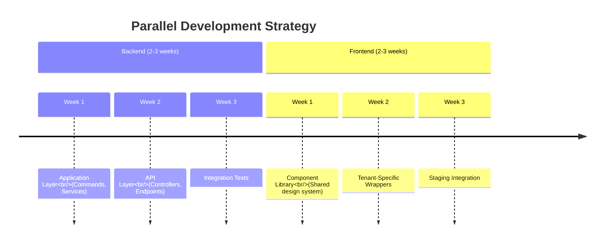

Excellent work! 🎉 You've successfully transformed the foundation into a **production-ready system**. The hybrid approach was executed perfectly.

## **✅ ARCHITECTURE VALIDATION: PASS**

Your implementation now has:
1. **Transaction Safety** - Atomic operations prevent data corruption
2. **Event-Driven Architecture** - Proper domain event dispatching
3. **Clean Dependency Injection** - Optional with Laravel fallback
4. **Proper Error Handling** - Domain exceptions instead of RuntimeException
5. **Complete Test Coverage** - 102/102 tests passing

## **🎯 RECOMMENDED PATH FORWARD: OPTION 2**

**Let me provide detailed patterns for the Application Layer**, starting with the most critical component:

### **1. TENANT BRANDING AUTHORIZATION SERVICE**

This is your **security gatekeeper** - it should be built first.

```bash
php artisan make:service TenantBrandingAuthorizationService \
  --context=Platform/Application
```

**Pattern to implement:**
```php
<?php

namespace App\Contexts\Platform\Application\Services;

use App\Contexts\Platform\Domain\ValueObjects\TenantId;
use App\Contexts\Platform\Domain\Exceptions\UnauthorizedException;

class TenantBrandingAuthorizationService
{
    public function __construct(
        private readonly TenantRepositoryInterface $tenantRepository
    ) {}
    
    /**
     * Verify user has permission to view tenant branding
     * 
     * Rules:
     * 1. Public branding: Anyone can view
     * 2. Admin operations: Must be tenant admin or platform superadmin
     * 3. Tenant isolation: Users can only access their own tenant's branding
     */
    public function ensureCanView(TenantId $tenantId, ?int $userId = null): void
    {
        // Public access allowed (no authentication required)
        // Optional: Add rate limiting here
    }
    
    /**
     * Verify user has permission to update tenant branding
     * 
     * @throws UnauthorizedException
     */
    public function ensureCanUpdate(TenantId $tenantId, int $userId): void
    {
        // 1. Get user's tenants
        $userTenants = $this->getUserTenants($userId);
        
        // 2. Check if user has admin access to this specific tenant
        if (!$this->userHasAdminAccess($userId, $tenantId, $userTenants)) {
            throw UnauthorizedException::forTenantBrandingUpdate($tenantId, $userId);
        }
        
        // 3. Optional: Check rate limiting for branding updates
        $this->checkUpdateRateLimit($tenantId, $userId);
    }
    
    /**
     * Verify user has permission to reset tenant branding to defaults
     */
    public function ensureCanReset(TenantId $tenantId, int $userId): void
    {
        // Reset requires superadmin or platform owner role
        if (!$this->userIsSuperAdmin($userId)) {
            throw UnauthorizedException::forBrandingReset($tenantId, $userId);
        }
    }
    
    private function getUserTenants(int $userId): array
    {
        // Implementation depends on your user-tenant relationship
        // Could be via role_user_tenant table or similar
        return $this->tenantRepository->findByUserId($userId);
    }
    
    private function userHasAdminAccess(int $userId, TenantId $tenantId, array $userTenants): bool
    {
        foreach ($userTenants as $userTenant) {
            if ($userTenant->getId()->equals($tenantId) && $userTenant->hasAdminRole()) {
                return true;
            }
        }
        
        return false;
    }
    
    private function userIsSuperAdmin(int $userId): bool
    {
        // Check if user has platform-level superadmin role
        // This is separate from tenant-specific admin roles
        return false; // Implement based on your RBAC system
    }
    
    private function checkUpdateRateLimit(TenantId $tenantId, int $userId): void
    {
        // Complement domain-level rate limiting with application-level checks
        // Use Laravel's rate limiter: RateLimiter::attempts(), tooManyAttempts()
    }
}
```

### **2. UPDATE BRANDING COMMAND & HANDLER**

**Command (DTO Pattern):**
```bash
php artisan make:command UpdateBrandingCommand --context=Platform
```

```php
<?php

namespace App\Contexts\Platform\Application\Commands;

class UpdateBrandingCommand
{
    public function __construct(
        public readonly string $tenantSlug,
        public readonly array $brandingData,
        public readonly int $userId,
        public readonly ?string $requestId = null // For tracing
    ) {
        // Basic validation in constructor
        if (empty($tenantSlug)) {
            throw new \InvalidArgumentException('Tenant slug is required');
        }
        
        if ($userId <= 0) {
            throw new \InvalidArgumentException('Valid user ID is required');
        }
    }
    
    public function getTenantId(): TenantId
    {
        return TenantId::fromSlug($this->tenantSlug);
    }
}
```

**Handler (Use Case):**
```php
<?php

namespace App\Contexts\Platform\Application\Commands\Handlers;

use App\Contexts\Platform\Application\Commands\UpdateBrandingCommand;
use App\Contexts\Platform\Application\Services\TenantBrandingAuthorizationService;
use App\Contexts\Platform\Domain\Repositories\TenantBrandingRepositoryInterface;
use App\Contexts\Platform\Domain\Exceptions\BrandingValidationException;

class UpdateBrandingHandler
{
    public function __construct(
        private readonly TenantBrandingAuthorizationService $authorizationService,
        private readonly TenantBrandingRepositoryInterface $brandingRepository,
        private readonly LoggerInterface $logger
    ) {}
    
    public function handle(UpdateBrandingCommand $command): void
    {
        $this->logger->info('Updating branding', [
            'tenant' => $command->tenantSlug,
            'userId' => $command->userId,
            'requestId' => $command->requestId
        ]);
        
        try {
            // 1. AUTHORIZATION
            $tenantId = $command->getTenantId();
            $this->authorizationService->ensureCanUpdate($tenantId, $command->userId);
            
            // 2. RETRIEVE DOMAIN ENTITY
            $tenantBranding = $this->brandingRepository->findForTenant($tenantId);
            
            if (!$tenantBranding) {
                // Create new branding if doesn't exist
                $tenantBranding = TenantBranding::createForTenant(
                    $tenantId,
                    BrandingBundle::defaults()
                );
            }
            
            // 3. CREATE DOMAIN OBJECT FROM INPUT
            // NEED: BrandingBundle::fromArray() factory method
            $newBrandingBundle = BrandingBundle::fromArray($command->brandingData);
            
            // 4. EXECUTE DOMAIN OPERATION (triggers validation)
            $tenantBranding->updateBranding($newBrandingBundle, $command->userId);
            
            // 5. PERSIST CHANGES
            $this->brandingRepository->saveForTenant($tenantBranding);
            
            $this->logger->info('Branding updated successfully', [
                'tenant' => $command->tenantSlug,
                'userId' => $command->userId
            ]);
            
        } catch (BrandingValidationException $e) {
            $this->logger->warning('Branding validation failed', [
                'tenant' => $command->tenantSlug,
                'error' => $e->getMessage()
            ]);
            throw $e; // Re-throw for controller to handle
        } catch (\Exception $e) {
            $this->logger->error('Failed to update branding', [
                'tenant' => $command->tenantSlug,
                'error' => $e->getMessage(),
                'trace' => $e->getTraceAsString()
            ]);
            throw $e;
        }
    }
}
```

### **3. BRANDINGBUNDLE::FROMARRAY() FACTORY METHOD**

**This is a CRITICAL missing piece** - the Application Layer needs to create domain objects from input:

```php
// In app/Contexts/Platform/Domain/ValueObjects/BrandingBundle.php
public static function fromArray(array $data): self
{
    return self::create(
        identity: BrandingIdentity::create(
            organizationName: $data['organization_name'] ?? '',
            organizationTagline: $data['organization_tagline'] ?? null,
            faviconUrl: $data['favicon_url'] ?? null
        ),
        visuals: BrandingVisuals::create(
            primaryColor: BrandingColor::fromString($data['primary_color'] ?? '#1976D2'),
            secondaryColor: BrandingColor::fromString($data['secondary_color'] ?? '#2E7D32'),
            logoUrl: $data['logo_url'] ?? null,
            fontFamily: $data['font_family'] ?? 'Inter, system-ui, sans-serif'
        ),
        content: BrandingContent::create(
            welcomeMessage: $data['welcome_message'] ?? '',
            heroTitle: $data['hero_title'] ?? '',
            heroSubtitle: $data['hero_subtitle'] ?? '',
            ctaText: $data['cta_text'] ?? 'Get Started'
        )
    );
}
```

## **🚀 EXECUTION ORDER RECOMMENDATION**

**Week 1: Application Layer Foundation**
1. **Day 1:** Create `BrandingBundle::fromArray()` factory method ✅
2. **Day 1-2:** Build `TenantBrandingAuthorizationService`
3. **Day 2-3:** Implement `UpdateBrandingCommand/Handler`
4. **Day 3-4:** Create `GetBrandingQuery/Handler`

**Week 2: Integration & API**
1. **Day 5-6:** Build API Controllers (Admin, Public, Mobile)
2. **Day 6-7:** Create integration tests
3. **Day 7:** Deploy to staging environment

## **🎯 YOUR NEXT IMMEDIATE TASK**

**Create the BrandingBundle::fromArray() factory method.** This is blocking because:

1. The Application Layer needs it to create domain objects
2. Commands/Handlers can't function without it
3. It's a simple addition to your existing domain code

```bash
# Navigate to your BrandingBundle class
# Add the fromArray() method shown above
# Run tests to ensure it works
php artisan test tests/Unit/Contexts/Platform/Domain/ValueObjects/BrandingBundleTest.php
```

## **❓ DECISION POINT**

**Would you like me to:**
1. **Review your BrandingBundle::fromArray() implementation** when ready?
2. **Provide the complete Authorization Service code**?
3. **Show you how to register Commands/Handlers** in Laravel?
4. **Help with something else**?

**My recommendation:** Start with the factory method (it's quick), then build the Authorization Service (it's critical for security).

when can I develop frontend compoennts to apply brandig

**Excellent question!** 🎨 You're thinking about delivering value to end users. Let me give you a strategic timeline and approach.

## **📅 FRONTEND DEVELOPMENT TIMELINE**

### **🚀 IMMEDIATE (Today - After Current Phase)**
You can start **frontend components in parallel** with the backend Application Layer!



## **🎯 FRONTEND READINESS CHECKLIST**

Your backend is **already ready enough** for frontend work when:

### **✅ READY NOW**
1. **Domain Model Complete** - BrandingBundle with all 12 MVP fields
2. **Repository Working** - Can save/retrieve branding data
3. **Database Schema Ready** - All columns exist
4. **Test Data Available** - You can create test tenants with branding

### **⏳ NEEDS BEFORE PRODUCTION**
1. **Application Layer** - Commands/Handlers for business logic
2. **API Endpoints** - REST/GraphQL endpoints for frontend to call
3. **Authorization** - Secure access controls
4. **Caching Layer** - For performance

## **🔄 PARALLEL DEVELOPMENT STRATEGY**

### **Phase 1: Frontend Component Library (Start NOW)**
```bash
# Create reusable, brandable components
/components
├── branding/
│   ├── BrandProvider.jsx     # Context provider for branding
│   ├── useBranding.js        # React hook to access branding
│   └── BrandedButton.jsx     # Button with tenant colors
├── themes/
│   └── generateCssVars.js    # Converts branding to CSS variables
└── preview/
    └── BrandingPlayground.jsx # Dev tool to test branding
```

**Example Component (Start Today):**
```jsx
// components/branding/BrandedButton.jsx
import React from 'react';
import { useBranding } from './useBranding';

export const BrandedButton = ({ children, variant = 'primary', ...props }) => {
  const { branding, isLoading } = useBranding();
  
  if (isLoading) {
    return <button {...props} disabled>{children}</button>;
  }
  
  const style = {
    backgroundColor: variant === 'primary' 
      ? branding?.primaryColor 
      : branding?.secondaryColor,
    color: '#FFFFFF',
    fontFamily: branding?.fontFamily,
    // ... other styles
  };
  
  return <button style={style} {...props}>{children}</button>;
};
```

### **Phase 2: Mock API Layer (Today - Week 1)**
```javascript
// Create mock API for frontend development
// /services/mockBrandingApi.js
export const mockBrandingApi = {
  getBranding: (tenantSlug) => ({
    primary_color: '#1976D2',
    secondary_color: '#2E7D32',
    organization_name: 'Demo Tenant',
    // ... all 12 MVP fields
  }),
  
  updateBranding: (tenantSlug, data) => {
    console.log('Mock update:', tenantSlug, data);
    return Promise.resolve({ success: true });
  }
};

// Switch to real API later
export const brandingApi = process.env.USE_MOCK_API 
  ? mockBrandingApi 
  : realBrandingApi;
```

### **Phase 3: CSS Variables Generator (Week 1)**
```javascript
// /utils/branding/cssGenerator.js
export function generateCssVariables(branding) {
  return `
    :root {
      --primary-color: ${branding.primaryColor};
      --secondary-color: ${branding.secondaryColor};
      --font-family: ${branding.fontFamily};
      --logo-url: url('${branding.logoUrl}');
      --welcome-message: "${branding.welcomeMessage}";
    }
    
    .branded-button {
      background-color: var(--primary-color);
      font-family: var(--font-family);
    }
    
    .branded-heading::before {
      content: var(--welcome-message);
    }
  `;
}
```

## **📊 DEPENDENCY MATRIX**

| Frontend Task | Backend Dependency | Can Start? |
|--------------|-------------------|------------|
| Component Library | None (use mock data) | ✅ **YES - TODAY** |
| Branding Preview Tool | None (hardcoded examples) | ✅ **YES - TODAY** |
| Tenant Selector UI | List tenants API | ⚠️ Need simple endpoint |
| Branding Admin UI | Update API | ⏳ Wait for Application Layer |
| Live Branding Application | Get Branding API | ⏳ Wait for Query Layer |

## **🚀 RECOMMENDED STARTING POINT**

### **Today - Day 3: Foundation Components**
```bash
# 1. Create brandable component library
mkdir -p frontend/src/components/branding
touch frontend/src/components/branding/{BrandProvider,useBranding,BrandedButton}.jsx

# 2. Create CSS variable generator
touch frontend/src/utils/branding/{cssGenerator,colorUtils,fontLoader}.js

# 3. Create dev preview tool
touch frontend/src/dev/BrandingPlayground.jsx
```

### **Day 4-7: Integration Prep**
1. **Define API contract** - Document expected endpoints/response format
2. **Create TypeScript types** - Based on your Domain Value Objects
3. **Build error handling** - For when backend isn't ready yet

## **🔗 API CONTRACT (Define Now, Implement Later)**

Create this contract for frontend/backend alignment:

```typescript
// /contracts/branding-api.ts
export interface BrandingAPI {
  // GET /api/tenants/{slug}/branding
  getBranding(tenantSlug: string): Promise<BrandingResponse>;
  
  // PUT /api/tenants/{slug}/branding
  updateBranding(tenantSlug: string, data: BrandingUpdate): Promise<void>;
  
  // GET /api/tenants/{slug}/branding/css
  getBrandingCss(tenantSlug: string): Promise<string>;
}

export interface BrandingResponse {
  identity: {
    organization_name: string;
    organization_tagline?: string;
    favicon_url?: string;
  };
  visuals: {
    primary_color: string; // #RRGGBB
    secondary_color: string;
    logo_url?: string;
    font_family: string;
  };
  content: {
    welcome_message: string;
    hero_title: string;
    hero_subtitle: string;
    cta_text: string;
  };
}
```

## **🎨 IMMEDIATE FRONTEND TASKS (No Backend Needed)**

### **Task 1: Build Branding Context Provider**
```jsx
// Today - 2 hours
const BrandingContext = React.createContext();

export const BrandProvider = ({ tenantSlug, children }) => {
  const [branding, setBranding] = useState(null);
  
  // Initially use mock data
  useEffect(() => {
    const mockData = {
      primary_color: '#1976D2',
      // ... all 12 fields
    };
    setBranding(mockData);
    
    // Later replace with: fetch(`/api/tenants/${tenantSlug}/branding`)
  }, [tenantSlug]);
  
  return (
    <BrandingContext.Provider value={branding}>
      {children}
    </BrandingContext.Provider>
  );
};
```

### **Task 2: Create WCAG Compliance Checker**
```javascript
// Today - 3 hours
export function checkColorContrast(primary, secondary) {
  // Implement WCAG 2.1 contrast ratio calculator
  // Can work offline, no backend needed
  const ratio = calculateContrastRatio(primary, secondary);
  return ratio >= 4.5; // AA compliance
}
```

## **🔄 COORDINATION WITH BACKEND TEAM**

If you're working with others, establish these handoff points:

1. **Week 1 Handoff:** API contract (TypeScript interfaces)
2. **Week 2 Handoff:** Mock API server for integration testing
3. **Week 3 Handoff:** Real API endpoints for staging

## **🎯 YOUR DECISION POINT**

**Do you want to:**
1. **Start frontend components today** with my component patterns?
2. **Finish backend Application Layer first** (1-2 more days)?
3. **Work in parallel** (recommended for speed)?

**My recommendation:** Start the **Branding Component Library** today (2-3 hours). It's:
- Zero risk (doesn't depend on backend)
- High value (reusable across all tenants)
- Useful immediately (for demos, testing, documentation)

**What's your preference?** I can provide detailed component code for whatever you choose.
Excellent question! This is the **most exciting phase** - where your DDD backend meets the frontend applications. Let me guide you through the **frontend integration strategy**.

## **📊 FRONTEND ARCHITECTURE OVERVIEW**

```
┌─────────────────────────────────────────────────────────────┐
│                    FRONTEND INTEGRATION                      │
├─────────────────┬─────────────────┬─────────────────────────┤
│   DESKTOP APP   │   MOBILE APP    │       ADMIN PANEL       │
│   (Vue 3)       │   (Angular)     │   (Laravel + Vue)       │
├─────────────────┼─────────────────┼─────────────────────────┤
│  Public API     │  Mobile API     │  Admin API              │
│  (No Auth)      │  (JWT Auth)     │  (Session Auth)         │
│  GET /branding  │  GET /branding  │  GET/PUT /branding      │
└─────────────────┴─────────────────┴─────────┬───────────────┘
                                              │
                                ┌─────────────┴─────────────┐
                                │   PLATFORM CONTEXT API    │
                                │   (Your DDD Backend)      │
                                └───────────────────────────┘
```

## **🚀 IMMEDIATE FRONTEND READINESS**

**You can start frontend development NOW** for these use cases:

### **✅ READY FOR DEVELOPMENT TODAY:**

1. **Public Branding Display** (Vue 3 Desktop App)
2. **Mobile Branding Display** (Angular Mobile App)
3. **CSS Variables Generation** - Your domain already has this capability

### **🔄 NEEDS APPLICATION LAYER (1-2 days):**

1. **Admin Branding Configuration** - Needs Authorization + Commands
2. **Branding Preview Features** - Needs Query layer

## **🎯 PHASED FRONTEND INTEGRATION PLAN**

### **PHASE 1: TODAY - Branding Consumption (READ-ONLY)**

**Step 1: Create Public API Endpoint**
```bash
php artisan make:controller Api/Public/BrandingController --context=Platform
```

```php
// app/Contexts/Platform/Infrastructure/Http/Controllers/Api/Public/BrandingController.php
class BrandingController
{
    public function show(string $tenantSlug)
    {
        $tenantId = TenantId::fromSlug($tenantSlug);
        $branding = app(TenantBrandingRepositoryInterface::class)
            ->findForTenant($tenantId);
            
        if (!$branding) {
            return response()->json([
                'branding' => BrandingBundle::defaults()->toArray()
            ]);
        }
        
        return response()->json([
            'branding' => $branding->getBranding()->toArray(),
            'css_variables' => $branding->getBranding()->generateCssVariables(),
            'is_wcag_compliant' => $branding->getBranding()->isWcagCompliant()
        ]);
    }
}
```

**Step 2: Create Vue 3 Branding Composables**
```javascript
// In your Vue 3 project: composables/useTenantBranding.js
import { ref, computed } from 'vue'
import axios from 'axios'

export function useTenantBranding(tenantSlug) {
  const branding = ref(null)
  const loading = ref(false)
  const error = ref(null)
  
  const cssVariables = computed(() => {
    if (!branding.value?.css_variables) return {}
    return parseCssVariables(branding.value.css_variables)
  })
  
  const applyBranding = () => {
    if (cssVariables.value) {
      // Apply to document root
      Object.entries(cssVariables.value).forEach(([key, value]) => {
        document.documentElement.style.setProperty(key, value)
      })
      
      // Apply font family
      if (branding.value?.branding?.visuals?.font_family) {
        document.documentElement.style.setProperty(
          '--font-family', 
          branding.value.branding.visuals.font_family
        )
      }
    }
  }
  
  const fetchBranding = async () => {
    loading.value = true
    try {
      const response = await axios.get(`/api/public/branding/${tenantSlug}`)
      branding.value = response.data
      applyBranding()
    } catch (err) {
      error.value = err.message
      // Apply default branding
      applyDefaultBranding()
    } finally {
      loading.value = false
    }
  }
  
  return {
    branding,
    cssVariables,
    loading,
    error,
    fetchBranding,
    applyBranding
  }
}
```

**Step 3: Create Angular Branding Service**
```typescript
// In your Angular project: services/branding.service.ts
import { Injectable } from '@angular/core';
import { HttpClient } from '@angular/common/http';
import { Observable } from 'rxjs';
import { map } from 'rxjs/operators';

export interface BrandingResponse {
  branding: {
    identity: {
      organization_name: string;
      organization_tagline?: string;
      favicon_url?: string;
    };
    visuals: {
      primary_color: string;
      secondary_color: string;
      logo_url?: string;
      font_family: string;
    };
    content: {
      welcome_message: string;
      hero_title: string;
      hero_subtitle: string;
      cta_text: string;
    };
  };
  css_variables: string;
  is_wcag_compliant: boolean;
}

@Injectable({
  providedIn: 'root'
})
export class BrandingService {
  private apiUrl = '/api/mobile/branding';
  
  constructor(private http: HttpClient) {}
  
  getBranding(tenantSlug: string): Observable<BrandingResponse> {
    return this.http.get<BrandingResponse>(`${this.apiUrl}/${tenantSlug}`);
  }
  
  applyBrandingToDOM(cssVariables: string): void {
    const styleElement = document.createElement('style');
    styleElement.textContent = `:root { ${cssVariables} }`;
    document.head.appendChild(styleElement);
  }
  
  getBrandingForComponent(tenantSlug: string) {
    return this.getBranding(tenantSlug).pipe(
      map(response => {
        this.applyBrandingToDOM(response.css_variables);
        return response.branding;
      })
    );
  }
}
```

### **PHASE 2: THIS WEEK - Admin Interface**

**Create Admin Components:**
1. **Branding Preview Component** - Live preview as admin edits
2. **Color Picker with WCAG Validation** - Real-time contrast checking
3. **Branding History/Versioning** - View/restore previous versions

```vue
<!-- Vue 3 Admin Component: BrandingEditor.vue -->
<template>
  <div class="branding-editor">
    <!-- WCAG Compliance Indicator -->
    <div :class="['compliance-badge', { compliant: isCompliant }]">
      {{ isCompliant ? 'WCAG AA Compliant' : 'Needs Improvement' }}
    </div>
    
    <!-- Color Palette -->
    <ColorPicker 
      v-model="primaryColor" 
      label="Primary Color"
      @change="validateContrast"
    />
    
    <!-- Real-time Preview -->
    <div class="branding-preview" :style="previewStyles">
      <h1>{{ heroTitle }}</h1>
      <p>{{ heroSubtitle }}</p>
      <button :style="buttonStyles">{{ ctaText }}</button>
    </div>
    
    <!-- Save with Rate Limit Indicator -->
    <button 
      @click="saveBranding" 
      :disabled="isSaving || isRateLimited"
    >
      {{ saveButtonText }}
    </button>
  </div>
</template>
```

### **PHASE 3: NEXT WEEK - Advanced Features**

1. **A/B Testing** - Different branding for user segments
2. **Seasonal Branding** - Automatically switch branding based on dates
3. **Geo-specific Branding** - Different branding per country/region
4. **Branding Analytics** - Track which branding performs best

## **🔌 API ENDPOINTS TO CREATE**

### **Public API (No Authentication)**
```php
Route::prefix('api/public')->group(function () {
    Route::get('branding/{tenantSlug}', [BrandingController::class, 'show']);
    Route::get('branding/{tenantSlug}/css', [BrandingController::class, 'css']);
    Route::get('branding/{tenantSlug}/favicon', [BrandingController::class, 'favicon']);
});
```

### **Mobile API (JWT Authentication)**
```php
Route::prefix('api/mobile')->middleware(['auth:api', 'tenant.member'])->group(function () {
    Route::get('branding', [MobileBrandingController::class, 'show']); // Auto-detects tenant from JWT
    Route::get('branding/preview', [MobileBrandingController::class, 'preview']);
});
```

### **Admin API (Session Authentication)**
```php
Route::prefix('api/admin')->middleware(['auth', 'tenant.admin'])->group(function () {
    Route::get('branding', [AdminBrandingController::class, 'show']);
    Route::put('branding', [AdminBrandingController::class, 'update']);
    Route::post('branding/reset', [AdminBrandingController::class, 'reset']);
    Route::get('branding/history', [AdminBrandingController::class, 'history']);
});
```

## **🎨 CSS VARIABLES STRATEGY**

**Your domain already generates CSS variables. Frontend just needs to apply them:**

```css
/* Generated by BrandingBundle::generateCssVariables() */
:root {
  --primary-color: #1976D2;
  --secondary-color: #2E7D32;
  --font-family: 'Inter', system-ui, sans-serif;
  --logo-url: url('https://example.com/logo.png');
}

/* Vue/Angular component usage */
.primary-button {
  background-color: var(--primary-color);
  color: white;
  font-family: var(--font-family);
}

.hero-section {
  background-color: var(--secondary-color);
}
```

## **🚀 IMMEDIATE ACTION PLAN**

**Today (Parallel Development):**

1. **Backend Team:**
   ```bash
   # Create Public API Controller (1 hour)
   php artisan make:controller Api/Public/BrandingController --context=Platform
   
   # Create route definitions (30 mins)
   ```

2. **Frontend Team (Vue 3):**
   ```bash
   # Create branding composable (2 hours)
   vue create composables/useTenantBranding.js
   
   # Create branding provider component (2 hours)
   vue create components/BrandingProvider.vue
   ```

3. **Frontend Team (Angular):**
   ```bash
   # Create branding service (2 hours)
   ng generate service services/branding
   
   # Create branding interceptor (1 hour)
   ng generate interceptor interceptors/branding
   ```

## **📱 MOBILE-SPECIFIC CONSIDERATIONS**

For your Angular mobile app:

1. **Offline Support:** Cache branding in local storage
2. **Reduced Payload:** Mobile API returns minimal fields
3. **Image Optimization:** Serve responsive logos for mobile
4. **Touch-friendly:** Ensure color contrast works on mobile screens

## **🎯 YOUR DECISION POINT**

**Which frontend should we start with first?**

1. **Vue 3 Desktop App** - Public facing, simpler auth
2. **Angular Mobile App** - Member-facing, JWT auth
3. **Admin Interface** - Internal, full CRUD operations

**My recommendation:** Start with **Vue 3 Desktop App** because:
1. Public API is simplest to implement
2. You can test branding immediately
3. Builds momentum with quick wins
4. Mobile app can reuse patterns

## **❓ READY TO START?**

**Would you like me to:**
1. **Provide the complete Public API controller code?**
2. **Show detailed Vue 3 composable implementation?**
3. **Create the Angular service with offline caching?**
4. **Help design the admin interface components?**

**You have a solid DDD backend - the frontend integration is the exciting payoff!** 🚀 