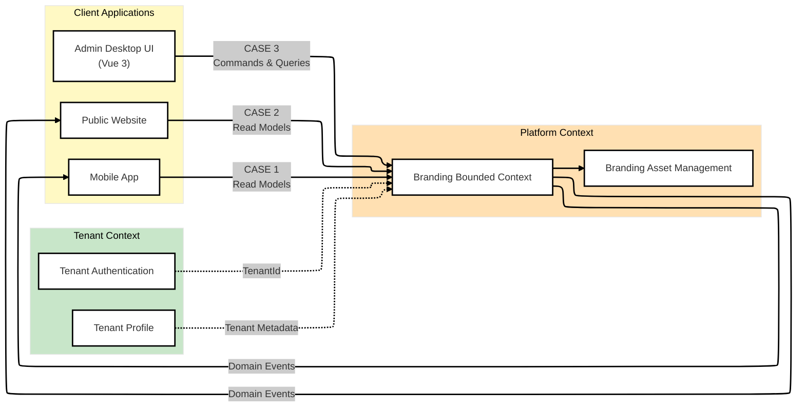
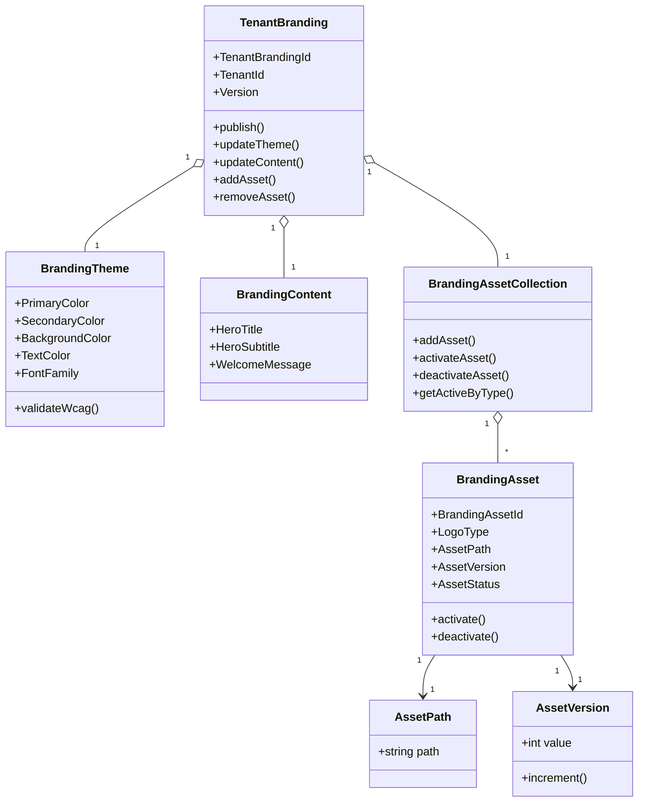

Perfect. Below is a **final, architect-approved bounded context & aggregate design**, followed by a **formal ADR** you can store in `/docs/adr/ADR-004-platform-branding-assets.md`.

I’m writing this as if it were reviewed and accepted by a **Senior Architecture Board**.

---

# 🧭 FINAL BOUNDED CONTEXT & AGGREGATE DIAGRAM

## 1️⃣ Bounded Context Map (Strategic DDD)



### 🧠 Key Strategic Decisions

* **Branding is a Platform capability**, not tenant-owned
* **Asset Management is a subdomain**, not a separate bounded context
* Tenant context provides **identity only**, never branding logic
* UI talks **only to APIs**, never to CDN/storage

---

## 2️⃣ Aggregate & Domain Model Diagram (Tactical DDD)



### 🔒 Aggregate Rules (Non-Negotiable)

* `TenantBranding` is the **ONLY Aggregate Root**
* Assets **cannot be activated outside publish()**
* Only **one active asset per LogoType**
* Version conflicts are enforced at aggregate boundary
* WCAG rules live **inside domain objects**

---

# 📜 ARCHITECTURE DECISION RECORD (ADR)

---

## ADR-004: Platform Branding & Asset Management Architecture

**Status:** ✅ Accepted
**Date:** 2026-01-07
**Decision Makers:** Platform Architecture Board
**Context:** Platform Branding (Laravel 12 + Vue 3)

---

## 1️⃣ Context & Problem Statement

The platform requires a **production-grade tenant branding system** supporting:

* Custom colors, fonts, texts
* Logo & favicon uploads
* Multiple logo variants
* CDN-based delivery
* Versioning & rollback
* WCAG accessibility compliance

The existing approach treated branding as:

* UI-driven
* Persistence-centric
* Lacking asset lifecycle management

This posed risks to:

* Scalability
* Security
* Auditability
* Domain integrity

---

## 2️⃣ Decision

We decided to implement **Platform Branding** as a **DDD-compliant bounded context**, with:

### ✅ Key Decisions

1. **Branding is a Platform Bounded Context**

   * Not part of Tenant Auth
   * Not UI-owned
   * Used by Admin, Mobile, and Public clients

2. **TenantBranding is the Aggregate Root**

   * Protects all branding invariants
   * Controls asset activation and publishing

3. **Branding Assets are Domain Entities**

   * Assets have lifecycle, versions, and state
   * Assets are metadata + CDN references only

4. **External CDN Storage is Mandatory**

   * Cloudinary or S3 + CDN
   * Files are never stored in DB
   * CDN provider is infrastructure concern

5. **Upload ≠ Publish**

   * Upload creates inactive draft assets
   * Publish activates assets atomically

6. **TDD-First Development is Required**

   * Domain tests before infrastructure
   * No controller/UI without domain coverage

---

## 3️⃣ Architectural Structure

### Bounded Context

```
Platform
 └── Branding
      ├── Domain
      │    ├── TenantBranding (Aggregate Root)
      │    ├── BrandingAsset
      │    ├── BrandingTheme
      │    └── BrandingContent
      ├── Application
      │    ├── Commands
      │    ├── CommandHandlers
      │    └── Services
      └── Infrastructure
           ├── Persistence
           ├── CDN Adapters
           └── Image Processing
```

---

## 4️⃣ Consequences

### ✅ Positive

* Strong domain boundaries
* Safe concurrent edits
* Rollback & audit support
* CDN scalability
* Mobile & web reuse
* WCAG enforcement at domain level

### ⚠️ Trade-offs

* Higher initial complexity
* Requires disciplined TDD
* CDN integration overhead

These trade-offs are **acceptable and intentional**.

---

## 5️⃣ Alternatives Considered

| Option              | Reason Rejected            |
| ------------------- | -------------------------- |
| Store logos in DB   | Not scalable               |
| Local filesystem    | Single point of failure    |
| UI-managed branding | No domain integrity        |
| CRUD REST only      | No invariants / versioning |

---

## 6️⃣ Quality Gates (Mandatory)

Before merge:

1. Domain tests ≥ 90%
2. Version conflict tests passing
3. WCAG invariant tests passing
4. CDN adapter contract tests
5. No infrastructure code in domain

---

## 7️⃣ Final Statement

> Branding and branding assets are **core platform domain concepts**.
> This architecture ensures correctness, scalability, and long-term maintainability.

Any deviation from this ADR **requires a new ADR** and architecture board approval.

---

## ✅ NEXT RECOMMENDED STEPS

If you want, I can now:

1. 🧪 Write **first 15 failing domain tests**
2. 📂 Generate **final Laravel + Vue folder structure**
3. 🔐 Define **exact policies & permissions**
4. 🧠 Create **event flow diagrams**
5. 📘 Produce **developer onboarding guide**

Just tell me what you want next.
