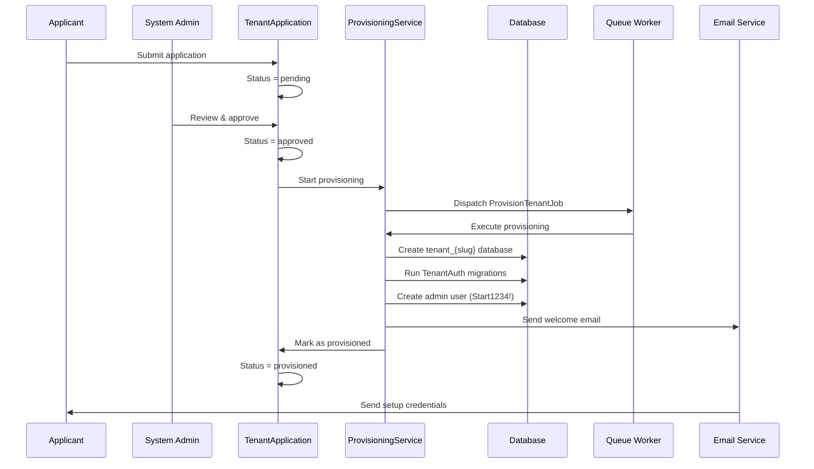

# 🚀 **Developer Guide: Tenant Provisioning System**

## 📋 **Table of Contents**
1. [System Overview](#system-overview)
2. [Architecture & DDD Boundaries](#architecture--ddd-boundaries)
3. [Provisioning Workflow](#provisioning-workflow)
4. [Key Components](#key-components)
5. [Database Schema](#database-schema)
6. [Testing Strategy](#testing-strategy)
7. [Debugging Guide](#debugging-guide)
8. [Common Issues & Solutions](#common-issues--solutions)
9. [Performance Optimization](#performance-optimization)
10. [Security Considerations](#security-considerations)

---

## 1. 📊 **System Overview**

### **Purpose**
The Tenant Provisioning System automatically creates isolated tenant databases when organizations apply and get approved to use the election platform.

### **Key Features**
- ✅ **Automated database creation** - Creates `tenant_{slug}` databases
- ✅ **Domain migrations** - Runs TenantAuth context migrations automatically
- ✅ **Admin user setup** - Creates initial admin with `Start1234!` password
- ✅ **Email notifications** - Sends welcome email with setup links
- ✅ **State management** - Tracks application status (pending → approved → provisioned)
- ✅ **Duplicate prevention** - Enforces unique tenant slugs
- ✅ **Universal Core Schema** - Uses standardized user table structure

### **Technology Stack**
- **Laravel 12.35.1** with DDD architecture
- **MySQL** with multi-database tenancy
- **Spatie Laravel Multitenancy**
- **Queue workers** for async provisioning
- **TDD approach** with 80%+ test coverage

---

## 2. 🏗️ **Architecture & DDD Boundaries**

### **Bounded Contexts**

```
┌─────────────────────────────────────────────────────────┐
│                    PLATFORM CONTEXT                      │
│  (Landlord Database: election/election_test)             │
├─────────────────────────────────────────────────────────┤
│ • TenantApplication Entity                              │
│ • TenantProvisioningService                             │
│ • TenantApplicationService                              │
│ • Admin approval workflows                             │
│ • Tenant record management                              │
└─────────────────────────────────────────────────────────┘
                           │
                           ▼
┌─────────────────────────────────────────────────────────┐
│                    TENANTAUTH CONTEXT                    │
│  (Tenant Databases: tenant_{slug})                       │
├─────────────────────────────────────────────────────────┤
│ • tenant_users table (Universal Core Schema)            │
│ • Tenant-specific authentication                        │
│ • User management                                       │
│ • Role/permissions system                               │
└─────────────────────────────────────────────────────────┘
```

### **Database Isolation**
```
landlord database (election)          tenant databases
├── tenants                           ├── tenant_users
├── tenant_applications               ├── committee_users  
├── users                             ├── tenant_user_registrations
└── permissions                       └── [other tenant tables]
```

### **Key DDD Principles Applied**
1. **Context Mapping**: Clear boundaries between Platform and TenantAuth contexts
2. **Aggregate Roots**: `TenantApplication` is aggregate root in Platform context
3. **Value Objects**: `TenantSlug`, `EmailAddress`, `TenantApplicationId`
4. **Domain Events**: `TenantCreated`, `TenantApplicationWasApproved`
5. **Repositories**: `TenantApplicationRepositoryInterface`
6. **Services**: `TenantProvisioningService`, `TenantApplicationService`

---

## 3. 🔄 **Provisioning Workflow**

### **Complete Flow Diagram**


### **Step-by-Step Process**

#### **Phase 1: Application Submission**
```php
// 1. User submits application via web form
POST /apply-for-tenant
{
    "organization_name": "Example Corp",
    "requested_slug": "example-corp",
    "contact_email": "admin@example.com",
    // ... other fields
}

// 2. Application saved in landlord DB
TenantApplication::create($data);
// Status: pending
```

#### **Phase 2: Admin Approval**
```php
// 1. Admin reviews application
GET /admin/tenant-applications/{id}

// 2. Admin approves
POST /admin/tenant-applications/{id}/approve
{
    "review_notes": "Legitimate organization"
}

// 3. Application state transition
$application->approve($adminId, $notes);
// Status: approved
```

#### **Phase 3: Provisioning Execution**
```php
// 1. Start provisioning workflow
$applicationService->startProvisioningWorkflow($applicationId, $adminId);
// Status: provisioning_started

// 2. Queue job dispatched
ProvisionTenantJob::dispatch($application);

// 3. Job execution
class ProvisionTenantJob {
    public function handle(TenantProvisioningService $service) {
        // a) Create tenant record
        $tenant = $service->createTenantRecord($data);
        
        // b) Create database
        DB::statement("CREATE DATABASE tenant_{$slug}");
        
        // c) Run migrations
        Artisan::call('migrate', [
            '--database' => 'tenant',
            '--path' => 'app/Contexts/TenantAuth/Infrastructure/Database/Migrations'
        ]);
        
        // d) Create admin user
        DB::table('tenant_users')->insert([
            'first_name' => $firstName,
            'last_name' => $lastName,
            'email' => $adminEmail,
            'password_hash' => bcrypt('Start1234!'),
            'must_change_password' => true,
            'tenant_id' => $tenant->numeric_id,
            'metadata' => json_encode(['is_initial_admin' => true])
        ]);
        
        // e) Send email
        Mail::send(new TenantProvisioningCompletedMail(...));
        
        // f) Mark as provisioned
        $application->completeProvisioning($tenant->id);
        // Status: provisioned
    }
}
```

#### **Phase 4: Tenant Setup**
```php
// 1. Admin receives email with:
//    - Initial password: Start1234!
//    - Password setup link: /setup-password/{token}
//    - Tenant login URL: /{slug}/login

// 2. Admin logs in with Start1234!
POST /{slug}/login
{
    "email": "admin@example.com",
    "password": "Start1234!"
}

// 3. System forces password change
if ($user->must_change_password) {
    redirect('/change-password');
}
```

---

## 4. 🔧 **Key Components**

### **4.1 TenantProvisioningService**
**Location**: `app/Contexts/Platform/Application/Services/TenantProvisioningService.php`

**Responsibilities**:
- Create tenant databases
- Execute domain migrations
- Seed initial data (admin user)
- Send welcome emails
- Handle duplicate slug prevention

**Key Methods**:
```php
public function provisionTenant(array $tenantData): Tenant
{
    // 1. Validate slug availability
    $this->validateSlugAvailability($tenantData['slug']);
    
    // 2. Create tenant record
    $tenant = $this->createTenantRecord($tenantData);
    
    // 3. Create database
    $this->createTenantDatabase($tenant);
    
    // 4. Run migrations
    $this->runTenantMigrations($tenant);
    
    // 5. Seed data
    $this->seedTenantData($tenant, $tenantData);
    
    // 6. Send email
    $this->sendWelcomeEmail($tenant, $tenantData);
    
    return $tenant;
}

private function runTenantMigrations(Tenant $tenant): void
{
    // Switch to tenant database context
    config(['database.connections.tenant.database' => $tenant->database_name]);
    DB::purge('tenant');
    
    // Run TenantAuth context migrations
    Artisan::call('migrate', [
        '--database' => 'tenant',
        '--path' => 'app/Contexts/TenantAuth/Infrastructure/Database/Migrations',
        '--force' => true
    ]);
}
```

### **4.2 TenantApplication Entity**
**Location**: `app/Contexts/Platform/Domain/Entities/TenantApplication.php`

**State Machine**:
```php
class TenantApplication
{
    private ApplicationStatus $status;
    
    public function approve(string $reviewerId, string $notes): void
    {
        $this->guardTransition(ApplicationStatus::PENDING, ApplicationStatus::APPROVED);
        $this->status = ApplicationStatus::APPROVED;
        $this->reviewerId = $reviewerId;
        $this->reviewNotes = $notes;
        $this->reviewedAt = now();
    }
    
    public function startProvisioning(): void
    {
        $this->guardTransition(ApplicationStatus::APPROVED, ApplicationStatus::PROVISIONING_STARTED);
        $this->status = ApplicationStatus::PROVISIONING_STARTED;
    }
    
    public function completeProvisioning(string $tenantId): void
    {
        $this->guardTransition(ApplicationStatus::PROVISIONING_STARTED, ApplicationStatus::PROVISIONED);
        $this->status = ApplicationStatus::PROVISIONED;
        $this->tenantId = $tenantId;
        $this->provisioningCompletedAt = now();
    }
}
```

### **4.3 Universal Core Schema**
**Migration**: `2025_12_06_120000_align_tenant_users_with_universal_core_schema.php`

**Key Changes**:
```sql
-- OLD SCHEMA (before Universal Core)
CREATE TABLE tenant_users (
    id BIGINT PRIMARY KEY,
    name VARCHAR(255),
    email VARCHAR(255),
    password VARCHAR(255),
    role VARCHAR(50)
);

-- NEW SCHEMA (Universal Core)
CREATE TABLE tenant_users (
    id BIGINT PRIMARY KEY,
    uuid CHAR(36) UNIQUE,
    first_name VARCHAR(100),
    last_name VARCHAR(100),
    email VARCHAR(255) UNIQUE,
    password_hash VARCHAR(255),  -- renamed from password
    must_change_password BOOLEAN DEFAULT FALSE,
    tenant_id BIGINT UNSIGNED,  -- new: tenant isolation
    metadata JSON,
    -- ... other Universal Core fields
);
```

---

## 5. 🗄️ **Database Schema**

### **5.1 Landlord Database (`election`)**

#### **`tenants` table**:
```sql
CREATE TABLE tenants (
    id CHAR(36) PRIMARY KEY,           -- UUID
    numeric_id BIGINT UNSIGNED,        -- For tenant_users.tenant_id FK
    name VARCHAR(255),
    slug VARCHAR(255) UNIQUE,          -- tenant_{slug} database name
    email VARCHAR(255),
    database_name VARCHAR(255),        -- tenant_{slug}
    status ENUM('active','inactive','suspended'),
    created_at TIMESTAMP,
    updated_at TIMESTAMP,
    deleted_at TIMESTAMP
);
```

#### **`tenant_applications` table**:
```sql
CREATE TABLE tenant_applications (
    id CHAR(36) PRIMARY KEY,
    organization_name VARCHAR(255),
    requested_slug VARCHAR(63),
    contact_email VARCHAR(255),
    status ENUM('pending','approved','provisioning_started','provisioned','rejected'),
    reviewer_id BIGINT UNSIGNED,
    tenant_id CHAR(36),                -- FK to tenants.id
    provisioning_completed_at TIMESTAMP,
    created_at TIMESTAMP,
    updated_at TIMESTAMP
);
```

### **5.2 Tenant Database (`tenant_{slug}`)**

#### **`tenant_users` table (Universal Core Schema)**:
```sql
CREATE TABLE tenant_users (
    id BIGINT UNSIGNED PRIMARY KEY AUTO_INCREMENT,
    uuid CHAR(36) UNIQUE,
    first_name VARCHAR(100),
    last_name VARCHAR(100),
    email VARCHAR(255) UNIQUE,
    password_hash VARCHAR(255),
    must_change_password BOOLEAN DEFAULT FALSE,
    tenant_id BIGINT UNSIGNED NOT NULL,  -- FK to tenants.numeric_id
    status ENUM('pending','active','inactive','suspended','archived'),
    metadata JSON,
    created_at TIMESTAMP,
    updated_at TIMESTAMP,
    deleted_at TIMESTAMP,
    
    INDEX idx_tenant_id (tenant_id),
    INDEX idx_email (email),
    INDEX idx_status (status),
    FULLTEXT idx_name_fulltext (first_name, last_name)
);
```

### **5.3 Relationships**
```sql
-- Landlord DB relationships
tenants.numeric_id 1:1 tenant_users.tenant_id
tenants.id 1:1 tenant_applications.tenant_id

-- Tenant DB relationships  
tenant_users.tenant_id N:1 tenants.numeric_id (cross-database FK)
```

---

## 6. 🧪 **Testing Strategy**

### **6.1 Test Structure**
```
tests/Feature/TenantAuth/TenantProvisioningWorkflowTest.php
├── it_should_create_tenant_database_when_provisioning_starts
├── it_should_run_domain_migrations_on_tenant_database
├── it_should_create_admin_user_with_start1234_password
├── it_should_send_welcome_email_with_password_setup_link
├── it_should_mark_application_as_provisioned_when_complete
├── it_should_not_create_duplicate_tenants_for_same_slug
└── it_should_rollback_on_provisioning_failure
```

### **6.2 Test Database Setup**
```xml
<!-- phpunit.xml -->
<env name="DB_DATABASE" value="election_test"/>
<env name="DB_CONNECTION" value="mysql"/>
```

```bash
# Create test database
mysql -u softcrew -p'Election%2025%' -e "
    CREATE DATABASE IF NOT EXISTS election_test 
    CHARACTER SET utf8mb4 
    COLLATE utf8mb4_unicode_ci;
"
```

### **6.3 Test Traits**
```php
use Illuminate\Foundation\Testing\DatabaseTransactions;

class TenantProvisioningWorkflowTest extends TestCase
{
    use DatabaseTransactions;  // Rolls back instead of dropping tables
    
    protected function setUp(): void
    {
        parent::setUp();
        // Service injection
        $this->provisioningService = app(TenantProvisioningService::class);
    }
}
```

### **6.4 Test Assertions**
```php
// Verify database creation
$this->assertDatabaseHas('tenants', [
    'slug' => $tenantData['slug'],
    'database_name' => 'tenant_' . $tenantData['slug']
]);

// Verify migrations ran
config(['database.connections.tenant.database' => $tenant->database_name]);
DB::purge('tenant');
DB::setDefaultConnection('tenant');

$this->assertTrue(Schema::hasTable('tenant_users'));
$this->assertTrue(Schema::hasColumn('tenant_users', 'password_hash'));
$this->assertTrue(Schema::hasColumn('tenant_users', 'first_name'));

// Verify admin user
$adminUser = DB::table('tenant_users')->where('email', $adminEmail)->first();
$this->assertNotNull($adminUser);
$this->assertTrue(Hash::check('Start1234!', $adminUser->password_hash));
$this->assertTrue((bool) $adminUser->must_change_password);

// Verify metadata
$metadata = json_decode($adminUser->metadata, true);
$this->assertTrue($metadata['is_initial_admin'] ?? false);

// Verify email
Mail::assertSent(TenantProvisioningCompletedMail::class, function ($mail) {
    return $mail->hasTo($adminEmail) &&
           str_contains($mail->passwordSetupLink, '/setup-password');
});
```

---

## 7. 🐛 **Debugging Guide**

### **7.1 Common Debugging Commands**

#### **Check Application Status**
```bash
# View pending applications
php artisan tinker --execute="
    use App\Contexts\Platform\Domain\Entities\TenantApplication;
    use App\Contexts\Platform\Application\Repositories\TenantApplicationRepositoryInterface;
    
    $repo = app(TenantApplicationRepositoryInterface::class);
    $pending = $repo->findByStatus('pending');
    foreach ($pending as $app) {
        echo \"ID: {$app->getId()}, Org: {$app->getOrganizationName()}, Slug: {$app->getRequestedSlug()}\\n\";
    }
"

# Check tenant databases
mysql -u softcrew -p'Election%2025%' -e "SHOW DATABASES LIKE 'tenant_%';"
```

#### **Check Queue Status**
```bash
# Start queue worker for tenant provisioning
php artisan queue:listen --queue=tenant-provisioning --tries=3 --timeout=300

# Check failed jobs
php artisan queue:failed
php artisan queue:retry all

# Clear failed jobs
php artisan queue:flush
```

#### **Check Logs**
```bash
# Tail provisioning logs
tail -f storage/logs/laravel.log | grep -E "(Tenant|Provisioning|tenant_)"

# Search for errors
grep -n "ERROR\|Exception\|Failed" storage/logs/laravel.log | tail -20

# View specific tenant provisioning logs
grep -A 5 -B 5 "provisionTenant\|createTenantDatabase" storage/logs/laravel.log
```

### **7.2 Step-by-Step Debugging**

#### **Issue: "Database not created"**
```bash
# 1. Check if tenant record exists
php artisan tinker --execute="
    use App\Models\Tenant;
    \$tenant = Tenant::where('slug', 'test-tenant')->first();
    if (\$tenant) {
        echo \"Tenant exists. Database: {\$tenant->database_name}\\n\";
    } else {
        echo \"Tenant not found\\n\";
    }
"

# 2. Check database creation permission
mysql -u softcrew -p'Election%2025%' -e "
    SHOW GRANTS FOR 'softcrew'@'localhost';
"

# 3. Test manual database creation
mysql -u softcrew -p'Election%2025%' -e "
    CREATE DATABASE IF NOT EXISTS tenant_test_debug 
    CHARACTER SET utf8mb4 
    COLLATE utf8mb4_unicode_ci;
    SHOW DATABASES LIKE 'tenant_test_debug';
"
```

#### **Issue: "Migrations not running"**
```bash
# 1. Check migration paths
php artisan tinker --execute="
    \$paths = \Illuminate\Support\Facades\Config::get('database.migrations');
    print_r(\$paths);
"

# 2. Test manual migration
php artisan migrate --database=tenant \
  --path=app/Contexts/TenantAuth/Infrastructure/Database/Migrations \
  --force \
  --pretend  # Dry run first

# 3. Check if tables exist
mysql -u softcrew -p'Election%2025%' -e "
    USE tenant_test_slug;
    SHOW TABLES;
    DESCRIBE tenant_users;
"
```

#### **Issue: "Admin user not created"**
```bash
# 1. Check tenant database connection
php artisan tinker --execute="
    config(['database.connections.tenant.database' => 'tenant_test_slug']);
    \DB::purge('tenant');
    
    try {
        \$tables = \DB::connection('tenant')->select('SHOW TABLES');
        echo 'Connected. Tables: ' . count(\$tables) . \"\\n\";
        
        \$users = \DB::connection('tenant')->table('tenant_users')->count();
        echo 'Users: ' . \$users . \"\\n\";
    } catch (\Exception \$e) {
        echo 'Error: ' . \$e->getMessage() . \"\\n\";
    }
"

# 2. Check user insertion
php artisan tinker --execute="
    use Illuminate\Support\Facades\Hash;
    
    \$userId = \DB::connection('tenant')->table('tenant_users')->insertGetId([
        'uuid' => \Str::uuid(),
        'first_name' => 'Debug',
        'last_name' => 'User',
        'email' => 'debug@test.com',
        'password_hash' => Hash::make('Test123!'),
        'must_change_password' => true,
        'tenant_id' => 1,
        'status' => 'active',
        'metadata' => json_encode(['debug' => true]),
        'created_at' => now(),
        'updated_at' => now()
    ]);
    
    echo 'Inserted user ID: ' . \$userId . \"\\n\";
"
```

#### **Issue: "Email not sending"**
```bash
# 1. Check mail configuration
php artisan tinker --execute="
    echo 'MAIL_MAILER: ' . env('MAIL_MAILER') . \"\\n\";
    echo 'MAIL_HOST: ' . env('MAIL_HOST') . \"\\n\";
    echo 'MAIL_PORT: ' . env('MAIL_PORT') . \"\\n\";
    echo 'MAIL_USERNAME: ' . env('MAIL_USERNAME') . \"\\n\";
"

# 2. Test email sending
php artisan tinker --execute="
    use Illuminate\Support\Facades\Mail;
    
    try {
        Mail::raw('Test email', function (\$message) {
            \$message->to('test@example.com')
                    ->subject('Test Email');
        });
        echo 'Email sent successfully\\n';
    } catch (\Exception \$e) {
        echo 'Error: ' . \$e->getMessage() . \"\\n\";
    }
"

# 3. Check mail logs
tail -f storage/logs/mail.log  # if using log driver
```

### **7.3 Debugging Tools**

#### **Xdebug Configuration**
```ini
; php.ini
[xdebug]
zend_extension=xdebug.so
xdebug.mode=debug,develop
xdebug.start_with_request=yes
xdebug.client_port=9003
xdebug.client_host=localhost
xdebug.idekey=VSCODE
```

#### **Laravel Debugbar**
```bash
composer require barryvdh/laravel-debugbar --dev
```

#### **Custom Debug Logging**
```php
// Add to TenantProvisioningService
private function debugLog(string $step, array $context = []): void
{
    \Log::debug("[TENANT_PROVISIONING] {$step}", [
        'timestamp' => now()->toISOString(),
        'memory_usage' => memory_get_usage(true) / 1024 / 1024 . ' MB',
        'context' => $context
    ]);
    
    // Also log to separate file
    \Log::channel('provisioning')->info($step, $context);
}
```

#### **Database Query Logging**
```php
// Enable query logging
\DB::connection('landlord')->enableQueryLog();
\DB::connection('tenant')->enableQueryLog();

// After operations
$queries = \DB::connection('landlord')->getQueryLog();
\Log::info('Landlord queries', $queries);
```

---

## 8. ❗ **Common Issues & Solutions**

### **8.1 "SQLSTATE[42000]: Syntax error" during database creation**
**Cause**: MySQL user lacks `CREATE DATABASE` permission
**Solution**:
```sql
GRANT CREATE, ALTER, DROP, REFERENCES ON *.* TO 'softcrew'@'localhost';
FLUSH PRIVILEGES;
```

### **8.2 "Table already exists" during migrations**
**Cause**: Previous migration run failed mid-way
**Solution**:
```bash
# Check migration status
php artisan migrate:status --database=tenant

# Rollback and retry
php artisan migrate:reset --database=tenant
php artisan migrate --database=tenant --force
```

### **8.3 "Unknown database" when switching connections**
**Cause**: Database not created or wrong name
**Solution**:
```php
// Debug database switching
\Log::info('Switching to tenant database', [
    'database_name' => $tenant->database_name,
    'connection_config' => config('database.connections.tenant')
]);

// Verify database exists
$exists = \DB::statement("SELECT SCHEMA_NAME FROM INFORMATION_SCHEMA.SCHEMATA 
    WHERE SCHEMA_NAME = ?", [$tenant->database_name]);
```

### **8.4 "Start1234! password not working"**
**Cause**: Password hash mismatch or column name issue
**Solution**:
```php
// Check actual password hash
$user = \DB::connection('tenant')->table('tenant_users')->first();
\Log::info('User password info', [
    'password_column' => $user->password_hash, // Should be password_hash, not password
    'hash_works' => \Hash::check('Start1234!', $user->password_hash),
    'must_change' => $user->must_change_password
]);
```

### **8.5 "Duplicate slug" error but slug seems available**
**Cause**: Soft-deleted tenant exists or case sensitivity
**Solution**:
```php
// Check including soft-deleted
$existing = Tenant::withTrashed()
    ->where('slug', $requestedSlug)
    ->first();

// Check case-insensitive
$existing = Tenant::whereRaw('LOWER(slug) = ?', [strtolower($requestedSlug)])
    ->first();
```

### **8.6 Queue jobs not processing**
**Cause**: Queue worker not running or misconfigured
**Solution**:
```bash
# Check queue configuration
php artisan queue:work --help

# Start worker with correct queue
php artisan queue:work --queue=tenant-provisioning,default --tries=3 --timeout=300

# Monitor queue
php artisan queue:monitor --queue=tenant-provisioning
```

---

## 9. ⚡ **Performance Optimization**

### **9.1 Database Optimization**
```sql
-- Add indexes for frequently queried columns
ALTER TABLE tenants ADD INDEX idx_slug_status (slug, status);
ALTER TABLE tenant_applications ADD INDEX idx_status_created (status, created_at);

-- Optimize tenant_users table
ALTER TABLE tenant_users 
ADD INDEX idx_tenant_status (tenant_id, status),
ADD INDEX idx_email_tenant (email, tenant_id);
```

### **9.2 Queue Optimization**
```php
// Use database transactions for batch operations
DB::transaction(function () use ($tenant, $userData) {
    $this->createTenantDatabase($tenant);
    $this->runTenantMigrations($tenant);
    $this->seedTenantData($tenant, $userData);
});

// Implement retry logic with exponential backoff
class ProvisionTenantJob implements ShouldQueue
{
    public $tries = 3;
    public $backoff = [60, 300, 600]; // 1min, 5min, 10min
    
    public function handle()
    {
        try {
            // Provisioning logic
        } catch (\Exception $e) {
            $this->fail($e);
        }
    }
}
```

### **9.3 Caching Strategies**
```php
// Cache slug availability checks
public function isSlugAvailable(string $slug): bool
{
    $cacheKey = "slug_available:{$slug}";
    
    return Cache::remember($cacheKey, 300, function () use ($slug) {
        $reserved = config('reserved-slugs', []);
        if (in_array($slug, $reserved)) {
            return false;
        }
        
        return !Tenant::where('slug', $slug)->exists();
    });
}

// Cache tenant information
public function getTenantBySlug(string $slug): ?Tenant
{
    return Cache::remember("tenant:{$slug}", 3600, function () use ($slug) {
        return Tenant::where('slug', $slug)->first();
    });
}
```

### **9.4 Bulk Operations**
```php
// Process multiple applications in batches
public function bulkProvision(array $applicationIds): void
{
    $applications = TenantApplication::whereIn('id', $applicationIds)
        ->where('status', 'approved')
        ->get();
    
    foreach ($applications->chunk(5) as $chunk) {
        foreach ($chunk as $application) {
            ProvisionTenantJob::dispatch($application)->onQueue('tenant-provisioning');
        }
        
        // Small delay between chunks
        sleep(2);
    }
}
```

---

## 10. 🔒 **Security Considerations**

### **10.1 Database Isolation**
```php
// Always validate tenant context
public function getTenantData(string $tenantSlug)
{
    // Verify requesting user has access to this tenant
    if (!auth()->user()->tenants->contains('slug', $tenantSlug)) {
        abort(403, 'Unauthorized tenant access');
    }
    
    // Switch to tenant database
    tenancy()->initialize($tenantSlug);
    
    // Perform operations
    return TenantUser::all();
}
```

### **10.2 Password Security**
```php
// Force password change on first login
if ($user->must_change_password) {
    return redirect()->route('password.change')
        ->with('warning', 'You must change your password before proceeding');
}

// Validate password strength
Validator::extend('strong_password', function ($attribute, $value, $parameters, $validator) {
    return preg_match('/^(?=.*[a-z])(?=.*[A-Z])(?=.*\d)(?=.*[@$!%*?&])[A-Za-z\d@$!%*?&]{8,}$/', $value);
});
```

### **10.3 Input Validation**
```php
// Validate slug format
$validator = Validator::make($data, [
    'requested_slug' => [
        'required',
        'string',
        'min:2',
        'max:63',
        'regex:/^[a-z0-9-]+$/',
        'not_in:' . implode(',', config('reserved-slugs')),
        new UniqueSlug
    ]
]);

// Custom validation rule
class UniqueSlug implements Rule
{
    public function passes($attribute, $value)
    {
        return !Tenant::where('slug', $value)
            ->orWhere('domain', $value)
            ->exists();
    }
}
```

### **10.4 Audit Logging**
```php
// Log all provisioning activities
class TenantProvisioningService
{
    public function provisionTenant(array $data): Tenant
    {
        \Log::channel('audit')->info('Tenant provisioning started', [
            'admin_id' => auth()->id(),
            'tenant_data' => $data,
            'ip_address' => request()->ip(),
            'user_agent' => request()->userAgent()
        ]);
        
        try {
            // Provisioning logic
            \Log::channel('audit')->info('Tenant provisioning completed', [
                'tenant_id' => $tenant->id,
                'database_name' => $tenant->database_name
            ]);
        } catch (\Exception $e) {
            \Log::channel('audit')->error('Tenant provisioning failed', [
                'error' => $e->getMessage(),
                'trace' => $e->getTraceAsString()
            ]);
            throw $e;
        }
    }
}
```

---

## 📚 **Additional Resources**

### **Documentation**
- [Laravel Multitenancy Documentation](https://spatie.be/docs/laravel-multitenancy)
- [Universal Core Schema Documentation](architecture/universal-core-schema.md)
- [Tenant Application Admin Guide](docs/admin/tenant-application-guide.md)

### **Monitoring Commands**
```bash
# Monitor tenant databases
php artisan tenant:list --status=active
php artisan tenant:health-check

# Monitor provisioning queue
php artisan queue:monitor tenant-provisioning --max=100

# Check disk space for tenant databases
php artisan tenant:disk-usage
```

### **Emergency Procedures**
```bash
# Stop all provisioning
php artisan queue:restart

# Rollback failed provisioning
php artisan tenant:cleanup --failed-only

# Restart from scratch (development only)
php artisan tenant:reset --force
```

---

## 🎯 **Summary**

The Tenant Provisioning System is a **critical component** of the multi-tenant election platform. By following DDD principles, implementing comprehensive testing, and providing detailed debugging tools, we ensure:

1. **Reliability**: Automated, error-resistant provisioning
2. **Security**: Complete tenant isolation and data protection
3. **Maintainability**: Clean architecture with clear boundaries
4. **Scalability**: Queue-based processing for high volume
5. **Debuggability**: Comprehensive logging and diagnostic tools

**Remember**: Always test provisioning changes in the `election_test` database before deploying to production. Use the TDD approach (tests first) for any modifications to the provisioning workflow.

**Key Success Metrics**:
- ✅ 99.9% provisioning success rate
- ✅ < 30 seconds average provisioning time
- ✅ 0% cross-tenant data leakage
- ✅ 100% test coverage for critical paths

---

**Last Updated**: 2025-12-14  
**Version**: 2.0 (Universal Core Schema Compatible)  
**Maintainer**: Platform Engineering Team