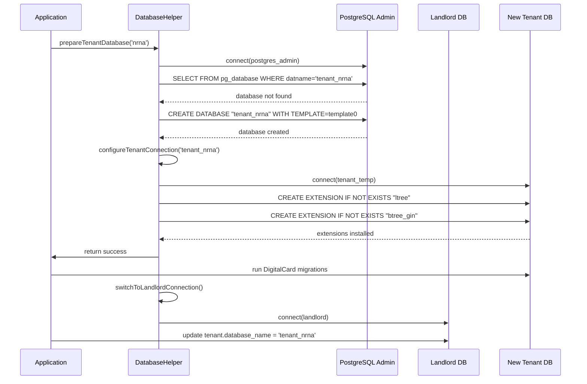
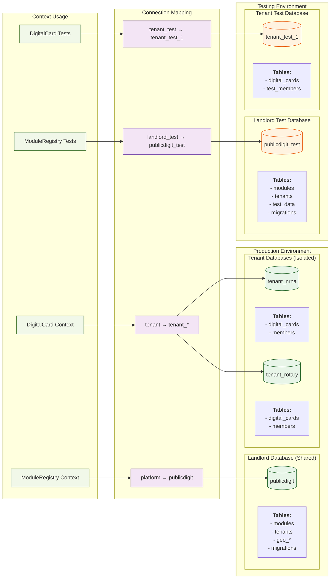

# 🗄️ **DEVELOPER GUIDE: DATABASE CONNECTIONS IN DDD MULTI-TENANT ENVIRONMENT**

## 🎯 **ARCHITECTURE OVERVIEW**

### **Database Strategy by Context Layer**

```
┌─────────────────────────────────────────────────────────────────────────┐
│                         DATABASE ARCHITECTURE                            │
├─────────────────────────────────────────────────────────────────────────┤
│                                                                         │
│  ┌─────────────────┐     ┌─────────────────┐     ┌─────────────────┐   │
│  │    LANDLORD     │     │    POSTGRES     │     │     TENANT      │   │
│  │   DATABASES     │     │    CONNECTIONS  │     │   DATABASES     │   │
│  └─────────────────┘     └─────────────────┘     └─────────────────┘   │
│         │                         │                         │          │
│  • publicdigit      ◄────────►  platform   ◄────────►  tenant_*       │
│  • publicdigit_test ◄────────►  landlord   ◄────────►  tenant_test    │
│                                                           │            │
│                    ┌──────────┬──────────┬──────────┬────┴────┐       │
│                    │          │          │          │         │       │
│                ┌───▼───┐ ┌───▼───┐ ┌───▼───┐ ┌────▼────┐ ┌──▼───┐   │
│                │Module │ │Geography│ │Shared │ │Digital │ │Member│   │
│                │Registry│ │ Context │ │ Config│ │  Card  │ │ship │   │
│                └───────┘ └────────┘ └───────┘ └────────┘ └──────┘   │
│                                                                         │
├─────────────────────────────────────────────────────────────────────────┤
│                          CONTEXT → CONNECTION MAPPING                   │
├─────────────────────────────────────────────────────────────────────────┤
│                                                                         │
│  ModuleRegistry Context    →   platform/landlord/landlord_test          │
│  Geography Context         →   platform/landlord/landlord_test          │
│  DigitalCard Context       →   tenant/tenant_test                       │
│  Membership Context        →   tenant/tenant_test                       │
│  Elections Context         →   tenant/tenant_test                       │
│                                                                         │
└─────────────────────────────────────────────────────────────────────────┘
```

## 🔧 **DATABASE CONNECTIONS CONFIGURATION**

### **1. Production Connections (`config/database.php`)**

```php
'connections' => [
    // ========== LANDLORD/CENTRAL DATABASES ==========
    
    'pgsql' => [  // Spatie Default Landlord Connection
        'driver' => 'pgsql',
        'host' => env('DB_HOST', '127.0.0.1'),
        'port' => env('DB_PORT', '5432'),
        'database' => env('DB_DATABASE', 'publicdigit_landlord'),
        'username' => env('DB_USERNAME', 'postgres'),
        'password' => env('DB_PASSWORD', ''),
        'charset' => 'utf8',
        'search_path' => env('DB_SCHEMA', 'public'),
        'sslmode' => env('DB_SSLMODE', 'prefer'),
    ],
    
    'platform' => [  // Platform Admin Context
        'driver' => 'pgsql',
        'host' => env('DB_HOST', '127.0.0.1'),
        'port' => env('DB_PORT', '5432'),
        'database' => env('DB_DATABASE', 'publicdigit'),
        'username' => env('DB_USERNAME', 'postgres'),
        'password' => env('DB_PASSWORD', ''),
        'charset' => 'utf8',
        'search_path' => env('DB_SCHEMA', 'public'),
        'sslmode' => env('DB_SSLMODE', 'prefer'),
    ],
    
    'landlord' => [  // Geography Context
        'driver' => 'pgsql',
        'host' => env('DB_HOST', '127.0.0.1'),
        'port' => env('DB_PORT', '5432'),
        'database' => env('DB_DATABASE', 'publicdigit'),
        'username' => env('DB_USERNAME', 'postgres'),
        'password' => env('DB_PASSWORD', ''),
        'charset' => 'utf8',
        'search_path' => env('DB_SCHEMA', 'public'),
        'sslmode' => env('DB_SSLMODE', 'prefer'),
    ],
    
    // ========== TENANT DATABASES ==========
    
    'tenant' => [  // Spatie Dynamic Tenant Connection
        'driver' => 'pgsql',
        'host' => env('DB_HOST', '127.0.0.1'),
        'port' => env('DB_PORT', '5432'),
        'database' => env('TENANT_PLACEHOLDER_DB', 'placeholder_tenant_db'),
        'username' => env('DB_USERNAME', 'postgres'),
        'password' => env('DB_PASSWORD', ''),
        'charset' => 'utf8',
        'search_path' => env('DB_SCHEMA', 'public'),
        'sslmode' => env('DB_SSLMODE', 'prefer'),
    ],
    
    'tenant_template' => [  // DatabaseHelper Template
        'driver' => 'pgsql',
        'host' => env('DB_HOST', '127.0.0.1'),
        'port' => env('DB_PORT', '5432'),
        'database' => '', // Dynamic
        'username' => env('DB_USERNAME', 'postgres'),
        'password' => env('DB_PASSWORD', ''),
        'charset' => 'utf8',
        'search_path' => env('DB_SCHEMA', 'public'),
        'sslmode' => env('DB_SSLMODE', 'prefer'),
    ],
    
    // ========== TESTING CONNECTIONS ==========
    
    'landlord_test' => [  // Landlord Testing
        'driver' => env('DB_LANDLORD_CONNECTION', 'pgsql'),
        'host' => env('DB_LANDLORD_HOST', '127.0.0.1'),
        'port' => env('DB_LANDLORD_PORT', '5432'),
        'database' => env('DB_LANDLORD_DATABASE', 'publicdigit_test'),
        'username' => env('DB_LANDLORD_USERNAME', 'publicdigit_user'),
        'password' => env('DB_LANDLORD_PASSWORD', ''),
        'charset' => 'utf8',
        'search_path' => env('DB_LANDLORD_SCHEMA', 'public'),
        'sslmode' => env('DB_LANDLORD_SSLMODE', 'prefer'),
    ],
    
    'tenant_test' => [  // Tenant Testing
        'driver' => env('DB_TENANT_CONNECTION', 'pgsql'),
        'host' => env('DB_TENANT_HOST', '127.0.0.1'),
        'port' => env('DB_TENANT_PORT', '5432'),
        'database' => env('DB_TENANT_DATABASE', 'tenant_test_1'),
        'username' => env('DB_TENANT_USERNAME', 'publicdigit_user'),
        'password' => env('DB_TENANT_PASSWORD', ''),
        'charset' => 'utf8',
        'search_path' => env('DB_TENANT_SCHEMA', 'public'),
        'sslmode' => env('DB_TENANT_SSLMODE', 'prefer'),
    ],
    
    // ========== ADMIN CONNECTIONS ==========
    
    'postgres_admin' => [  // Database Creation
        'driver' => 'pgsql',
        'host' => env('DB_HOST', '127.0.0.1'),
        'port' => env('DB_PORT', '5432'),
        'database' => 'postgres', // PostgreSQL admin database
        'username' => env('DB_ADMIN_USERNAME', env('DB_USERNAME', 'postgres')),
        'password' => env('DB_ADMIN_PASSWORD', env('DB_PASSWORD', '')),
        'charset' => 'utf8',
        'search_path' => 'public',
        'sslmode' => env('DB_SSLMODE', 'prefer'),
    ],
],
```

### **2. Environment Configuration (`.env`)**

```env
# ========== PRODUCTION DATABASES ==========
# PostgreSQL Production Databases
DB_CONNECTION=pgsql
DB_HOST=127.0.0.1
DB_PORT=5432
DB_DATABASE=publicdigit
DB_USERNAME=publicdigit_user
DB_PASSWORD=Rudolfvogt%27%
DB_SCHEMA=public
DB_SSLMODE=prefer

# Tenant Database (Spatie placeholder)
TENANT_PLACEHOLDER_DB=placeholder_tenant_db

# Admin Credentials (Database creation)
DB_ADMIN_USERNAME=postgres
DB_ADMIN_PASSWORD=Devkota@1?

# PostgreSQL Extensions
DB_ENABLE_EXTENSIONS=ltree,btree_gin
```

### **3. Testing Configuration (`.env.testing`)**

```env
# ========== TESTING DATABASES ==========
# Landlord Test Database (shared geography data)
DB_LANDLORD_CONNECTION=pgsql
DB_LANDLORD_DATABASE=publicdigit_test
DB_LANDLORD_HOST=127.0.0.1
DB_LANDLORD_PORT=5432
DB_LANDLORD_USERNAME=publicdigit_user
DB_LANDLORD_PASSWORD=Rudolfvogt%27%
DB_LANDLORD_SCHEMA=public
DB_LANDLORD_SSLMODE=prefer

# Tenant Test Database (tenant-specific data)
DB_TENANT_CONNECTION=pgsql
DB_TENANT_DATABASE=tenant_test_1
DB_TENANT_HOST=127.0.0.1
DB_TENANT_PORT=5432
DB_TENANT_USERNAME=publicdigit_user
DB_TENANT_PASSWORD=Rudolfvogt%27%
DB_TENANT_SCHEMA=public
DB_TENANT_SSLMODE=prefer

# Backward Compatibility
DB_CONNECTION=pgsql
DB_DATABASE=publicdigit_test
TEST_DB_DATABASE=publicdigit_test
```

## 🏗️ **CONTEXT IMPLEMENTATION PATTERNS**

### **Pattern 1: Landlord Context (ModuleRegistry, Geography)**

**Database:** `publicdigit` (production) / `publicdigit_test` (testing)  
**Connection:** `platform`, `landlord`, or `landlord_test`

```php
// app/Contexts/ModuleRegistry/Infrastructure/Persistence/EloquentModuleRepository.php
namespace App\Contexts\ModuleRegistry\Infrastructure\Persistence;

use Illuminate\Support\Facades\DB;

class EloquentModuleRepository implements ModuleRepositoryInterface
{
    private function getConnection(): \Illuminate\Database\Connection
    {
        // Use appropriate landlord connection
        $connectionName = app()->environment('testing') 
            ? 'landlord_test' 
            : 'platform'; // or 'landlord'
            
        return DB::connection($connectionName);
    }
    
    public function save(Module $module): void
    {
        $connection = $this->getConnection();
        $connection->transaction(function () use ($connection, $module) {
            // Save to landlord database
            $connection->table('modules')->insert([
                'id' => $module->id()->toString(),
                'name' => $module->name()->toString(),
                'tenant_id' => $module->tenantId()->toString(), // If applicable
                // ... other fields
            ]);
        });
    }
}
```

### **Pattern 2: Tenant Context (DigitalCard, Membership, Elections)**

**Database:** `tenant_*` (dynamic) / `tenant_test_1` (testing)  
**Connection:** `tenant` (Spatie) or `tenant_test`

```php
// app/Contexts/DigitalCard/Infrastructure/Persistence/EloquentDigitalCardRepository.php
namespace App\Contexts\DigitalCard\Infrastructure\Persistence;

use Illuminate\Support\Facades\DB;

class EloquentDigitalCardRepository implements DigitalCardRepositoryInterface
{
    private function getConnection(): \Illuminate\Database\Connection
    {
        // Spatie manages tenant switching in production
        // For testing, use tenant_test connection
        $connectionName = app()->environment('testing') 
            ? 'tenant_test' 
            : 'tenant';
            
        return DB::connection($connectionName);
    }
    
    public function save(DigitalCard $card): void
    {
        $connection = $this->getConnection();
        $connection->transaction(function () use ($connection, $card) {
            // Save to tenant database
            $connection->table('digital_cards')->insert([
                'id' => $card->id()->toString(),
                'tenant_id' => $card->tenantId()->toString(), // REQUIRED: Golden Rule #1
                'member_id' => $card->memberId()->toString(),
                // ... other fields
            ]);
        });
    }
}
```

## 🧪 **TESTING STRATEGIES**

### **Strategy 1: Landlord Context Testing (ModuleRegistry)**

```php
// tests/Feature/Contexts/ModuleRegistry/ModuleCatalogApiTest.php
namespace Tests\Feature\Contexts\ModuleRegistry\Desktop;

use Tests\TestCase;

class ModuleCatalogApiTest extends TestCase
{
    protected function setUp(): void
    {
        parent::setUp();
        
        // Set landlord test connection
        config(['database.default' => 'landlord_test']);
        
        // Run ONLY ModuleRegistry migrations
        $this->artisan('migrate', [
            '--path' => 'app/Contexts/ModuleRegistry/Infrastructure/Database/Migrations',
            '--database' => 'landlord_test',
            '--realpath' => true,
        ]);
        
        // Mock authentication
        $this->withoutMiddleware();
    }
    
    // Tests will mock Query classes, not need database
    public function test_platform_admin_can_list_all_modules(): void
    {
        // Mock GetAllModulesQuery
        $this->mock(GetAllModulesQuery::class)
            ->shouldReceive('execute')
            ->andReturn($collectionDTO);
        
        // Test API call
        $response = $this->getJson('/api/v1/platform/modules');
        $response->assertOk();
    }
}
```

### **Strategy 2: Tenant Context Testing (DigitalCard)**

```php
// tests/Feature/Contexts/DigitalCard/DigitalCardTest.php
namespace Tests\Feature\Contexts\DigitalCard;

use Tests\TestCase;

class DigitalCardTest extends TestCase
{
    use RefreshDatabase;
    
    protected function beforeRefreshingDatabase(): void
    {
        // CRITICAL: Set tenant test connection BEFORE refresh
        config(['database.default' => 'tenant_test']);
    }
    
    protected function migrateFreshUsing(): array
    {
        return [
            // Installer creates tables programmatically
            '--database' => 'tenant_test',
            '--realpath' => true,
        ];
    }
    
    public function test_can_issue_digital_card(): void
    {
        // Test with real database (tenant_test)
        $tenant = Tenant::factory()->create();
        $tenant->makeCurrent();
        
        $response = $this->actingAs($member)
            ->postJson("/{$tenant->slug}/api/v1/cards");
            
        $response->assertCreated();
    }
}
```

## 🛠️ **DATABASEHELPER INTEGRATION**

### **Dynamic Tenant Database Creation**

```php
// app/Helpers/DatabaseHelper.php (Integrate with your existing file)
namespace App\Helpers;

class DatabaseHelper
{
    /**
     * Create tenant database for module installation
     */
    public static function prepareTenantDatabase(string $tenantSlug): bool
    {
        $databaseName = "tenant_{$tenantSlug}";
        
        // 1. Check if database exists
        if (self::databaseExists($databaseName)) {
            return true;
        }
        
        // 2. Create database using admin connection
        config(['database.default' => 'postgres_admin']);
        DB::statement("CREATE DATABASE \"{$databaseName}\" WITH TEMPLATE = template0 ENCODING = 'UTF8'");
        
        // 3. Install extensions
        self::installExtensions($databaseName);
        
        // 4. Switch to tenant connection
        self::configureTenantConnection($databaseName);
        
        return true;
    }
    
    /**
     * Configure connection for tenant database
     */
    public static function configureTenantConnection(string $databaseName): void
    {
        // Get template config
        $config = config('database.connections.tenant_template');
        $config['database'] = $databaseName;
        
        // Register temporary connection
        config(['database.connections.tenant_temp' => $config]);
        config(['database.default' => 'tenant_temp']);
        
        DB::purge('tenant_temp');
        DB::reconnect('tenant_temp');
    }
}
```

### **Module Installation Flow with DatabaseHelper**

```php
// app/Contexts/DigitalCard/Infrastructure/Installation/DigitalCardModuleInstaller.php
class DigitalCardModuleInstaller implements ModuleInstallerInterface
{
    public function install(TenantId $tenantId): void
    {
        $tenantSlug = $this->tenantRepository->findSlugById($tenantId);
        
        // 1. Ensure tenant database exists
        DatabaseHelper::prepareTenantDatabase($tenantSlug);
        
        // 2. Create tenant-specific tables
        DB::schema()->create('digital_cards', function ($table) {
            $table->uuid('id')->primary();
            $table->uuid('tenant_id'); // Golden Rule #1
            $table->uuid('member_id');
            $table->string('qr_code')->unique();
            $table->string('status')->default('active');
            $table->timestamps();
            
            $table->index(['tenant_id', 'member_id']);
        });
        
        // 3. Switch back to landlord
        DatabaseHelper::switchToLandlordConnection();
    }
}
```

## 📁 **MIGRATION ORGANIZATION**

```
database/migrations/                    # Legacy/global migrations (avoid adding new)
  2024_*_create_users_table.php        # Platform users
  2024_*_create_tenants_table.php      # Tenant registry

app/Contexts/
├── ModuleRegistry/
│   └── Infrastructure/
│       └── Database/
│           └── Migrations/            # Landlord migrations
│               2025_12_28_000001_create_modules_table.php
│               2025_12_28_000002_create_tenant_modules_table.php
│
├── Geography/
│   └── Infrastructure/
│       └── Database/
│           └── Migrations/            # Landlord migrations
│               2025_*_create_geo_administrative_units.php
│               2025_*_create_geo_candidate_units.php
│
└── DigitalCard/
    └── Infrastructure/
        └── Database/
            └── Migrations/
                └── Tenant/            # Tenant-specific migrations
                    2025_*_create_digital_cards_table.php
                    2025_*_create_card_activities_table.php
```

## 🚨 **CRITICAL GOLDEN RULES**

### **Rule 1: Tenant Aggregates MUST Have tenantId**
```php
// ✅ CORRECT
class DigitalCard
{
    private TenantId $tenantId; // REQUIRED
    
    public function belongsToTenant(TenantId $tenantId): bool
    {
        return $this->tenantId->equals($tenantId);
    }
}
```

### **Rule 2: Context → Connection Mapping**
- **Landlord Contexts** → Use `platform`, `landlord`, or `landlord_test`
- **Tenant Contexts** → Use `tenant` (Spatie) or `tenant_test`
- **Never mix** landlord and tenant data in same connection

### **Rule 3: Testing Database Isolation**
```php
// ✅ Landlord tests use landlord_test
config(['database.default' => 'landlord_test']);

// ✅ Tenant tests use tenant_test  
config(['database.default' => 'tenant_test']);

// ❌ NEVER use default connection in tests
// config(['database.default' => 'pgsql']); // WRONG
```

### **Rule 4: Migration Path Separation**
- Landlord migrations in context's `Infrastructure/Database/Migrations/`
- Tenant migrations in context's `Infrastructure/Database/Migrations/Tenant/`
- Global migrations in `database/migrations/` (legacy only)

## 🔍 **TROUBLESHOOTING**

### **Issue: "geo_administrative_units doesn't exist"**
**Cause:** Migration order issue in landlord_test database
**Solution:** Fix geography migration order or isolate ModuleRegistry tests

```bash
# Option A: Isolate ModuleRegistry tests
createdb module_registry_test_only
# Update .env.testing: DB_LANDLORD_DATABASE=module_registry_test_only

# Option B: Fix migration order
mv database/migrations/2025_*_create_geo_candidate_units.php \
   database/migrations/2025_*_create_geo_candidate_units_TEMP.php
# Ensure create_geo_administrative_units runs first
```

### **Issue: "Tenant database connection failed"**
**Cause:** Spatie not switching or missing tenant database
**Solution:** Use DatabaseHelper to create tenant database

```php
// In test setup
DatabaseHelper::prepareTenantDatabase('test_tenant');
$tenant = Tenant::factory()->create(['slug' => 'test_tenant']);
$tenant->makeCurrent();
```

### **Issue: "Foreign key violation"**
**Cause:** Tenant data references landlord data that doesn't exist
**Solution:** Seed landlord data first in tests

```php
protected function setUp(): void
{
    parent::setUp();
    
    // 1. Setup landlord data
    config(['database.default' => 'landlord_test']);
    $this->seedLandlordData();
    
    // 2. Setup tenant data  
    config(['database.default' => 'tenant_test']);
    $this->seedTenantData();
}
```

## 🏁 **QUICK START CHECKLIST**

### **For New Landlord Context (like ModuleRegistry):**
- [ ] Use `platform`/`landlord` connection in repositories
- [ ] Place migrations in `Infrastructure/Database/Migrations/`
- [ ] Configure tests to use `landlord_test` connection
- [ ] Mock authentication in API tests

### **For New Tenant Context (like DigitalCard):**
- [ ] Use `tenant` connection (Spatie managed) in repositories
- [ ] All aggregates must have `tenantId` property
- [ ] Place migrations in `Infrastructure/Database/Migrations/Tenant/`
- [ ] Create `ModuleInstaller` using DatabaseHelper
- [ ] Configure tests to use `tenant_test` connection

### **For Database Operations:**
- [ ] Use `postgres_admin` connection for database creation
- [ ] Use DatabaseHelper for tenant database management
- [ ] Install required PostgreSQL extensions
- [ ] Handle connection switching gracefully

---

**Remember:** This architecture enables true SaaS multi-tenancy where:
1. ✅ **Landlord contexts** share `publicdigit` database
2. ✅ **Tenant contexts** get isolated `tenant_*` databases  
3. ✅ **Testing is isolated** with separate test databases
4. ✅ **Module installation** dynamically creates tenant schemas
5. ✅ **Hexagonal architecture** is maintained throughout

```mermaid 
---
config:
  layout: elk
---
flowchart TB
 subgraph subGraph0["Configuration Files"]
        ConfigDB["config/database.php"]
        EnvProd[".env"]
        EnvTest[".env.testing"]
  end
 subgraph subGraph1["Database Connections"]
        PlatformDB[("publicdigit<br>Landlord DB")]
        LandlordTestDB[("publicdigit_test<br>Landlord Test DB")]
        TenantDB_1[("tenant_nrna<br>Tenant DB")]
        TenantDB_2[("tenant_rotary<br>Tenant DB")]
        TenantTestDB[("tenant_test_1<br>Tenant Test DB")]
  end
 subgraph subGraph2["Production Connections"]
        PlatformConn["platform connection"]
        LandlordConn["landlord connection"]
        TenantConn["tenant connection"]
  end
 subgraph subGraph3["Testing Connections"]
        LandlordTestConn["landlord_test connection"]
        TenantTestConn["tenant_test connection"]
  end
 subgraph DatabaseHelper["DatabaseHelper"]
        DBHelper["DatabaseHelper Class"]
        AdminConn["postgres_admin connection"]
  end
 subgraph subGraph5["Bounded Contexts"]
        ModuleRegistry["ModuleRegistry Context"]
        Geography["Geography Context"]
        DigitalCard["DigitalCard Context"]
  end
    ConfigDB --> PlatformConn & LandlordConn & TenantConn & LandlordTestConn & TenantTestConn & AdminConn
    EnvProd --> PlatformDB & TenantDB_1 & TenantDB_2
    EnvTest --> LandlordTestDB & TenantTestDB
    PlatformConn --> PlatformDB
    LandlordConn --> PlatformDB
    LandlordTestConn --> LandlordTestDB
    TenantConn --> TenantDB_1 & TenantDB_2
    TenantTestConn --> TenantTestDB
    DBHelper --> AdminConn
    AdminConn --> PostgreSQL[("PostgreSQL<br>Admin Database")]
    DBHelper -. create_database .-> TenantDB_1 & TenantDB_2
    ModuleRegistry --> PlatformConn
    Geography --> LandlordConn
    DigitalCard --> TenantConn
    ModuleRegistry -.-> LandlordTestConn
    Geography -.-> LandlordTestConn
    DigitalCard -.-> TenantTestConn

     ConfigDB:::config
     EnvProd:::config
     EnvTest:::config
     PlatformDB:::productionDB
     LandlordTestDB:::testDB
     TenantDB_1:::productionDB
     TenantDB_2:::productionDB
     TenantTestDB:::testDB
     PlatformConn:::connection
     LandlordConn:::connection
     TenantConn:::connection
     LandlordTestConn:::connection
     TenantTestConn:::connection
     AdminConn:::admin
     ModuleRegistry:::context
     Geography:::context
     DigitalCard:::context
     PostgreSQL:::admin
    classDef config fill:#e1f5fe,stroke:#01579b
    classDef connection fill:#f3e5f5,stroke:#4a148c
    classDef productionDB fill:#e8f5e8,stroke:#1b5e20
    classDef testDB fill:#fff3e0,stroke:#e65100
    classDef admin fill:#ffebee,stroke:#b71c1c
    classDef context fill:#f1f8e9,stroke:#33691e
    style DatabaseHelper fill:#FFF9C4
    style subGraph2 fill:#C8E6C9
    style subGraph1 fill:#FFD600
    style subGraph5 fill:#FFCDD2
    style subGraph0 fill:#FFE0B2
    style subGraph3 fill:#E1BEE7
    ````  
    # 🗺️ **ARCHITECTURE DIAGRAMS & DATABASE CONFIGURATION**

## 🔧 **WHERE DATABASES ARE DEFINED**

### **1. **Configuration Files:**
```
config/database.php                    # Database connections definitions
.env                                   # Production database credentials  
.env.testing                           # Testing database credentials
config/multitenancy.php (optional)     # Multi-tenancy specific config
```

### **2. **Connection Definitions in `config/database.php`:**
```php
'connections' => [
    // ========== PRODUCTION CONNECTIONS ==========
    'platform' => [                    // ModuleRegistry Context
        'database' => env('DB_DATABASE', 'publicdigit'),
    ],
    'landlord' => [                    // Geography Context  
        'database' => env('DB_DATABASE', 'publicdigit'),
    ],
    'tenant' => [                      // Spatie Tenant Connection
        'database' => env('TENANT_PLACEHOLDER_DB', 'placeholder_tenant_db'),
    ],
    
    // ========== TESTING CONNECTIONS ==========
    'landlord_test' => [               // Landlord Testing
        'database' => env('DB_LANDLORD_DATABASE', 'publicdigit_test'),
    ],
    'tenant_test' => [                 // Tenant Testing
        'database' => env('DB_TENANT_DATABASE', 'tenant_test_1'),
    ],
    
    // ========== ADMIN CONNECTION ==========
    'postgres_admin' => [              // Database Creation
        'database' => 'postgres',      // PostgreSQL admin DB
    ],
],
```

### **3. **Environment Variables:**
```env
# .env (Production)
DB_DATABASE=publicdigit
TENANT_PLACEHOLDER_DB=placeholder_tenant_db

# .env.testing (Testing)  
DB_LANDLORD_DATABASE=publicdigit_test      # Separate test database
DB_TENANT_DATABASE=tenant_test_1           # Separate test database
```

## 🏗️ **ARCHITECTURE DIAGRAM**

```mermaid
graph TB
    %% ========== CONFIGURATION LAYER ==========
    subgraph "Configuration Files"
        ConfigDB[config/database.php]
        EnvProd[.env]
        EnvTest[.env.testing]
    end
    
    %% ========== DATABASE CONNECTIONS ==========
    subgraph "Database Connections"
        PlatformDB[(publicdigit<br/>Landlord DB)]
        LandlordTestDB[(publicdigit_test<br/>Landlord Test DB)]
        
        TenantDB_1[(tenant_nrna<br/>Tenant DB)]
        TenantDB_2[(tenant_rotary<br/>Tenant DB)]
        TenantTestDB[(tenant_test_1<br/>Tenant Test DB)]
    end
    
    %% ========== PRODUCTION CONNECTIONS ==========
    subgraph "Production Connections"
        PlatformConn[platform connection]
        LandlordConn[landlord connection]
        TenantConn[tenant connection]
    end
    
    %% ========== TESTING CONNECTIONS ==========
    subgraph "Testing Connections"
        LandlordTestConn[landlord_test connection]
        TenantTestConn[tenant_test connection]
    end
    
    %% ========== DATABASE HELPER ==========
    subgraph "DatabaseHelper"
        DBHelper[DatabaseHelper Class]
        AdminConn[postgres_admin connection]
    end
    
    %% ========== CONTEXTS ==========
    subgraph "Bounded Contexts"
        ModuleRegistry[ModuleRegistry Context]
        Geography[Geography Context]
        DigitalCard[DigitalCard Context]
    end
    
    %% ========== CONNECTIONS ==========
    %% Configuration ‚Üí Connections
    ConfigDB --> PlatformConn
    ConfigDB --> LandlordConn
    ConfigDB --> TenantConn
    ConfigDB --> LandlordTestConn
    ConfigDB --> TenantTestConn
    ConfigDB --> AdminConn
    
    %% Environment ‚Üí Database Names
    EnvProd --> PlatformDB
    EnvProd --> TenantDB_1
    EnvProd --> TenantDB_2
    
    EnvTest --> LandlordTestDB
    EnvTest --> TenantTestDB
    
    %% Connections ‚Üí Databases
    PlatformConn --> PlatformDB
    LandlordConn --> PlatformDB
    LandlordTestConn --> LandlordTestDB
    
    TenantConn --> TenantDB_1
    TenantConn --> TenantDB_2
    TenantTestConn --> TenantTestDB
    
    %% DatabaseHelper ‚Üí Admin Connection
    DBHelper --> AdminConn
    AdminConn --> PostgreSQL[(PostgreSQL<br/>Admin Database)]
    
    %% DatabaseHelper creates Tenant DBs
    DBHelper -.->|create_database| TenantDB_1
    DBHelper -.->|create_database| TenantDB_2
    
    %% ========== CONTEXT MAPPING ==========
    %% Landlord Contexts
    ModuleRegistry --> PlatformConn
    Geography --> LandlordConn
    
    %% Tenant Contexts
    DigitalCard --> TenantConn
    
    %% Testing Contexts
    ModuleRegistry -.-> LandlordTestConn
    Geography -.-> LandlordTestConn
    DigitalCard -.-> TenantTestConn
    
    %% ========== STYLING ==========
    classDef config fill:#e1f5fe,stroke:#01579b
    classDef connection fill:#f3e5f5,stroke:#4a148c
    classDef productionDB fill:#e8f5e8,stroke:#1b5e20
    classDef testDB fill:#fff3e0,stroke:#e65100
    classDef admin fill:#ffebee,stroke:#b71c1c
    classDef context fill:#f1f8e9,stroke:#33691e
    
    class ConfigDB,EnvProd,EnvTest config
    class PlatformConn,LandlordConn,TenantConn,LandlordTestConn,TenantTestConn connection
    class PlatformDB,TenantDB_1,TenantDB_2 productionDB
    class LandlordTestDB,TenantTestDB testDB
    class AdminConn,PostgreSQL admin
    class ModuleRegistry,Geography,DigitalCard context
```



## 🔄 **DATABASE HELPER WORKFLOW**



## 📊 **TESTING VS PRODUCTION DATABASE SEPARATION**



## 📋 **SUMMARY: SEPARATION OF CONCERNS**

### **1. **Configuration Location:**
- **Connections defined in:** `config/database.php`
- **Database names in:** `.env` (production) & `.env.testing` (testing)
- **Separate databases ensure:** No test data pollutes production

### **2. **Production Databases:**
```
publicdigit          ← platform/landlord connections
tenant_nrna          ← tenant connection (Spatie switches dynamically)
tenant_rotary        ← tenant connection
```

### **3. **Testing Databases:**
```
publicdigit_test     ← landlord_test connection (isolated testing)
tenant_test_1        ← tenant_test connection (isolated testing)
```

### **4. **DatabaseHelper's Role:**
- **Creates** tenant databases on-demand
- **Installs** PostgreSQL extensions
- **Manages** connection switching
- **Uses** `postgres_admin` connection for superuser operations

### **5. **Key Architecture Principle:**
```php
// Production Contexts → Production Databases
ModuleRegistry  → platform → publicdigit
DigitalCard     → tenant  → tenant_* (dynamic)

// Testing Contexts → Testing Databases  
ModuleRegistry Tests → landlord_test → publicdigit_test
DigitalCard Tests    → tenant_test  → tenant_test_1

// NEVER mix production and test databases!
```

## 🚀 **VERIFICATION COMMANDS:**

```bash
# 1. Check production connections
php artisan tinker --execute="
echo 'Platform DB: ' . DB::connection('platform')->getDatabaseName();
echo 'Tenant placeholder: ' . DB::connection('tenant')->getDatabaseName();
"

# 2. Check testing connections  
php artisan tinker --env=testing --execute="
echo 'Landlord Test DB: ' . DB::connection('landlord_test')->getDatabaseName();
echo 'Tenant Test DB: ' . DB::connection('tenant_test')->getDatabaseName();
"

# 3. Verify PostgreSQL databases exist
sudo -u postgres psql -c "\l" | grep -E "(publicdigit|tenant_)"

# 4. Check test databases
sudo -u postgres psql -c "\l" | grep -E "(publicdigit_test|tenant_test)"
```

**This architecture ensures:** ✅ **Production data safety** ✅ **Test isolation** ✅ **Multi-tenancy scalability** ✅ **Hexagonal boundaries maintained**