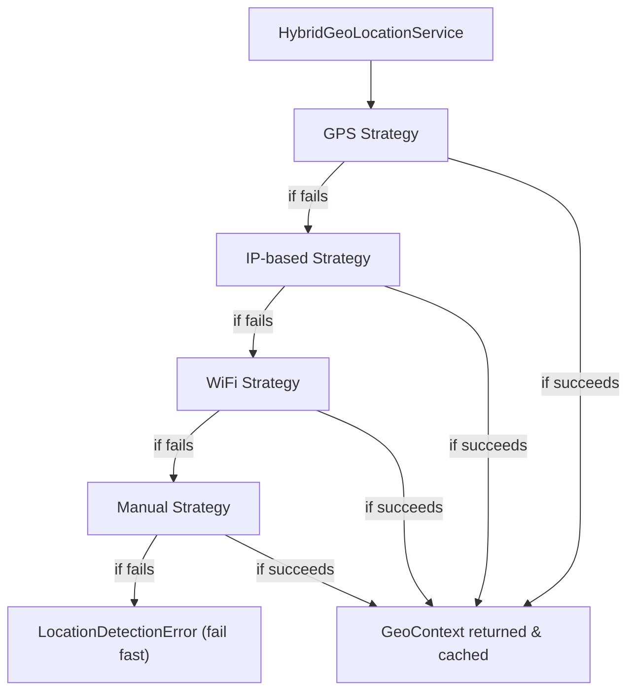

# 🌍 GeoLocation Module - Bhojan Shop Platform

This module provides a clean, extensible, and reactive architecture for detecting, validating, and managing the user's location. It's built using **Hexagonal Architecture**, **DDD principles**, and **Angular DI best practices**, optimized for global restaurant applications.

---

## 📦 Key Responsibilities

* Detects user location using a hybrid chain (GPS → IP → WiFi → Manual)
* Validates location against serviceable countries/cities
* Exposes reactive streams for Angular components
* Caches and reuses detected location efficiently
* Supports manual override and fallback

---

## 📁 Folder Structure

```text
src/app/geo/
├── domain/             # Business logic (entities, ports, services)
│   ├── entities/
│   ├── ports/
│   └── services/
├── application/        # Facades and detection orchestrators
│   ├── facade/         # GeoLocationFacade (public API)
│   └── services/       # HybridGeoLocationService, caching
├── infrastructure/     # Concrete detection implementations
│   ├── adapters/       # GPS, IP, WiFi, Manual strategies
│   └── repositories/   # HttpGeoRepository
└── geo-location.module.ts
```

---

## 🧩 Core Components

### 1. **GeoLocationFacade** (Public API)

```ts
// Injected into Angular components
geoFacade.state$       // Full observable state
geoFacade.detectLocation() // Starts detection chain
geoFacade.setManualLocation(context) // Manual override
```

* Exposes current location (`GeoContext`) as observable
* Encapsulates validation, fallback, and error handling
* Internally delegates to `HybridGeoLocationService`
* Designed for reactive Angular UIs (standalone components, bindings)

### 2. **HybridGeoLocationService** (Strategy Orchestrator)

* Executes multi-step detection logic:

    1. `GpsStrategy`
    2. `IpwhoisGeoLocationAdapter`
    3. `WifiContextBuilderService`
    4. `ManualDetectionStrategy`

* Follows **Chain of Responsibility** pattern

* Returns first successful `GeoContext`

* Completely decoupled from UI (framework-agnostic)

* Injected into facade to centralize logic

### 3. **GeoValidator**

* Ensures only supported countries/cities are accepted
* Used both in auto and manual flows

### 4. **GeoCacheService**

* Stores latest successful context
* Prevents redundant detection
* Used automatically unless `forceRefresh = true`

---

## 🔁 Detection Flow Diagram



---

## ✅ Benefits

| Benefit                   | Description                                    |
| ------------------------- | ---------------------------------------------- |
| 🔌 Extensible Strategies  | Add new sources (e.g. 5G, WiFi triangulation)  |
| 🧼 Separation of Concerns | Business, infrastructure, and UI are decoupled |
| 🧪 Testable               | Each strategy and service is unit-testable     |
| 🌐 Ready for Localization | Multi-country, multi-city aware                |
| 🔄 Reactive UI Updates    | Ideal for standalone components and loaders    |

---

## 🧪 Example Usage

```ts
// Component
constructor(private geo: GeoLocationFacade) {}

ngOnInit() {
  this.geo.detectLocation().subscribe();
}

get location$(): Observable<GeoContext | null> {
  return this.geo.currentContext$;
}
```

```html
<!-- Template -->
<div *ngIf="geo.state$ | async as state">
  <p *ngIf="state.status === 'loading'">Detecting location...</p>
  <p *ngIf="state.context">City: {{ state.context.city.name }}</p>
  <p *ngIf="state.error">Error: {{ state.error }}</p>
</div>
```

---

## 🔧 Configuration Checklist

* [x] Register `GeoLocationFacade` as `GEO_LOCATION_PORT`
* [x] Provide all strategy adapters in `geo-location.module.ts`
* [x] Import `HttpClientModule` for IP and repository lookups

---

## 📚 Future Extensions

* Add continent/region context resolution
* Support indoor WiFi triangulation with signal strength
* Offline detection fallback using stored preferences
* GDPR-compliant location consent flow

---

## 🧠 Credits & Authors

Developed as part of the **Bhojan Shop** platform architecture — enabling scalable, location-aware food discovery for 2M+ restaurants across the world.

Maintained by the core platform team.
